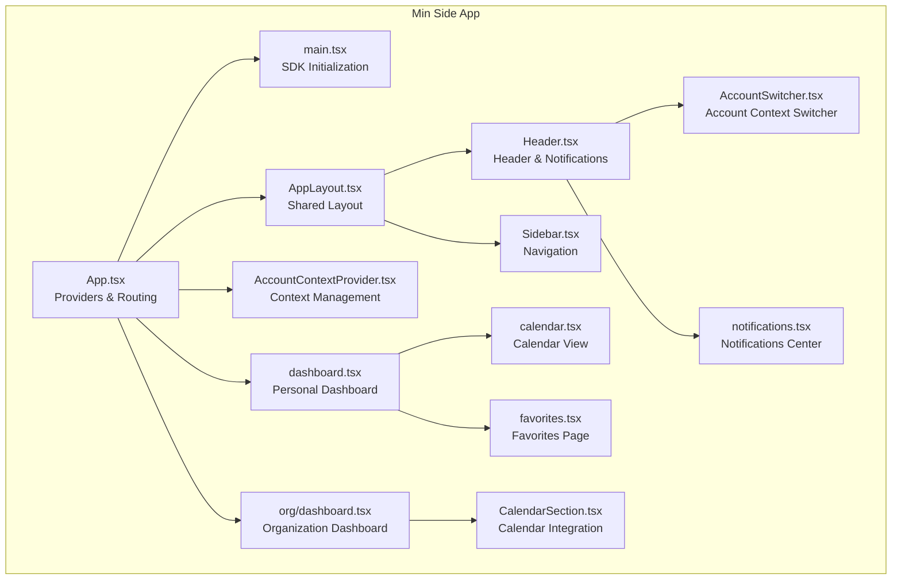
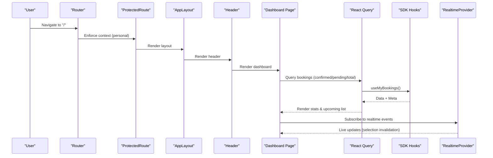
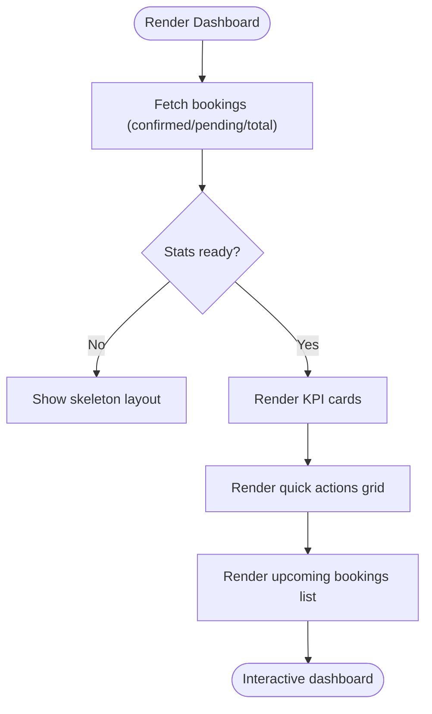
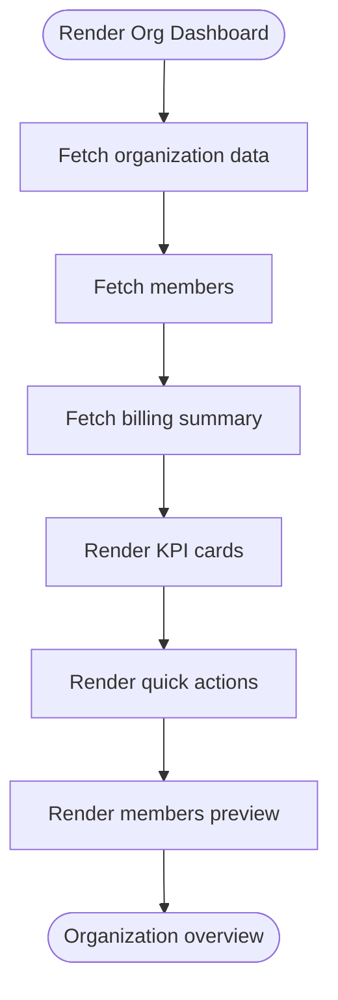
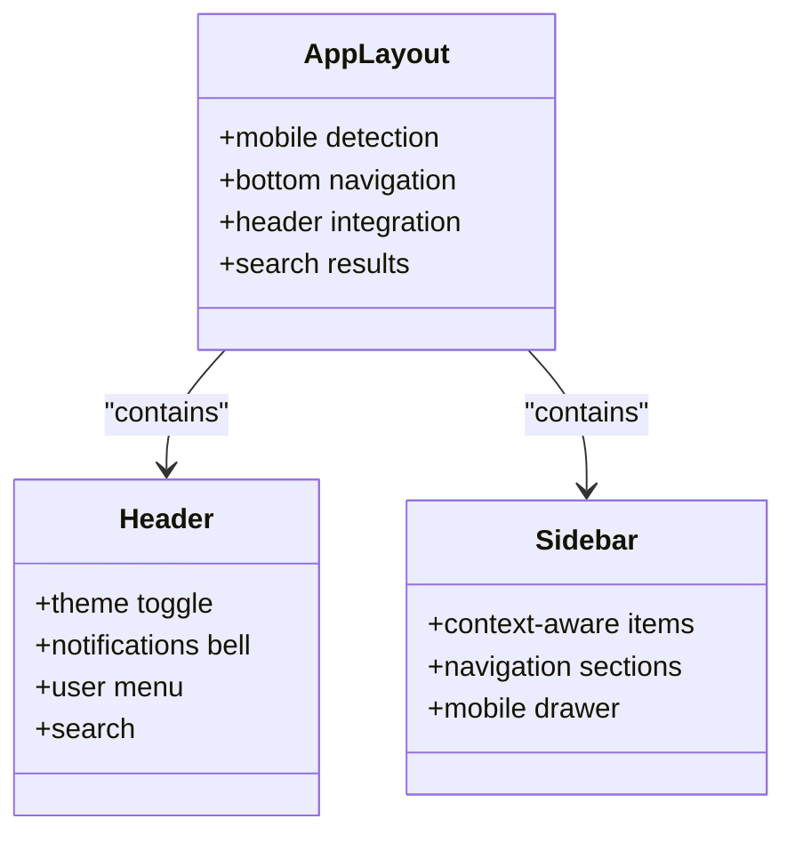
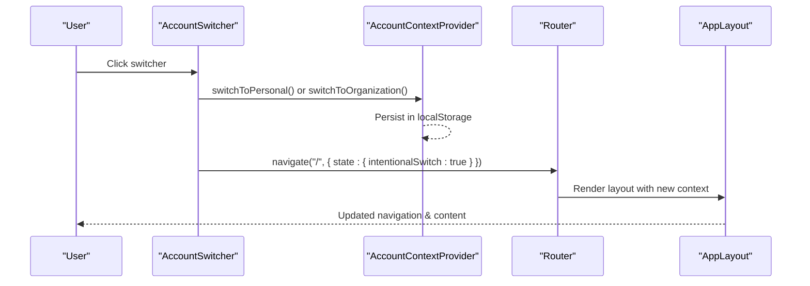
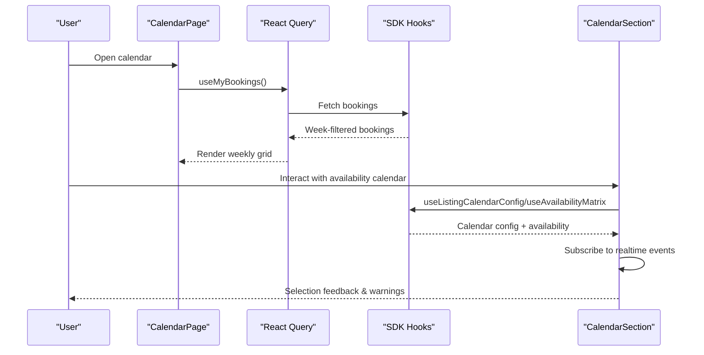
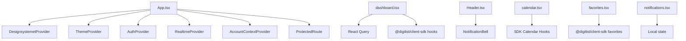

# Dashboard Interface

<cite>
**Referenced Files in This Document**
- [App.tsx](file://apps/minside/src/App.tsx)
- [main.tsx](file://apps/minside/src/main.tsx)
- [dashboard.tsx](file://apps/minside/src/routes/dashboard.tsx)
- [org/dashboard.tsx](file://apps/minside/src/routes/org/dashboard.tsx)
- [AccountContextProvider.tsx](file://apps/minside/src/providers/AccountContextProvider.tsx)
- [AppLayout.tsx](file://apps/minside/src/components/layout/AppLayout.tsx)
- [Header.tsx](file://apps/minside/src/components/layout/Header.tsx)
- [Sidebar.tsx](file://apps/minside/src/components/layout/Sidebar.tsx)
- [AccountSwitcher.tsx](file://apps/minside/src/components/AccountSwitcher.tsx)
- [calendar.tsx](file://apps/minside/src/routes/calendar.tsx)
- [favorites.tsx](file://apps/minside/src/routes/favorites.tsx)
- [notifications.tsx](file://apps/minside/src/routes/notifications.tsx)
- [CalendarSection.tsx](file://apps/minside/src/components/CalendarSection.tsx)
</cite>

## Table of Contents
1. [Introduction](#introduction)
2. [Project Structure](#project-structure)
3. [Core Components](#core-components)
4. [Architecture Overview](#architecture-overview)
5. [Detailed Component Analysis](#detailed-component-analysis)
6. [Dependency Analysis](#dependency-analysis)
7. [Performance Considerations](#performance-considerations)
8. [Troubleshooting Guide](#troubleshooting-guide)
9. [Conclusion](#conclusion)

## Introduction
This document describes the Min Side dashboard interface and tenant dashboard functionality. It covers the personal dashboard layout, KPI widgets, recent activity display, and quick access controls. It also documents the organization dashboard features, including team metrics, booking summaries, and administrative shortcuts. The dashboard context switching between personal and organization views is explained, along with calendar integration, favorite properties display, and notification center integration. Responsive design patterns, theme integration, and accessibility features are documented, as well as dashboard data loading patterns and real-time updates through WebSocket connections.

## Project Structure
The Min Side application is organized as a React single-page application with a design system provider, routing, and context providers. The dashboard is implemented as two separate pages: a personal dashboard and an organization dashboard. Navigation is handled by a shared layout with a sidebar and header, while account context switching is centralized in a provider and exposed via a dedicated component.

**Diagram sources**
- [App.tsx](file://apps/minside/src/App.tsx#L103-L183)
- [main.tsx](file://apps/minside/src/main.tsx#L1-L40)
- [AppLayout.tsx](file://apps/minside/src/components/layout/AppLayout.tsx#L116-L323)
- [Header.tsx](file://apps/minside/src/components/layout/Header.tsx#L100-L383)
- [Sidebar.tsx](file://apps/minside/src/components/layout/Sidebar.tsx#L318-L498)
- [AccountSwitcher.tsx](file://apps/minside/src/components/AccountSwitcher.tsx#L71-L414)
- [AccountContextProvider.tsx](file://apps/minside/src/providers/AccountContextProvider.tsx#L83-L333)
- [dashboard.tsx](file://apps/minside/src/routes/dashboard.tsx#L28-L534)
- [org/dashboard.tsx](file://apps/minside/src/routes/org/dashboard.tsx#L70-L322)
- [calendar.tsx](file://apps/minside/src/routes/calendar.tsx#L28-L254)
- [favorites.tsx](file://apps/minside/src/routes/favorites.tsx#L38-L369)
- [notifications.tsx](file://apps/minside/src/routes/notifications.tsx#L27-L231)
- [CalendarSection.tsx](file://apps/minside/src/components/CalendarSection.tsx#L155-L374)

**Section sources**
- [App.tsx](file://apps/minside/src/App.tsx#L103-L183)
- [main.tsx](file://apps/minside/src/main.tsx#L1-L40)

## Core Components
- App shell and providers: Initializes theme, i18n, design system, authentication, realtime, and account context. Sets up protected routes and context-aware routing.
- Personal dashboard: Presents quick stats (upcoming/pending/total bookings), quick actions, and upcoming bookings list.
- Organization dashboard: Presents KPIs (members, active bookings, outstanding invoices), quick actions, and members preview.
- Layout and navigation: Shared layout with responsive sidebar/header, bottom navigation on mobile, and search.
- Account context: Centralized provider managing personal vs organization mode, persistence, and validation.
- Calendar integration: Personal calendar view and calendar section component for availability.
- Favorites: Grid of saved rental objects with actions.
- Notifications: Center for viewing, filtering, marking read, and clearing notifications.

**Section sources**
- [dashboard.tsx](file://apps/minside/src/routes/dashboard.tsx#L28-L534)
- [org/dashboard.tsx](file://apps/minside/src/routes/org/dashboard.tsx#L70-L322)
- [AppLayout.tsx](file://apps/minside/src/components/layout/AppLayout.tsx#L116-L323)
- [Header.tsx](file://apps/minside/src/components/layout/Header.tsx#L100-L383)
- [Sidebar.tsx](file://apps/minside/src/components/layout/Sidebar.tsx#L318-L498)
- [AccountContextProvider.tsx](file://apps/minside/src/providers/AccountContextProvider.tsx#L83-L333)
- [calendar.tsx](file://apps/minside/src/routes/calendar.tsx#L28-L254)
- [CalendarSection.tsx](file://apps/minside/src/components/CalendarSection.tsx#L155-L374)
- [favorites.tsx](file://apps/minside/src/routes/favorites.tsx#L38-L369)
- [notifications.tsx](file://apps/minside/src/routes/notifications.tsx#L27-L231)

## Architecture Overview
The dashboard architecture follows a layered pattern:
- Presentation layer: Pages and components render UI and orchestrate data fetching.
- Data layer: React Query manages caching, background refetching, and optimistic updates.
- Realtime layer: WebSocket provider subscribes to live events and updates selections.
- Context layer: Account context switches between personal and organization modes.
- Routing layer: Protected routes enforce context-aware navigation.

**Diagram sources**
- [App.tsx](file://apps/minside/src/App.tsx#L119-L176)
- [dashboard.tsx](file://apps/minside/src/routes/dashboard.tsx#L46-L534)
- [main.tsx](file://apps/minside/src/main.tsx#L24-L31)

## Detailed Component Analysis

### Personal Dashboard
The personal dashboard organizes information into:
- Welcome section with localized greeting.
- Quick stats cards for upcoming bookings, pending requests, and total bookings.
- Quick actions for booking, my bookings, messages, and settings.
- Upcoming bookings list with status badges and links to details.

Responsive behavior:
- Uses a mobile breakpoint to adapt grid layouts and spacing.
- Adjusts card paddings and typography for smaller screens.

Data loading:
- Fetches confirmed upcoming bookings and counts for pending/total.
- Uses skeleton loaders during initial load.

Real-time updates:
- Subscribes to realtime events to invalidate or refresh selections.

Accessibility:
- Semantic headings and labels.
- Keyboard navigable quick action cards.

**Diagram sources**
- [dashboard.tsx](file://apps/minside/src/routes/dashboard.tsx#L28-L534)

**Section sources**
- [dashboard.tsx](file://apps/minside/src/routes/dashboard.tsx#L28-L534)

### Organization Dashboard
The organization dashboard presents:
- Organization header with settings link.
- KPI cards for members, active bookings, and outstanding invoices.
- Quick actions for bookings, invoices, season rental, and members.
- Members preview list with roles.

Responsive behavior:
- Adapts grid columns and spacing based on viewport.

Data sources:
- Uses SDK hooks for organization, members, and billing summary.

**Diagram sources**
- [org/dashboard.tsx](file://apps/minside/src/routes/org/dashboard.tsx#L70-L322)

**Section sources**
- [org/dashboard.tsx](file://apps/minside/src/routes/org/dashboard.tsx#L70-L322)

### Layout and Navigation
The shared layout provides:
- Sticky header with theme toggle, notifications bell, search, and user menu.
- Desktop sidebar with context-aware navigation and badges.
- Mobile bottom navigation for primary sections.
- Search integration with navigation results.

Responsive behavior:
- Hides sidebar on mobile and shows bottom navigation.
- Adjusts search container widths for different breakpoints.

Accessibility:
- Proper focus management and keyboard navigation.
- ARIA labels and roles for interactive elements.

**Diagram sources**
- [AppLayout.tsx](file://apps/minside/src/components/layout/AppLayout.tsx#L116-L323)
- [Header.tsx](file://apps/minside/src/components/layout/Header.tsx#L100-L383)
- [Sidebar.tsx](file://apps/minside/src/components/layout/Sidebar.tsx#L318-L498)

**Section sources**
- [AppLayout.tsx](file://apps/minside/src/components/layout/AppLayout.tsx#L116-L323)
- [Header.tsx](file://apps/minside/src/components/layout/Header.tsx#L100-L383)
- [Sidebar.tsx](file://apps/minside/src/components/layout/Sidebar.tsx#L318-L498)

### Account Context Switching
The account context provider manages:
- Persisting account type and selected organization.
- Restoring context on load and validating against available organizations.
- Switching between personal and organization modes.
- Exposing active account details and helper methods.

The account switcher component:
- Displays current account with icons.
- Shows a dropdown with personal and organization options.
- Navigates to appropriate dashboard on switch.

**Diagram sources**
- [AccountSwitcher.tsx](file://apps/minside/src/components/AccountSwitcher.tsx#L71-L414)
- [AccountContextProvider.tsx](file://apps/minside/src/providers/AccountContextProvider.tsx#L231-L252)
- [AppLayout.tsx](file://apps/minside/src/components/layout/AppLayout.tsx#L131-L146)

**Section sources**
- [AccountContextProvider.tsx](file://apps/minside/src/providers/AccountContextProvider.tsx#L83-L333)
- [AccountSwitcher.tsx](file://apps/minside/src/components/AccountSwitcher.tsx#L71-L414)
- [AppLayout.tsx](file://apps/minside/src/components/layout/AppLayout.tsx#L131-L146)

### Calendar Integration
Personal calendar:
- Week view with hourly grid and colored booking indicators.
- Navigation between weeks and “today” jump.
- Filtering and display of bookings for the selected week.

Calendar section component:
- Integrates with SDK calendar configuration and availability matrix.
- Supports TIME_SLOTS, ALL_DAY, and MULTI_DAY modes.
- Realtime subscription to notify about selection changes.

**Diagram sources**
- [calendar.tsx](file://apps/minside/src/routes/calendar.tsx#L28-L254)
- [CalendarSection.tsx](file://apps/minside/src/components/CalendarSection.tsx#L155-L374)

**Section sources**
- [calendar.tsx](file://apps/minside/src/routes/calendar.tsx#L28-L254)
- [CalendarSection.tsx](file://apps/minside/src/components/CalendarSection.tsx#L155-L374)

### Favorites Display
The favorites page:
- Lists saved rental objects in a responsive grid.
- Shows image placeholders, names, addresses, and notes.
- Provides quick actions to view details and remove favorites.
- Includes empty state and browse more CTA.

Responsive behavior:
- Adapts grid columns and spacing for mobile.

**Section sources**
- [favorites.tsx](file://apps/minside/src/routes/favorites.tsx#L38-L369)

### Notification Center Integration
The notification center:
- Accessible via header bell with unread count.
- Provides a dedicated page to view, filter, mark read, and clear notifications.
- Uses a context provider to control open/close state.

**Section sources**
- [Header.tsx](file://apps/minside/src/components/layout/Header.tsx#L137-L140)
- [notifications.tsx](file://apps/minside/src/routes/notifications.tsx#L27-L231)
- [App.tsx](file://apps/minside/src/App.tsx#L32-L65)

## Dependency Analysis
The dashboard relies on several external systems and libraries:
- Design system and theming: ThemeProvider, DesignsystemetProvider, DS components.
- Authentication and RBAC: AuthProvider, ProtectedRoute, useRBAC.
- Data fetching: React Query with cached endpoints for bookings, favorites, and organization data.
- Realtime: RealtimeProvider with WebSocket connection for live updates.
- Internationalization: I18nProvider with useT/useLocale.
- Routing: React Router with protected routes and context-aware navigation.

**Diagram sources**
- [App.tsx](file://apps/minside/src/App.tsx#L103-L183)
- [dashboard.tsx](file://apps/minside/src/routes/dashboard.tsx#L20-L534)
- [Header.tsx](file://apps/minside/src/components/layout/Header.tsx#L137-L140)
- [calendar.tsx](file://apps/minside/src/routes/calendar.tsx#L44-L67)
- [favorites.tsx](file://apps/minside/src/routes/favorites.tsx#L24-L58)
- [notifications.tsx](file://apps/minside/src/routes/notifications.tsx#L67-L84)

**Section sources**
- [App.tsx](file://apps/minside/src/App.tsx#L103-L183)
- [main.tsx](file://apps/minside/src/main.tsx#L14-L31)

## Performance Considerations
- Caching and stale time: React Query default options set a 5-minute stale time and limited retries to balance freshness and performance.
- Skeleton loading: Personal dashboard uses skeleton loaders to improve perceived performance during initial data fetch.
- Responsive rendering: Grid layouts and component sizes adapt to viewport to reduce layout thrashing.
- Realtime updates: Subscription to calendar events avoids unnecessary re-renders by checking selection impact.

[No sources needed since this section provides general guidance]

## Troubleshooting Guide
Common issues and resolutions:
- Lost organization access: The account context provider validates stored organization and falls back to personal mode if unavailable, displaying a contextual alert. Users can switch again via the account switcher.
- Context redirect messages: When switching contexts intentionally, a temporary redirect message is suppressed; otherwise, a short-lived alert informs about context changes.
- Calendar selection invalidation: Realtime subscriptions may warn users if their selection becomes invalid due to external changes; interacting with the calendar clears the warning.
- Notification center state: The notification center context provider exposes open/close methods; ensure the bell in the header invokes the open method.

**Section sources**
- [AccountContextProvider.tsx](file://apps/minside/src/providers/AccountContextProvider.tsx#L151-L229)
- [AppLayout.tsx](file://apps/minside/src/components/layout/AppLayout.tsx#L131-L156)
- [CalendarSection.tsx](file://apps/minside/src/components/CalendarSection.tsx#L227-L247)
- [Header.tsx](file://apps/minside/src/components/layout/Header.tsx#L342-L347)
- [App.tsx](file://apps/minside/src/App.tsx#L32-L65)

## Conclusion
The Min Side dashboard integrates a responsive, context-aware interface with robust data loading and real-time updates. Personal and organization dashboards present tailored KPIs and quick actions, while the layout and navigation remain consistent across contexts. Calendar integration and favorites enhance usability, and the notification center centralizes communication. The architecture leverages a design system, authentication, and a provider-based context model to deliver a cohesive user experience.