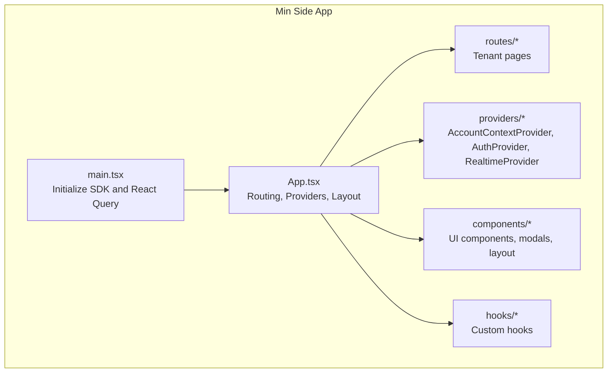
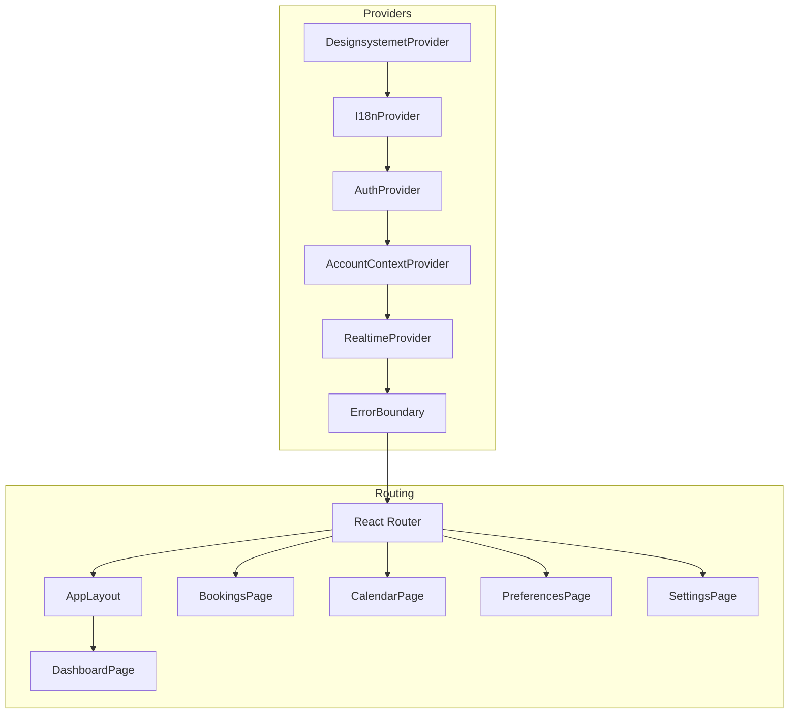
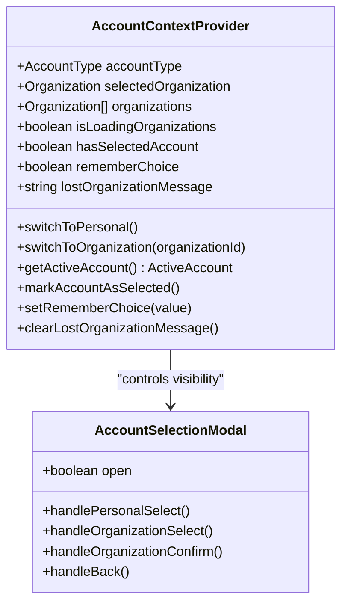
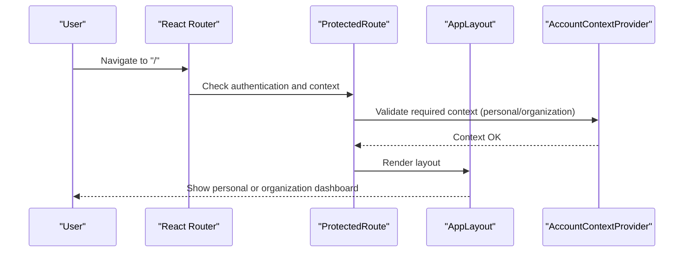
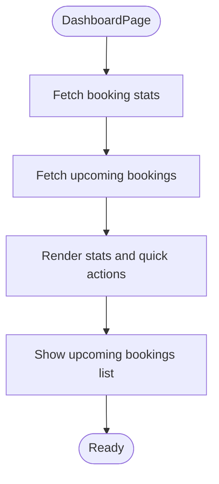
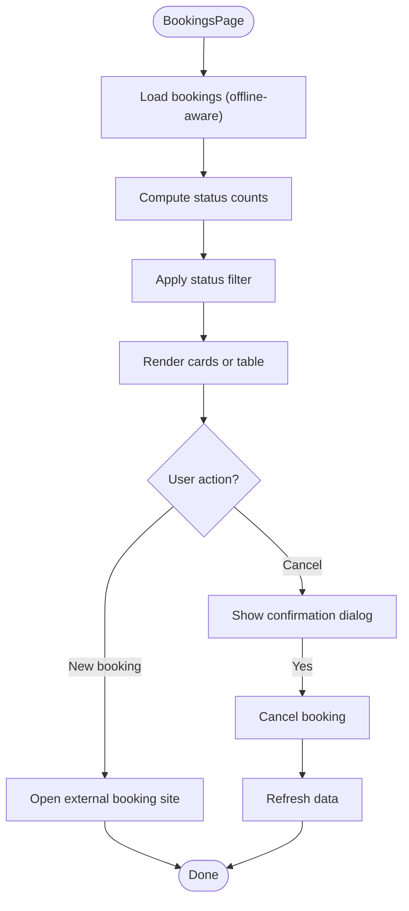
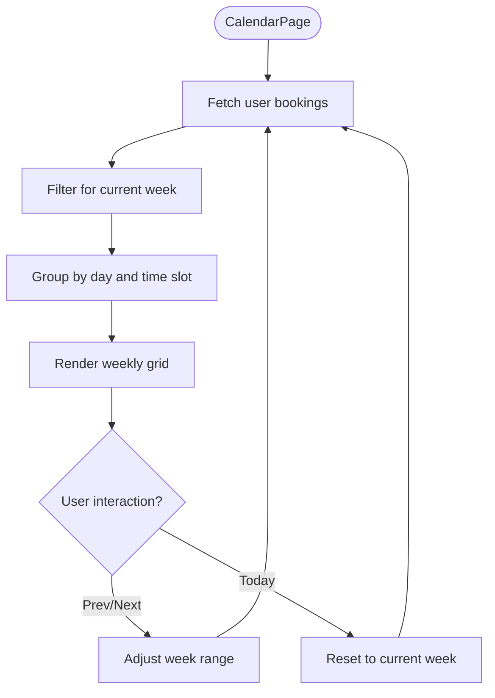
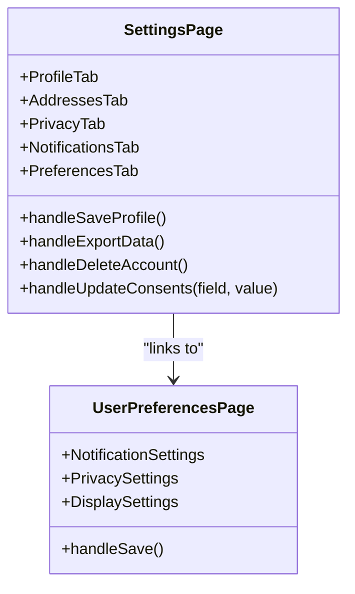
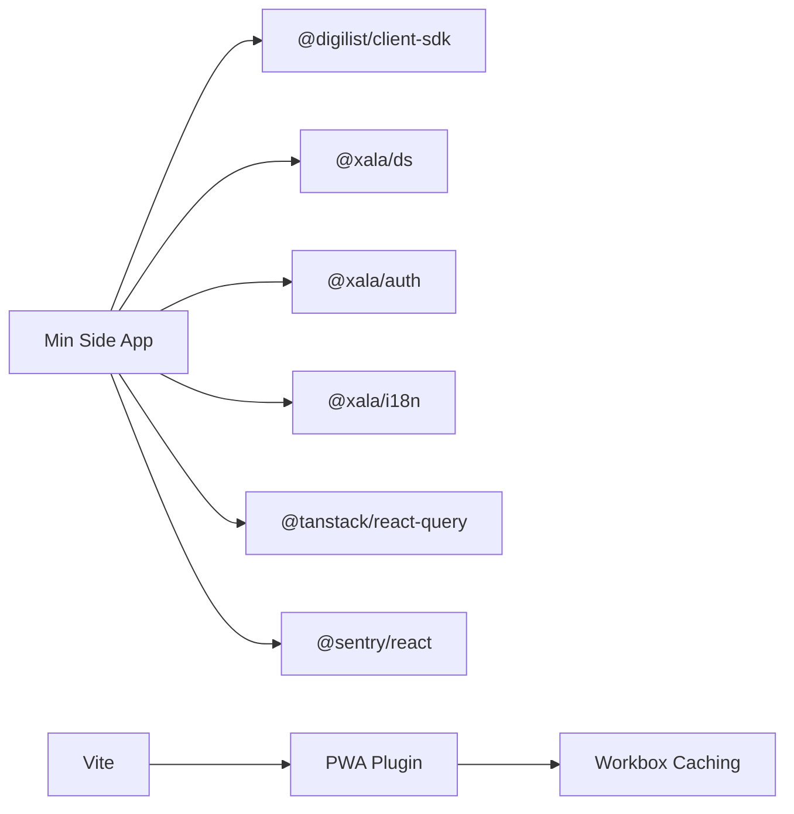

# Min Side Application

<cite>
**Referenced Files in This Document**
- [README.md](file://apps/minside/README.md)
- [package.json](file://apps/minside/package.json)
- [vite.config.ts](file://apps/minside/vite.config.ts)
- [App.tsx](file://apps/minside/src/App.tsx)
- [main.tsx](file://apps/minside/src/main.tsx)
- [AccountContextProvider.tsx](file://apps/minside/src/providers/AccountContextProvider.tsx)
- [AccountSelectionModal.tsx](file://apps/minside/src/components/AccountSelectionModal.tsx)
- [dashboard.tsx](file://apps/minside/src/routes/dashboard.tsx)
- [bookings.tsx](file://apps/minside/src/routes/bookings.tsx)
- [calendar.tsx](file://apps/minside/src/routes/calendar.tsx)
- [settings.tsx](file://apps/minside/src/routes/settings.tsx)
- [preferences.tsx](file://apps/minside/src/routes/preferences.tsx)
</cite>

## Table of Contents
1. [Introduction](#introduction)
2. [Project Structure](#project-structure)
3. [Core Components](#core-components)
4. [Architecture Overview](#architecture-overview)
5. [Detailed Component Analysis](#detailed-component-analysis)
6. [Dependency Analysis](#dependency-analysis)
7. [Performance Considerations](#performance-considerations)
8. [Troubleshooting Guide](#troubleshooting-guide)
9. [Conclusion](#conclusion)
10. [Appendices](#appendices)

## Introduction
Min Side is the tenant-facing citizen portal for the Xala/Digilist platform, enabling Norwegian municipalities to manage bookings, calendars, notifications, preferences, and personal data. It implements a tenant-focused interface with:
- OAuth 2.0 Authorization Code Flow for secure authentication
- Account switching between personal and organizational contexts
- Dashboard layouts optimized for personal and organization portals
- Real-time updates via WebSocket
- Progressive Web App (PWA) capabilities for offline support

## Project Structure
The Min Side application follows a feature-based organization under src/, with providers for cross-cutting concerns, components for shared UI, routes for tenant pages, and hooks for reusable logic. The build system uses Vite with PWA plugin and React Router for navigation.

**Diagram sources**
- [main.tsx](file://apps/minside/src/main.tsx#L1-L40)
- [App.tsx](file://apps/minside/src/App.tsx#L1-L184)
- [AccountContextProvider.tsx](file://apps/minside/src/providers/AccountContextProvider.tsx#L1-L334)

**Section sources**
- [README.md](file://apps/minside/README.md#L321-L344)
- [package.json](file://apps/minside/package.json#L1-L36)
- [vite.config.ts](file://apps/minside/vite.config.ts#L1-L116)

## Core Components
- Authentication and session management via OAuth 2.0 Authorization Code Flow with HTTP-only cookies
- Account context provider managing personal vs organization modes and persistence
- Real-time provider for WebSocket-based updates
- Routing with protected routes and context-aware navigation
- PWA configuration for offline caching and installability

Key implementation references:
- Authentication flow and security model: [README.md](file://apps/minside/README.md#L37-L219)
- App shell and routing: [App.tsx](file://apps/minside/src/App.tsx#L103-L184)
- SDK initialization and React Query defaults: [main.tsx](file://apps/minside/src/main.tsx#L14-L31)
- PWA and caching configuration: [vite.config.ts](file://apps/minside/vite.config.ts#L11-L115)

**Section sources**
- [README.md](file://apps/minside/README.md#L37-L219)
- [App.tsx](file://apps/minside/src/App.tsx#L103-L184)
- [main.tsx](file://apps/minside/src/main.tsx#L14-L31)
- [vite.config.ts](file://apps/minside/vite.config.ts#L11-L115)

## Architecture Overview
The Min Side application integrates several providers to deliver a cohesive tenant experience:
- DesignsystemetProvider for theming and design tokens
- I18nProvider for internationalization
- AuthProvider for OAuth and session handling
- AccountContextProvider for account type and organization selection
- RealtimeProvider for WebSocket subscriptions
- ErrorBoundary for graceful error handling

**Diagram sources**
- [App.tsx](file://apps/minside/src/App.tsx#L115-L182)
- [AccountContextProvider.tsx](file://apps/minside/src/providers/AccountContextProvider.tsx#L83-L319)

**Section sources**
- [App.tsx](file://apps/minside/src/App.tsx#L115-L182)

## Detailed Component Analysis

### Account Context and Switching
The AccountContextProvider manages:
- Persisted account type (personal or organization)
- Organization selection and validation
- Remember choice preference
- Lost organization messaging

**Diagram sources**
- [AccountContextProvider.tsx](file://apps/minside/src/providers/AccountContextProvider.tsx#L28-L319)
- [AccountSelectionModal.tsx](file://apps/minside/src/components/AccountSelectionModal.tsx#L64-L141)

**Section sources**
- [AccountContextProvider.tsx](file://apps/minside/src/providers/AccountContextProvider.tsx#L1-L334)
- [AccountSelectionModal.tsx](file://apps/minside/src/components/AccountSelectionModal.tsx#L1-L453)

### Routing and Navigation
The routing structure organizes tenant pages into personal and organization contexts:
- Personal context: dashboard, bookings, calendar, billing, messages, favorites
- Shared context: settings, preferences, notifications, privacy, help
- Organization context: dashboard, bookings, invoices, members, season rental, settings, activity

**Diagram sources**
- [App.tsx](file://apps/minside/src/App.tsx#L134-L171)

**Section sources**
- [App.tsx](file://apps/minside/src/App.tsx#L134-L171)

### Dashboard Layout and Personal Management
The dashboard aggregates:
- Upcoming bookings
- Booking statistics (pending, confirmed, cancelled)
- Quick actions to book, view bookings, messages, and settings
- Responsive design for mobile and desktop

**Diagram sources**
- [dashboard.tsx](file://apps/minside/src/routes/dashboard.tsx#L28-L535)

**Section sources**
- [dashboard.tsx](file://apps/minside/src/routes/dashboard.tsx#L1-L535)

### Bookings Management
The bookings page supports:
- Offline-first with IndexedDB caching and offline indicators
- Responsive card/table layouts
- Status filters (all, confirmed, pending, cancelled)
- Cancel booking with confirmation dialog

**Diagram sources**
- [bookings.tsx](file://apps/minside/src/routes/bookings.tsx#L44-L507)

**Section sources**
- [bookings.tsx](file://apps/minside/src/routes/bookings.tsx#L1-L507)

### Calendar Integration
The calendar provides:
- Weekly view with time slots
- Color-coded booking statuses
- Navigation between weeks and today
- Responsive layout adjustments

**Diagram sources**
- [calendar.tsx](file://apps/minside/src/routes/calendar.tsx#L28-L255)

**Section sources**
- [calendar.tsx](file://apps/minside/src/routes/calendar.tsx#L1-L255)

### Personal Data and Preferences
Settings and preferences enable:
- Profile editing (personal info, addresses)
- Avatar upload and preview
- Consent management (GDPR)
- Data export and account deletion
- Notification and privacy preferences
- Display settings (theme, language)

**Diagram sources**
- [settings.tsx](file://apps/minside/src/routes/settings.tsx#L46-L977)
- [preferences.tsx](file://apps/minside/src/routes/preferences.tsx#L25-L233)

**Section sources**
- [settings.tsx](file://apps/minside/src/routes/settings.tsx#L1-L977)
- [preferences.tsx](file://apps/minside/src/routes/preferences.tsx#L1-L233)

## Dependency Analysis
Min Side depends on:
- @digilist/client-sdk for API communication and React Query integration
- @xala/ds for design system components and theming
- @xala/auth for OAuth and session management
- @xala/i18n for internationalization
- @tanstack/react-query for caching and data synchronization
- @sentry/react for error monitoring

Build-time dependencies include Vite, React plugin, and PWA plugin with Workbox for caching strategies.

**Diagram sources**
- [package.json](file://apps/minside/package.json#L12-L34)
- [vite.config.ts](file://apps/minside/vite.config.ts#L9-L115)

**Section sources**
- [package.json](file://apps/minside/package.json#L1-L36)
- [vite.config.ts](file://apps/minside/vite.config.ts#L1-L116)

## Performance Considerations
- React Query default caching and retries reduce redundant network calls
- PWA caching strategies for fonts, API responses, and offline viewing of bookings
- Responsive layouts minimize layout thrashing on mobile devices
- Real-time provider subscribes to relevant channels to keep data fresh without polling

[No sources needed since this section provides general guidance]

## Troubleshooting Guide
Common issues and resolutions:
- OAuth callback errors: verify backend availability, provider configuration, and matching callback URLs
- Session persistence failures: ensure cookies are enabled, backend sets HTTP-only cookies, and domains match
- Third-party cookie blocking: align app and API domains and review browser privacy settings

**Section sources**
- [README.md](file://apps/minside/README.md#L560-L591)

## Conclusion
Min Side delivers a secure, responsive, and feature-rich tenant portal with robust account switching, dashboard personalization, and comprehensive personal management. Its architecture leverages modern frontend patterns, strong security practices, and a clean separation of concerns for maintainability and scalability.

[No sources needed since this section summarizes without analyzing specific files]

## Appendices

### Build Configuration and Development Setup
- Development server runs on port 5174
- Environment variables for API base URL, tenant ID, and mock auth mode
- PWA manifest and caching strategies for offline support

**Section sources**
- [vite.config.ts](file://apps/minside/vite.config.ts#L101-L115)
- [README.md](file://apps/minside/README.md#L257-L317)

### Deployment Processes
- Build production bundle and preview locally
- Deploy to production using available scripts

**Section sources**
- [README.md](file://apps/minside/README.md#L509-L521)