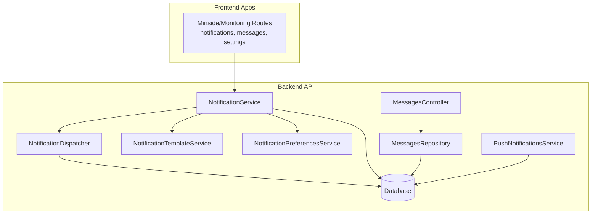
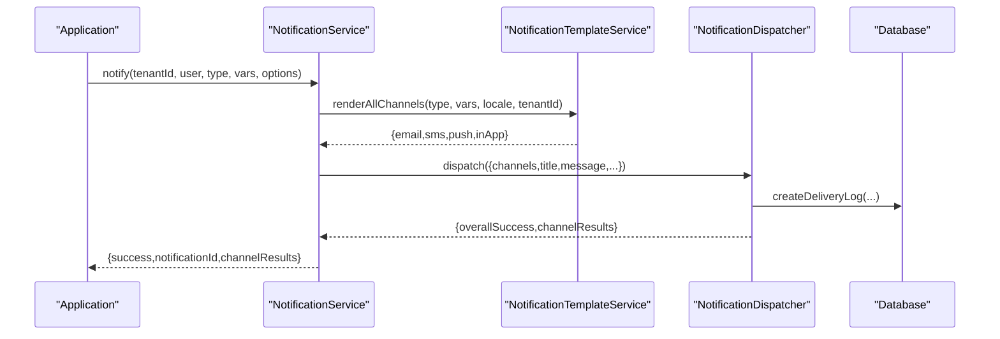
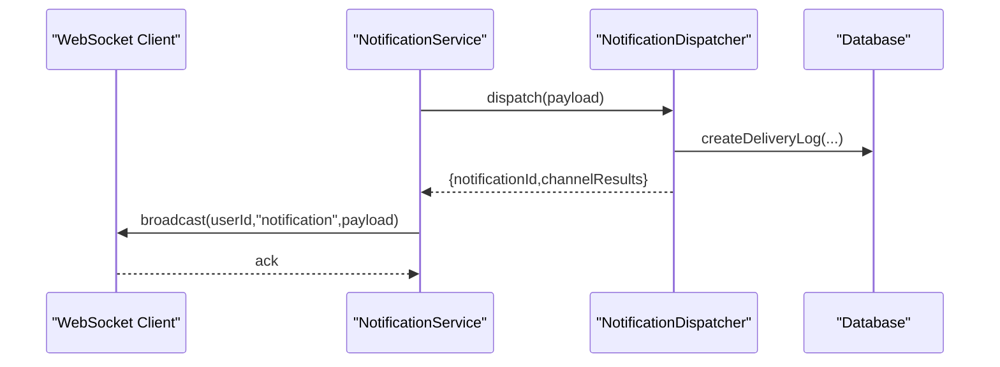
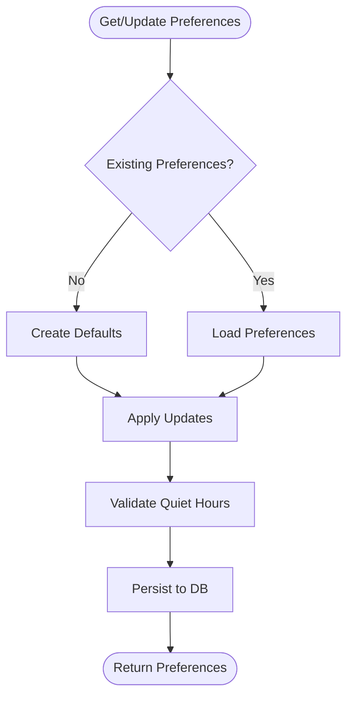
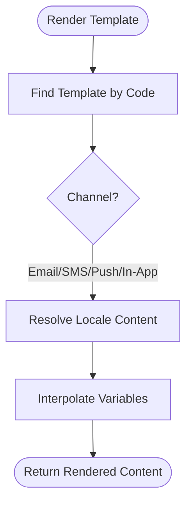
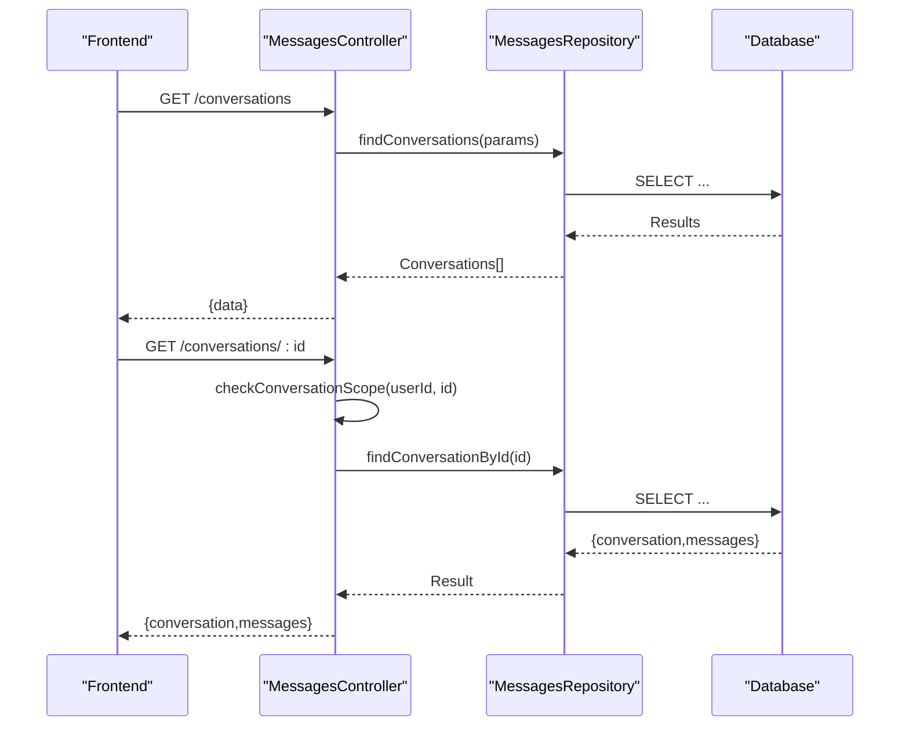
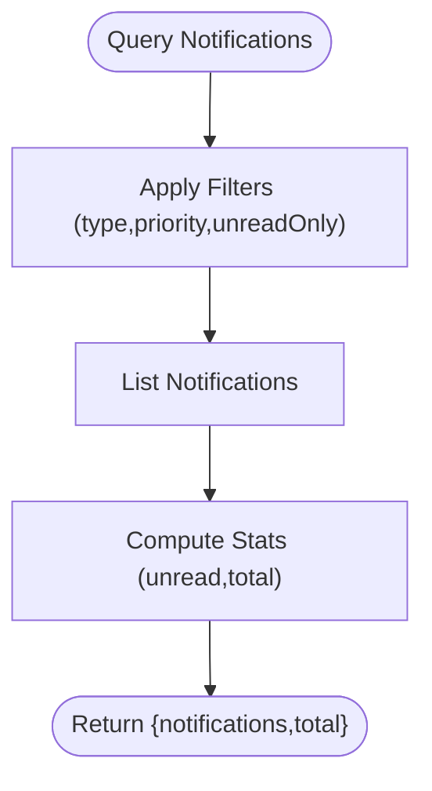
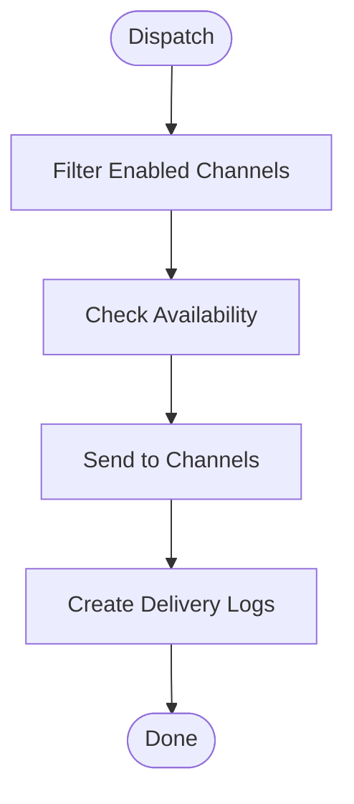
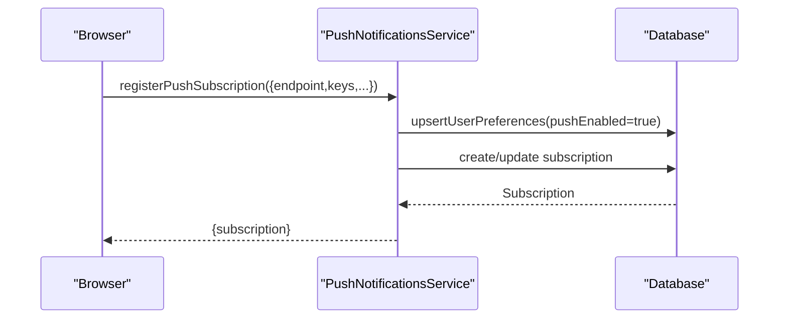
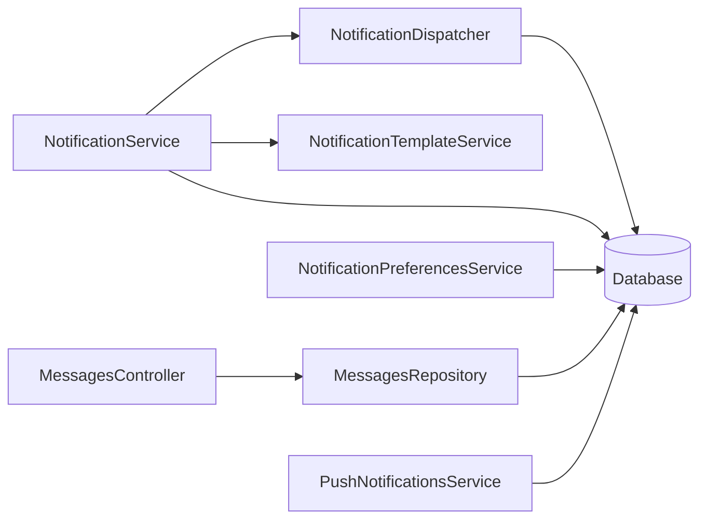

# Notifications & Messages

<cite>
**Referenced Files in This Document**
- [notification.types.ts](file://apps/api/src/modules/notification-system/notification.types.ts)
- [notification.service.ts](file://apps/api/src/modules/notification-system/notification.service.ts)
- [notification.dispatcher.ts](file://apps/api/src/modules/notification-system/notification.dispatcher.ts)
- [notification-template.service.ts](file://apps/api/src/modules/notification-system/notification-template.service.ts)
- [notification-preferences.service.ts](file://apps/api/src/modules/notification-system/notification-preferences.service.ts)
- [notification-preferences.controller.ts](file://apps/api/src/modules/notification-system/notification-preferences.controller.ts)
- [notification-preferences.ts](file://apps/api/src/database/schema/notification-preferences.ts)
- [messages.repository.ts](file://apps/api/src/modules/messages/messages.repository.ts)
- [messages.controller.ts](file://apps/api/src/modules/messages/messages.controller.ts)
- [push-notifications.service.ts](file://apps/api/src/modules/push-notifications/push-notifications.service.ts)
- [notification.schema.ts](file://apps/api/src/schemas/notification.schema.ts)
- [notification-deduplication.test.ts](file://apps/api/tests/integration/notification-deduplication.test.ts)
- [notification-retry.test.ts](file://apps/api/tests/integration/notification-retry.test.ts)
</cite>

## Table of Contents
1. [Introduction](#introduction)
2. [Project Structure](#project-structure)
3. [Core Components](#core-components)
4. [Architecture Overview](#architecture-overview)
5. [Detailed Component Analysis](#detailed-component-analysis)
6. [Dependency Analysis](#dependency-analysis)
7. [Performance Considerations](#performance-considerations)
8. [Troubleshooting Guide](#troubleshooting-guide)
9. [Conclusion](#conclusion)

## Introduction
This document describes the notifications and messaging system across the backend API and frontend applications. It covers:
- Notification center interface and real-time delivery
- Notification preferences management (channels and types)
- Templates and variable interpolation
- Message inbox, conversation management, and communication features
- Notification types (booking confirmations, system alerts, user-generated messages)
- Preferences matrix, channel selection (email, SMS, in-app, push), and delivery scheduling
- Notification history, read/unread tracking, and filtering
- Backend integration, retry and deduplication mechanisms, and delivery reliability

## Project Structure
The notification and messaging system spans backend modules and repositories, with frontend routes and components that consume the API.

**Diagram sources**
- [notification.service.ts](file://apps/api/src/modules/notification-system/notification.service.ts#L33-L43)
- [notification.dispatcher.ts](file://apps/api/src/modules/notification-system/notification.dispatcher.ts#L40-L54)
- [notification-template.service.ts](file://apps/api/src/modules/notification-system/notification-template.service.ts#L14-L15)
- [notification-preferences.service.ts](file://apps/api/src/modules/notification-system/notification-preferences.service.ts#L41-L42)
- [messages.repository.ts](file://apps/api/src/modules/messages/messages.repository.ts#L71-L74)
- [messages.controller.ts](file://apps/api/src/modules/messages/messages.controller.ts#L22-L24)
- [push-notifications.service.ts](file://apps/api/src/modules/push-notifications/push-notifications.service.ts#L113-L114)

**Section sources**
- [notification.service.ts](file://apps/api/src/modules/notification-system/notification.service.ts#L1-L369)
- [notification.dispatcher.ts](file://apps/api/src/modules/notification-system/notification.dispatcher.ts#L1-L269)
- [notification-template.service.ts](file://apps/api/src/modules/notification-system/notification-template.service.ts#L1-L235)
- [notification-preferences.service.ts](file://apps/api/src/modules/notification-system/notification-preferences.service.ts#L1-L318)
- [messages.repository.ts](file://apps/api/src/modules/messages/messages.repository.ts#L1-L289)
- [messages.controller.ts](file://apps/api/src/modules/messages/messages.controller.ts#L1-L184)
- [push-notifications.service.ts](file://apps/api/src/modules/push-notifications/push-notifications.service.ts#L1-L355)

## Core Components
- NotificationService orchestrates creation, templating, dispatch, scheduling, and user-centric operations (listing, read/unread, dismissal).
- NotificationDispatcher routes to channels (email, SMS, in-app, push), tracks delivery logs, and supports WebSocket broadcasts for real-time in-app updates.
- NotificationTemplateService manages templates, renders per-channel and locale, validates variables, and interpolates placeholders.
- NotificationPreferencesService stores per-user, per-tenant preferences for channels and notification types, quiet hours, and provides filtering helpers.
- MessagesRepository encapsulates conversation and message persistence, including unread counters and status transitions.
- MessagesController enforces scope-based access controls and exposes endpoints for conversations and messages.
- PushNotificationsService manages user and organization-level push preferences and subscriptions.

**Section sources**
- [notification.service.ts](file://apps/api/src/modules/notification-system/notification.service.ts#L33-L369)
- [notification.dispatcher.ts](file://apps/api/src/modules/notification-system/notification.dispatcher.ts#L40-L269)
- [notification-template.service.ts](file://apps/api/src/modules/notification-system/notification-template.service.ts#L14-L235)
- [notification-preferences.service.ts](file://apps/api/src/modules/notification-system/notification-preferences.service.ts#L41-L318)
- [messages.repository.ts](file://apps/api/src/modules/messages/messages.repository.ts#L71-L289)
- [messages.controller.ts](file://apps/api/src/modules/messages/messages.controller.ts#L22-L184)
- [push-notifications.service.ts](file://apps/api/src/modules/push-notifications/push-notifications.service.ts#L113-L355)

## Architecture Overview
High-level flow for sending a notification:
1. Application triggers a notification via NotificationService.
2. Templates are resolved for all requested channels.
3. Dispatcher selects channels (respecting preferences and availability) and sends.
4. Delivery logs are recorded; in-app notifications broadcast via WebSocket.
5. Users can query notifications, mark as read/dismiss, and manage preferences.

**Diagram sources**
- [notification.service.ts](file://apps/api/src/modules/notification-system/notification.service.ts#L59-L125)
- [notification-template.service.ts](file://apps/api/src/modules/notification-system/notification-template.service.ts#L131-L155)
- [notification.dispatcher.ts](file://apps/api/src/modules/notification-system/notification.dispatcher.ts#L66-L119)

## Detailed Component Analysis

### Notification Center and Real-Time Delivery
- Real-time in-app delivery uses a WebSocket broadcast hook set on the dispatcher. When in-app notifications are created, the service forwards events to connected clients.
- The service also supports scheduling notifications for future delivery by enqueuing them and processing the queue via a worker.

**Diagram sources**
- [notification.service.ts](file://apps/api/src/modules/notification-system/notification.service.ts#L48-L50)
- [notification.dispatcher.ts](file://apps/api/src/modules/notification-system/notification.dispatcher.ts#L59-L61)
- [notification.dispatcher.ts](file://apps/api/src/modules/notification-system/notification.dispatcher.ts#L96-L110)

**Section sources**
- [notification.service.ts](file://apps/api/src/modules/notification-system/notification.service.ts#L45-L50)
- [notification.dispatcher.ts](file://apps/api/src/modules/notification-system/notification.dispatcher.ts#L56-L61)
- [notification.dispatcher.ts](file://apps/api/src/modules/notification-system/notification.dispatcher.ts#L96-L119)

### Notification Preferences Management
- Per-user, per-tenant preferences include:
  - Channel toggles: in-app, email, SMS, push
  - Notification type toggles: booking-related, reminders, system/admin messages, invoices, payments
  - Quiet hours: start/end time and timezone
- Defaults are created automatically if none exist.
- Helpers filter channels based on user preferences and validate quiet hours.

**Diagram sources**
- [notification-preferences.service.ts](file://apps/api/src/modules/notification-system/notification-preferences.service.ts#L47-L69)
- [notification-preferences.service.ts](file://apps/api/src/modules/notification-system/notification-preferences.service.ts#L116-L149)
- [notification-preferences.service.ts](file://apps/api/src/modules/notification-system/notification-preferences.service.ts#L295-L316)

**Section sources**
- [notification-preferences.service.ts](file://apps/api/src/modules/notification-system/notification-preferences.service.ts#L41-L318)
- [notification-preferences.controller.ts](file://apps/api/src/modules/notification-system/notification-preferences.controller.ts#L62-L217)
- [notification-preferences.ts](file://apps/api/src/database/schema/notification-preferences.ts#L27-L70)

### Templates and Variable Interpolation
- Templates support multiple channels and locales.
- Variables are interpolated using a placeholder pattern; missing variables produce warnings but do not fail rendering.
- Available variables are tracked per template and validated before sending.

**Diagram sources**
- [notification-template.service.ts](file://apps/api/src/modules/notification-system/notification-template.service.ts#L75-L126)
- [notification-template.service.ts](file://apps/api/src/modules/notification-system/notification-template.service.ts#L131-L155)
- [notification-template.service.ts](file://apps/api/src/modules/notification-system/notification-template.service.ts#L161-L173)

**Section sources**
- [notification-template.service.ts](file://apps/api/src/modules/notification-system/notification-template.service.ts#L14-L235)
- [notification.types.ts](file://apps/api/src/modules/notification-system/notification.types.ts#L36-L52)

### Message Inbox and Conversation Management
- Conversations and messages are persisted with sender identity, read timestamps, and unread counters.
- Scope enforcement ensures org_member users can only access conversations linked to their assigned rental objects.
- Operations include listing, fetching a specific conversation, creating conversations, adding messages, and marking as read.

**Diagram sources**
- [messages.controller.ts](file://apps/api/src/modules/messages/messages.controller.ts#L98-L139)
- [messages.repository.ts](file://apps/api/src/modules/messages/messages.repository.ts#L79-L112)
- [messages.repository.ts](file://apps/api/src/modules/messages/messages.repository.ts#L117-L166)

**Section sources**
- [messages.repository.ts](file://apps/api/src/modules/messages/messages.repository.ts#L71-L289)
- [messages.controller.ts](file://apps/api/src/modules/messages/messages.controller.ts#L22-L184)

### Notification Types, Filtering, and History
- Notification types include booking lifecycle events, reminders, invoices, payments, and system/admin alerts.
- Filtering supports type, priority, unread-only, pagination, and ownership.
- Read/unread tracking and dismissal are supported with bulk operations.
- Delivery logs capture per-channel status, provider message IDs, and timestamps.

**Diagram sources**
- [notification.service.ts](file://apps/api/src/modules/notification-system/notification.service.ts#L203-L215)
- [notification.types.ts](file://apps/api/src/modules/notification-system/notification.types.ts#L105-L112)

**Section sources**
- [notification.types.ts](file://apps/api/src/modules/notification-system/notification.types.ts#L10-L31)
- [notification.service.ts](file://apps/api/src/modules/notification-system/notification.service.ts#L203-L252)

### Channel Selection, Scheduling, and Reliability
- Channel selection considers user preferences and availability per tenant.
- Default channel sets exist per notification type.
- Delivery scheduling queues notifications for future processing.
- Retry and deduplication are covered by integration tests.

**Diagram sources**
- [notification.dispatcher.ts](file://apps/api/src/modules/notification-system/notification.dispatcher.ts#L229-L246)
- [notification.dispatcher.ts](file://apps/api/src/modules/notification-system/notification.dispatcher.ts#L66-L119)
- [notification.service.ts](file://apps/api/src/modules/notification-system/notification.service.ts#L130-L147)

**Section sources**
- [notification.dispatcher.ts](file://apps/api/src/modules/notification-system/notification.dispatcher.ts#L24-L269)
- [notification.service.ts](file://apps/api/src/modules/notification-system/notification.service.ts#L127-L194)
- [notification-deduplication.test.ts](file://apps/api/tests/integration/notification-deduplication.test.ts)
- [notification-retry.test.ts](file://apps/api/tests/integration/notification-retry.test.ts)

### Push Subscriptions and Preferences
- Push subscriptions are registered per user and endpoint, with device metadata.
- User and organization preferences include notification matrices and quiet hours.
- Enabling a subscription also enables push in user preferences.

**Diagram sources**
- [push-notifications.service.ts](file://apps/api/src/modules/push-notifications/push-notifications.service.ts#L236-L273)

**Section sources**
- [push-notifications.service.ts](file://apps/api/src/modules/push-notifications/push-notifications.service.ts#L113-L355)

## Dependency Analysis
- NotificationService depends on NotificationDispatcher, NotificationTemplateService, and repositories for persistence and push.
- NotificationDispatcher depends on channel handlers and repositories for logging.
- NotificationPreferencesService persists to the notification_preferences table.
- MessagesController depends on MessagesRepository and enforces scope checks.
- PushNotificationsService depends on PushNotificationsRepository for preferences and subscriptions.

**Diagram sources**
- [notification.service.ts](file://apps/api/src/modules/notification-system/notification.service.ts#L5-L43)
- [notification.dispatcher.ts](file://apps/api/src/modules/notification-system/notification.dispatcher.ts#L40-L54)
- [notification-preferences.service.ts](file://apps/api/src/modules/notification-system/notification-preferences.service.ts#L41-L42)
- [messages.controller.ts](file://apps/api/src/modules/messages/messages.controller.ts#L22-L24)
- [messages.repository.ts](file://apps/api/src/modules/messages/messages.repository.ts#L71-L74)
- [push-notifications.service.ts](file://apps/api/src/modules/push-notifications/push-notifications.service.ts#L113-L114)

**Section sources**
- [notification.service.ts](file://apps/api/src/modules/notification-system/notification.service.ts#L5-L43)
- [notification.dispatcher.ts](file://apps/api/src/modules/notification-system/notification.dispatcher.ts#L40-L54)
- [notification-preferences.service.ts](file://apps/api/src/modules/notification-system/notification-preferences.service.ts#L41-L42)
- [messages.repository.ts](file://apps/api/src/modules/messages/messages.repository.ts#L71-L74)
- [push-notifications.service.ts](file://apps/api/src/modules/push-notifications/push-notifications.service.ts#L113-L114)

## Performance Considerations
- Asynchronous processing: Use scheduling and queue processing to avoid blocking requests.
- Parallel rendering: Template rendering across channels is executed concurrently.
- Rate limiting: The dispatcher exposes rate limit status per channel to prevent throttling.
- Pagination: Use limit/offset filters for notification queries to control payload sizes.
- Indexes: Ensure database indexes on frequently queried columns (user, tenant, timestamps) are maintained.

[No sources needed since this section provides general guidance]

## Troubleshooting Guide
- Validation errors: Preference updates validate quiet hours and time formats; invalid entries return structured validation errors.
- Authentication: Protected endpoints require a valid authenticated user context.
- Scope enforcement: MessagesController restricts access for org_member users to conversations within their assigned scopes.
- Delivery failures: Delivery logs capture provider errors and statuses; inspect logs for per-channel outcomes.
- Deduplication and retries: Integration tests verify deduplication and retry behavior for reliable delivery.

**Section sources**
- [notification-preferences.controller.ts](file://apps/api/src/modules/notification-system/notification-preferences.controller.ts#L146-L166)
- [messages.controller.ts](file://apps/api/src/modules/messages/messages.controller.ts#L30-L96)
- [notification-deduplication.test.ts](file://apps/api/tests/integration/notification-deduplication.test.ts)
- [notification-retry.test.ts](file://apps/api/tests/integration/notification-retry.test.ts)

## Conclusion
The notifications and messaging system provides a robust, extensible foundation for delivering timely, personalized communications across channels. It integrates user preferences, templating, scheduling, real-time updates, and reliable delivery with delivery logs and retry/deduplication mechanisms. The message inbox adds conversational features with strong scope enforcement and efficient querying.