# Organization Portal

<cite>
**Referenced Files in This Document**
- [apps/backoffice/src/routes/dashboard.tsx](file://apps/backoffice/src/routes/dashboard.tsx)
- [apps/backoffice/src/components/dashboard/OrgMemberDashboard.tsx](file://apps/backoffice/src/components/dashboard/OrgMemberDashboard.tsx)
- [apps/backoffice/src/routes/org-admin/dashboard.tsx](file://apps/backoffice/src/routes/org-admin/dashboard.tsx)
- [apps/backoffice/src/routes/organizations/OrganizationMembersPage.tsx](file://apps/backoffice/src/routes/organizations/OrganizationMembersPage.tsx)
- [apps/backoffice/src/components/organizations/MemberManagement.tsx](file://apps/backoffice/src/components/organizations/MemberManagement.tsx)
- [apps/backoffice/src/routes/organizations/OrganizationFormPage.tsx](file://apps/backoffice/src/routes/organizations/OrganizationFormPage.tsx)
- [apps/backoffice/src/components/organizations/OrganizationWizard.tsx](file://apps/backoffice/src/components/organizations/OrganizationWizard.tsx)
- [apps/api/src/modules/organizations/organization-setup.service.ts](file://apps/api/src/modules/organizations/organization-setup.service.ts)
- [apps/api/src/modules/organizations/organizations.controller.ts](file://apps/api/src/modules/organizations/organizations.controller.ts)
- [packages/client-sdk/src/services/organization.service.ts](file://packages/client-sdk/src/services/organization.service.ts)
- [packages/client-sdk/src/types/economy.ts](file://packages/client-sdk/src/types/economy.ts)
- [apps/minside/src/routes/org/invoices.tsx](file://apps/minside/src/routes/org/invoices.tsx)
- [apps/monitoring/src/routes/org/invoices.tsx](file://apps/monitoring/src/routes/org/invoices.tsx)
- [apps/minside/src/providers/AccountContextProvider.tsx](file://apps/minside/src/providers/AccountContextProvider.tsx)
- [apps/minside/src/components/AccountSwitcher.tsx](file://apps/minside/src/components/AccountSwitcher.tsx)
- [apps/monitoring/src/providers/AccountContextProvider.tsx](file://apps/monitoring/src/providers/AccountContextProvider.tsx)
- [apps/monitoring/src/components/AccountSwitcher.tsx](file://apps/monitoring/src/components/AccountSwitcher.tsx)
- [apps/minside/src/App.tsx](file://apps/minside/src/App.tsx)
- [apps/monitoring/src/App.tsx](file://apps/monitoring/src/App.tsx)
- [packages/client-sdk/src/hooks/use-backoffice-orgs.ts](file://packages/client-sdk/src/hooks/use-backoffice-orgs.ts)
- [packages/client-sdk/src/types/rbac.ts](file://packages/client-sdk/src/types/rbac.ts)
- [packages/database-schema/src/compliance/audit-logs.ts](file://packages/database-schema/src/compliance/audit-logs.ts)
- [apps/api/src/workers/report-generator.worker.ts](file://apps/api/src/workers/report-generator.worker.ts)
- [tests/e2e/backoffice/org-member-flow.spec.ts](file://tests/e2e/backoffice/org-member-flow.spec.ts)
- [tests/e2e/custody-delegation.spec.ts](file://tests/e2e/custody-delegation.spec.ts)
- [docs/digilist-platform/roles/tenant-admin-backoffice/prd.md](file://docs/digilist-platform/roles/tenant-admin-backoffice/prd.md)
- [docs/digilist-platform/brd.md](file://docs/digilist-platform/brd.md)
- [docs/technical/ERD.md](file://docs/technical/ERD.md)
</cite>

## Table of Contents
1. [Introduction](#introduction)
2. [Project Structure](#project-structure)
3. [Core Components](#core-components)
4. [Architecture Overview](#architecture-overview)
5. [Detailed Component Analysis](#detailed-component-analysis)
6. [Dependency Analysis](#dependency-analysis)
7. [Performance Considerations](#performance-considerations)
8. [Troubleshooting Guide](#troubleshooting-guide)
9. [Conclusion](#conclusion)
10. [Appendices](#appendices)

## Introduction
This document describes the organization portal functionality within the Min Side application, focusing on the organization dashboard, team metrics, booking summaries, administrative insights, and the integration between personal and organization contexts. It also covers organization-level booking management, member administration, invoice handling, settings and branding, activity tracking, audit logs, compliance features, context switching, role management, and data isolation.

## Project Structure
The organization portal spans multiple applications and shared libraries:
- Backoffice application: Administrative dashboards, organization member management, and organization configuration.
- Min Side application: Organization context for end users, including invoices and calendar views.
- Monitoring application: Alternative UI for organization-related operations.
- API application: Organization setup, branding, and administrative endpoints.
- Client SDK: Services and types for organization and economy operations.
- Database schema and audit logging: Compliance and audit trail.

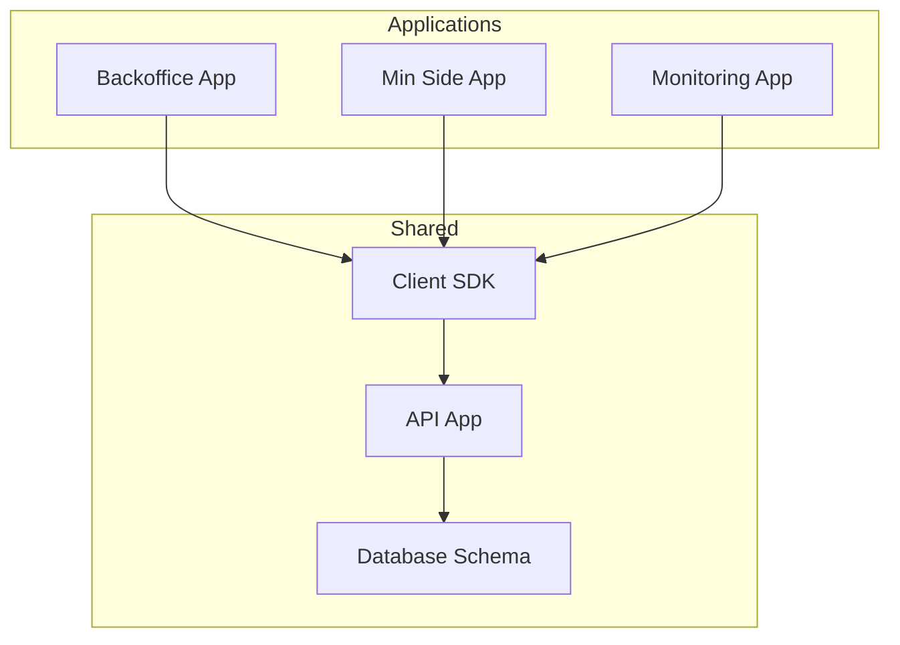

**Diagram sources**
- [apps/backoffice/src/routes/dashboard.tsx](file://apps/backoffice/src/routes/dashboard.tsx#L40-L50)
- [apps/minside/src/App.tsx](file://apps/minside/src/App.tsx#L137-L158)
- [apps/monitoring/src/App.tsx](file://apps/monitoring/src/App.tsx#L137-L158)
- [packages/client-sdk/src/services/organization.service.ts](file://packages/client-sdk/src/services/organization.service.ts#L35-L136)
- [apps/api/src/modules/organizations/organizations.controller.ts](file://apps/api/src/modules/organizations/organizations.controller.ts#L14-L207)

**Section sources**
- [apps/backoffice/src/routes/dashboard.tsx](file://apps/backoffice/src/routes/dashboard.tsx#L40-L50)
- [apps/minside/src/App.tsx](file://apps/minside/src/App.tsx#L137-L158)
- [apps/monitoring/src/App.tsx](file://apps/monitoring/src/App.tsx#L137-L158)

## Core Components
- Organization dashboard for administrators with statistics, pending items, calendar preview, alerts, and quick actions.
- Organization dashboard for organization members with pending tasks, calendar preview, messages, and finance alerts.
- Organization member management with add/remove/update role operations.
- Organization branding and settings configuration.
- Organization invoices list with filters and PDF download.
- Organization context switching between personal and organization modes.
- Audit logging and compliance tracking.

**Section sources**
- [apps/backoffice/src/routes/org-admin/dashboard.tsx](file://apps/backoffice/src/routes/org-admin/dashboard.tsx#L39-L357)
- [apps/backoffice/src/components/dashboard/OrgMemberDashboard.tsx](file://apps/backoffice/src/components/dashboard/OrgMemberDashboard.tsx#L332-L377)
- [apps/backoffice/src/routes/organizations/OrganizationMembersPage.tsx](file://apps/backoffice/src/routes/organizations/OrganizationMembersPage.tsx#L43-L190)
- [apps/backoffice/src/components/organizations/MemberManagement.tsx](file://apps/backoffice/src/components/organizations/MemberManagement.tsx#L31-L257)
- [apps/api/src/modules/organizations/organization-setup.service.ts](file://apps/api/src/modules/organizations/organization-setup.service.ts#L111-L330)
- [apps/minside/src/routes/org/invoices.tsx](file://apps/minside/src/routes/org/invoices.tsx#L45-L203)
- [apps/minside/src/providers/AccountContextProvider.tsx](file://apps/minside/src/providers/AccountContextProvider.tsx#L141-L213)
- [apps/minside/src/components/AccountSwitcher.tsx](file://apps/minside/src/components/AccountSwitcher.tsx#L86-L116)
- [packages/database-schema/src/compliance/audit-logs.ts](file://packages/database-schema/src/compliance/audit-logs.ts#L16-L34)

## Architecture Overview
The organization portal integrates frontends (Backoffice, Min Side, Monitoring) with the Client SDK and API. The API handles organization setup, branding, member management, and administrative endpoints. Economy types and services support invoice handling. Audit logging and compliance tables track organization-related activities.

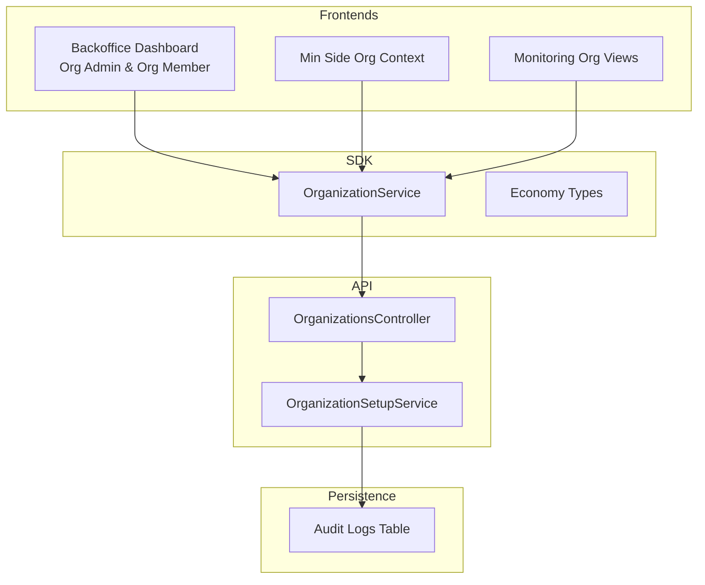

**Diagram sources**
- [apps/backoffice/src/routes/org-admin/dashboard.tsx](file://apps/backoffice/src/routes/org-admin/dashboard.tsx#L39-L357)
- [apps/backoffice/src/components/dashboard/OrgMemberDashboard.tsx](file://apps/backoffice/src/components/dashboard/OrgMemberDashboard.tsx#L332-L377)
- [packages/client-sdk/src/services/organization.service.ts](file://packages/client-sdk/src/services/organization.service.ts#L35-L136)
- [apps/api/src/modules/organizations/organizations.controller.ts](file://apps/api/src/modules/organizations/organizations.controller.ts#L14-L207)
- [apps/api/src/modules/organizations/organization-setup.service.ts](file://apps/api/src/modules/organizations/organization-setup.service.ts#L111-L330)
- [packages/database-schema/src/compliance/audit-logs.ts](file://packages/database-schema/src/compliance/audit-logs.ts#L16-L34)

## Detailed Component Analysis

### Organization Admin Dashboard
The organization administrator dashboard presents:
- Welcome message scoped to the user’s assigned rental objects.
- Statistics cards for pending bookings, confirmed bookings, assigned objects, and active blocks.
- Alerts panel for operational warnings.
- Work queue for pending bookings.
- Calendar preview for this week’s bookings and blocks.
- Quick actions for processing pending items, managing blocks, and viewing messages.
- Assigned rental objects summary.

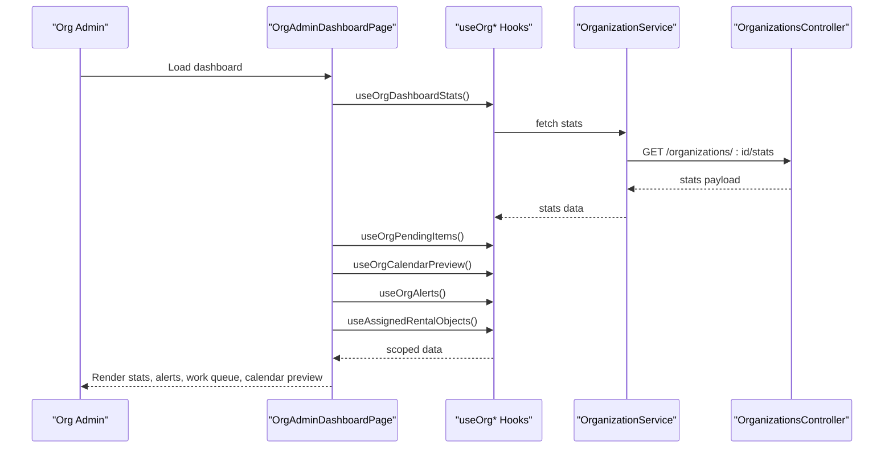

**Diagram sources**
- [apps/backoffice/src/routes/org-admin/dashboard.tsx](file://apps/backoffice/src/routes/org-admin/dashboard.tsx#L39-L357)
- [packages/client-sdk/src/services/organization.service.ts](file://packages/client-sdk/src/services/organization.service.ts#L35-L136)
- [apps/api/src/modules/organizations/organizations.controller.ts](file://apps/api/src/modules/organizations/organizations.controller.ts#L14-L207)

**Section sources**
- [apps/backoffice/src/routes/org-admin/dashboard.tsx](file://apps/backoffice/src/routes/org-admin/dashboard.tsx#L39-L357)

### Organization Member Dashboard
The organization member dashboard provides:
- Pending tasks widget for assigned rental objects.
- Calendar preview for today/this week’s bookings.
- Messages widget (feature-gated).
- Finance alerts widget (feature-gated).

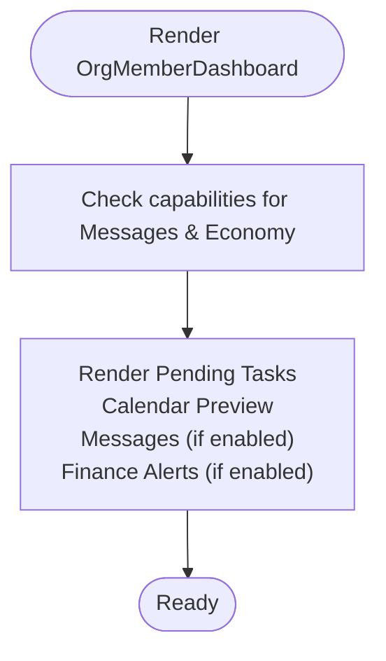

**Diagram sources**
- [apps/backoffice/src/components/dashboard/OrgMemberDashboard.tsx](file://apps/backoffice/src/components/dashboard/OrgMemberDashboard.tsx#L332-L377)

**Section sources**
- [apps/backoffice/src/components/dashboard/OrgMemberDashboard.tsx](file://apps/backoffice/src/components/dashboard/OrgMemberDashboard.tsx#L332-L377)
- [apps/backoffice/src/routes/dashboard.tsx](file://apps/backoffice/src/routes/dashboard.tsx#L40-L50)

### Organization Member Administration
Administrators can manage organization members:
- View organization members with counts for admins and regular members.
- Add members with selectable roles.
- Update member roles.
- Remove members.

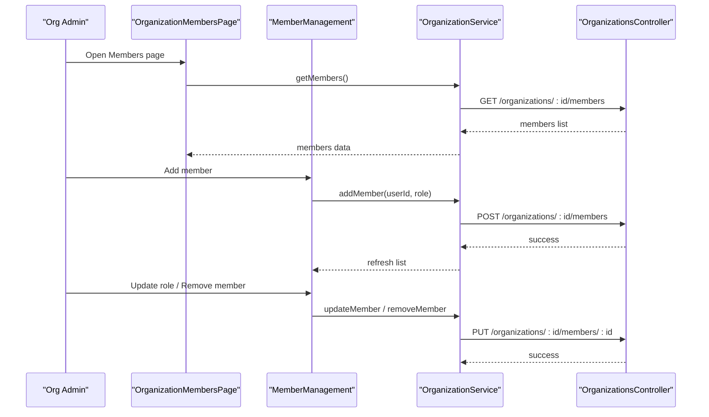

**Diagram sources**
- [apps/backoffice/src/routes/organizations/OrganizationMembersPage.tsx](file://apps/backoffice/src/routes/organizations/OrganizationMembersPage.tsx#L43-L190)
- [apps/backoffice/src/components/organizations/MemberManagement.tsx](file://apps/backoffice/src/components/organizations/MemberManagement.tsx#L31-L257)
- [packages/client-sdk/src/services/organization.service.ts](file://packages/client-sdk/src/services/organization.service.ts#L93-L109)
- [apps/api/src/modules/organizations/organizations.controller.ts](file://apps/api/src/modules/organizations/organizations.controller.ts#L119-L158)

**Section sources**
- [apps/backoffice/src/routes/organizations/OrganizationMembersPage.tsx](file://apps/backoffice/src/routes/organizations/OrganizationMembersPage.tsx#L43-L190)
- [apps/backoffice/src/components/organizations/MemberManagement.tsx](file://apps/backoffice/src/components/organizations/MemberManagement.tsx#L31-L257)
- [packages/client-sdk/src/services/organization.service.ts](file://packages/client-sdk/src/services/organization.service.ts#L84-L109)
- [apps/api/src/modules/organizations/organizations.controller.ts](file://apps/api/src/modules/organizations/organizations.controller.ts#L119-L158)

### Organization Settings and Branding
Organization settings include:
- Default roles and features based on actor type.
- Branding configuration (logo, primary/secondary colors).
- Audit logging for branding updates.

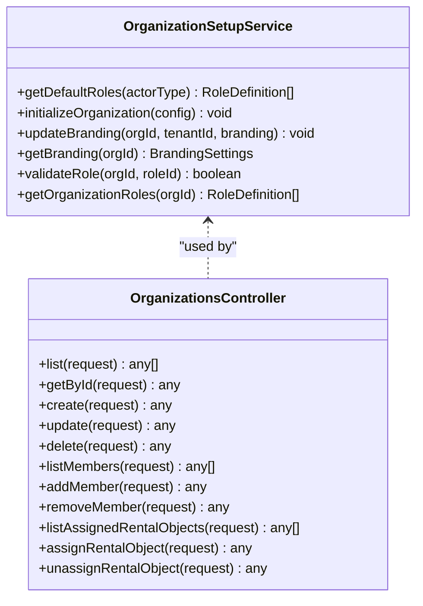

**Diagram sources**
- [apps/api/src/modules/organizations/organization-setup.service.ts](file://apps/api/src/modules/organizations/organization-setup.service.ts#L111-L330)
- [apps/api/src/modules/organizations/organizations.controller.ts](file://apps/api/src/modules/organizations/organizations.controller.ts#L14-L207)

**Section sources**
- [apps/api/src/modules/organizations/organization-setup.service.ts](file://apps/api/src/modules/organizations/organization-setup.service.ts#L111-L330)
- [apps/api/src/modules/organizations/organizations.controller.ts](file://apps/api/src/modules/organizations/organizations.controller.ts#L14-L207)

### Organization Invoices
The organization invoices page supports:
- Filtering by status (all, paid, sent, overdue).
- Listing invoices with due dates and amounts.
- Downloading invoices as PDF.

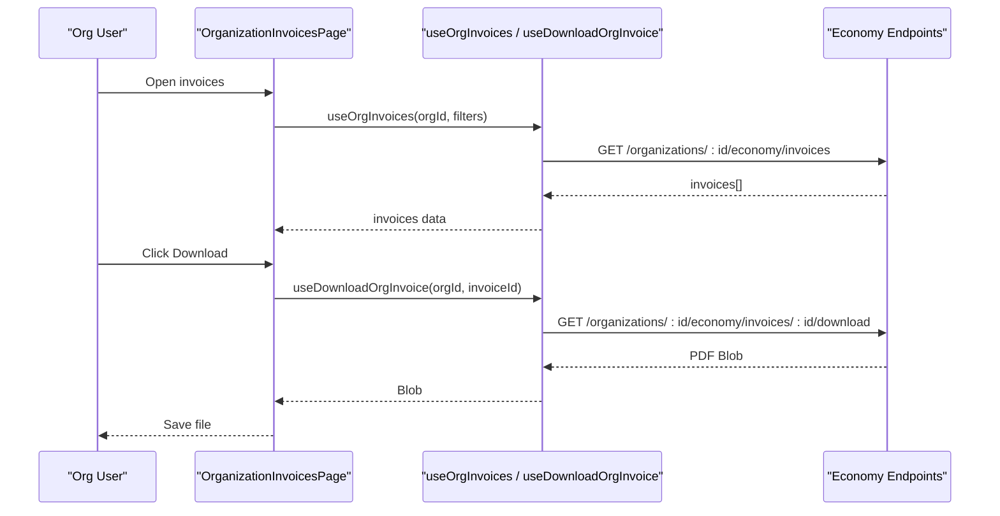

**Diagram sources**
- [apps/minside/src/routes/org/invoices.tsx](file://apps/minside/src/routes/org/invoices.tsx#L45-L203)
- [packages/client-sdk/src/types/economy.ts](file://packages/client-sdk/src/types/economy.ts#L41-L131)

**Section sources**
- [apps/minside/src/routes/org/invoices.tsx](file://apps/minside/src/routes/org/invoices.tsx#L45-L203)
- [packages/client-sdk/src/types/economy.ts](file://packages/client-sdk/src/types/economy.ts#L41-L131)

### Organization Context Switching and Cross-Context Navigation
Min Side and Monitoring apps support switching between personal and organization contexts:
- Context validation persists and restores the selected account type and organization.
- Account switcher provides navigation between personal and organization modes.
- Routes are protected by required context.

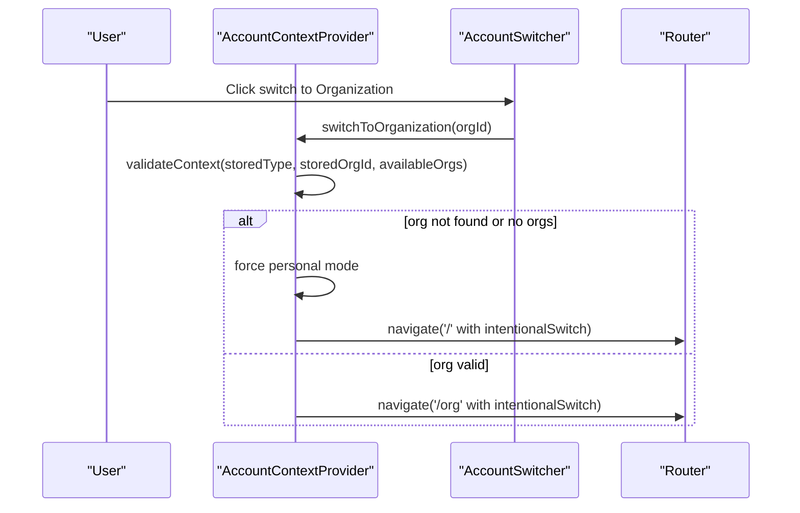

**Diagram sources**
- [apps/minside/src/providers/AccountContextProvider.tsx](file://apps/minside/src/providers/AccountContextProvider.tsx#L141-L213)
- [apps/minside/src/components/AccountSwitcher.tsx](file://apps/minside/src/components/AccountSwitcher.tsx#L86-L116)
- [apps/minside/src/App.tsx](file://apps/minside/src/App.tsx#L137-L158)
- [apps/monitoring/src/providers/AccountContextProvider.tsx](file://apps/monitoring/src/providers/AccountContextProvider.tsx#L141-L213)
- [apps/monitoring/src/components/AccountSwitcher.tsx](file://apps/monitoring/src/components/AccountSwitcher.tsx#L86-L116)
- [apps/monitoring/src/App.tsx](file://apps/monitoring/src/App.tsx#L137-L158)

**Section sources**
- [apps/minside/src/providers/AccountContextProvider.tsx](file://apps/minside/src/providers/AccountContextProvider.tsx#L141-L213)
- [apps/minside/src/components/AccountSwitcher.tsx](file://apps/minside/src/components/AccountSwitcher.tsx#L86-L116)
- [apps/minside/src/App.tsx](file://apps/minside/src/App.tsx#L137-L158)
- [apps/monitoring/src/providers/AccountContextProvider.tsx](file://apps/monitoring/src/providers/AccountContextProvider.tsx#L141-L213)
- [apps/monitoring/src/components/AccountSwitcher.tsx](file://apps/monitoring/src/components/AccountSwitcher.tsx#L86-L116)
- [apps/monitoring/src/App.tsx](file://apps/monitoring/src/App.tsx#L137-L158)

### Organization Activity Tracking and Audit Logs
Audit logging captures organization-related actions with metadata, including branding updates. Compliance tables track user actions and resource changes.

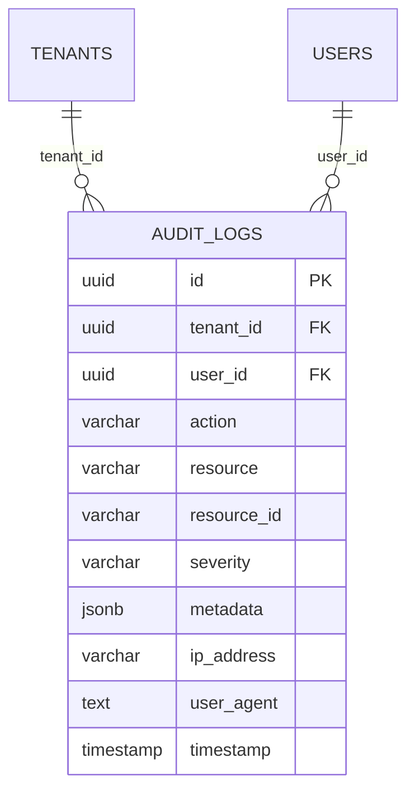

**Diagram sources**
- [packages/database-schema/src/compliance/audit-logs.ts](file://packages/database-schema/src/compliance/audit-logs.ts#L16-L34)
- [docs/technical/ERD.md](file://docs/technical/ERD.md#L346-L362)

**Section sources**
- [packages/database-schema/src/compliance/audit-logs.ts](file://packages/database-schema/src/compliance/audit-logs.ts#L16-L34)
- [apps/api/src/modules/organizations/organization-setup.service.ts](file://apps/api/src/modules/organizations/organization-setup.service.ts#L238-L250)
- [docs/technical/ERD.md](file://docs/technical/ERD.md#L346-L362)

### Organization Role Management and Permission Delegation
- Organization membership roles (admin/member) are defined in organization settings.
- Capability-based navigation gates restrict optional widgets (e.g., Messages, Economy).
- Subdelegation and custody scopes are governed by policy and enforced by the API.

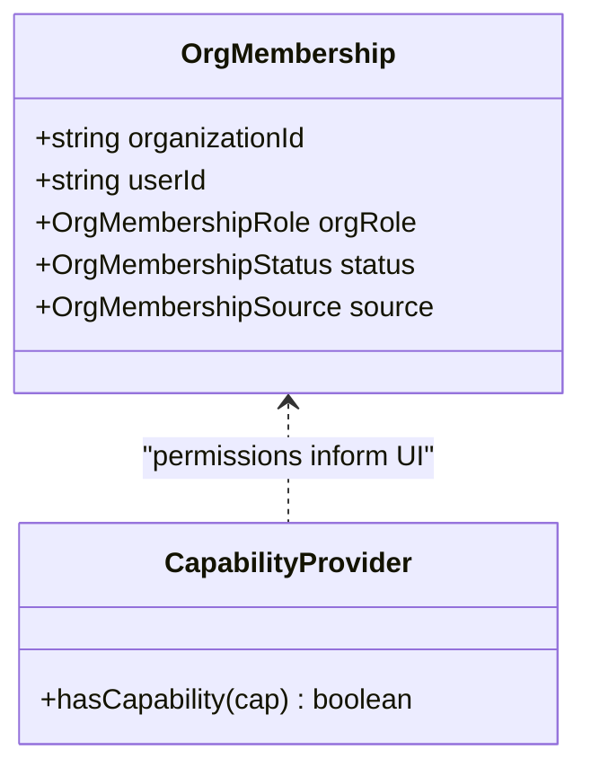

**Diagram sources**
- [packages/client-sdk/src/types/rbac.ts](file://packages/client-sdk/src/types/rbac.ts#L104-L125)
- [apps/backoffice/src/components/dashboard/OrgMemberDashboard.tsx](file://apps/backoffice/src/components/dashboard/OrgMemberDashboard.tsx#L334-L338)

**Section sources**
- [packages/client-sdk/src/types/rbac.ts](file://packages/client-sdk/src/types/rbac.ts#L104-L125)
- [apps/backoffice/src/components/dashboard/OrgMemberDashboard.tsx](file://apps/backoffice/src/components/dashboard/OrgMemberDashboard.tsx#L334-L338)
- [tests/e2e/custody-delegation.spec.ts](file://tests/e2e/custody-delegation.spec.ts#L104-L141)
- [docs/digilist-platform/brd.md](file://docs/digilist-platform/brd.md#L164-L171)

### Organization Data Isolation and Administrative Controls
- Tenant and data isolation are enforced across applications and APIs.
- Explicit separation between Back-office Organizations and User Organizations prevents implicit inheritance.
- Administrative controls include RBAC, entitlements, and audit logging.

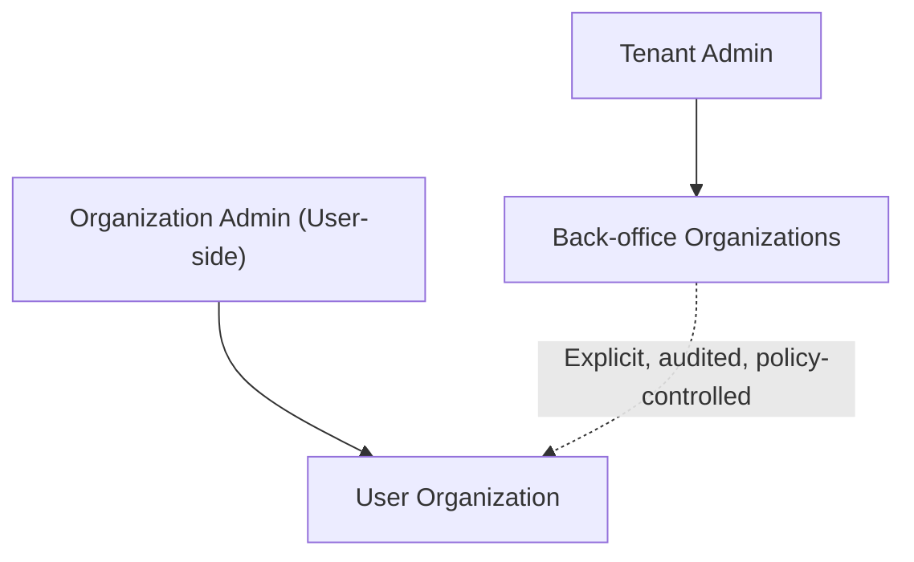

**Diagram sources**
- [docs/digilist-platform/roles/tenant-admin-backoffice/prd.md](file://docs/digilist-platform/roles/tenant-admin-backoffice/prd.md#L105-L117)
- [docs/digilist-platform/brd.md](file://docs/digilist-platform/brd.md#L156-L190)

**Section sources**
- [docs/digilist-platform/roles/tenant-admin-backoffice/prd.md](file://docs/digilist-platform/roles/tenant-admin-backoffice/prd.md#L105-L117)
- [docs/digilist-platform/brd.md](file://docs/digilist-platform/brd.md#L156-L190)

## Dependency Analysis
The organization portal relies on:
- Client SDK for organization and economy operations.
- API endpoints for administrative actions and organization data.
- Database schema for audit logging and compliance.
- Capability-based UI gating for optional features.

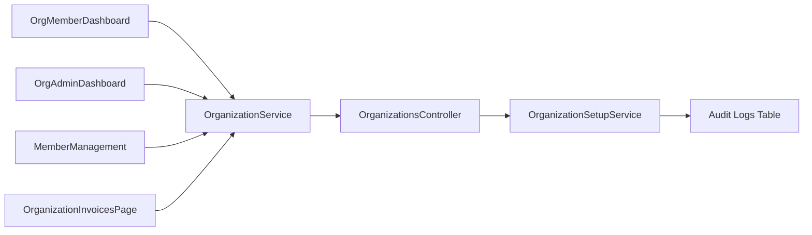

**Diagram sources**
- [apps/backoffice/src/components/dashboard/OrgMemberDashboard.tsx](file://apps/backoffice/src/components/dashboard/OrgMemberDashboard.tsx#L332-L377)
- [apps/backoffice/src/routes/org-admin/dashboard.tsx](file://apps/backoffice/src/routes/org-admin/dashboard.tsx#L39-L357)
- [apps/backoffice/src/components/organizations/MemberManagement.tsx](file://apps/backoffice/src/components/organizations/MemberManagement.tsx#L31-L257)
- [apps/minside/src/routes/org/invoices.tsx](file://apps/minside/src/routes/org/invoices.tsx#L45-L203)
- [packages/client-sdk/src/services/organization.service.ts](file://packages/client-sdk/src/services/organization.service.ts#L35-L136)
- [apps/api/src/modules/organizations/organizations.controller.ts](file://apps/api/src/modules/organizations/organizations.controller.ts#L14-L207)
- [apps/api/src/modules/organizations/organization-setup.service.ts](file://apps/api/src/modules/organizations/organization-setup.service.ts#L111-L330)
- [packages/database-schema/src/compliance/audit-logs.ts](file://packages/database-schema/src/compliance/audit-logs.ts#L16-L34)

**Section sources**
- [packages/client-sdk/src/services/organization.service.ts](file://packages/client-sdk/src/services/organization.service.ts#L35-L136)
- [apps/api/src/modules/organizations/organizations.controller.ts](file://apps/api/src/modules/organizations/organizations.controller.ts#L14-L207)
- [apps/api/src/modules/organizations/organization-setup.service.ts](file://apps/api/src/modules/organizations/organization-setup.service.ts#L111-L330)
- [packages/database-schema/src/compliance/audit-logs.ts](file://packages/database-schema/src/compliance/audit-logs.ts#L16-L34)

## Performance Considerations
- Use capability checks to gate optional widgets and reduce unnecessary data fetching.
- Implement pagination and filtering for large datasets (members, invoices).
- Cache organization-scoped data where appropriate to minimize API calls.
- Optimize calendar previews and pending item lists to load quickly.

## Troubleshooting Guide
Common issues and resolutions:
- Organization context not restored: Verify local storage values and context validation logic.
- Missing optional widgets: Confirm capability checks and entitlements.
- Member management errors: Ensure correct role values and RBAC permissions.
- Audit logs not appearing: Check audit service integration and database schema.

**Section sources**
- [apps/minside/src/providers/AccountContextProvider.tsx](file://apps/minside/src/providers/AccountContextProvider.tsx#L141-L213)
- [apps/backoffice/src/components/dashboard/OrgMemberDashboard.tsx](file://apps/backoffice/src/components/dashboard/OrgMemberDashboard.tsx#L334-L338)
- [apps/backoffice/src/components/organizations/MemberManagement.tsx](file://apps/backoffice/src/components/organizations/MemberManagement.tsx#L49-L93)
- [apps/api/src/modules/organizations/organization-setup.service.ts](file://apps/api/src/modules/organizations/organization-setup.service.ts#L238-L250)

## Conclusion
The organization portal integrates administrative dashboards, member management, branding configuration, invoices, and context switching across applications. It enforces data isolation, capability-based UI gating, and comprehensive audit logging to support compliance and governance.

## Appendices
- Organization wizard steps for setup and branding.
- RBAC capabilities for booking actions and navigation.
- Entitlements governance and feature flags.

**Section sources**
- [apps/backoffice/src/components/organizations/OrganizationWizard.tsx](file://apps/backoffice/src/components/organizations/OrganizationWizard.tsx#L46-L69)
- [packages/client-sdk/src/types/rbac.ts](file://packages/client-sdk/src/types/rbac.ts#L82-L95)
- [docs/digilist-platform/brd.md](file://docs/digilist-platform/brd.md#L136-L190)