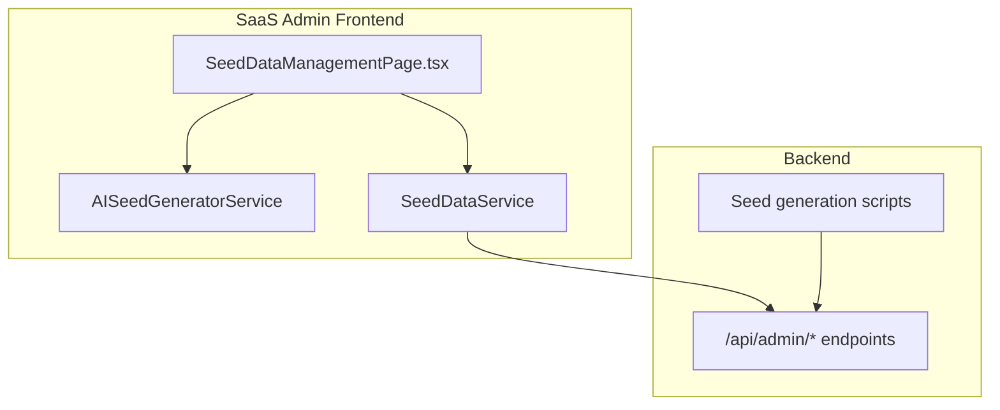
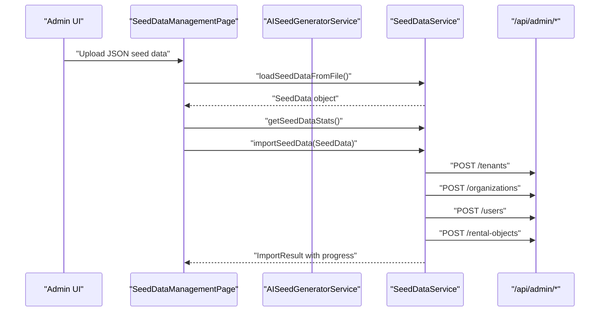
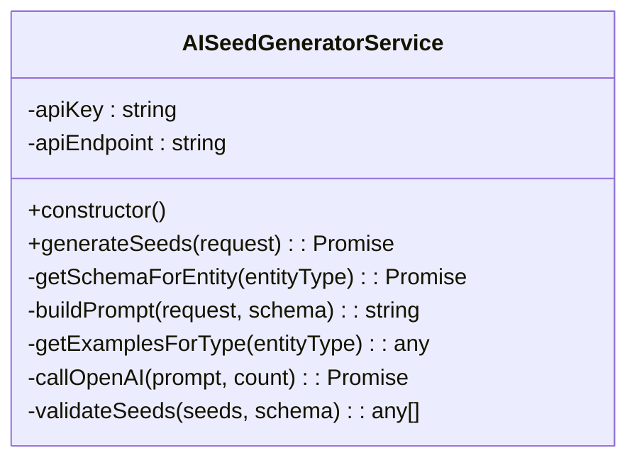
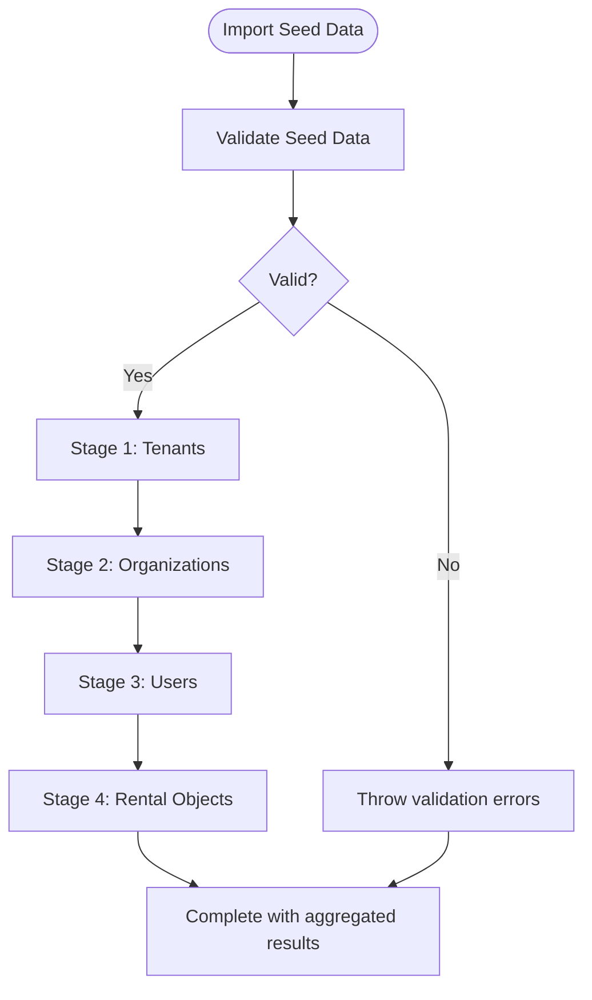
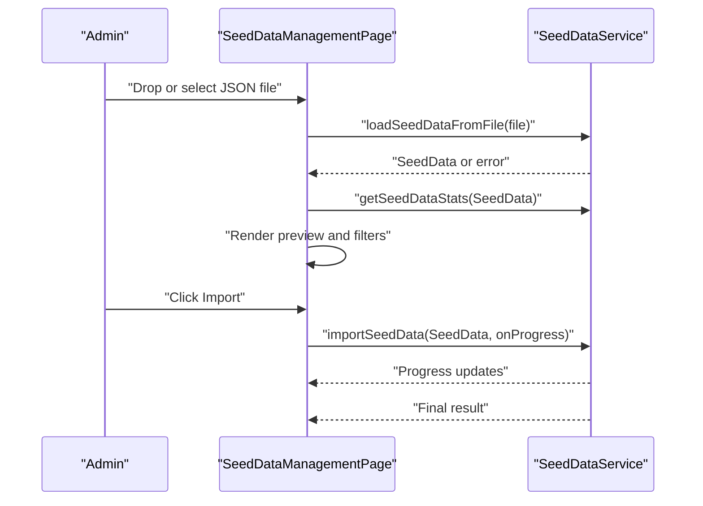
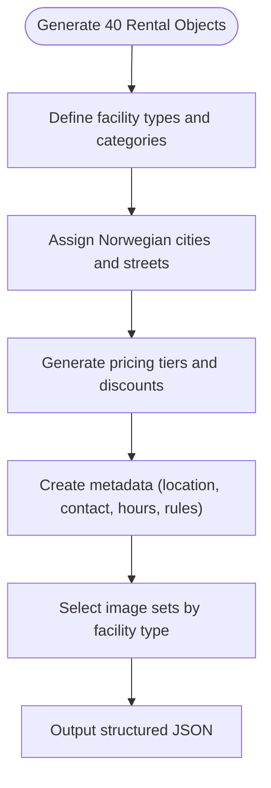
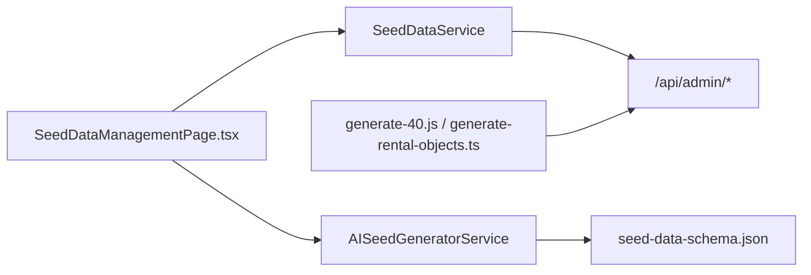

# AI Seed Generation

<cite>
**Referenced Files in This Document**
- [ai-seed-generator.service.ts](file://apps/saas-admin/src/services/ai-seed-generator.service.ts)
- [seed-data.service.ts](file://apps/saas-admin/src/services/seed-data.service.ts)
- [SeedDataManagementPage.tsx](file://apps/saas-admin/src/routes/seed-data/SeedDataManagementPage.tsx)
- [README.md](file://apps/saas-admin/src/routes/seed-data/README.md)
- [generate-40.js](file://apps/api/scripts/generate-40.js)
- [generate-rental-objects.ts](file://apps/api/scripts/generate-rental-objects.ts)
</cite>

## Table of Contents
1. [Introduction](#introduction)
2. [Project Structure](#project-structure)
3. [Core Components](#core-components)
4. [Architecture Overview](#architecture-overview)
5. [Detailed Component Analysis](#detailed-component-analysis)
6. [Dependency Analysis](#dependency-analysis)
7. [Performance Considerations](#performance-considerations)
8. [Troubleshooting Guide](#troubleshooting-guide)
9. [Conclusion](#conclusion)

## Introduction
This document describes the AI Seed Generation system in the SaaS Admin Application. It covers how the system generates realistic tenant data, user profiles, and property listings using AI, how administrators configure generation parameters, and how the generated data is validated and imported into the backend. It also documents the seed data management workflows, batch import capabilities, and quality assurance measures, along with integration patterns with backend seed services and database population strategies.

## Project Structure
The AI Seed Generation capability spans the SaaS Admin frontend and backend seed generation utilities:
- Frontend services for AI generation and seed data import
- UI for uploading, previewing, and importing seed data
- Backend scripts for deterministic seed generation and population

**Diagram sources**
- [SeedDataManagementPage.tsx](file://apps/saas-admin/src/routes/seed-data/SeedDataManagementPage.tsx#L1-L154)
- [ai-seed-generator.service.ts](file://apps/saas-admin/src/services/ai-seed-generator.service.ts#L1-L216)
- [seed-data.service.ts](file://apps/saas-admin/src/services/seed-data.service.ts#L1-L383)
- [generate-40.js](file://apps/api/scripts/generate-40.js#L1-L165)
- [generate-rental-objects.ts](file://apps/api/scripts/generate-rental-objects.ts#L1-L202)

**Section sources**
- [SeedDataManagementPage.tsx](file://apps/saas-admin/src/routes/seed-data/SeedDataManagementPage.tsx#L1-L154)
- [ai-seed-generator.service.ts](file://apps/saas-admin/src/services/ai-seed-generator.service.ts#L1-L216)
- [seed-data.service.ts](file://apps/saas-admin/src/services/seed-data.service.ts#L1-L383)
- [README.md](file://apps/saas-admin/src/routes/seed-data/README.md#L1-L162)
- [generate-40.js](file://apps/api/scripts/generate-40.js#L1-L165)
- [generate-rental-objects.ts](file://apps/api/scripts/generate-rental-objects.ts#L1-L202)

## Core Components
- AI Seed Generator Service: Integrates with an external AI API to produce structured, schema-aligned seed data for tenants, organizations, users, pricing groups, organization members, rental objects, amenities, addons, and bookings.
- Seed Data Service: Provides validation, parsing, statistics, and import orchestration for seed data JSON, including progress callbacks and error reporting.
- Seed Data Management UI: Provides drag-and-drop upload, preview, filtering, progress tracking, and import initiation for seed data.

Key responsibilities:
- Parameterized generation via entity type, count, tenant ID, optional prompt, and base template
- Prompt engineering tailored to Norwegian context and schema compliance
- JSON schema-driven validation and basic field presence checks
- Batch import with staged progress and error aggregation

**Section sources**
- [ai-seed-generator.service.ts](file://apps/saas-admin/src/services/ai-seed-generator.service.ts#L7-L42)
- [seed-data.service.ts](file://apps/saas-admin/src/services/seed-data.service.ts#L133-L158)
- [seed-data.service.ts](file://apps/saas-admin/src/services/seed-data.service.ts#L191-L357)
- [SeedDataManagementPage.tsx](file://apps/saas-admin/src/routes/seed-data/SeedDataManagementPage.tsx#L98-L115)
- [README.md](file://apps/saas-admin/src/routes/seed-data/README.md#L9-L36)

## Architecture Overview
The AI Seed Generation system follows a layered architecture:
- UI layer orchestrates user actions (upload, preview, import)
- Service layer handles AI generation and seed data operations
- Backend layer exposes admin endpoints for importing seed data
- Scripts layer provides deterministic seed generation utilities

**Diagram sources**
- [SeedDataManagementPage.tsx](file://apps/saas-admin/src/routes/seed-data/SeedDataManagementPage.tsx#L98-L115)
- [seed-data.service.ts](file://apps/saas-admin/src/services/seed-data.service.ts#L191-L357)

## Detailed Component Analysis

### AI Seed Generator Service
The AI Seed Generator Service encapsulates AI integration for generating realistic, schema-aligned seed data. It:
- Accepts a generation request with entity type, count, tenant ID, optional prompt, and base template
- Loads a JSON schema for the target entity type
- Builds a prompt that enforces schema compliance, Norwegian context, and referential integrity
- Calls the AI API and parses the response into a structured array
- Performs basic validation against the schema’s required fields

**Diagram sources**
- [ai-seed-generator.service.ts](file://apps/saas-admin/src/services/ai-seed-generator.service.ts#L15-L216)

Key prompt engineering aspects:
- Explicit schema inclusion and strict JSON output requirement
- Norwegian-specific constraints (names, addresses, postal codes, pricing)
- Referential integrity enforcement (tenant and organization IDs)
- Optional additional instructions and example data injection

AI API integration:
- Uses a configurable endpoint and API key
- Sends a system message and user prompt
- Enforces JSON object response format
- Parses and normalizes returned arrays

Validation:
- Filters generated items to ensure required fields are present according to the schema

**Section sources**
- [ai-seed-generator.service.ts](file://apps/saas-admin/src/services/ai-seed-generator.service.ts#L7-L42)
- [ai-seed-generator.service.ts](file://apps/saas-admin/src/services/ai-seed-generator.service.ts#L47-L65)
- [ai-seed-generator.service.ts](file://apps/saas-admin/src/services/ai-seed-generator.service.ts#L70-L98)
- [ai-seed-generator.service.ts](file://apps/saas-admin/src/services/ai-seed-generator.service.ts#L157-L198)
- [ai-seed-generator.service.ts](file://apps/saas-admin/src/services/ai-seed-generator.service.ts#L200-L211)

### Seed Data Service
The Seed Data Service manages seed data lifecycle:
- Defines TypeScript interfaces for seed data structures (meta, tenants, organizations, users, rental objects)
- Validates seed data structure and content
- Loads seed data from uploaded JSON files
- Imports seed data to backend via admin endpoints with progress callbacks
- Computes statistics for preview and filtering

**Diagram sources**
- [seed-data.service.ts](file://apps/saas-admin/src/services/seed-data.service.ts#L133-L158)
- [seed-data.service.ts](file://apps/saas-admin/src/services/seed-data.service.ts#L191-L357)

Data validation:
- Ensures presence of required sections and array structures
- Validates rental object fields (IDs, names, category keys, images, pricing, metadata)

Statistics:
- Computes totals for objects, users, organizations, tenants
- Aggregates category counts, image totals, and objects with pricing

Import pipeline:
- Iterates through each entity type and posts to respective admin endpoints
- Emits progress updates and collects errors per entity type

**Section sources**
- [seed-data.service.ts](file://apps/saas-admin/src/services/seed-data.service.ts#L100-L128)
- [seed-data.service.ts](file://apps/saas-admin/src/services/seed-data.service.ts#L133-L158)
- [seed-data.service.ts](file://apps/saas-admin/src/services/seed-data.service.ts#L163-L186)
- [seed-data.service.ts](file://apps/saas-admin/src/services/seed-data.service.ts#L191-L357)
- [seed-data.service.ts](file://apps/saas-admin/src/services/seed-data.service.ts#L362-L382)

### Seed Data Management UI
The Seed Data Management UI provides:
- Drag-and-drop upload with fallback file selection
- Real-time validation and error display
- Data preview with statistics and category filtering
- Progress tracking during import
- Success and error reporting

**Diagram sources**
- [SeedDataManagementPage.tsx](file://apps/saas-admin/src/routes/seed-data/SeedDataManagementPage.tsx#L98-L115)
- [seed-data.service.ts](file://apps/saas-admin/src/services/seed-data.service.ts#L163-L186)
- [seed-data.service.ts](file://apps/saas-admin/src/services/seed-data.service.ts#L191-L357)

**Section sources**
- [SeedDataManagementPage.tsx](file://apps/saas-admin/src/routes/seed-data/SeedDataManagementPage.tsx#L1-L154)
- [README.md](file://apps/saas-admin/src/routes/seed-data/README.md#L9-L36)
- [README.md](file://apps/saas-admin/src/routes/seed-data/README.md#L51-L69)

### Backend Seed Generation Utilities
Deterministic seed generation scripts create realistic datasets for development and testing:
- Generates 40 Norwegian rental objects with consistent IDs, pricing tiers, images, metadata, and rules
- Produces structured JSON consumable by the seed data management UI
- Supports category-specific attributes and Norwegian locale specifics

**Diagram sources**
- [generate-40.js](file://apps/api/scripts/generate-40.js#L66-L162)
- [generate-rental-objects.ts](file://apps/api/scripts/generate-rental-objects.ts#L145-L197)

**Section sources**
- [generate-40.js](file://apps/api/scripts/generate-40.js#L1-L165)
- [generate-rental-objects.ts](file://apps/api/scripts/generate-rental-objects.ts#L1-L202)

## Dependency Analysis
- The UI depends on SeedDataService for data loading, validation, statistics, and import orchestration
- SeedDataService depends on backend admin endpoints for persistence
- AISeedGeneratorService depends on an external AI API and a schema definition file
- Backend scripts provide deterministic seed data for rapid development and testing

**Diagram sources**
- [SeedDataManagementPage.tsx](file://apps/saas-admin/src/routes/seed-data/SeedDataManagementPage.tsx#L25-L33)
- [seed-data.service.ts](file://apps/saas-admin/src/services/seed-data.service.ts#L191-L357)
- [ai-seed-generator.service.ts](file://apps/saas-admin/src/services/ai-seed-generator.service.ts#L47-L65)
- [generate-40.js](file://apps/api/scripts/generate-40.js#L1-L165)
- [generate-rental-objects.ts](file://apps/api/scripts/generate-rental-objects.ts#L1-L202)

**Section sources**
- [SeedDataManagementPage.tsx](file://apps/saas-admin/src/routes/seed-data/SeedDataManagementPage.tsx#L25-L33)
- [seed-data.service.ts](file://apps/saas-admin/src/services/seed-data.service.ts#L191-L357)
- [ai-seed-generator.service.ts](file://apps/saas-admin/src/services/ai-seed-generator.service.ts#L47-L65)

## Performance Considerations
- AI generation latency: The AI API call introduces network latency; consider batching requests and caching prompts where appropriate
- Import throughput: The current import process posts entities sequentially; consider chunking and parallelization for large datasets
- Validation overhead: JSON parsing and schema checks occur during upload and import; ensure efficient parsing and minimal rework
- UI responsiveness: Progress callbacks and incremental rendering keep the UI responsive during long-running operations

## Troubleshooting Guide
Common issues and resolutions:
- Missing API key: The AI generator throws an error if the API key is not configured; ensure the environment variable is set
- Invalid seed data: SeedDataService validates structure and content; review validation errors and fix missing fields or incorrect types
- Import failures: SeedDataService aggregates errors per entity type; inspect error messages and retry failed batches
- AI response parsing: If the AI response is not valid JSON, the service throws a parsing error; verify prompt formatting and response schema

**Section sources**
- [ai-seed-generator.service.ts](file://apps/saas-admin/src/services/ai-seed-generator.service.ts#L28-L30)
- [seed-data.service.ts](file://apps/saas-admin/src/services/seed-data.service.ts#L133-L158)
- [seed-data.service.ts](file://apps/saas-admin/src/services/seed-data.service.ts#L342-L356)

## Conclusion
The AI Seed Generation system combines AI-driven data synthesis with robust frontend seed management and backend import pipelines. Administrators can configure generation parameters, leverage AI for realistic datasets, validate and preview data, and import it into the system with progress tracking and error reporting. Deterministic backend scripts complement the AI approach for controlled, repeatable datasets. Together, these components enable efficient onboarding of tenants, organizations, users, and rental objects for development, testing, and demonstration environments.