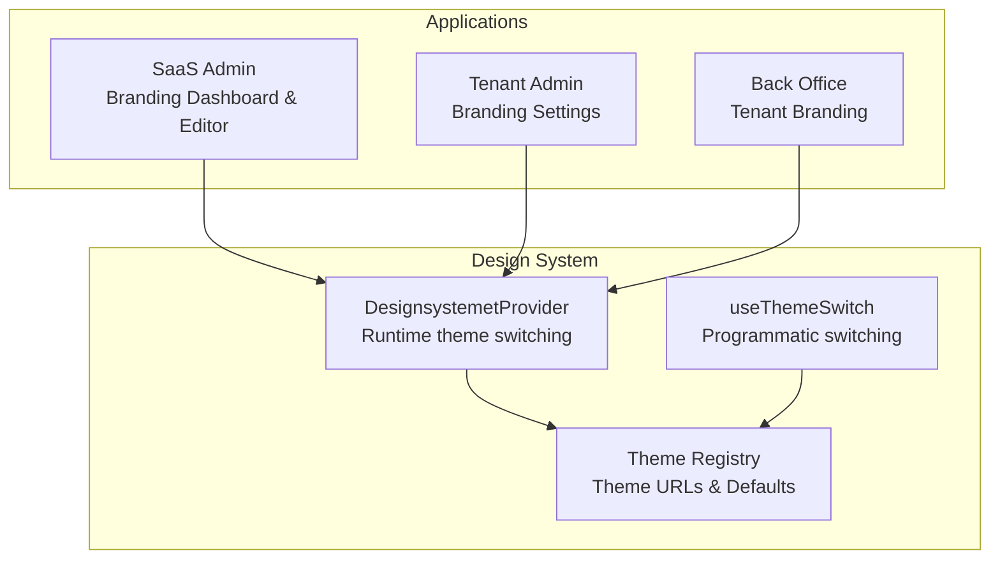
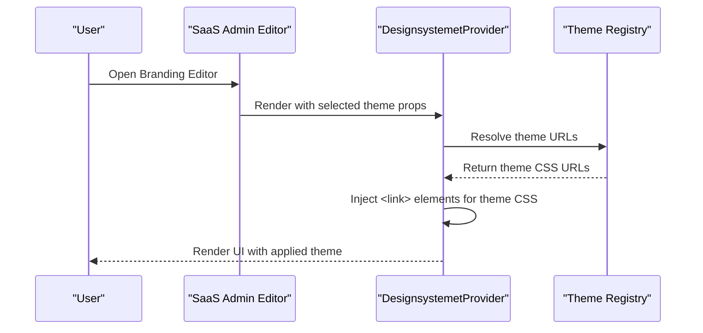
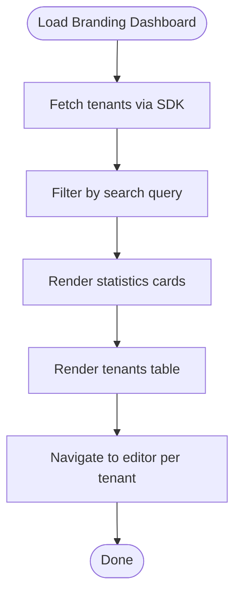
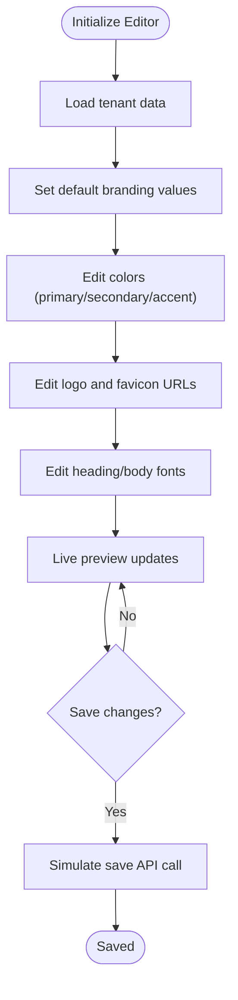
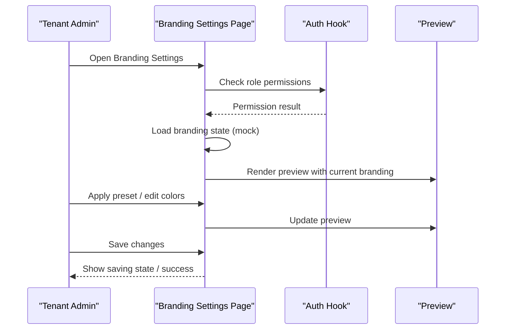
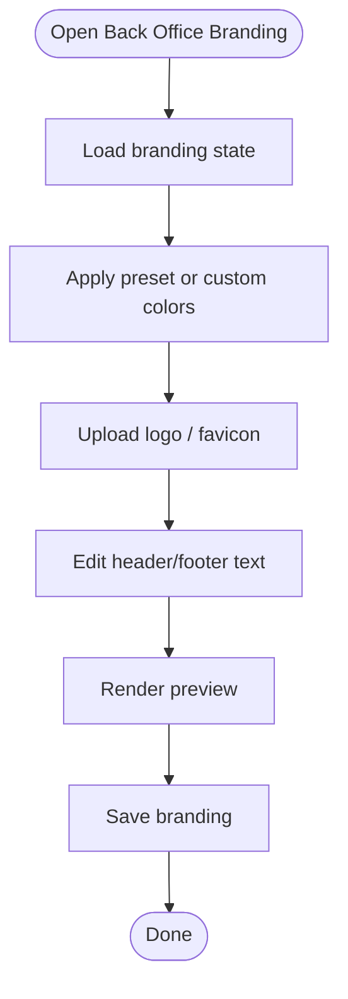
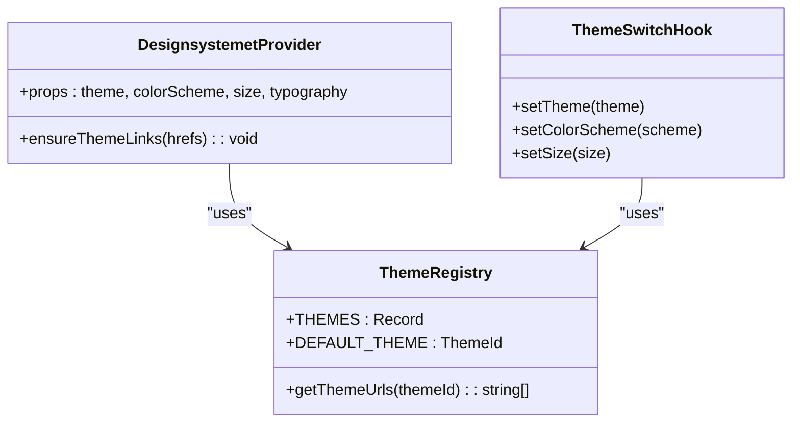
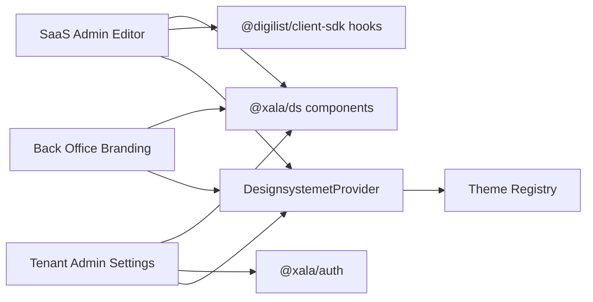

# Branding & Customization

<cite>
**Referenced Files in This Document**
- [apps/saas-admin/src/routes/branding/index.tsx](file://apps/saas-admin/src/routes/branding/index.tsx)
- [apps/saas-admin/src/routes/branding/[tenantId].tsx](file://apps/saas-admin/src/routes/branding/[tenantId].tsx)
- [apps/backoffice/src/routes/tenant/branding.tsx](file://apps/backoffice/src/routes/tenant/branding.tsx)
- [apps/tenant-admin/src/routes/settings/branding.tsx](file://apps/tenant-admin/src/routes/settings/branding.tsx)
- [packages/ds-registry/examples/theme-switching.tsx](file://packages/ds-registry/examples/theme-switching.tsx)
- [packages/ds-themes/src/index.ts](file://packages/ds-themes/src/index.ts)
- [packages/ds/src/provider.tsx](file://packages/ds/src/provider.tsx)
- [packages/ds/src/ThemeProvider.tsx](file://packages/ds/src/ThemeProvider.tsx)
</cite>

## Table of Contents
1. [Introduction](#introduction)
2. [Project Structure](#project-structure)
3. [Core Components](#core-components)
4. [Architecture Overview](#architecture-overview)
5. [Detailed Component Analysis](#detailed-component-analysis)
6. [Dependency Analysis](#dependency-analysis)
7. [Performance Considerations](#performance-considerations)
8. [Troubleshooting Guide](#troubleshooting-guide)
9. [Conclusion](#conclusion)

## Introduction
This document describes the Branding and Customization system for the SaaS Admin Application. It covers tenant-specific branding management, the branding editor for themes, logos, colors, and brand assets, and the integration with the design system’s theme provider architecture. It also documents preview capabilities, asset upload workflows, and brand consistency enforcement across tenant experiences.

## Project Structure
The branding system spans multiple applications and packages:
- SaaS Admin application exposes a branding dashboard and editor for managing tenant branding.
- Tenant Admin application provides a settings page for tenants to customize branding.
- Back Office application includes a branding page for tenant-level customization.
- The design system provides a theme provider and registry enabling runtime theme switching and consistent styling.

**Diagram sources**
- [apps/saas-admin/src/routes/branding/index.tsx](file://apps/saas-admin/src/routes/branding/index.tsx#L1-L190)
- [apps/saas-admin/src/routes/branding/[tenantId].tsx](file://apps/saas-admin/src/routes/branding/[tenantId].tsx#L1-L453)
- [apps/tenant-admin/src/routes/settings/branding.tsx](file://apps/tenant-admin/src/routes/settings/branding.tsx#L1-L479)
- [apps/backoffice/src/routes/tenant/branding.tsx](file://apps/backoffice/src/routes/tenant/branding.tsx#L1-L322)
- [packages/ds/src/provider.tsx](file://packages/ds/src/provider.tsx#L1-L130)
- [packages/ds-themes/src/index.ts](file://packages/ds-themes/src/index.ts#L1-L56)
- [packages/ds-registry/examples/theme-switching.tsx](file://packages/ds-registry/examples/theme-switching.tsx#L1-L124)

**Section sources**
- [apps/saas-admin/src/routes/branding/index.tsx](file://apps/saas-admin/src/routes/branding/index.tsx#L1-L190)
- [apps/saas-admin/src/routes/branding/[tenantId].tsx](file://apps/saas-admin/src/routes/branding/[tenantId].tsx#L1-L453)
- [apps/tenant-admin/src/routes/settings/branding.tsx](file://apps/tenant-admin/src/routes/settings/branding.tsx#L1-L479)
- [apps/backoffice/src/routes/tenant/branding.tsx](file://apps/backoffice/src/routes/tenant/branding.tsx#L1-L322)
- [packages/ds/src/provider.tsx](file://packages/ds/src/provider.tsx#L1-L130)
- [packages/ds-themes/src/index.ts](file://packages/ds-themes/src/index.ts#L1-L56)
- [packages/ds-registry/examples/theme-switching.tsx](file://packages/ds-registry/examples/theme-switching.tsx#L1-L124)

## Core Components
- SaaS Admin Branding Dashboard: Lists tenants, filters by name/slug, shows branding status badges, and navigates to the editor per tenant.
- SaaS Admin Branding Editor: Edits tenant branding (colors, logo, favicon, typography), live preview, and save/reset controls.
- Tenant Admin Branding Settings: Tenant-level customization (colors, logo upload areas, text content, preview).
- Back Office Tenant Branding: Tenant-level branding customization with presets, color pickers, and preview.
- Design System Theme Provider: Manages runtime theme switching, color scheme, size, and typography via a provider and registry.

**Section sources**
- [apps/saas-admin/src/routes/branding/index.tsx](file://apps/saas-admin/src/routes/branding/index.tsx#L27-L187)
- [apps/saas-admin/src/routes/branding/[tenantId].tsx](file://apps/saas-admin/src/routes/branding/[tenantId].tsx#L67-L449)
- [apps/tenant-admin/src/routes/settings/branding.tsx](file://apps/tenant-admin/src/routes/settings/branding.tsx#L36-L478)
- [apps/backoffice/src/routes/tenant/branding.tsx](file://apps/backoffice/src/routes/tenant/branding.tsx#L33-L321)
- [packages/ds/src/provider.tsx](file://packages/ds/src/provider.tsx#L102-L129)
- [packages/ds-themes/src/index.ts](file://packages/ds-themes/src/index.ts#L38-L55)

## Architecture Overview
The branding system integrates tenant-facing customization with the design system’s theme provider. The provider dynamically loads theme CSS files and applies data attributes for color scheme, size, and typography. The theme registry defines official and custom themes, ensuring consistent loading and switching.

**Diagram sources**
- [apps/saas-admin/src/routes/branding/[tenantId].tsx](file://apps/saas-admin/src/routes/branding/[tenantId].tsx#L67-L120)
- [packages/ds/src/provider.tsx](file://packages/ds/src/provider.tsx#L102-L129)
- [packages/ds-themes/src/index.ts](file://packages/ds-themes/src/index.ts#L49-L52)

## Detailed Component Analysis

### SaaS Admin Branding Dashboard
- Purpose: View tenant branding status, filter tenants, and navigate to editor.
- Features:
  - Statistics cards for total tenants, custom branding, and default branding.
  - Search by tenant name or slug.
  - Table with branding status badges and action to edit.
- UX: Uses design system components for headings, paragraphs, buttons, and tables.

**Diagram sources**
- [apps/saas-admin/src/routes/branding/index.tsx](file://apps/saas-admin/src/routes/branding/index.tsx#L32-L184)

**Section sources**
- [apps/saas-admin/src/routes/branding/index.tsx](file://apps/saas-admin/src/routes/branding/index.tsx#L27-L187)

### SaaS Admin Branding Editor
- Purpose: Configure tenant branding (colors, logo, favicon, typography) with live preview.
- Features:
  - Color controls mapped to design system tokens.
  - Typography selection from predefined fonts.
  - Live preview container reflecting current branding choices.
  - Reset and save actions with saving state.
- Data model: BrandingData interface with primary/secondary/accent colors, logo/favicon URLs, heading/body fonts, and border radius.

**Diagram sources**
- [apps/saas-admin/src/routes/branding/[tenantId].tsx](file://apps/saas-admin/src/routes/branding/[tenantId].tsx#L67-L120)
- [apps/saas-admin/src/routes/branding/[tenantId].tsx](file://apps/saas-admin/src/routes/branding/[tenantId].tsx#L100-L112)
- [apps/saas-admin/src/routes/branding/[tenantId].tsx](file://apps/saas-admin/src/routes/branding/[tenantId].tsx#L340-L422)

**Section sources**
- [apps/saas-admin/src/routes/branding/[tenantId].tsx](file://apps/saas-admin/src/routes/branding/[tenantId].tsx#L56-L65)
- [apps/saas-admin/src/routes/branding/[tenantId].tsx](file://apps/saas-admin/src/routes/branding/[tenantId].tsx#L182-L330)
- [apps/saas-admin/src/routes/branding/[tenantId].tsx](file://apps/saas-admin/src/routes/branding/[tenantId].tsx#L333-L447)

### Tenant Admin Branding Settings
- Purpose: Allow tenant administrators to customize branding with presets, uploads, and preview.
- Features:
  - Color scheme presets and custom color pickers.
  - Logo and favicon upload placeholders.
  - Header/footer text customization.
  - Responsive preview mockup.
  - Access control checks for tenant/admin roles.
- UX: Responsive layout adapts to mobile breakpoints; loading states and saving states are handled.

**Diagram sources**
- [apps/tenant-admin/src/routes/settings/branding.tsx](file://apps/tenant-admin/src/routes/settings/branding.tsx#L36-L112)
- [apps/tenant-admin/src/routes/settings/branding.tsx](file://apps/tenant-admin/src/routes/settings/branding.tsx#L84-L89)
- [apps/tenant-admin/src/routes/settings/branding.tsx](file://apps/tenant-admin/src/routes/settings/branding.tsx#L374-L475)

**Section sources**
- [apps/tenant-admin/src/routes/settings/branding.tsx](file://apps/tenant-admin/src/routes/settings/branding.tsx#L36-L154)
- [apps/tenant-admin/src/routes/settings/branding.tsx](file://apps/tenant-admin/src/routes/settings/branding.tsx#L156-L372)
- [apps/tenant-admin/src/routes/settings/branding.tsx](file://apps/tenant-admin/src/routes/settings/branding.tsx#L374-L475)

### Back Office Tenant Branding
- Purpose: Provide tenant-level branding customization within the Back Office application.
- Features:
  - Color scheme presets and custom color inputs.
  - Logo and favicon upload areas.
  - Header/footer text inputs.
  - Preview panel with custom colors and layout.
  - Mobile-responsive layout with breakpoint handling.

**Diagram sources**
- [apps/backoffice/src/routes/tenant/branding.tsx](file://apps/backoffice/src/routes/tenant/branding.tsx#L33-L73)
- [apps/backoffice/src/routes/tenant/branding.tsx](file://apps/backoffice/src/routes/tenant/branding.tsx#L254-L318)

**Section sources**
- [apps/backoffice/src/routes/tenant/branding.tsx](file://apps/backoffice/src/routes/tenant/branding.tsx#L33-L321)

### Theme Management and Provider Architecture
- Theme Registry: Defines official and custom themes and resolves theme URLs. Supports single or multiple CSS files per theme.
- DesignsystemetProvider: Dynamically injects theme CSS via a single link element per theme, removes old links to avoid conflicts, and applies data attributes for color scheme, size, and typography.
- Programmatic Switching: A helper hook allows changing theme, color scheme, and size without the provider.

**Diagram sources**
- [packages/ds-themes/src/index.ts](file://packages/ds-themes/src/index.ts#L38-L55)
- [packages/ds/src/provider.tsx](file://packages/ds/src/provider.tsx#L73-L89)
- [packages/ds-registry/examples/theme-switching.tsx](file://packages/ds-registry/examples/theme-switching.tsx#L83-L101)

**Section sources**
- [packages/ds-themes/src/index.ts](file://packages/ds-themes/src/index.ts#L18-L55)
- [packages/ds/src/provider.tsx](file://packages/ds/src/provider.tsx#L102-L129)
- [packages/ds-registry/examples/theme-switching.tsx](file://packages/ds-registry/examples/theme-switching.tsx#L12-L69)

## Dependency Analysis
- SaaS Admin Branding Editor depends on:
  - Design system components for UI.
  - SDK hooks for tenant data.
  - Theme provider for applying design tokens and preview rendering.
- Tenant Admin Branding Settings depends on:
  - Design system components and auth hook for access control.
  - Local state for branding values and preview.
- Back Office Tenant Branding depends on:
  - Design system components and local state for branding values.
- Theme Provider and Registry:
  - Provider injects theme CSS and applies data attributes.
  - Registry centralizes theme definitions and URLs.

**Diagram sources**
- [apps/saas-admin/src/routes/branding/[tenantId].tsx](file://apps/saas-admin/src/routes/branding/[tenantId].tsx#L8-L22)
- [apps/tenant-admin/src/routes/settings/branding.tsx](file://apps/tenant-admin/src/routes/settings/branding.tsx#L23-L25)
- [apps/backoffice/src/routes/tenant/branding.tsx](file://apps/backoffice/src/routes/tenant/branding.tsx#L21-L22)
- [packages/ds/src/provider.tsx](file://packages/ds/src/provider.tsx#L102-L129)
- [packages/ds-themes/src/index.ts](file://packages/ds-themes/src/index.ts#L38-L55)

**Section sources**
- [apps/saas-admin/src/routes/branding/[tenantId].tsx](file://apps/saas-admin/src/routes/branding/[tenantId].tsx#L8-L22)
- [apps/tenant-admin/src/routes/settings/branding.tsx](file://apps/tenant-admin/src/routes/settings/branding.tsx#L23-L25)
- [apps/backoffice/src/routes/tenant/branding.tsx](file://apps/backoffice/src/routes/tenant/branding.tsx#L21-L22)
- [packages/ds/src/provider.tsx](file://packages/ds/src/provider.tsx#L102-L129)
- [packages/ds-themes/src/index.ts](file://packages/ds-themes/src/index.ts#L38-L55)

## Performance Considerations
- Theme switching: The provider replaces theme link elements efficiently and avoids duplicate imports, minimizing reflows and repaints.
- Preview rendering: Live preview updates use inline styles; keep updates minimal to reduce layout thrashing.
- Asset uploads: Upload previews should be optimized; defer heavy image processing until after upload.
- Responsive design: Breakpoints are handled via CSS media queries; ensure preview containers adapt without excessive DOM changes.

## Troubleshooting Guide
- Theme conflicts: Ensure only one theme link is present at a time; the provider removes previous links before adding new ones.
- Color scheme not applying: Verify data attributes on the document element and CSS selectors that rely on them.
- Saving state: Confirm saving state flags are toggled appropriately to prevent concurrent saves.
- Access control: Tenant Admin branding checks roles before rendering; ensure auth hook returns expected values.

**Section sources**
- [packages/ds/src/provider.tsx](file://packages/ds/src/provider.tsx#L73-L89)
- [apps/tenant-admin/src/routes/settings/branding.tsx](file://apps/tenant-admin/src/routes/settings/branding.tsx#L91-L103)

## Conclusion
The Branding and Customization system provides a cohesive, tenant-focused experience across SaaS Admin, Tenant Admin, and Back Office applications. It leverages the design system’s theme provider and registry to enable runtime theme switching, consistent design tokens, and responsive previews. The editor and settings pages support color customization, logo/favicon uploads, typography selection, and immediate visual feedback, ensuring brand consistency and ease of use for administrators.