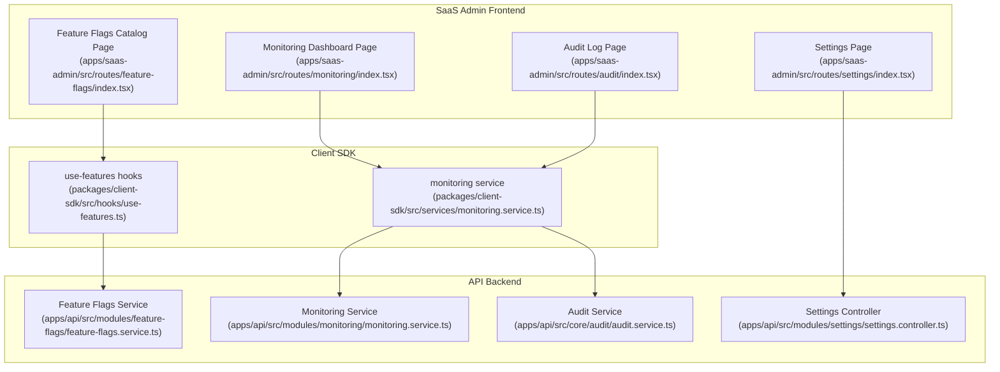
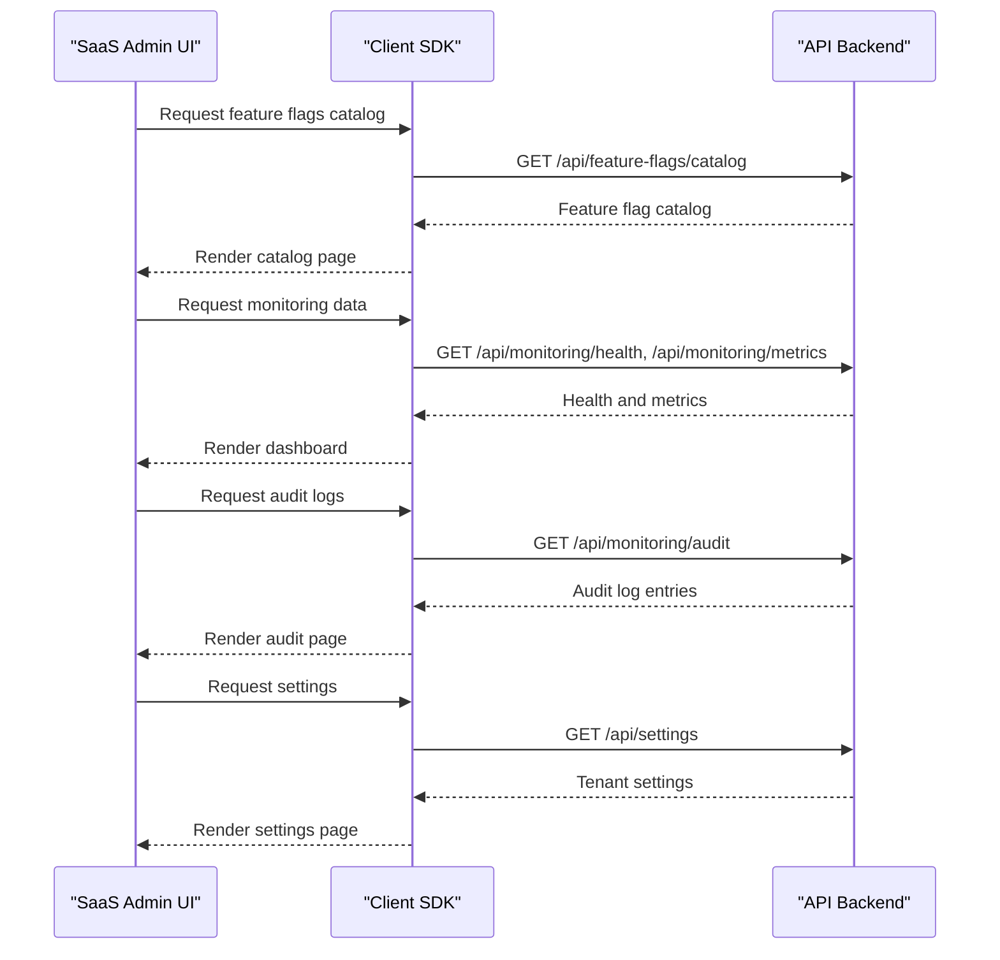
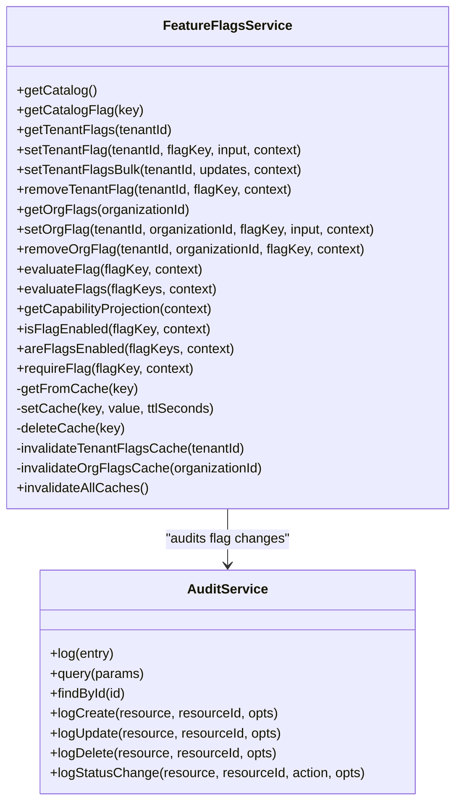
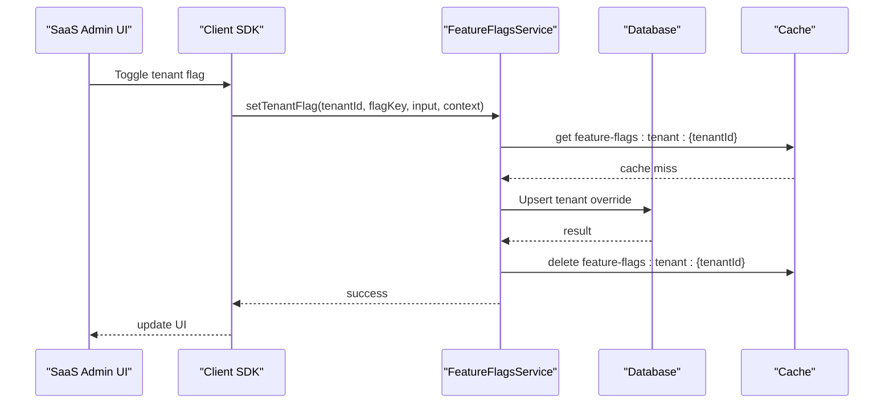
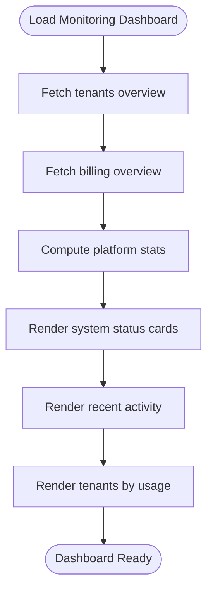
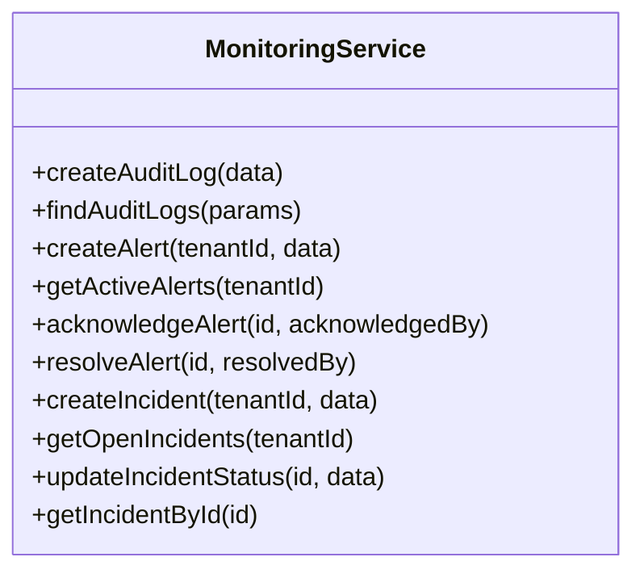
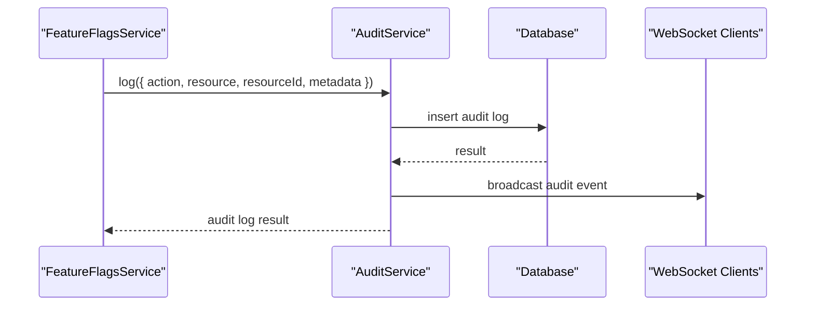
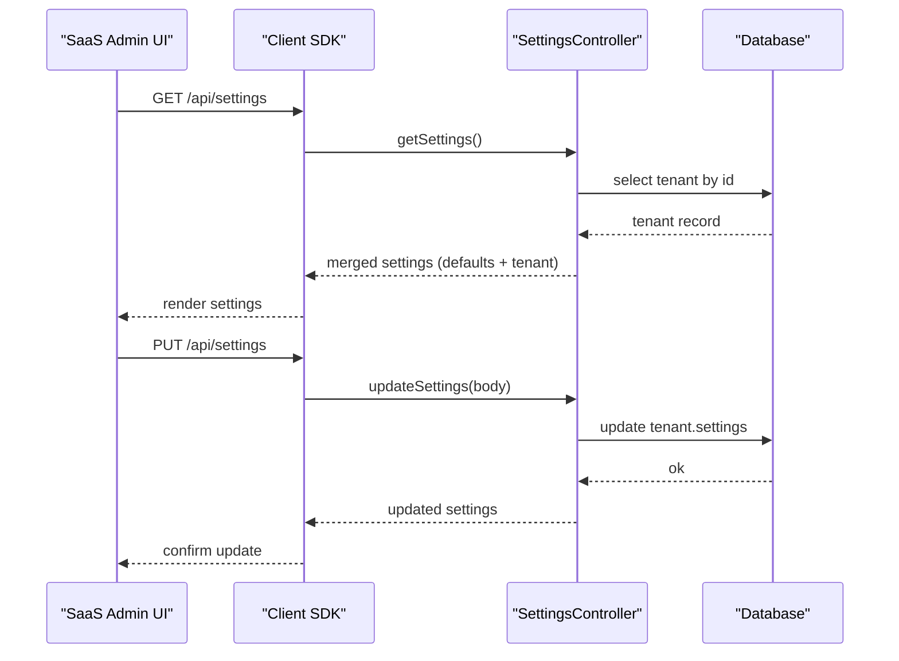
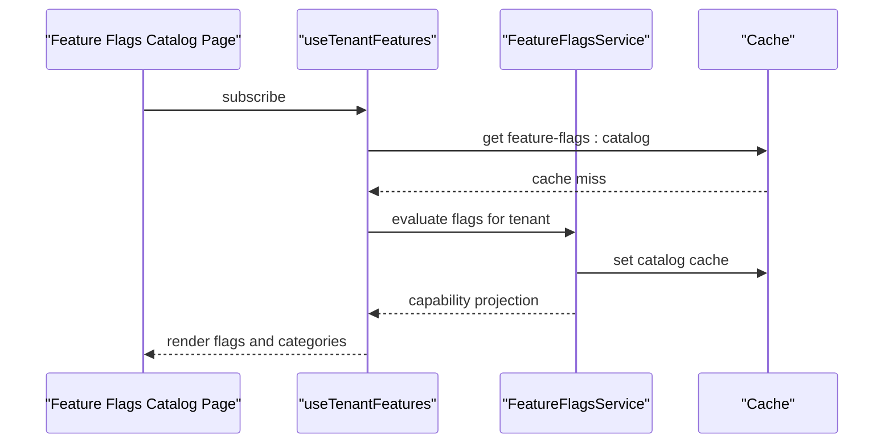
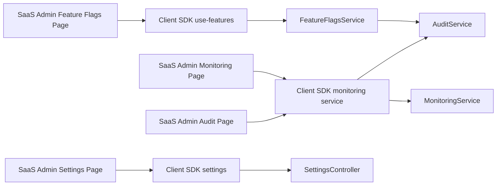

# Feature Flags & Monitoring

<cite>
**Referenced Files in This Document**
- [apps/saas-admin/src/routes/feature-flags/index.tsx](file://apps/saas-admin/src/routes/feature-flags/index.tsx)
- [apps/saas-admin/src/routes/monitoring/index.tsx](file://apps/saas-admin/src/routes/monitoring/index.tsx)
- [apps/saas-admin/src/routes/audit/index.tsx](file://apps/saas-admin/src/routes/audit/index.tsx)
- [apps/saas-admin/src/routes/settings/index.tsx](file://apps/saas-admin/src/routes/settings/index.tsx)
- [apps/api/src/modules/feature-flags/feature-flags.service.ts](file://apps/api/src/modules/feature-flags/feature-flags.service.ts)
- [apps/api/src/modules/monitoring/monitoring.service.ts](file://apps/api/src/modules/monitoring/monitoring.service.ts)
- [apps/api/src/core/audit/audit.service.ts](file://apps/api/src/core/audit/audit.service.ts)
- [apps/api/src/modules/settings/settings.controller.ts](file://apps/api/src/modules/settings/settings.controller.ts)
- [packages/client-sdk/src/hooks/use-features.ts](file://packages/client-sdk/src/hooks/use-features.ts)
- [packages/client-sdk/src/services/monitoring.service.ts](file://packages/client-sdk/src/services/monitoring.service.ts)
</cite>

## Table of Contents
1. [Introduction](#introduction)
2. [Project Structure](#project-structure)
3. [Core Components](#core-components)
4. [Architecture Overview](#architecture-overview)
5. [Detailed Component Analysis](#detailed-component-analysis)
6. [Dependency Analysis](#dependency-analysis)
7. [Performance Considerations](#performance-considerations)
8. [Troubleshooting Guide](#troubleshooting-guide)
9. [Conclusion](#conclusion)

## Introduction
This document describes the Feature Flags and Monitoring systems in the SaaS Admin Application. It covers:
- Feature flag management for controlling rollouts, A/B testing, and progressive releases across tenants
- Monitoring dashboard with system health indicators, performance metrics, and operational insights
- Audit log system for tracking administrative actions, user activities, and system changes
- Settings management interface for platform-wide configuration, environment variables, and system parameters
- Real-time monitoring capabilities, alerting systems, and diagnostic tools available to administrators

## Project Structure
The SaaS Admin application exposes dedicated pages for Feature Flags, Monitoring, Audit, and Settings. These pages integrate with the backend API through the Client SDK, which encapsulates HTTP calls and caching strategies.

**Diagram sources**
- [apps/saas-admin/src/routes/feature-flags/index.tsx](file://apps/saas-admin/src/routes/feature-flags/index.tsx#L1-L344)
- [apps/saas-admin/src/routes/monitoring/index.tsx](file://apps/saas-admin/src/routes/monitoring/index.tsx#L1-L310)
- [apps/saas-admin/src/routes/audit/index.tsx](file://apps/saas-admin/src/routes/audit/index.tsx#L1-L154)
- [apps/saas-admin/src/routes/settings/index.tsx](file://apps/saas-admin/src/routes/settings/index.tsx#L1-L45)
- [packages/client-sdk/src/hooks/use-features.ts](file://packages/client-sdk/src/hooks/use-features.ts#L1-L155)
- [packages/client-sdk/src/services/monitoring.service.ts](file://packages/client-sdk/src/services/monitoring.service.ts#L1-L182)
- [apps/api/src/modules/feature-flags/feature-flags.service.ts](file://apps/api/src/modules/feature-flags/feature-flags.service.ts#L1-L652)
- [apps/api/src/modules/monitoring/monitoring.service.ts](file://apps/api/src/modules/monitoring/monitoring.service.ts#L1-L162)
- [apps/api/src/core/audit/audit.service.ts](file://apps/api/src/core/audit/audit.service.ts#L1-L278)
- [apps/api/src/modules/settings/settings.controller.ts](file://apps/api/src/modules/settings/settings.controller.ts#L1-L194)

**Section sources**
- [apps/saas-admin/src/routes/feature-flags/index.tsx](file://apps/saas-admin/src/routes/feature-flags/index.tsx#L1-L344)
- [apps/saas-admin/src/routes/monitoring/index.tsx](file://apps/saas-admin/src/routes/monitoring/index.tsx#L1-L310)
- [apps/saas-admin/src/routes/audit/index.tsx](file://apps/saas-admin/src/routes/audit/index.tsx#L1-L154)
- [apps/saas-admin/src/routes/settings/index.tsx](file://apps/saas-admin/src/routes/settings/index.tsx#L1-L45)
- [packages/client-sdk/src/hooks/use-features.ts](file://packages/client-sdk/src/hooks/use-features.ts#L1-L155)
- [packages/client-sdk/src/services/monitoring.service.ts](file://packages/client-sdk/src/services/monitoring.service.ts#L1-L182)
- [apps/api/src/modules/feature-flags/feature-flags.service.ts](file://apps/api/src/modules/feature-flags/feature-flags.service.ts#L1-L652)
- [apps/api/src/modules/monitoring/monitoring.service.ts](file://apps/api/src/modules/monitoring/monitoring.service.ts#L1-L162)
- [apps/api/src/core/audit/audit.service.ts](file://apps/api/src/core/audit/audit.service.ts#L1-L278)
- [apps/api/src/modules/settings/settings.controller.ts](file://apps/api/src/modules/settings/settings.controller.ts#L1-L194)

## Core Components
- Feature Flags Catalog Page: Lists all active feature flags with category, type, default value, and status; supports filtering and search.
- Monitoring Dashboard: Displays platform stats, system status cards, recent activity, and tenant usage tables.
- Audit Log Page: Shows paginated audit events with search and summary statistics.
- Settings Page: Placeholder for platform-wide configuration; currently indicates upcoming functionality.

**Section sources**
- [apps/saas-admin/src/routes/feature-flags/index.tsx](file://apps/saas-admin/src/routes/feature-flags/index.tsx#L46-L344)
- [apps/saas-admin/src/routes/monitoring/index.tsx](file://apps/saas-admin/src/routes/monitoring/index.tsx#L41-L310)
- [apps/saas-admin/src/routes/audit/index.tsx](file://apps/saas-admin/src/routes/audit/index.tsx#L22-L154)
- [apps/saas-admin/src/routes/settings/index.tsx](file://apps/saas-admin/src/routes/settings/index.tsx#L14-L45)

## Architecture Overview
The SaaS Admin pages consume data via the Client SDK, which communicates with backend services. Feature flags are evaluated server-side with tenant and organization overrides, while monitoring and audit data are fetched from dedicated endpoints.

**Diagram sources**
- [apps/saas-admin/src/routes/feature-flags/index.tsx](file://apps/saas-admin/src/routes/feature-flags/index.tsx#L66-L70)
- [apps/saas-admin/src/routes/monitoring/index.tsx](file://apps/saas-admin/src/routes/monitoring/index.tsx#L46-L47)
- [apps/saas-admin/src/routes/audit/index.tsx](file://apps/saas-admin/src/routes/audit/index.tsx#L27-L31)
- [apps/saas-admin/src/routes/settings/index.tsx](file://apps/saas-admin/src/routes/settings/index.tsx#L14-L45)
- [packages/client-sdk/src/hooks/use-features.ts](file://packages/client-sdk/src/hooks/use-features.ts#L26-L36)
- [packages/client-sdk/src/services/monitoring.service.ts](file://packages/client-sdk/src/services/monitoring.service.ts#L81-L178)
- [apps/api/src/modules/feature-flags/feature-flags.service.ts](file://apps/api/src/modules/feature-flags/feature-flags.service.ts#L87-L98)
- [apps/api/src/modules/monitoring/monitoring.service.ts](file://apps/api/src/modules/monitoring/monitoring.service.ts#L41-L47)
- [apps/api/src/core/audit/audit.service.ts](file://apps/api/src/core/audit/audit.service.ts#L124-L177)
- [apps/api/src/modules/settings/settings.controller.ts](file://apps/api/src/modules/settings/settings.controller.ts#L56-L88)

## Detailed Component Analysis

### Feature Flags Management
The Feature Flags system supports:
- Catalog listing with filtering by category and status
- Tenant-level overrides with audit trail
- Organization-level restrictions (cannot expand beyond tenant-level)
- Capability projection for UI rendering and policy enforcement
- Caching for catalog and per-tenant/org overrides

**Diagram sources**
- [apps/api/src/modules/feature-flags/feature-flags.service.ts](file://apps/api/src/modules/feature-flags/feature-flags.service.ts#L65-L631)
- [apps/api/src/core/audit/audit.service.ts](file://apps/api/src/core/audit/audit.service.ts#L74-L210)

**Diagram sources**
- [apps/api/src/modules/feature-flags/feature-flags.service.ts](file://apps/api/src/modules/feature-flags/feature-flags.service.ts#L148-L232)
- [apps/api/src/core/audit/audit.service.ts](file://apps/api/src/core/audit/audit.service.ts#L84-L120)

Key implementation highlights:
- Override resolution hierarchy: organization-level restriction of tenant-level overrides, falling back to catalog defaults.
- Audit logging for create/update/delete operations on tenant and organization flags.
- Caching with TTLs for catalog and tenant/org overrides; cache invalidation on updates.

**Section sources**
- [apps/api/src/modules/feature-flags/feature-flags.service.ts](file://apps/api/src/modules/feature-flags/feature-flags.service.ts#L29-L59)
- [apps/api/src/modules/feature-flags/feature-flags.service.ts](file://apps/api/src/modules/feature-flags/feature-flags.service.ts#L451-L505)
- [apps/api/src/modules/feature-flags/feature-flags.service.ts](file://apps/api/src/modules/feature-flags/feature-flags.service.ts#L517-L549)
- [apps/api/src/modules/feature-flags/feature-flags.service.ts](file://apps/api/src/modules/feature-flags/feature-flags.service.ts#L588-L631)
- [apps/api/src/core/audit/audit.service.ts](file://apps/api/src/core/audit/audit.service.ts#L84-L120)

### Monitoring Dashboard
The Monitoring Dashboard aggregates:
- Platform statistics (active tenants, total users, storage usage, MRR)
- System status cards (API, Database, Storage, Redis)
- Recent activity timeline
- Tenant usage table

**Diagram sources**
- [apps/saas-admin/src/routes/monitoring/index.tsx](file://apps/saas-admin/src/routes/monitoring/index.tsx#L41-L307)

Backend monitoring service responsibilities:
- Audit log ingestion and querying
- Alert lifecycle management (create, acknowledge, resolve)
- Incident lifecycle management (create, update status)
- Exposing health, metrics, logs, database stats, and API usage

**Diagram sources**
- [apps/api/src/modules/monitoring/monitoring.service.ts](file://apps/api/src/modules/monitoring/monitoring.service.ts#L11-L161)

Client SDK monitoring service:
- Health status retrieval
- Metrics and logs fetching with pagination and filters
- Incidents listing
- Database statistics and API usage reporting

**Section sources**
- [apps/saas-admin/src/routes/monitoring/index.tsx](file://apps/saas-admin/src/routes/monitoring/index.tsx#L41-L307)
- [apps/api/src/modules/monitoring/monitoring.service.ts](file://apps/api/src/modules/monitoring/monitoring.service.ts#L23-L161)
- [packages/client-sdk/src/services/monitoring.service.ts](file://packages/client-sdk/src/services/monitoring.service.ts#L69-L182)

### Audit Log System
The Audit Log system provides:
- Centralized audit logging with database persistence and WebSocket broadcast
- Querying with filtering by tenant, user, resource, action, date range, and severity
- Convenience methods for common resource actions
- Real-time broadcast for live dashboards

**Diagram sources**
- [apps/api/src/modules/feature-flags/feature-flags.service.ts](file://apps/api/src/modules/feature-flags/feature-flags.service.ts#L192-L201)
- [apps/api/src/core/audit/audit.service.ts](file://apps/api/src/core/audit/audit.service.ts#L84-L120)
- [apps/api/src/core/audit/audit.service.ts](file://apps/api/src/core/audit/audit.service.ts#L58-L72)

**Section sources**
- [apps/api/src/core/audit/audit.service.ts](file://apps/api/src/core/audit/audit.service.ts#L74-L210)
- [apps/api/src/modules/monitoring/monitoring.service.ts](file://apps/api/src/modules/monitoring/monitoring.service.ts#L26-L47)

### Settings Management
The Settings page currently displays a placeholder indicating upcoming functionality. The backend provides:
- Tenant settings retrieval and update
- Integration settings management per provider
- Default templates for booking, notification, and payment settings

**Diagram sources**
- [apps/saas-admin/src/routes/settings/index.tsx](file://apps/saas-admin/src/routes/settings/index.tsx#L14-L45)
- [apps/api/src/modules/settings/settings.controller.ts](file://apps/api/src/modules/settings/settings.controller.ts#L56-L131)

**Section sources**
- [apps/saas-admin/src/routes/settings/index.tsx](file://apps/saas-admin/src/routes/settings/index.tsx#L14-L45)
- [apps/api/src/modules/settings/settings.controller.ts](file://apps/api/src/modules/settings/settings.controller.ts#L51-L194)

### Client SDK Integration
Feature flags hooks:
- useTenantFeatures: fetches tenant capability projection
- useFeature, useCategory, useEnabledCategories, useFeatureFlags helpers
- useAnyFeature, useAllFeatures for composite checks
- useFeaturesLoading for loading state

**Diagram sources**
- [packages/client-sdk/src/hooks/use-features.ts](file://packages/client-sdk/src/hooks/use-features.ts#L26-L36)
- [apps/api/src/modules/feature-flags/feature-flags.service.ts](file://apps/api/src/modules/feature-flags/feature-flags.service.ts#L517-L549)

**Section sources**
- [packages/client-sdk/src/hooks/use-features.ts](file://packages/client-sdk/src/hooks/use-features.ts#L26-L155)
- [apps/api/src/modules/feature-flags/feature-flags.service.ts](file://apps/api/src/modules/feature-flags/feature-flags.service.ts#L517-L549)

## Dependency Analysis
- SaaS Admin pages depend on the Client SDK for data fetching and caching.
- Client SDK depends on the API backend services for feature flags, monitoring, audit, and settings.
- Feature Flags Service integrates with Audit Service for change tracking.
- Monitoring Service orchestrates repositories for audit logs, alerts, and incidents.
- Settings Controller interacts with the tenants table for persisted configuration.

**Diagram sources**
- [apps/saas-admin/src/routes/feature-flags/index.tsx](file://apps/saas-admin/src/routes/feature-flags/index.tsx#L66-L70)
- [apps/saas-admin/src/routes/monitoring/index.tsx](file://apps/saas-admin/src/routes/monitoring/index.tsx#L46-L47)
- [apps/saas-admin/src/routes/audit/index.tsx](file://apps/saas-admin/src/routes/audit/index.tsx#L27-L31)
- [apps/saas-admin/src/routes/settings/index.tsx](file://apps/saas-admin/src/routes/settings/index.tsx#L14-L45)
- [packages/client-sdk/src/hooks/use-features.ts](file://packages/client-sdk/src/hooks/use-features.ts#L26-L36)
- [packages/client-sdk/src/services/monitoring.service.ts](file://packages/client-sdk/src/services/monitoring.service.ts#L81-L178)
- [apps/api/src/modules/feature-flags/feature-flags.service.ts](file://apps/api/src/modules/feature-flags/feature-flags.service.ts#L65-L631)
- [apps/api/src/modules/monitoring/monitoring.service.ts](file://apps/api/src/modules/monitoring/monitoring.service.ts#L11-L161)
- [apps/api/src/core/audit/audit.service.ts](file://apps/api/src/core/audit/audit.service.ts#L74-L210)
- [apps/api/src/modules/settings/settings.controller.ts](file://apps/api/src/modules/settings/settings.controller.ts#L51-L194)

**Section sources**
- [apps/api/src/modules/feature-flags/feature-flags.service.ts](file://apps/api/src/modules/feature-flags/feature-flags.service.ts#L65-L631)
- [apps/api/src/modules/monitoring/monitoring.service.ts](file://apps/api/src/modules/monitoring/monitoring.service.ts#L11-L161)
- [apps/api/src/core/audit/audit.service.ts](file://apps/api/src/core/audit/audit.service.ts#L74-L210)
- [apps/api/src/modules/settings/settings.controller.ts](file://apps/api/src/modules/settings/settings.controller.ts#L51-L194)

## Performance Considerations
- Caching: Feature flags service caches catalog and per-tenant/org overrides to reduce database load. Cache TTLs balance freshness and performance.
- Stale-while-revalidate: Client SDK queries use short staleness windows for feature flags to keep UI responsive without excessive network calls.
- Pagination: Audit logs and monitoring endpoints support pagination to avoid large payloads.
- Batch operations: Bulk tenant flag updates minimize round trips during admin operations.

[No sources needed since this section provides general guidance]

## Troubleshooting Guide
Common issues and resolutions:
- Feature flag not taking effect
  - Verify tenant override exists and enabled flag matches expected value.
  - Confirm organization-level restriction is not disabling the flag beyond tenant setting.
  - Clear tenant cache if stale data is suspected.
- Audit log missing or delayed
  - Confirm audit events are being logged and broadcast to WebSocket clients.
  - Check query filters for tenant/user/resource/action/date range.
- Monitoring data not updating
  - Use the health check endpoint to trigger a refresh.
  - Verify pagination parameters and filter criteria.
- Settings not persisting
  - Ensure tenant ID is present in request context.
  - Validate payload structure and merge with defaults.

**Section sources**
- [apps/api/src/modules/feature-flags/feature-flags.service.ts](file://apps/api/src/modules/feature-flags/feature-flags.service.ts#L588-L631)
- [apps/api/src/core/audit/audit.service.ts](file://apps/api/src/core/audit/audit.service.ts#L84-L120)
- [packages/client-sdk/src/services/monitoring.service.ts](file://packages/client-sdk/src/services/monitoring.service.ts#L176-L178)
- [apps/api/src/modules/settings/settings.controller.ts](file://apps/api/src/modules/settings/settings.controller.ts#L94-L131)

## Conclusion
The SaaS Admin Application’s Feature Flags and Monitoring systems provide a robust foundation for controlled rollouts, observability, and governance. The backend enforces strict override semantics with comprehensive auditing, while the frontend delivers intuitive dashboards and filtering. Settings management is evolving toward a centralized configuration interface. Together, these components enable administrators to monitor system health, track changes, and manage feature availability across tenants and organizations.