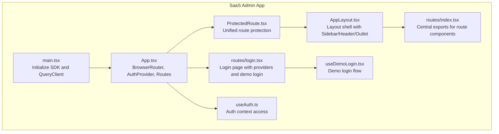
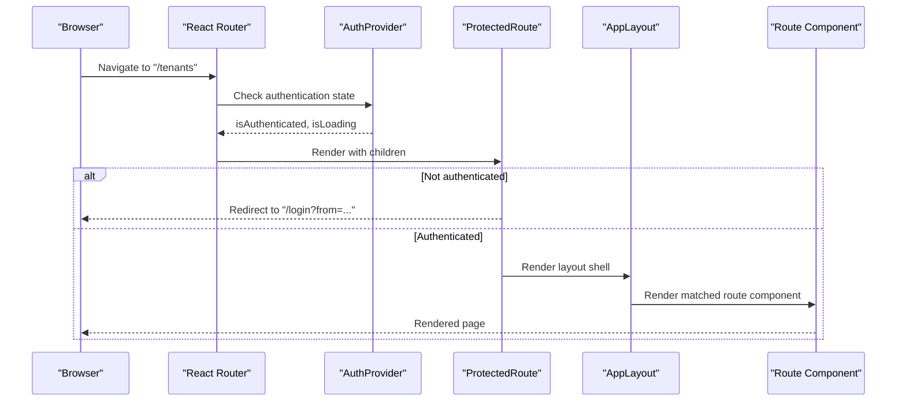
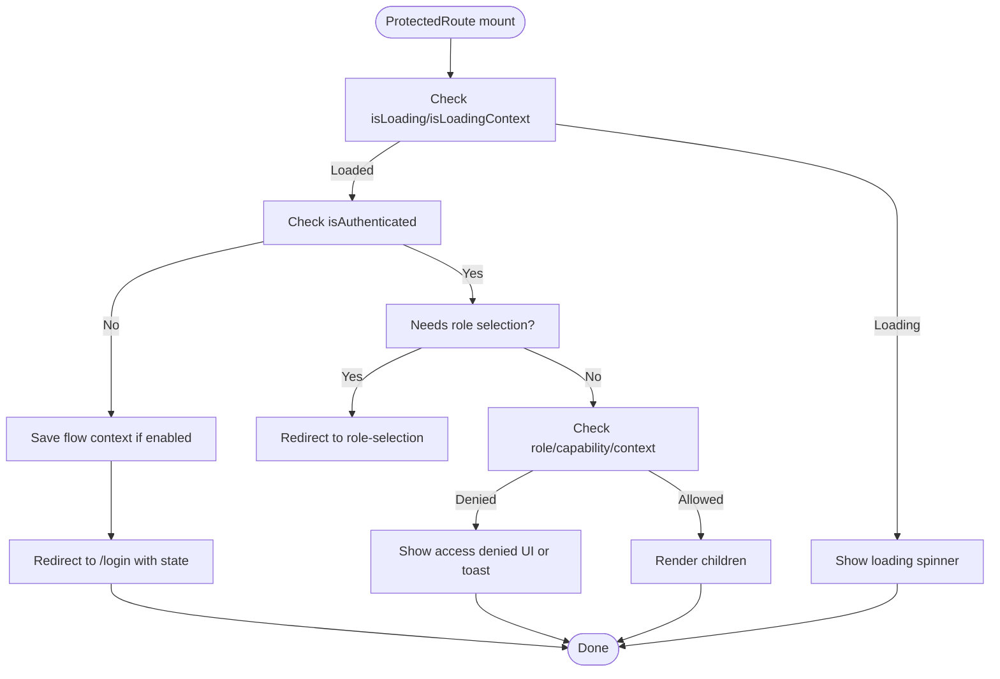
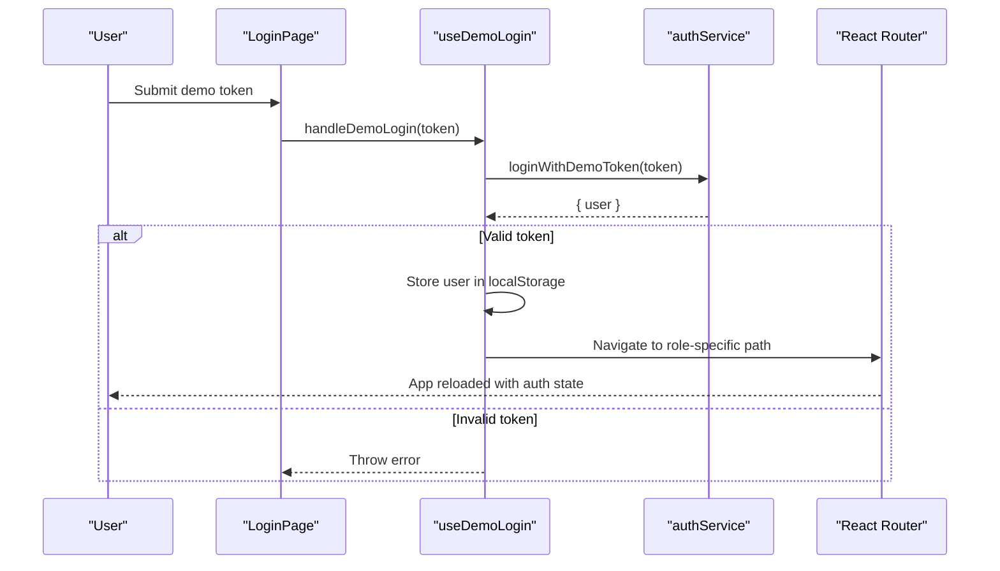
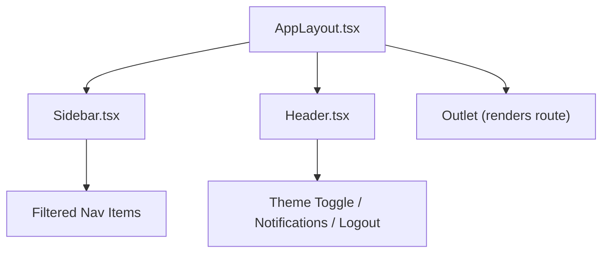
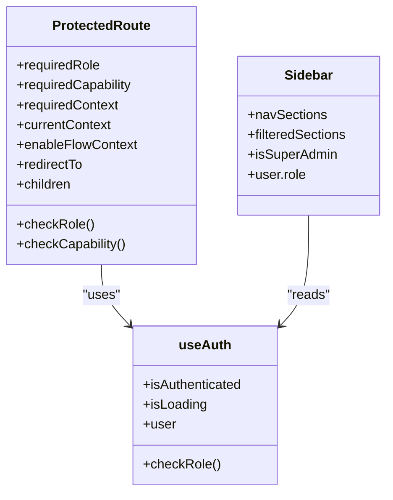
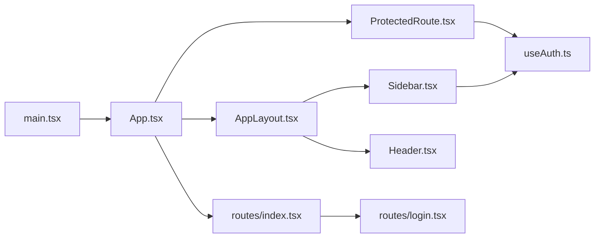

# Routing & Navigation

<cite>
**Referenced Files in This Document**
- [App.tsx](file://apps/saas-admin/src/App.tsx)
- [main.tsx](file://apps/saas-admin/src/main.tsx)
- [routes/index.tsx](file://apps/saas-admin/src/routes/index.tsx)
- [routes/login.tsx](file://apps/saas-admin/src/routes/login.tsx)
- [components/layout/AppLayout.tsx](file://apps/saas-admin/src/components/layout/AppLayout.tsx)
- [components/layout/Sidebar.tsx](file://apps/saas-admin/src/components/layout/Sidebar.tsx)
- [components/layout/Header.tsx](file://apps/saas-admin/src/components/layout/Header.tsx)
- [packages/ds/src/composed/ProtectedRoute.tsx](file://packages/ds/src/composed/ProtectedRoute.tsx)
- [packages/auth/src/hooks/useAuth.ts](file://packages/auth/src/hooks/useAuth.ts)
- [apps/saas-admin/src/hooks/useDemoLogin.tsx](file://apps/saas-admin/src/hooks/useDemoLogin.tsx)
</cite>

## Table of Contents
1. [Introduction](#introduction)
2. [Project Structure](#project-structure)
3. [Core Components](#core-components)
4. [Architecture Overview](#architecture-overview)
5. [Detailed Component Analysis](#detailed-component-analysis)
6. [Dependency Analysis](#dependency-analysis)
7. [Performance Considerations](#performance-considerations)
8. [Troubleshooting Guide](#troubleshooting-guide)
9. [Conclusion](#conclusion)

## Introduction
This document explains the SaaS Admin Application’s routing and navigation system. It covers the React Router configuration, protected routes, authentication guards, nested layout structures, and role-based access control. It also documents the main navigation sidebar, header components, route-based access control, URL patterns, and responsive design considerations for the administrative interface.

## Project Structure
The SaaS Admin application is a React application bootstrapped with Vite and TypeScript. Routing is configured at the application root, with a central layout wrapping protected routes. Authentication is provided by a shared auth package and integrated via a provider. Internationalization and design system components are used throughout.

**Diagram sources**
- [main.tsx](file://apps/saas-admin/src/main.tsx#L1-L33)
- [App.tsx](file://apps/saas-admin/src/App.tsx#L1-L93)
- [components/layout/AppLayout.tsx](file://apps/saas-admin/src/components/layout/AppLayout.tsx#L1-L134)
- [routes/index.tsx](file://apps/saas-admin/src/routes/index.tsx#L1-L26)
- [routes/login.tsx](file://apps/saas-admin/src/routes/login.tsx#L1-L101)
- [packages/ds/src/composed/ProtectedRoute.tsx](file://packages/ds/src/composed/ProtectedRoute.tsx#L1-L357)
- [packages/auth/src/hooks/useAuth.ts](file://packages/auth/src/hooks/useAuth.ts#L1-L21)
- [apps/saas-admin/src/hooks/useDemoLogin.tsx](file://apps/saas-admin/src/hooks/useDemoLogin.tsx#L1-L74)

**Section sources**
- [main.tsx](file://apps/saas-admin/src/main.tsx#L1-L33)
- [App.tsx](file://apps/saas-admin/src/App.tsx#L1-L93)

## Core Components
- Router and Providers
  - BrowserRouter wraps the entire app with future flags for modern routing behavior.
  - AuthProvider supplies authentication state and role checks to the app.
  - ErrorBoundary and ToastProvider provide global error handling and notifications.
- ProtectedRoute
  - A reusable component that enforces authentication, role-based access, capability checks, and optional flow context preservation.
- Layout Shell
  - AppLayout composes Sidebar, Header, and Outlet, with responsive behavior and page title resolution.
- Sidebar and Header
  - Sidebar renders role-filtered navigation items and user info.
  - Header adapts actions based on device size and provides theme toggle and logout.
- Login Page
  - LoginPage integrates with centralized auth configuration, handles OAuth providers, and supports demo login.

**Section sources**
- [App.tsx](file://apps/saas-admin/src/App.tsx#L39-L92)
- [packages/ds/src/composed/ProtectedRoute.tsx](file://packages/ds/src/composed/ProtectedRoute.tsx#L124-L357)
- [components/layout/AppLayout.tsx](file://apps/saas-admin/src/components/layout/AppLayout.tsx#L30-L134)
- [components/layout/Sidebar.tsx](file://apps/saas-admin/src/components/layout/Sidebar.tsx#L88-L274)
- [components/layout/Header.tsx](file://apps/saas-admin/src/components/layout/Header.tsx#L32-L227)
- [routes/login.tsx](file://apps/saas-admin/src/routes/login.tsx#L19-L101)

## Architecture Overview
The routing architecture follows a nested layout pattern:
- Root routes define public and protected sections.
- Protected routes render AppLayout, which manages Sidebar, Header, and Outlet.
- Route components are exported centrally for clean imports across the app.

**Diagram sources**
- [App.tsx](file://apps/saas-admin/src/App.tsx#L52-L84)
- [packages/ds/src/composed/ProtectedRoute.tsx](file://packages/ds/src/composed/ProtectedRoute.tsx#L285-L307)
- [components/layout/AppLayout.tsx](file://apps/saas-admin/src/components/layout/AppLayout.tsx#L101-L132)

## Detailed Component Analysis

### ProtectedRoute Implementation
ProtectedRoute centralizes authentication and access control:
- Authentication gating: Redirects unauthenticated users to login with return-to context.
- Role-based access: Accepts single or multiple required roles; resolves via useAuth.checkRole.
- Capability-based access: Optional callback-driven capability checks with AND/OR semantics.
- Context-aware routing: Enforces account context and home route overrides.
- Flow context preservation: Stores return-to URL and form data for seamless post-login continuation.
- Access denied UX: Provides customizable toast or default UI when access is denied.

**Diagram sources**
- [packages/ds/src/composed/ProtectedRoute.tsx](file://packages/ds/src/composed/ProtectedRoute.tsx#L145-L357)

**Section sources**
- [packages/ds/src/composed/ProtectedRoute.tsx](file://packages/ds/src/composed/ProtectedRoute.tsx#L124-L357)
- [packages/auth/src/hooks/useAuth.ts](file://packages/auth/src/hooks/useAuth.ts#L12-L20)

### Authentication Integration and Demo Login
- LoginPage integrates with centralized auth configuration and provider selection.
- Demo login validates a token against the auth service, stores user data locally, and redirects based on role.
- On successful login, the app navigates to a role-specific default route and reloads to sync auth state.

**Diagram sources**
- [routes/login.tsx](file://apps/saas-admin/src/routes/login.tsx#L34-L41)
- [apps/saas-admin/src/hooks/useDemoLogin.tsx](file://apps/saas-admin/src/hooks/useDemoLogin.tsx#L34-L65)

**Section sources**
- [routes/login.tsx](file://apps/saas-admin/src/routes/login.tsx#L19-L101)
- [apps/saas-admin/src/hooks/useDemoLogin.tsx](file://apps/saas-admin/src/hooks/useDemoLogin.tsx#L12-L74)

### Layout Architecture: AppLayout, Sidebar, Header
- AppLayout
  - Determines page title via i18n keys mapped to paths.
  - Responsive behavior: Desktop shows Sidebar; mobile shows BottomNavigation.
  - Outlet renders the matched route inside the layout.
- Sidebar
  - Role-filtered navigation sections with icons, labels, and optional badges.
  - Active state computed from current location.
  - Displays user avatar and role name.
- Header
  - Adapts to device size: mobile shows minimal actions; desktop shows full action bar.
  - Provides theme toggle, notifications, settings, and logout.

**Diagram sources**
- [components/layout/AppLayout.tsx](file://apps/saas-admin/src/components/layout/AppLayout.tsx#L30-L134)
- [components/layout/Sidebar.tsx](file://apps/saas-admin/src/components/layout/Sidebar.tsx#L88-L274)
- [components/layout/Header.tsx](file://apps/saas-admin/src/components/layout/Header.tsx#L32-L227)

**Section sources**
- [components/layout/AppLayout.tsx](file://apps/saas-admin/src/components/layout/AppLayout.tsx#L30-L134)
- [components/layout/Sidebar.tsx](file://apps/saas-admin/src/components/layout/Sidebar.tsx#L88-L274)
- [components/layout/Header.tsx](file://apps/saas-admin/src/components/layout/Header.tsx#L32-L227)

### Routing Patterns and URL Structure
- Public routes
  - /login: Login page with provider selection and demo login.
- Protected routes under a single layout wrapper
  - /: Dashboard page
  - /tenants: List tenants
  - /tenants/new: Create tenant
  - /tenants/:id: View tenant
  - /tenants/:id/edit: Edit tenant
  - /plans: List plans
  - /plans/new: Create plan
  - /plans/:id: View plan
  - /feature-flags: Feature flags catalog
  - /billing: Billing overview
  - /users: Users management
  - /audit: Audit log
  - /settings: Platform settings
  - /ai-seeds: AI seed generator
  - /branding: Branding list
  - /branding/:tenantId: Branding editor for a tenant
  - /monitoring: Monitoring dashboard

These routes are declared in the root Routes configuration and wrapped by ProtectedRoute and AppLayout.

**Section sources**
- [App.tsx](file://apps/saas-admin/src/App.tsx#L52-L84)
- [routes/index.tsx](file://apps/saas-admin/src/routes/index.tsx#L1-L26)

### Role-Based Access Control (RBAC)
- ProtectedRoute supports requiredRole and optional custom role checks.
- Sidebar filters navigation items based on user role and a dedicated roles list per item.
- SAAS_SUPER_ADMIN has access to all items; other roles see only permitted sections.
- The useAuth hook exposes authentication state and role-checking capabilities.

**Diagram sources**
- [packages/ds/src/composed/ProtectedRoute.tsx](file://packages/ds/src/composed/ProtectedRoute.tsx#L124-L199)
- [components/layout/Sidebar.tsx](file://apps/saas-admin/src/components/layout/Sidebar.tsx#L179-L198)
- [packages/auth/src/hooks/useAuth.ts](file://packages/auth/src/hooks/useAuth.ts#L12-L20)

**Section sources**
- [packages/ds/src/composed/ProtectedRoute.tsx](file://packages/ds/src/composed/ProtectedRoute.tsx#L163-L172)
- [components/layout/Sidebar.tsx](file://apps/saas-admin/src/components/layout/Sidebar.tsx#L179-L198)
- [packages/auth/src/hooks/useAuth.ts](file://packages/auth/src/hooks/useAuth.ts#L12-L20)

### Navigation Flows and Responsive Design
- Desktop
  - Sidebar remains visible; Header shows full actions.
  - BottomNavigation is hidden.
- Mobile
  - Sidebar is hidden; BottomNavigation appears with key sections.
  - Header reduces to essential actions and a user menu dropdown.
- Page titles
  - Resolved from i18n keys keyed by current path.

**Section sources**
- [components/layout/AppLayout.tsx](file://apps/saas-admin/src/components/layout/AppLayout.tsx#L30-L134)
- [components/layout/Header.tsx](file://apps/saas-admin/src/components/layout/Header.tsx#L32-L227)
- [components/layout/Sidebar.tsx](file://apps/saas-admin/src/components/layout/Sidebar.tsx#L88-L274)

## Dependency Analysis
- Provider stack
  - main.tsx initializes the SDK and QueryClient.
  - App.tsx sets up BrowserRouter, AuthProvider, ErrorBoundary, and ToastProvider.
- Routing dependencies
  - App.tsx defines routes and wraps protected sections with ProtectedRoute and AppLayout.
  - routes/index.tsx centralizes exports for route components.
- Layout dependencies
  - AppLayout composes Sidebar and Header and renders Outlet.
  - Sidebar depends on useAuth for role filtering and i18n for labels.
  - Header depends on useAuth for user info and theme provider for dark mode.

**Diagram sources**
- [main.tsx](file://apps/saas-admin/src/main.tsx#L1-L33)
- [App.tsx](file://apps/saas-admin/src/App.tsx#L1-L93)
- [components/layout/AppLayout.tsx](file://apps/saas-admin/src/components/layout/AppLayout.tsx#L1-L134)
- [components/layout/Sidebar.tsx](file://apps/saas-admin/src/components/layout/Sidebar.tsx#L1-L274)
- [components/layout/Header.tsx](file://apps/saas-admin/src/components/layout/Header.tsx#L1-L227)
- [routes/index.tsx](file://apps/saas-admin/src/routes/index.tsx#L1-L26)
- [routes/login.tsx](file://apps/saas-admin/src/routes/login.tsx#L1-L101)
- [packages/ds/src/composed/ProtectedRoute.tsx](file://packages/ds/src/composed/ProtectedRoute.tsx#L1-L357)
- [packages/auth/src/hooks/useAuth.ts](file://packages/auth/src/hooks/useAuth.ts#L1-L21)

**Section sources**
- [main.tsx](file://apps/saas-admin/src/main.tsx#L1-L33)
- [App.tsx](file://apps/saas-admin/src/App.tsx#L1-L93)

## Performance Considerations
- Route protection checks occur on navigation; keep role/capability checks lightweight.
- Memoized access checks in ProtectedRoute reduce unnecessary re-renders.
- Avoid heavy computations in AppLayout title resolution; rely on fast i18n key lookups.
- Use lazy loading for heavy route components if needed to optimize initial load.

## Troubleshooting Guide
- Login loop or incorrect redirects
  - Verify ProtectedRoute’s redirectTo and excludedPaths; ensure login and role-selection pages are excluded from redirect logic.
- Access denied screen unexpectedly shown
  - Confirm requiredRole and checkRole implementation; ensure user roles match expectations.
- Sidebar items missing for a role
  - Check item.roles and useAuth.isSuperAdmin; confirm role values align with backend entitlements.
- Demo login fails
  - Validate token correctness and that the demo login endpoint responds with a user object; ensure local storage is writable.

**Section sources**
- [packages/ds/src/composed/ProtectedRoute.tsx](file://packages/ds/src/composed/ProtectedRoute.tsx#L285-L307)
- [components/layout/Sidebar.tsx](file://apps/saas-admin/src/components/layout/Sidebar.tsx#L179-L198)
- [apps/saas-admin/src/hooks/useDemoLogin.tsx](file://apps/saas-admin/src/hooks/useDemoLogin.tsx#L34-L65)

## Conclusion
The SaaS Admin application employs a robust, reusable routing and navigation architecture:
- A single ProtectedRoute component enforces authentication, roles, capabilities, and context.
- A responsive layout shell (Sidebar/Header/Outlet) provides consistent navigation across devices.
- Role-based filtering ensures users see only authorized sections.
- Clean route exports and centralized configuration simplify maintenance and extension.