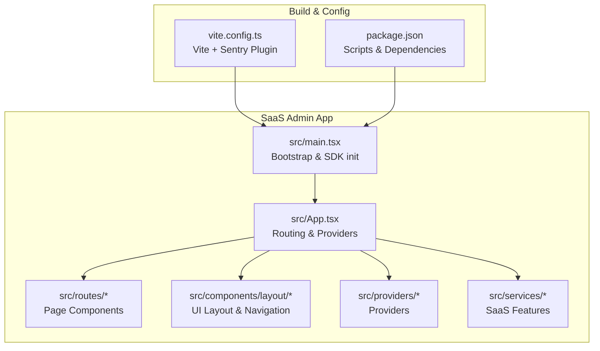
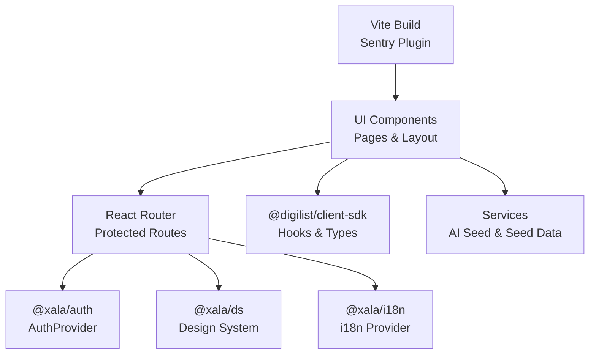
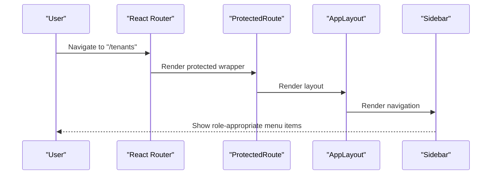
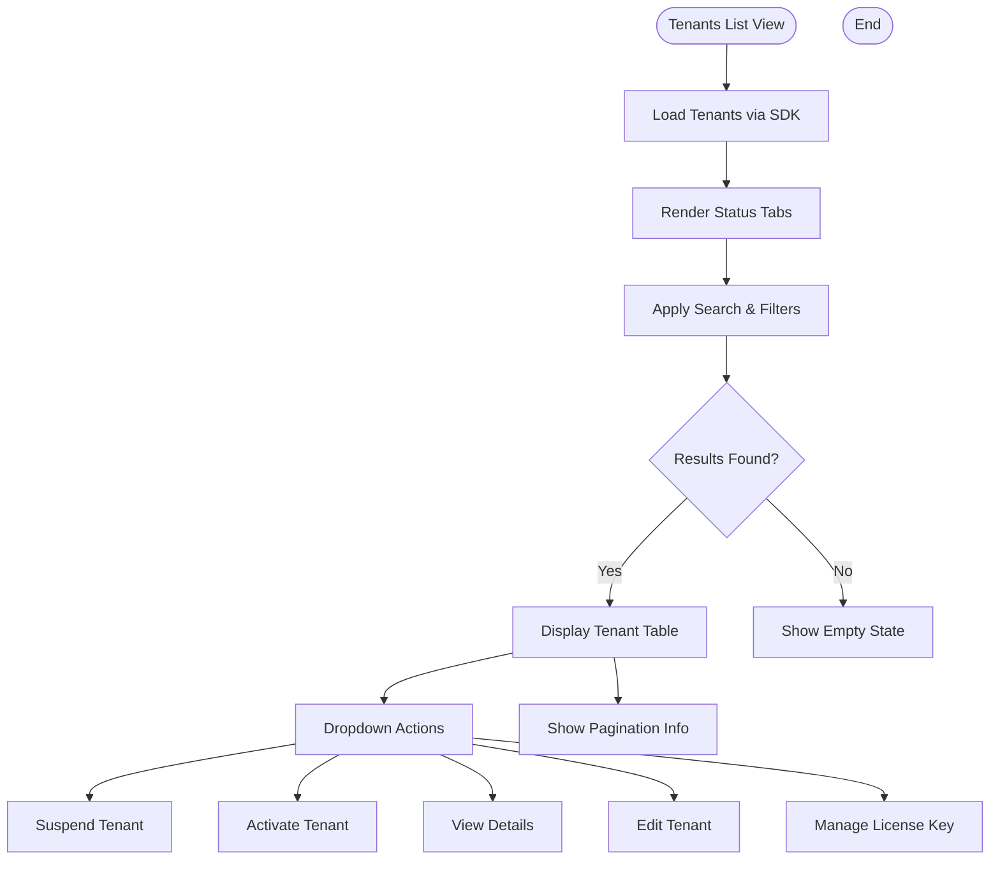
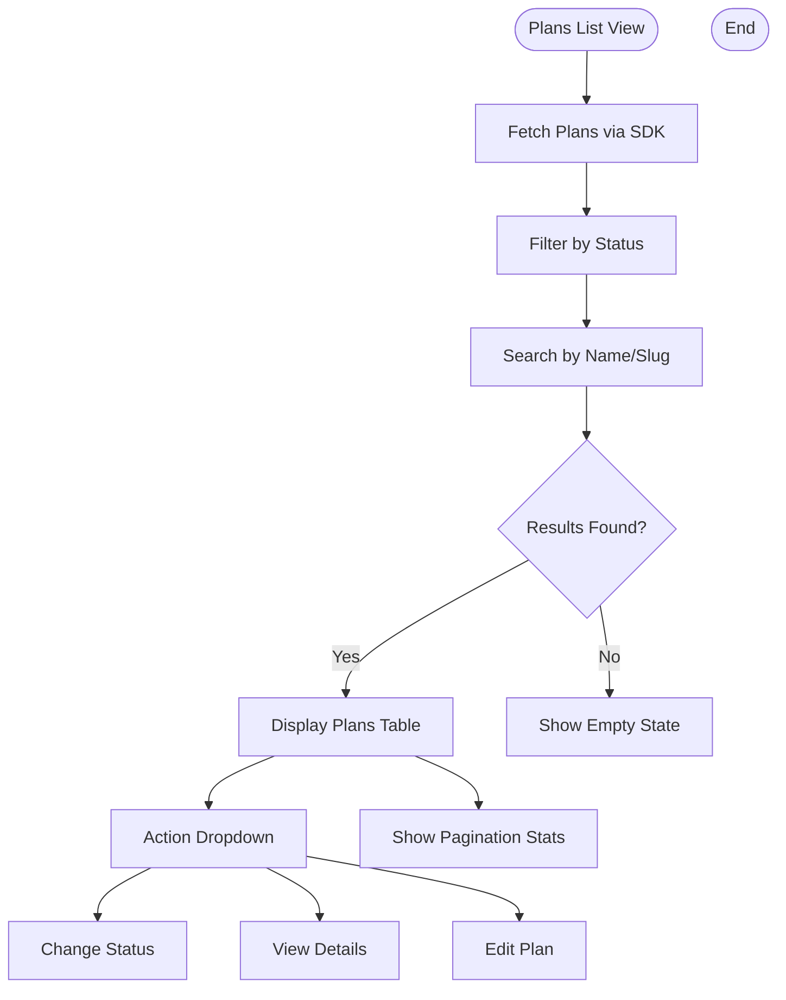
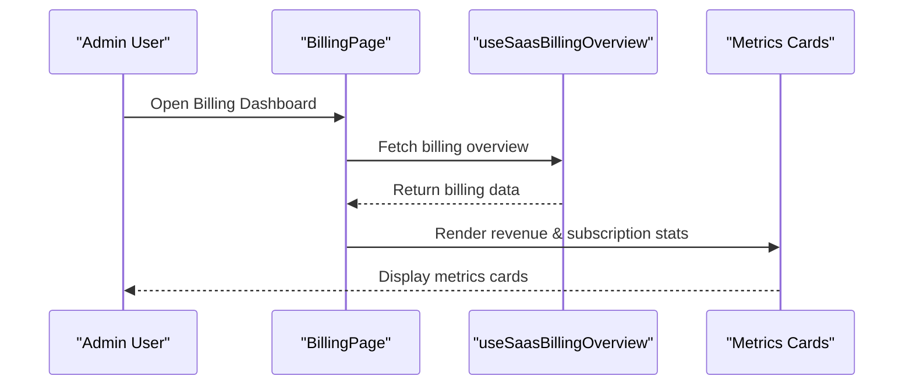
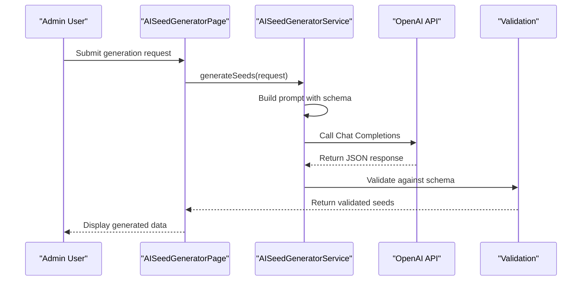
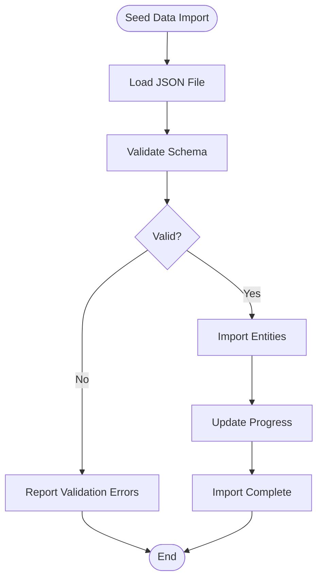
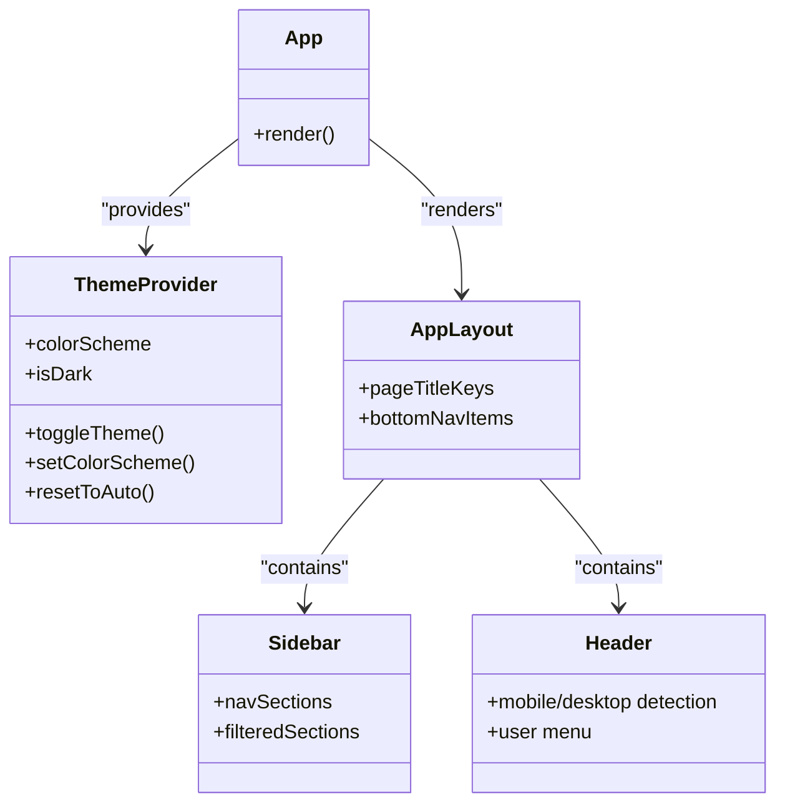
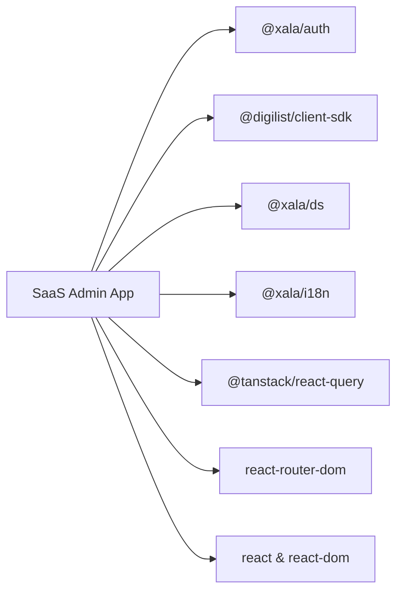

# SaaS Admin Application

<cite>
**Referenced Files in This Document**
- [package.json](file://apps/saas-admin/package.json)
- [vite.config.ts](file://apps/saas-admin/vite.config.ts)
- [App.tsx](file://apps/saas-admin/src/App.tsx)
- [main.tsx](file://apps/saas-admin/src/main.tsx)
- [routes/index.tsx](file://apps/saas-admin/src/routes/index.tsx)
- [AppLayout.tsx](file://apps/saas-admin/src/components/layout/AppLayout.tsx)
- [Sidebar.tsx](file://apps/saas-admin/src/components/layout/Sidebar.tsx)
- [Header.tsx](file://apps/saas-admin/src/components/layout/Header.tsx)
- [ThemeProvider.tsx](file://apps/saas-admin/src/providers/ThemeProvider.tsx)
- [ai-seed-generator.service.ts](file://apps/saas-admin/src/services/ai-seed-generator.service.ts)
- [seed-data.service.ts](file://apps/saas-admin/src/services/seed-data.service.ts)
- [tenants/index.tsx](file://apps/saas-admin/src/routes/tenants/index.tsx)
- [plans/index.tsx](file://apps/saas-admin/src/routes/plans/index.tsx)
- [billing/index.tsx](file://apps/saas-admin/src/routes/billing/index.tsx)
</cite>

## Table of Contents
1. [Introduction](#introduction)
2. [Project Structure](#project-structure)
3. [Core Components](#core-components)
4. [Architecture Overview](#architecture-overview)
5. [Detailed Component Analysis](#detailed-component-analysis)
6. [Dependency Analysis](#dependency-analysis)
7. [Performance Considerations](#performance-considerations)
8. [Troubleshooting Guide](#troubleshooting-guide)
9. [Conclusion](#conclusion)
10. [Appendices](#appendices)

## Introduction
The SaaS Admin Application is a React-based, TypeScript-powered administrative interface designed for multi-tenant SaaS platform management. It provides comprehensive tooling for tenant administration, subscription and plan management, billing oversight, feature flag control, audit logging, and platform-wide configuration. Built with a modern frontend stack and integrated with the Digilist client SDK, it offers role-based navigation, responsive layouts, and robust data visualization for platform monitoring.

## Project Structure
The SaaS Admin application is organized as a Vite-managed React application with a clear separation of concerns:
- Routing and page components under src/routes
- UI layout and navigation under src/components/layout
- Providers for theming, i18n, and global state under src/providers
- Services for SaaS-specific features under src/services
- Application bootstrap and configuration under src/main.tsx and App.tsx
- Build and development configuration under vite.config.ts and package.json

**Diagram sources**
- [main.tsx](file://apps/saas-admin/src/main.tsx#L1-L33)
- [App.tsx](file://apps/saas-admin/src/App.tsx#L1-L93)
- [vite.config.ts](file://apps/saas-admin/vite.config.ts#L1-L38)
- [package.json](file://apps/saas-admin/package.json#L1-L35)

**Section sources**
- [main.tsx](file://apps/saas-admin/src/main.tsx#L1-L33)
- [App.tsx](file://apps/saas-admin/src/App.tsx#L1-L93)
- [vite.config.ts](file://apps/saas-admin/vite.config.ts#L1-L38)
- [package.json](file://apps/saas-admin/package.json#L1-L35)

## Core Components
- Application shell and routing: Centralized in App.tsx with protected routes and layout integration
- Layout system: Responsive AppLayout with dynamic sidebar and bottom navigation
- Authentication and permissions: ProtectedRoute wrapper and role-aware navigation
- Data fetching: React Query client initialized in main.tsx with default caching and retry
- Theme management: ThemeProvider with system preference detection and persistence
- SaaS-specific services: AI seed generation and seed data import utilities

Key responsibilities:
- App.tsx orchestrates routing, providers, and protected layout
- AppLayout manages responsive layout switching and page titles
- Sidebar renders role-filtered navigation sections
- ThemeProvider persists user preferences and follows system theme
- Services encapsulate SaaS-specific workflows (AI generation, seed data import)

**Section sources**
- [App.tsx](file://apps/saas-admin/src/App.tsx#L1-L93)
- [AppLayout.tsx](file://apps/saas-admin/src/components/layout/AppLayout.tsx#L1-L134)
- [Sidebar.tsx](file://apps/saas-admin/src/components/layout/Sidebar.tsx#L1-L274)
- [ThemeProvider.tsx](file://apps/saas-admin/src/providers/ThemeProvider.tsx#L1-L122)
- [main.tsx](file://apps/saas-admin/src/main.tsx#L1-L33)

## Architecture Overview
The application follows a layered architecture:
- Presentation layer: React components and pages
- Routing and navigation: React Router with protected routes
- Data layer: React Query for caching and optimistic updates
- Service layer: SaaS-specific services for AI and seed data
- Infrastructure: Vite build pipeline with Sentry source map uploads

**Diagram sources**
- [App.tsx](file://apps/saas-admin/src/App.tsx#L1-L93)
- [main.tsx](file://apps/saas-admin/src/main.tsx#L1-L33)
- [vite.config.ts](file://apps/saas-admin/vite.config.ts#L1-L38)

## Detailed Component Analysis

### Routing and Navigation
The routing structure supports:
- Tenant management: list, create, detail, edit
- Plan management: list, create, detail
- Feature flags, billing, users, audit log, settings
- Branding management per tenant
- Monitoring dashboard

ProtectedRoute ensures only authenticated SaaS Admin users can access administrative pages. The layout adapts between desktop (sidebar) and mobile (bottom navigation) experiences.

**Diagram sources**
- [App.tsx](file://apps/saas-admin/src/App.tsx#L52-L84)
- [AppLayout.tsx](file://apps/saas-admin/src/components/layout/AppLayout.tsx#L30-L134)
- [Sidebar.tsx](file://apps/saas-admin/src/components/layout/Sidebar.tsx#L88-L274)

**Section sources**
- [App.tsx](file://apps/saas-admin/src/App.tsx#L52-L84)
- [routes/index.tsx](file://apps/saas-admin/src/routes/index.tsx#L1-L26)
- [AppLayout.tsx](file://apps/saas-admin/src/components/layout/AppLayout.tsx#L30-L134)
- [Sidebar.tsx](file://apps/saas-admin/src/components/layout/Sidebar.tsx#L88-L274)

### Tenant Administration
The tenant management interface provides:
- List view with status tabs, search, and filters
- Bulk actions: suspend/activate tenants
- License key management
- Responsive table with action dropdowns

**Diagram sources**
- [tenants/index.tsx](file://apps/saas-admin/src/routes/tenants/index.tsx#L49-L366)

**Section sources**
- [tenants/index.tsx](file://apps/saas-admin/src/routes/tenants/index.tsx#L49-L366)

### Subscription and Plan Management
Plan management includes:
- List view with status filtering and search
- Pricing display with localized formatting
- Seat limits and visibility controls
- Status transitions: activate, deactivate, deprecate

**Diagram sources**
- [plans/index.tsx](file://apps/saas-admin/src/routes/plans/index.tsx#L45-L386)

**Section sources**
- [plans/index.tsx](file://apps/saas-admin/src/routes/plans/index.tsx#L45-L386)

### Billing Administration
The billing dashboard presents:
- Revenue metrics: total revenue, monthly recurring revenue
- Subscription statistics: active subscriptions, overdue invoices
- Invoice management placeholder

**Diagram sources**
- [billing/index.tsx](file://apps/saas-admin/src/routes/billing/index.tsx#L21-L121)

**Section sources**
- [billing/index.tsx](file://apps/saas-admin/src/routes/billing/index.tsx#L21-L121)

### SaaS-Specific Features

#### AI Seed Generator
The AI Seed Generator integrates with OpenAI to produce realistic seed data aligned with Norwegian contexts and platform schemas. It validates outputs against JSON schemas and supports configurable prompts and templates.

**Diagram sources**
- [ai-seed-generator.service.ts](file://apps/saas-admin/src/services/ai-seed-generator.service.ts#L15-L216)

**Section sources**
- [ai-seed-generator.service.ts](file://apps/saas-admin/src/services/ai-seed-generator.service.ts#L15-L216)

#### Seed Data Management
Seed data management supports loading, validating, and importing structured datasets into the platform. It provides progress tracking and error reporting during import operations.

**Diagram sources**
- [seed-data.service.ts](file://apps/saas-admin/src/services/seed-data.service.ts#L163-L357)

**Section sources**
- [seed-data.service.ts](file://apps/saas-admin/src/services/seed-data.service.ts#L163-L357)

### Component Architecture
The application leverages a design system and provider pattern:
- DesignsystemetProvider for theming and typography
- I18nProvider for internationalization
- ErrorBoundary for graceful error handling
- ToastProvider for user notifications
- ThemeProvider for color scheme management

**Diagram sources**
- [App.tsx](file://apps/saas-admin/src/App.tsx#L39-L93)
- [ThemeProvider.tsx](file://apps/saas-admin/src/providers/ThemeProvider.tsx#L45-L122)
- [AppLayout.tsx](file://apps/saas-admin/src/components/layout/AppLayout.tsx#L30-L134)
- [Sidebar.tsx](file://apps/saas-admin/src/components/layout/Sidebar.tsx#L88-L274)
- [Header.tsx](file://apps/saas-admin/src/components/layout/Header.tsx#L32-L227)

**Section sources**
- [App.tsx](file://apps/saas-admin/src/App.tsx#L39-L93)
- [ThemeProvider.tsx](file://apps/saas-admin/src/providers/ThemeProvider.tsx#L45-L122)
- [AppLayout.tsx](file://apps/saas-admin/src/components/layout/AppLayout.tsx#L30-L134)
- [Sidebar.tsx](file://apps/saas-admin/src/components/layout/Sidebar.tsx#L88-L274)
- [Header.tsx](file://apps/saas-admin/src/components/layout/Header.tsx#L32-L227)

## Dependency Analysis
External dependencies include:
- @xala/auth for authentication and role-based access
- @digilist/client-sdk for SaaS domain operations
- @tanstack/react-query for data fetching and caching
- @xala/ds and @xala/i18n for design system and internationalization
- React Router for navigation
- Sentry for error tracking and source map uploads

**Diagram sources**
- [package.json](file://apps/saas-admin/package.json#L12-L24)

**Section sources**
- [package.json](file://apps/saas-admin/package.json#L12-L24)

## Performance Considerations
- React Query caching: Default staleTime and retry configured for efficient data fetching
- Lazy loading: Route components loaded via dynamic imports
- Responsive design: Mobile-first layout reduces unnecessary rendering
- Source maps: Enabled for production builds to aid debugging while maintaining privacy

Recommendations:
- Implement pagination for large datasets
- Debounce search inputs to reduce API calls
- Use virtualized lists for extensive tables
- Monitor bundle size and split chunks strategically

**Section sources**
- [main.tsx](file://apps/saas-admin/src/main.tsx#L17-L24)
- [vite.config.ts](file://apps/saas-admin/vite.config.ts#L34-L37)

## Troubleshooting Guide
Common issues and resolutions:
- Authentication failures: Verify auth provider configuration and environment variables
- Missing OpenAI API key: Ensure VITE_OPENAI_API_KEY is set for AI seed generation
- Theme persistence: Check localStorage availability and browser compatibility
- Build errors: Confirm Vite plugin configurations and environment variable presence
- Data loading: Inspect React Query cache and network requests

Debugging tips:
- Enable debug mode in AuthProvider for development insights
- Use React DevTools to inspect component props and state
- Check browser console for JavaScript errors
- Review Sentry error reports for production issues

**Section sources**
- [App.tsx](file://apps/saas-admin/src/App.tsx#L51-L52)
- [ai-seed-generator.service.ts](file://apps/saas-admin/src/services/ai-seed-generator.service.ts#L20-L22)
- [ThemeProvider.tsx](file://apps/saas-admin/src/providers/ThemeProvider.tsx#L46-L56)

## Conclusion
The SaaS Admin Application provides a comprehensive, role-aware administrative interface for multi-tenant SaaS platforms. Its modular architecture, robust data management, and SaaS-specific features enable efficient tenant and subscription administration, billing oversight, and platform configuration. The responsive design and provider-based architecture ensure maintainability and scalability for future enhancements.

## Appendices

### Build System and Development Workflow
- Development server runs on port 5176 with hot module replacement
- Production builds include Sentry source map uploads
- Environment variables for API URLs, tenant IDs, and license keys
- TypeScript configuration for strict type checking

Deployment considerations:
- Configure environment variables for production environments
- Set up reverse proxy routing for subdomain-based routing
- Ensure proper SSL/TLS termination for secure communication
- Monitor application performance and error rates using Sentry

**Section sources**
- [vite.config.ts](file://apps/saas-admin/vite.config.ts#L7-L20)
- [package.json](file://apps/saas-admin/package.json#L6-L11)
- [main.tsx](file://apps/saas-admin/src/main.tsx#L10-L15)