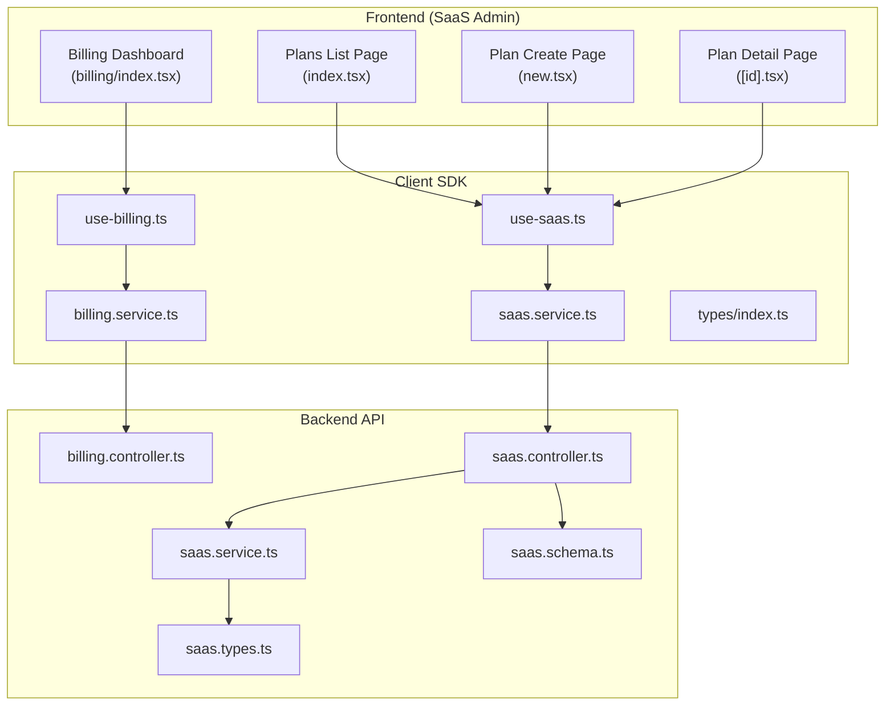
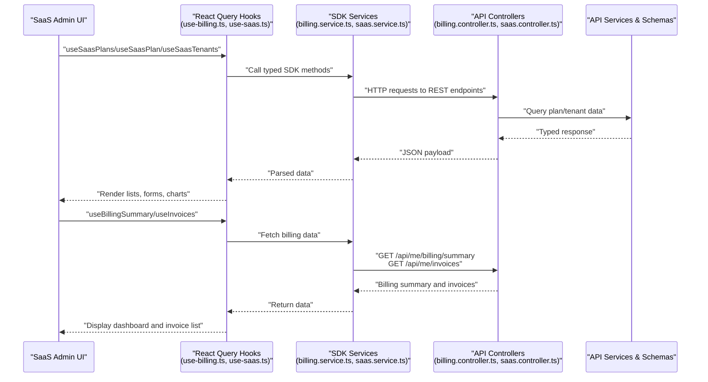
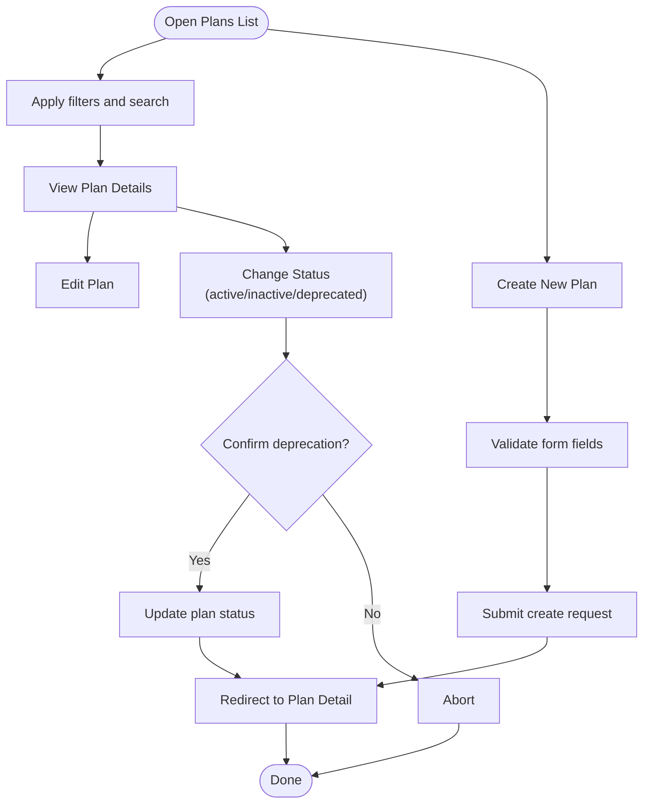
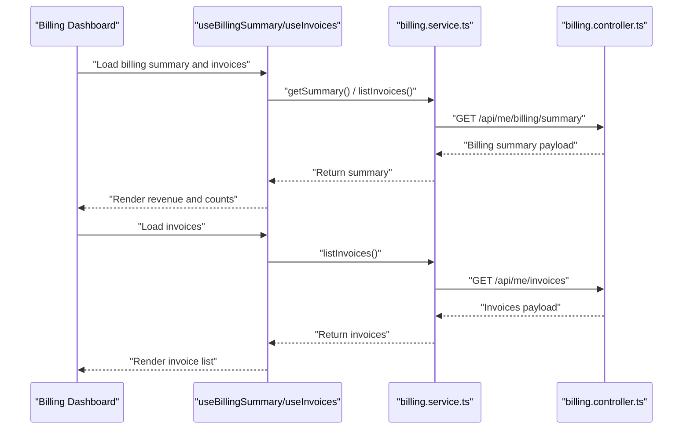
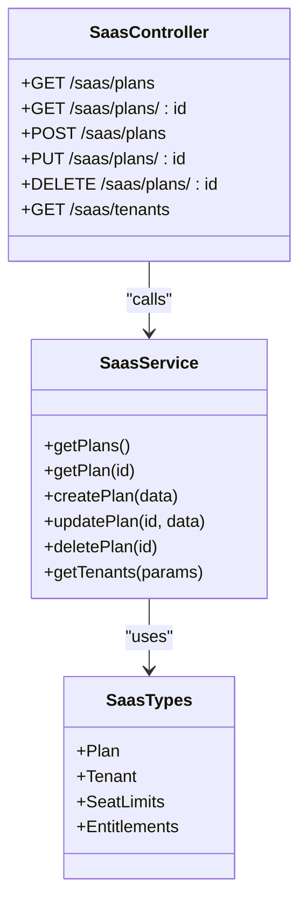
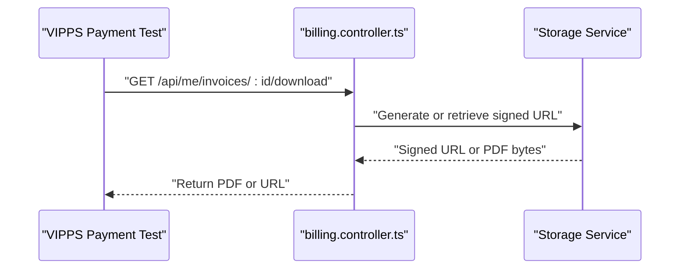
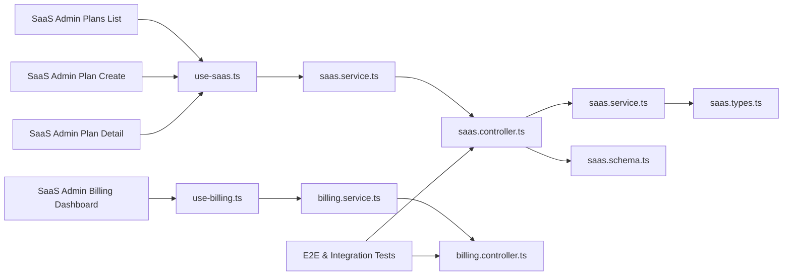

# Subscription & Billing

<cite>
**Referenced Files in This Document**
- [apps/saas-admin/src/routes/billing/index.tsx](file://apps/saas-admin/src/routes/billing/index.tsx)
- [apps/saas-admin/src/routes/plans/index.tsx](file://apps/saas-admin/src/routes/plans/index.tsx)
- [apps/saas-admin/src/routes/plans/new.tsx](file://apps/saas-admin/src/routes/plans/new.tsx)
- [apps/saas-admin/src/routes/plans/[id].tsx](file://apps/saas-admin/src/routes/plans/[id].tsx)
- [apps/api/src/modules/billing/billing.controller.ts](file://apps/api/src/modules/billing/billing.controller.ts)
- [packages/client-sdk/src/services/billing.service.ts](file://packages/client-sdk/src/services/billing.service.ts)
- [packages/client-sdk/src/hooks/use-billing.ts](file://packages/client-sdk/src/hooks/use-billing.ts)
- [packages/client-sdk/src/types/index.ts](file://packages/client-sdk/src/types/index.ts)
- [apps/api/src/modules/saas/saas.controller.ts](file://apps/api/src/modules/saas/saas.controller.ts)
- [apps/api/src/modules/saas/saas.service.ts](file://apps/api/src/modules/saas/saas.service.ts)
- [apps/api/src/modules/saas/saas.types.ts](file://apps/api/src/modules/saas/saas.types.ts)
- [apps/api/src/schemas/saas.schema.ts](file://apps/api/src/schemas/saas.schema.ts)
- [packages/client-sdk/src/services/saas.service.ts](file://packages/client-sdk/src/services/saas.service.ts)
- [packages/client-sdk/src/hooks/use-saas.ts](file://packages/client-sdk/src/hooks/use-saas.ts)
- [packages/client-sdk/src/types/saas.ts](file://packages/client-sdk/src/types/saas.ts)
- [tests/e2e/saas-admin/plan-crud.spec.ts](file://tests/e2e/saas-admin/plan-crud.spec.ts)
- [tests/e2e/backoffice/blur-eye/economy-invoices.spec.ts](file://tests/e2e/backoffice/blur-eye/economy-invoices.spec.ts)
- [apps/api/src/__tests__/integration/vipps-payment.test.ts](file://apps/api/src/__tests__/integration/vipps-payment.test.ts)
- [tests/journeys/vipps-payment.spec.ts](file://tests/journeys/vipps-payment.spec.ts)
</cite>

## Table of Contents
1. [Introduction](#introduction)
2. [Project Structure](#project-structure)
3. [Core Components](#core-components)
4. [Architecture Overview](#architecture-overview)
5. [Detailed Component Analysis](#detailed-component-analysis)
6. [Dependency Analysis](#dependency-analysis)
7. [Performance Considerations](#performance-considerations)
8. [Troubleshooting Guide](#troubleshooting-guide)
9. [Conclusion](#conclusion)

## Introduction
This document describes the Subscription and Billing management system in the SaaS Admin Application. It covers plan management (creation, modification, deactivation, and deprecation), billing administration (revenue dashboards, invoice listing, and download), and the integration points with the API backend and payment processors. It also outlines plan catalog management, pricing tiers, feature assignments, subscription tracking, and billing cycle management.

## Project Structure
The Subscription and Billing system spans three primary areas:
- Frontend (SaaS Admin): Plan catalog UI, billing dashboard, and tenant assignment views.
- Client SDK: Typed services and React Query hooks for billing and SaaS APIs.
- Backend API: Controllers and services implementing billing and SaaS domain endpoints.

**Diagram sources**
- [apps/saas-admin/src/routes/plans/index.tsx](file://apps/saas-admin/src/routes/plans/index.tsx#L1-L386)
- [apps/saas-admin/src/routes/plans/new.tsx](file://apps/saas-admin/src/routes/plans/new.tsx#L1-L474)
- [apps/saas-admin/src/routes/plans/[id].tsx](file://apps/saas-admin/src/routes/plans/[id].tsx#L1-L341)
- [apps/saas-admin/src/routes/billing/index.tsx](file://apps/saas-admin/src/routes/billing/index.tsx#L1-L121)
- [packages/client-sdk/src/services/billing.service.ts](file://packages/client-sdk/src/services/billing.service.ts#L1-L181)
- [packages/client-sdk/src/hooks/use-billing.ts](file://packages/client-sdk/src/hooks/use-billing.ts#L1-L134)
- [packages/client-sdk/src/services/saas.service.ts](file://packages/client-sdk/src/services/saas.service.ts)
- [packages/client-sdk/src/hooks/use-saas.ts](file://packages/client-sdk/src/hooks/use-saas.ts)
- [packages/client-sdk/src/types/index.ts](file://packages/client-sdk/src/types/index.ts#L1-L226)
- [apps/api/src/modules/billing/billing.controller.ts](file://apps/api/src/modules/billing/billing.controller.ts#L1-L330)
- [apps/api/src/modules/saas/saas.controller.ts](file://apps/api/src/modules/saas/saas.controller.ts)
- [apps/api/src/modules/saas/saas.service.ts](file://apps/api/src/modules/saas/saas.service.ts)
- [apps/api/src/modules/saas/saas.types.ts](file://apps/api/src/modules/saas/saas.types.ts)
- [apps/api/src/schemas/saas.schema.ts](file://apps/api/src/schemas/saas.schema.ts)

**Section sources**
- [apps/saas-admin/src/routes/plans/index.tsx](file://apps/saas-admin/src/routes/plans/index.tsx#L1-L386)
- [apps/saas-admin/src/routes/plans/new.tsx](file://apps/saas-admin/src/routes/plans/new.tsx#L1-L474)
- [apps/saas-admin/src/routes/plans/[id].tsx](file://apps/saas-admin/src/routes/plans/[id].tsx#L1-L341)
- [apps/saas-admin/src/routes/billing/index.tsx](file://apps/saas-admin/src/routes/billing/index.tsx#L1-L121)
- [packages/client-sdk/src/services/billing.service.ts](file://packages/client-sdk/src/services/billing.service.ts#L1-L181)
- [packages/client-sdk/src/hooks/use-billing.ts](file://packages/client-sdk/src/hooks/use-billing.ts#L1-L134)
- [packages/client-sdk/src/services/saas.service.ts](file://packages/client-sdk/src/services/saas.service.ts)
- [packages/client-sdk/src/hooks/use-saas.ts](file://packages/client-sdk/src/hooks/use-saas.ts)
- [packages/client-sdk/src/types/index.ts](file://packages/client-sdk/src/types/index.ts#L1-L226)
- [apps/api/src/modules/billing/billing.controller.ts](file://apps/api/src/modules/billing/billing.controller.ts#L1-L330)
- [apps/api/src/modules/saas/saas.controller.ts](file://apps/api/src/modules/saas/saas.controller.ts)
- [apps/api/src/modules/saas/saas.service.ts](file://apps/api/src/modules/saas/saas.service.ts)
- [apps/api/src/modules/saas/saas.types.ts](file://apps/api/src/modules/saas/saas.types.ts)
- [apps/api/src/schemas/saas.schema.ts](file://apps/api/src/schemas/saas.schema.ts)

## Core Components
- Plan Catalog Management
  - Listing plans with filtering, searching, and status tabs.
  - Creating new plans with pricing, billing interval, trial days, visibility, seat limits, and entitlements.
  - Viewing plan details, assigned tenants, and entitlements.
- Billing Administration
  - Billing dashboard displaying total revenue, monthly recurring revenue, active subscriptions, and overdue invoice counts.
  - Invoice listing and download (PDF) via client SDK hooks and services.
- SaaS Domain Integration
  - Plan CRUD operations and tenant assignment via SaaS controller/service.
  - Type-safe contracts and schemas for plan and tenant data.
- Payment and Invoicing Integration
  - Invoice endpoints for user and organization scopes.
  - Download and signed URL retrieval for invoices.
  - Payment journey tests and VIPPS integration examples.

**Section sources**
- [apps/saas-admin/src/routes/plans/index.tsx](file://apps/saas-admin/src/routes/plans/index.tsx#L1-L386)
- [apps/saas-admin/src/routes/plans/new.tsx](file://apps/saas-admin/src/routes/plans/new.tsx#L1-L474)
- [apps/saas-admin/src/routes/plans/[id].tsx](file://apps/saas-admin/src/routes/plans/[id].tsx#L1-L341)
- [apps/saas-admin/src/routes/billing/index.tsx](file://apps/saas-admin/src/routes/billing/index.tsx#L1-L121)
- [packages/client-sdk/src/services/billing.service.ts](file://packages/client-sdk/src/services/billing.service.ts#L1-L181)
- [packages/client-sdk/src/hooks/use-billing.ts](file://packages/client-sdk/src/hooks/use-billing.ts#L1-L134)
- [apps/api/src/modules/billing/billing.controller.ts](file://apps/api/src/modules/billing/billing.controller.ts#L1-L330)
- [apps/api/src/modules/saas/saas.controller.ts](file://apps/api/src/modules/saas/saas.controller.ts)
- [apps/api/src/modules/saas/saas.service.ts](file://apps/api/src/modules/saas/saas.service.ts)
- [apps/api/src/modules/saas/saas.types.ts](file://apps/api/src/modules/saas/saas.types.ts)
- [apps/api/src/schemas/saas.schema.ts](file://apps/api/src/schemas/saas.schema.ts)

## Architecture Overview
The system follows a contract-first, schema-agnostic architecture:
- Frontend SaaS Admin uses typed hooks and services from the Client SDK.
- Client SDK communicates with the Backend API using REST endpoints.
- Backend API controllers expose billing and SaaS endpoints.
- Tests validate flows for plan CRUD and payment processing.

**Diagram sources**
- [packages/client-sdk/src/hooks/use-billing.ts](file://packages/client-sdk/src/hooks/use-billing.ts#L1-L134)
- [packages/client-sdk/src/services/billing.service.ts](file://packages/client-sdk/src/services/billing.service.ts#L1-L181)
- [packages/client-sdk/src/hooks/use-saas.ts](file://packages/client-sdk/src/hooks/use-saas.ts)
- [packages/client-sdk/src/services/saas.service.ts](file://packages/client-sdk/src/services/saas.service.ts)
- [apps/api/src/modules/billing/billing.controller.ts](file://apps/api/src/modules/billing/billing.controller.ts#L1-L330)
- [apps/api/src/modules/saas/saas.controller.ts](file://apps/api/src/modules/saas/saas.controller.ts)
- [apps/api/src/modules/saas/saas.service.ts](file://apps/api/src/modules/saas/saas.service.ts)
- [apps/api/src/modules/saas/saas.types.ts](file://apps/api/src/modules/saas/saas.types.ts)
- [apps/api/src/schemas/saas.schema.ts](file://apps/api/src/schemas/saas.schema.ts)

## Detailed Component Analysis

### Plan Management
Plan management is implemented across three pages:
- Plans List: Filters, status tabs, search, pagination, and inline status updates.
- Plan Create: Contract-first form with validation, defaults, and submission.
- Plan Detail: Pricing, seat limits, entitlements, and assigned tenants.

**Diagram sources**
- [apps/saas-admin/src/routes/plans/index.tsx](file://apps/saas-admin/src/routes/plans/index.tsx#L104-L114)
- [apps/saas-admin/src/routes/plans/new.tsx](file://apps/saas-admin/src/routes/plans/new.tsx#L168-L215)
- [apps/saas-admin/src/routes/plans/[id].tsx](file://apps/saas-admin/src/routes/plans/[id].tsx#L32-L94)

**Section sources**
- [apps/saas-admin/src/routes/plans/index.tsx](file://apps/saas-admin/src/routes/plans/index.tsx#L1-L386)
- [apps/saas-admin/src/routes/plans/new.tsx](file://apps/saas-admin/src/routes/plans/new.tsx#L1-L474)
- [apps/saas-admin/src/routes/plans/[id].tsx](file://apps/saas-admin/src/routes/plans/[id].tsx#L1-L341)
- [tests/e2e/saas-admin/plan-crud.spec.ts](file://tests/e2e/saas-admin/plan-crud.spec.ts)

### Billing Administration
The Billing Dashboard displays key financial metrics and provides access to invoices. The underlying SDK exposes typed hooks and services for fetching summaries and invoices.

**Diagram sources**
- [apps/saas-admin/src/routes/billing/index.tsx](file://apps/saas-admin/src/routes/billing/index.tsx#L21-L118)
- [packages/client-sdk/src/hooks/use-billing.ts](file://packages/client-sdk/src/hooks/use-billing.ts#L39-L86)
- [packages/client-sdk/src/services/billing.service.ts](file://packages/client-sdk/src/services/billing.service.ts#L64-L91)
- [apps/api/src/modules/billing/billing.controller.ts](file://apps/api/src/modules/billing/billing.controller.ts#L110-L123)

**Section sources**
- [apps/saas-admin/src/routes/billing/index.tsx](file://apps/saas-admin/src/routes/billing/index.tsx#L1-L121)
- [packages/client-sdk/src/hooks/use-billing.ts](file://packages/client-sdk/src/hooks/use-billing.ts#L1-L134)
- [packages/client-sdk/src/services/billing.service.ts](file://packages/client-sdk/src/services/billing.service.ts#L1-L181)
- [apps/api/src/modules/billing/billing.controller.ts](file://apps/api/src/modules/billing/billing.controller.ts#L1-L330)

### SaaS Domain: Plans and Tenants
The SaaS domain integrates plan and tenant management with typed contracts and services.

**Diagram sources**
- [apps/api/src/modules/saas/saas.types.ts](file://apps/api/src/modules/saas/saas.types.ts)
- [apps/api/src/modules/saas/saas.service.ts](file://apps/api/src/modules/saas/saas.service.ts)
- [apps/api/src/modules/saas/saas.controller.ts](file://apps/api/src/modules/saas/saas.controller.ts)
- [apps/api/src/schemas/saas.schema.ts](file://apps/api/src/schemas/saas.schema.ts)
- [packages/client-sdk/src/types/saas.ts](file://packages/client-sdk/src/types/saas.ts)
- [packages/client-sdk/src/services/saas.service.ts](file://packages/client-sdk/src/services/saas.service.ts)
- [packages/client-sdk/src/hooks/use-saas.ts](file://packages/client-sdk/src/hooks/use-saas.ts)

**Section sources**
- [apps/api/src/modules/saas/saas.types.ts](file://apps/api/src/modules/saas/saas.types.ts)
- [apps/api/src/modules/saas/saas.service.ts](file://apps/api/src/modules/saas/saas.service.ts)
- [apps/api/src/modules/saas/saas.controller.ts](file://apps/api/src/modules/saas/saas.controller.ts)
- [apps/api/src/schemas/saas.schema.ts](file://apps/api/src/schemas/saas.schema.ts)
- [packages/client-sdk/src/types/saas.ts](file://packages/client-sdk/src/types/saas.ts)
- [packages/client-sdk/src/services/saas.service.ts](file://packages/client-sdk/src/services/saas.service.ts)
- [packages/client-sdk/src/hooks/use-saas.ts](file://packages/client-sdk/src/hooks/use-saas.ts)

### Payment and Invoicing Integration
Payment and invoicing are integrated via invoice endpoints and payment journey tests. The billing controller supports invoice listing, retrieval, and PDF downloads.

**Diagram sources**
- [apps/api/src/modules/billing/billing.controller.ts](file://apps/api/src/modules/billing/billing.controller.ts#L180-L226)
- [apps/api/src/__tests__/integration/vipps-payment.test.ts](file://apps/api/src/__tests__/integration/vipps-payment.test.ts)
- [tests/journeys/vipps-payment.spec.ts](file://tests/journeys/vipps-payment.spec.ts)

**Section sources**
- [apps/api/src/modules/billing/billing.controller.ts](file://apps/api/src/modules/billing/billing.controller.ts#L1-L330)
- [apps/api/src/__tests__/integration/vipps-payment.test.ts](file://apps/api/src/__tests__/integration/vipps-payment.test.ts)
- [tests/journeys/vipps-payment.spec.ts](file://tests/journeys/vipps-payment.spec.ts)

## Dependency Analysis
- Frontend depends on the Client SDK for typed API access.
- Client SDK depends on the Backend API for REST endpoints.
- Backend API controllers depend on services and shared schemas/types.
- Tests validate both plan CRUD and payment flows.

**Diagram sources**
- [apps/saas-admin/src/routes/plans/index.tsx](file://apps/saas-admin/src/routes/plans/index.tsx#L1-L386)
- [apps/saas-admin/src/routes/plans/new.tsx](file://apps/saas-admin/src/routes/plans/new.tsx#L1-L474)
- [apps/saas-admin/src/routes/plans/[id].tsx](file://apps/saas-admin/src/routes/plans/[id].tsx#L1-L341)
- [apps/saas-admin/src/routes/billing/index.tsx](file://apps/saas-admin/src/routes/billing/index.tsx#L1-L121)
- [packages/client-sdk/src/hooks/use-billing.ts](file://packages/client-sdk/src/hooks/use-billing.ts#L1-L134)
- [packages/client-sdk/src/services/billing.service.ts](file://packages/client-sdk/src/services/billing.service.ts#L1-L181)
- [packages/client-sdk/src/hooks/use-saas.ts](file://packages/client-sdk/src/hooks/use-saas.ts)
- [packages/client-sdk/src/services/saas.service.ts](file://packages/client-sdk/src/services/saas.service.ts)
- [apps/api/src/modules/billing/billing.controller.ts](file://apps/api/src/modules/billing/billing.controller.ts#L1-L330)
- [apps/api/src/modules/saas/saas.controller.ts](file://apps/api/src/modules/saas/saas.controller.ts)
- [apps/api/src/modules/saas/saas.service.ts](file://apps/api/src/modules/saas/saas.service.ts)
- [apps/api/src/modules/saas/saas.types.ts](file://apps/api/src/modules/saas/saas.types.ts)
- [apps/api/src/schemas/saas.schema.ts](file://apps/api/src/schemas/saas.schema.ts)

**Section sources**
- [packages/client-sdk/src/types/index.ts](file://packages/client-sdk/src/types/index.ts#L1-L226)
- [apps/api/src/modules/billing/billing.controller.ts](file://apps/api/src/modules/billing/billing.controller.ts#L1-L330)
- [apps/api/src/modules/saas/saas.controller.ts](file://apps/api/src/modules/saas/saas.controller.ts)
- [apps/api/src/modules/saas/saas.service.ts](file://apps/api/src/modules/saas/saas.service.ts)
- [apps/api/src/modules/saas/saas.types.ts](file://apps/api/src/modules/saas/saas.types.ts)
- [apps/api/src/schemas/saas.schema.ts](file://apps/api/src/schemas/saas.schema.ts)

## Performance Considerations
- Use pagination and filtering on plan and invoice lists to reduce payload sizes.
- Cache frequently accessed billing summaries with appropriate stale times.
- Debounce search inputs to minimize network requests during typing.
- Batch mutations for status updates to avoid redundant reloads.
- Lazy-load plan detail and tenant tables to improve initial render performance.

## Troubleshooting Guide
- Plan Creation Validation
  - Ensure required fields (name, slug) meet validation rules before submission.
  - Slug must match allowed characters and length constraints.
- Status Updates
  - Deprecating a plan requires explicit confirmation; confirmations can prevent accidental deactivation.
- Invoice Downloads
  - If PDF download fails, try retrieving a temporary signed URL and reattempt download.
  - Verify endpoint availability and permissions for the current user or organization context.
- Payment Journeys
  - Review VIPPS integration tests for expected behavior and error handling patterns.

**Section sources**
- [apps/saas-admin/src/routes/plans/new.tsx](file://apps/saas-admin/src/routes/plans/new.tsx#L168-L187)
- [apps/saas-admin/src/routes/plans/index.tsx](file://apps/saas-admin/src/routes/plans/index.tsx#L104-L114)
- [packages/client-sdk/src/services/billing.service.ts](file://packages/client-sdk/src/services/billing.service.ts#L104-L116)
- [apps/api/src/modules/billing/billing.controller.ts](file://apps/api/src/modules/billing/billing.controller.ts#L180-L226)
- [tests/journeys/vipps-payment.spec.ts](file://tests/journeys/vipps-payment.spec.ts)

## Conclusion
The SaaS Admin Subscription and Billing system provides a comprehensive, contract-first solution for managing plan catalogs, billing dashboards, and invoice workflows. The frontend leverages typed SDK hooks and services to interact with backend controllers, while tests validate plan CRUD and payment processing. Extending the system involves adding new endpoints, updating schemas, and enriching the UI with additional analytics and reconciliation features.