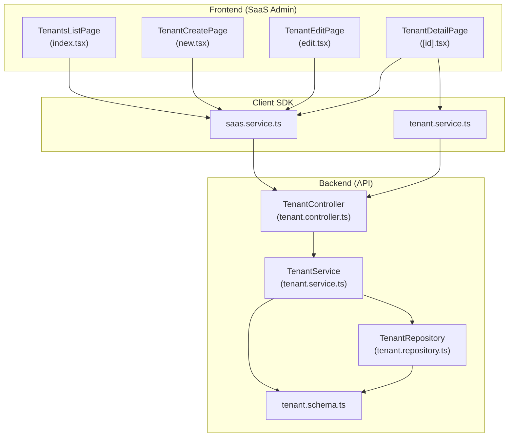
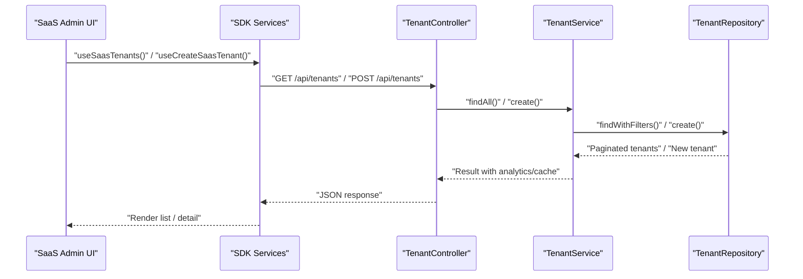
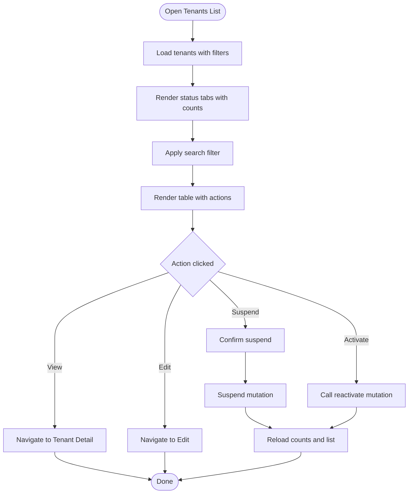
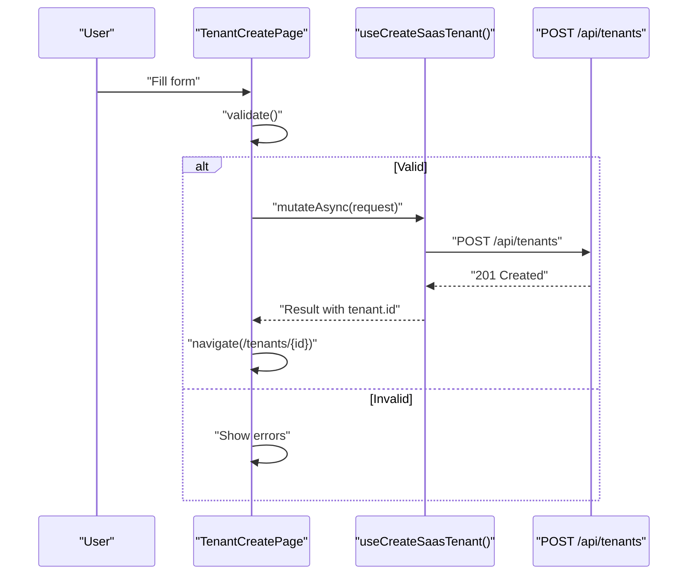
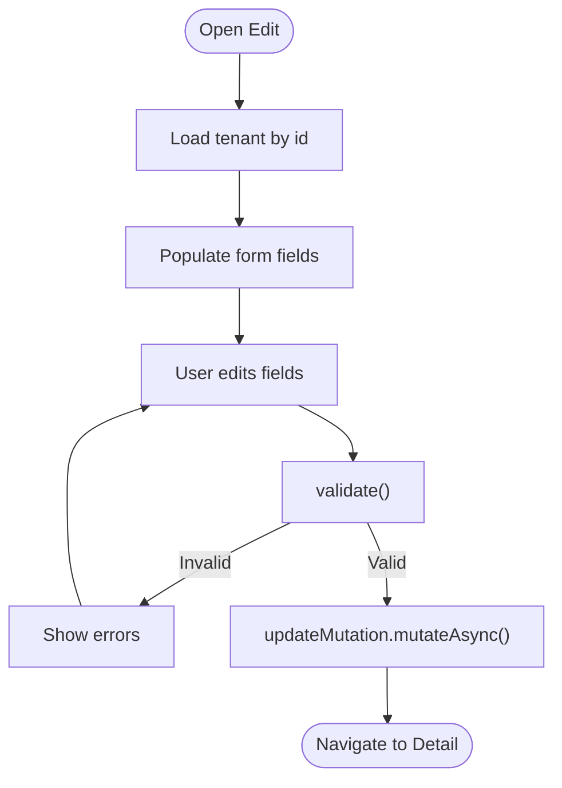
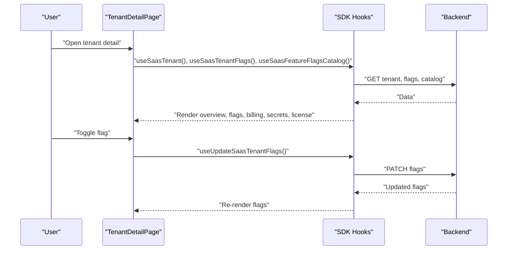
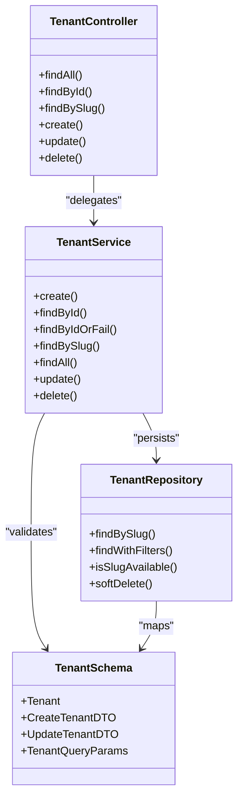
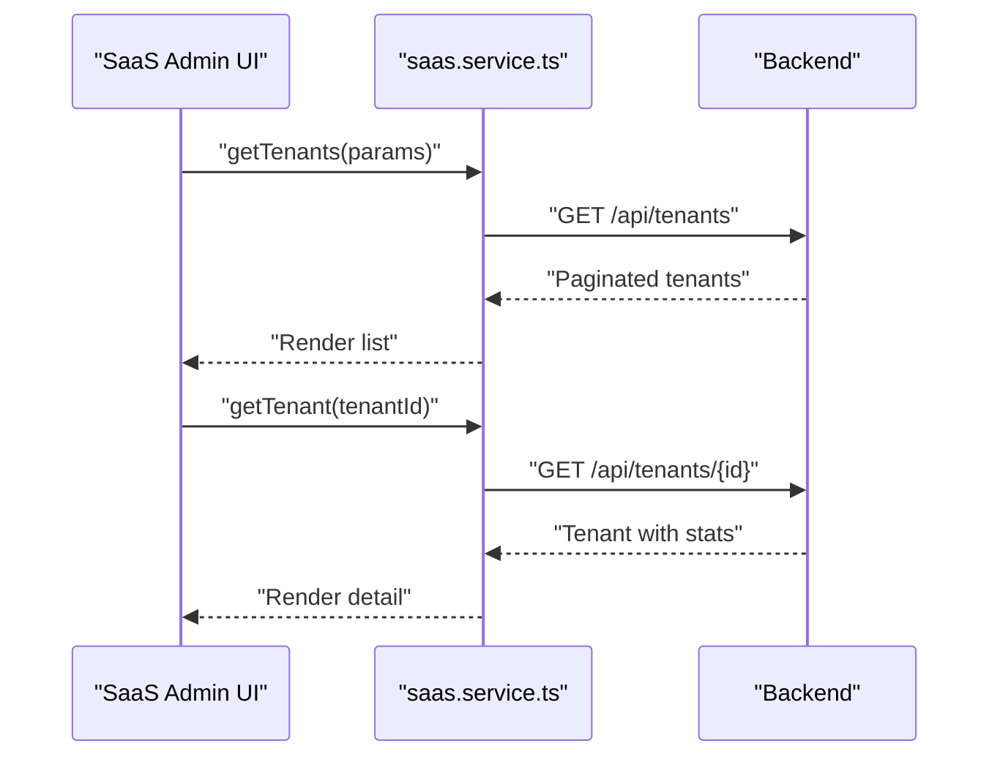
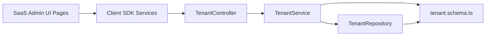

# Tenant Management

<cite>
**Referenced Files in This Document**
- [apps/saas-admin/src/routes/tenants/index.tsx](file://apps/saas-admin/src/routes/tenants/index.tsx)
- [apps/saas-admin/src/routes/tenants/new.tsx](file://apps/saas-admin/src/routes/tenants/new.tsx)
- [apps/saas-admin/src/routes/tenants/edit.tsx](file://apps/saas-admin/src/routes/tenants/edit.tsx)
- [apps/saas-admin/src/routes/tenants/[id].tsx](file://apps/saas-admin/src/routes/tenants/[id].tsx)
- [apps/api/src/modules/tenant/tenant.controller.ts](file://apps/api/src/modules/tenant/tenant.controller.ts)
- [apps/api/src/modules/tenant/tenant.service.ts](file://apps/api/src/modules/tenant/tenant.service.ts)
- [apps/api/src/modules/tenant/tenant.repository.ts](file://apps/api/src/modules/tenant/tenant.repository.ts)
- [apps/api/src/schemas/tenant.schema.ts](file://apps/api/src/schemas/tenant.schema.ts)
- [packages/client-sdk/src/services/tenant.service.ts](file://packages/client-sdk/src/services/tenant.service.ts)
- [packages/client-sdk/src/services/saas.service.ts](file://packages/client-sdk/src/services/saas.service.ts)
- [docs/digilist-platform/roles/tenant-admin-backoffice/overview.md](file://docs/digilist-platform/roles/tenant-admin-backoffice/overview.md)
- [docs/digilist-platform/roles/tenant-admin-backoffice/tenant-users-backoffice.md](file://docs/digilist-platform/roles/tenant-admin-backoffice/tenant-users-backoffice.md)
</cite>

## Table of Contents
1. [Introduction](#introduction)
2. [Project Structure](#project-structure)
3. [Core Components](#core-components)
4. [Architecture Overview](#architecture-overview)
5. [Detailed Component Analysis](#detailed-component-analysis)
6. [Dependency Analysis](#dependency-analysis)
7. [Performance Considerations](#performance-considerations)
8. [Troubleshooting Guide](#troubleshooting-guide)
9. [Conclusion](#conclusion)

## Introduction
This document describes the Tenant Management functionality in the SaaS Admin Application. It covers the complete tenant lifecycle: creation, editing, viewing, suspension/reactivation, and deletion. It also documents the tenant wizard interface for onboarding, tenant configuration and feature flags, dashboard views, administrative controls, and integration with backend tenant services. Real-time updates for tenant status changes are supported through the client SDK hooks used by the SaaS Admin UI.

## Project Structure
The Tenant Management feature spans three layers:
- Frontend (SaaS Admin): Pages for listing, creating, editing, and viewing tenants; feature flags editor; usage dashboards.
- Backend (API): REST endpoints for tenant CRUD, validation, caching, and analytics.
- Client SDK: Services and hooks consumed by the frontend to communicate with the backend.

**Diagram sources**
- [apps/saas-admin/src/routes/tenants/index.tsx](file://apps/saas-admin/src/routes/tenants/index.tsx#L1-L366)
- [apps/saas-admin/src/routes/tenants/new.tsx](file://apps/saas-admin/src/routes/tenants/new.tsx#L1-L340)
- [apps/saas-admin/src/routes/tenants/edit.tsx](file://apps/saas-admin/src/routes/tenants/edit.tsx#L1-L311)
- [apps/saas-admin/src/routes/tenants/[id].tsx](file://apps/saas-admin/src/routes/tenants/[id].tsx#L1-L751)
- [packages/client-sdk/src/services/tenant.service.ts](file://packages/client-sdk/src/services/tenant.service.ts#L1-L154)
- [packages/client-sdk/src/services/saas.service.ts](file://packages/client-sdk/src/services/saas.service.ts#L45-L76)
- [apps/api/src/modules/tenant/tenant.controller.ts](file://apps/api/src/modules/tenant/tenant.controller.ts#L1-L82)
- [apps/api/src/modules/tenant/tenant.service.ts](file://apps/api/src/modules/tenant/tenant.service.ts#L1-L155)
- [apps/api/src/modules/tenant/tenant.repository.ts](file://apps/api/src/modules/tenant/tenant.repository.ts#L1-L71)
- [apps/api/src/schemas/tenant.schema.ts](file://apps/api/src/schemas/tenant.schema.ts#L1-L89)

**Section sources**
- [apps/saas-admin/src/routes/tenants/index.tsx](file://apps/saas-admin/src/routes/tenants/index.tsx#L1-L366)
- [apps/saas-admin/src/routes/tenants/new.tsx](file://apps/saas-admin/src/routes/tenants/new.tsx#L1-L340)
- [apps/saas-admin/src/routes/tenants/edit.tsx](file://apps/saas-admin/src/routes/tenants/edit.tsx#L1-L311)
- [apps/saas-admin/src/routes/tenants/[id].tsx](file://apps/saas-admin/src/routes/tenants/[id].tsx#L1-L751)
- [packages/client-sdk/src/services/tenant.service.ts](file://packages/client-sdk/src/services/tenant.service.ts#L1-L154)
- [packages/client-sdk/src/services/saas.service.ts](file://packages/client-sdk/src/services/saas.service.ts#L45-L76)
- [apps/api/src/modules/tenant/tenant.controller.ts](file://apps/api/src/modules/tenant/tenant.controller.ts#L1-L82)
- [apps/api/src/modules/tenant/tenant.service.ts](file://apps/api/src/modules/tenant/tenant.service.ts#L1-L155)
- [apps/api/src/modules/tenant/tenant.repository.ts](file://apps/api/src/modules/tenant/tenant.repository.ts#L1-L71)
- [apps/api/src/schemas/tenant.schema.ts](file://apps/api/src/schemas/tenant.schema.ts#L1-L89)

## Core Components
- Tenants List Page: Displays paginated tenants with status tabs, search, and actions (view, edit, suspend, activate, license).
- Tenant Create Page: Wizard-like form to create a new tenant with plan selection and seat limits override.
- Tenant Edit Page: Edit tenant details, status, and plan; includes validation and unsaved changes protection.
- Tenant Detail Page: Comprehensive dashboard with usage stats, feature flags editor, billing, secrets, license, and category entitlements.
- Backend Tenant Controller/Service/Repository: REST endpoints, business logic, persistence, caching, and validation.
- Client SDK Services: Tenant service (tenant-admin) and SaaS service (platform-level) used by the UI.

**Section sources**
- [apps/saas-admin/src/routes/tenants/index.tsx](file://apps/saas-admin/src/routes/tenants/index.tsx#L49-L363)
- [apps/saas-admin/src/routes/tenants/new.tsx](file://apps/saas-admin/src/routes/tenants/new.tsx#L51-L337)
- [apps/saas-admin/src/routes/tenants/edit.tsx](file://apps/saas-admin/src/routes/tenants/edit.tsx#L41-L308)
- [apps/saas-admin/src/routes/tenants/[id].tsx](file://apps/saas-admin/src/routes/tenants/[id].tsx#L86-L748)
- [apps/api/src/modules/tenant/tenant.controller.ts](file://apps/api/src/modules/tenant/tenant.controller.ts#L16-L81)
- [apps/api/src/modules/tenant/tenant.service.ts](file://apps/api/src/modules/tenant/tenant.service.ts#L20-L154)
- [apps/api/src/modules/tenant/tenant.repository.ts](file://apps/api/src/modules/tenant/tenant.repository.ts#L10-L70)
- [packages/client-sdk/src/services/tenant.service.ts](file://packages/client-sdk/src/services/tenant.service.ts#L56-L151)
- [packages/client-sdk/src/services/saas.service.ts](file://packages/client-sdk/src/services/saas.service.ts#L57-L76)

## Architecture Overview
The SaaS Admin Tenant Management follows a clean architecture:
- UI pages orchestrate queries and mutations via SDK hooks.
- SDK services call backend endpoints.
- Backend controller validates requests, delegates to service, and returns responses.
- Service applies business rules, caches, analytics, and persists via repository.
- Repository maps to schema and database.

**Diagram sources**
- [apps/saas-admin/src/routes/tenants/index.tsx](file://apps/saas-admin/src/routes/tenants/index.tsx#L66-L69)
- [apps/saas-admin/src/routes/tenants/new.tsx](file://apps/saas-admin/src/routes/tenants/new.tsx#L72-L72)
- [packages/client-sdk/src/services/saas.service.ts](file://packages/client-sdk/src/services/saas.service.ts#L61-L76)
- [apps/api/src/modules/tenant/tenant.controller.ts](file://apps/api/src/modules/tenant/tenant.controller.ts#L25-L61)
- [apps/api/src/modules/tenant/tenant.service.ts](file://apps/api/src/modules/tenant/tenant.service.ts#L116-L67)
- [apps/api/src/modules/tenant/tenant.repository.ts](file://apps/api/src/modules/tenant/tenant.repository.ts#L32-L48)

## Detailed Component Analysis

### Tenants List Page (SaaS Admin)
- Features:
  - Status tabs (active, inactive, suspended, pending) with counts.
  - Search by name/slug/domain.
  - Filter chips and reset filters.
  - Table with actions: view, edit, suspend, activate, license.
  - Pagination metadata.
- Administrative controls:
  - Suspend/activate tenants via mutations.
  - Navigate to create page and detail page.

**Diagram sources**
- [apps/saas-admin/src/routes/tenants/index.tsx](file://apps/saas-admin/src/routes/tenants/index.tsx#L66-L118)

**Section sources**
- [apps/saas-admin/src/routes/tenants/index.tsx](file://apps/saas-admin/src/routes/tenants/index.tsx#L49-L363)

### Tenant Create Page (Onboarding Wizard)
- Features:
  - Basic info: name, slug, optional domain.
  - Slug auto-generation from name.
  - Plan selection with seat limits.
  - Custom seat limits toggle.
  - Validation: required fields, slug format, domain format.
  - Submission with error banner and spinner.
- Backend integration:
  - Uses SDK mutation hook to call create endpoint.

**Diagram sources**
- [apps/saas-admin/src/routes/tenants/new.tsx](file://apps/saas-admin/src/routes/tenants/new.tsx#L123-L167)
- [packages/client-sdk/src/services/saas.service.ts](file://packages/client-sdk/src/services/saas.service.ts#L61-L76)
- [apps/api/src/modules/tenant/tenant.controller.ts](file://apps/api/src/modules/tenant/tenant.controller.ts#L56-L61)

**Section sources**
- [apps/saas-admin/src/routes/tenants/new.tsx](file://apps/saas-admin/src/routes/tenants/new.tsx#L51-L337)
- [apps/api/src/schemas/tenant.schema.ts](file://apps/api/src/schemas/tenant.schema.ts#L54-L62)

### Tenant Edit Page
- Features:
  - Pre-populated form from tenant details.
  - Validation and error feedback.
  - Unsaved changes protection with beforeunload.
  - Status dropdown and plan selection.
  - Submit only if dirty and valid.
- Backend integration:
  - Uses SDK update hook to call PUT endpoint.

**Diagram sources**
- [apps/saas-admin/src/routes/tenants/edit.tsx](file://apps/saas-admin/src/routes/tenants/edit.tsx#L69-L139)
- [packages/client-sdk/src/services/saas.service.ts](file://packages/client-sdk/src/services/saas.service.ts#L74-L76)
- [apps/api/src/modules/tenant/tenant.controller.ts](file://apps/api/src/modules/tenant/tenant.controller.ts#L66-L71)

**Section sources**
- [apps/saas-admin/src/routes/tenants/edit.tsx](file://apps/saas-admin/src/routes/tenants/edit.tsx#L41-L308)
- [apps/api/src/schemas/tenant.schema.ts](file://apps/api/src/schemas/tenant.schema.ts#L69-L74)

### Tenant Detail Page (Dashboard and Controls)
- Features:
  - Header with badges (status, plan, license).
  - Usage statistics cards (users, organizations, listings, bookings/month, storage).
  - Feature flags editor: group by category, enable/disable toggles, show overrides.
  - Billing tab: status, plan, amounts, invoices.
  - Secrets tab: provider, key, configured status, fingerprint, last rotated.
  - License tab: fingerprint, last rotated, rotate button with warning.
  - Categories tab: delegated entitlements.
- Administrative controls:
  - Suspend/activate tenant.
  - Edit link to change details.
  - Rotate license key with immediate invalidation notice.

**Diagram sources**
- [apps/saas-admin/src/routes/tenants/[id].tsx](file://apps/saas-admin/src/routes/tenants/[id].tsx#L94-L131)
- [packages/client-sdk/src/services/saas.service.ts](file://packages/client-sdk/src/services/saas.service.ts#L61-L76)

**Section sources**
- [apps/saas-admin/src/routes/tenants/[id].tsx](file://apps/saas-admin/src/routes/tenants/[id].tsx#L86-L748)

### Backend Tenant Domain (Controller, Service, Repository)
- Controller:
  - Endpoints: list, find by id/slug, create, update, delete.
  - Request validation via Zod schemas.
- Service:
  - Business logic: create with slug uniqueness, cache reads/writes, analytics, email, update/delete with cache invalidation.
- Repository:
  - Data access: find by slug, paginated filters, slug availability, soft delete.

**Diagram sources**
- [apps/api/src/modules/tenant/tenant.controller.ts](file://apps/api/src/modules/tenant/tenant.controller.ts#L16-L81)
- [apps/api/src/modules/tenant/tenant.service.ts](file://apps/api/src/modules/tenant/tenant.service.ts#L20-L154)
- [apps/api/src/modules/tenant/tenant.repository.ts](file://apps/api/src/modules/tenant/tenant.repository.ts#L10-L70)
- [apps/api/src/schemas/tenant.schema.ts](file://apps/api/src/schemas/tenant.schema.ts#L38-L89)

**Section sources**
- [apps/api/src/modules/tenant/tenant.controller.ts](file://apps/api/src/modules/tenant/tenant.controller.ts#L16-L81)
- [apps/api/src/modules/tenant/tenant.service.ts](file://apps/api/src/modules/tenant/tenant.service.ts#L20-L154)
- [apps/api/src/modules/tenant/tenant.repository.ts](file://apps/api/src/modules/tenant/tenant.repository.ts#L10-L70)
- [apps/api/src/schemas/tenant.schema.ts](file://apps/api/src/schemas/tenant.schema.ts#L38-L89)

### Client SDK Integration
- Tenant Service (tenant-admin):
  - Provides tenant, subscription, license, stats, upgrade/cancel, billing portal.
- SaaS Service (platform-level):
  - Provides tenants listing and detail with stats for SaaS Admin.

**Diagram sources**
- [packages/client-sdk/src/services/saas.service.ts](file://packages/client-sdk/src/services/saas.service.ts#L61-L76)
- [apps/api/src/modules/tenant/tenant.controller.ts](file://apps/api/src/modules/tenant/tenant.controller.ts#L25-L39)

**Section sources**
- [packages/client-sdk/src/services/tenant.service.ts](file://packages/client-sdk/src/services/tenant.service.ts#L56-L151)
- [packages/client-sdk/src/services/saas.service.ts](file://packages/client-sdk/src/services/saas.service.ts#L57-L76)

## Dependency Analysis
- UI depends on SDK hooks/services for data fetching and mutations.
- SDK depends on backend endpoints defined in the controller.
- Service depends on repository and Zod schemas for validation.
- Repository depends on schema and database.

**Diagram sources**
- [apps/saas-admin/src/routes/tenants/index.tsx](file://apps/saas-admin/src/routes/tenants/index.tsx#L34-L37)
- [packages/client-sdk/src/services/saas.service.ts](file://packages/client-sdk/src/services/saas.service.ts#L61-L76)
- [apps/api/src/modules/tenant/tenant.controller.ts](file://apps/api/src/modules/tenant/tenant.controller.ts#L16-L81)
- [apps/api/src/modules/tenant/tenant.service.ts](file://apps/api/src/modules/tenant/tenant.service.ts#L20-L25)
- [apps/api/src/modules/tenant/tenant.repository.ts](file://apps/api/src/modules/tenant/tenant.repository.ts#L10-L19)
- [apps/api/src/schemas/tenant.schema.ts](file://apps/api/src/schemas/tenant.schema.ts#L38-L47)

**Section sources**
- [apps/saas-admin/src/routes/tenants/index.tsx](file://apps/saas-admin/src/routes/tenants/index.tsx#L34-L37)
- [packages/client-sdk/src/services/saas.service.ts](file://packages/client-sdk/src/services/saas.service.ts#L61-L76)
- [apps/api/src/modules/tenant/tenant.controller.ts](file://apps/api/src/modules/tenant/tenant.controller.ts#L16-L81)
- [apps/api/src/modules/tenant/tenant.service.ts](file://apps/api/src/modules/tenant/tenant.service.ts#L20-L25)
- [apps/api/src/modules/tenant/tenant.repository.ts](file://apps/api/src/modules/tenant/tenant.repository.ts#L10-L19)
- [apps/api/src/schemas/tenant.schema.ts](file://apps/api/src/schemas/tenant.schema.ts#L38-L47)

## Performance Considerations
- Caching: Service reads from cache for tenant and slug lookups, writes on create/update, deletes on update/delete.
- Pagination: Controller enforces page/limit bounds; UI pages pass filters to backend.
- Validation: Zod schemas validate early to reduce downstream errors.
- Async rendering: UI shows spinners during loads and mutations.

[No sources needed since this section provides general guidance]

## Troubleshooting Guide
- Slug conflicts: Creation fails if slug is taken; ensure uniqueness.
- Validation errors: UI displays localized messages for required fields, slug format, and domain format.
- Not found: Detail page handles missing tenant gracefully.
- Unsaved changes: Edit page warns before unload if dirty.
- Status transitions: Suspend/activate require confirmation; ensure correct state transitions.

**Section sources**
- [apps/api/src/modules/tenant/tenant.service.ts](file://apps/api/src/modules/tenant/tenant.service.ts#L33-L37)
- [apps/saas-admin/src/routes/tenants/new.tsx](file://apps/saas-admin/src/routes/tenants/new.tsx#L123-L144)
- [apps/saas-admin/src/routes/tenants/edit.tsx](file://apps/saas-admin/src/routes/tenants/edit.tsx#L95-L116)
- [apps/saas-admin/src/routes/tenants/[id].tsx](file://apps/saas-admin/src/routes/tenants/[id].tsx#L202-L219)
- [apps/saas-admin/src/routes/tenants/edit.tsx](file://apps/saas-admin/src/routes/tenants/edit.tsx#L142-L151)

## Conclusion
The SaaS Admin Tenant Management provides a complete, validated, and user-friendly lifecycle for tenants. The frontend offers intuitive wizards and dashboards, while the backend enforces robust validation, caching, and analytics. Administrative controls for suspending/activating tenants and rotating license keys are integrated with real-time feedback via SDK hooks.