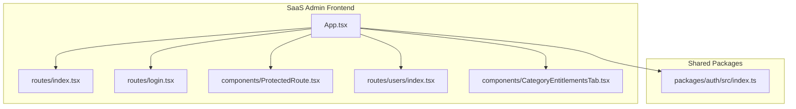
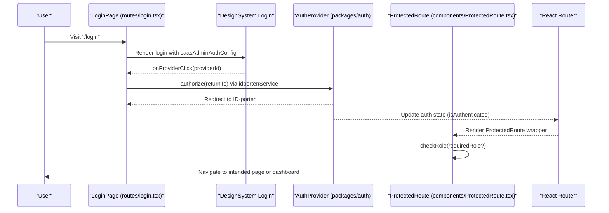
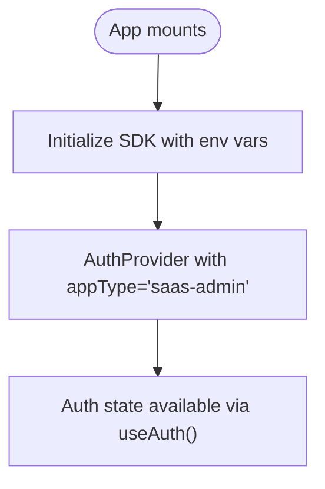
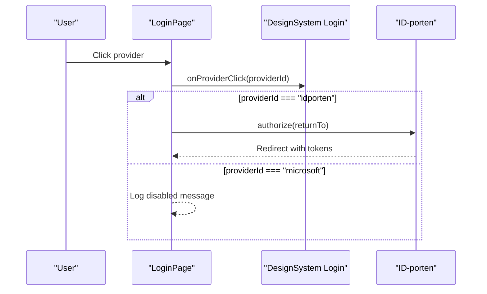
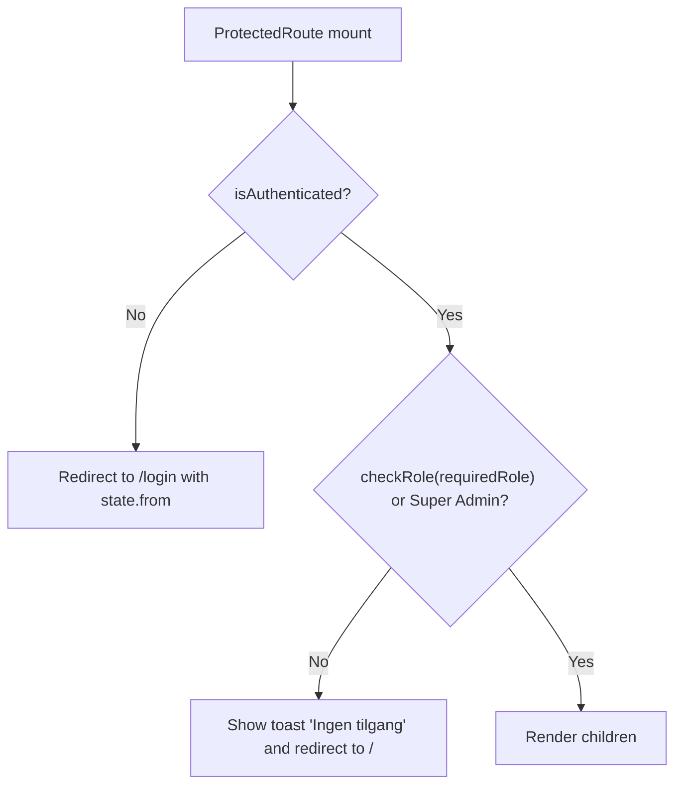
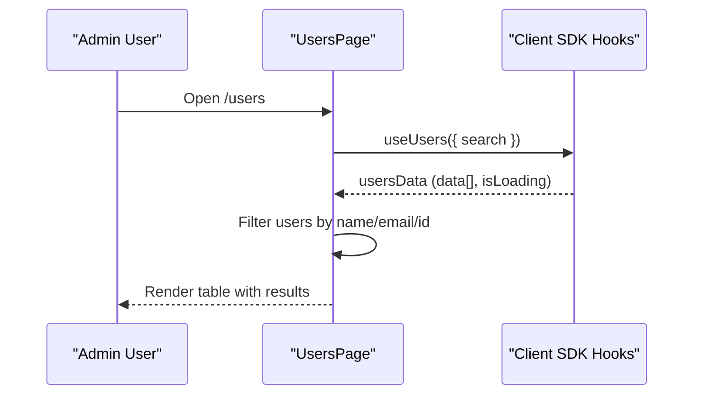
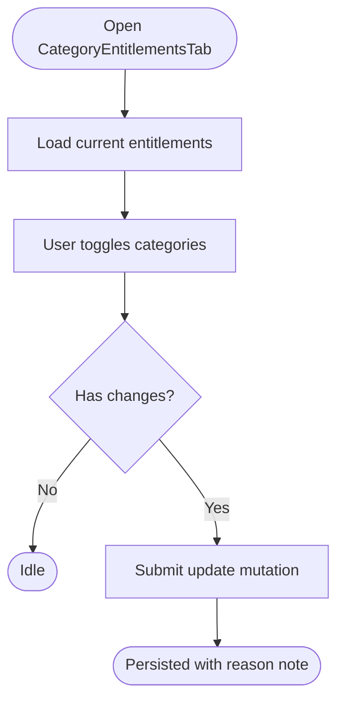
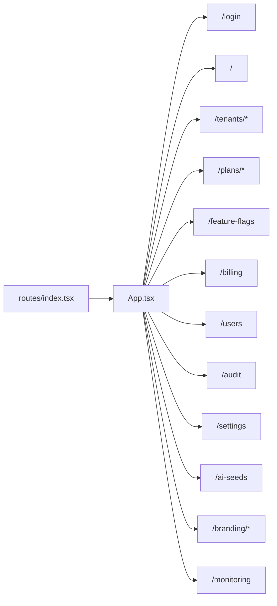
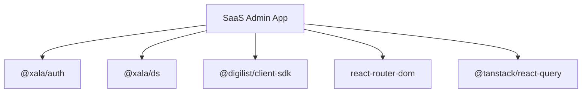

# User Access Control

<cite>
**Referenced Files in This Document**
- [apps/saas-admin/src/App.tsx](file://apps/saas-admin/src/App.tsx)
- [apps/saas-admin/src/main.tsx](file://apps/saas-admin/src/main.tsx)
- [apps/saas-admin/src/routes/index.tsx](file://apps/saas-admin/src/routes/index.tsx)
- [apps/saas-admin/src/routes/login.tsx](file://apps/saas-admin/src/routes/login.tsx)
- [apps/saas-admin/src/components/ProtectedRoute.tsx](file://apps/saas-admin/src/components/ProtectedRoute.tsx)
- [apps/saas-admin/src/routes/users/index.tsx](file://apps/saas-admin/src/routes/users/index.tsx)
- [apps/saas-admin/src/components/CategoryEntitlementsTab.tsx](file://apps/saas-admin/src/components/CategoryEntitlementsTab.tsx)
- [packages/auth/src/index.ts](file://packages/auth/src/index.ts)
- [packages/auth/src/hooks/useAuth.ts](file://packages/auth/src/hooks/useAuth.ts)
</cite>

## Table of Contents
1. [Introduction](#introduction)
2. [Project Structure](#project-structure)
3. [Core Components](#core-components)
4. [Architecture Overview](#architecture-overview)
5. [Detailed Component Analysis](#detailed-component-analysis)
6. [Dependency Analysis](#dependency-analysis)
7. [Performance Considerations](#performance-considerations)
8. [Troubleshooting Guide](#troubleshooting-guide)
9. [Conclusion](#conclusion)

## Introduction
This document describes the User Access Control and Administrative User Management in the SaaS Admin Application. It explains how administrative users authenticate and maintain session state, how role-based access control (RBAC) restricts navigation and page features, how platform administrators manage users across tenants, and how auditing and monitoring surfaces are integrated. It also outlines the entitlement model for tenant-enabled categories and highlights security and compliance considerations for administrative access monitoring.

## Project Structure
The SaaS Admin application is a React single-page application bootstrapped with Vite. It integrates a centralized authentication package and a shared design system. Routing is handled via React Router, with protected routes enforced by a dedicated component. Administrative features include user listing, tenant management, plans, feature flags, billing, audit logs, settings, AI seed generation, branding, and monitoring.

**Diagram sources**
- [apps/saas-admin/src/App.tsx](file://apps/saas-admin/src/App.tsx#L39-L92)
- [apps/saas-admin/src/routes/index.tsx](file://apps/saas-admin/src/routes/index.tsx#L1-L26)
- [apps/saas-admin/src/routes/login.tsx](file://apps/saas-admin/src/routes/login.tsx#L1-L101)
- [apps/saas-admin/src/components/ProtectedRoute.tsx](file://apps/saas-admin/src/components/ProtectedRoute.tsx#L1-L68)
- [apps/saas-admin/src/routes/users/index.tsx](file://apps/saas-admin/src/routes/users/index.tsx#L1-L127)
- [apps/saas-admin/src/components/CategoryEntitlementsTab.tsx](file://apps/saas-admin/src/components/CategoryEntitlementsTab.tsx#L1-L214)
- [packages/auth/src/index.ts](file://packages/auth/src/index.ts#L1-L52)

**Section sources**
- [apps/saas-admin/src/App.tsx](file://apps/saas-admin/src/App.tsx#L39-L92)
- [apps/saas-admin/src/routes/index.tsx](file://apps/saas-admin/src/routes/index.tsx#L1-L26)

## Core Components
- Authentication and session management are provided by a centralized package and exposed via a React context. The SaaS Admin configures the AuthProvider with the application type and debug mode.
- The login page delegates authentication to a shared design-system login component and integrates with configured identity providers.
- ProtectedRoute enforces authentication and optional role checks, redirecting unauthenticated users to the login page and unauthorized users to the dashboard while notifying via toast.
- The Users page lists platform users across tenants with search and status indicators.
- CategoryEntitlementsTab manages which rental object categories are enabled for a given tenant, persisting changes via mutations.

**Section sources**
- [apps/saas-admin/src/main.tsx](file://apps/saas-admin/src/main.tsx#L1-L33)
- [apps/saas-admin/src/routes/login.tsx](file://apps/saas-admin/src/routes/login.tsx#L1-L101)
- [apps/saas-admin/src/components/ProtectedRoute.tsx](file://apps/saas-admin/src/components/ProtectedRoute.tsx#L1-L68)
- [apps/saas-admin/src/routes/users/index.tsx](file://apps/saas-admin/src/routes/users/index.tsx#L1-L127)
- [apps/saas-admin/src/components/CategoryEntitlementsTab.tsx](file://apps/saas-admin/src/components/CategoryEntitlementsTab.tsx#L1-L214)
- [packages/auth/src/index.ts](file://packages/auth/src/index.ts#L1-L52)

## Architecture Overview
The SaaS Admin application composes routing, authentication, and UI components. Authentication state is provided globally and consumed by route protection and UI elements. The login page integrates with identity providers and redirects authenticated users to their intended destination. ProtectedRoute ensures only authorized users can access protected areas, and the Users page provides administrative visibility across tenants.

**Diagram sources**
- [apps/saas-admin/src/routes/login.tsx](file://apps/saas-admin/src/routes/login.tsx#L19-L98)
- [apps/saas-admin/src/components/ProtectedRoute.tsx](file://apps/saas-admin/src/components/ProtectedRoute.tsx#L24-L67)
- [packages/auth/src/index.ts](file://packages/auth/src/index.ts#L17-L20)

## Detailed Component Analysis

### Authentication and Session Management
- The application initializes the Digilist client SDK with environment variables for base URL, tenant ID, and license key.
- The AuthProvider is configured with the application type "saas-admin" and debug mode based on the development environment.
- The useAuth hook exposes authentication state and role-checking capabilities to components.

**Diagram sources**
- [apps/saas-admin/src/main.tsx](file://apps/saas-admin/src/main.tsx#L10-L15)
- [apps/saas-admin/src/main.tsx](file://apps/saas-admin/src/main.tsx#L51-L51)
- [packages/auth/src/hooks/useAuth.ts](file://packages/auth/src/hooks/useAuth.ts#L12-L20)

**Section sources**
- [apps/saas-admin/src/main.tsx](file://apps/saas-admin/src/main.tsx#L1-L33)
- [packages/auth/src/hooks/useAuth.ts](file://packages/auth/src/hooks/useAuth.ts#L1-L21)

### Login and Identity Provider Integration
- The login page renders a branded panel with features and integrations, and delegates provider selection to the shared design-system login component.
- On provider click, the application triggers the ID-porten authorization flow and preserves the return URL for post-authentication navigation.
- Demo login is supported via a dedicated hook and dialog.

**Diagram sources**
- [apps/saas-admin/src/routes/login.tsx](file://apps/saas-admin/src/routes/login.tsx#L34-L41)
- [apps/saas-admin/src/routes/login.tsx](file://apps/saas-admin/src/routes/login.tsx#L84-L96)

**Section sources**
- [apps/saas-admin/src/routes/login.tsx](file://apps/saas-admin/src/routes/login.tsx#L1-L101)

### Role-Based Access Control and Protected Routes
- ProtectedRoute checks authentication state and optionally verifies a required role.
- If the user is not authenticated, they are redirected to the login page with the intended destination preserved.
- If the user lacks the required role, a toast notification is shown and the user is redirected to the dashboard.
- Super admin users bypass role restrictions by design.

**Diagram sources**
- [apps/saas-admin/src/components/ProtectedRoute.tsx](file://apps/saas-admin/src/components/ProtectedRoute.tsx#L24-L67)

**Section sources**
- [apps/saas-admin/src/components/ProtectedRoute.tsx](file://apps/saas-admin/src/components/ProtectedRoute.tsx#L1-L68)

### Administrative User Management
- The Users page fetches platform users and displays them in a searchable table with columns for name, email, tenant, and status.
- Filtering is performed client-side on the user list when a search term is present.

**Diagram sources**
- [apps/saas-admin/src/routes/users/index.tsx](file://apps/saas-admin/src/routes/users/index.tsx#L26-L41)
- [apps/saas-admin/src/routes/users/index.tsx](file://apps/saas-admin/src/routes/users/index.tsx#L90-L113)

**Section sources**
- [apps/saas-admin/src/routes/users/index.tsx](file://apps/saas-admin/src/routes/users/index.tsx#L1-L127)

### Tenant Category Entitlements
- The CategoryEntitlementsTab component enumerates platform rental object categories and allows enabling/disabling them per tenant.
- Changes are persisted via a mutation that sends category keys with enabled flags and a reason note.
- Bulk actions support selecting or deselecting all categories.

**Diagram sources**
- [apps/saas-admin/src/components/CategoryEntitlementsTab.tsx](file://apps/saas-admin/src/components/CategoryEntitlementsTab.tsx#L40-L106)
- [apps/saas-admin/src/components/CategoryEntitlementsTab.tsx](file://apps/saas-admin/src/components/CategoryEntitlementsTab.tsx#L148-L210)

**Section sources**
- [apps/saas-admin/src/components/CategoryEntitlementsTab.tsx](file://apps/saas-admin/src/components/CategoryEntitlementsTab.tsx#L1-L214)

### Routing and Navigation
- The routes index centralizes exports for all pages, enabling clean imports across the application.
- The main App component defines the SPA routes, including nested protected routes under the AppLayout wrapper.

**Diagram sources**
- [apps/saas-admin/src/routes/index.tsx](file://apps/saas-admin/src/routes/index.tsx#L8-L25)
- [apps/saas-admin/src/App.tsx](file://apps/saas-admin/src/App.tsx#L52-L83)

**Section sources**
- [apps/saas-admin/src/routes/index.tsx](file://apps/saas-admin/src/routes/index.tsx#L1-L26)
- [apps/saas-admin/src/App.tsx](file://apps/saas-admin/src/App.tsx#L39-L92)

## Dependency Analysis
The SaaS Admin application depends on:
- The centralized authentication package for auth state, providers, and role checks.
- The design system package for UI components and shared patterns.
- The Digilist client SDK for data fetching and mutations.
- React Router for SPA routing and navigation.
- TanStack React Query for caching and background data synchronization.

**Diagram sources**
- [apps/saas-admin/src/main.tsx](file://apps/saas-admin/src/main.tsx#L15-L26)
- [apps/saas-admin/src/App.tsx](file://apps/saas-admin/src/App.tsx#L4-L6)

**Section sources**
- [apps/saas-admin/src/main.tsx](file://apps/saas-admin/src/main.tsx#L15-L26)
- [apps/saas-admin/src/App.tsx](file://apps/saas-admin/src/App.tsx#L4-L6)

## Performance Considerations
- Client-side filtering in the Users page is efficient for small to moderate datasets but may require pagination or server-side filtering for very large user bases.
- React Query default caching reduces redundant network requests; adjust staleTime and retry policies according to operational needs.
- Keep the number of concurrent protected route checks minimal by leveraging lazy-loaded route modules where appropriate.

## Troubleshooting Guide
- Authentication loops or incorrect redirects:
  - Verify the AuthProvider configuration and appType.
  - Confirm the login page’s provider handler and return URL handling.
- Role-based access denials:
  - Ensure the user possesses the required role or is a super admin.
  - Check ProtectedRoute behavior and toast notifications for denial messages.
- User listing issues:
  - Confirm the Users page search filter logic and SDK hook usage.
- Category entitlement updates:
  - Validate the mutation payload and error handling in the tab component.

**Section sources**
- [apps/saas-admin/src/components/ProtectedRoute.tsx](file://apps/saas-admin/src/components/ProtectedRoute.tsx#L34-L42)
- [apps/saas-admin/src/routes/users/index.tsx](file://apps/saas-admin/src/routes/users/index.tsx#L32-L41)
- [apps/saas-admin/src/components/CategoryEntitlementsTab.tsx](file://apps/saas-admin/src/components/CategoryEntitlementsTab.tsx#L103-L105)

## Conclusion
The SaaS Admin Application implements a secure, centralized authentication model with robust role-based access control enforced at the routing layer. Administrative users benefit from a unified login experience, protected navigation, and powerful management surfaces such as user listing and tenant category entitlements. The architecture leverages shared packages for consistency and scalability, while the design system ensures a cohesive user experience. For compliance and monitoring, the application integrates audit and monitoring routes alongside administrative controls, supporting ongoing oversight of administrative actions and system changes.