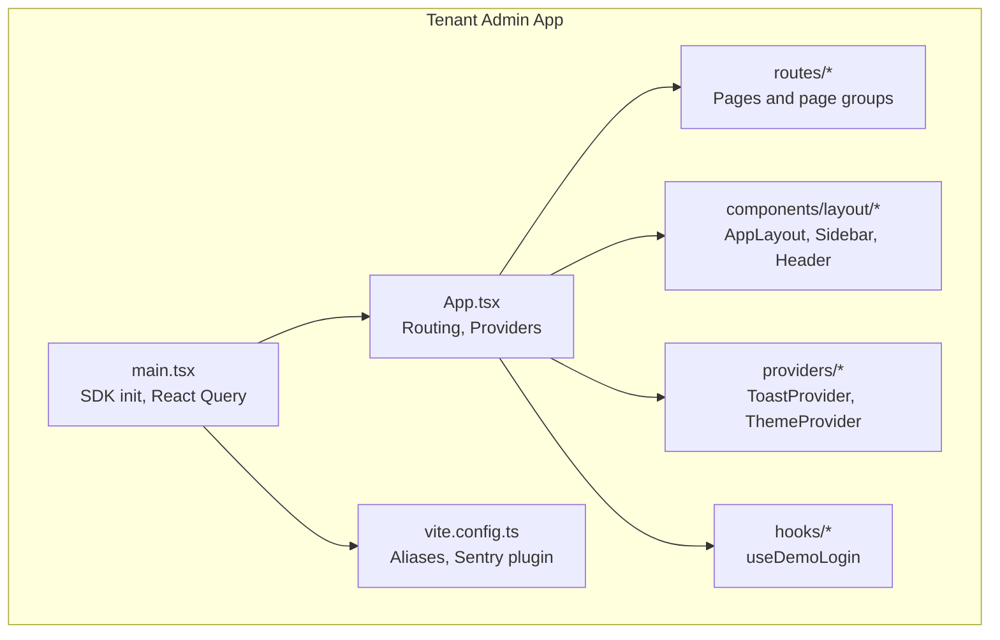
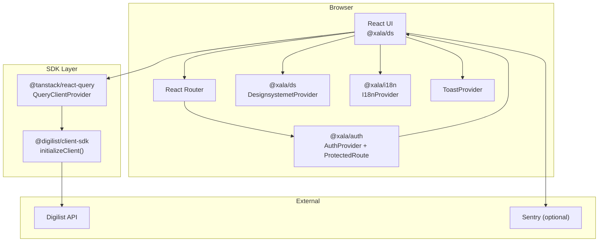
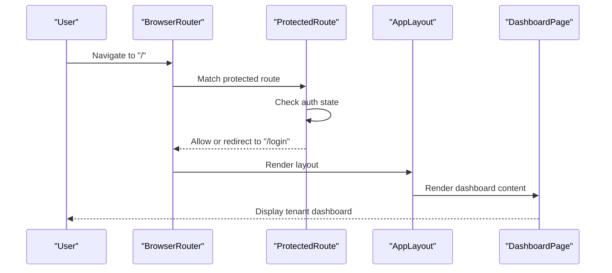
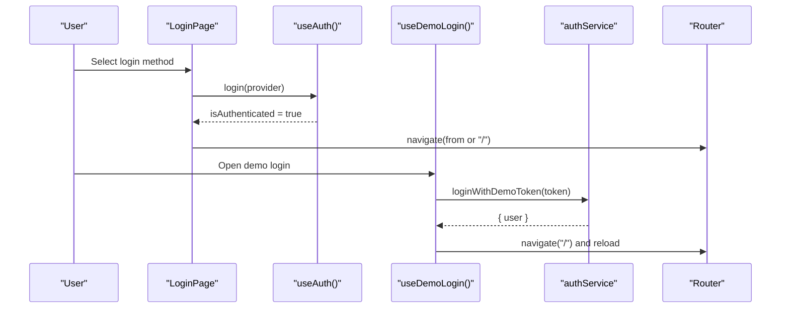
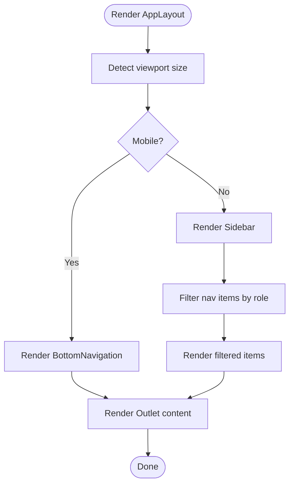
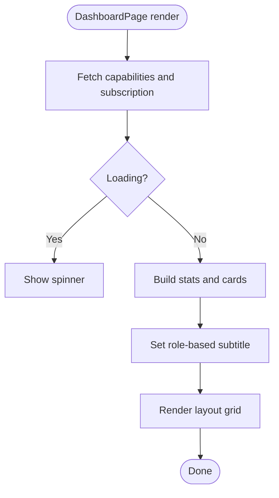
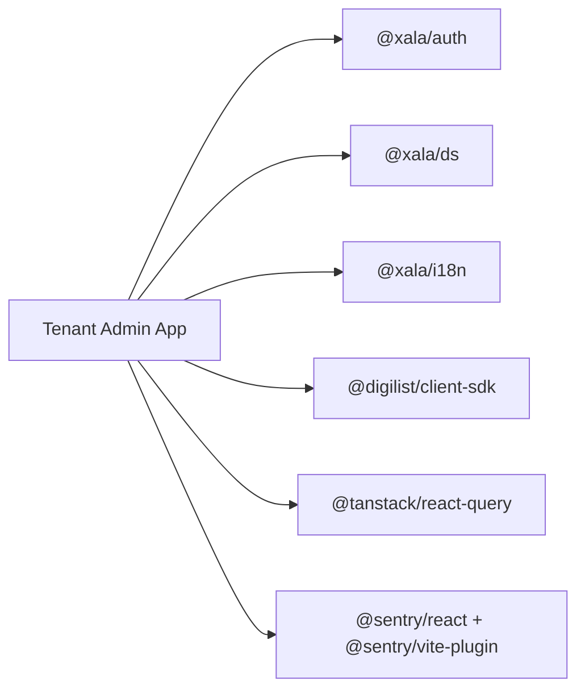

# Application Overview

<cite>
**Referenced Files in This Document**
- [package.json](file://apps/tenant-admin/package.json)
- [App.tsx](file://apps/tenant-admin/src/App.tsx)
- [main.tsx](file://apps/tenant-admin/src/main.tsx)
- [vite.config.ts](file://apps/tenant-admin/vite.config.ts)
- [routes/index.tsx](file://apps/tenant-admin/src/routes/index.tsx)
- [routes/dashboard.tsx](file://apps/tenant-admin/src/routes/dashboard.tsx)
- [routes/login.tsx](file://apps/tenant-admin/src/routes/login.tsx)
- [components/layout/AppLayout.tsx](file://apps/tenant-admin/src/components/layout/AppLayout.tsx)
- [components/layout/Sidebar.tsx](file://apps/tenant-admin/src/components/layout/Sidebar.tsx)
- [components/layout/Header.tsx](file://apps/tenant-admin/src/components/layout/Header.tsx)
- [providers/ToastProvider.tsx](file://apps/tenant-admin/src/providers/ToastProvider.tsx)
- [providers/ThemeProvider.tsx](file://apps/tenant-admin/src/providers/ThemeProvider.tsx)
- [hooks/useDemoLogin.tsx](file://apps/tenant-admin/src/hooks/useDemoLogin.tsx)
</cite>

## Table of Contents
1. [Introduction](#introduction)
2. [Project Structure](#project-structure)
3. [Core Components](#core-components)
4. [Architecture Overview](#architecture-overview)
5. [Detailed Component Analysis](#detailed-component-analysis)
6. [Dependency Analysis](#dependency-analysis)
7. [Performance Considerations](#performance-considerations)
8. [Troubleshooting Guide](#troubleshooting-guide)
9. [Conclusion](#conclusion)

## Introduction
The Tenant Admin Application is an organization-level management interface designed for tenant administrators to manage tenant-specific settings, branding, users, subscriptions, feature flags, and audit logs. It serves as a tenant-facing application within the Xala platform ecosystem, integrating shared packages for authentication, design system, internationalization, and client SDK to deliver a cohesive, role-aware experience.

The application emphasizes:
- Role-based navigation and capabilities
- Unified authentication via shared @xala/auth
- Consistent UI using @xala/ds and @xala/ds-themes
- Internationalization through @xala/i18n
- Client SDK integration for tenant data and capabilities
- Responsive layout with a sidebar on desktop and bottom navigation on mobile

## Project Structure
The application follows a React + Vite monorepo structure with clear separation of concerns:
- Providers for global state and UI behavior
- Components for layout and navigation
- Routes for pages and page groups
- Hooks for reusable logic
- Build configuration for development and production

**Diagram sources**
- [main.tsx](file://apps/tenant-admin/src/main.tsx#L1-L33)
- [App.tsx](file://apps/tenant-admin/src/App.tsx#L1-L66)
- [routes/index.tsx](file://apps/tenant-admin/src/routes/index.tsx#L1-L18)
- [components/layout/AppLayout.tsx](file://apps/tenant-admin/src/components/layout/AppLayout.tsx#L1-L119)
- [providers/ToastProvider.tsx](file://apps/tenant-admin/src/providers/ToastProvider.tsx#L1-L141)
- [providers/ThemeProvider.tsx](file://apps/tenant-admin/src/providers/ThemeProvider.tsx#L1-L122)
- [hooks/useDemoLogin.tsx](file://apps/tenant-admin/src/hooks/useDemoLogin.tsx#L1-L74)
- [vite.config.ts](file://apps/tenant-admin/vite.config.ts#L1-L38)

**Section sources**
- [package.json](file://apps/tenant-admin/package.json#L1-L35)
- [main.tsx](file://apps/tenant-admin/src/main.tsx#L1-L33)
- [App.tsx](file://apps/tenant-admin/src/App.tsx#L1-L66)
- [routes/index.tsx](file://apps/tenant-admin/src/routes/index.tsx#L1-L18)
- [vite.config.ts](file://apps/tenant-admin/vite.config.ts#L1-L38)

## Core Components
- App shell and routing: Orchestrates providers, protected routes, and page rendering.
- Layout system: Desktop sidebar and mobile bottom navigation with responsive behavior.
- Authentication and demo login: Shared auth provider with tenant-admin-specific demo flow.
- Global notifications: Toast provider for user feedback.
- Theme management: Local persistence of theme preferences with system preference detection.
- Client SDK integration: Initializes the Digilist client SDK and configures caching defaults.

Key integration points:
- @xala/auth: Authentication provider and protected route wrapper.
- @xala/ds: Design system provider, components, and layout primitives.
- @xala/i18n: Internationalization provider and translation hooks.
- @digilist/client-sdk: Tenant data fetching and client initialization.

**Section sources**
- [App.tsx](file://apps/tenant-admin/src/App.tsx#L20-L66)
- [components/layout/AppLayout.tsx](file://apps/tenant-admin/src/components/layout/AppLayout.tsx#L30-L119)
- [components/layout/Sidebar.tsx](file://apps/tenant-admin/src/components/layout/Sidebar.tsx#L79-L245)
- [components/layout/Header.tsx](file://apps/tenant-admin/src/components/layout/Header.tsx#L32-L227)
- [providers/ToastProvider.tsx](file://apps/tenant-admin/src/providers/ToastProvider.tsx#L40-L141)
- [providers/ThemeProvider.tsx](file://apps/tenant-admin/src/providers/ThemeProvider.tsx#L45-L122)
- [main.tsx](file://apps/tenant-admin/src/main.tsx#L10-L32)
- [hooks/useDemoLogin.tsx](file://apps/tenant-admin/src/hooks/useDemoLogin.tsx#L12-L74)

## Architecture Overview
The application uses a layered architecture:
- Presentation layer: Pages and layout components built with @xala/ds.
- Routing layer: React Router with protected routes enforced by @xala/ds ProtectedRoute.
- State and data layer: React Query for caching and data fetching, with @digilist/client-sdk.
- Cross-cutting concerns: @xala/auth for authentication, @xala/i18n for i18n, and Sentry for source map uploads.

**Diagram sources**
- [App.tsx](file://apps/tenant-admin/src/App.tsx#L26-L65)
- [main.tsx](file://apps/tenant-admin/src/main.tsx#L10-L32)
- [vite.config.ts](file://apps/tenant-admin/vite.config.ts#L10-L19)

## Detailed Component Analysis

### Routing and Protected Access
The routing structure defines public and protected routes:
- Public: /login
- Protected: /, /subscription, /users, /feature-flags, /audit, /branding, /settings, /settings/integrations

ProtectedRoute ensures only authenticated users can access tenant pages. The AppLayout wraps the protected area and renders the main content alongside the responsive layout.

**Diagram sources**
- [App.tsx](file://apps/tenant-admin/src/App.tsx#L38-L59)
- [components/layout/AppLayout.tsx](file://apps/tenant-admin/src/components/layout/AppLayout.tsx#L86-L118)
- [routes/dashboard.tsx](file://apps/tenant-admin/src/routes/dashboard.tsx#L62-L433)

**Section sources**
- [App.tsx](file://apps/tenant-admin/src/App.tsx#L38-L59)
- [routes/index.tsx](file://apps/tenant-admin/src/routes/index.tsx#L7-L18)

### Authentication Flow and Demo Login
The login page integrates with @xala/auth and @xala/ds LoginOption components. On successful authentication, the user is redirected to the intended destination or the dashboard. The demo login hook provides a tenant-admin-specific flow using a demo token validated by the client SDK.

**Diagram sources**
- [routes/login.tsx](file://apps/tenant-admin/src/routes/login.tsx#L24-L138)
- [hooks/useDemoLogin.tsx](file://apps/tenant-admin/src/hooks/useDemoLogin.tsx#L34-L65)
- [App.tsx](file://apps/tenant-admin/src/App.tsx#L38-L43)

**Section sources**
- [routes/login.tsx](file://apps/tenant-admin/src/routes/login.tsx#L24-L138)
- [hooks/useDemoLogin.tsx](file://apps/tenant-admin/src/hooks/useDemoLogin.tsx#L12-L74)

### Layout and Navigation
The layout adapts to screen size:
- Desktop: Sidebar with role-aware navigation items and a user info section.
- Mobile: Bottom navigation with essential links and a compact header with theme toggle and user menu.

Navigation items are filtered by user role, ensuring tenants only see relevant sections.

**Diagram sources**
- [components/layout/AppLayout.tsx](file://apps/tenant-admin/src/components/layout/AppLayout.tsx#L30-L119)
- [components/layout/Sidebar.tsx](file://apps/tenant-admin/src/components/layout/Sidebar.tsx#L79-L178)

**Section sources**
- [components/layout/AppLayout.tsx](file://apps/tenant-admin/src/components/layout/AppLayout.tsx#L30-L119)
- [components/layout/Sidebar.tsx](file://apps/tenant-admin/src/components/layout/Sidebar.tsx#L79-L245)
- [components/layout/Header.tsx](file://apps/tenant-admin/src/components/layout/Header.tsx#L32-L227)

### Dashboard Page
The dashboard aggregates tenant capabilities and subscription data, displays seat usage statistics, feature flags overview, quick actions, and system status. It uses @xala/ds components and @xala/i18n for translations.

**Diagram sources**
- [routes/dashboard.tsx](file://apps/tenant-admin/src/routes/dashboard.tsx#L62-L433)

**Section sources**
- [routes/dashboard.tsx](file://apps/tenant-admin/src/routes/dashboard.tsx#L1-L433)

### Theme and Notifications
- ThemeProvider persists user preference in localStorage and respects system preference when set to auto.
- ToastProvider manages transient notifications with automatic dismissal and contextual styling.

**Section sources**
- [providers/ThemeProvider.tsx](file://apps/tenant-admin/src/providers/ThemeProvider.tsx#L45-L122)
- [providers/ToastProvider.tsx](file://apps/tenant-admin/src/providers/ToastProvider.tsx#L40-L141)

## Dependency Analysis
The application depends on shared packages and internal SDKs:
- @xala/auth: Authentication provider and protected route wrapper
- @xala/ds: Design system provider, layout, and UI primitives
- @xala/i18n: Internationalization provider and translation hooks
- @digilist/client-sdk: Client initialization and tenant data hooks
- @tanstack/react-query: Data fetching and caching
- @sentry/react and @sentry/vite-plugin: Optional error tracking and source map uploads

**Diagram sources**
- [package.json](file://apps/tenant-admin/package.json#L12-L24)

**Section sources**
- [package.json](file://apps/tenant-admin/package.json#L12-L24)

## Performance Considerations
- React Query default options: Queries have a 5-minute stale time and single retry to balance freshness and network load.
- Source maps: Generated for production builds to aid debugging.
- Aliasing: Vite aliases for @digilist/client-sdk reduce module resolution overhead during development.

Recommendations:
- Monitor query cache sizes for large datasets.
- Consider pagination or virtualization for long lists in user and audit pages.
- Keep Sentry uploads optional and gated behind environment variables.

**Section sources**
- [main.tsx](file://apps/tenant-admin/src/main.tsx#L17-L24)
- [vite.config.ts](file://apps/tenant-admin/vite.config.ts#L34-L37)

## Troubleshooting Guide
Common areas to verify:
- Authentication state: Ensure AuthProvider is initialized with the correct app type and debug settings.
- SDK configuration: Confirm base URL, tenant ID, and license key are set appropriately for the environment.
- Protected routes: Verify ProtectedRoute wraps the layout and that user roles permit access to specific pages.
- Demo login: Validate demo token handling and redirect logic in useDemoLogin.
- Theme persistence: Confirm localStorage keys and system preference media queries are functioning.

**Section sources**
- [App.tsx](file://apps/tenant-admin/src/App.tsx#L38-L39)
- [main.tsx](file://apps/tenant-admin/src/main.tsx#L11-L15)
- [hooks/useDemoLogin.tsx](file://apps/tenant-admin/src/hooks/useDemoLogin.tsx#L34-L65)
- [providers/ThemeProvider.tsx](file://apps/tenant-admin/src/providers/ThemeProvider.tsx#L46-L91)

## Conclusion
The Tenant Admin Application provides a robust, role-aware management interface for tenant administrators within the Xala platform. By leveraging shared packages for authentication, design, and internationalization, and integrating the client SDK for tenant data, it delivers a consistent, accessible, and secure experience. Its responsive layout and cross-cutting concerns like theme and notifications further enhance usability across devices and contexts.