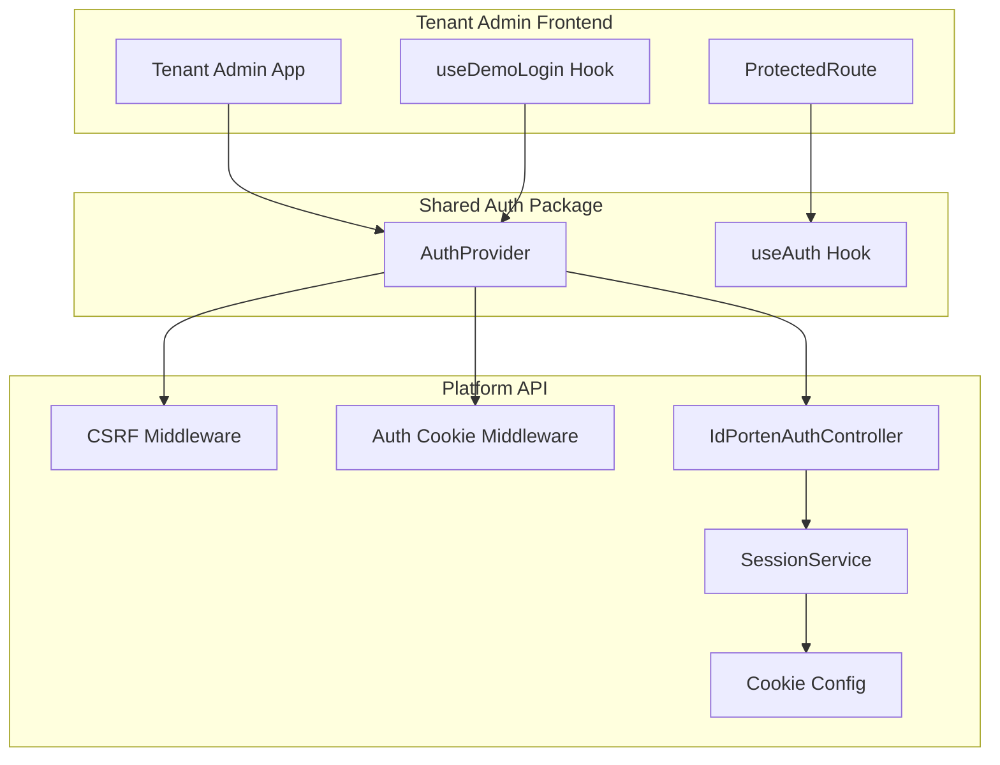
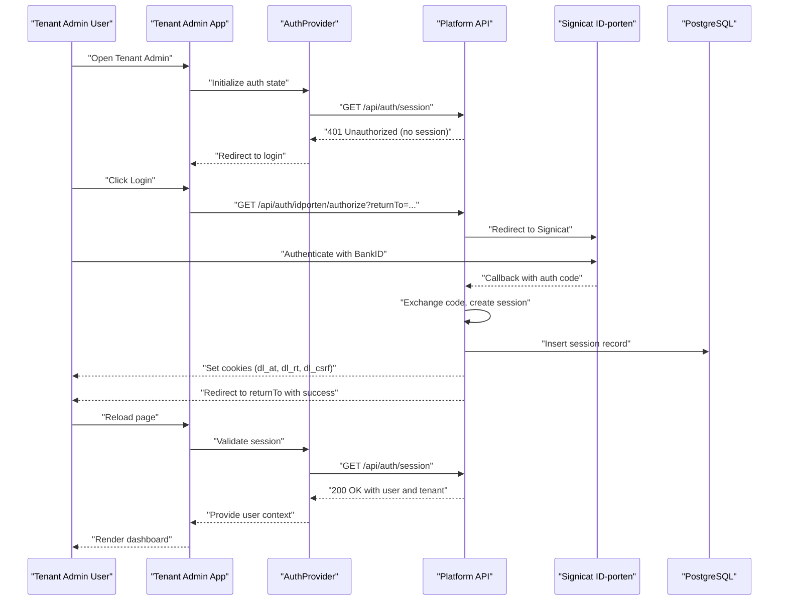
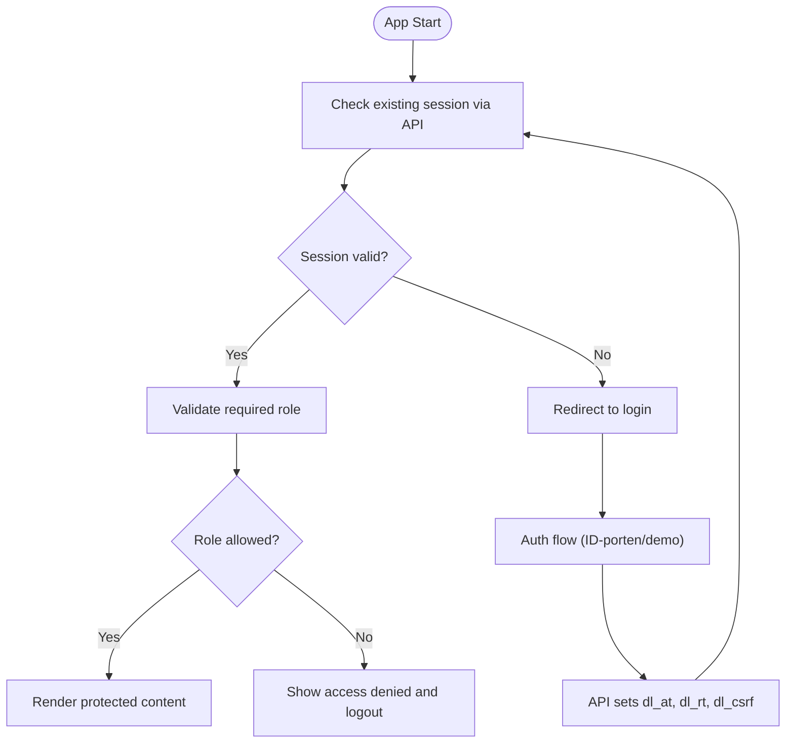
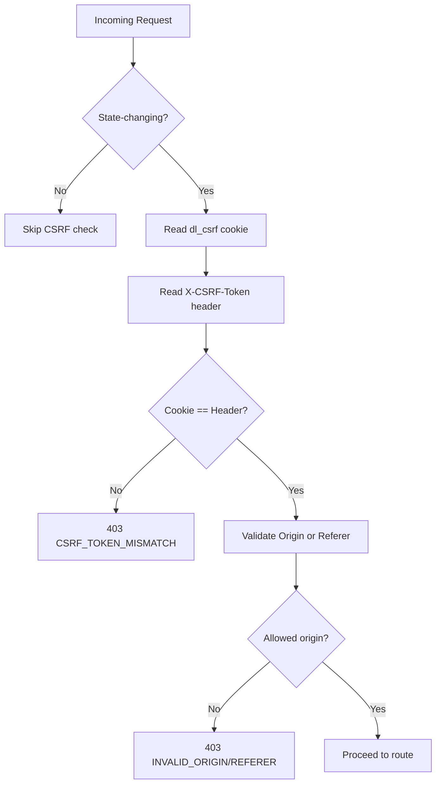
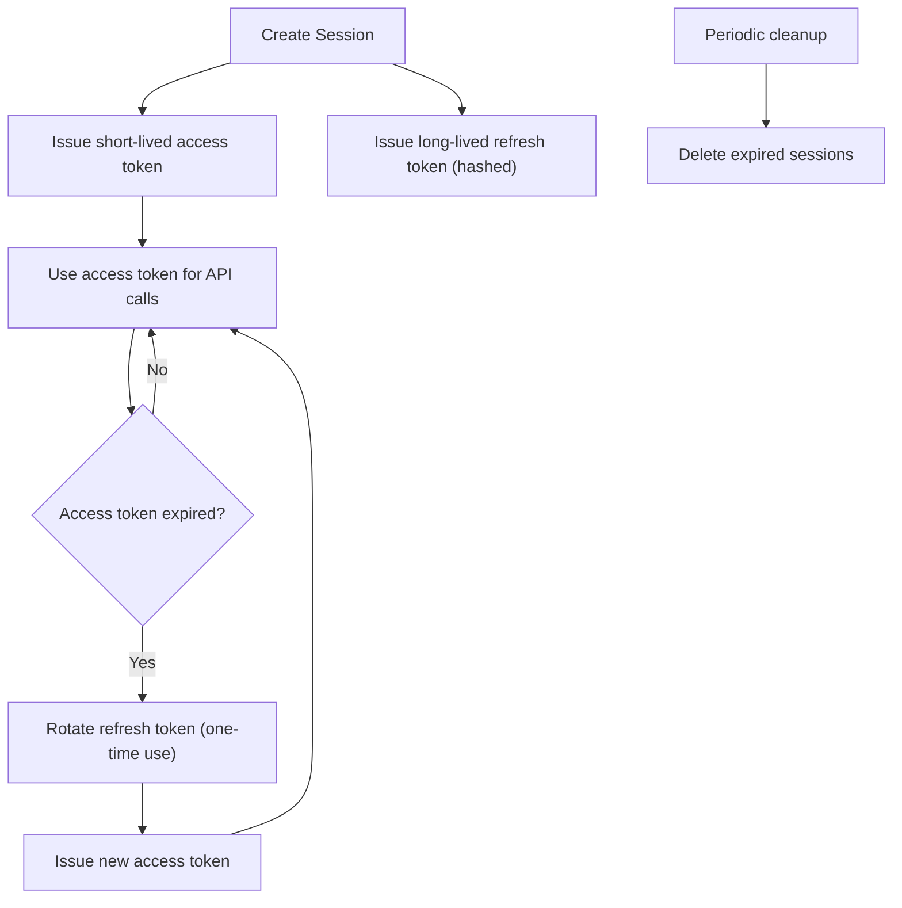
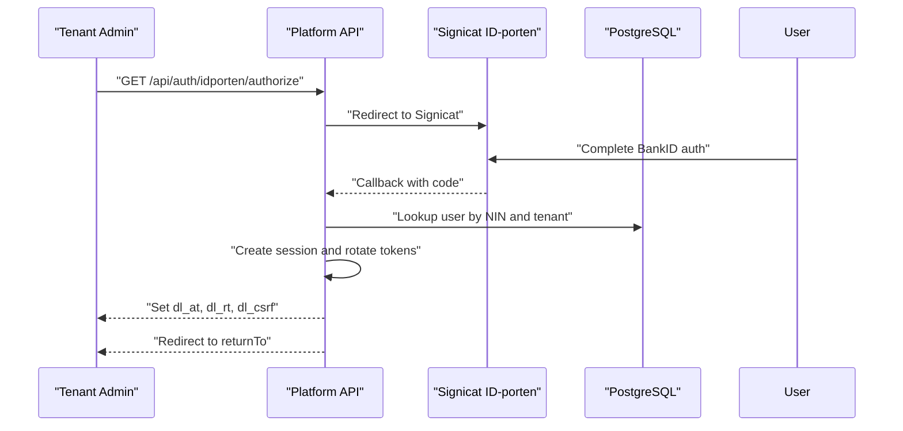
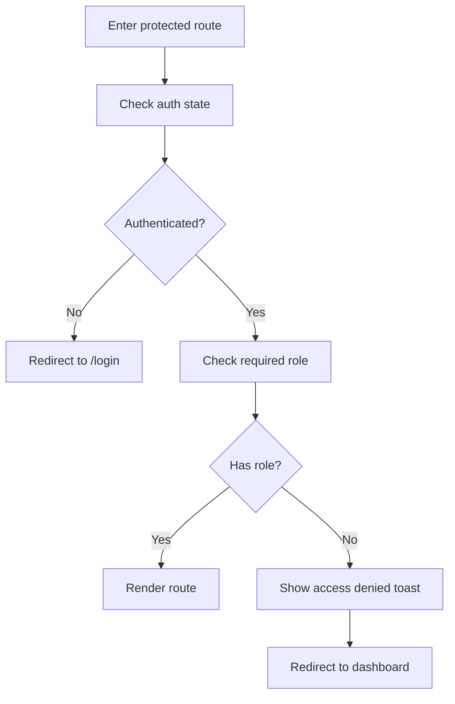
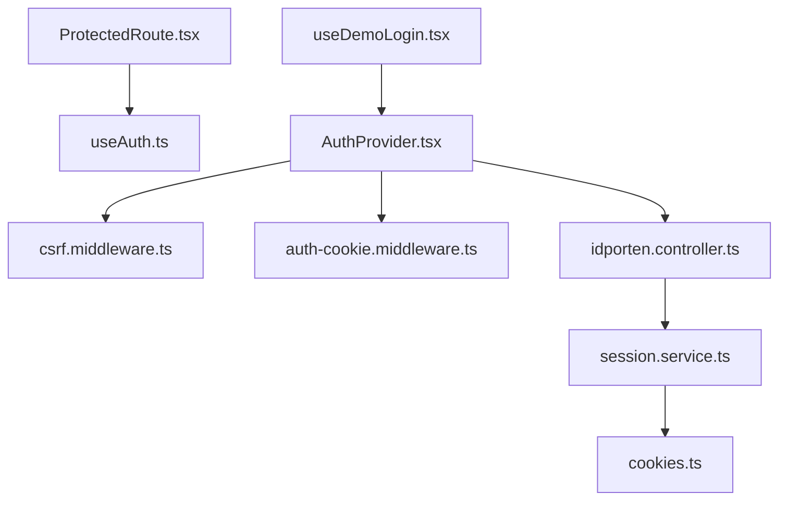

# Authentication & Security

<cite>
**Referenced Files in This Document**
- [AUTHENTICATION_SYSTEM.md](file://docs/architecture/AUTHENTICATION_SYSTEM.md)
- [SIGNICAT_BANKID_AUTHENTICATION.md](file://docs/guides/SIGNICAT_BANKID_AUTHENTICATION.md)
- [useDemoLogin.tsx](file://apps/tenant-admin/src/hooks/useDemoLogin.tsx)
- [ProtectedRoute.tsx](file://apps/tenant-admin/src/components/ProtectedRoute.tsx)
- [csrf.middleware.ts](file://apps/api/src/middleware/csrf.middleware.ts)
- [auth-cookie.middleware.ts](file://apps/api/src/middleware/auth-cookie.middleware.ts)
- [idporten.controller.ts](file://apps/api/src/modules/auth/idporten.controller.ts)
- [session.service.ts](file://apps/api/src/modules/auth/session.service.ts)
- [cookies.ts](file://apps/api/src/config/cookies.ts)
- [AuthProvider.tsx](file://packages/auth/src/providers/AuthProvider.tsx)
- [useAuth.ts](file://packages/auth/src/hooks/useAuth.ts)
</cite>

## Table of Contents
1. [Introduction](#introduction)
2. [Project Structure](#project-structure)
3. [Core Components](#core-components)
4. [Architecture Overview](#architecture-overview)
5. [Detailed Component Analysis](#detailed-component-analysis)
6. [Dependency Analysis](#dependency-analysis)
7. [Performance Considerations](#performance-considerations)
8. [Troubleshooting Guide](#troubleshooting-guide)
9. [Conclusion](#conclusion)

## Introduction
This document explains the authentication and security features of the Tenant Admin application within the Xala/Digilist platform. It covers login mechanisms, session management, security headers, integration with platform authentication providers (notably Signicat BankID/ID-porten), and tenant administrator access controls. It also documents CSRF protection, secure cookie handling, session timeout management, and the demo login functionality for testing and development.

## Project Structure
The Tenant Admin application integrates with a centralized authentication package and shares the platform’s authentication infrastructure:
- Tenant Admin frontend uses a shared authentication provider that coordinates with the platform’s API.
- The API enforces HTTP-only cookie-based authentication, CSRF protection, and session lifecycle management.
- Authentication providers (e.g., Signicat BankID/ID-porten) are integrated via dedicated controllers and middleware.



**Diagram sources**
- [AuthProvider.tsx](file://packages/auth/src/providers/AuthProvider.tsx#L131-L591)
- [useAuth.ts](file://packages/auth/src/hooks/useAuth.ts#L12-L20)
- [csrf.middleware.ts](file://apps/api/src/middleware/csrf.middleware.ts#L53-L177)
- [auth-cookie.middleware.ts](file://apps/api/src/middleware/auth-cookie.middleware.ts#L32-L134)
- [idporten.controller.ts](file://apps/api/src/modules/auth/idporten.controller.ts#L196-L789)
- [session.service.ts](file://apps/api/src/modules/auth/session.service.ts#L56-L323)
- [cookies.ts](file://apps/api/src/config/cookies.ts#L12-L77)

**Section sources**
- [AuthProvider.tsx](file://packages/auth/src/providers/AuthProvider.tsx#L131-L591)
- [useAuth.ts](file://packages/auth/src/hooks/useAuth.ts#L12-L20)
- [csrf.middleware.ts](file://apps/api/src/middleware/csrf.middleware.ts#L53-L177)
- [auth-cookie.middleware.ts](file://apps/api/src/middleware/auth-cookie.middleware.ts#L32-L134)
- [idporten.controller.ts](file://apps/api/src/modules/auth/idporten.controller.ts#L196-L789)
- [session.service.ts](file://apps/api/src/modules/auth/session.service.ts#L56-L323)
- [cookies.ts](file://apps/api/src/config/cookies.ts#L12-L77)

## Core Components
- Tenant Admin Protected Routes: Enforce authentication and role-based access control for tenant administrators.
- Demo Login Hook: Provides a controlled demo login mechanism for testing and development.
- Shared Auth Provider: Centralized authentication state, session validation, and role checks across applications.
- CSRF Middleware: Enforces double-submit cookie pattern and validates origin/referer for state-changing operations.
- Auth Cookie Middleware: Extracts JWT from HTTP-only cookies or Authorization headers, supporting dual-mode for backwards compatibility.
- IdPortenAuthController: Orchestrates Signicat BankID/ID-porten authentication flow, including session creation and cookie setting.
- SessionService: Manages session lifecycle, refresh token rotation, and database-backed session storage.
- Cookie Configuration: Defines secure cookie policies for access, refresh, and CSRF tokens.

**Section sources**
- [ProtectedRoute.tsx](file://apps/tenant-admin/src/components/ProtectedRoute.tsx#L23-L74)
- [useDemoLogin.tsx](file://apps/tenant-admin/src/hooks/useDemoLogin.tsx#L12-L73)
- [AuthProvider.tsx](file://packages/auth/src/providers/AuthProvider.tsx#L131-L591)
- [csrf.middleware.ts](file://apps/api/src/middleware/csrf.middleware.ts#L53-L177)
- [auth-cookie.middleware.ts](file://apps/api/src/middleware/auth-cookie.middleware.ts#L32-L134)
- [idporten.controller.ts](file://apps/api/src/modules/auth/idporten.controller.ts#L196-L789)
- [session.service.ts](file://apps/api/src/modules/auth/session.service.ts#L56-L323)
- [cookies.ts](file://apps/api/src/config/cookies.ts#L12-L77)

## Architecture Overview
The Tenant Admin application participates in a unified authentication system:
- Cross-subdomain SSO via HTTP-only cookies set with a shared domain.
- Multi-method authentication with Signicat BankID/ID-porten as primary and demo login for development/testing.
- Strict CSRF protection using double-submit cookies and origin validation.
- Database-backed sessions with refresh token rotation and automatic cleanup.
- Tenant isolation enforced at database level with tenant-aware user and session records.



**Diagram sources**
- [AuthProvider.tsx](file://packages/auth/src/providers/AuthProvider.tsx#L240-L437)
- [idporten.controller.ts](file://apps/api/src/modules/auth/idporten.controller.ts#L206-L708)
- [session.service.ts](file://apps/api/src/modules/auth/session.service.ts#L87-L131)
- [cookies.ts](file://apps/api/src/config/cookies.ts#L12-L77)

**Section sources**
- [AuthProvider.tsx](file://packages/auth/src/providers/AuthProvider.tsx#L240-L437)
- [idporten.controller.ts](file://apps/api/src/modules/auth/idporten.controller.ts#L206-L708)
- [session.service.ts](file://apps/api/src/modules/auth/session.service.ts#L87-L131)
- [cookies.ts](file://apps/api/src/config/cookies.ts#L12-L77)

## Detailed Component Analysis

### Tenant Admin Authentication Flow
- Initialization: The AuthProvider checks for an existing session via the API and validates the HTTP-only cookie-based session.
- Role-based Access: ProtectedRoute enforces that only users with required roles (including tenant_admin/admin) can access routes.
- Demo Login: The useDemoLogin hook enables testing with a demo token, storing minimal user data locally and navigating to the dashboard.



**Diagram sources**
- [AuthProvider.tsx](file://packages/auth/src/providers/AuthProvider.tsx#L363-L428)
- [ProtectedRoute.tsx](file://apps/tenant-admin/src/components/ProtectedRoute.tsx#L23-L74)
- [useDemoLogin.tsx](file://apps/tenant-admin/src/hooks/useDemoLogin.tsx#L34-L65)

**Section sources**
- [AuthProvider.tsx](file://packages/auth/src/providers/AuthProvider.tsx#L363-L428)
- [ProtectedRoute.tsx](file://apps/tenant-admin/src/components/ProtectedRoute.tsx#L23-L74)
- [useDemoLogin.tsx](file://apps/tenant-admin/src/hooks/useDemoLogin.tsx#L34-L65)

### CSRF Protection Implementation
- Double-submit Pattern: CSRF cookie (dl_csrf) must match the X-CSRF-Token header for state-changing operations.
- Origin Validation: Requests must originate from allowed domains; fallback to Referer header when Origin is absent.
- Endpoint Exceptions: CSRF checks are skipped for specific login and refresh endpoints to maintain usability.



**Diagram sources**
- [csrf.middleware.ts](file://apps/api/src/middleware/csrf.middleware.ts#L53-L177)

**Section sources**
- [csrf.middleware.ts](file://apps/api/src/middleware/csrf.middleware.ts#L53-L177)

### Secure Cookie Handling
- Three-Cookie System:
  - dl_at: Short-lived access token (HTTP-only).
  - dl_rt: Long-lived refresh token (HTTP-only, path-scoped).
  - dl_csrf: CSRF token (readable by JS).
- Cookie Options:
  - HttpOnly for tokens, Secure in production, SameSite lax, cross-subdomain domain in production, appropriate paths.

```mermaid
classDiagram
class CookieConfig {
+ACCESS : {name, maxAge, path}
+REFRESH : {name, maxAge, path}
+CSRF : {name, maxAge, path}
+getCookieOptions(type, isProduction)
}
class IdPortenAuthController {
+authorize()
+callback()
+getSession()
+config()
}
class SessionService {
+createSession()
+rotateRefreshToken()
+revokeSession()
+cleanupExpiredSessions()
}
IdPortenAuthController --> SessionService : "creates session"
SessionService --> CookieConfig : "uses cookie options"
```

**Diagram sources**
- [cookies.ts](file://apps/api/src/config/cookies.ts#L12-L77)
- [idporten.controller.ts](file://apps/api/src/modules/auth/idporten.controller.ts#L639-L671)
- [session.service.ts](file://apps/api/src/modules/auth/session.service.ts#L87-L131)

**Section sources**
- [cookies.ts](file://apps/api/src/config/cookies.ts#L12-L77)
- [idporten.controller.ts](file://apps/api/src/modules/auth/idporten.controller.ts#L639-L671)
- [session.service.ts](file://apps/api/src/modules/auth/session.service.ts#L87-L131)

### Session Management and Timeout
- Access Token Expiration: 15 minutes; refresh token rotation ensures continuous access.
- Refresh Token Rotation: One-time use pattern invalidates the old refresh token upon use.
- Session Cleanup: Periodic cleanup removes expired sessions from the database.
- Token Auto-Refresh: The AuthProvider schedules token refresh before expiry to maintain seamless UX.



**Diagram sources**
- [session.service.ts](file://apps/api/src/modules/auth/session.service.ts#L87-L198)
- [AuthProvider.tsx](file://packages/auth/src/providers/AuthProvider.tsx#L194-L224)

**Section sources**
- [session.service.ts](file://apps/api/src/modules/auth/session.service.ts#L87-L198)
- [AuthProvider.tsx](file://packages/auth/src/providers/AuthProvider.tsx#L194-L224)

### Integration with Platform Authentication Providers
- Signicat BankID/ID-porten:
  - REST API controller manages OAuth client credentials, session creation, and callback handling.
  - Cookies are set with domain and path configurations enabling cross-subdomain SSO.
- Demo Login:
  - Tenant Admin uses a dedicated demo login hook that calls the platform’s demo token endpoint and navigates to the dashboard.



**Diagram sources**
- [idporten.controller.ts](file://apps/api/src/modules/auth/idporten.controller.ts#L206-L708)
- [session.service.ts](file://apps/api/src/modules/auth/session.service.ts#L87-L131)
- [cookies.ts](file://apps/api/src/config/cookies.ts#L12-L77)

**Section sources**
- [idporten.controller.ts](file://apps/api/src/modules/auth/idporten.controller.ts#L206-L708)
- [session.service.ts](file://apps/api/src/modules/auth/session.service.ts#L87-L131)
- [cookies.ts](file://apps/api/src/config/cookies.ts#L12-L77)

### Tenant Administrator Access Controls
- ProtectedRoute enforces role-based access for Tenant Admin routes.
- AuthProvider performs role checks and denies access with logout when roles are insufficient.
- Demo login stores minimal user data locally for convenience in development.



**Diagram sources**
- [ProtectedRoute.tsx](file://apps/tenant-admin/src/components/ProtectedRoute.tsx#L23-L74)
- [AuthProvider.tsx](file://packages/auth/src/providers/AuthProvider.tsx#L380-L400)

**Section sources**
- [ProtectedRoute.tsx](file://apps/tenant-admin/src/components/ProtectedRoute.tsx#L23-L74)
- [AuthProvider.tsx](file://packages/auth/src/providers/AuthProvider.tsx#L380-L400)
- [useDemoLogin.tsx](file://apps/tenant-admin/src/hooks/useDemoLogin.tsx#L34-L65)

## Dependency Analysis
The Tenant Admin authentication stack depends on:
- Shared Auth Provider for centralized auth state and role checks.
- API middleware for CSRF protection and cookie extraction.
- IdPortenAuthController for provider integration and session creation.
- SessionService for database-backed session lifecycle management.
- Cookie configuration for secure cookie policy enforcement.



**Diagram sources**
- [ProtectedRoute.tsx](file://apps/tenant-admin/src/components/ProtectedRoute.tsx#L23-L74)
- [useDemoLogin.tsx](file://apps/tenant-admin/src/hooks/useDemoLogin.tsx#L12-L73)
- [useAuth.ts](file://packages/auth/src/hooks/useAuth.ts#L12-L20)
- [AuthProvider.tsx](file://packages/auth/src/providers/AuthProvider.tsx#L131-L591)
- [csrf.middleware.ts](file://apps/api/src/middleware/csrf.middleware.ts#L53-L177)
- [auth-cookie.middleware.ts](file://apps/api/src/middleware/auth-cookie.middleware.ts#L32-L134)
- [idporten.controller.ts](file://apps/api/src/modules/auth/idporten.controller.ts#L196-L789)
- [session.service.ts](file://apps/api/src/modules/auth/session.service.ts#L56-L323)
- [cookies.ts](file://apps/api/src/config/cookies.ts#L12-L77)

**Section sources**
- [ProtectedRoute.tsx](file://apps/tenant-admin/src/components/ProtectedRoute.tsx#L23-L74)
- [useDemoLogin.tsx](file://apps/tenant-admin/src/hooks/useDemoLogin.tsx#L12-L73)
- [useAuth.ts](file://packages/auth/src/hooks/useAuth.ts#L12-L20)
- [AuthProvider.tsx](file://packages/auth/src/providers/AuthProvider.tsx#L131-L591)
- [csrf.middleware.ts](file://apps/api/src/middleware/csrf.middleware.ts#L53-L177)
- [auth-cookie.middleware.ts](file://apps/api/src/middleware/auth-cookie.middleware.ts#L32-L134)
- [idporten.controller.ts](file://apps/api/src/modules/auth/idporten.controller.ts#L196-L789)
- [session.service.ts](file://apps/api/src/modules/auth/session.service.ts#L56-L323)
- [cookies.ts](file://apps/api/src/config/cookies.ts#L12-L77)

## Performance Considerations
- Token Rotation Overhead: Refresh token rotation introduces database writes; ensure adequate indexing on sessions table for performance.
- Session Validation: Frequent session checks (e.g., visibility change) should be rate-limited to avoid unnecessary API calls.
- Cookie Domain Scope: Cross-subdomain cookies reduce redundant authentication prompts but require careful domain configuration.

## Troubleshooting Guide
Common issues and resolutions:
- Redirects back to login after authentication:
  - Verify cookies are set with the correct domain (.digilist.no) and paths.
  - Confirm database schemas exist and tables are in the correct schema.
  - Check API logs for errors and restart the API server if needed.
- PostgresError: relation 'platform.users' does not exist:
  - Move tables to the correct schemas (platform, domain, compliance).
- Demo login fails with "Ugyldig demo-token":
  - Ensure demo users exist in the database and run the seed if necessary.
- CORS errors on API requests:
  - Verify frontend domains are included in CORS_ORIGIN environment variable.
- Cookies not being sent on requests:
  - Ensure fetch requests include credentials: 'include'.

**Section sources**
- [AUTHENTICATION_SYSTEM.md](file://docs/architecture/AUTHENTICATION_SYSTEM.md#L667-L767)
- [SIGNICAT_BANKID_AUTHENTICATION.md](file://docs/guides/SIGNICAT_BANKID_AUTHENTICATION.md#L359-L464)

## Conclusion
The Tenant Admin application leverages a robust, unified authentication system that prioritizes security through HTTP-only cookies, CSRF protection, and database-backed sessions. Tenant administrators benefit from seamless cross-subdomain SSO, strict role-based access control, and reliable session management. The demo login functionality supports efficient development and testing while maintaining security standards.