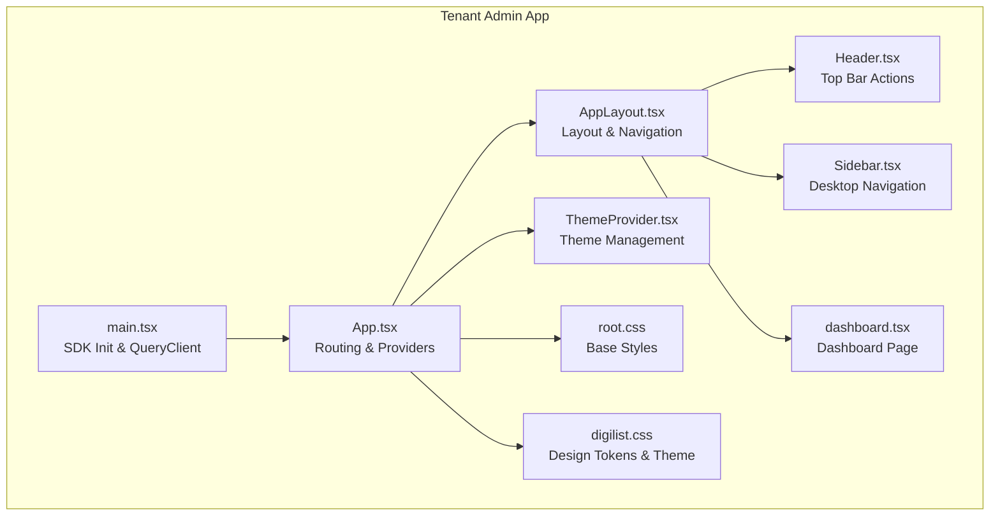
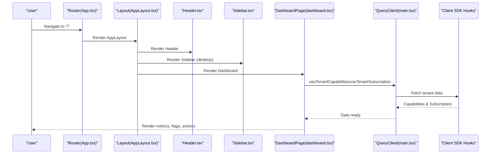
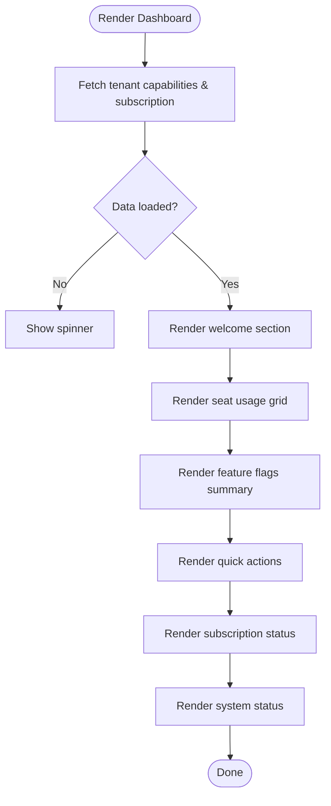
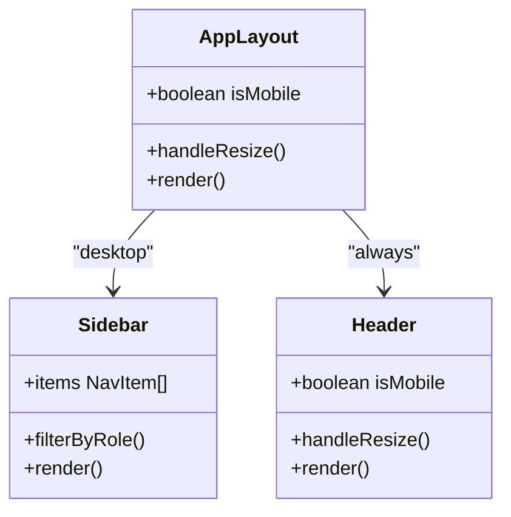
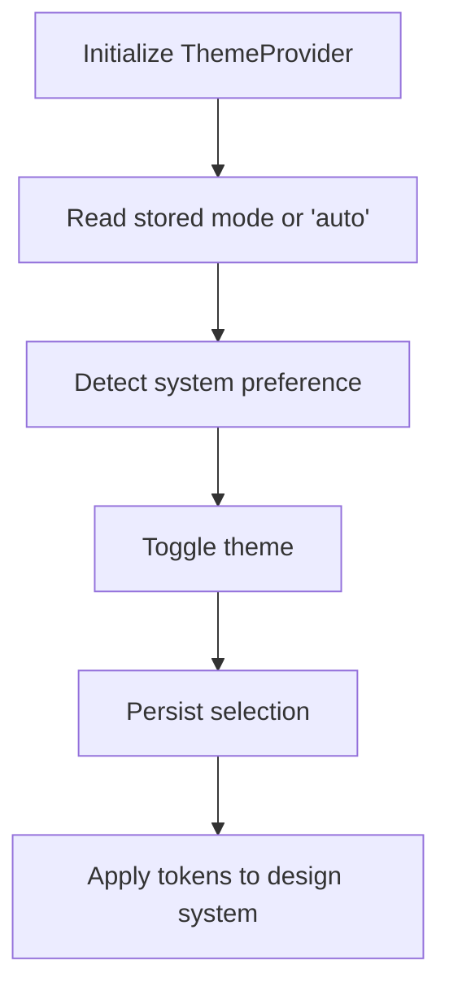
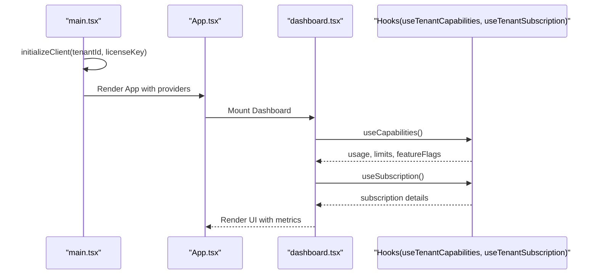
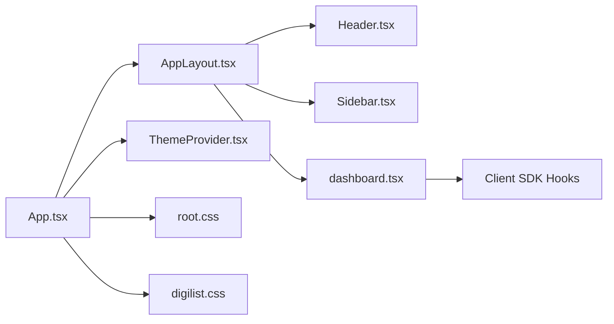

# Dashboard & Analytics

<cite>
**Referenced Files in This Document**
- [App.tsx](file://apps/tenant-admin/src/App.tsx)
- [main.tsx](file://apps/tenant-admin/src/main.tsx)
- [dashboard.tsx](file://apps/tenant-admin/src/routes/dashboard.tsx)
- [AppLayout.tsx](file://apps/tenant-admin/src/components/layout/AppLayout.tsx)
- [Header.tsx](file://apps/tenant-admin/src/components/layout/Header.tsx)
- [Sidebar.tsx](file://apps/tenant-admin/src/components/layout/Sidebar.tsx)
- [ThemeProvider.tsx](file://apps/tenant-admin/src/providers/ThemeProvider.tsx)
- [root.css](file://apps/tenant-admin/src/root.css)
- [digilist.css](file://apps/tenant-admin/public/themes/digilist.css)
</cite>

## Table of Contents
1. [Introduction](#introduction)
2. [Project Structure](#project-structure)
3. [Core Components](#core-components)
4. [Architecture Overview](#architecture-overview)
5. [Detailed Component Analysis](#detailed-component-analysis)
6. [Dependency Analysis](#dependency-analysis)
7. [Performance Considerations](#performance-considerations)
8. [Troubleshooting Guide](#troubleshooting-guide)
9. [Conclusion](#conclusion)

## Introduction
The Tenant Admin Dashboard provides tenant administrators with a centralized overview of their tenant’s operational health and configuration. It aggregates key metrics such as seat usage across users, organizations, listings, and monthly bookings, presents feature flags status, offers quick actions tailored to roles, and displays subscription and system status. The dashboard is built with a responsive layout, integrates with tenant-specific data sources via the client SDK, and adheres to the Digilist design system and theme tokens.

## Project Structure
The Tenant Admin application is organized around a React-based SPA with routing, layout components, and providers for theme, i18n, auth, and error handling. The dashboard page is the primary route under the protected layout and consumes tenant capabilities and subscription data.

**Diagram sources**
- [App.tsx](file://apps/tenant-admin/src/App.tsx#L26-L65)
- [main.tsx](file://apps/tenant-admin/src/main.tsx#L10-L32)
- [AppLayout.tsx](file://apps/tenant-admin/src/components/layout/AppLayout.tsx#L30-L118)
- [Header.tsx](file://apps/tenant-admin/src/components/layout/Header.tsx#L32-L226)
- [Sidebar.tsx](file://apps/tenant-admin/src/components/layout/Sidebar.tsx#L79-L244)
- [dashboard.tsx](file://apps/tenant-admin/src/routes/dashboard.tsx#L62-L432)
- [ThemeProvider.tsx](file://apps/tenant-admin/src/providers/ThemeProvider.tsx#L45-L121)
- [root.css](file://apps/tenant-admin/src/root.css#L1-L27)
- [digilist.css](file://apps/tenant-admin/public/themes/digilist.css#L1-L1156)

**Section sources**
- [App.tsx](file://apps/tenant-admin/src/App.tsx#L26-L65)
- [main.tsx](file://apps/tenant-admin/src/main.tsx#L10-L32)

## Core Components
- Dashboard page: Aggregates and renders seat usage, feature flags, quick actions, subscription status, and system status. It uses tenant capabilities and subscription hooks to fetch data and applies role-aware rendering.
- Layout: Provides a responsive structure with a desktop sidebar and a mobile-friendly bottom navigation bar.
- Header: Hosts theme toggle, notifications, settings, and logout actions, adapting to mobile and desktop contexts.
- Theme provider: Manages light/dark/auto color schemes with system preference detection and persistence.
- Root and theme CSS: Establish base styles and apply Digilist design tokens and semantic variables.

**Section sources**
- [dashboard.tsx](file://apps/tenant-admin/src/routes/dashboard.tsx#L62-L432)
- [AppLayout.tsx](file://apps/tenant-admin/src/components/layout/AppLayout.tsx#L30-L118)
- [Header.tsx](file://apps/tenant-admin/src/components/layout/Header.tsx#L32-L226)
- [ThemeProvider.tsx](file://apps/tenant-admin/src/providers/ThemeProvider.tsx#L45-L121)
- [root.css](file://apps/tenant-admin/src/root.css#L1-L27)
- [digilist.css](file://apps/tenant-admin/public/themes/digilist.css#L1-L1156)

## Architecture Overview
The dashboard orchestrates data retrieval, role-aware UI, and responsive layout. It initializes the client SDK with tenant context, sets up a global query cache, and renders the layout with protected routes. The dashboard composes reusable UI elements from the design system and local components.

**Diagram sources**
- [App.tsx](file://apps/tenant-admin/src/App.tsx#L38-L59)
- [AppLayout.tsx](file://apps/tenant-admin/src/components/layout/AppLayout.tsx#L86-L117)
- [Header.tsx](file://apps/tenant-admin/src/components/layout/Header.tsx#L67-L224)
- [Sidebar.tsx](file://apps/tenant-admin/src/components/layout/Sidebar.tsx#L79-L244)
- [dashboard.tsx](file://apps/tenant-admin/src/routes/dashboard.tsx#L62-L80)
- [main.tsx](file://apps/tenant-admin/src/main.tsx#L17-L24)

## Detailed Component Analysis

### Dashboard Page
The dashboard consolidates:
- Welcome section with user greeting, tenant badge, and role-specific subtitle.
- Seat usage cards for users, organizations, listings, and bookings per month, with color-coded thresholds.
- Feature flags summary with enabled/disabled counts and truncated badges.
- Quick action buttons for branding, subscription, users, and settings, gated by roles.
- Subscription status card with plan name, status indicator, and period end date.
- System status card indicating service availability and last updated time.

**Diagram sources**
- [dashboard.tsx](file://apps/tenant-admin/src/routes/dashboard.tsx#L62-L432)

**Section sources**
- [dashboard.tsx](file://apps/tenant-admin/src/routes/dashboard.tsx#L62-L432)

### Layout and Navigation
- Responsive layout switches between desktop and mobile views based on viewport width.
- Desktop: Sidebar with role-filtered navigation items and a user info footer.
- Mobile: Bottom navigation with essential routes and a fixed bottom bar.
- Header adapts actions and menu based on device size.

**Diagram sources**
- [AppLayout.tsx](file://apps/tenant-admin/src/components/layout/AppLayout.tsx#L30-L118)
- [Sidebar.tsx](file://apps/tenant-admin/src/components/layout/Sidebar.tsx#L79-L244)
- [Header.tsx](file://apps/tenant-admin/src/components/layout/Header.tsx#L32-L226)

**Section sources**
- [AppLayout.tsx](file://apps/tenant-admin/src/components/layout/AppLayout.tsx#L30-L118)
- [Sidebar.tsx](file://apps/tenant-admin/src/components/layout/Sidebar.tsx#L79-L244)
- [Header.tsx](file://apps/tenant-admin/src/components/layout/Header.tsx#L32-L226)

### Theme Integration
- ThemeProvider manages color scheme modes (light, dark, auto) and persists user choice.
- Auto mode follows system preference via media query listener.
- The design system provider applies theme tokens and typography scales.

**Diagram sources**
- [ThemeProvider.tsx](file://apps/tenant-admin/src/providers/ThemeProvider.tsx#L45-L121)
- [digilist.css](file://apps/tenant-admin/public/themes/digilist.css#L1-L1156)

**Section sources**
- [ThemeProvider.tsx](file://apps/tenant-admin/src/providers/ThemeProvider.tsx#L45-L121)
- [digilist.css](file://apps/tenant-admin/public/themes/digilist.css#L1-L1156)

### Data Sources and Rendering
- SDK initialization configures tenant context and caching defaults.
- Dashboard uses tenant capabilities and subscription hooks to populate metrics and flags.
- UI components leverage design system tokens for consistent spacing, typography, and colors.

**Diagram sources**
- [main.tsx](file://apps/tenant-admin/src/main.tsx#L10-L15)
- [App.tsx](file://apps/tenant-admin/src/App.tsx#L38-L59)
- [dashboard.tsx](file://apps/tenant-admin/src/routes/dashboard.tsx#L68-L80)

**Section sources**
- [main.tsx](file://apps/tenant-admin/src/main.tsx#L10-L32)
- [dashboard.tsx](file://apps/tenant-admin/src/routes/dashboard.tsx#L68-L80)

## Dependency Analysis
- Routing and providers: App.tsx wires i18n, design system, error boundary, toast provider, auth provider, and protected layout.
- Layout and navigation: AppLayout composes Header and Sidebar; Sidebar filters items by role; Header handles actions and responsive behavior.
- Dashboard: Consumes SDK hooks and renders metrics and controls.
- Theme: ThemeProvider integrates with the design system’s color scheme and size modes.

**Diagram sources**
- [App.tsx](file://apps/tenant-admin/src/App.tsx#L26-L65)
- [AppLayout.tsx](file://apps/tenant-admin/src/components/layout/AppLayout.tsx#L30-L118)
- [Header.tsx](file://apps/tenant-admin/src/components/layout/Header.tsx#L32-L226)
- [Sidebar.tsx](file://apps/tenant-admin/src/components/layout/Sidebar.tsx#L79-L244)
- [dashboard.tsx](file://apps/tenant-admin/src/routes/dashboard.tsx#L62-L432)
- [ThemeProvider.tsx](file://apps/tenant-admin/src/providers/ThemeProvider.tsx#L45-L121)
- [root.css](file://apps/tenant-admin/src/root.css#L1-L27)
- [digilist.css](file://apps/tenant-admin/public/themes/digilist.css#L1-L1156)

**Section sources**
- [App.tsx](file://apps/tenant-admin/src/App.tsx#L26-L65)
- [dashboard.tsx](file://apps/tenant-admin/src/routes/dashboard.tsx#L62-L432)

## Performance Considerations
- Caching: Queries are configured with a five-minute stale time and single retry to balance freshness and network efficiency.
- Loading states: The dashboard displays a spinner while data is being fetched to avoid blank UI.
- Responsive rendering: Mobile layout minimizes DOM and uses a compact bottom navigation to reduce render cost on smaller screens.
- Theme switching: Persisted preferences prevent unnecessary reflows by avoiding repeated theme recalculations.

[No sources needed since this section provides general guidance]

## Troubleshooting Guide
- Blank dashboard: Verify SDK initialization and environment variables for tenant ID and license key.
- Missing metrics: Confirm that tenant capabilities and subscription endpoints are reachable and returning data.
- Navigation issues: Ensure ProtectedRoute wraps the layout and that role checks align with backend entitlements.
- Theme not applying: Check ThemeProvider persistence and media query listeners; confirm design system provider receives the correct color scheme.

**Section sources**
- [main.tsx](file://apps/tenant-admin/src/main.tsx#L10-L15)
- [App.tsx](file://apps/tenant-admin/src/App.tsx#L38-L59)
- [ThemeProvider.tsx](file://apps/tenant-admin/src/providers/ThemeProvider.tsx#L45-L121)

## Conclusion
The Tenant Admin Dashboard delivers a role-aware, responsive, and theme-consistent overview of tenant metrics and configuration. Its modular architecture, reliance on tenant-specific SDK hooks, and adherence to the Digilist design system enable administrators to monitor usage, manage features, and take targeted actions efficiently across devices.