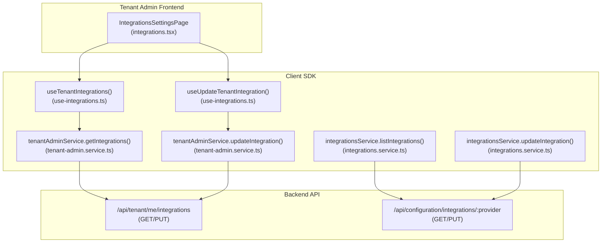
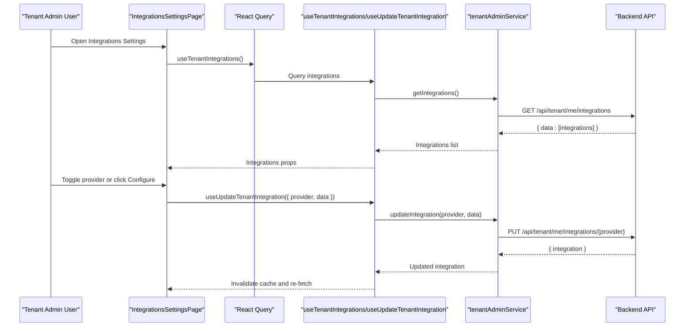
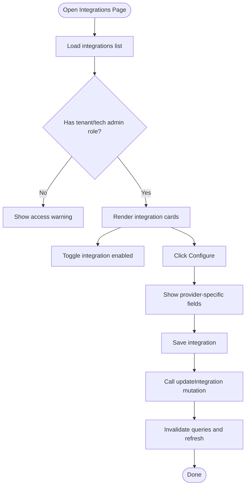
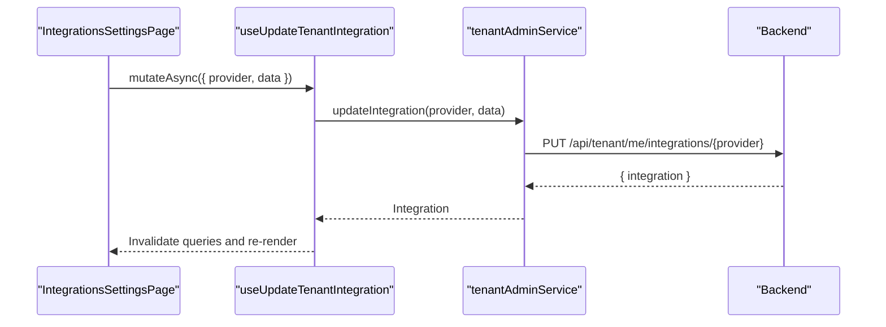
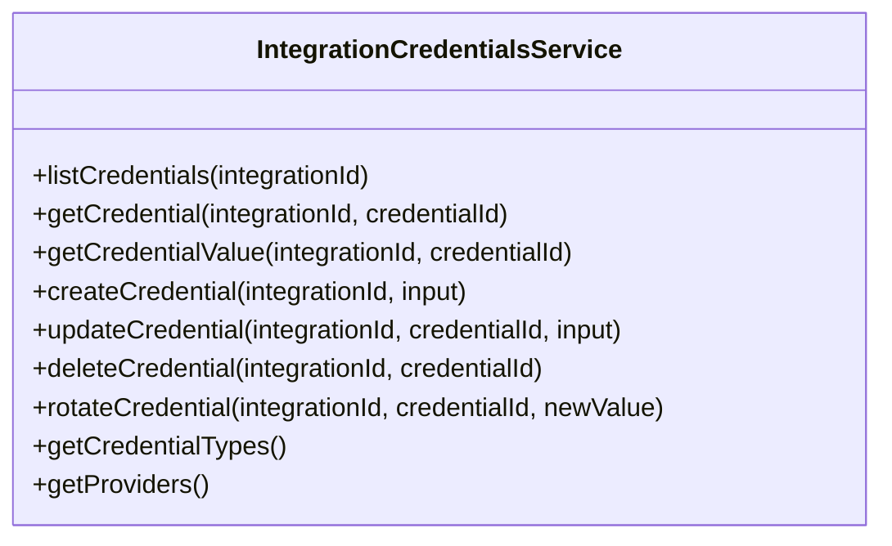
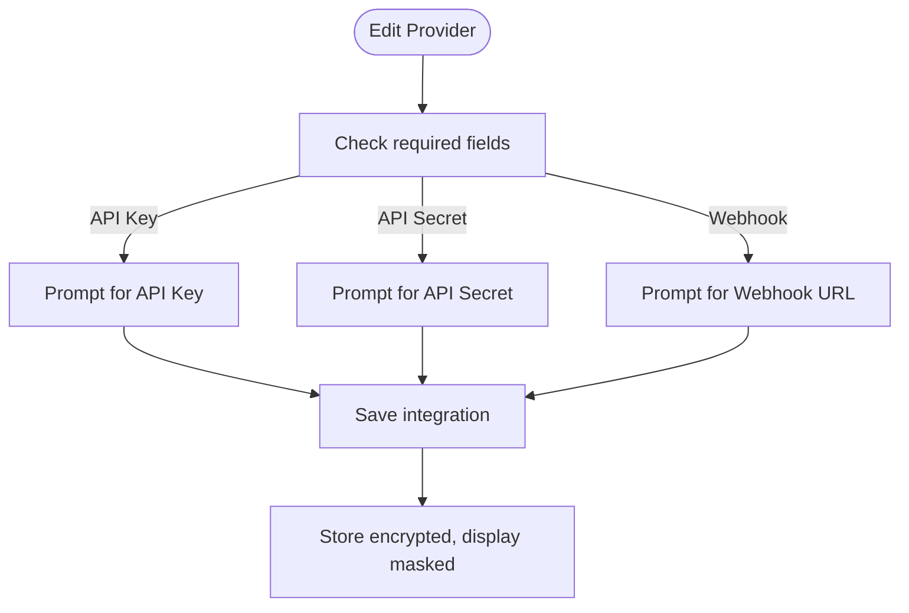
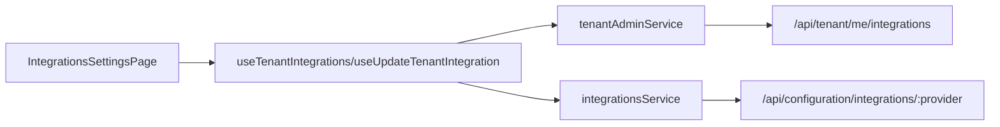

# Integration Management

<cite>
**Referenced Files in This Document**
- [integrations.tsx](file://apps/tenant-admin/src/routes/settings/integrations.tsx)
- [use-integrations.ts](file://packages/client-sdk/src/hooks/use-integrations.ts)
- [integrations.service.ts](file://packages/client-sdk/src/services/integrations.service.ts)
- [tenant-admin.service.ts](file://packages/client-sdk/src/services/tenant-admin.service.ts)
- [tenant-admin.ts](file://packages/client-sdk/src/types/tenant-admin.ts)
- [integration-credentials.service.ts](file://packages/client-sdk/src/services/integration-credentials.service.ts)
</cite>

## Table of Contents
1. [Introduction](#introduction)
2. [Project Structure](#project-structure)
3. [Core Components](#core-components)
4. [Architecture Overview](#architecture-overview)
5. [Detailed Component Analysis](#detailed-component-analysis)
6. [Dependency Analysis](#dependency-analysis)
7. [Performance Considerations](#performance-considerations)
8. [Troubleshooting Guide](#troubleshooting-guide)
9. [Conclusion](#conclusion)

## Introduction
This document describes the Integration Management functionality within the Tenant Admin application. It explains how tenant administrators connect and manage third-party services, configure API credentials, monitor integration status, and troubleshoot issues. It covers supported integration types, credential management workflows, connection testing, security considerations, and audit trail practices.

## Project Structure
Integration Management spans three layers:
- Frontend page: Tenant Admin settings page for integrations
- Client SDK: React Query hooks and services for integration configuration
- Backend APIs: Tenant Admin service for integrations and Integrations service for configuration

**Diagram sources**
- [integrations.tsx](file://apps/tenant-admin/src/routes/settings/integrations.tsx#L132-L660)
- [use-integrations.ts](file://packages/client-sdk/src/hooks/use-integrations.ts#L23-L70)
- [tenant-admin.service.ts](file://packages/client-sdk/src/services/tenant-admin.service.ts#L84-L99)
- [integrations.service.ts](file://packages/client-sdk/src/services/integrations.service.ts#L33-L82)

**Section sources**
- [integrations.tsx](file://apps/tenant-admin/src/routes/settings/integrations.tsx#L1-L660)
- [use-integrations.ts](file://packages/client-sdk/src/hooks/use-integrations.ts#L1-L369)
- [tenant-admin.service.ts](file://packages/client-sdk/src/services/tenant-admin.service.ts#L1-L104)
- [integrations.service.ts](file://packages/client-sdk/src/services/integrations.service.ts#L1-L86)

## Core Components
- Integrations Settings Page: Renders integration cards, toggles, credential forms, and status indicators.
- Tenant Integrations Hook: Fetches integrations list and updates integration configuration.
- Tenant Admin Service: Calls tenant-scoped integration endpoints.
- Integrations Service: Manages integration configurations at the platform configuration level.
- Integration Credentials Service: Handles encrypted credential lifecycle for integrations (super admin).

Supported integration providers include:
- Payment: Vipps
- Sync: Visma, RCO, ACOS
- Calendar: Outlook
- Notifications: SMTP, SMS

Each provider defines required fields (API key, API secret, webhook URL) and categorization.

**Section sources**
- [integrations.tsx](file://apps/tenant-admin/src/routes/settings/integrations.tsx#L40-L117)
- [tenant-admin.ts](file://packages/client-sdk/src/types/tenant-admin.ts#L102-L135)
- [integration-credentials.service.ts](file://packages/client-sdk/src/services/integration-credentials.service.ts#L28-L42)

## Architecture Overview
The integration management flow connects the UI to backend services via SDK hooks and services.

**Diagram sources**
- [integrations.tsx](file://apps/tenant-admin/src/routes/settings/integrations.tsx#L151-L251)
- [use-integrations.ts](file://packages/client-sdk/src/hooks/use-integrations.ts#L23-L70)
- [tenant-admin.service.ts](file://packages/client-sdk/src/services/tenant-admin.service.ts#L84-L99)

## Detailed Component Analysis

### Integrations Settings Page
Responsibilities:
- Render integration cards with status badges and category labels
- Allow enabling/disabling integrations
- Present masked API keys and last sync timestamps
- Provide credential input forms with show/hide toggles
- Group integrations by category and display documentation links

Key behaviors:
- Access control: Only tenant admins and tech admins can manage integrations.
- Loading and error states: Graceful UX during network requests.
- Conditional fields: Only required fields per provider are shown.
- Save workflow: Sends only provided fields (leave blank to keep existing).

**Diagram sources**
- [integrations.tsx](file://apps/tenant-admin/src/routes/settings/integrations.tsx#L132-L251)

**Section sources**
- [integrations.tsx](file://apps/tenant-admin/src/routes/settings/integrations.tsx#L132-L660)

### Tenant Integrations Hook and Service
- useTenantIntegrations(): Fetches tenant integrations list.
- useUpdateTenantIntegration(): Mutates integration configuration and invalidates caches.
- tenantAdminService.getIntegrations(): Calls GET /api/tenant/me/integrations.
- tenantAdminService.updateIntegration(): Calls PUT /api/tenant/me/integrations/{provider}.

**Diagram sources**
- [use-integrations.ts](file://packages/client-sdk/src/hooks/use-integrations.ts#L57-L70)
- [tenant-admin.service.ts](file://packages/client-sdk/src/services/tenant-admin.service.ts#L92-L99)

**Section sources**
- [use-integrations.ts](file://packages/client-sdk/src/hooks/use-integrations.ts#L23-L70)
- [tenant-admin.service.ts](file://packages/client-sdk/src/services/tenant-admin.service.ts#L84-L99)

### Integrations Service (Platform Configuration)
Manages integration configurations at the platform configuration endpoint:
- listIntegrations(): GET /api/configuration/integrations
- getIntegration(): GET /api/configuration/integrations/{provider}
- updateIntegration(): PUT /api/configuration/integrations/{provider}
- testIntegration(): POST /api/configuration/integrations/{provider}/test

Note: The Tenant Admin page primarily uses tenantAdminService for tenant-scoped integrations. The integrationsService supports broader configuration management.

**Section sources**
- [integrations.service.ts](file://packages/client-sdk/src/services/integrations.service.ts#L33-L82)

### Integration Credentials Service (Super Admin)
Handles encrypted credential lifecycle:
- List/get credentials for an integration
- Get decrypted credential value (logged for audit)
- Create/update/delete credentials
- Rotate credentials with a new value
- Enumerate credential types and providers

**Diagram sources**
- [integration-credentials.service.ts](file://packages/client-sdk/src/services/integration-credentials.service.ts#L89-L197)

**Section sources**
- [integration-credentials.service.ts](file://packages/client-sdk/src/services/integration-credentials.service.ts#L1-L201)

### Supported Integration Types and Required Fields
The UI defines provider configurations with required fields and categories:
- Vipps: payment, requires API key, API secret, webhook URL
- Visma: sync, requires API key
- RCO: sync, requires API key, API secret
- ACOS: sync, requires API key
- Outlook: calendar, no credentials required
- SMTP: notification, requires API key, API secret
- SMS: notification, requires API key

These definitions drive field visibility and save behavior.

**Section sources**
- [integrations.tsx](file://apps/tenant-admin/src/routes/settings/integrations.tsx#L40-L117)

### Credential Management Workflows
- Masked display: API keys are masked in the UI for security.
- Conditional input: Only required fields are shown per provider.
- Leave blank to keep: When editing, leaving fields empty preserves existing values.
- Show/hide toggles: Administrators can temporarily reveal credentials during input.

**Diagram sources**
- [integrations.tsx](file://apps/tenant-admin/src/routes/settings/integrations.tsx#L229-L251)

**Section sources**
- [integrations.tsx](file://apps/tenant-admin/src/routes/settings/integrations.tsx#L207-L251)

### Integration Status Monitoring and Last Sync
- Status badge: Active, Pending Configuration, Disabled
- Last sync timestamp: Human-readable local time or "Never synced"
- Enabled indicator: Left border color indicates active state

**Section sources**
- [integrations.tsx](file://apps/tenant-admin/src/routes/settings/integrations.tsx#L267-L385)
- [tenant-admin.ts](file://packages/client-sdk/src/types/tenant-admin.ts#L105-L112)

### Connection Testing Procedures
- The integrations service exposes a test endpoint for platform configuration-level testing.
- Current Tenant Admin UI focuses on tenant-scoped integration configuration; testing is available via the integrations service.

**Section sources**
- [integrations.service.ts](file://packages/client-sdk/src/services/integrations.service.ts#L72-L81)

## Dependency Analysis
- UI depends on React Query hooks for data fetching and mutations.
- Hooks depend on tenantAdminService for tenant integrations and integrationsService for configuration-level operations.
- Services depend on backend endpoints for persistence and validation.

**Diagram sources**
- [integrations.tsx](file://apps/tenant-admin/src/routes/settings/integrations.tsx#L151-L153)
- [use-integrations.ts](file://packages/client-sdk/src/hooks/use-integrations.ts#L57-L70)
- [tenant-admin.service.ts](file://packages/client-sdk/src/services/tenant-admin.service.ts#L84-L99)
- [integrations.service.ts](file://packages/client-sdk/src/services/integrations.service.ts#L33-L82)

**Section sources**
- [integrations.tsx](file://apps/tenant-admin/src/routes/settings/integrations.tsx#L132-L251)
- [use-integrations.ts](file://packages/client-sdk/src/hooks/use-integrations.ts#L23-L70)
- [tenant-admin.service.ts](file://packages/client-sdk/src/services/tenant-admin.service.ts#L84-L99)
- [integrations.service.ts](file://packages/client-sdk/src/services/integrations.service.ts#L33-L82)

## Performance Considerations
- Use React Query caching to avoid redundant network calls.
- Invalidate only affected query keys after updates to minimize refetch overhead.
- Debounce resize handling for responsive layout updates.
- Masked credentials reduce payload sizes and improve rendering performance.

## Troubleshooting Guide
Common issues and resolutions:
- Access Denied: Ensure the user has tenant admin or tech admin roles.
- Loading Failures: Check network connectivity and backend health; UI displays an error alert.
- Save Conflicts: Ensure required fields match provider requirements; leave optional fields blank to preserve existing values.
- Credential Visibility: Use show/hide toggles to reveal credentials during input; hide immediately after saving.
- Audit and Rotation: Use the integration credentials service to rotate or inspect credentials; decrypted values are logged for audit trails.

**Section sources**
- [integrations.tsx](file://apps/tenant-admin/src/routes/settings/integrations.tsx#L162-L196)
- [integration-credentials.service.ts](file://packages/client-sdk/src/services/integration-credentials.service.ts#L115-L123)

## Conclusion
Integration Management in Tenant Admin provides a secure, role-based interface for connecting third-party services. Administrators can enable/disable integrations, configure credentials with masking, monitor status and last sync, and leverage audit-friendly credential management. The layered architecture ensures clear separation between UI, SDK, and backend services while maintaining robust security and operability.