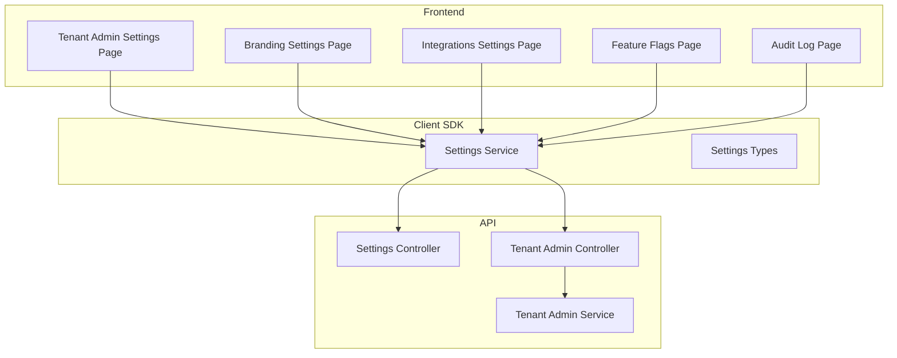
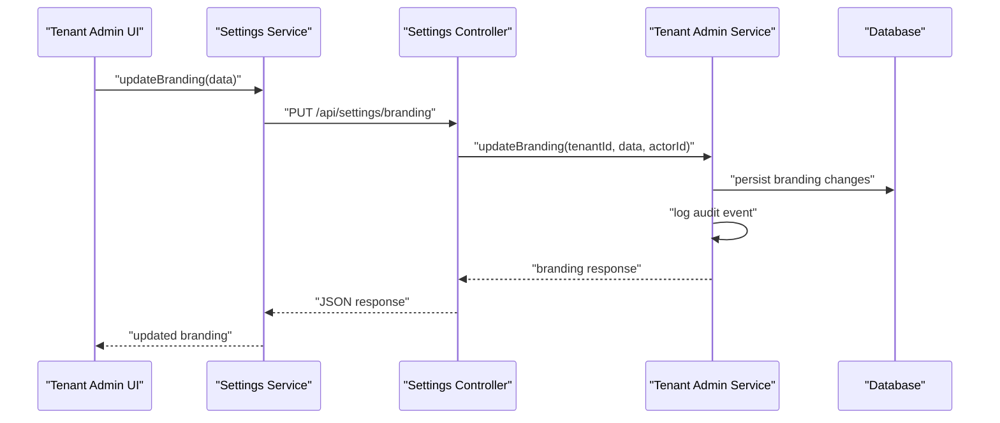
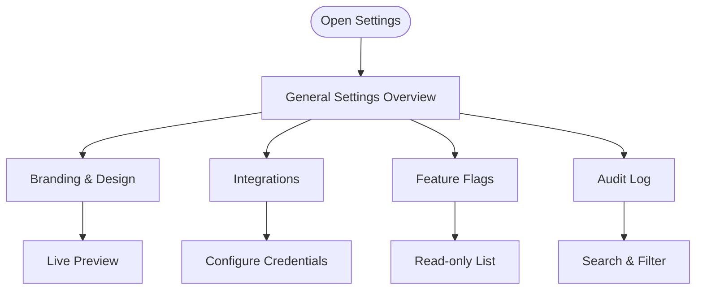
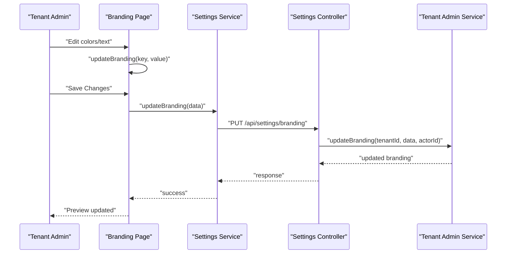
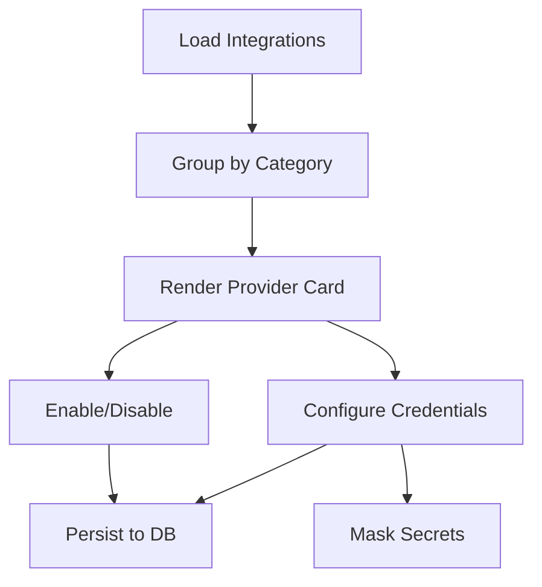
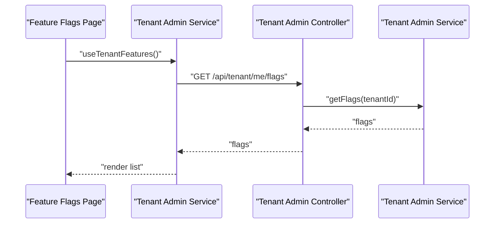
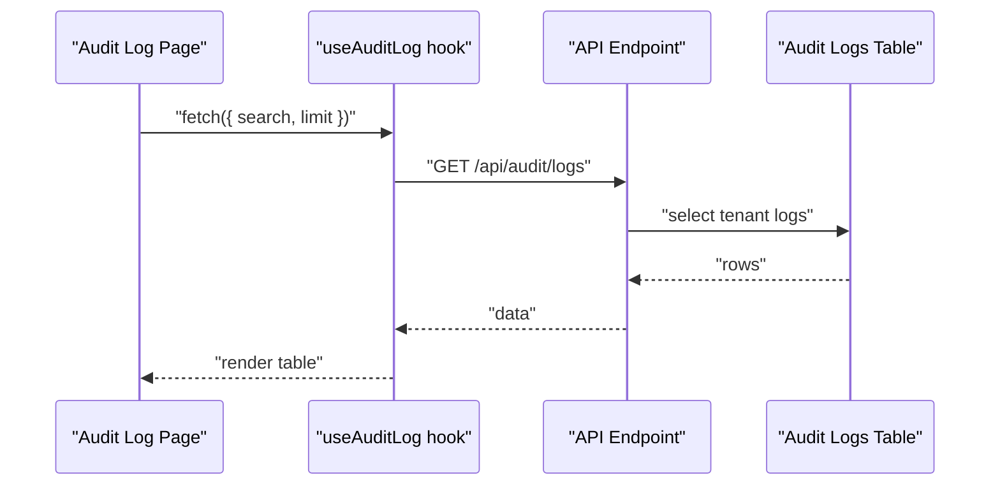
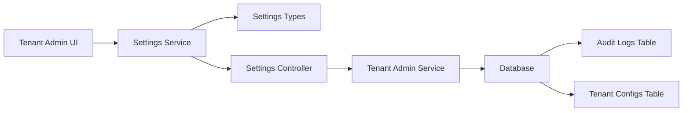

# Settings & Configuration

<cite>
**Referenced Files in This Document**
- [apps/tenant-admin/src/routes/settings/index.tsx](file://apps/tenant-admin/src/routes/settings/index.tsx)
- [apps/tenant-admin/src/routes/settings/branding.tsx](file://apps/tenant-admin/src/routes/settings/branding.tsx)
- [apps/tenant-admin/src/routes/settings/integrations.tsx](file://apps/tenant-admin/src/routes/settings/integrations.tsx)
- [apps/tenant-admin/src/routes/feature-flags/index.tsx](file://apps/tenant-admin/src/routes/feature-flags/index.tsx)
- [apps/tenant-admin/src/routes/audit/index.tsx](file://apps/tenant-admin/src/routes/audit/index.tsx)
- [apps/api/src/modules/settings/settings.controller.ts](file://apps/api/src/modules/settings/settings.controller.ts)
- [apps/api/src/modules/tenant-admin/tenant-admin.controller.ts](file://apps/api/src/modules/tenant-admin/tenant-admin.controller.ts)
- [apps/api/src/modules/tenant-admin/tenant-admin.service.ts](file://apps/api/src/modules/tenant-admin/tenant-admin.service.ts)
- [packages/client-sdk/src/services/settings.service.ts](file://packages/client-sdk/src/services/settings.service.ts)
- [packages/client-sdk/src/types/settings.ts](file://packages/client-sdk/src/types/settings.ts)
- [packages/database-schema/src/compliance/audit-logs.ts](file://packages/database-schema/src/compliance/audit-logs.ts)
- [apps/api/src/database/schema/policy.ts](file://apps/api/src/database/schema/policy.ts)
</cite>

## Table of Contents
1. [Introduction](#introduction)
2. [Project Structure](#project-structure)
3. [Core Components](#core-components)
4. [Architecture Overview](#architecture-overview)
5. [Detailed Component Analysis](#detailed-component-analysis)
6. [Dependency Analysis](#dependency-analysis)
7. [Performance Considerations](#performance-considerations)
8. [Troubleshooting Guide](#troubleshooting-guide)
9. [Conclusion](#conclusion)

## Introduction
This document describes the Tenant Admin Settings and Configuration modules. It covers the settings management interface for tenants, including:
- Tenant configuration options
- Feature flag management
- Branding customization
- Audit log viewing

It explains settings categories, configuration workflows, and how changes are applied and propagated within the tenant environment. It also documents the branding settings for customizing the tenant’s appearance, feature flag toggles for controlling experimental features, and audit log access for compliance and monitoring.

## Project Structure
The Settings and Configuration functionality spans three layers:
- Frontend (Tenant Admin app): UI pages for settings, branding, integrations, feature flags, and audit logs
- API (Server): Controllers and services exposing tenant settings, integrations, feature flags, and audit log retrieval
- Client SDK: Strongly typed services and types for interacting with the API

**Diagram sources**
- [apps/tenant-admin/src/routes/settings/index.tsx](file://apps/tenant-admin/src/routes/settings/index.tsx#L1-L44)
- [apps/tenant-admin/src/routes/settings/branding.tsx](file://apps/tenant-admin/src/routes/settings/branding.tsx#L1-L479)
- [apps/tenant-admin/src/routes/settings/integrations.tsx](file://apps/tenant-admin/src/routes/settings/integrations.tsx#L1-L660)
- [apps/tenant-admin/src/routes/feature-flags/index.tsx](file://apps/tenant-admin/src/routes/feature-flags/index.tsx#L1-L91)
- [apps/tenant-admin/src/routes/audit/index.tsx](file://apps/tenant-admin/src/routes/audit/index.tsx#L1-L117)
- [packages/client-sdk/src/services/settings.service.ts](file://packages/client-sdk/src/services/settings.service.ts#L1-L183)
- [apps/api/src/modules/settings/settings.controller.ts](file://apps/api/src/modules/settings/settings.controller.ts#L1-L194)
- [apps/api/src/modules/tenant-admin/tenant-admin.controller.ts](file://apps/api/src/modules/tenant-admin/tenant-admin.controller.ts#L70-L120)
- [apps/api/src/modules/tenant-admin/tenant-admin.service.ts](file://apps/api/src/modules/tenant-admin/tenant-admin.service.ts#L310-L509)

**Section sources**
- [apps/tenant-admin/src/routes/settings/index.tsx](file://apps/tenant-admin/src/routes/settings/index.tsx#L1-L44)
- [apps/tenant-admin/src/routes/settings/branding.tsx](file://apps/tenant-admin/src/routes/settings/branding.tsx#L1-L479)
- [apps/tenant-admin/src/routes/settings/integrations.tsx](file://apps/tenant-admin/src/routes/settings/integrations.tsx#L1-L660)
- [apps/tenant-admin/src/routes/feature-flags/index.tsx](file://apps/tenant-admin/src/routes/feature-flags/index.tsx#L1-L91)
- [apps/tenant-admin/src/routes/audit/index.tsx](file://apps/tenant-admin/src/routes/audit/index.tsx#L1-L117)
- [packages/client-sdk/src/services/settings.service.ts](file://packages/client-sdk/src/services/settings.service.ts#L1-L183)
- [apps/api/src/modules/settings/settings.controller.ts](file://apps/api/src/modules/settings/settings.controller.ts#L1-L194)
- [apps/api/src/modules/tenant-admin/tenant-admin.controller.ts](file://apps/api/src/modules/tenant-admin/tenant-admin.controller.ts#L70-L120)
- [apps/api/src/modules/tenant-admin/tenant-admin.service.ts](file://apps/api/src/modules/tenant-admin/tenant-admin.service.ts#L310-L509)

## Core Components
- Settings Service (Client SDK): Provides typed methods to get/update tenant settings, user settings, booking policy, branding, and to reset to defaults.
- Settings Controller (API): Exposes endpoints to get and update tenant settings and integrations.
- Tenant Admin Controller/Service (API): Manages tenant feature flags and branding configuration, with audit logging and analytics.
- Tenant Admin Pages (Frontend):
  - Settings overview page
  - Branding customization page
  - Integrations configuration page
  - Feature flags read-only page
  - Audit log viewer page

**Section sources**
- [packages/client-sdk/src/services/settings.service.ts](file://packages/client-sdk/src/services/settings.service.ts#L67-L183)
- [apps/api/src/modules/settings/settings.controller.ts](file://apps/api/src/modules/settings/settings.controller.ts#L51-L194)
- [apps/api/src/modules/tenant-admin/tenant-admin.controller.ts](file://apps/api/src/modules/tenant-admin/tenant-admin.controller.ts#L70-L120)
- [apps/api/src/modules/tenant-admin/tenant-admin.service.ts](file://apps/api/src/modules/tenant-admin/tenant-admin.service.ts#L285-L379)
- [apps/tenant-admin/src/routes/settings/index.tsx](file://apps/tenant-admin/src/routes/settings/index.tsx#L14-L42)
- [apps/tenant-admin/src/routes/settings/branding.tsx](file://apps/tenant-admin/src/routes/settings/branding.tsx#L36-L113)
- [apps/tenant-admin/src/routes/settings/integrations.tsx](file://apps/tenant-admin/src/routes/settings/integrations.tsx#L132-L198)
- [apps/tenant-admin/src/routes/feature-flags/index.tsx](file://apps/tenant-admin/src/routes/feature-flags/index.tsx#L19-L88)
- [apps/tenant-admin/src/routes/audit/index.tsx](file://apps/tenant-admin/src/routes/audit/index.tsx#L21-L114)

## Architecture Overview
The Tenant Admin Settings module follows a layered architecture:
- Frontend pages render UI and orchestrate user actions
- Client SDK encapsulates HTTP calls and typing
- API controllers validate requests and delegate to services
- Services coordinate persistence, validation, and auditing
- Database schema supports settings, integrations, and audit logs

**Diagram sources**
- [apps/tenant-admin/src/routes/settings/branding.tsx](file://apps/tenant-admin/src/routes/settings/branding.tsx#L84-L89)
- [packages/client-sdk/src/services/settings.service.ts](file://packages/client-sdk/src/services/settings.service.ts#L168-L170)
- [apps/api/src/modules/settings/settings.controller.ts](file://apps/api/src/modules/settings/settings.controller.ts#L162-L192)
- [apps/api/src/modules/tenant-admin/tenant-admin.service.ts](file://apps/api/src/modules/tenant-admin/tenant-admin.service.ts#L341-L379)

## Detailed Component Analysis

### Settings Management Interface
The Settings Management Interface provides:
- General tenant settings overview
- Branding customization
- Third-party integrations configuration
- Feature flags visibility
- Audit log browsing

**Section sources**
- [apps/tenant-admin/src/routes/settings/index.tsx](file://apps/tenant-admin/src/routes/settings/index.tsx#L14-L42)
- [apps/tenant-admin/src/routes/settings/branding.tsx](file://apps/tenant-admin/src/routes/settings/branding.tsx#L36-L113)
- [apps/tenant-admin/src/routes/settings/integrations.tsx](file://apps/tenant-admin/src/routes/settings/integrations.tsx#L132-L198)
- [apps/tenant-admin/src/routes/feature-flags/index.tsx](file://apps/tenant-admin/src/routes/feature-flags/index.tsx#L19-L88)
- [apps/tenant-admin/src/routes/audit/index.tsx](file://apps/tenant-admin/src/routes/audit/index.tsx#L21-L114)

### Branding Settings
Branding allows tenants to:
- Set primary/accent colors
- Upload logo and favicon
- Customize header/footer text
- Preview changes live

**Diagram sources**
- [apps/tenant-admin/src/routes/settings/branding.tsx](file://apps/tenant-admin/src/routes/settings/branding.tsx#L72-L89)
- [packages/client-sdk/src/services/settings.service.ts](file://packages/client-sdk/src/services/settings.service.ts#L168-L170)
- [apps/api/src/modules/settings/settings.controller.ts](file://apps/api/src/modules/settings/settings.controller.ts#L162-L192)
- [apps/api/src/modules/tenant-admin/tenant-admin.service.ts](file://apps/api/src/modules/tenant-admin/tenant-admin.service.ts#L341-L379)

**Section sources**
- [apps/tenant-admin/src/routes/settings/branding.tsx](file://apps/tenant-admin/src/routes/settings/branding.tsx#L36-L479)
- [packages/client-sdk/src/services/settings.service.ts](file://packages/client-sdk/src/services/settings.service.ts#L145-L170)
- [apps/api/src/modules/tenant-admin/tenant-admin.service.ts](file://apps/api/src/modules/tenant-admin/tenant-admin.service.ts#L313-L379)

### Integrations Settings
Integrations allow tenants to:
- Toggle providers (e.g., payment, sync, notification, calendar)
- Configure credentials (masked display)
- View last sync timestamps
- Group by category

**Diagram sources**
- [apps/tenant-admin/src/routes/settings/integrations.tsx](file://apps/tenant-admin/src/routes/settings/integrations.tsx#L267-L556)
- [apps/api/src/modules/tenant-admin/tenant-admin.service.ts](file://apps/api/src/modules/tenant-admin/tenant-admin.service.ts#L388-L470)

**Section sources**
- [apps/tenant-admin/src/routes/settings/integrations.tsx](file://apps/tenant-admin/src/routes/settings/integrations.tsx#L132-L660)
- [apps/api/src/modules/tenant-admin/tenant-admin.service.ts](file://apps/api/src/modules/tenant-admin/tenant-admin.service.ts#L388-L470)

### Feature Flag Management
Feature flags are read-only for Tenant Admins and reflect the tenant’s enabled/disabled flags.

**Diagram sources**
- [apps/tenant-admin/src/routes/feature-flags/index.tsx](file://apps/tenant-admin/src/routes/feature-flags/index.tsx#L19-L31)
- [apps/api/src/modules/tenant-admin/tenant-admin.controller.ts](file://apps/api/src/modules/tenant-admin/tenant-admin.controller.ts#L112-L120)
- [apps/api/src/modules/tenant-admin/tenant-admin.service.ts](file://apps/api/src/modules/tenant-admin/tenant-admin.service.ts#L292-L307)

**Section sources**
- [apps/tenant-admin/src/routes/feature-flags/index.tsx](file://apps/tenant-admin/src/routes/feature-flags/index.tsx#L19-L91)
- [apps/api/src/modules/tenant-admin/tenant-admin.controller.ts](file://apps/api/src/modules/tenant-admin/tenant-admin.controller.ts#L112-L120)
- [apps/api/src/modules/tenant-admin/tenant-admin.service.ts](file://apps/api/src/modules/tenant-admin/tenant-admin.service.ts#L292-L307)

### Audit Log Viewing
The Audit Log page enables:
- Searching and filtering
- Viewing timestamp, action, actor, and details
- Tenant-scoped visibility

**Diagram sources**
- [apps/tenant-admin/src/routes/audit/index.tsx](file://apps/tenant-admin/src/routes/audit/index.tsx#L26-L30)
- [packages/database-schema/src/compliance/audit-logs.ts](file://packages/database-schema/src/compliance/audit-logs.ts#L16-L34)

**Section sources**
- [apps/tenant-admin/src/routes/audit/index.tsx](file://apps/tenant-admin/src/routes/audit/index.tsx#L21-L117)
- [packages/database-schema/src/compliance/audit-logs.ts](file://packages/database-schema/src/compliance/audit-logs.ts#L16-L34)

### Settings Categories and Workflows
- General Settings: Overview page indicates future availability of general tenant settings management.
- Booking Policy: Separate service methods for getting/setting booking policy.
- Notifications and Preferences: Managed via user settings service.
- Integrations: Provider-specific configuration with optional API keys, secrets, and webhooks.
- Branding: Color scheme, logos, favicon, and text content with live preview.
- Feature Flags: Read-only tenant flags for controlling experimental features.
- Audit Logs: Tenant-scoped logs for compliance and monitoring.

**Section sources**
- [apps/tenant-admin/src/routes/settings/index.tsx](file://apps/tenant-admin/src/routes/settings/index.tsx#L30-L39)
- [packages/client-sdk/src/services/settings.service.ts](file://packages/client-sdk/src/services/settings.service.ts#L100-L143)
- [apps/tenant-admin/src/routes/settings/integrations.tsx](file://apps/tenant-admin/src/routes/settings/integrations.tsx#L132-L660)
- [apps/tenant-admin/src/routes/settings/branding.tsx](file://apps/tenant-admin/src/routes/settings/branding.tsx#L36-L479)
- [apps/tenant-admin/src/routes/feature-flags/index.tsx](file://apps/tenant-admin/src/routes/feature-flags/index.tsx#L19-L91)
- [apps/tenant-admin/src/routes/audit/index.tsx](file://apps/tenant-admin/src/routes/audit/index.tsx#L21-L117)

### How Changes Are Applied and Propagated
- Branding updates: UI → SDK → Settings Controller → Tenant Admin Service → Persistence → Audit logging
- Integration toggles/configurations: UI → SDK → Settings Controller → Tenant Admin Service → Encrypted secrets storage → Audit/analytics
- Feature flags: Read-only tenant flags retrieved via Tenant Admin Controller/Service
- Audit logs: Tenant-scoped queries against the audit logs table

**Section sources**
- [apps/api/src/modules/settings/settings.controller.ts](file://apps/api/src/modules/settings/settings.controller.ts#L162-L192)
- [apps/api/src/modules/tenant-admin/tenant-admin.service.ts](file://apps/api/src/modules/tenant-admin/tenant-admin.service.ts#L341-L470)
- [packages/database-schema/src/compliance/audit-logs.ts](file://packages/database-schema/src/compliance/audit-logs.ts#L16-L34)

## Dependency Analysis
- Frontend depends on Client SDK for API interactions
- Client SDK depends on typed settings interfaces
- API Controllers depend on Tenant Admin Service for business logic
- Tenant Admin Service coordinates persistence and audit logging
- Database schema defines audit logs and tenant configurations

**Diagram sources**
- [packages/client-sdk/src/services/settings.service.ts](file://packages/client-sdk/src/services/settings.service.ts#L67-L183)
- [packages/client-sdk/src/types/settings.ts](file://packages/client-sdk/src/types/settings.ts#L33-L45)
- [apps/api/src/modules/settings/settings.controller.ts](file://apps/api/src/modules/settings/settings.controller.ts#L51-L194)
- [apps/api/src/modules/tenant-admin/tenant-admin.service.ts](file://apps/api/src/modules/tenant-admin/tenant-admin.service.ts#L310-L509)
- [packages/database-schema/src/compliance/audit-logs.ts](file://packages/database-schema/src/compliance/audit-logs.ts#L16-L34)
- [apps/api/src/database/schema/policy.ts](file://apps/api/src/database/schema/policy.ts#L88-L116)

**Section sources**
- [packages/client-sdk/src/services/settings.service.ts](file://packages/client-sdk/src/services/settings.service.ts#L67-L183)
- [packages/client-sdk/src/types/settings.ts](file://packages/client-sdk/src/types/settings.ts#L33-L45)
- [apps/api/src/modules/settings/settings.controller.ts](file://apps/api/src/modules/settings/settings.controller.ts#L51-L194)
- [apps/api/src/modules/tenant-admin/tenant-admin.service.ts](file://apps/api/src/modules/tenant-admin/tenant-admin.service.ts#L310-L509)
- [packages/database-schema/src/compliance/audit-logs.ts](file://packages/database-schema/src/compliance/audit-logs.ts#L16-L34)
- [apps/api/src/database/schema/policy.ts](file://apps/api/src/database/schema/policy.ts#L88-L116)

## Performance Considerations
- Minimize re-renders in branding and integrations forms by using local state and batched updates
- Debounce search in audit log for large datasets
- Paginate or limit audit log results to avoid heavy payloads
- Cache tenant feature flags on the client to reduce network calls
- Use optimistic updates for toggling integrations and flags, with rollback on failure

## Troubleshooting Guide
- Access Denied: Ensure the user has Tenant Admin or Tech Admin roles; otherwise, pages show a warning or alert.
- Loading States: Branding and integrations pages show spinners while fetching data; verify network connectivity and API health.
- Integration Errors: On configuration errors, the integrations page displays an error alert; confirm required fields and provider-specific requirements.
- Audit Log Empty: If no logs appear, verify tenant context and search filters; ensure audit logging is enabled.

**Section sources**
- [apps/tenant-admin/src/routes/settings/branding.tsx](file://apps/tenant-admin/src/routes/settings/branding.tsx#L92-L103)
- [apps/tenant-admin/src/routes/settings/integrations.tsx](file://apps/tenant-admin/src/routes/settings/integrations.tsx#L162-L196)
- [apps/tenant-admin/src/routes/audit/index.tsx](file://apps/tenant-admin/src/routes/audit/index.tsx#L74-L78)

## Conclusion
The Tenant Admin Settings and Configuration modules provide a comprehensive, tenant-scoped management surface for branding, integrations, feature flags, and audit logs. The frontend pages, Client SDK, and API controllers/services work together to deliver a secure, audited, and user-friendly configuration experience. Future enhancements can focus on expanding general settings, integrating encryption for secrets, and enriching audit log metadata.