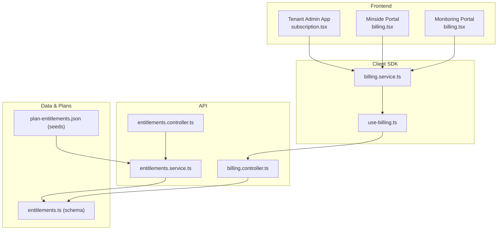
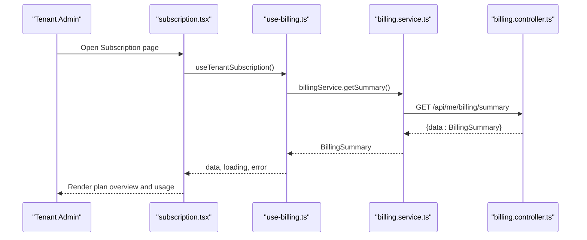
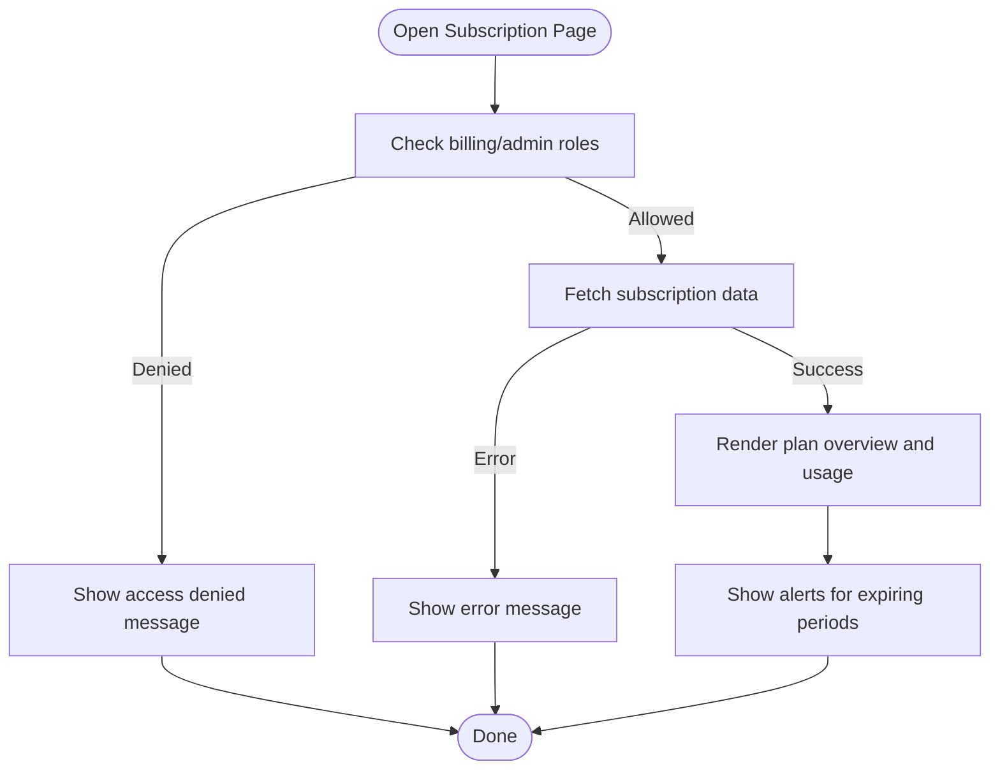
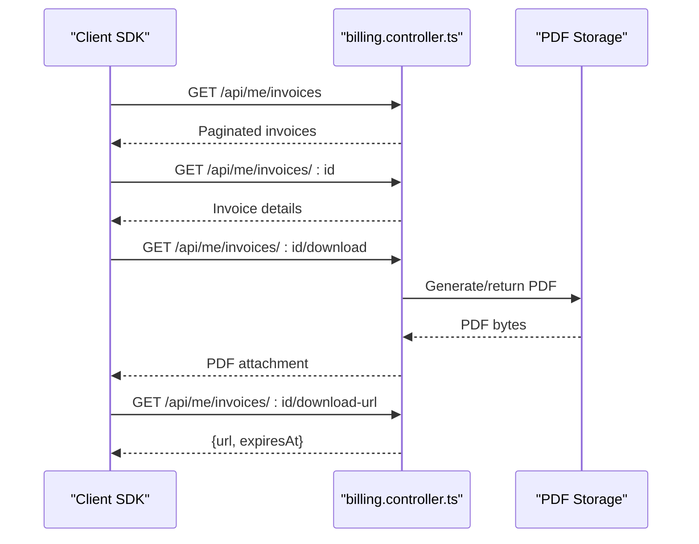
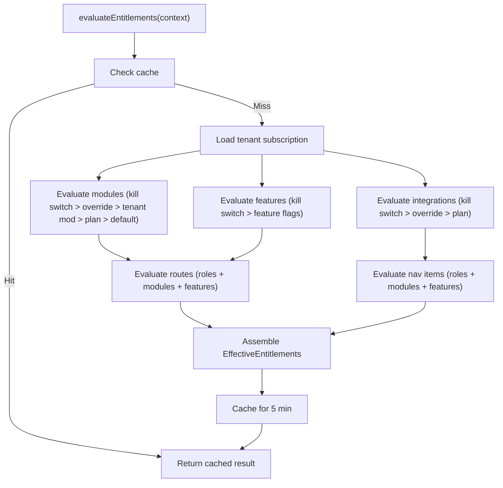
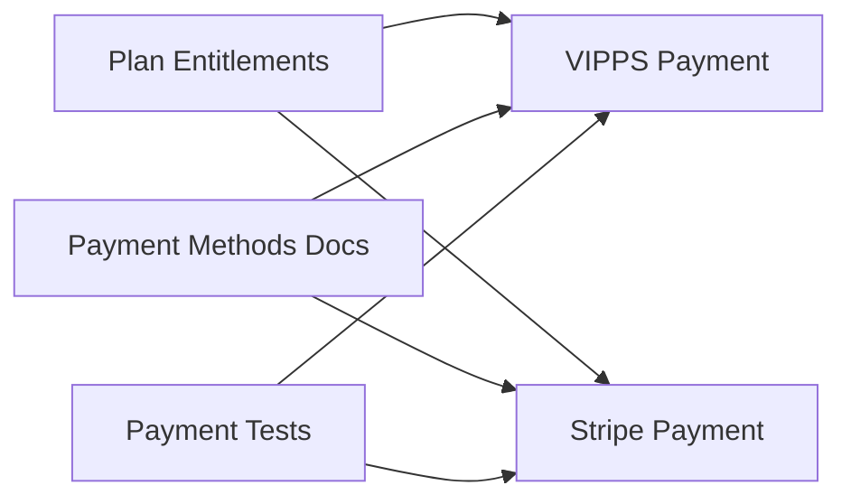
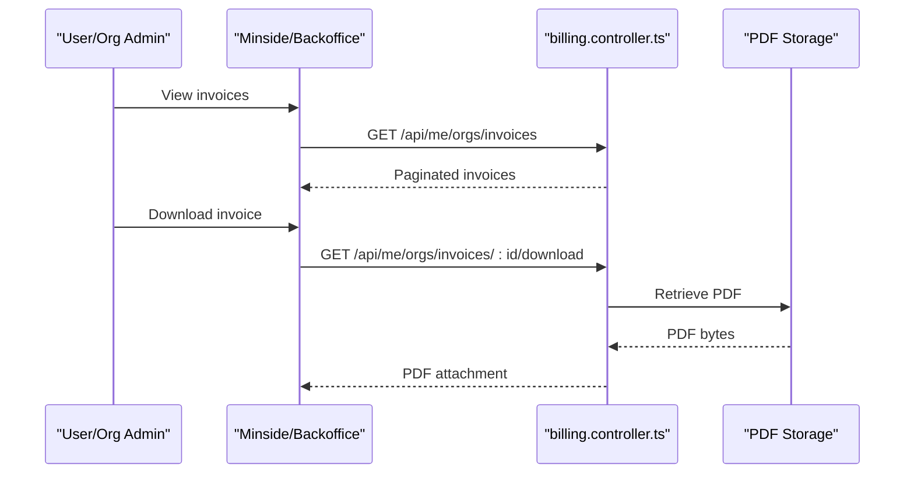
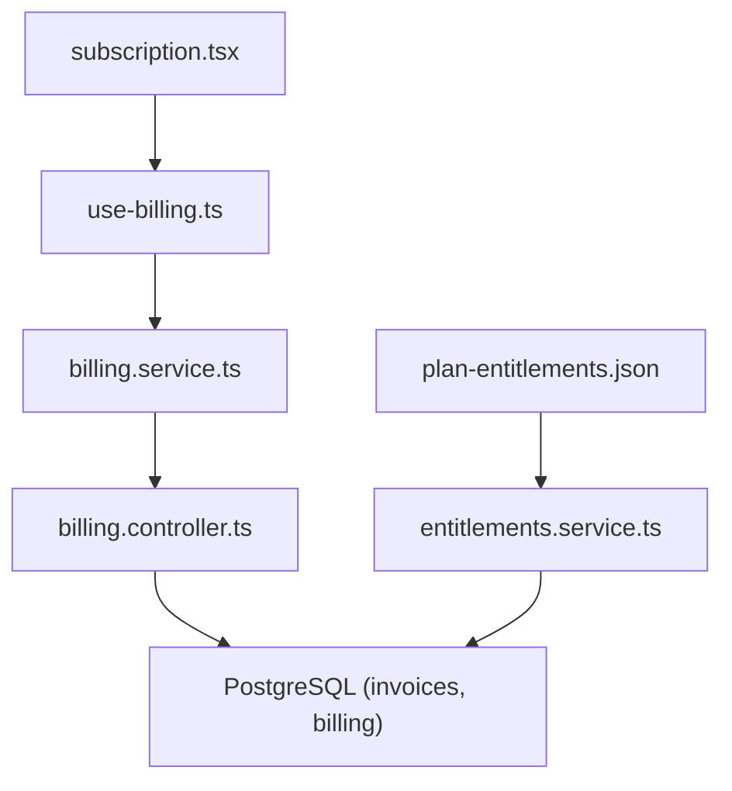

# Subscription & Billing

<cite>
**Referenced Files in This Document**
- [apps/tenant-admin/src/routes/subscription.tsx](file://apps/tenant-admin/src/routes/subscription.tsx)
- [apps/api/src/modules/billing/billing.controller.ts](file://apps/api/src/modules/billing/billing.controller.ts)
- [packages/client-sdk/src/services/billing.service.ts](file://packages/client-sdk/src/services/billing.service.ts)
- [packages/client-sdk/src/hooks/use-billing.ts](file://packages/client-sdk/src/hooks/use-billing.ts)
- [packages/database-schema/src/saas/entitlements.ts](file://packages/database-schema/src/saas/entitlements.ts)
- [packages/database-schema/seeds/plan-entitlements.json](file://packages/database-schema/seeds/plan-entitlements.json)
- [apps/api/src/modules/entitlements/entitlements.controller.ts](file://apps/api/src/modules/entitlements/entitlements.controller.ts)
- [apps/api/src/modules/entitlements/entitlements.service.ts](file://apps/api/src/modules/entitlements/entitlements.service.ts)
- [apps/api/src/__tests__/integration/vipps-payment.test.ts](file://apps/api/src/__tests__/integration/vipps-payment.test.ts)
- [packages/docs-content/content/docs/payments/nb/payment-methods.mdx](file://packages/docs-content/content/docs/payments/nb/payment-methods.mdx)
- [tests/e2e/web/payment-deposit.spec.ts](file://tests/e2e/web/payment-deposit.spec.ts)
- [tests/journeys/vipps-payment.spec.ts](file://tests/journeys/vipps-payment.spec.ts)
- [apps/minside/src/routes/billing.tsx](file://apps/minside/src/routes/billing.tsx)
- [apps/monitoring/src/routes/billing.tsx](file://apps/monitoring/src/routes/billing.tsx)
- [apps/minside/src/routes/org/invoices.tsx](file://apps/minside/src/routes/org/invoices.tsx)
- [apps/monitoring/src/routes/org/invoices.tsx](file://apps/monitoring/src/routes/org/invoices.tsx)
- [tests/e2e/backoffice/blur-eye/economy-invoices.spec.ts](file://tests/e2e/backoffice/blur-eye/economy-invoices.spec.ts)
- [tests/rbac/rbac-matrix.saas-billing-admin.json](file://tests/rbac/rbac-matrix.saas-billing-admin.json)
</cite>

## Table of Contents
1. [Introduction](#introduction)
2. [Project Structure](#project-structure)
3. [Core Components](#core-components)
4. [Architecture Overview](#architecture-overview)
5. [Detailed Component Analysis](#detailed-component-analysis)
6. [Dependency Analysis](#dependency-analysis)
7. [Performance Considerations](#performance-considerations)
8. [Troubleshooting Guide](#troubleshooting-guide)
9. [Conclusion](#conclusion)

## Introduction
This document describes the Subscription and Billing management functionality across the platform. It covers:
- Subscription management interface for tenant administrators
- Plan selection and billing cycle configuration
- Payment method management and integration
- Subscription lifecycle, renewal processes, and upgrade/downgrade workflows
- Billing history display and invoice management
- Usage tracking and subscription limits
- Billing alerts and administrative controls

The system integrates a tenant-facing subscription dashboard, backend billing APIs, client SDK hooks for UI consumption, and an entitlements engine that enforces plan-based feature availability and limits.

## Project Structure
The Subscription & Billing feature spans three main areas:
- Frontend tenant dashboard: displays current subscription, usage, and limits
- Backend billing APIs: user and organization billing summaries and invoices
- Client SDK: typed services and React Query hooks for billing operations
- Entitlements engine: evaluates plan features, modules, and limits for enforcement



**Diagram sources**
- [apps/tenant-admin/src/routes/subscription.tsx](file://apps/tenant-admin/src/routes/subscription.tsx#L105-L617)
- [packages/client-sdk/src/services/billing.service.ts](file://packages/client-sdk/src/services/billing.service.ts#L57-L181)
- [packages/client-sdk/src/hooks/use-billing.ts](file://packages/client-sdk/src/hooks/use-billing.ts#L14-L134)
- [apps/api/src/modules/billing/billing.controller.ts](file://apps/api/src/modules/billing/billing.controller.ts#L104-L330)
- [apps/api/src/modules/entitlements/entitlements.controller.ts](file://apps/api/src/modules/entitlements/entitlements.controller.ts#L10-L143)
- [apps/api/src/modules/entitlements/entitlements.service.ts](file://apps/api/src/modules/entitlements/entitlements.service.ts#L41-L119)
- [packages/database-schema/src/saas/entitlements.ts](file://packages/database-schema/src/saas/entitlements.ts#L14-L66)
- [packages/database-schema/seeds/plan-entitlements.json](file://packages/database-schema/seeds/plan-entitlements.json#L1-L213)

**Section sources**
- [apps/tenant-admin/src/routes/subscription.tsx](file://apps/tenant-admin/src/routes/subscription.tsx#L105-L617)
- [apps/api/src/modules/billing/billing.controller.ts](file://apps/api/src/modules/billing/billing.controller.ts#L104-L330)
- [packages/client-sdk/src/services/billing.service.ts](file://packages/client-sdk/src/services/billing.service.ts#L57-L181)
- [packages/client-sdk/src/hooks/use-billing.ts](file://packages/client-sdk/src/hooks/use-billing.ts#L14-L134)
- [packages/database-schema/src/saas/entitlements.ts](file://packages/database-schema/src/saas/entitlements.ts#L14-L66)
- [packages/database-schema/seeds/plan-entitlements.json](file://packages/database-schema/seeds/plan-entitlements.json#L1-L213)
- [apps/api/src/modules/entitlements/entitlements.controller.ts](file://apps/api/src/modules/entitlements/entitlements.controller.ts#L10-L143)
- [apps/api/src/modules/entitlements/entitlements.service.ts](file://apps/api/src/modules/entitlements/entitlements.service.ts#L41-L119)

## Core Components
- Tenant Admin Subscription Dashboard
  - Displays plan overview, billing period, status, and usage vs limits
  - Provides usage stats for users, organizations, listings, monthly bookings, and storage
  - Includes alerts and guidance for contacting administrators for changes
- Billing API
  - User billing summary and invoice listing
  - Organization billing summary and invoice listing
  - Invoice retrieval, PDF download, and temporary download URLs
- Client SDK
  - Typed billing service for user and organization scopes
  - React Query hooks for summaries, invoices, and downloads
- Entitlements Engine
  - Evaluates effective entitlements based on plan, overrides, and kill switches
  - Enforces modules, features, integrations, and navigation visibility
  - Integrates with subscription plan to derive limits and capabilities

**Section sources**
- [apps/tenant-admin/src/routes/subscription.tsx](file://apps/tenant-admin/src/routes/subscription.tsx#L105-L617)
- [apps/api/src/modules/billing/billing.controller.ts](file://apps/api/src/modules/billing/billing.controller.ts#L104-L330)
- [packages/client-sdk/src/services/billing.service.ts](file://packages/client-sdk/src/services/billing.service.ts#L57-L181)
- [packages/client-sdk/src/hooks/use-billing.ts](file://packages/client-sdk/src/hooks/use-billing.ts#L14-L134)
- [apps/api/src/modules/entitlements/entitlements.service.ts](file://apps/api/src/modules/entitlements/entitlements.service.ts#L64-L119)

## Architecture Overview
The Subscription & Billing architecture connects UI dashboards to backend APIs via the client SDK. The entitlements engine ensures plan-driven feature availability and enforcement.



**Diagram sources**
- [apps/tenant-admin/src/routes/subscription.tsx](file://apps/tenant-admin/src/routes/subscription.tsx#L105-L175)
- [packages/client-sdk/src/hooks/use-billing.ts](file://packages/client-sdk/src/hooks/use-billing.ts#L39-L65)
- [packages/client-sdk/src/services/billing.service.ts](file://packages/client-sdk/src/services/billing.service.ts#L64-L73)
- [apps/api/src/modules/billing/billing.controller.ts](file://apps/api/src/modules/billing/billing.controller.ts#L110-L123)

## Detailed Component Analysis

### Tenant Admin Subscription Dashboard
- Purpose: Read-only view for tenant administrators to inspect current plan, billing period, and usage vs limits
- Key features:
  - Plan overview card with status badge and period dates
  - Usage statistics cards for users, organizations, listings, bookings/month
  - Storage usage visualization with percentage and available space
  - Access control checks and localized status formatting
  - Guidance to contact administrators for changes



**Diagram sources**
- [apps/tenant-admin/src/routes/subscription.tsx](file://apps/tenant-admin/src/routes/subscription.tsx#L139-L175)

**Section sources**
- [apps/tenant-admin/src/routes/subscription.tsx](file://apps/tenant-admin/src/routes/subscription.tsx#L105-L617)

### Billing API Endpoints
- User scope:
  - GET /api/me/billing/summary
  - GET /api/me/invoices
  - GET /api/me/invoices/:id
  - GET /api/me/invoices/:id/download
  - GET /api/me/invoices/:id/download-url
- Organization scope:
  - GET /api/orgs/:orgId/billing/summary
  - GET /api/orgs/:orgId/invoices
  - GET /api/orgs/:orgId/invoices/:id
  - GET /api/orgs/:orgId/invoices/:id/download



**Diagram sources**
- [apps/api/src/modules/billing/billing.controller.ts](file://apps/api/src/modules/billing/billing.controller.ts#L126-L327)

**Section sources**
- [apps/api/src/modules/billing/billing.controller.ts](file://apps/api/src/modules/billing/billing.controller.ts#L104-L330)

### Client SDK Services and Hooks
- BillingService
  - User and organization scoped methods for summaries, invoice lists, single invoice, PDF download, and download URLs
- use-billing hooks
  - React Query keys and queries/mutations for user and organization billing operations
  - Automatic caching and refetching strategies

```mermaid
classDiagram
class BillingService {
+getSummary(params) SingleResponse~BillingSummary~
+listInvoices(params) PaginatedResponse~Invoice~
+getInvoice(id) SingleResponse~Invoice~
+downloadInvoice(id) Blob
+getInvoiceDownloadUrl(id) {url, expiresAt}
}
class OrgBillingService {
+getSummary(orgId, params) SingleResponse~BillingSummary~
+listInvoices(orgId, params) PaginatedResponse~Invoice~
+getInvoice(orgId, invoiceId) SingleResponse~Invoice~
+downloadInvoice(orgId, invoiceId) Blob
}
class useBillingHooks {
+useBillingSummary(params)
+useInvoices(params)
+useInvoice(id, options)
+useDownloadInvoice()
+useInvoiceDownloadUrl(id, options)
+useOrgBillingSummary(orgId, params)
+useOrgInvoices(orgId, params)
+useOrgInvoice(orgId, invoiceId, options)
+useDownloadOrgInvoice()
}
BillingService <.. useBillingHooks : "consumed by"
OrgBillingService <.. useBillingHooks : "consumed by"
```

**Diagram sources**
- [packages/client-sdk/src/services/billing.service.ts](file://packages/client-sdk/src/services/billing.service.ts#L57-L181)
- [packages/client-sdk/src/hooks/use-billing.ts](file://packages/client-sdk/src/hooks/use-billing.ts#L39-L133)

**Section sources**
- [packages/client-sdk/src/services/billing.service.ts](file://packages/client-sdk/src/services/billing.service.ts#L57-L181)
- [packages/client-sdk/src/hooks/use-billing.ts](file://packages/client-sdk/src/hooks/use-billing.ts#L14-L134)

### Entitlements Engine and Plan-Based Controls
- Evaluates effective entitlements for a tenant session
- Enforces plan-based modules, features, integrations, and navigation
- Supports kill switches, tenant overrides, and plan defaults
- Integrates with subscription plan to derive limits and capabilities



**Diagram sources**
- [apps/api/src/modules/entitlements/entitlements.service.ts](file://apps/api/src/modules/entitlements/entitlements.service.ts#L64-L119)
- [packages/database-schema/src/saas/entitlements.ts](file://packages/database-schema/src/saas/entitlements.ts#L14-L66)
- [packages/database-schema/seeds/plan-entitlements.json](file://packages/database-schema/seeds/plan-entitlements.json#L1-L213)

**Section sources**
- [apps/api/src/modules/entitlements/entitlements.service.ts](file://apps/api/src/modules/entitlements/entitlements.service.ts#L64-L119)
- [apps/api/src/modules/entitlements/entitlements.controller.ts](file://apps/api/src/modules/entitlements/entitlements.controller.ts#L17-L70)
- [packages/database-schema/src/saas/entitlements.ts](file://packages/database-schema/src/saas/entitlements.ts#L14-L66)
- [packages/database-schema/seeds/plan-entitlements.json](file://packages/database-schema/seeds/plan-entitlements.json#L1-L213)

### Payment Methods and Integration
- Supported integrations include VIPPS and Stripe as indicated by plan entitlements and documentation
- Tests and documentation demonstrate payment flows and methods



**Diagram sources**
- [packages/database-schema/seeds/plan-entitlements.json](file://packages/database-schema/seeds/plan-entitlements.json#L70-L211)
- [packages/docs-content/content/docs/payments/nb/payment-methods.mdx](file://packages/docs-content/content/docs/payments/nb/payment-methods.mdx)
- [apps/api/src/__tests__/integration/vipps-payment.test.ts](file://apps/api/src/__tests__/integration/vipps-payment.test.ts)
- [tests/journeys/vipps-payment.spec.ts](file://tests/journeys/vipps-payment.spec.ts)
- [tests/e2e/web/payment-deposit.spec.ts](file://tests/e2e/web/payment-deposit.spec.ts)

**Section sources**
- [packages/database-schema/seeds/plan-entitlements.json](file://packages/database-schema/seeds/plan-entitlements.json#L70-L211)
- [packages/docs-content/content/docs/payments/nb/payment-methods.mdx](file://packages/docs-content/content/docs/payments/nb/payment-methods.mdx)
- [apps/api/src/__tests__/integration/vipps-payment.test.ts](file://apps/api/src/__tests__/integration/vipps-payment.test.ts)
- [tests/journeys/vipps-payment.spec.ts](file://tests/journeys/vipps-payment.spec.ts)
- [tests/e2e/web/payment-deposit.spec.ts](file://tests/e2e/web/payment-deposit.spec.ts)

### Billing History and Invoices
- User and organization invoice listing, retrieval, and PDF download
- Temporary download URLs for secure access
- Invoice status tracking and metadata



**Diagram sources**
- [apps/api/src/modules/billing/billing.controller.ts](file://apps/api/src/modules/billing/billing.controller.ts#L254-L327)
- [apps/minside/src/routes/billing.tsx](file://apps/minside/src/routes/billing.tsx)
- [apps/monitoring/src/routes/billing.tsx](file://apps/monitoring/src/routes/billing.tsx)
- [apps/minside/src/routes/org/invoices.tsx](file://apps/minside/src/routes/org/invoices.tsx)
- [apps/monitoring/src/routes/org/invoices.tsx](file://apps/monitoring/src/routes/org/invoices.tsx)
- [tests/e2e/backoffice/blur-eye/economy-invoices.spec.ts](file://tests/e2e/backoffice/blur-eye/economy-invoices.spec.ts)

**Section sources**
- [apps/api/src/modules/billing/billing.controller.ts](file://apps/api/src/modules/billing/billing.controller.ts#L254-L327)
- [apps/minside/src/routes/billing.tsx](file://apps/minside/src/routes/billing.tsx)
- [apps/monitoring/src/routes/billing.tsx](file://apps/monitoring/src/routes/billing.tsx)
- [apps/minside/src/routes/org/invoices.tsx](file://apps/minside/src/routes/org/invoices.tsx)
- [apps/monitoring/src/routes/org/invoices.tsx](file://apps/monitoring/src/routes/org/invoices.tsx)
- [tests/e2e/backoffice/blur-eye/economy-invoices.spec.ts](file://tests/e2e/backoffice/blur-eye/economy-invoices.spec.ts)

## Dependency Analysis
- Tenant Admin Subscription Dashboard depends on:
  - Client SDK hooks for fetching subscription data
  - Entitlements engine indirectly for plan-based feature visibility
- Billing API depends on:
  - Database schema for invoices and billing metadata
  - Storage service for PDF generation and download URLs
- Client SDK depends on:
  - Backend billing endpoints
  - React Query for caching and synchronization



**Diagram sources**
- [apps/tenant-admin/src/routes/subscription.tsx](file://apps/tenant-admin/src/routes/subscription.tsx#L105-L112)
- [packages/client-sdk/src/hooks/use-billing.ts](file://packages/client-sdk/src/hooks/use-billing.ts#L39-L65)
- [packages/client-sdk/src/services/billing.service.ts](file://packages/client-sdk/src/services/billing.service.ts#L64-L73)
- [apps/api/src/modules/billing/billing.controller.ts](file://apps/api/src/modules/billing/billing.controller.ts#L110-L123)
- [apps/api/src/modules/entitlements/entitlements.service.ts](file://apps/api/src/modules/entitlements/entitlements.service.ts#L504-L518)
- [packages/database-schema/seeds/plan-entitlements.json](file://packages/database-schema/seeds/plan-entitlements.json#L1-L213)

**Section sources**
- [apps/tenant-admin/src/routes/subscription.tsx](file://apps/tenant-admin/src/routes/subscription.tsx#L105-L112)
- [packages/client-sdk/src/hooks/use-billing.ts](file://packages/client-sdk/src/hooks/use-billing.ts#L39-L65)
- [packages/client-sdk/src/services/billing.service.ts](file://packages/client-sdk/src/services/billing.service.ts#L64-L73)
- [apps/api/src/modules/billing/billing.controller.ts](file://apps/api/src/modules/billing/billing.controller.ts#L110-L123)
- [apps/api/src/modules/entitlements/entitlements.service.ts](file://apps/api/src/modules/entitlements/entitlements.service.ts#L504-L518)
- [packages/database-schema/seeds/plan-entitlements.json](file://packages/database-schema/seeds/plan-entitlements.json#L1-L213)

## Performance Considerations
- Caching
  - Entitlements evaluation caches results for 5 minutes and uses ETag headers for client caching
  - Billing download URLs are short-lived to balance convenience and security
- Pagination
  - Invoice listing supports pagination parameters to reduce payload sizes
- Asynchronous orchestration
  - Entitlements evaluation aggregates multiple evaluations concurrently

[No sources needed since this section provides general guidance]

## Troubleshooting Guide
- Access Denied
  - Ensure the user has billing or tenant admin roles; otherwise, the dashboard shows an access denied message
- Loading Errors
  - If subscription data fails to load, the dashboard displays an error message; retry after verifying network connectivity
- Invoice Retrieval Failures
  - If an invoice is not found, the API returns a 404 problem JSON; confirm the invoice ID
  - For download failures, verify the temporary download URL validity and network conditions
- Payment Issues
  - Verify plan entitlements for payment integrations (VIPPS, Stripe) and ensure integration configurations are valid

**Section sources**
- [apps/tenant-admin/src/routes/subscription.tsx](file://apps/tenant-admin/src/routes/subscription.tsx#L139-L174)
- [apps/api/src/modules/billing/billing.controller.ts](file://apps/api/src/modules/billing/billing.controller.ts#L162-L174)
- [apps/api/src/modules/billing/billing.controller.ts](file://apps/api/src/modules/billing/billing.controller.ts#L208-L226)
- [packages/database-schema/seeds/plan-entitlements.json](file://packages/database-schema/seeds/plan-entitlements.json#L70-L211)

## Conclusion
The Subscription & Billing system provides a cohesive tenant-facing dashboard, robust backend billing APIs, and a client SDK with React Query hooks. The entitlements engine ensures plan-driven enforcement of features and limits, while payment integrations and invoice management support end-to-end billing operations. Administrators can monitor usage, view billing history, and coordinate plan changes, with clear pathways for upgrades and renewals aligned to the entitlements model.