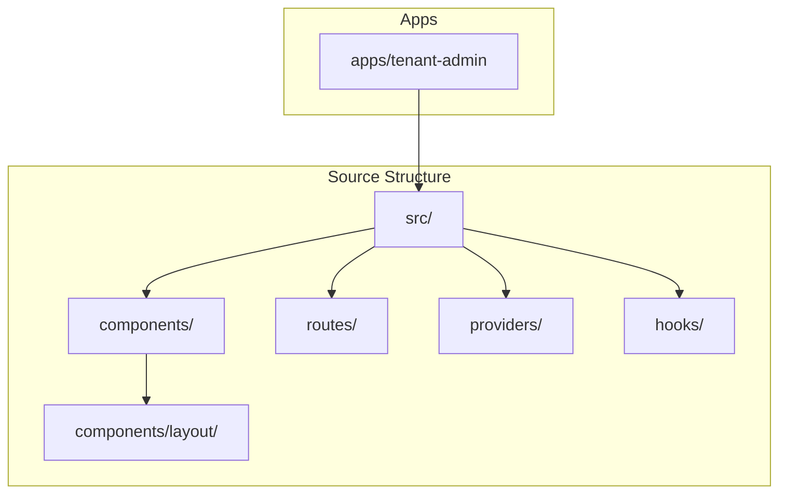
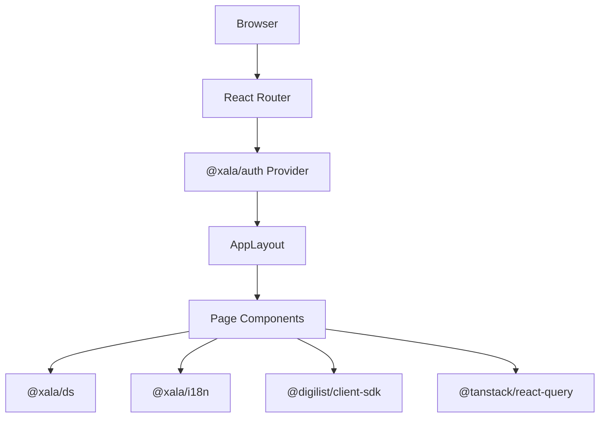
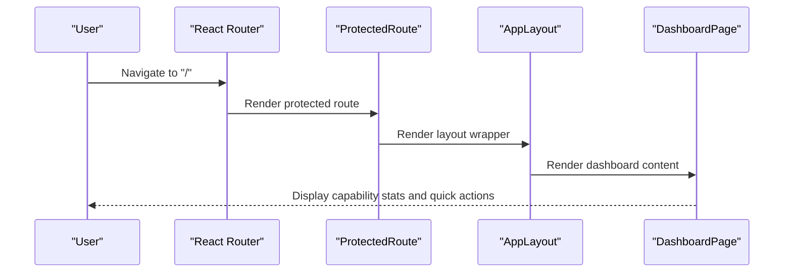
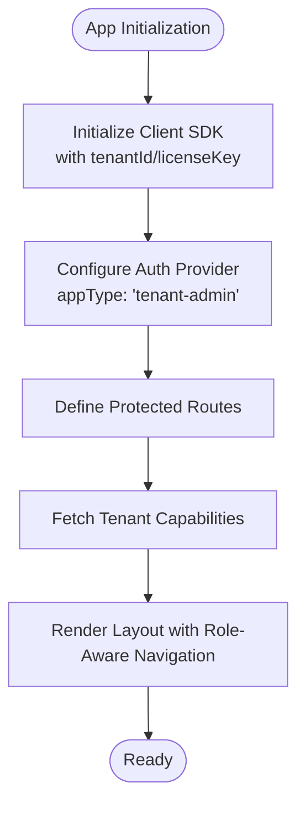
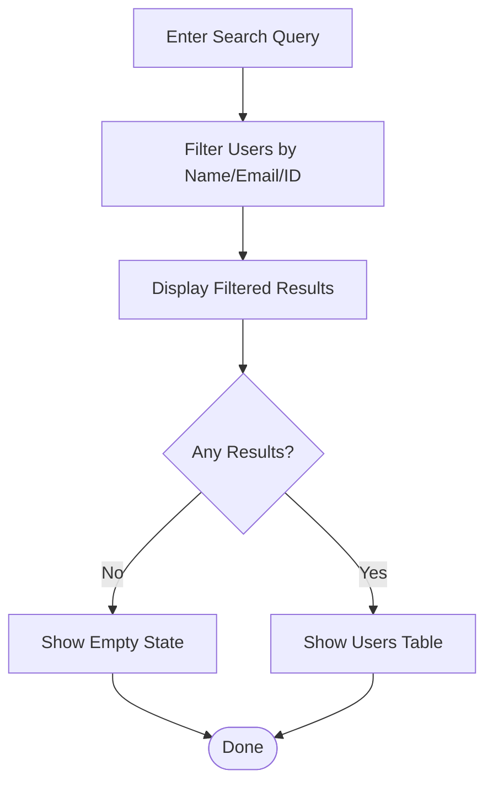
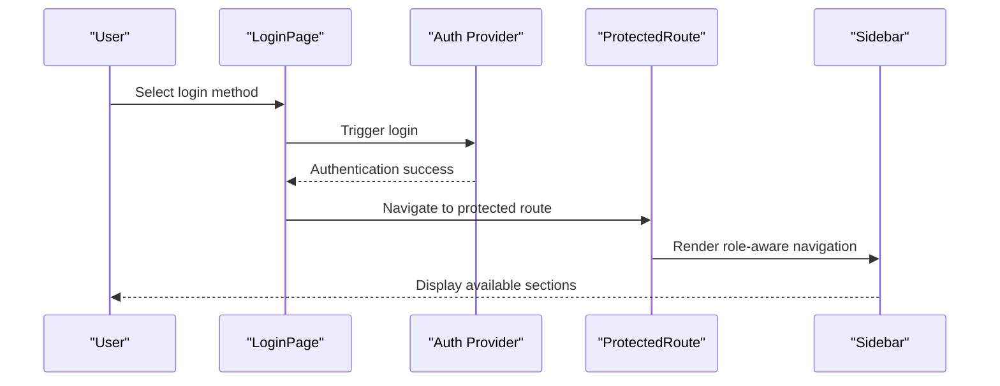
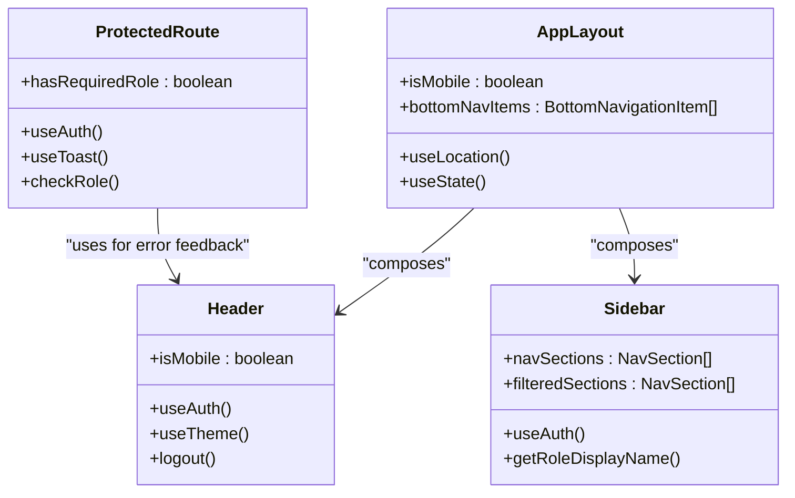
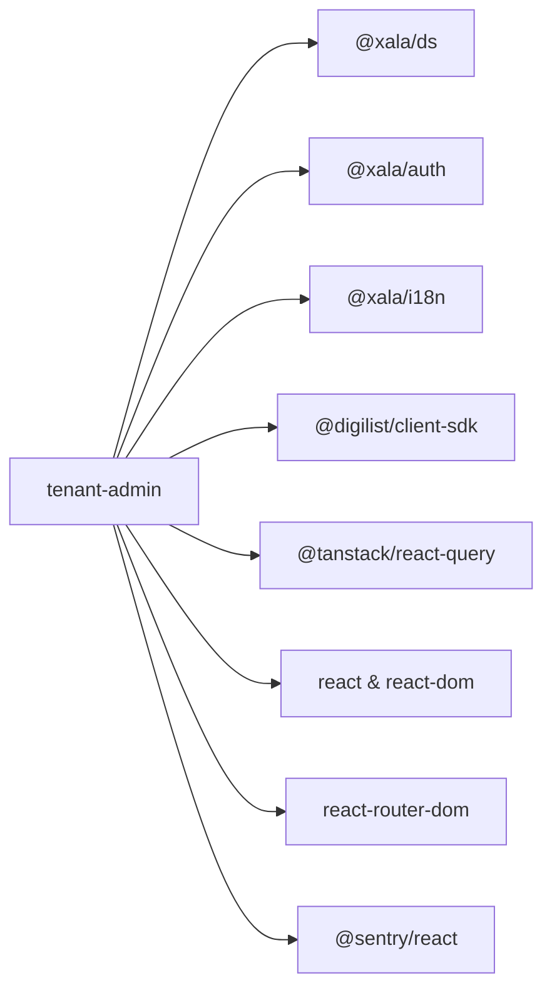

# Tenant Admin Application

<cite>
**Referenced Files in This Document**
- [package.json](file://apps/tenant-admin/package.json)
- [vite.config.ts](file://apps/tenant-admin/vite.config.ts)
- [tsconfig.json](file://apps/tenant-admin/tsconfig.json)
- [App.tsx](file://apps/tenant-admin/src/App.tsx)
- [main.tsx](file://apps/tenant-admin/src/main.tsx)
- [routes/index.tsx](file://apps/tenant-admin/src/routes/index.tsx)
- [routes/dashboard.tsx](file://apps/tenant-admin/src/routes/dashboard.tsx)
- [routes/users/index.tsx](file://apps/tenant-admin/src/routes/users/index.tsx)
- [routes/settings/index.tsx](file://apps/tenant-admin/src/routes/settings/index.tsx)
- [routes/audit/index.tsx](file://apps/tenant-admin/src/routes/audit/index.tsx)
- [routes/feature-flags/index.tsx](file://apps/tenant-admin/src/routes/feature-flags/index.tsx)
- [routes/login.tsx](file://apps/tenant-admin/src/routes/login.tsx)
- [routes/subscription.tsx](file://apps/tenant-admin/src/routes/subscription.tsx)
- [components/layout/AppLayout.tsx](file://apps/tenant-admin/src/components/layout/AppLayout.tsx)
- [components/layout/Header.tsx](file://apps/tenant-admin/src/components/layout/Header.tsx)
- [components/layout/Sidebar.tsx](file://apps/tenant-admin/src/components/layout/Sidebar.tsx)
- [components/ProtectedRoute.tsx](file://apps/tenant-admin/src/components/ProtectedRoute.tsx)
</cite>

## Table of Contents
1. [Introduction](#introduction)
2. [Project Structure](#project-structure)
3. [Core Components](#core-components)
4. [Architecture Overview](#architecture-overview)
5. [Detailed Component Analysis](#detailed-component-analysis)
6. [Dependency Analysis](#dependency-analysis)
7. [Performance Considerations](#performance-considerations)
8. [Troubleshooting Guide](#troubleshooting-guide)
9. [Conclusion](#conclusion)
10. [Appendices](#appendices)

## Introduction
The Tenant Admin Application provides an organization-level administrative interface for managing tenant-specific operations, user administration, permissions, and configuration settings. It is built as a React application using Vite, integrates with the Digilist Client SDK for data access, and leverages shared design system, i18n, and authentication packages. The application enforces role-based access control and provides a responsive layout supporting both desktop and mobile experiences.

## Project Structure
The tenant-admin application follows a feature-based structure under the src directory, organized into:
- Providers: Global providers for theming, notifications, and state
- Components: Reusable UI components and layout elements
- Hooks: Custom hooks for authentication and demo login
- Routes: Page-level components grouped by functional areas

**Diagram sources**
- [App.tsx](file://apps/tenant-admin/src/App.tsx#L1-L66)
- [main.tsx](file://apps/tenant-admin/src/main.tsx#L1-L33)

**Section sources**
- [package.json](file://apps/tenant-admin/package.json#L1-L35)
- [vite.config.ts](file://apps/tenant-admin/vite.config.ts#L1-L38)
- [tsconfig.json](file://apps/tenant-admin/tsconfig.json#L1-L24)

## Core Components
- Application bootstrap initializes the Digilist Client SDK with tenant context, sets up React Query caching, and renders the root App component.
- App component defines routing with protected routes, authentication provider, and layout wrapper.
- Layout system provides a responsive header, sidebar navigation, and outlet rendering for page content.
- Authentication and authorization are handled via the @xala/auth provider and ProtectedRoute component.
- Internationalization and design system integration are provided by @xala/i18n and @xala/ds.

Key responsibilities:
- Tenant context initialization and configuration
- Routing and navigation with role-aware visibility
- Protected access control and redirection
- Data fetching and caching via React Query
- Responsive UI with mobile-first design

**Section sources**
- [main.tsx](file://apps/tenant-admin/src/main.tsx#L1-L33)
- [App.tsx](file://apps/tenant-admin/src/App.tsx#L1-L66)
- [components/ProtectedRoute.tsx](file://apps/tenant-admin/src/components/ProtectedRoute.tsx#L1-L75)
- [components/layout/AppLayout.tsx](file://apps/tenant-admin/src/components/layout/AppLayout.tsx#L1-L119)
- [components/layout/Header.tsx](file://apps/tenant-admin/src/components/layout/Header.tsx#L1-L227)
- [components/layout/Sidebar.tsx](file://apps/tenant-admin/src/components/layout/Sidebar.tsx#L1-L245)

## Architecture Overview
The application uses a layered architecture:
- Presentation layer: React components and pages
- Routing layer: React Router with protected routes
- Authentication layer: Auth provider and ProtectedRoute
- Data access layer: Digilist Client SDK with React Query caching
- Shared services: Design system, i18n, and theme providers

**Diagram sources**
- [App.tsx](file://apps/tenant-admin/src/App.tsx#L1-L66)
- [main.tsx](file://apps/tenant-admin/src/main.tsx#L1-L33)
- [components/layout/AppLayout.tsx](file://apps/tenant-admin/src/components/layout/AppLayout.tsx#L1-L119)

## Detailed Component Analysis

### Routing and Navigation
The routing structure organizes tenant administration functions into distinct pages:
- Dashboard: Capability overview, seat usage, feature flags summary, and quick actions
- Users: User listing with search and role-aware actions
- Feature Flags: Read-only tenant feature flags view
- Audit Log: Tenant-scoped audit log viewer
- Subscription: Read-only subscription details and usage statistics
- Settings: General tenant settings (placeholder)
- Login: Authentication options and demo login dialog

**Diagram sources**
- [App.tsx](file://apps/tenant-admin/src/App.tsx#L38-L59)
- [components/ProtectedRoute.tsx](file://apps/tenant-admin/src/components/ProtectedRoute.tsx#L23-L74)
- [components/layout/AppLayout.tsx](file://apps/tenant-admin/src/components/layout/AppLayout.tsx#L30-L118)
- [routes/dashboard.tsx](file://apps/tenant-admin/src/routes/dashboard.tsx#L62-L432)

**Section sources**
- [routes/index.tsx](file://apps/tenant-admin/src/routes/index.tsx#L1-L18)
- [routes/dashboard.tsx](file://apps/tenant-admin/src/routes/dashboard.tsx#L1-L433)
- [routes/users/index.tsx](file://apps/tenant-admin/src/routes/users/index.tsx#L1-L135)
- [routes/feature-flags/index.tsx](file://apps/tenant-admin/src/routes/feature-flags/index.tsx#L1-L91)
- [routes/audit/index.tsx](file://apps/tenant-admin/src/routes/audit/index.tsx#L1-L117)
- [routes/subscription.tsx](file://apps/tenant-admin/src/routes/subscription.tsx#L1-L617)
- [routes/settings/index.tsx](file://apps/tenant-admin/src/routes/settings/index.tsx#L1-L45)
- [routes/login.tsx](file://apps/tenant-admin/src/routes/login.tsx#L1-L138)

### Organization Context Management
The application manages tenant context through:
- SDK initialization with tenantId and licenseKey
- Auth provider configuration for tenant-admin app type
- Route protection based on tenant roles
- Role-aware navigation and feature visibility

**Diagram sources**
- [main.tsx](file://apps/tenant-admin/src/main.tsx#L10-L15)
- [App.tsx](file://apps/tenant-admin/src/App.tsx#L38-L59)
- [components/layout/Sidebar.tsx](file://apps/tenant-admin/src/components/layout/Sidebar.tsx#L79-L177)

**Section sources**
- [main.tsx](file://apps/tenant-admin/src/main.tsx#L10-L15)
- [App.tsx](file://apps/tenant-admin/src/App.tsx#L38-L59)
- [components/layout/Sidebar.tsx](file://apps/tenant-admin/src/components/layout/Sidebar.tsx#L79-L177)

### Member Administration
The Users page provides:
- Searchable user listing with filtering
- Role-aware action buttons
- Status indicators for active/suspended users
- Placeholder for create user action

**Diagram sources**
- [routes/users/index.tsx](file://apps/tenant-admin/src/routes/users/index.tsx#L26-L135)

**Section sources**
- [routes/users/index.tsx](file://apps/tenant-admin/src/routes/users/index.tsx#L1-L135)

### Tenant Configuration and Settings
Settings pages include:
- General settings (placeholder for future configuration)
- Branding settings (placeholder for customization)
- Integrations settings (placeholder for third-party integrations)

**Section sources**
- [routes/settings/index.tsx](file://apps/tenant-admin/src/routes/settings/index.tsx#L1-L45)

### Authentication and Authorization
The application uses:
- Auth provider for authentication state and role checking
- ProtectedRoute component for role-based access control
- Role-aware navigation in sidebar and quick actions
- Demo login hook for development and testing

**Diagram sources**
- [routes/login.tsx](file://apps/tenant-admin/src/routes/login.tsx#L24-L138)
- [components/ProtectedRoute.tsx](file://apps/tenant-admin/src/components/ProtectedRoute.tsx#L23-L74)
- [components/layout/Sidebar.tsx](file://apps/tenant-admin/src/components/layout/Sidebar.tsx#L79-L177)

**Section sources**
- [routes/login.tsx](file://apps/tenant-admin/src/routes/login.tsx#L1-L138)
- [components/ProtectedRoute.tsx](file://apps/tenant-admin/src/components/ProtectedRoute.tsx#L1-L75)
- [components/layout/Sidebar.tsx](file://apps/tenant-admin/src/components/layout/Sidebar.tsx#L1-L245)

### Component Patterns
The application follows consistent patterns:
- Layout composition with AppLayout, Header, and Sidebar
- Role-aware navigation with configurable visibility
- Protected routing with role validation
- Data fetching with React Query and loading states
- Responsive design with mobile-first breakpoints

**Diagram sources**
- [components/layout/AppLayout.tsx](file://apps/tenant-admin/src/components/layout/AppLayout.tsx#L30-L118)
- [components/layout/Header.tsx](file://apps/tenant-admin/src/components/layout/Header.tsx#L32-L226)
- [components/layout/Sidebar.tsx](file://apps/tenant-admin/src/components/layout/Sidebar.tsx#L79-L244)
- [components/ProtectedRoute.tsx](file://apps/tenant-admin/src/components/ProtectedRoute.tsx#L23-L74)

## Dependency Analysis
The tenant-admin application depends on:
- Shared design system (@xala/ds) for UI components
- Authentication (@xala/auth) for tenant admin roles and session
- Internationalization (@xala/i18n) for translations
- Client SDK (@digilist/client-sdk) for tenant data
- React Query (@tanstack/react-query) for caching
- Sentry integration for error tracking

**Diagram sources**
- [package.json](file://apps/tenant-admin/package.json#L12-L24)

**Section sources**
- [package.json](file://apps/tenant-admin/package.json#L1-L35)

## Performance Considerations
- React Query caching: Configured with 5-minute staleness and single retry for efficient data fetching
- Source maps: Generated for production builds to enable Sentry source map uploads
- Build optimization: Vite bundling with React Fast Refresh for development
- Responsive design: Mobile-first approach reduces layout thrashing on smaller screens

## Troubleshooting Guide
Common issues and resolutions:
- Authentication failures: Verify VITE_API_URL, VITE_TENANT_ID, and VITE_LICENSE_KEY environment variables
- Role access errors: ProtectedRoute displays toast messages when users lack required permissions
- Navigation problems: Ensure route paths match sidebar and header navigation items
- Mobile layout issues: Check viewport breakpoints and safe area insets for bottom navigation

**Section sources**
- [main.tsx](file://apps/tenant-admin/src/main.tsx#L10-L15)
- [components/ProtectedRoute.tsx](file://apps/tenant-admin/src/components/ProtectedRoute.tsx#L33-L41)
- [components/layout/AppLayout.tsx](file://apps/tenant-admin/src/components/layout/AppLayout.tsx#L33-L45)

## Conclusion
The Tenant Admin Application provides a comprehensive, role-aware administrative interface for tenant-level management. Its modular architecture, responsive design, and robust authentication system enable effective organization administration while maintaining clean separation of concerns across presentation, routing, and data layers.

## Appendices

### Build Configuration
- Development server runs on port 5177
- TypeScript strict mode enabled with modern target
- Vite plugin chain includes React Fast Refresh and Sentry source map upload
- Workspace aliases configured for local package development

**Section sources**
- [vite.config.ts](file://apps/tenant-admin/vite.config.ts#L1-L38)
- [tsconfig.json](file://apps/tenant-admin/tsconfig.json#L1-L24)
- [package.json](file://apps/tenant-admin/package.json#L6-L11)

### Environment Variables
Required environment variables:
- VITE_API_URL: Base URL for the Digilist API
- VITE_TENANT_ID: Tenant identifier for SDK initialization
- VITE_LICENSE_KEY: License key for tenant context
- SENTRY_ORG, SENTRY_PROJECT, SENTRY_AUTH_TOKEN: Sentry configuration for source map uploads

**Section sources**
- [main.tsx](file://apps/tenant-admin/src/main.tsx#L10-L15)
- [vite.config.ts](file://apps/tenant-admin/vite.config.ts#L10-L19)