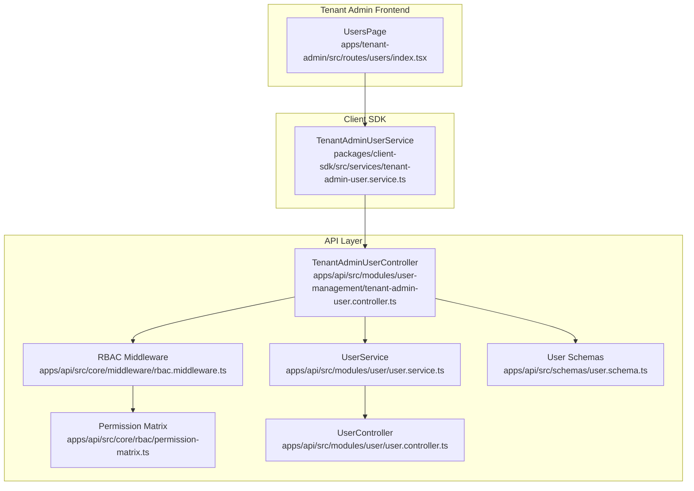
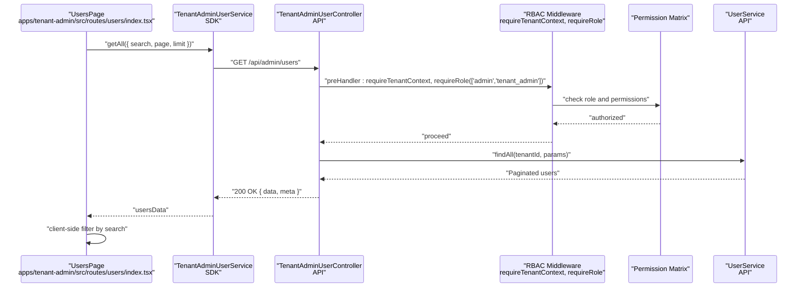
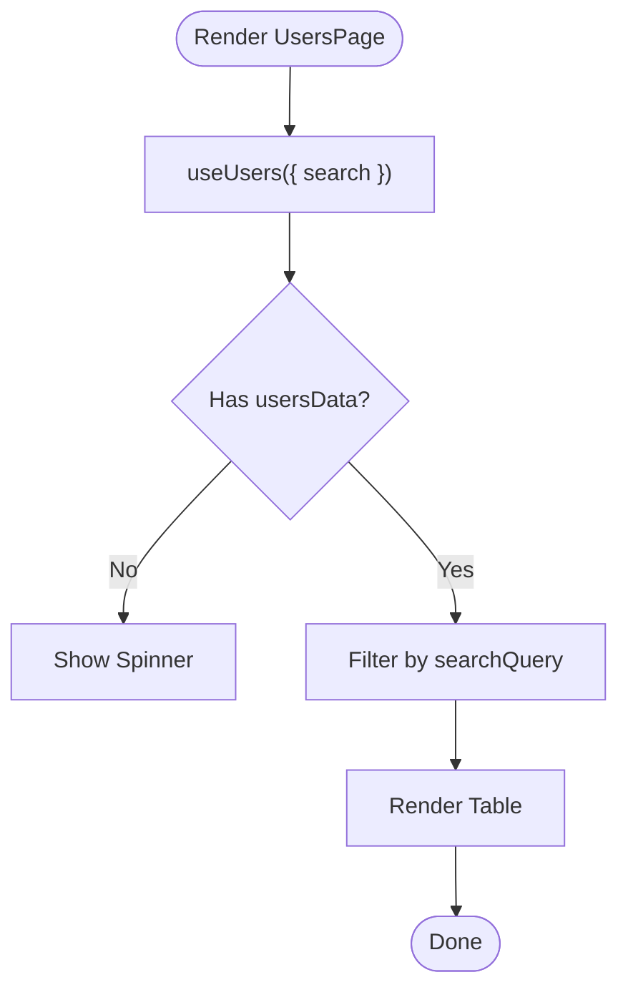
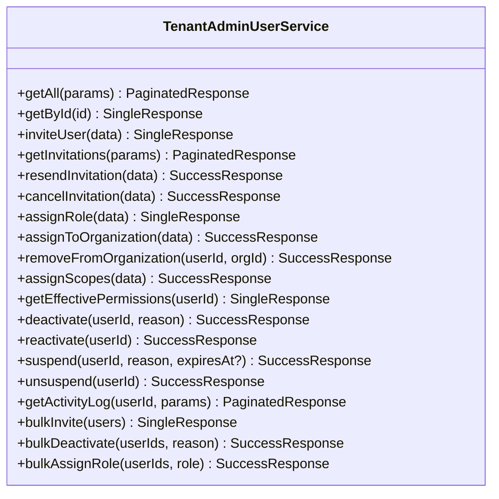
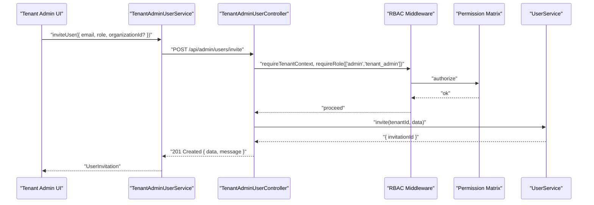
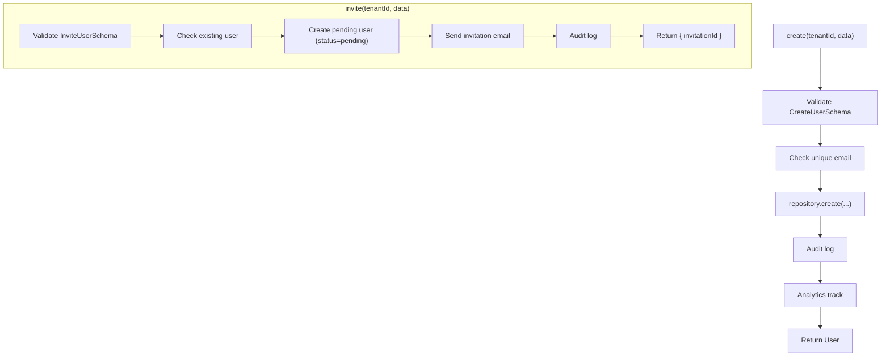
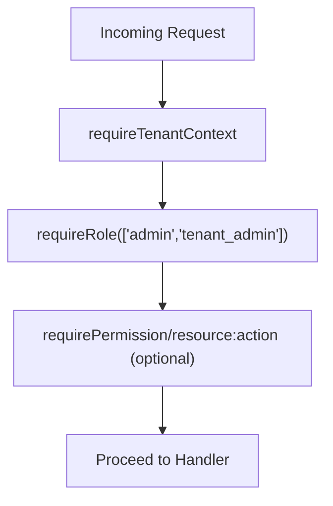
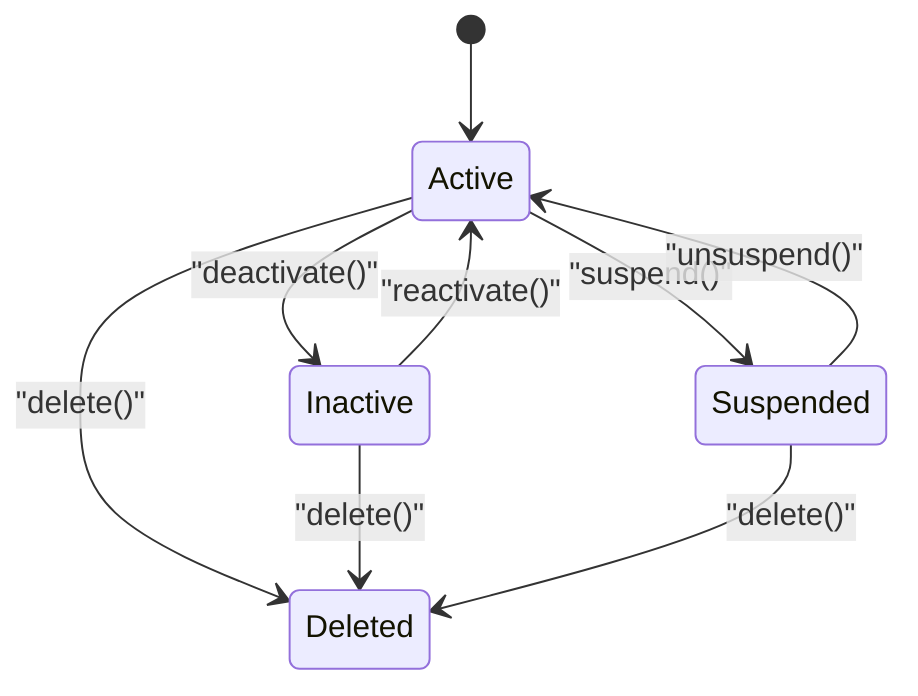
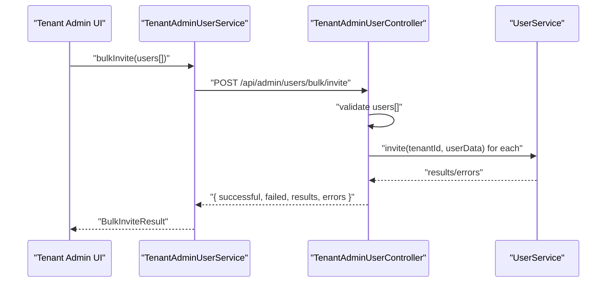
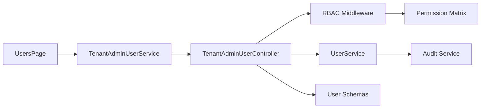

# User Management

<cite>
**Referenced Files in This Document**
- [apps/tenant-admin/src/routes/users/index.tsx](file://apps/tenant-admin/src/routes/users/index.tsx)
- [packages/client-sdk/src/services/tenant-admin-user.service.ts](file://packages/client-sdk/src/services/tenant-admin-user.service.ts)
- [apps/api/src/modules/user-management/tenant-admin-user.controller.ts](file://apps/api/src/modules/user-management/tenant-admin-user.controller.ts)
- [apps/api/src/modules/user/user.service.ts](file://apps/api/src/modules/user/user.service.ts)
- [apps/api/src/modules/user/user.controller.ts](file://apps/api/src/modules/user/user.controller.ts)
- [apps/api/src/core/middleware/rbac.middleware.ts](file://apps/api/src/core/middleware/rbac.middleware.ts)
- [apps/api/src/core/rbac/permission-matrix.ts](file://apps/api/src/core/rbac/permission-matrix.ts)
- [apps/api/src/schemas/user.schema.ts](file://apps/api/src/schemas/user.schema.ts)
</cite>

## Table of Contents
1. [Introduction](#introduction)
2. [Project Structure](#project-structure)
3. [Core Components](#core-components)
4. [Architecture Overview](#architecture-overview)
5. [Detailed Component Analysis](#detailed-component-analysis)
6. [Dependency Analysis](#dependency-analysis)
7. [Performance Considerations](#performance-considerations)
8. [Troubleshooting Guide](#troubleshooting-guide)
9. [Conclusion](#conclusion)

## Introduction
This document describes the User Management functionality within the Tenant Admin application. It covers user administration features such as user creation, modification, role assignment, and permission management. It also documents the user listing interface, search and filtering capabilities, bulk user operations, integration with the platform’s RBAC system, tenant administrators’ access control, user lifecycle management, account status controls, and user profile administration.

## Project Structure
The User Management feature spans three layers:
- Frontend (Tenant Admin): Provides the user listing UI, search/filtering, and navigation to create actions.
- Client SDK: Encapsulates typed APIs for user operations and pagination.
- Backend API: Implements REST endpoints, validation, RBAC enforcement, and business logic.

**Diagram sources**
- [apps/tenant-admin/src/routes/users/index.tsx](file://apps/tenant-admin/src/routes/users/index.tsx#L1-L135)
- [packages/client-sdk/src/services/tenant-admin-user.service.ts](file://packages/client-sdk/src/services/tenant-admin-user.service.ts#L126-L319)
- [apps/api/src/modules/user-management/tenant-admin-user.controller.ts](file://apps/api/src/modules/user-management/tenant-admin-user.controller.ts#L36-L543)
- [apps/api/src/core/middleware/rbac.middleware.ts](file://apps/api/src/core/middleware/rbac.middleware.ts#L108-L132)
- [apps/api/src/core/rbac/permission-matrix.ts](file://apps/api/src/core/rbac/permission-matrix.ts#L45-L215)
- [apps/api/src/modules/user/user.service.ts](file://apps/api/src/modules/user/user.service.ts#L28-L305)
- [apps/api/src/modules/user/user.controller.ts](file://apps/api/src/modules/user/user.controller.ts#L19-L159)
- [apps/api/src/schemas/user.schema.ts](file://apps/api/src/schemas/user.schema.ts#L88-L98)

**Section sources**
- [apps/tenant-admin/src/routes/users/index.tsx](file://apps/tenant-admin/src/routes/users/index.tsx#L1-L135)
- [packages/client-sdk/src/services/tenant-admin-user.service.ts](file://packages/client-sdk/src/services/tenant-admin-user.service.ts#L126-L319)
- [apps/api/src/modules/user-management/tenant-admin-user.controller.ts](file://apps/api/src/modules/user-management/tenant-admin-user.controller.ts#L36-L543)
- [apps/api/src/modules/user/user.service.ts](file://apps/api/src/modules/user/user.service.ts#L28-L305)
- [apps/api/src/modules/user/user.controller.ts](file://apps/api/src/modules/user/user.controller.ts#L19-L159)
- [apps/api/src/core/middleware/rbac.middleware.ts](file://apps/api/src/core/middleware/rbac.middleware.ts#L108-L132)
- [apps/api/src/core/rbac/permission-matrix.ts](file://apps/api/src/core/rbac/permission-matrix.ts#L45-L215)
- [apps/api/src/schemas/user.schema.ts](file://apps/api/src/schemas/user.schema.ts#L88-L98)

## Core Components
- Tenant Admin Users Page: Renders a paginated table of users with search and a Create button. It fetches data via the SDK hook and applies client-side filtering.
- Tenant Admin User Service: Provides typed methods for listing, inviting, role assignment, organization assignment, status changes, bulk operations, and retrieving effective permissions.
- Tenant Admin User Controller: Exposes REST endpoints for user listing, retrieval, invitations, role/organization assignment, deactivation/reactivation/suspension, bulk operations, and effective permissions.
- User Service: Implements core user operations (create, invite, update, assign role, deactivate/delete) with validation, audit logging, and adapter hooks.
- RBAC Middleware and Permission Matrix: Enforce role-based access control and compute permissions for requests.
- User Schemas: Define validation for user operations and query parameters.

**Section sources**
- [apps/tenant-admin/src/routes/users/index.tsx](file://apps/tenant-admin/src/routes/users/index.tsx#L26-L132)
- [packages/client-sdk/src/services/tenant-admin-user.service.ts](file://packages/client-sdk/src/services/tenant-admin-user.service.ts#L126-L319)
- [apps/api/src/modules/user-management/tenant-admin-user.controller.ts](file://apps/api/src/modules/user-management/tenant-admin-user.controller.ts#L46-L68)
- [apps/api/src/modules/user/user.service.ts](file://apps/api/src/modules/user/user.service.ts#L38-L75)
- [apps/api/src/core/middleware/rbac.middleware.ts](file://apps/api/src/core/middleware/rbac.middleware.ts#L108-L132)
- [apps/api/src/core/rbac/permission-matrix.ts](file://apps/api/src/core/rbac/permission-matrix.ts#L45-L215)
- [apps/api/src/schemas/user.schema.ts](file://apps/api/src/schemas/user.schema.ts#L88-L98)

## Architecture Overview
The Tenant Admin user management follows a layered architecture:
- UI layer (Tenant Admin) renders the Users page and triggers SDK operations.
- SDK layer encapsulates HTTP calls and exposes strongly-typed methods.
- API controller validates inputs, enforces RBAC, and delegates to the user service.
- User service executes business logic, persists changes, logs audits, and integrates with adapters.
- RBAC middleware and permission matrix ensure tenant-level access and role-based permissions.

**Diagram sources**
- [apps/tenant-admin/src/routes/users/index.tsx](file://apps/tenant-admin/src/routes/users/index.tsx#L31-L46)
- [packages/client-sdk/src/services/tenant-admin-user.service.ts](file://packages/client-sdk/src/services/tenant-admin-user.service.ts#L135-L139)
- [apps/api/src/modules/user-management/tenant-admin-user.controller.ts](file://apps/api/src/modules/user-management/tenant-admin-user.controller.ts#L46-L68)
- [apps/api/src/core/middleware/rbac.middleware.ts](file://apps/api/src/core/middleware/rbac.middleware.ts#L292-L304)
- [apps/api/src/core/rbac/permission-matrix.ts](file://apps/api/src/core/rbac/permission-matrix.ts#L45-L215)
- [apps/api/src/modules/user/user.service.ts](file://apps/api/src/modules/user/user.service.ts#L150-L157)

## Detailed Component Analysis

### Users Listing and Search (Frontend)
- Fetches users with optional search term.
- Applies client-side filtering by name, email, or ID.
- Displays a table with user name, email, and active status.
- Provides a Create button for adding new users.

**Diagram sources**
- [apps/tenant-admin/src/routes/users/index.tsx](file://apps/tenant-admin/src/routes/users/index.tsx#L31-L46)
- [apps/tenant-admin/src/routes/users/index.tsx](file://apps/tenant-admin/src/routes/users/index.tsx#L100-L128)

**Section sources**
- [apps/tenant-admin/src/routes/users/index.tsx](file://apps/tenant-admin/src/routes/users/index.tsx#L26-L132)

### SDK Service Methods (Tenant Admin)
- getAll(params): Paginated listing with role, status, organizationId, search, sort, and limit.
- getById(id): Retrieve a single user.
- inviteUser(data): Invite a new user; returns invitation details.
- getInvitations(params): List pending invitations.
- resendInvitation(data), cancelInvitation(data): Manage invitations.
- assignRole(data), assignToOrganization(data), removeFromOrganization(userId, orgId): Role and organization assignment.
- assignScopes(data): Delegate scopes (organization/rental object/category) with permissions.
- getEffectivePermissions(userId): Compute effective permissions for a user.
- deactivate/reactivate/suspend/unsuspend(userId, reason, expiresAt): Lifecycle controls.
- getActivityLog(userId, params): Retrieve user activity log.
- bulkInvite(users), bulkDeactivate(userIds, reason), bulkAssignRole(userIds, role): Bulk operations.

**Diagram sources**
- [packages/client-sdk/src/services/tenant-admin-user.service.ts](file://packages/client-sdk/src/services/tenant-admin-user.service.ts#L126-L319)

**Section sources**
- [packages/client-sdk/src/services/tenant-admin-user.service.ts](file://packages/client-sdk/src/services/tenant-admin-user.service.ts#L126-L319)

### API Controller Endpoints (Tenant Admin)
- GET /api/admin/users: List users with pagination and filters (role, status, organizationId, search).
- GET /api/admin/users/:id: Get user by ID.
- POST /api/admin/users/invite: Invite a user.
- POST /api/admin/users/:id/role: Assign role.
- POST /api/admin/users/:id/organization: Assign user to organization.
- DELETE /api/admin/users/:id/organization/:orgId: Remove user from organization.
- POST /api/admin/users/:id/deactivate, :id/reactivate, :id/suspend, :id/unsuspend: Lifecycle controls.
- GET /api/admin/users/:id/effective-permissions: Compute effective permissions.
- GET /api/admin/users/:id/activity: Retrieve activity log.
- GET /api/admin/users/invitations: List pending invitations.
- POST /api/admin/users/invitations/:id/resend, :id/cancel: Manage invitations.
- POST /api/admin/users/bulk/invite, bulk/deactivate, bulk/assign-role: Bulk operations.

**Diagram sources**
- [apps/api/src/modules/user-management/tenant-admin-user.controller.ts](file://apps/api/src/modules/user-management/tenant-admin-user.controller.ts#L85-L98)
- [apps/api/src/core/middleware/rbac.middleware.ts](file://apps/api/src/core/middleware/rbac.middleware.ts#L108-L132)
- [apps/api/src/core/rbac/permission-matrix.ts](file://apps/api/src/core/rbac/permission-matrix.ts#L45-L215)
- [apps/api/src/modules/user/user.service.ts](file://apps/api/src/modules/user/user.service.ts#L80-L120)

**Section sources**
- [apps/api/src/modules/user-management/tenant-admin-user.controller.ts](file://apps/api/src/modules/user-management/tenant-admin-user.controller.ts#L46-L398)

### User Service Operations
- create(tenantId, data): Validates input, checks uniqueness, creates user, logs audit, tracks analytics.
- invite(tenantId, data): Validates input, ensures no existing user, creates pending user, sends invitation email, logs audit.
- findAll(tenantId, params): Validates query params and returns paginated results.
- update(id, data), assignRole(id, data), deactivate(id): Updates user attributes, role, or status; logs audit.
- delete(id): Permanently deletes user; logs audit.

**Diagram sources**
- [apps/api/src/modules/user/user.service.ts](file://apps/api/src/modules/user/user.service.ts#L38-L75)
- [apps/api/src/modules/user/user.service.ts](file://apps/api/src/modules/user/user.service.ts#L80-L120)

**Section sources**
- [apps/api/src/modules/user/user.service.ts](file://apps/api/src/modules/user/user.service.ts#L28-L305)

### RBAC Integration and Permissions
- requireTenantContext: Ensures tenant context is present.
- requireRole(['admin','tenant_admin']): Restricts endpoints to authorized tenant-level roles.
- Permission Matrix: Defines resource:action permissions for system and backoffice roles.
- Effective Permissions Endpoint: Returns computed permissions for a user (placeholder logic currently).

**Diagram sources**
- [apps/api/src/core/middleware/rbac.middleware.ts](file://apps/api/src/core/middleware/rbac.middleware.ts#L292-L304)
- [apps/api/src/core/middleware/rbac.middleware.ts](file://apps/api/src/core/middleware/rbac.middleware.ts#L108-L132)
- [apps/api/src/core/rbac/permission-matrix.ts](file://apps/api/src/core/rbac/permission-matrix.ts#L45-L215)
- [apps/api/src/modules/user-management/tenant-admin-user.controller.ts](file://apps/api/src/modules/user-management/tenant-admin-user.controller.ts#L248-L287)

**Section sources**
- [apps/api/src/core/middleware/rbac.middleware.ts](file://apps/api/src/core/middleware/rbac.middleware.ts#L108-L132)
- [apps/api/src/core/rbac/permission-matrix.ts](file://apps/api/src/core/rbac/permission-matrix.ts#L45-L215)
- [apps/api/src/modules/user-management/tenant-admin-user.controller.ts](file://apps/api/src/modules/user-management/tenant-admin-user.controller.ts#L248-L287)

### User Lifecycle Management and Account Status Controls
- Deactivate: Prevents login while preserving data.
- Reactivate: Restores access for previously deactivated users.
- Suspend: Temporarily restricts access (placeholder endpoint).
- Unsuspend: Reinstates access after suspension.
- Delete: Permanently removes user (service supports deletion).

**Diagram sources**
- [apps/api/src/modules/user-management/tenant-admin-user.controller.ts](file://apps/api/src/modules/user-management/tenant-admin-user.controller.ts#L170-L244)
- [apps/api/src/modules/user/user.service.ts](file://apps/api/src/modules/user/user.service.ts#L200-L235)

**Section sources**
- [apps/api/src/modules/user-management/tenant-admin-user.controller.ts](file://apps/api/src/modules/user-management/tenant-admin-user.controller.ts#L170-L244)
- [apps/api/src/modules/user/user.service.ts](file://apps/api/src/modules/user/user.service.ts#L200-L235)

### Bulk User Operations
- Bulk Invite: Accepts an array of user invitations; returns successes and failures.
- Bulk Deactivate: Accepts an array of user IDs; returns successes and failures.
- Bulk Assign Role: Accepts an array of user IDs and target role; returns successes and failures.

**Diagram sources**
- [packages/client-sdk/src/services/tenant-admin-user.service.ts](file://packages/client-sdk/src/services/tenant-admin-user.service.ts#L296-L301)
- [apps/api/src/modules/user-management/tenant-admin-user.controller.ts](file://apps/api/src/modules/user-management/tenant-admin-user.controller.ts#L401-L444)

**Section sources**
- [packages/client-sdk/src/services/tenant-admin-user.service.ts](file://packages/client-sdk/src/services/tenant-admin-user.service.ts#L296-L315)
- [apps/api/src/modules/user-management/tenant-admin-user.controller.ts](file://apps/api/src/modules/user-management/tenant-admin-user.controller.ts#L401-L444)

### Search and Filtering Capabilities
- Frontend: Client-side search across name, email, and ID.
- Backend: Query parameters support role, status, organizationId, search, page, limit, sort, and order.

**Section sources**
- [apps/tenant-admin/src/routes/users/index.tsx](file://apps/tenant-admin/src/routes/users/index.tsx#L37-L46)
- [apps/api/src/schemas/user.schema.ts](file://apps/api/src/schemas/user.schema.ts#L88-L98)
- [apps/api/src/modules/user/user.controller.ts](file://apps/api/src/modules/user/user.controller.ts#L28-L43)

### Profile Administration
- Current user profile: Available via dedicated endpoints.
- Consent management: Retrieval and update endpoints for user consents.

**Section sources**
- [apps/api/src/modules/user/user.controller.ts](file://apps/api/src/modules/user/user.controller.ts#L48-L79)
- [apps/api/src/modules/user/user.service.ts](file://apps/api/src/modules/user/user.service.ts#L238-L303)

## Dependency Analysis
- UI depends on SDK hooks/services.
- SDK depends on API base path and typed DTOs.
- API controller depends on RBAC middleware and schemas.
- API controller delegates to UserService.
- UserService depends on repositories and adapters; logs via audit service.

**Diagram sources**
- [apps/tenant-admin/src/routes/users/index.tsx](file://apps/tenant-admin/src/routes/users/index.tsx#L23-L33)
- [packages/client-sdk/src/services/tenant-admin-user.service.ts](file://packages/client-sdk/src/services/tenant-admin-user.service.ts#L126-L139)
- [apps/api/src/modules/user-management/tenant-admin-user.controller.ts](file://apps/api/src/modules/user-management/tenant-admin-user.controller.ts#L36-L68)
- [apps/api/src/core/middleware/rbac.middleware.ts](file://apps/api/src/core/middleware/rbac.middleware.ts#L108-L132)
- [apps/api/src/core/rbac/permission-matrix.ts](file://apps/api/src/core/rbac/permission-matrix.ts#L45-L215)
- [apps/api/src/modules/user/user.service.ts](file://apps/api/src/modules/user/user.service.ts#L59-L74)
- [apps/api/src/schemas/user.schema.ts](file://apps/api/src/schemas/user.schema.ts#L88-L98)

**Section sources**
- [apps/tenant-admin/src/routes/users/index.tsx](file://apps/tenant-admin/src/routes/users/index.tsx#L23-L33)
- [packages/client-sdk/src/services/tenant-admin-user.service.ts](file://packages/client-sdk/src/services/tenant-admin-user.service.ts#L126-L139)
- [apps/api/src/modules/user-management/tenant-admin-user.controller.ts](file://apps/api/src/modules/user-management/tenant-admin-user.controller.ts#L36-L68)
- [apps/api/src/core/middleware/rbac.middleware.ts](file://apps/api/src/core/middleware/rbac.middleware.ts#L108-L132)
- [apps/api/src/core/rbac/permission-matrix.ts](file://apps/api/src/core/rbac/permission-matrix.ts#L45-L215)
- [apps/api/src/modules/user/user.service.ts](file://apps/api/src/modules/user/user.service.ts#L59-L74)
- [apps/api/src/schemas/user.schema.ts](file://apps/api/src/schemas/user.schema.ts#L88-L98)

## Performance Considerations
- Pagination: Use page and limit parameters to avoid large payloads.
- Client-side filtering: Keep searchQuery minimal and avoid unnecessary re-renders.
- Bulk operations: Prefer batch endpoints to reduce round trips.
- RBAC checks: Ensure middleware is applied early to fail fast on unauthorized requests.

## Troubleshooting Guide
- Authentication/Authorization errors: Verify tenant context and required roles.
- Validation errors: Ensure request bodies conform to schemas (Zod validation).
- Invitation issues: Confirm pending status and implement resend/cancel logic.
- Activity log: Endpoint returns empty data; implement audit logging integration.
- Effective permissions: Placeholder logic; extend to compute inherited permissions and scopes.

**Section sources**
- [apps/api/src/core/middleware/rbac.middleware.ts](file://apps/api/src/core/middleware/rbac.middleware.ts#L108-L132)
- [apps/api/src/schemas/user.schema.ts](file://apps/api/src/schemas/user.schema.ts#L88-L98)
- [apps/api/src/modules/user-management/tenant-admin-user.controller.ts](file://apps/api/src/modules/user-management/tenant-admin-user.controller.ts#L314-L341)
- [apps/api/src/modules/user-management/tenant-admin-user.controller.ts](file://apps/api/src/modules/user-management/tenant-admin-user.controller.ts#L291-L311)
- [apps/api/src/modules/user-management/tenant-admin-user.controller.ts](file://apps/api/src/modules/user-management/tenant-admin-user.controller.ts#L252-L287)

## Conclusion
The Tenant Admin User Management feature provides a comprehensive set of capabilities for tenant administrators to manage users within their organization. It combines a user-friendly UI, a robust SDK, and a secure backend with strict RBAC enforcement. The system supports listing, searching, role and organization assignment, lifecycle controls, bulk operations, and permission computation. Extending the effective permissions and activity log endpoints will further enhance visibility and governance.