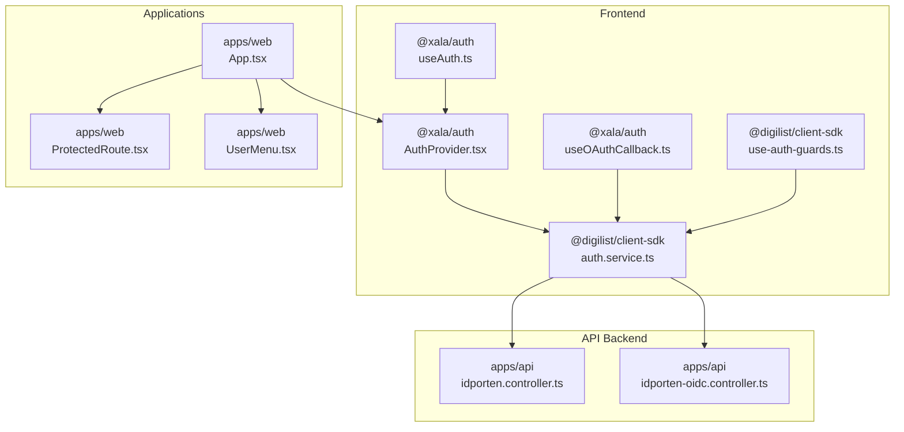
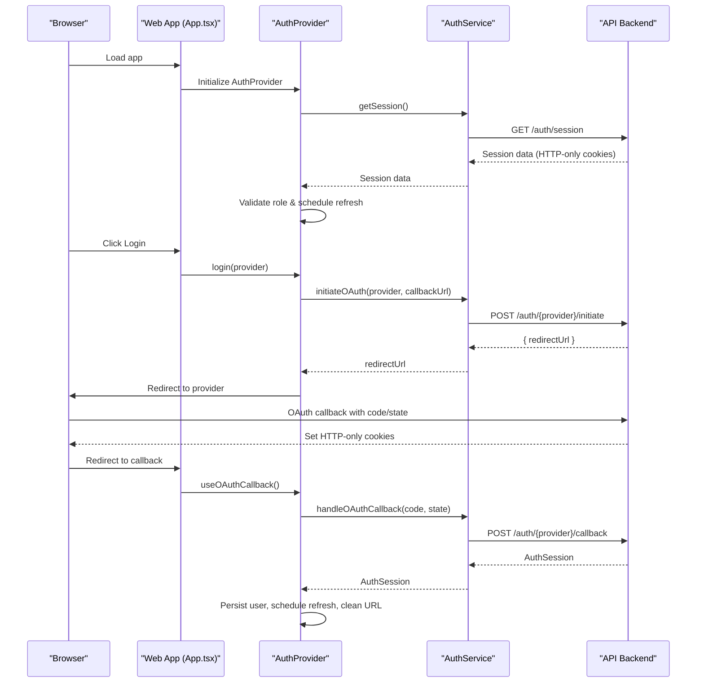
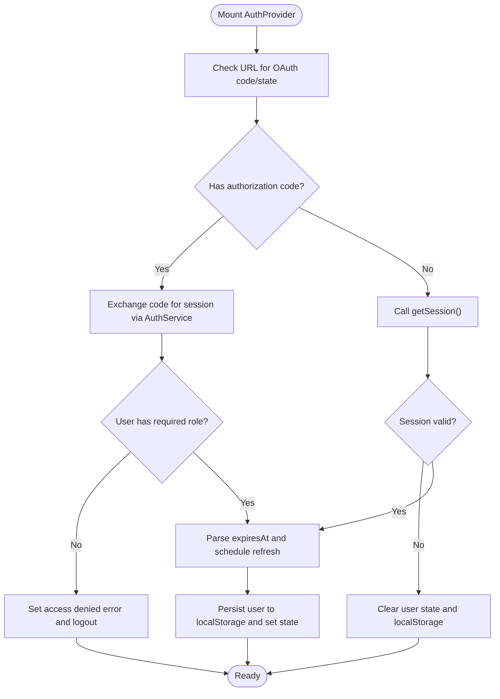
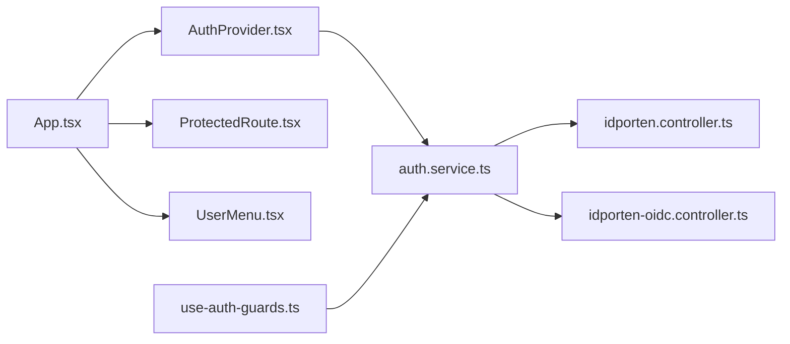

# Authentication and User Management

<cite>
**Referenced Files in This Document**
- [AuthProvider.tsx](file://packages/auth/src/providers/AuthProvider.tsx)
- [useOAuthCallback.ts](file://packages/auth/src/hooks/useOAuthCallback.ts)
- [useAuth.ts](file://packages/auth/src/hooks/useAuth.ts)
- [types/index.ts](file://packages/auth/src/types/index.ts)
- [ProtectedRoute.tsx](file://apps/web/src/components/ProtectedRoute.tsx)
- [App.tsx](file://apps/web/src/App.tsx)
- [UserMenu.tsx](file://apps/web/src/components/UserMenu.tsx)
- [auth.service.ts](file://packages/client-sdk/src/services/auth.service.ts)
- [use-auth-guards.ts](file://packages/client-sdk/src/hooks/use-auth-guards.ts)
- [session-storage.ts](file://packages/client-sdk/src/utils/session-storage.ts)
- [idporten.controller.ts](file://apps/api/src/modules/auth/idporten.controller.ts)
- [idporten-oidc.controller.ts](file://apps/api/src/modules/auth/idporten-oidc.controller.ts)
- [web-login-flow.spec.ts](file://tests/e2e/web-login-flow.spec.ts)
- [rbac-flow.test.ts](file://tests/integration/rbac-flow.test.ts)
- [auth-performance.test.ts](file://tests/performance/auth-performance.test.ts)
- [SIGNICAT_BANKID_AUTHENTICATION.md](file://docs/guides/SIGNICAT_BANKID_AUTHENTICATION.md)
</cite>

## Table of Contents
1. [Introduction](#introduction)
2. [Project Structure](#project-structure)
3. [Core Components](#core-components)
4. [Architecture Overview](#architecture-overview)
5. [Detailed Component Analysis](#detailed-component-analysis)
6. [Dependency Analysis](#dependency-analysis)
7. [Performance Considerations](#performance-considerations)
8. [Troubleshooting Guide](#troubleshooting-guide)
9. [Conclusion](#conclusion)

## Introduction
This document explains the unified authentication and user management system across the Xala/Digilist monorepo. It covers the @xala/auth package integration, OAuth callback handling, authentication state management, login flows, session handling, automatic redirects, protected routing, user menu and logout, authentication state persistence, provider integrations (ID-porten and BankID), token management, session lifecycle, UI components for authentication status and login buttons, security considerations, error handling, and best practices for maintaining sessions across browser refreshes.

## Project Structure
The authentication system spans three primary layers:
- Frontend package (@xala/auth) providing the AuthProvider, hooks, and types
- Client SDK (@digilist/client-sdk) offering service abstractions and guard utilities
- API backend (apps/api) implementing OIDC and session management

**Diagram sources**
- [AuthProvider.tsx](file://packages/auth/src/providers/AuthProvider.tsx#L125-L592)
- [useOAuthCallback.ts](file://packages/auth/src/hooks/useOAuthCallback.ts#L1-L52)
- [useAuth.ts](file://packages/auth/src/hooks/useAuth.ts#L1-L21)
- [auth.service.ts](file://packages/client-sdk/src/services/auth.service.ts#L125-L304)
- [use-auth-guards.ts](file://packages/client-sdk/src/hooks/use-auth-guards.ts#L43-L100)
- [App.tsx](file://apps/web/src/App.tsx#L255-L275)
- [ProtectedRoute.tsx](file://apps/web/src/components/ProtectedRoute.tsx#L97-L187)
- [UserMenu.tsx](file://apps/web/src/components/UserMenu.tsx#L36-L193)
- [idporten.controller.ts](file://apps/api/src/modules/auth/idporten.controller.ts#L239-L700)
- [idporten-oidc.controller.ts](file://apps/api/src/modules/auth/idporten-oidc.controller.ts#L148-L193)

**Section sources**
- [AuthProvider.tsx](file://packages/auth/src/providers/AuthProvider.tsx#L1-L592)
- [auth.service.ts](file://packages/client-sdk/src/services/auth.service.ts#L125-L304)
- [App.tsx](file://apps/web/src/App.tsx#L255-L275)

## Core Components
- AuthProvider: Central authentication provider managing session initialization, OAuth callbacks, role checks, token refresh scheduling, logout, and flow context restoration.
- useAuth: Hook to consume authentication state and actions from AuthProvider.
- useOAuthCallback: Hook to handle OAuth redirects with token parameters and establish session.
- ProtectedRoute: Route wrapper ensuring only authenticated users can access protected paths and preserving flow context.
- UserMenu: Dropdown menu for authenticated users with logout and portal navigation.
- AuthService: Client SDK service exposing session, providers, OAuth initiation, callback handling, logout, and token refresh.
- Guard utilities: Hooks and utilities to manage session restoration and redirect guards.

**Section sources**
- [AuthProvider.tsx](file://packages/auth/src/providers/AuthProvider.tsx#L125-L592)
- [useAuth.ts](file://packages/auth/src/hooks/useAuth.ts#L1-L21)
- [useOAuthCallback.ts](file://packages/auth/src/hooks/useOAuthCallback.ts#L1-L52)
- [ProtectedRoute.tsx](file://apps/web/src/components/ProtectedRoute.tsx#L97-L187)
- [UserMenu.tsx](file://apps/web/src/components/UserMenu.tsx#L36-L193)
- [auth.service.ts](file://packages/client-sdk/src/services/auth.service.ts#L125-L304)
- [use-auth-guards.ts](file://packages/client-sdk/src/hooks/use-auth-guards.ts#L43-L100)

## Architecture Overview
The system follows HTTP-only cookie-based authentication across subdomains for SSO, with OAuth 2.0 Authorization Code flow and OIDC verification. The frontend initializes authentication, exchanges authorization codes for sessions, schedules token refreshes, and preserves user intent across redirects.

**Diagram sources**
- [App.tsx](file://apps/web/src/App.tsx#L170-L175)
- [AuthProvider.tsx](file://packages/auth/src/providers/AuthProvider.tsx#L240-L437)
- [auth.service.ts](file://packages/client-sdk/src/services/auth.service.ts#L297-L304)
- [idporten.controller.ts](file://apps/api/src/modules/auth/idporten.controller.ts#L239-L700)

## Detailed Component Analysis

### AuthProvider: Central Authentication State Manager
- Initializes authentication on mount by checking URL for OAuth callback parameters, validating existing sessions, and scheduling token refreshes.
- Supports role-based access control per app type and enforces access denied messaging.
- Provides login, logout, role checks, and flow context restoration/clearing utilities.
- Manages cross-tab synchronization via storage events and notifies subscribers when flow context changes.

**Diagram sources**
- [AuthProvider.tsx](file://packages/auth/src/providers/AuthProvider.tsx#L240-L437)

**Section sources**
- [AuthProvider.tsx](file://packages/auth/src/providers/AuthProvider.tsx#L125-L592)
- [types/index.ts](file://packages/auth/src/types/index.ts#L58-L144)

### useOAuthCallback: OAuth Redirect Handler
- Watches URL for token and auth_success parameters, sets the SDK auth token, stores it in localStorage, cleans URL parameters, reloads to apply auth state, and triggers session restoration.

**Section sources**
- [useOAuthCallback.ts](file://packages/auth/src/hooks/useOAuthCallback.ts#L1-L52)
- [use-auth-guards.ts](file://packages/client-sdk/src/hooks/use-auth-guards.ts#L63-L99)

### ProtectedRoute: Securing Authenticated Routes
- Preserves full navigation context (including form state) in sessionStorage before redirecting unauthenticated users to login.
- Restores context after successful authentication and prevents redirect loops.
- Supports tenant-aware return-to handling and minimal state in URL for backwards compatibility.

**Section sources**
- [ProtectedRoute.tsx](file://apps/web/src/components/ProtectedRoute.tsx#L97-L187)

### UserMenu: Authentication UI and Logout
- Displays authenticated user name and avatar, opens a dropdown with navigation to the user portal and logout.
- Calls the logout function from useAuth, which clears local state, notifies subscribers, invalidates server-side session, and navigates to login.

**Section sources**
- [UserMenu.tsx](file://apps/web/src/components/UserMenu.tsx#L36-L193)
- [App.tsx](file://apps/web/src/App.tsx#L141-L145)

### AuthService: Client SDK Authentication Services
- refreshToken: Periodically refreshes the session before expiration.
- getProviders: Lists available OAuth/OIDC providers.
- handleOAuthCallback: Exchanges authorization code for session with HTTP-only cookies set server-side.
- Other methods: initiateOAuth, getSession, logout, resumeFlow, and related utilities.

**Section sources**
- [auth.service.ts](file://packages/client-sdk/src/services/auth.service.ts#L125-L304)

### API Integrations: ID-porten and BankID
- ID-porten controller orchestrates session creation with Signicat, sets success/abort/error callbacks, creates HTTP-only cookies, and audits login events.
- OIDC controller handles token exchange and ID token verification for ID-porten.
- BankID guide documents the Signicat integration flow for Norwegian BankID.

**Section sources**
- [idporten.controller.ts](file://apps/api/src/modules/auth/idporten.controller.ts#L239-L700)
- [idporten-oidc.controller.ts](file://apps/api/src/modules/auth/idporten-oidc.controller.ts#L148-L193)
- [SIGNICAT_BANKID_AUTHENTICATION.md](file://docs/guides/SIGNICAT_BANKID_AUTHENTICATION.md#L160-L222)

## Dependency Analysis
- AuthProvider depends on AuthService for session management and OAuth operations.
- App.tsx composes AuthProvider and ProtectedRoute around application routes.
- UserMenu relies on useAuth for logout and user display.
- Guard utilities depend on AuthProvider state and SDK services for session restoration and redirect guards.
- API controllers depend on configuration and session stores to create and validate sessions.

**Diagram sources**
- [App.tsx](file://apps/web/src/App.tsx#L255-L275)
- [AuthProvider.tsx](file://packages/auth/src/providers/AuthProvider.tsx#L125-L592)
- [ProtectedRoute.tsx](file://apps/web/src/components/ProtectedRoute.tsx#L97-L187)
- [UserMenu.tsx](file://apps/web/src/components/UserMenu.tsx#L36-L193)
- [auth.service.ts](file://packages/client-sdk/src/services/auth.service.ts#L125-L304)
- [idporten.controller.ts](file://apps/api/src/modules/auth/idporten.controller.ts#L239-L700)
- [idporten-oidc.controller.ts](file://apps/api/src/modules/auth/idporten-oidc.controller.ts#L148-L193)
- [use-auth-guards.ts](file://packages/client-sdk/src/hooks/use-auth-guards.ts#L43-L100)

**Section sources**
- [AuthProvider.tsx](file://packages/auth/src/providers/AuthProvider.tsx#L125-L592)
- [auth.service.ts](file://packages/client-sdk/src/services/auth.service.ts#L125-L304)
- [App.tsx](file://apps/web/src/App.tsx#L255-L275)

## Performance Considerations
- Token refresh scheduling occurs 2 minutes before expiry to minimize downtime.
- Concurrent session validation performance is measured and optimized.
- RBAC permission retrieval latency is monitored to ensure responsive UI.

**Section sources**
- [AuthProvider.tsx](file://packages/auth/src/providers/AuthProvider.tsx#L194-L224)
- [auth-performance.test.ts](file://tests/performance/auth-performance.test.ts#L178-L220)

## Troubleshooting Guide
Common issues and resolutions:
- Session not persisting after refresh: Ensure HTTP-only cookies are set and readable by the API; verify domain and path settings.
- Redirect loops on login: ProtectedRoute prevents loops by checking the login path and minimal state in URL; confirm that login state is not malformed.
- Access denied errors: AuthProvider enforces role-based access; verify allowed roles per app type and user granted roles.
- Network errors on session load: Graceful handling displays login button; inspect network tab for failures.
- Logout not clearing state: AuthProvider clears local state and calls server-side logout; confirm both client and server steps complete.

**Section sources**
- [ProtectedRoute.tsx](file://apps/web/src/components/ProtectedRoute.tsx#L165-L184)
- [AuthProvider.tsx](file://packages/auth/src/providers/AuthProvider.tsx#L310-L328)
- [web-login-flow.spec.ts](file://tests/e2e/web-login-flow.spec.ts#L457-L466)
- [rbac-flow.test.ts](file://tests/integration/rbac-flow.test.ts#L406-L423)

## Conclusion
The authentication system provides a robust, secure, and scalable foundation for SSO across applications using HTTP-only cookies, OAuth 2.0, and OIDC. It integrates seamlessly with ID-porten and supports BankID via Signicat, while preserving user intent across redirects and maintaining resilient session lifecycles. The design emphasizes security, performance, and developer ergonomics through centralized providers, guard utilities, and comprehensive testing.