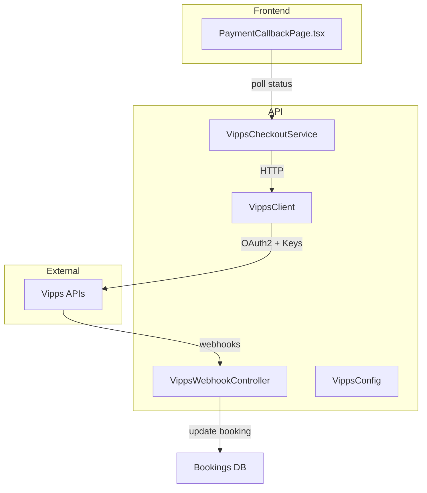
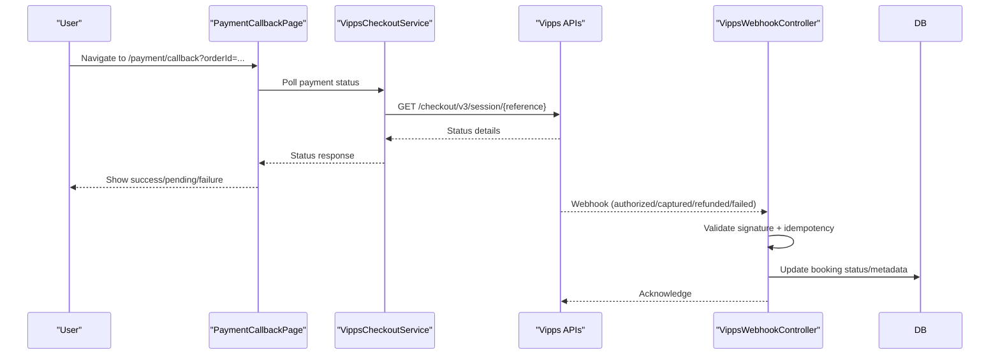
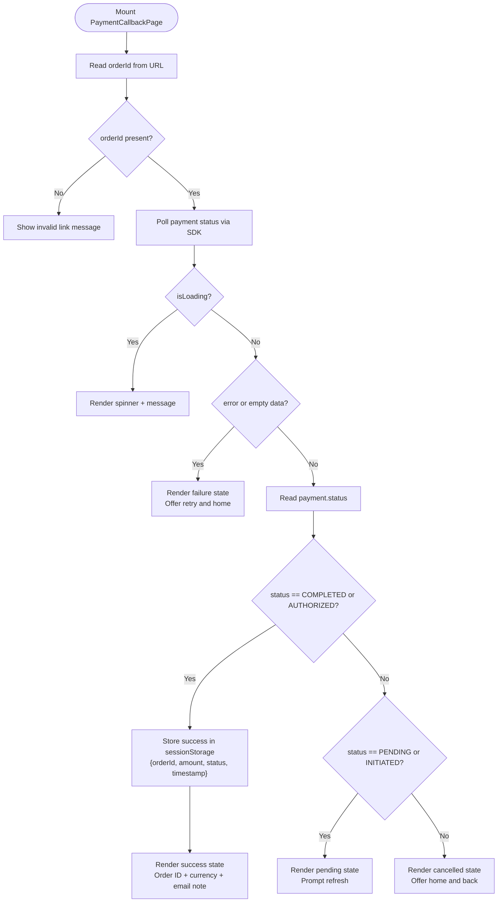
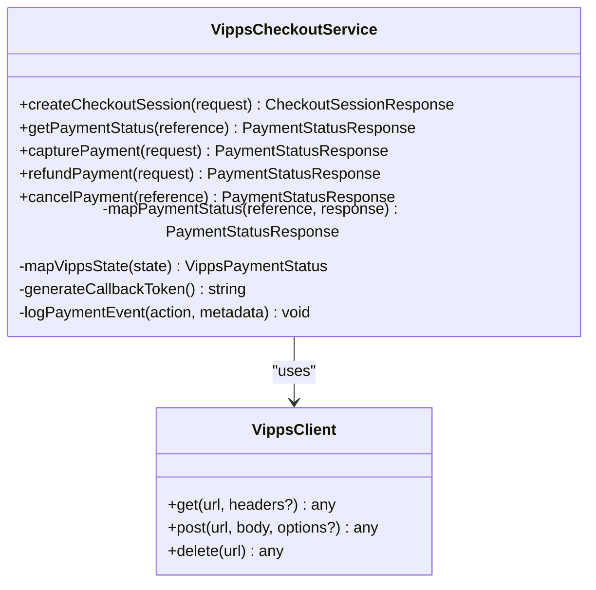
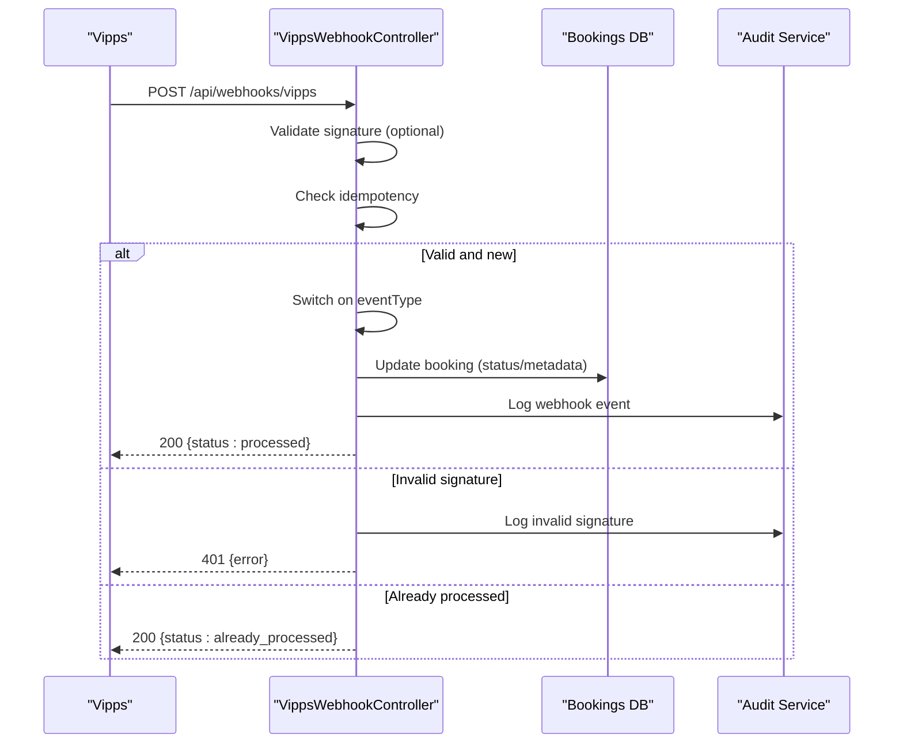
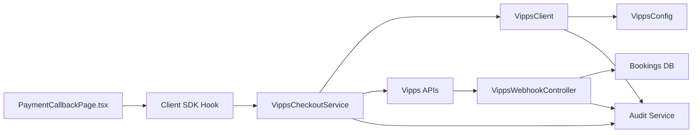

# Payment Processing

<cite>
**Referenced Files in This Document**
- [apps/web/src/pages/PaymentCallbackPage.tsx](file://apps/web/src/pages/PaymentCallbackPage.tsx)
- [apps/api/src/integrations/vipps/vipps-checkout.service.ts](file://apps/api/src/integrations/vipps/vipps-checkout.service.ts)
- [apps/api/src/modules/webhooks/vipps-webhook.controller.ts](file://apps/api/src/modules/webhooks/vipps-webhook.controller.ts)
- [apps/api/src/config/vipps.config.ts](file://apps/api/src/config/vipps.config.ts)
- [apps/api/src/integrations/vipps/vipps.client.ts](file://apps/api/src/integrations/vipps/vipps.client.ts)
- [packages/client-sdk/src/services/vipps.service.ts](file://packages/client-sdk/src/services/vipps.service.ts)
- [tests/journeys/vipps-payment.spec.ts](file://tests/journeys/vipps-payment.spec.ts)
</cite>

## Table of Contents
1. [Introduction](#introduction)
2. [Project Structure](#project-structure)
3. [Core Components](#core-components)
4. [Architecture Overview](#architecture-overview)
5. [Detailed Component Analysis](#detailed-component-analysis)
6. [Dependency Analysis](#dependency-analysis)
7. [Performance Considerations](#performance-considerations)
8. [Troubleshooting Guide](#troubleshooting-guide)
9. [Conclusion](#conclusion)

## Introduction
This document explains the Web Application’s payment processing system with a focus on the PaymentCallbackPage implementation and the end-to-end integration with the Vipps checkout service. It covers payment flow orchestration, callback URL handling, status tracking, error handling, user feedback, booking integration, invoice generation, reconciliation, security and PCI considerations, payment methods, currency handling, tax calculations, refund processing, and operational troubleshooting.

## Project Structure
The payment system spans three primary areas:
- Frontend callback page for user-facing status and feedback
- Backend Vipps checkout service for session creation, status retrieval, captures, and refunds
- Webhook controller for asynchronous payment lifecycle updates and booking reconciliation
- Configuration and client utilities for secure API access and endpoint resolution
- Client SDK for authentication and integration support

**Diagram sources**
- [apps/web/src/pages/PaymentCallbackPage.tsx](file://apps/web/src/pages/PaymentCallbackPage.tsx#L1-L301)
- [apps/api/src/integrations/vipps/vipps-checkout.service.ts](file://apps/api/src/integrations/vipps/vipps-checkout.service.ts#L1-L431)
- [apps/api/src/modules/webhooks/vipps-webhook.controller.ts](file://apps/api/src/modules/webhooks/vipps-webhook.controller.ts#L1-L439)
- [apps/api/src/integrations/vipps/vipps.client.ts](file://apps/api/src/integrations/vipps/vipps.client.ts#L1-L309)
- [apps/api/src/config/vipps.config.ts](file://apps/api/src/config/vipps.config.ts#L1-L257)

**Section sources**
- [apps/web/src/pages/PaymentCallbackPage.tsx](file://apps/web/src/pages/PaymentCallbackPage.tsx#L1-L301)
- [apps/api/src/integrations/vipps/vipps-checkout.service.ts](file://apps/api/src/integrations/vipps/vipps-checkout.service.ts#L1-L431)
- [apps/api/src/modules/webhooks/vipps-webhook.controller.ts](file://apps/api/src/modules/webhooks/vipps-webhook.controller.ts#L1-L439)
- [apps/api/src/config/vipps.config.ts](file://apps/api/src/config/vipps.config.ts#L1-L257)
- [apps/api/src/integrations/vipps/vipps.client.ts](file://apps/api/src/integrations/vipps/vipps.client.ts#L1-L309)

## Core Components
- PaymentCallbackPage: Frontend page that polls payment status via SDK hook, renders success/pending/failure states, and persists success metadata for downstream booking confirmation.
- VippsCheckoutService: Backend service orchestrating checkout sessions, payment status retrieval, capture, refund, and audit logging.
- VippsWebhookController: Receives and validates Vipps webhooks, applies idempotency, and reconciles payment events with booking records.
- VippsClient: Manages OAuth2 access tokens, request signing, error mapping, and request logging.
- VippsConfig: Centralized configuration loader and endpoint builder for Vipps APIs.
- Client SDK Vipps Service: Provides client-side integration utilities for authentication flows.

**Section sources**
- [apps/web/src/pages/PaymentCallbackPage.tsx](file://apps/web/src/pages/PaymentCallbackPage.tsx#L1-L301)
- [apps/api/src/integrations/vipps/vipps-checkout.service.ts](file://apps/api/src/integrations/vipps/vipps-checkout.service.ts#L1-L431)
- [apps/api/src/modules/webhooks/vipps-webhook.controller.ts](file://apps/api/src/modules/webhooks/vipps-webhook.controller.ts#L1-L439)
- [apps/api/src/integrations/vipps/vipps.client.ts](file://apps/api/src/integrations/vipps/vipps.client.ts#L1-L309)
- [apps/api/src/config/vipps.config.ts](file://apps/api/src/config/vipps.config.ts#L1-L257)
- [packages/client-sdk/src/services/vipps.service.ts](file://packages/client-sdk/src/services/vipps.service.ts#L1-L116)

## Architecture Overview
The payment flow integrates the frontend and backend as follows:
- The user initiates a booking and selects Vipps.
- The backend creates a Vipps checkout session and returns a redirect URL.
- The user completes the payment in Vipps.
- Vipps redirects the user to the PaymentCallbackPage with an order identifier.
- The frontend polls the backend via SDK hook to determine payment status.
- Vipps asynchronously notifies the backend via webhooks for authorization, capture, refund, and failure events.
- The backend updates the booking record and logs audit events.

**Diagram sources**
- [apps/web/src/pages/PaymentCallbackPage.tsx](file://apps/web/src/pages/PaymentCallbackPage.tsx#L22-L301)
- [apps/api/src/integrations/vipps/vipps-checkout.service.ts](file://apps/api/src/integrations/vipps/vipps-checkout.service.ts#L222-L241)
- [apps/api/src/modules/webhooks/vipps-webhook.controller.ts](file://apps/api/src/modules/webhooks/vipps-webhook.controller.ts#L108-L219)

## Detailed Component Analysis

### PaymentCallbackPage
Responsibilities:
- Extracts orderId from URL query parameters.
- Polls payment status using a client SDK hook.
- Renders loading, success, pending, and failure states.
- On success, stores payment metadata in sessionStorage for downstream booking confirmation.

Key behaviors:
- Validates presence of orderId; otherwise shows invalid link messaging.
- Uses spinner and localized headings/paragraphs for user feedback.
- Success state persists orderId, amount, currency, and timestamp to sessionStorage.
- Pending state prompts refresh; failure state offers navigation and retry actions.

**Diagram sources**
- [apps/web/src/pages/PaymentCallbackPage.tsx](file://apps/web/src/pages/PaymentCallbackPage.tsx#L22-L301)

**Section sources**
- [apps/web/src/pages/PaymentCallbackPage.tsx](file://apps/web/src/pages/PaymentCallbackPage.tsx#L1-L301)

### VippsCheckoutService
Responsibilities:
- Create checkout sessions with merchant callbacks, return URLs, and optional customer info.
- Retrieve payment status and map Vipps states to internal status codes.
- Capture authorized payments and process refunds with idempotency keys.
- Log audit events for all operations.

Key implementation details:
- Generates deterministic order references linking to booking identifiers.
- Builds checkout requests with environment-specific endpoints and callback tokens.
- Maps Vipps states to internal status set (CREATED, AUTHORIZED, CAPTURED, CANCELLED, REFUNDED, FAILED, EXPIRED).
- Applies idempotency for capture and refund operations.
- Emits audit logs for all significant actions.

**Diagram sources**
- [apps/api/src/integrations/vipps/vipps-checkout.service.ts](file://apps/api/src/integrations/vipps/vipps-checkout.service.ts#L147-L431)
- [apps/api/src/integrations/vipps/vipps.client.ts](file://apps/api/src/integrations/vipps/vipps.client.ts#L113-L309)

**Section sources**
- [apps/api/src/integrations/vipps/vipps-checkout.service.ts](file://apps/api/src/integrations/vipps/vipps-checkout.service.ts#L1-L431)

### VippsWebhookController
Responsibilities:
- Validate webhook authenticity using signatures and idempotency.
- Process events: authorized, captured, refunded, failed/cancelled.
- Update booking records with payment metadata and statuses.
- Emit audit logs for received, validated, processed, and failed events.

Security and reliability:
- Validates webhook signature when secret is configured.
- Enforces idempotency using an in-memory store with TTL.
- Extracts booking ID from payment reference to reconcile with bookings.
- Returns 500 on processing failures to trigger Vipps retries.

**Diagram sources**
- [apps/api/src/modules/webhooks/vipps-webhook.controller.ts](file://apps/api/src/modules/webhooks/vipps-webhook.controller.ts#L108-L219)

**Section sources**
- [apps/api/src/modules/webhooks/vipps-webhook.controller.ts](file://apps/api/src/modules/webhooks/vipps-webhook.controller.ts#L1-L439)

### VippsClient and VippsConfig
Responsibilities:
- VippsClient manages OAuth2 access tokens, adds required headers, signs requests, and maps errors to standardized AppError instances.
- VippsConfig loads and validates environment variables, builds endpoints, and exposes configuration for all Vipps integrations.

Key points:
- Token caching with expiration buffer.
- Idempotency header support for POST requests.
- RFC 7807 error mapping and audit logging for requests.
- Endpoint builders for Checkout, ePayment, and Webhooks APIs.

**Section sources**
- [apps/api/src/integrations/vipps/vipps.client.ts](file://apps/api/src/integrations/vipps/vipps.client.ts#L1-L309)
- [apps/api/src/config/vipps.config.ts](file://apps/api/src/config/vipps.config.ts#L1-L257)

### Client SDK Vipps Service
Provides client-side utilities for Vipps authentication flows and configuration retrieval. While not directly involved in payment callbacks, it supports the broader Vipps integration story.

**Section sources**
- [packages/client-sdk/src/services/vipps.service.ts](file://packages/client-sdk/src/services/vipps.service.ts#L1-L116)

## Dependency Analysis
- PaymentCallbackPage depends on the client SDK hook to poll payment status.
- VippsCheckoutService depends on VippsClient and VippsConfig for API access and endpoint resolution.
- VippsWebhookController depends on VippsConfig for endpoint building and on the database layer for booking updates.
- Audit logging is centralized and invoked across services for observability and compliance.

**Diagram sources**
- [apps/web/src/pages/PaymentCallbackPage.tsx](file://apps/web/src/pages/PaymentCallbackPage.tsx#L1-L301)
- [apps/api/src/integrations/vipps/vipps-checkout.service.ts](file://apps/api/src/integrations/vipps/vipps-checkout.service.ts#L1-L431)
- [apps/api/src/modules/webhooks/vipps-webhook.controller.ts](file://apps/api/src/modules/webhooks/vipps-webhook.controller.ts#L1-L439)
- [apps/api/src/integrations/vipps/vipps.client.ts](file://apps/api/src/integrations/vipps/vipps.client.ts#L1-L309)
- [apps/api/src/config/vipps.config.ts](file://apps/api/src/config/vipps.config.ts#L1-L257)

**Section sources**
- [apps/api/src/integrations/vipps/vipps-checkout.service.ts](file://apps/api/src/integrations/vipps/vipps-checkout.service.ts#L1-L431)
- [apps/api/src/modules/webhooks/vipps-webhook.controller.ts](file://apps/api/src/modules/webhooks/vipps-webhook.controller.ts#L1-L439)
- [apps/api/src/integrations/vipps/vipps.client.ts](file://apps/api/src/integrations/vipps/vipps.client.ts#L1-L309)
- [apps/api/src/config/vipps.config.ts](file://apps/api/src/config/vipps.config.ts#L1-L257)

## Performance Considerations
- Token caching reduces repeated OAuth2 exchanges; ensure appropriate TTL and refresh logic.
- Idempotency keys prevent duplicate capture/refund operations and improve resilience.
- Audit logging and request timing enable performance monitoring and incident triage.
- Webhook idempotency store should be externalized (e.g., Redis) in production to avoid memory pressure and ensure persistence across restarts.

## Troubleshooting Guide
Common issues and resolutions:
- Missing orderId in callback URL: The frontend shows an invalid link message and directs users to the home page.
- Payment status polling timeout or transient errors: The frontend displays a failure state with retry and navigation options.
- Webhook signature mismatch: The backend rejects the request with 401 and logs the event for investigation.
- Duplicate webhook events: The backend recognizes idempotency and returns “already_processed”.
- Payment not found: Status retrieval throws a 404 AppError with a structured error URI.
- Token expiry during API calls: The client clears the cached token and retries with a refreshed token.

Operational verification:
- E2E tests cover the payment callback success and cancellation flows and validate API endpoints for Vipps integration status and field validation.

**Section sources**
- [apps/web/src/pages/PaymentCallbackPage.tsx](file://apps/web/src/pages/PaymentCallbackPage.tsx#L34-L139)
- [apps/api/src/integrations/vipps/vipps-checkout.service.ts](file://apps/api/src/integrations/vipps/vipps-checkout.service.ts#L222-L241)
- [apps/api/src/modules/webhooks/vipps-webhook.controller.ts](file://apps/api/src/modules/webhooks/vipps-webhook.controller.ts#L138-L219)
- [tests/journeys/vipps-payment.spec.ts](file://tests/journeys/vipps-payment.spec.ts#L43-L163)

## Conclusion
The payment processing system integrates a robust frontend callback page with a secure backend checkout service and webhook-driven reconciliation. It supports payment status tracking, capture, refund, and cancellation while maintaining strong security and auditability. The design emphasizes idempotency, error handling, and user feedback, enabling reliable payment experiences across the booking workflow.