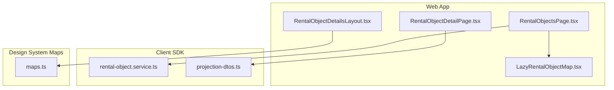
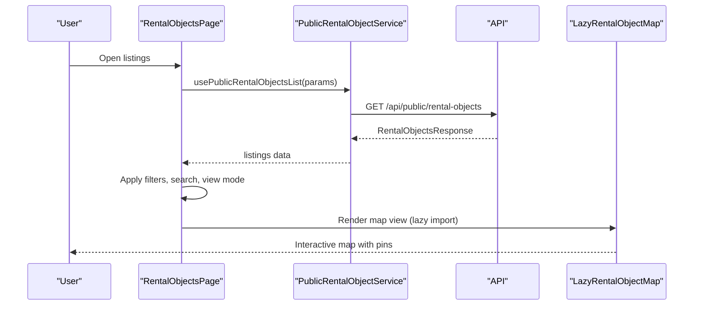
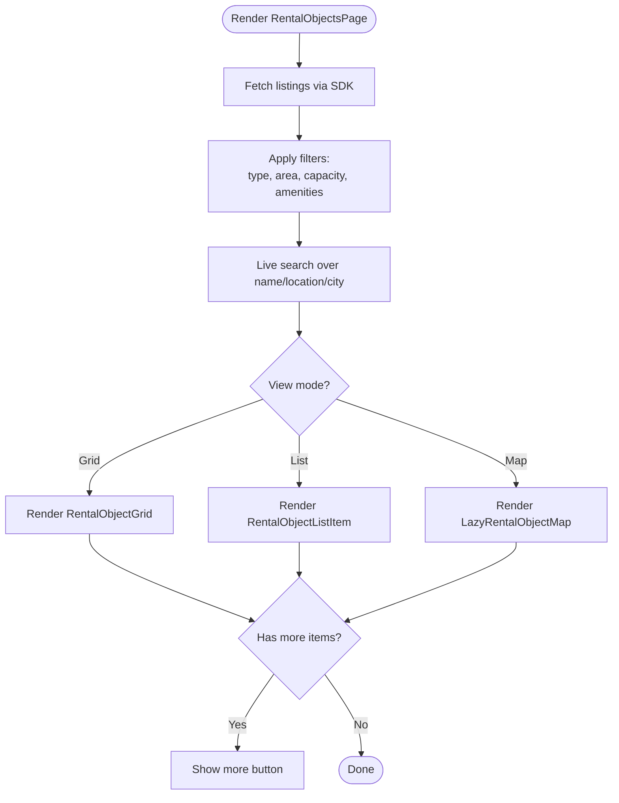
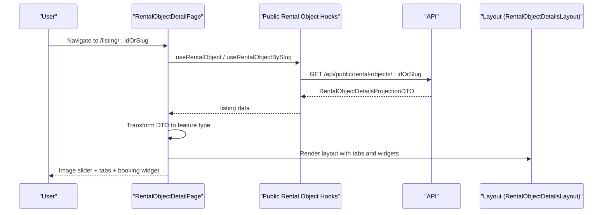
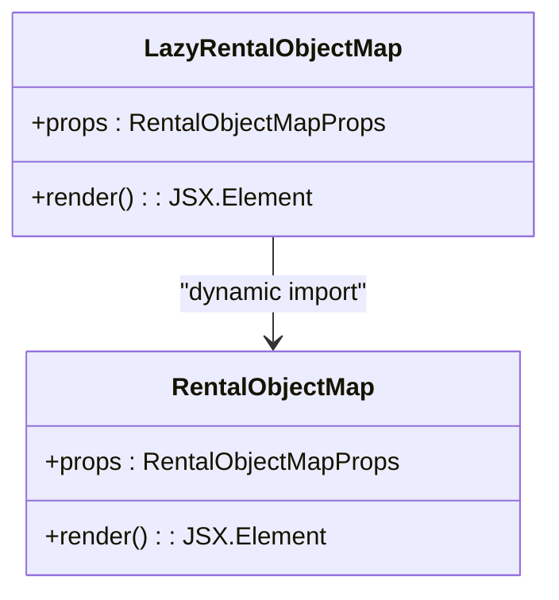
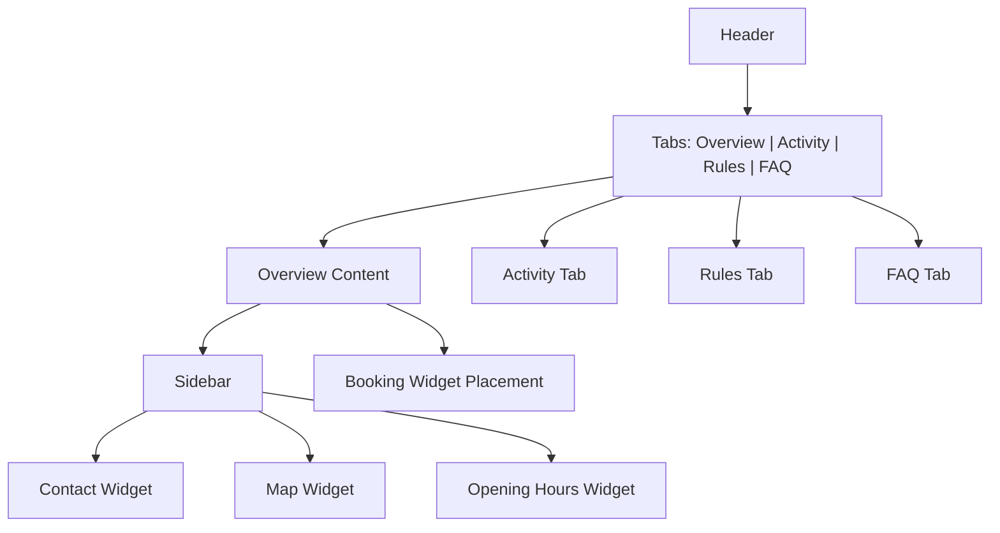
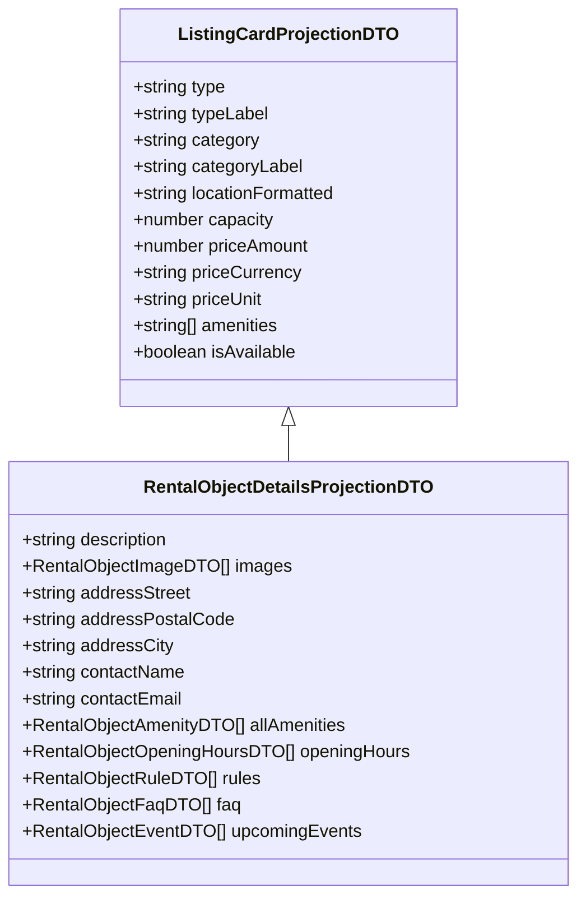
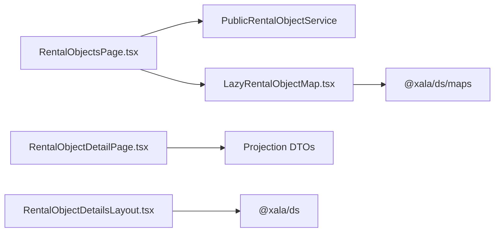

# Property Listing and Detail Views

<cite>
**Referenced Files in This Document**
- [RentalObjectsPage.tsx](file://apps/web/src/pages/RentalObjectsPage.tsx)
- [RentalObjectDetailPage.tsx](file://apps/web/src/pages/RentalObjectDetailPage.tsx)
- [LazyRentalObjectMap.tsx](file://apps/web/src/components/LazyRentalObjectMap.tsx)
- [RentalObjectDetailsLayout.tsx](file://apps/web/src/features/rental-object-details/components/RentalObjectDetailsLayout.tsx)
- [projection-dtos.ts](file://packages/client-sdk/src/types/projection-dtos.ts)
- [rental-object.service.ts](file://packages/client-sdk/src/services/rental-object.service.ts)
- [maps.ts](file://packages/ds/src/maps.ts)
- [guidelines.ts](file://packages/ds-registry/src/guidelines.ts)
- [04-performance.md](file://docs/guides/04-performance.md)
</cite>

## Table of Contents
1. [Introduction](#introduction)
2. [Project Structure](#project-structure)
3. [Core Components](#core-components)
4. [Architecture Overview](#architecture-overview)
5. [Detailed Component Analysis](#detailed-component-analysis)
6. [Dependency Analysis](#dependency-analysis)
7. [Performance Considerations](#performance-considerations)
8. [Troubleshooting Guide](#troubleshooting-guide)
9. [Conclusion](#conclusion)

## Introduction
This document explains the property listing and detail view functionality across the Xala/Digilist platform. It covers:
- The listing page with property grid/list display, filtering and search, and responsive design
- The detail page with property information, image galleries, availability calendars, and booking flows
- Integration with the rental objects API via the client SDK
- Real-time updates for availability
- The LazyRentalObjectMap component for interactive maps
- Property categorization, pricing display, amenity listings, and user review integration
- Mobile-responsive design, performance optimizations, and accessibility features

## Project Structure
The listing and detail views are implemented in the web application under the pages and features directories. The listing page orchestrates data fetching, filtering, and rendering of property cards, while the detail page composes a feature-based layout for tabs, widgets, and booking placement.

**Diagram sources**
- [RentalObjectsPage.tsx](file://apps/web/src/pages/RentalObjectsPage.tsx#L1-L837)
- [RentalObjectDetailPage.tsx](file://apps/web/src/pages/RentalObjectDetailPage.tsx#L1-L529)
- [LazyRentalObjectMap.tsx](file://apps/web/src/components/LazyRentalObjectMap.tsx#L1-L69)
- [RentalObjectDetailsLayout.tsx](file://apps/web/src/features/rental-object-details/components/RentalObjectDetailsLayout.tsx#L1-L378)
- [rental-object.service.ts](file://packages/client-sdk/src/services/rental-object.service.ts#L221-L295)
- [projection-dtos.ts](file://packages/client-sdk/src/types/projection-dtos.ts#L43-L106)
- [maps.ts](file://packages/ds/src/maps.ts#L1-L41)

**Section sources**
- [RentalObjectsPage.tsx](file://apps/web/src/pages/RentalObjectsPage.tsx#L1-L837)
- [RentalObjectDetailPage.tsx](file://apps/web/src/pages/RentalObjectDetailPage.tsx#L1-L529)
- [LazyRentalObjectMap.tsx](file://apps/web/src/components/LazyRentalObjectMap.tsx#L1-L69)
- [RentalObjectDetailsLayout.tsx](file://apps/web/src/features/rental-object-details/components/RentalObjectDetailsLayout.tsx#L1-L378)
- [rental-object.service.ts](file://packages/client-sdk/src/services/rental-object.service.ts#L221-L295)
- [projection-dtos.ts](file://packages/client-sdk/src/types/projection-dtos.ts#L43-L106)
- [maps.ts](file://packages/ds/src/maps.ts#L1-L41)

## Core Components
- RentalObjectsPage: Implements the listing page with search, filters, view toggles (grid, list, map), pagination affordances, and skeleton loaders. It integrates with the public rental objects API and exposes a map view powered by LazyRentalObjectMap.
- RentalObjectDetailPage: Renders the detail page with an image slider and a feature-based layout (RentalObjectDetailsLayout) that organizes tabs, sidebar widgets, and a booking widget.
- LazyRentalObjectMap: A lazy-loaded wrapper around the design system’s map component to defer loading until needed, reducing initial bundle size.
- RentalObjectDetailsLayout: Composes header, tabs (Overview, Activity, Rules, FAQ), sidebar widgets (Contact, Map, Opening Hours), and a full-width booking section.
- Client SDK: Provides typed DTOs for listing cards and details, and services for fetching public rental objects, availability, categories, and cities.

**Section sources**
- [RentalObjectsPage.tsx](file://apps/web/src/pages/RentalObjectsPage.tsx#L175-L837)
- [RentalObjectDetailPage.tsx](file://apps/web/src/pages/RentalObjectDetailPage.tsx#L251-L529)
- [LazyRentalObjectMap.tsx](file://apps/web/src/components/LazyRentalObjectMap.tsx#L1-L69)
- [RentalObjectDetailsLayout.tsx](file://apps/web/src/features/rental-object-details/components/RentalObjectDetailsLayout.tsx#L100-L378)
- [projection-dtos.ts](file://packages/client-sdk/src/types/projection-dtos.ts#L43-L106)
- [rental-object.service.ts](file://packages/client-sdk/src/services/rental-object.service.ts#L221-L295)

## Architecture Overview
The listing and detail views follow a clean separation of concerns:
- Pages orchestrate data fetching, state, and UI composition
- Feature components encapsulate presentation logic and reusable widgets
- The SDK abstracts API interactions and provides strongly typed DTOs
- The design system exposes lazy-loadable map components for performance

**Diagram sources**
- [RentalObjectsPage.tsx](file://apps/web/src/pages/RentalObjectsPage.tsx#L175-L837)
- [rental-object.service.ts](file://packages/client-sdk/src/services/rental-object.service.ts#L229-L233)
- [LazyRentalObjectMap.tsx](file://apps/web/src/components/LazyRentalObjectMap.tsx#L23-L27)

## Detailed Component Analysis

### RentalObjectsPage: Listing Grid/List/Map
- Data fetching: Uses the public rental objects hook to retrieve card-ready DTOs with preformatted fields for type, location, media, pricing, capacity, and ratings.
- Filtering and search:
  - Drawer-based filters for type, area (city), capacity bands, and amenities
  - Live search over name, formatted location, and city
  - Filter chips with removal controls and “clear all” action
- View modes: Grid, list, and map views with animated transitions
- Pagination affordance: “Show more” button to incrementally reveal items
- Responsive design: Media queries adjust toolbar layout and filter chips for small screens; map view adapts height
- Accessibility: Proper ARIA roles and labels for search, drawers, and buttons; keyboard navigable

**Diagram sources**
- [RentalObjectsPage.tsx](file://apps/web/src/pages/RentalObjectsPage.tsx#L175-L837)

**Section sources**
- [RentalObjectsPage.tsx](file://apps/web/src/pages/RentalObjectsPage.tsx#L175-L837)

### RentalObjectDetailPage: Detail Composition and Transforms
- Fetching: Retrieves the listing by UUID or slug using public hooks; transforms the API DTO into the feature’s internal type for consistent rendering
- Image gallery: Builds a gallery from the listing images with primary selection and thumbnails
- Layout: Delegates to RentalObjectDetailsLayout for tabbed content and sidebar widgets
- Booking integration: Scrolls to the booking section on demand
- Real-time logging: Logs page view and supports audit events for favorites and sharing

**Diagram sources**
- [RentalObjectDetailPage.tsx](file://apps/web/src/pages/RentalObjectDetailPage.tsx#L251-L529)
- [projection-dtos.ts](file://packages/client-sdk/src/types/projection-dtos.ts#L176-L227)
- [rental-object.service.ts](file://packages/client-sdk/src/services/rental-object.service.ts#L248-L257)

**Section sources**
- [RentalObjectDetailPage.tsx](file://apps/web/src/pages/RentalObjectDetailPage.tsx#L251-L529)
- [projection-dtos.ts](file://packages/client-sdk/src/types/projection-dtos.ts#L176-L227)
- [rental-object.service.ts](file://packages/client-sdk/src/services/rental-object.service.ts#L248-L257)

### LazyRentalObjectMap: Interactive Map Integration
- Purpose: Defers loading of the map component and its heavy dependencies (Mapbox GL) until the map view is selected or rendered
- Implementation: Dynamic import inside a Suspense boundary with a loading fallback
- Props: Accepts rental objects with coordinates, mapbox token, and click handlers

**Diagram sources**
- [LazyRentalObjectMap.tsx](file://apps/web/src/components/LazyRentalObjectMap.tsx#L23-L27)
- [maps.ts](file://packages/ds/src/maps.ts#L40-L41)

**Section sources**
- [LazyRentalObjectMap.tsx](file://apps/web/src/components/LazyRentalObjectMap.tsx#L1-L69)
- [maps.ts](file://packages/ds/src/maps.ts#L1-L41)

### RentalObjectDetailsLayout: Tabs, Widgets, and Booking
- Structure: Header, pill-style tabs (Overview, Activity, Rules, FAQ), sidebar widgets (Contact, Map, Opening Hours), and a full-width booking section
- Responsiveness: Grid layout stacks on narrow screens; interactive hover effects and smooth scrolling
- Real-time updates: Subscribes to real-time events and invalidates queries to keep data fresh
- Sharing and favorites: Integrates with share and audit providers; handles auth-required actions

**Diagram sources**
- [RentalObjectDetailsLayout.tsx](file://apps/web/src/features/rental-object-details/components/RentalObjectDetailsLayout.tsx#L174-L378)

**Section sources**
- [RentalObjectDetailsLayout.tsx](file://apps/web/src/features/rental-object-details/components/RentalObjectDetailsLayout.tsx#L100-L378)

### Data Types and API Integration
- Listing card DTO: Includes type, category, location, media, pricing, capacity, amenities, ratings, and availability flags
- Details DTO: Extends card DTO with full description, images, address, contact, amenities/equipment, opening hours, rules, FAQ, highlights, and upcoming events
- Public service: Provides endpoints for listing retrieval, availability, categories, cities, and featured listings

**Diagram sources**
- [projection-dtos.ts](file://packages/client-sdk/src/types/projection-dtos.ts#L43-L106)
- [projection-dtos.ts](file://packages/client-sdk/src/types/projection-dtos.ts#L176-L227)

**Section sources**
- [projection-dtos.ts](file://packages/client-sdk/src/types/projection-dtos.ts#L43-L106)
- [projection-dtos.ts](file://packages/client-sdk/src/types/projection-dtos.ts#L176-L227)
- [rental-object.service.ts](file://packages/client-sdk/src/services/rental-object.service.ts#L229-L295)

## Dependency Analysis
- Pages depend on the SDK for data fetching and on the design system for UI primitives and map components
- LazyRentalObjectMap depends on the design system’s maps entry point for dynamic imports
- RentalObjectDetailsLayout composes feature-specific components and integrates with the design system’s share and modal components

**Diagram sources**
- [RentalObjectsPage.tsx](file://apps/web/src/pages/RentalObjectsPage.tsx#L30-L35)
- [RentalObjectDetailPage.tsx](file://apps/web/src/pages/RentalObjectDetailPage.tsx#L18-L35)
- [LazyRentalObjectMap.tsx](file://apps/web/src/components/LazyRentalObjectMap.tsx#L23-L27)
- [maps.ts](file://packages/ds/src/maps.ts#L40-L41)
- [RentalObjectDetailsLayout.tsx](file://apps/web/src/features/rental-object-details/components/RentalObjectDetailsLayout.tsx#L13-L35)

**Section sources**
- [RentalObjectsPage.tsx](file://apps/web/src/pages/RentalObjectsPage.tsx#L30-L35)
- [RentalObjectDetailPage.tsx](file://apps/web/src/pages/RentalObjectDetailPage.tsx#L18-L35)
- [LazyRentalObjectMap.tsx](file://apps/web/src/components/LazyRentalObjectMap.tsx#L23-L27)
- [maps.ts](file://packages/ds/src/maps.ts#L40-L41)
- [RentalObjectDetailsLayout.tsx](file://apps/web/src/features/rental-object-details/components/RentalObjectDetailsLayout.tsx#L13-L35)

## Performance Considerations
- Lazy loading: Map component is dynamically imported to avoid shipping Mapbox GL to listing pages
- Skeletons and placeholders: Loading skeletons improve perceived performance during initial fetch
- Incremental rendering: “Show more” pattern reduces DOM overhead for large lists
- Query caching and invalidation: React Query manages caching and real-time invalidation for freshness
- Bundle size: Using lazy imports and avoiding unnecessary dependencies keeps the initial payload small

**Section sources**
- [LazyRentalObjectMap.tsx](file://apps/web/src/components/LazyRentalObjectMap.tsx#L23-L27)
- [RentalObjectsPage.tsx](file://apps/web/src/pages/RentalObjectsPage.tsx#L480-L514)
- [04-performance.md](file://docs/guides/04-performance.md#L1-L41)

## Troubleshooting Guide
- Map not rendering: Verify the Mapbox token is configured and passed to the lazy map component
- Empty listings: Confirm the public endpoint returns data and that the page handles empty states gracefully
- Filter not applying: Ensure filter state updates trigger re-computation of filtered listings
- Real-time updates: Confirm the event handler invalidates queries and that the map view updates accordingly
- Accessibility: Use the design system guidelines to maintain proper ARIA attributes and keyboard navigation

**Section sources**
- [LazyRentalObjectMap.tsx](file://apps/web/src/components/LazyRentalObjectMap.tsx#L62-L69)
- [RentalObjectsPage.tsx](file://apps/web/src/pages/RentalObjectsPage.tsx#L190-L194)
- [guidelines.ts](file://packages/ds-registry/src/guidelines.ts#L291-L364)

## Conclusion
The property listing and detail views are built with a clear separation of concerns, leveraging the client SDK for robust data access, the design system for responsive UI and maps, and feature-based composition for maintainable detail layouts. The implementation emphasizes performance through lazy loading, incremental rendering, and query caching, while ensuring accessibility and responsiveness across devices.