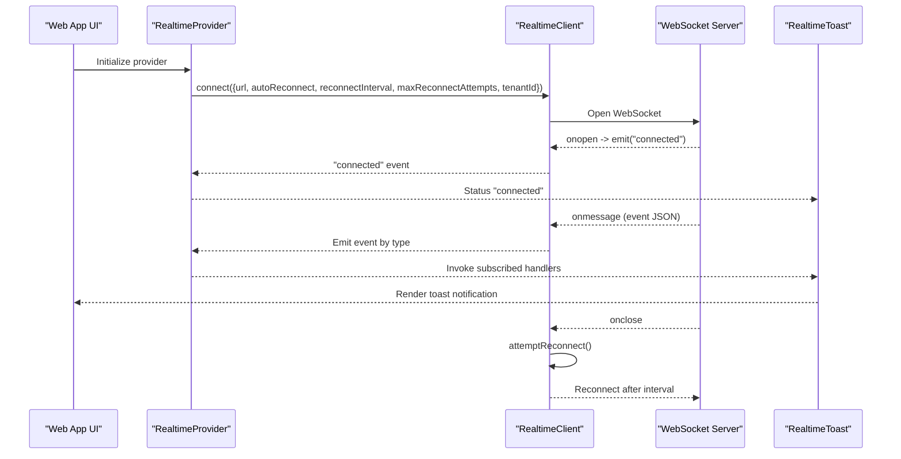
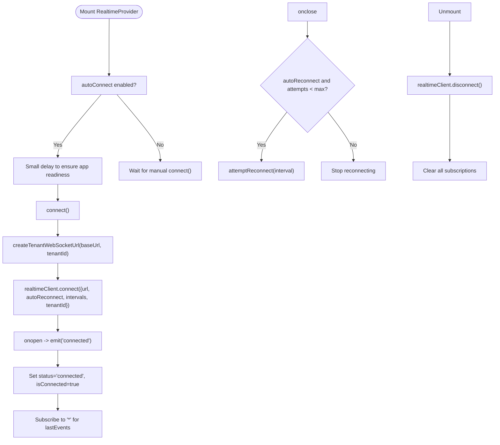
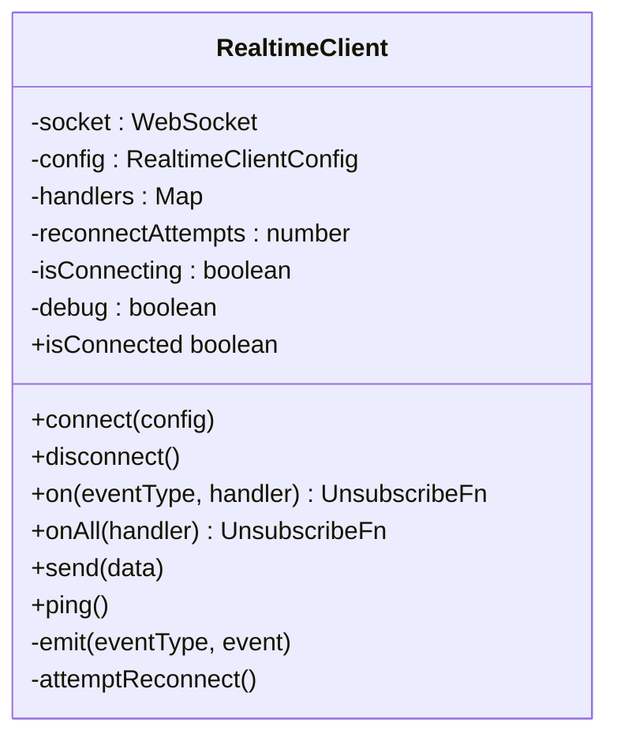
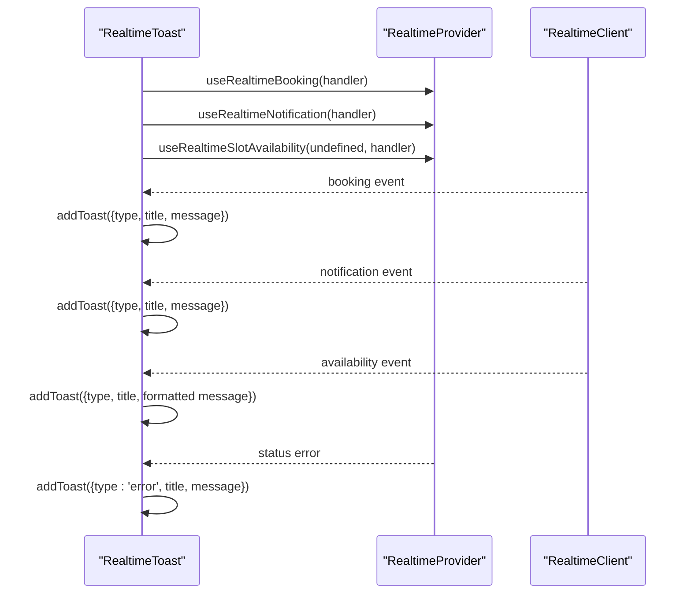
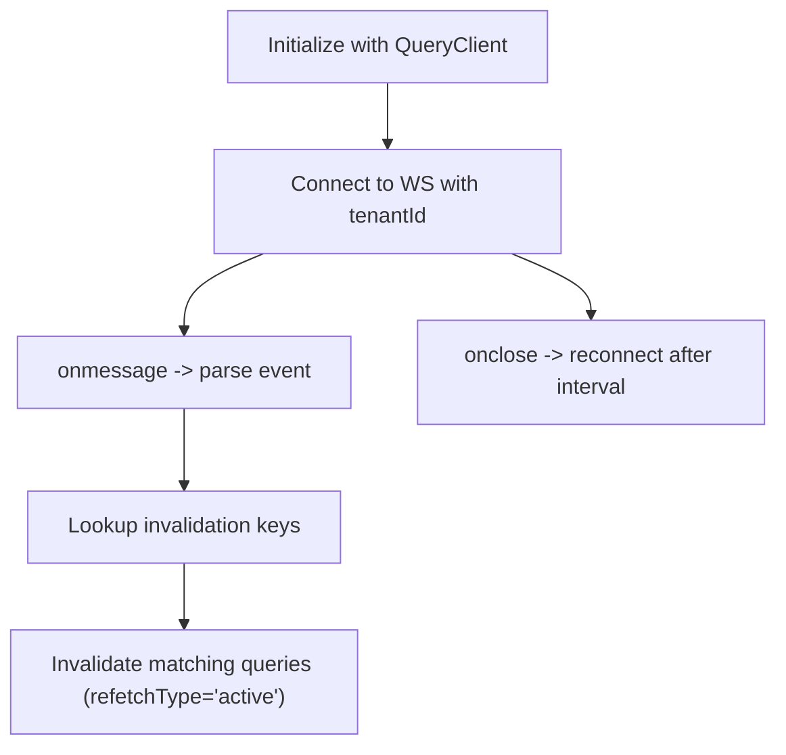
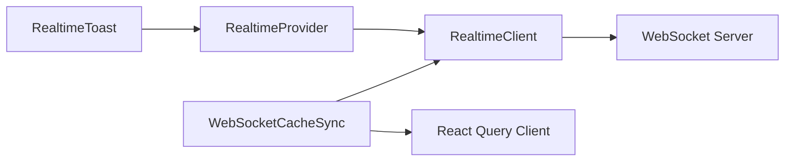

# Real-time Communication

<cite>
**Referenced Files in This Document**
- [RealtimeProvider.tsx](file://apps/web/src/providers/RealtimeProvider.tsx)
- [RealtimeToast.tsx](file://apps/web/src/components/RealtimeToast.tsx)
- [index.ts](file://packages/client-sdk/src/realtime/index.ts)
- [ws-cache-sync.ts](file://packages/client-sdk/src/realtime/ws-cache-sync.ts)
- [ToastProvider.tsx (Backoffice)](file://apps/backoffice/src/providers/ToastProvider.tsx)
- [ToastProvider.tsx (SaaS Admin)](file://apps/saas-admin/src/providers/ToastProvider.tsx)
- [ToastProvider.tsx (Tenant Admin)](file://apps/tenant-admin/src/providers/ToastProvider.tsx)
- [websocket-realtime.md](file://docs/guides/websocket-realtime.md)
</cite>

## Table of Contents
1. [Introduction](#introduction)
2. [Project Structure](#project-structure)
3. [Core Components](#core-components)
4. [Architecture Overview](#architecture-overview)
5. [Detailed Component Analysis](#detailed-component-analysis)
6. [Dependency Analysis](#dependency-analysis)
7. [Performance Considerations](#performance-considerations)
8. [Security Considerations](#security-considerations)
9. [Troubleshooting Guide](#troubleshooting-guide)
10. [Conclusion](#conclusion)

## Introduction
This document explains the web application’s real-time communication features, focusing on the WebSocket-based client, automatic reconnection, event broadcasting, and user-facing notifications. It covers:
- RealtimeProvider implementation for WebSocket connections and subscription management
- RealtimeToast component for non-intrusive, localized real-time notifications
- WebSocket lifecycle, message handling patterns, and event broadcasting
- Integration with the client SDK’s real-time services and cache invalidation
- Real-time user interface patterns and graceful degradation strategies
- Security considerations and best practices for handling sensitive real-time data

## Project Structure
The real-time system spans three layers:
- Client SDK: WebSocket client, event types, and cache synchronization utilities
- Web App Provider: React context/provider for connection lifecycle and subscriptions
- UI Notifications: RealtimeToast component for user-visible updates

```mermaid
graph TB
subgraph "Web App"
RP["RealtimeProvider<br/>Connection & Subscriptions"]
RT["RealtimeToast<br/>UI Notifications"]
end
subgraph "Client SDK"
RC["RealtimeClient<br/>WebSocket + Handlers"]
WSC["WebSocketCacheSync<br/>Cache Invalidation"]
end
subgraph "Server"
WS["WebSocket Endpoint<br/>Tenant-scoped Events"]
end
RP --> RC
RT --> RP
RC <- --> WS
WSC <- --> WS
```

**Diagram sources**
- [RealtimeProvider.tsx](file://apps/web/src/providers/RealtimeProvider.tsx#L61-L176)
- [RealtimeToast.tsx](file://apps/web/src/components/RealtimeToast.tsx#L22-L170)
- [index.ts](file://packages/client-sdk/src/realtime/index.ts#L28-L101)
- [ws-cache-sync.ts](file://packages/client-sdk/src/realtime/ws-cache-sync.ts#L152-L218)

**Section sources**
- [RealtimeProvider.tsx](file://apps/web/src/providers/RealtimeProvider.tsx#L61-L176)
- [RealtimeToast.tsx](file://apps/web/src/components/RealtimeToast.tsx#L22-L170)
- [index.ts](file://packages/client-sdk/src/realtime/index.ts#L28-L101)
- [ws-cache-sync.ts](file://packages/client-sdk/src/realtime/ws-cache-sync.ts#L152-L218)

## Core Components
- RealtimeProvider: Manages WebSocket connection, exposes subscription hooks, tracks connection status, and maintains last events for debugging.
- RealtimeClient: Low-level WebSocket client with event handlers, auto-reconnect, and subscription messaging.
- RealtimeToast: React component that listens to booking, notification, and availability events and renders non-blocking toasts.
- WebSocketCacheSync: Optional cache synchronization utility that invalidates React Query caches based on WS events.

**Section sources**
- [RealtimeProvider.tsx](file://apps/web/src/providers/RealtimeProvider.tsx#L22-L37)
- [index.ts](file://packages/client-sdk/src/realtime/index.ts#L28-L101)
- [RealtimeToast.tsx](file://apps/web/src/components/RealtimeToast.tsx#L14-L21)
- [ws-cache-sync.ts](file://packages/client-sdk/src/realtime/ws-cache-sync.ts#L152-L188)

## Architecture Overview
The real-time architecture follows a layered pattern:
- The web app initializes RealtimeProvider, which constructs a tenant-scoped WebSocket URL and connects via RealtimeClient.
- RealtimeClient manages the WebSocket lifecycle, emits typed events, and supports wildcard/all-event subscriptions.
- RealtimeToast subscribes to booking, notification, and availability events and displays localized toasts.
- Optional WebSocketCacheSync integrates with React Query to keep cached data consistent with real-time events.



**Diagram sources**
- [RealtimeProvider.tsx](file://apps/web/src/providers/RealtimeProvider.tsx#L75-L98)
- [index.ts](file://packages/client-sdk/src/realtime/index.ts#L39-L101)
- [RealtimeToast.tsx](file://apps/web/src/components/RealtimeToast.tsx#L167-L169)

**Section sources**
- [RealtimeProvider.tsx](file://apps/web/src/providers/RealtimeProvider.tsx#L75-L152)
- [index.ts](file://packages/client-sdk/src/realtime/index.ts#L39-L101)
- [RealtimeToast.tsx](file://apps/web/src/components/RealtimeToast.tsx#L167-L180)

## Detailed Component Analysis

### RealtimeProvider
Responsibilities:
- Build tenant-scoped WebSocket URL from base URL and tenant ID
- Manage connection lifecycle: connect/disconnect, auto-reconnect, and cleanup
- Expose typed subscription hooks for booking, listing, audit, notification, message, and wildcard/all events
- Track connection status and last events for debugging
- Provide a specialized hook for slot availability changes

Key behaviors:
- Auto-connect on mount when enabled
- Maintains a ref of unsubscribe functions to clean up on unmount
- Emits a “connected” event and clears last events when a new connection opens
- Subscribes to “*” to maintain a lastEvents map for debugging



**Diagram sources**
- [RealtimeProvider.tsx](file://apps/web/src/providers/RealtimeProvider.tsx#L61-L159)
- [index.ts](file://packages/client-sdk/src/realtime/index.ts#L39-L101)

**Section sources**
- [RealtimeProvider.tsx](file://apps/web/src/providers/RealtimeProvider.tsx#L61-L159)
- [websocket-realtime.md](file://docs/guides/websocket-realtime.md#L102-L241)

### RealtimeClient (SDK)
Responsibilities:
- Manage WebSocket connection, message parsing, and event emission
- Support subscription to specific event types and wildcard events
- Implement auto-reconnect with a fixed interval and maximum attempts
- Optionally send a subscription message upon connection for tenant-scoped events

Key behaviors:
- Parses incoming messages and emits events by type and wildcard
- Silently ignores parse errors and subscription failures to avoid crashing
- Emits a “connected” event on successful connection
- Resets reconnect attempts on successful reconnection



**Diagram sources**
- [index.ts](file://packages/client-sdk/src/realtime/index.ts#L28-L276)

**Section sources**
- [index.ts](file://packages/client-sdk/src/realtime/index.ts#L28-L276)
- [websocket-realtime.md](file://docs/guides/websocket-realtime.md#L102-L241)

### RealtimeToast
Responsibilities:
- Subscribe to booking, notification, and slot availability events
- Render localized toasts with appropriate icons and colors
- Auto-dismiss toasts after a timeout and support manual dismissal
- Surface connection status toasts on errors

Behavior highlights:
- Uses i18n keys for titles and messages
- Formats time/date for slot availability to improve UX
- Limits the number of visible toasts and auto-prunes older ones
- Announces toasts to assistive technologies with appropriate ARIA roles



**Diagram sources**
- [RealtimeToast.tsx](file://apps/web/src/components/RealtimeToast.tsx#L54-L169)
- [RealtimeProvider.tsx](file://apps/web/src/providers/RealtimeProvider.tsx#L200-L267)

**Section sources**
- [RealtimeToast.tsx](file://apps/web/src/components/RealtimeToast.tsx#L22-L180)

### WebSocketCacheSync (Optional Integration)
Responsibilities:
- Initialize with a React Query QueryClient
- Connect to a tenant-scoped WebSocket endpoint
- Parse incoming events and invalidate matching query keys based on a centralized mapping
- Auto-reconnect on close

Behavior highlights:
- Single-source-of-truth mapping from event types to query keys
- Invalidation targets only active queries to minimize unnecessary refetches
- Graceful handling of unknown event types and parse errors



**Diagram sources**
- [ws-cache-sync.ts](file://packages/client-sdk/src/realtime/ws-cache-sync.ts#L152-L218)

**Section sources**
- [ws-cache-sync.ts](file://packages/client-sdk/src/realtime/ws-cache-sync.ts#L152-L218)

## Dependency Analysis
- RealtimeProvider depends on:
  - RealtimeClient for WebSocket operations
  - i18n for localized toast messages
  - React Context for exposing connection state and subscriptions
- RealtimeClient depends on:
  - Native WebSocket API
  - Optional subscription message to server
- RealtimeToast depends on:
  - RealtimeProvider hooks for subscriptions
  - Design system primitives for rendering
- WebSocketCacheSync depends on:
  - React Query for cache invalidation



**Diagram sources**
- [RealtimeProvider.tsx](file://apps/web/src/providers/RealtimeProvider.tsx#L8-L15)
- [RealtimeToast.tsx](file://apps/web/src/components/RealtimeToast.tsx#L8-L12)
- [index.ts](file://packages/client-sdk/src/realtime/index.ts#L28-L101)
- [ws-cache-sync.ts](file://packages/client-sdk/src/realtime/ws-cache-sync.ts#L8-L15)

**Section sources**
- [RealtimeProvider.tsx](file://apps/web/src/providers/RealtimeProvider.tsx#L8-L15)
- [RealtimeToast.tsx](file://apps/web/src/components/RealtimeToast.tsx#L8-L12)
- [index.ts](file://packages/client-sdk/src/realtime/index.ts#L28-L101)
- [ws-cache-sync.ts](file://packages/client-sdk/src/realtime/ws-cache-sync.ts#L8-L15)

## Performance Considerations
- Connection state management:
  - Fixed-interval reconnection reduces jitter but can increase load during transient outages. Consider exponential backoff if server-side throttling is observed.
- Handler stability:
  - Using refs to store unsubscribe functions prevents redundant subscriptions and re-subscription churn across renders.
- Event volume:
  - Wildcard/all subscriptions are useful for debugging but can increase handler invocation overhead. Prefer targeted subscriptions in production.
- Cache invalidation:
  - WebSocketCacheSync invalidates only active queries to minimize unnecessary refetches. Ensure query keys align with event types to avoid over/under-invalidation.
- UI rendering:
  - Limit concurrent toasts and auto-prune older entries to prevent layout thrashing.

[No sources needed since this section provides general guidance]

## Security Considerations
- Transport security:
  - Use secure WebSocket URLs (wss://) to protect event streams from eavesdropping and tampering.
- Authentication and authorization:
  - Tenant-scoped subscriptions should be enforced server-side. Ensure WebSocket endpoints validate tenant identity and permissions before delivering events.
- Message integrity:
  - Treat incoming events as untrusted. Parse defensively and sanitize data before rendering or updating caches.
- Sensitive data handling:
  - Avoid logging raw event payloads in production. Mask or redact sensitive fields in UI notifications.
- Graceful degradation:
  - When real-time features fail, degrade gracefully by falling back to polling or periodic refresh mechanisms for critical flows.

[No sources needed since this section provides general guidance]

## Troubleshooting Guide
Common issues and remedies:
- Connection fails immediately:
  - Verify base URL and tenant ID. Ensure the WebSocket endpoint is reachable and supports wss.
- Frequent reconnections:
  - Check network stability and server health. Adjust reconnect interval and max attempts if needed.
- No events received:
  - Confirm that the subscription message is accepted by the server and that tenant ID matches the intended scope.
- Toasts not appearing:
  - Ensure RealtimeProvider is mounted and connected. Verify that the toast container is rendered and that handlers are attached.
- Cache desynchronization:
  - If using WebSocketCacheSync, confirm that event types match the invalidation map and that QueryClient is initialized.

**Section sources**
- [websocket-realtime.md](file://docs/guides/websocket-realtime.md#L102-L241)
- [RealtimeProvider.tsx](file://apps/web/src/providers/RealtimeProvider.tsx#L75-L152)
- [RealtimeToast.tsx](file://apps/web/src/components/RealtimeToast.tsx#L167-L180)
- [ws-cache-sync.ts](file://packages/client-sdk/src/realtime/ws-cache-sync.ts#L152-L218)

## Conclusion
The real-time communication system combines a robust WebSocket client, a React-friendly provider, and a focused notification component to deliver responsive, user-visible updates. With optional cache synchronization, it maintains consistency while supporting graceful degradation. By following the outlined patterns and best practices, teams can extend and maintain reliable real-time features across the platform.