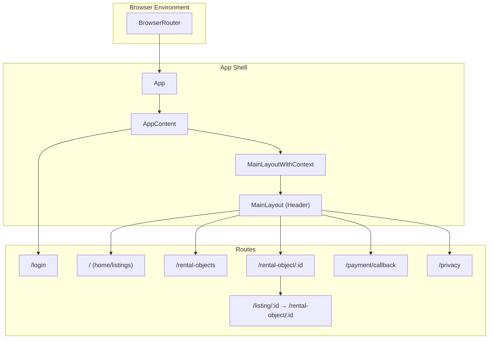
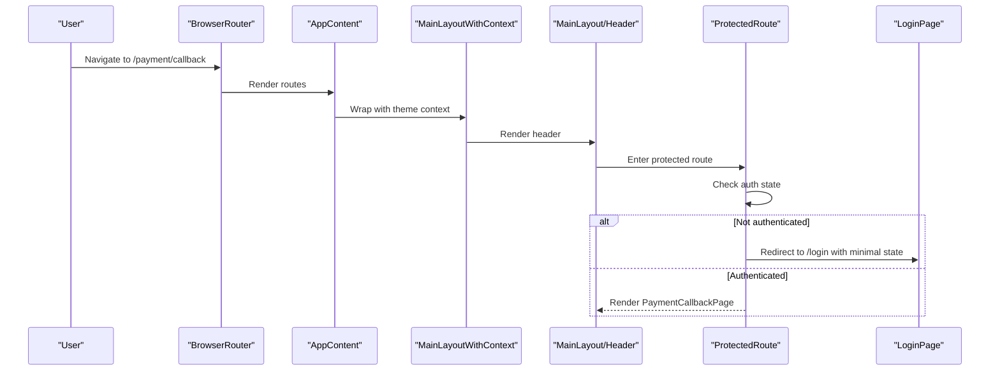
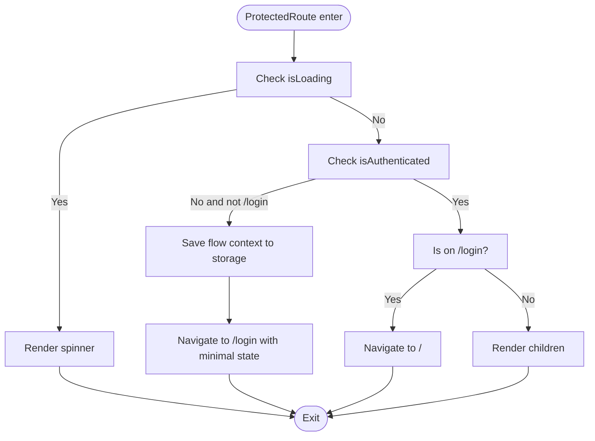
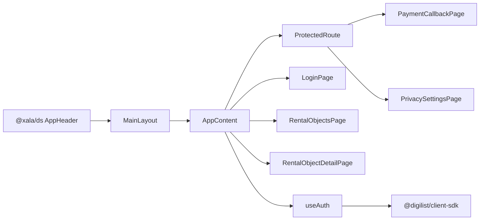

# Routing and Navigation

<cite>
**Referenced Files in This Document**
- [App.tsx](file://apps/web/src/App.tsx)
- [main.tsx](file://apps/web/src/main.tsx)
- [ProtectedRoute.tsx](file://apps/web/src/components/ProtectedRoute.tsx)
- [ProtectedRoute.test.tsx](file://apps/web/src/components/ProtectedRoute.test.tsx)
- [login.tsx](file://apps/web/src/pages/login.tsx)
- [RentalObjectsPage.tsx](file://apps/web/src/pages/RentalObjectsPage.tsx)
- [RentalObjectDetailPage.tsx](file://apps/web/src/pages/RentalObjectDetailPage.tsx)
- [PaymentCallbackPage.tsx](file://apps/web/src/pages/PaymentCallbackPage.tsx)
- [PrivacySettingsPage.tsx](file://apps/web/src/pages/PrivacySettingsPage.tsx)
- [useAuth.ts](file://apps/web/src/hooks/useAuth.ts)
</cite>

## Table of Contents
1. [Introduction](#introduction)
2. [Project Structure](#project-structure)
3. [Core Components](#core-components)
4. [Architecture Overview](#architecture-overview)
5. [Detailed Component Analysis](#detailed-component-analysis)
6. [Dependency Analysis](#dependency-analysis)
7. [Performance Considerations](#performance-considerations)
8. [Troubleshooting Guide](#troubleshooting-guide)
9. [Conclusion](#conclusion)

## Introduction
This document explains the Web Application’s routing and navigation system built with React Router. It covers the BrowserRouter configuration, route definitions for public and protected pages, the MainLayout wrapper pattern, and the ProtectedRoute component that enforces authentication. It also documents route parameter handling for rental object IDs, backward compatibility redirects, navigation patterns, route guards, integration with the design system’s header components, theme context propagation, and the overall navigation flow for users across sections.

## Project Structure
The routing is centered around a single-page application entry configured with BrowserRouter. Routes are declared under a nested layout structure:
- A top-level login route (/login) that bypasses the shared header.
- A nested layout wrapping most routes:
  - MainLayoutWithContext provides theme context to the layout.
  - MainLayout renders the shared header and integrates with the design system and authentication state.
- Public routes:
  - Home and listings: /
  - Listings catalog: /rental-objects
  - Listing detail: /rental-object/:id and legacy /listing/:id (with redirect)
- Protected routes:
  - Payment callback: /payment/callback
  - Privacy settings: /privacy

**Diagram sources**
- [App.tsx](file://apps/web/src/App.tsx#L255-L275)
- [App.tsx](file://apps/web/src/App.tsx#L228-L247)

**Section sources**
- [App.tsx](file://apps/web/src/App.tsx#L255-L275)
- [main.tsx](file://apps/web/src/main.tsx#L1-L44)

## Core Components
- BrowserRouter and App shell:
  - BrowserRouter is initialized with future flags enabling transitions and relative splat paths.
  - AppContent sets up providers, theme context, and defines routes.
- MainLayout and MainLayoutWithContext:
  - MainLayoutWithContext injects theme context (colorScheme, setColorScheme, effectiveScheme) into the outlet.
  - MainLayout renders the shared header with logo, search, theme toggle, notifications, and user menu/login button.
- ProtectedRoute:
  - Guards protected routes, handles loading states, and preserves user intent via flow context storage.
- useAuth:
  - Provides authentication state, login/logout, and flow context utilities for session-safe return-to flows.

**Section sources**
- [App.tsx](file://apps/web/src/App.tsx#L162-L253)
- [ProtectedRoute.tsx](file://apps/web/src/components/ProtectedRoute.tsx#L97-L187)
- [useAuth.ts](file://apps/web/src/hooks/useAuth.ts#L199-L409)

## Architecture Overview
The routing architecture separates public and protected sections, centralizes authentication checks, and preserves user context across authentication flows. The design system’s header is consistently rendered via MainLayout, ensuring cohesive navigation and branding.

**Diagram sources**
- [App.tsx](file://apps/web/src/App.tsx#L228-L247)
- [ProtectedRoute.tsx](file://apps/web/src/components/ProtectedRoute.tsx#L97-L187)
- [login.tsx](file://apps/web/src/pages/login.tsx#L44-L125)

## Detailed Component Analysis

### BrowserRouter and App Initialization
- BrowserRouter is configured with future flags to enable transitions and relative splat path behavior.
- AppContent initializes providers, theme context, and declares routes.
- AuthProvider wraps the application to enable authentication flows.

**Section sources**
- [App.tsx](file://apps/web/src/App.tsx#L255-L275)
- [main.tsx](file://apps/web/src/main.tsx#L1-L44)

### MainLayout and Theme Context Propagation
- MainLayoutWithContext passes colorScheme, setColorScheme, and effectiveScheme to the outlet.
- MainLayout renders the AppHeader with:
  - Logo linking to home.
  - Global search integrated with design system.
  - Theme toggle bound to effectiveScheme.
  - Notifications bell (unread count fetched when authenticated).
  - User menu with logout action.
- Outlet renders the matched child route.

**Section sources**
- [App.tsx](file://apps/web/src/App.tsx#L162-L165)
- [App.tsx](file://apps/web/src/App.tsx#L40-L160)

### Route Definitions and Hierarchy
- Public routes:
  - /: Renders RentalObjectsPage.
  - /rental-objects: Renders RentalObjectsPage.
  - /rental-object/:id: Renders RentalObjectDetailPage.
  - /listing/:id: Legacy route redirected to /rental-object/:id.
- Protected routes:
  - /payment/callback: Wrapped with ProtectedRoute, renders PaymentCallbackPage.
  - /privacy: Wrapped with ProtectedRoute, renders PrivacySettingsPage.
- Login route:
  - /login: Renders LoginPage without the shared header.

**Section sources**
- [App.tsx](file://apps/web/src/App.tsx#L228-L247)

### ProtectedRoute Component
ProtectedRoute enforces authentication for protected routes and preserves user context across authentication flows:
- Authentication checks:
  - If loading, renders a spinner with accessible labeling.
  - If not authenticated and not on /login, saves flow context and navigates to /login with minimal state.
  - If authenticated and on /login, navigates to home.
- Flow context preservation:
  - Creates and stores a sanitized returnTo URL with optional form data.
  - Uses sessionStorage to persist context safely.
- Props and behavior:
  - redirectTo defaults to /login.
  - tenantId resolution from prop, environment, or fallback.
  - Prevents redirect loops by checking current location.

**Diagram sources**
- [ProtectedRoute.tsx](file://apps/web/src/components/ProtectedRoute.tsx#L97-L187)

**Section sources**
- [ProtectedRoute.tsx](file://apps/web/src/components/ProtectedRoute.tsx#L97-L187)
- [ProtectedRoute.test.tsx](file://apps/web/src/components/ProtectedRoute.test.tsx#L72-L150)

### Login Page and Return-To Flow
- LoginPage orchestrates OAuth providers and handles post-authentication navigation.
- On successful authentication, it restores flow context if available and navigates to the intended destination.
- If flow context is expired or invalid, it navigates to safe fallbacks.
- Accepts minimal state from ProtectedRoute to restore the original path.

**Section sources**
- [login.tsx](file://apps/web/src/pages/login.tsx#L44-L125)
- [useAuth.ts](file://apps/web/src/hooks/useAuth.ts#L343-L363)

### Rental Objects Catalog (Public)
- RentalObjectsPage lists rental objects, supports filtering, sorting, and view modes.
- Navigation to detail pages uses /rental-object/:id or legacy /listing/:id (handled by redirect).
- Integrates with design system components for search, filters, and listings.

**Section sources**
- [RentalObjectsPage.tsx](file://apps/web/src/pages/RentalObjectsPage.tsx#L175-L310)

### Rental Object Detail (Public)
- RentalObjectDetailPage resolves the listing by UUID or slug.
- Handles flow context restoration for booking sessions after authentication.
- Renders breadcrumbs, image gallery, and feature-based details layout.

**Section sources**
- [RentalObjectDetailPage.tsx](file://apps/web/src/pages/RentalObjectDetailPage.tsx#L251-L301)

### Payment Callback (Protected)
- PaymentCallbackPage validates orderId, checks payment status, and displays success/pending/failed states.
- Stores payment success in sessionStorage for downstream confirmation flows.

**Section sources**
- [PaymentCallbackPage.tsx](file://apps/web/src/pages/PaymentCallbackPage.tsx#L22-L300)

### Privacy Settings (Protected)
- PrivacySettingsPage provides tabs for consent settings and data subject requests.

**Section sources**
- [PrivacySettingsPage.tsx](file://apps/web/src/pages/PrivacySettingsPage.tsx#L6-L32)

## Dependency Analysis
The routing system depends on:
- React Router for declarative routing and nested layouts.
- Design system components for header, search, and UI primitives.
- Authentication hooks and SDK utilities for session restoration and flow context.
- Theme provider for color scheme propagation.

**Diagram sources**
- [App.tsx](file://apps/web/src/App.tsx#L105-L155)
- [ProtectedRoute.tsx](file://apps/web/src/components/ProtectedRoute.tsx#L21-L31)
- [login.tsx](file://apps/web/src/pages/login.tsx#L18-L22)
- [useAuth.ts](file://apps/web/src/hooks/useAuth.ts#L8-L18)

**Section sources**
- [App.tsx](file://apps/web/src/App.tsx#L1-L26)
- [ProtectedRoute.tsx](file://apps/web/src/components/ProtectedRoute.tsx#L21-L31)
- [login.tsx](file://apps/web/src/pages/login.tsx#L18-L22)
- [useAuth.ts](file://apps/web/src/hooks/useAuth.ts#L8-L18)

## Performance Considerations
- Route guards execute minimal work during render; heavy logic occurs in effects and callbacks.
- Flow context persistence uses sessionStorage to avoid bloating URL state.
- Design system components are used efficiently; consider lazy-loading heavy widgets if needed.

## Troubleshooting Guide
Common issues and resolutions:
- Redirect loop to /login:
  - Ensure ProtectedRoute is not applied to /login itself and that login state does not carry flow context unnecessarily.
- Lost form state after authentication:
  - Verify that ProtectedRoute saves flow context and that LoginPage restores it before navigation.
- Expired flow context:
  - LoginPage detects expired contexts and navigates to safe fallbacks; confirm that sessionStorage keys are intact.
- Theme toggle not applying:
  - Confirm that MainLayoutWithContext receives and applies colorScheme updates.

**Section sources**
- [ProtectedRoute.tsx](file://apps/web/src/components/ProtectedRoute.tsx#L165-L184)
- [login.tsx](file://apps/web/src/pages/login.tsx#L74-L118)
- [App.tsx](file://apps/web/src/App.tsx#L191-L214)

## Conclusion
The Web Application’s routing and navigation system leverages React Router’s nested layout model to separate public and protected sections, enforce authentication via ProtectedRoute, and preserve user context across OAuth flows. The MainLayout wrapper ensures consistent header behavior and theme propagation, while route guards and redirects provide a seamless user experience across public listings, detail pages, and protected sections like payment callbacks and privacy settings.