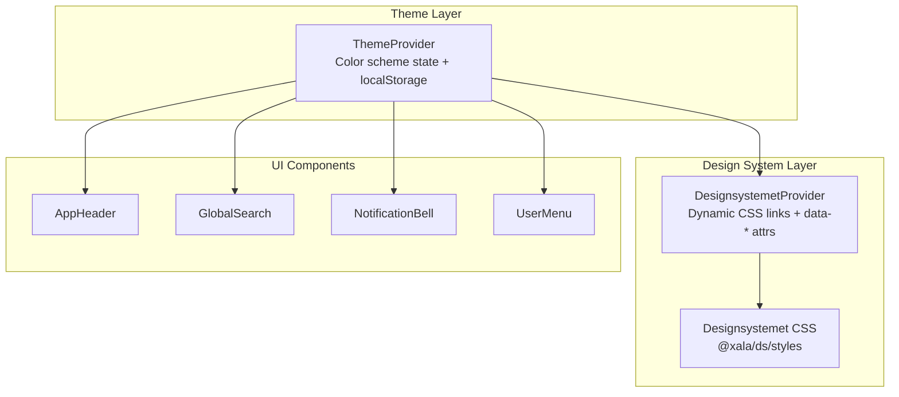
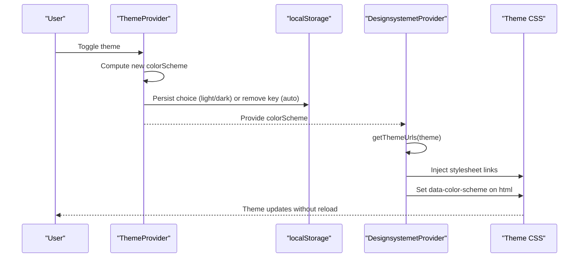
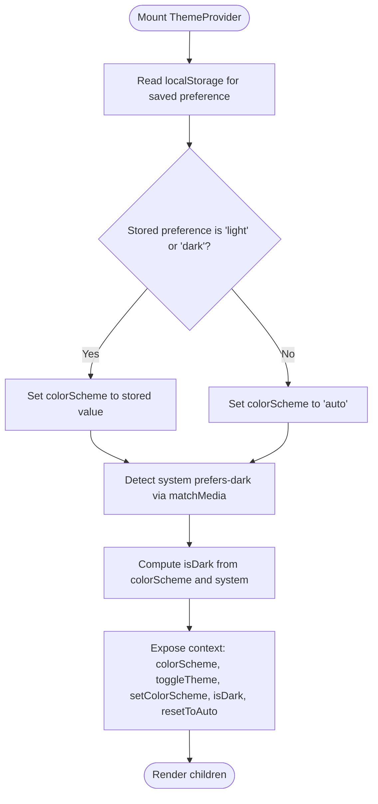
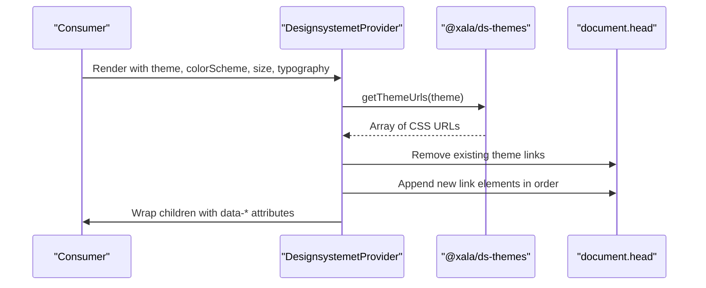
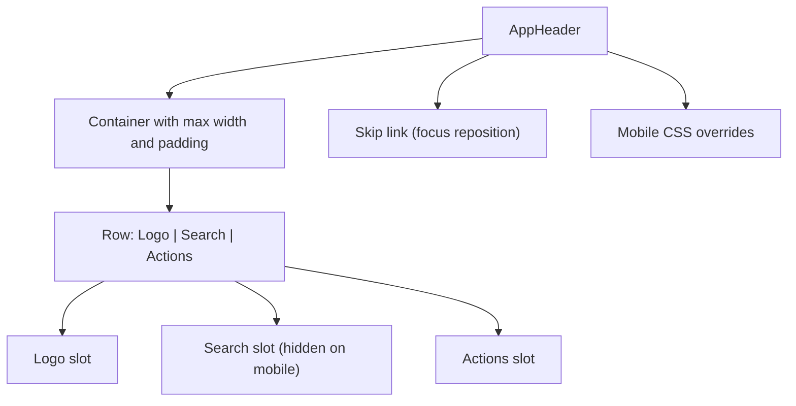
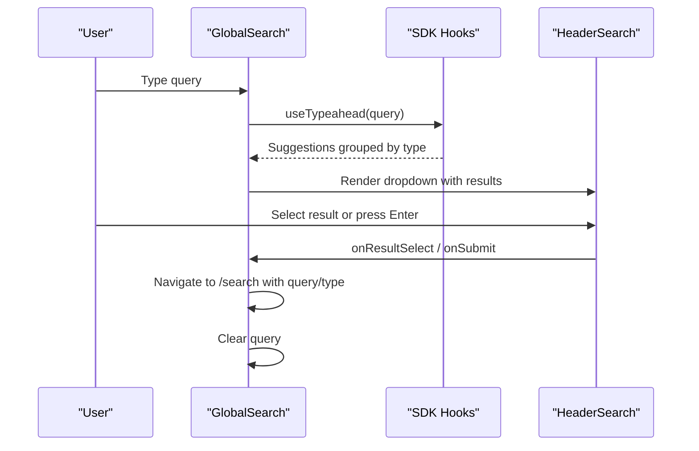
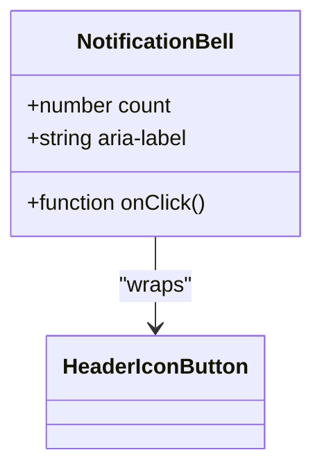
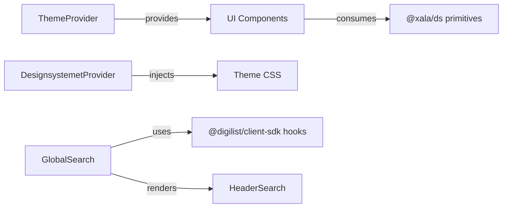

# Theme and UI Components

<cite>
**Referenced Files in This Document**
- [designsystemet.config.json](file://designsystemet.config.json)
- [ThemeProvider.tsx](file://packages/ds/src/ThemeProvider.tsx)
- [provider.tsx](file://packages/ds/src/provider.tsx)
- [styles.ts](file://packages/ds/src/styles.ts)
- [header.tsx](file://packages/ds/src/composed/header.tsx)
- [header-parts.tsx](file://packages/ds/src/composed/header-parts.tsx)
- [GlobalSearch.tsx](file://packages/ds/src/composed/GlobalSearch.tsx)
- [NotificationBell.tsx](file://packages/ds/src/blocks/NotificationBell.tsx)
- [UserMenu.tsx](file://apps/web/src/components/UserMenu.tsx)
</cite>

## Table of Contents
1. [Introduction](#introduction)
2. [Project Structure](#project-structure)
3. [Core Components](#core-components)
4. [Architecture Overview](#architecture-overview)
5. [Detailed Component Analysis](#detailed-component-analysis)
6. [Dependency Analysis](#dependency-analysis)
7. [Performance Considerations](#performance-considerations)
8. [Troubleshooting Guide](#troubleshooting-guide)
9. [Conclusion](#conclusion)
10. [Appendices](#appendices)

## Introduction
This document explains the Web Application’s theming and UI component system with a focus on:
- ThemeProvider configuration and color scheme management (auto/light/dark)
- Persistent theme preferences using localStorage
- Custom theme context implementation and system preference detection
- Manual theme toggling and reset-to-auto behavior
- Integration with the @xala/ds design system components (AppHeader, GlobalSearch, NotificationBell, UserMenu)
- Responsive design patterns, mobile-specific overrides, and breakpoint handling
- Component composition patterns, layout structures, and design system integration
- Theme customization options, CSS variable usage, and accessibility considerations
- Performance implications, initial loading optimization, and fallback mechanisms

## Project Structure
The theming system spans three layers:
- Theme context provider: manages color scheme state and persistence
- Designsystemet provider: injects theme CSS via dynamic link elements and applies data attributes
- UI components: AppHeader, GlobalSearch, NotificationBell, and UserMenu integrate with the theme context and design system

**Diagram sources**
- [ThemeProvider.tsx](file://packages/ds/src/ThemeProvider.tsx#L45-L112)
- [provider.tsx](file://packages/ds/src/provider.tsx#L102-L129)
- [styles.ts](file://packages/ds/src/styles.ts#L13-L24)
- [header.tsx](file://packages/ds/src/composed/header.tsx#L65-L181)
- [GlobalSearch.tsx](file://packages/ds/src/composed/GlobalSearch.tsx#L66-L217)
- [NotificationBell.tsx](file://packages/ds/src/blocks/NotificationBell.tsx#L47-L62)
- [UserMenu.tsx](file://apps/web/src/components/UserMenu.tsx)

**Section sources**
- [ThemeProvider.tsx](file://packages/ds/src/ThemeProvider.tsx#L45-L112)
- [provider.tsx](file://packages/ds/src/provider.tsx#L102-L129)
- [styles.ts](file://packages/ds/src/styles.ts#L13-L24)

## Core Components
- ThemeProvider: Centralized theme context with colorScheme, toggleTheme, setColorScheme, isDark, and resetToAuto. Persists user choice to localStorage and respects system preference in auto mode.
- DesignsystemetProvider: Dynamically loads theme CSS via link elements and sets data attributes on html/body for CSS targeting.
- AppHeader: Single-row header with logo, search area, and actions; includes mobile-specific CSS overrides and skip links.
- GlobalSearch: SDK-driven search with typeahead and recent searches, built on HeaderSearch.
- NotificationBell: Header action button with badge support.
- UserMenu: User profile menu component integrated into the header.

**Section sources**
- [ThemeProvider.tsx](file://packages/ds/src/ThemeProvider.tsx#L10-L25)
- [provider.tsx](file://packages/ds/src/provider.tsx#L25-L60)
- [header.tsx](file://packages/ds/src/composed/header.tsx#L65-L181)
- [GlobalSearch.tsx](file://packages/ds/src/composed/GlobalSearch.tsx#L66-L217)
- [NotificationBell.tsx](file://packages/ds/src/blocks/NotificationBell.tsx#L47-L62)
- [UserMenu.tsx](file://apps/web/src/components/UserMenu.tsx)

## Architecture Overview
The theme architecture combines React context with runtime CSS injection. ThemeProvider computes effective dark mode and persists user choice. DesignsystemetProvider injects theme CSS and applies data attributes for CSS selectors. UI components consume the theme context and remain responsive and accessible.

**Diagram sources**
- [ThemeProvider.tsx](file://packages/ds/src/ThemeProvider.tsx#L79-L99)
- [provider.tsx](file://packages/ds/src/provider.tsx#L110-L118)

## Detailed Component Analysis

### ThemeProvider: Color Scheme Management and Persistence
- Initializes colorScheme from localStorage if explicitly set; otherwise defaults to auto.
- Detects system preference via matchMedia and updates computed isDark accordingly.
- Exposes toggleTheme, setColorScheme, and resetToAuto to control theme state.
- Persists choices to localStorage and removes keys when resetting to auto.

**Diagram sources**
- [ThemeProvider.tsx](file://packages/ds/src/ThemeProvider.tsx#L46-L99)

**Section sources**
- [ThemeProvider.tsx](file://packages/ds/src/ThemeProvider.tsx#L45-L112)

### DesignsystemetProvider: Dynamic Theme Loading and Data Attributes
- Loads theme CSS via getThemeUrls(theme) and injects link elements into document head.
- Removes old theme links to avoid conflicts when switching themes.
- Applies data attributes (color-scheme, size, typography) to html/body/root element for CSS targeting.

**Diagram sources**
- [provider.tsx](file://packages/ds/src/provider.tsx#L102-L129)

**Section sources**
- [provider.tsx](file://packages/ds/src/provider.tsx#L102-L129)

### AppHeader: Layout, Tokens, and Mobile Overrides
- Single-row layout with logo on the left, search in the center, and actions on the right.
- Uses design system CSS variables for spacing, colors, borders, and shadows.
- Includes a skip link with focus-visible repositioning.
- Applies mobile-specific CSS overrides to reduce gaps, hide search on small screens, and adjust layout.

**Diagram sources**
- [header.tsx](file://packages/ds/src/composed/header.tsx#L129-L138)

**Section sources**
- [header.tsx](file://packages/ds/src/composed/header.tsx#L65-L181)

### GlobalSearch: Typeahead, Recent Searches, and Keyboard Shortcuts
- Integrates HeaderSearch from @xala/ds and SDK hooks for typeahead and recent searches.
- Groups suggestions by entity type and renders them with icons and metadata.
- Supports global Cmd+K/Ctrl+K shortcut to focus the search input.
- Navigates on result selection and clears the query after navigation.

**Diagram sources**
- [GlobalSearch.tsx](file://packages/ds/src/composed/GlobalSearch.tsx#L78-L193)
- [header-parts.tsx](file://packages/ds/src/composed/header-parts.tsx#L380-L540)

**Section sources**
- [GlobalSearch.tsx](file://packages/ds/src/composed/GlobalSearch.tsx#L66-L217)
- [header-parts.tsx](file://packages/ds/src/composed/header-parts.tsx#L380-L540)

### NotificationBell: Header Action with Badge
- Wraps HeaderIconButton with a bell icon and badge support.
- Accepts count for unread notifications and onClick handler.
- Provides accessible aria-label.

**Diagram sources**
- [NotificationBell.tsx](file://packages/ds/src/blocks/NotificationBell.tsx#L47-L62)

**Section sources**
- [NotificationBell.tsx](file://packages/ds/src/blocks/NotificationBell.tsx#L47-L62)

### UserMenu: User Profile Integration
- Integrated into the header actions alongside other controls.
- Uses design system primitives and tokens for consistent styling.

**Section sources**
- [UserMenu.tsx](file://apps/web/src/components/UserMenu.tsx)

### Theme Customization and CSS Variables
- Theme configuration is defined in designsystemet.config.json with color tokens and radius.
- The design system CSS is imported via @xala/ds/styles to ensure a single source of truth and prevent duplicate CSS.
- Components rely on design system CSS variables for colors, spacing, typography, and shadows.

**Section sources**
- [designsystemet.config.json](file://designsystemet.config.json#L1-L21)
- [styles.ts](file://packages/ds/src/styles.ts#L13-L24)

## Dependency Analysis
- ThemeProvider depends on React context and localStorage for persistence.
- DesignsystemetProvider depends on @xala/ds-themes for theme URL resolution and DOM manipulation for link injection.
- UI components depend on @xala/ds primitives and composed components for consistent behavior and styling.
- GlobalSearch integrates SDK hooks for search functionality.

**Diagram sources**
- [ThemeProvider.tsx](file://packages/ds/src/ThemeProvider.tsx#L101-L111)
- [provider.tsx](file://packages/ds/src/provider.tsx#L110-L129)
- [GlobalSearch.tsx](file://packages/ds/src/composed/GlobalSearch.tsx#L21-L26)

**Section sources**
- [ThemeProvider.tsx](file://packages/ds/src/ThemeProvider.tsx#L101-L111)
- [provider.tsx](file://packages/ds/src/provider.tsx#L110-L129)
- [GlobalSearch.tsx](file://packages/ds/src/composed/GlobalSearch.tsx#L21-L26)

## Performance Considerations
- Runtime theme switching avoids page reloads by injecting/removing link elements and setting data attributes. This minimizes layout thrashing and improves perceived performance.
- Initial loading optimization: Import @xala/ds/styles once at the app entry point to prevent duplicate CSS and ensure deterministic loading order.
- localStorage reads occur during mount; keep the number of writes minimal by batching user-initiated changes.
- CSS variable usage ensures efficient rendering and reduces the need for expensive recalculations.

[No sources needed since this section provides general guidance]

## Troubleshooting Guide
- Theme does not persist across sessions:
  - Verify localStorage key usage and that setColorScheme writes explicit values ('light'/'dark') or removes the key on reset.
- Auto mode not following system preference:
  - Confirm matchMedia listener is attached and system preference is detected; ensure CSS prefers-color-scheme media queries are present.
- Theme CSS conflicts or flickering:
  - Ensure ensureThemeLinks removes old links before appending new ones; confirm @xala/ds/styles is imported once.
- Mobile layout regressions:
  - Review media queries in AppHeader and HeaderSearch for max-width breakpoints and verify container padding tokens.

**Section sources**
- [ThemeProvider.tsx](file://packages/ds/src/ThemeProvider.tsx#L46-L99)
- [provider.tsx](file://packages/ds/src/provider.tsx#L73-L89)
- [header.tsx](file://packages/ds/src/composed/header.tsx#L129-L138)

## Conclusion
The theming and UI component system leverages a robust theme context and a dynamic design system provider to deliver seamless theme switching, responsive layouts, and consistent design tokens. By centralizing theme state, persisting user preferences, and integrating SDK-driven search and header actions, the system achieves both flexibility and performance while maintaining accessibility and cross-app consistency.

[No sources needed since this section summarizes without analyzing specific files]

## Appendices

### Accessibility Considerations for Theme Switching
- Provide clear affordances for toggling themes and communicate the current mode.
- Ensure keyboard navigation remains functional during theme transitions.
- Use semantic labels and ARIA attributes for interactive elements like NotificationBell and skip links.

[No sources needed since this section provides general guidance]