# Web Application

<cite>
**Referenced Files in This Document**
- [apps/web/package.json](file://apps/web/package.json)
- [apps/web/vite.config.ts](file://apps/web/vite.config.ts)
- [apps/web/src/App.tsx](file://apps/web/src/App.tsx)
- [apps/web/src/main.tsx](file://apps/web/src/main.tsx)
- [apps/web/src/root.css](file://apps/web/src/root.css)
- [apps/web/src/pages/RentalObjectsPage.tsx](file://apps/web/src/pages/RentalObjectsPage.tsx)
- [apps/web/src/pages/RentalObjectDetailPage.tsx](file://apps/web/src/pages/RentalObjectDetailPage.tsx)
- [apps/web/src/pages/PaymentCallbackPage.tsx](file://apps/web/src/pages/PaymentCallbackPage.tsx)
- [apps/web/src/pages/login.tsx](file://apps/web/src/pages/login.tsx)
- [apps/web/src/providers/RealtimeProvider.tsx](file://apps/web/src/providers/RealtimeProvider.tsx)
- [apps/web/src/components/ProtectedRoute.tsx](file://apps/web/src/components/ProtectedRoute.tsx)
- [apps/web/src/components/UserMenu.tsx](file://apps/web/src/components/UserMenu.tsx)
</cite>

## Table of Contents
1. [Introduction](#introduction)
2. [Project Structure](#project-structure)
3. [Core Components](#core-components)
4. [Architecture Overview](#architecture-overview)
5. [Detailed Component Analysis](#detailed-component-analysis)
6. [Dependency Analysis](#dependency-analysis)
7. [Performance Considerations](#performance-considerations)
8. [Troubleshooting Guide](#troubleshooting-guide)
9. [Conclusion](#conclusion)
10. [Appendices](#appendices)

## Introduction
This document describes the Web Application (public-facing portal) built with React and React Router. It covers the application architecture, routing patterns (public vs protected), authentication integration with @xala/auth, theme management, real-time communication, and the main pages for listing properties, viewing details, handling payment callbacks, and logging in. It also documents component composition, design system integration, mobile responsiveness, build configuration, environment setup, and deployment processes specific to this application.

## Project Structure
The web application is organized around a single-page application (SPA) using React Router for navigation. The entry point initializes React Query, the Designsystemet provider, and the application shell. Pages are grouped under a dedicated folder, and shared providers/components live under providers and components respectively.

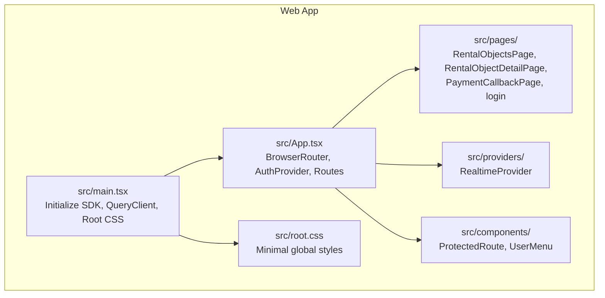

**Diagram sources**
- [apps/web/src/main.tsx](file://apps/web/src/main.tsx#L1-L44)
- [apps/web/src/App.tsx](file://apps/web/src/App.tsx#L1-L275)
- [apps/web/src/root.css](file://apps/web/src/root.css#L1-L100)

**Section sources**
- [apps/web/src/main.tsx](file://apps/web/src/main.tsx#L1-L44)
- [apps/web/src/App.tsx](file://apps/web/src/App.tsx#L1-L275)

## Core Components
- Application shell and routing: The root App component sets up the router, authentication provider, design system provider, theme context, and defines public and protected routes.
- Providers:
  - RealtimeProvider: Manages WebSocket connections and exposes subscription hooks for real-time events.
  - AuthProvider (@xala/auth): Centralizes authentication state and OAuth callback handling.
- Pages:
  - RentalObjectsPage: Public listing page with filters, view modes, and map view.
  - RentalObjectDetailPage: Property detail page with image slider and feature-based layout.
  - PaymentCallbackPage: Handles Vipps payment status after user returns from external payment flow.
  - login: Authentication page using the centralized LoginPage component.
- Shared components:
  - ProtectedRoute: Guards protected routes and preserves flow context.
  - UserMenu: Dropdown menu for authenticated users.

**Section sources**
- [apps/web/src/App.tsx](file://apps/web/src/App.tsx#L228-L252)
- [apps/web/src/providers/RealtimeProvider.tsx](file://apps/web/src/providers/RealtimeProvider.tsx#L61-L176)
- [apps/web/src/components/ProtectedRoute.tsx](file://apps/web/src/components/ProtectedRoute.tsx#L97-L187)
- [apps/web/src/pages/RentalObjectsPage.tsx](file://apps/web/src/pages/RentalObjectsPage.tsx#L175-L837)
- [apps/web/src/pages/RentalObjectDetailPage.tsx](file://apps/web/src/pages/RentalObjectDetailPage.tsx#L251-L529)
- [apps/web/src/pages/PaymentCallbackPage.tsx](file://apps/web/src/pages/PaymentCallbackPage.tsx#L22-L301)
- [apps/web/src/pages/login.tsx](file://apps/web/src/pages/login.tsx#L44-L198)

## Architecture Overview
The application follows a layered SPA architecture:
- Presentation layer: Pages and components using the Designsystemet components and primitives.
- Routing layer: React Router with nested routes and a shared main layout.
- Authentication layer: @xala/auth provider and hooks for login/logout and OAuth callback handling.
- Data layer: @tanstack/react-query for caching and fetching, @digilist/client-sdk for API integration.
- Real-time layer: WebSocket-based real-time updates via RealtimeProvider and SDK client.
- Theme and i18n: DesignsystemetProvider for theme/color scheme, I18nProvider for translations.

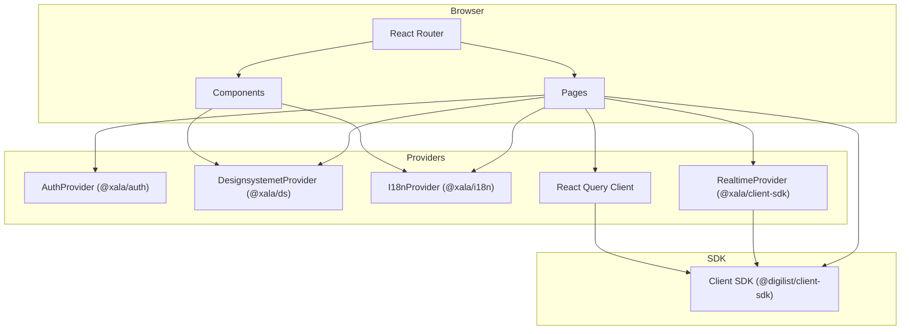

**Diagram sources**
- [apps/web/src/App.tsx](file://apps/web/src/App.tsx#L255-L272)
- [apps/web/src/main.tsx](file://apps/web/src/main.tsx#L26-L43)
- [apps/web/src/providers/RealtimeProvider.tsx](file://apps/web/src/providers/RealtimeProvider.tsx#L61-L176)

## Detailed Component Analysis

### Routing and Layout
- Public routes:
  - Home and listings: "/"
  - Rental object listing: "/rental-objects"
  - Property detail: "/rental-object/:id" (with backward compatibility "/listing/:id")
- Protected routes:
  - Payment callback: "/payment/callback"
  - Privacy settings: "/privacy"
- Layout:
  - MainLayout wraps most routes and renders the header with logo, search, theme toggle, notifications, and user menu.
  - Theme context is provided via an outlet context to MainLayout and MainLayoutWithContext.
  - ProtectedRoute is used to wrap protected pages and preserve flow context.

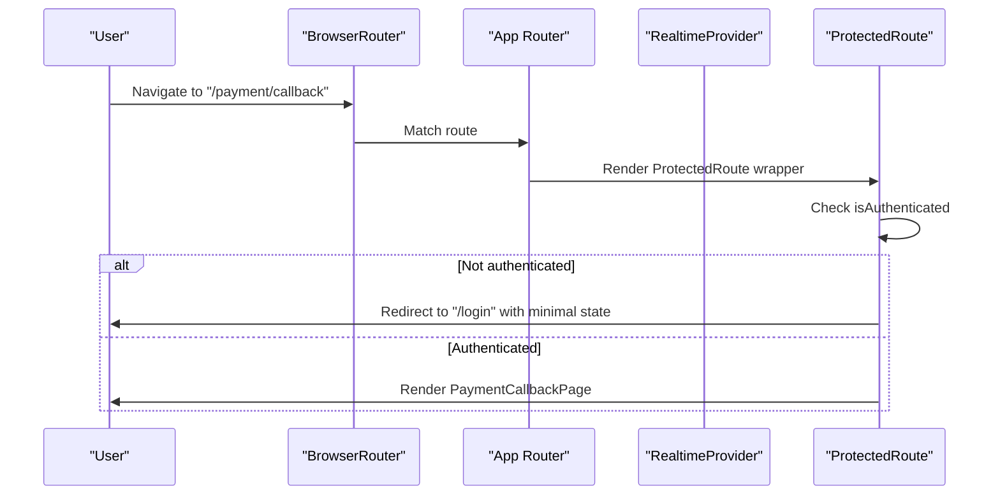

**Diagram sources**
- [apps/web/src/App.tsx](file://apps/web/src/App.tsx#L228-L246)
- [apps/web/src/components/ProtectedRoute.tsx](file://apps/web/src/components/ProtectedRoute.tsx#L97-L187)

**Section sources**
- [apps/web/src/App.tsx](file://apps/web/src/App.tsx#L228-L246)
- [apps/web/src/components/ProtectedRoute.tsx](file://apps/web/src/components/ProtectedRoute.tsx#L97-L187)

### Authentication Flow Integration with @xala/auth
- Initialization:
  - App initializes AuthProvider with API URL from environment.
  - useOAuthCallback is called at the top level to handle OAuth redirects.
- Login page:
  - Uses centralized LoginPage component with webAuthConfig.
  - Supports provider selection and demo login.
  - After successful login, restores flow context if available and navigates to the intended destination.
- ProtectedRoute:
  - When an unauthenticated user attempts to access a protected route, it saves the full navigation context (including form data) to storage and redirects to login with minimal state.
  - On login, the login page restores the context and navigates accordingly.

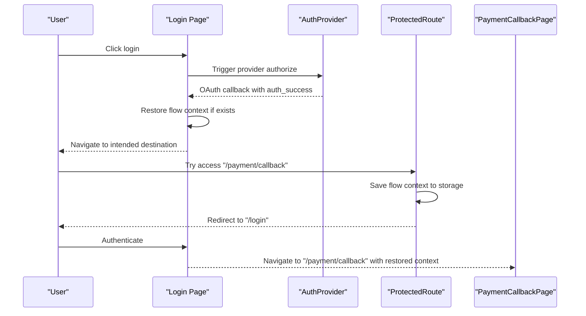

**Diagram sources**
- [apps/web/src/pages/login.tsx](file://apps/web/src/pages/login.tsx#L44-L198)
- [apps/web/src/App.tsx](file://apps/web/src/App.tsx#L170-L173)
- [apps/web/src/components/ProtectedRoute.tsx](file://apps/web/src/components/ProtectedRoute.tsx#L121-L148)

**Section sources**
- [apps/web/src/pages/login.tsx](file://apps/web/src/pages/login.tsx#L44-L198)
- [apps/web/src/App.tsx](file://apps/web/src/App.tsx#L170-L173)
- [apps/web/src/components/ProtectedRoute.tsx](file://apps/web/src/components/ProtectedRoute.tsx#L97-L187)

### Theme Management System
- Theme context:
  - AppContent manages theme preference state, system preference detection, and persistence in localStorage.
  - Effective scheme is computed as "auto" (system preference) or explicit light/dark.
- Provider:
  - DesignsystemetProvider receives theme and color scheme and applies CSS variables.
- Header controls:
  - HeaderThemeToggle toggles between light and dark modes and persists the choice.

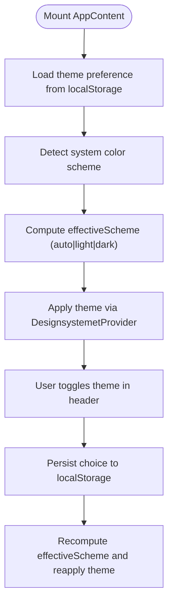

**Diagram sources**
- [apps/web/src/App.tsx](file://apps/web/src/App.tsx#L170-L215)

**Section sources**
- [apps/web/src/App.tsx](file://apps/web/src/App.tsx#L170-L215)

### Real-Time Communication Setup
- RealtimeProvider:
  - Creates a tenant-scoped WebSocket URL using SDK utilities.
  - Connects with auto-reconnect and configurable intervals.
  - Exposes subscription hooks for specific event types and a generic handler.
- Usage:
  - RentalObjectsPage subscribes to listing events and invalidates queries to keep the list fresh.
  - Other pages can subscribe to booking, audit, notification, or message events as needed.

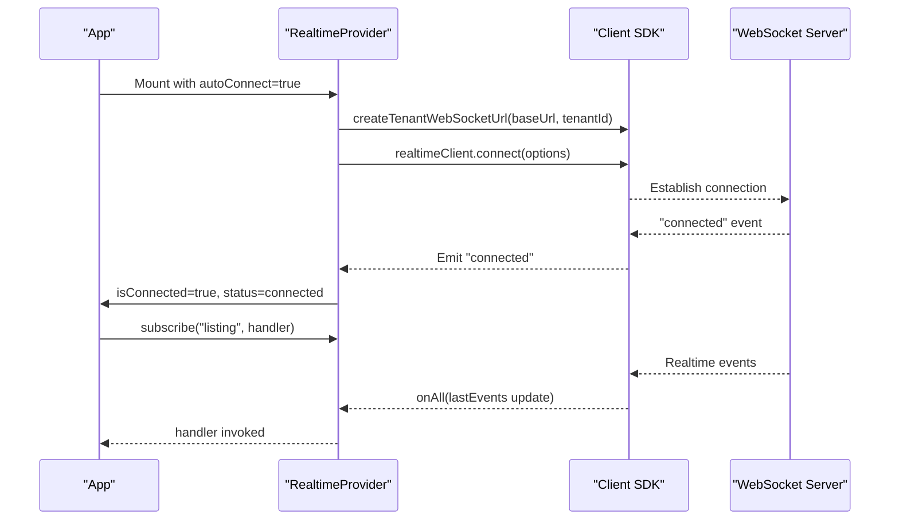

**Diagram sources**
- [apps/web/src/providers/RealtimeProvider.tsx](file://apps/web/src/providers/RealtimeProvider.tsx#L61-L176)
- [apps/web/src/pages/RentalObjectsPage.tsx](file://apps/web/src/pages/RentalObjectsPage.tsx#L191-L194)

**Section sources**
- [apps/web/src/providers/RealtimeProvider.tsx](file://apps/web/src/providers/RealtimeProvider.tsx#L61-L176)
- [apps/web/src/pages/RentalObjectsPage.tsx](file://apps/web/src/pages/RentalObjectsPage.tsx#L191-L194)

### Main Pages

#### Rental Objects Listing Page
- Features:
  - Public endpoint integration via SDK hooks.
  - Filtering by category, area, capacity, and facilities.
  - View modes: grid, list, map.
  - Search integration with GlobalSearch.
  - Skeleton loaders and empty/error states.
  - Real-time invalidation to refresh listings.
- Mobile responsiveness:
  - Dedicated mobile search wrapper and responsive toolbar.
  - Grid/list/map view adapts to viewport.

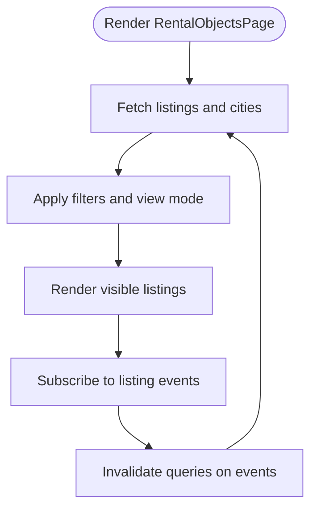

**Diagram sources**
- [apps/web/src/pages/RentalObjectsPage.tsx](file://apps/web/src/pages/RentalObjectsPage.tsx#L175-L837)

**Section sources**
- [apps/web/src/pages/RentalObjectsPage.tsx](file://apps/web/src/pages/RentalObjectsPage.tsx#L175-L837)

#### Rental Object Detail Page
- Features:
  - Fetch by ID or slug.
  - Transform API DTO to feature type.
  - Image slider, breadcrumbs, and feature-based details layout.
  - Favorite toggle and booking click handlers.
  - Flow context restoration for booking sessions.
  - Responsive animations and widget hover effects.

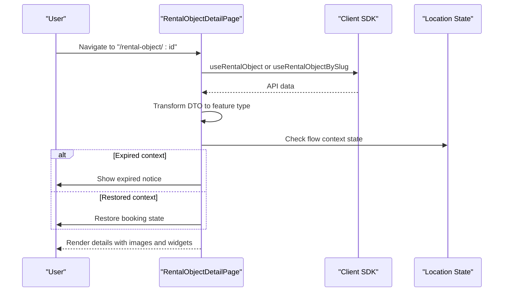

**Diagram sources**
- [apps/web/src/pages/RentalObjectDetailPage.tsx](file://apps/web/src/pages/RentalObjectDetailPage.tsx#L251-L301)

**Section sources**
- [apps/web/src/pages/RentalObjectDetailPage.tsx](file://apps/web/src/pages/RentalObjectDetailPage.tsx#L251-L301)

#### Payment Callback Page
- Features:
  - Reads orderId from query parameters.
  - Polls payment status via SDK hook.
  - Displays success, pending, or failure states.
  - Stores payment success in sessionStorage for downstream flows.

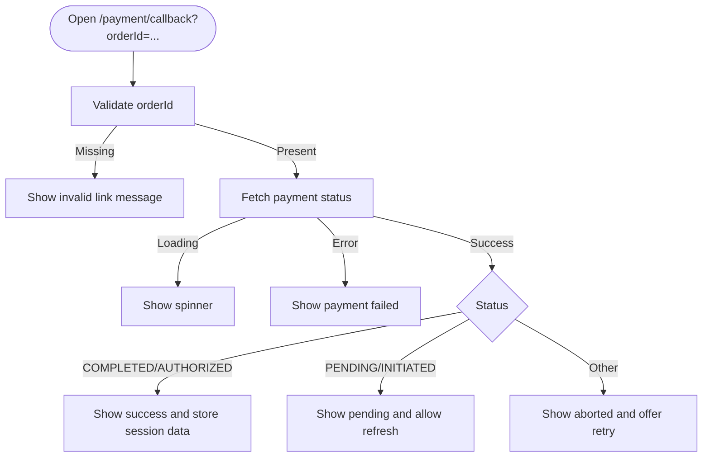

**Diagram sources**
- [apps/web/src/pages/PaymentCallbackPage.tsx](file://apps/web/src/pages/PaymentCallbackPage.tsx#L22-L301)

**Section sources**
- [apps/web/src/pages/PaymentCallbackPage.tsx](file://apps/web/src/pages/PaymentCallbackPage.tsx#L22-L301)

#### Login Page
- Features:
  - Uses centralized LoginPage with webAuthConfig.
  - Handles OAuth callback parameters and redirects.
  - Restores flow context after authentication.
  - Demo login integration.

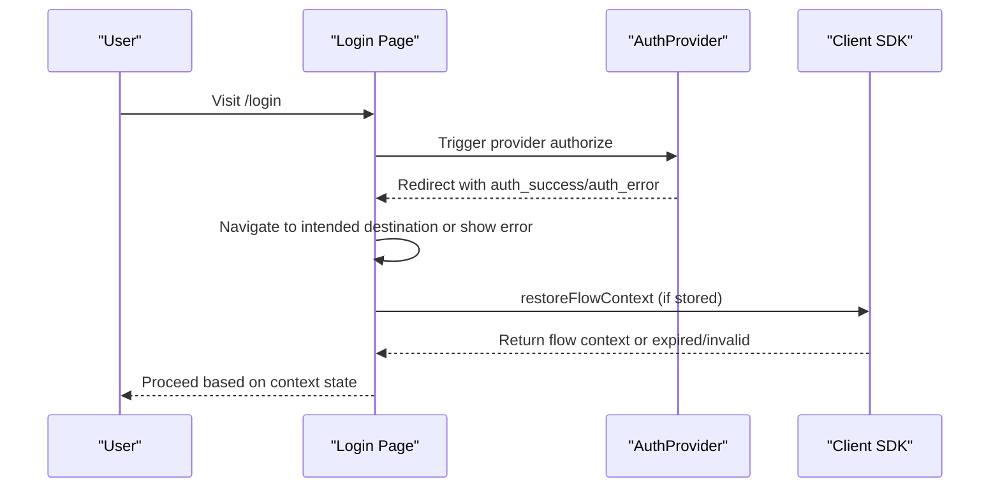

**Diagram sources**
- [apps/web/src/pages/login.tsx](file://apps/web/src/pages/login.tsx#L44-L198)

**Section sources**
- [apps/web/src/pages/login.tsx](file://apps/web/src/pages/login.tsx#L44-L198)

### Component Composition Patterns and Design System Integration
- Composition:
  - Pages compose reusable components from @xala/ds (e.g., Breadcrumb, ImageSlider, ContentLayout).
  - Feature-based layout for detail pages encapsulates related UI sections.
- Design system:
  - Global CSS imported from @xala/ds/styles.
  - root.css enforces minimal global styles and accessibility enhancements.
  - Theme and color scheme applied via DesignsystemetProvider.
- Mobile responsiveness:
  - Media queries adjust header, search, toolbar, and card layouts for small screens.
  - View toggles and drawer-based filters adapt to mobile constraints.

**Section sources**
- [apps/web/src/root.css](file://apps/web/src/root.css#L1-L100)
- [apps/web/src/App.tsx](file://apps/web/src/App.tsx#L105-L160)
- [apps/web/src/pages/RentalObjectDetailPage.tsx](file://apps/web/src/pages/RentalObjectDetailPage.tsx#L437-L522)

## Dependency Analysis
External dependencies relevant to the web application include:
- @xala/auth: Authentication provider and hooks.
- @xala/ds: Design system components and provider.
- @xala/ds-themes: Theme definitions and theme switching.
- @xala/i18n: Internationalization provider and translation hooks.
- @digilist/client-sdk: API client initialization, hooks, and realtime client.
- @tanstack/react-query: Query client and caching.
- react-router-dom: Routing.
- framer-motion: Animations.
- mapbox-gl and react-map-gl: Map rendering.

Build-time dependencies include Vite, PWA plugin, and TypeScript.

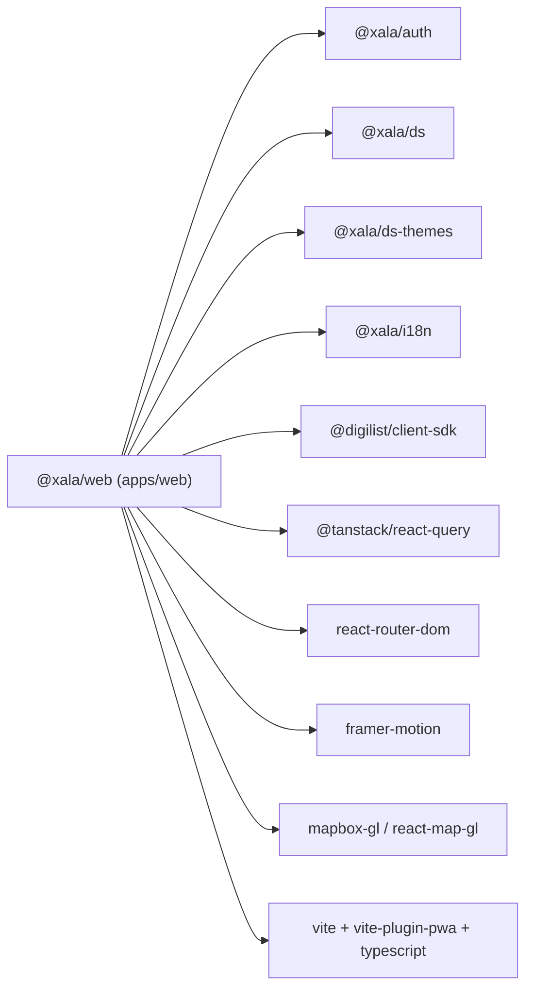

**Diagram sources**
- [apps/web/package.json](file://apps/web/package.json#L13-L37)

**Section sources**
- [apps/web/package.json](file://apps/web/package.json#L1-L39)

## Performance Considerations
- Code splitting:
  - Vite configuration splits vendor chunks for Mapbox GL, React Query, client SDK, and design system to improve caching and load performance.
- Caching:
  - Workbox runtime caching configured for fonts and API responses with sensible expiration and network timeouts.
- Query client:
  - Default staleTime and retries configured to balance freshness and performance.
- Rendering:
  - Animations via Framer Motion are used selectively to avoid heavy transitions on low-end devices.
- Map rendering:
  - Lazy map component usage reduces initial bundle size and improves first render.

**Section sources**
- [apps/web/vite.config.ts](file://apps/web/vite.config.ts#L86-L120)
- [apps/web/vite.config.ts](file://apps/web/vite.config.ts#L33-L80)
- [apps/web/src/main.tsx](file://apps/web/src/main.tsx#L26-L43)

## Troubleshooting Guide
- Authentication redirection loops:
  - ProtectedRoute guards against redirect loops by checking if the current route is the login route.
- Flow context restoration:
  - If flow context is expired, login page detects and navigates to home with an expired state to inform the user.
- Real-time connectivity:
  - RealtimeProvider tracks connection status and errors; auto-reconnect is enabled with capped attempts.
- Payment callback:
  - Missing orderId leads to an immediate error state; otherwise, the page waits for status resolution and shows appropriate UI.

**Section sources**
- [apps/web/src/components/ProtectedRoute.tsx](file://apps/web/src/components/ProtectedRoute.tsx#L165-L184)
- [apps/web/src/pages/login.tsx](file://apps/web/src/pages/login.tsx#L74-L118)
- [apps/web/src/providers/RealtimeProvider.tsx](file://apps/web/src/providers/RealtimeProvider.tsx#L115-L152)
- [apps/web/src/pages/PaymentCallbackPage.tsx](file://apps/web/src/pages/PaymentCallbackPage.tsx#L34-L58)

## Conclusion
The Web Application is a modern, design-system-driven SPA that integrates authentication, real-time updates, and a responsive layout. Its routing strategy clearly separates public and protected routes, while the authentication flow preserves user context seamlessly. The build pipeline leverages Vite and PWA features for fast delivery and offline readiness. The design system and theme provider ensure consistent visuals and accessibility across devices.

## Appendices

### Environment Variables
- VITE_API_URL: Base URL for the API.
- VITE_TENANT_ID: Tenant identifier for SDK and real-time.
- VITE_LICENSE_KEY: License key for SDK initialization.
- VITE_MAPBOX_TOKEN: Token for map rendering.

**Section sources**
- [apps/web/src/main.tsx](file://apps/web/src/main.tsx#L11-L15)
- [apps/web/src/pages/RentalObjectsPage.tsx](file://apps/web/src/pages/RentalObjectsPage.tsx#L43-L43)
- [apps/web/src/pages/RentalObjectDetailPage.tsx](file://apps/web/src/pages/RentalObjectDetailPage.tsx#L39-L40)

### Build and Deployment Notes
- Build command: vite build
- Preview command: vite preview
- PWA configuration:
  - Auto-update registration and manifest generation.
  - Runtime caching for fonts and API responses.
- Chunk splitting:
  - Vendor chunks for Mapbox GL, React Query, client SDK, and design system.
- Dev options:
  - PWA dev mode enabled for testing.

**Section sources**
- [apps/web/package.json](file://apps/web/package.json#L6-L12)
- [apps/web/vite.config.ts](file://apps/web/vite.config.ts#L11-L85)
- [apps/web/vite.config.ts](file://apps/web/vite.config.ts#L86-L120)