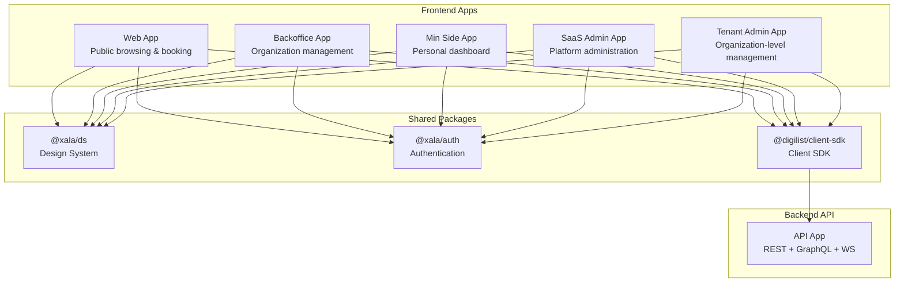
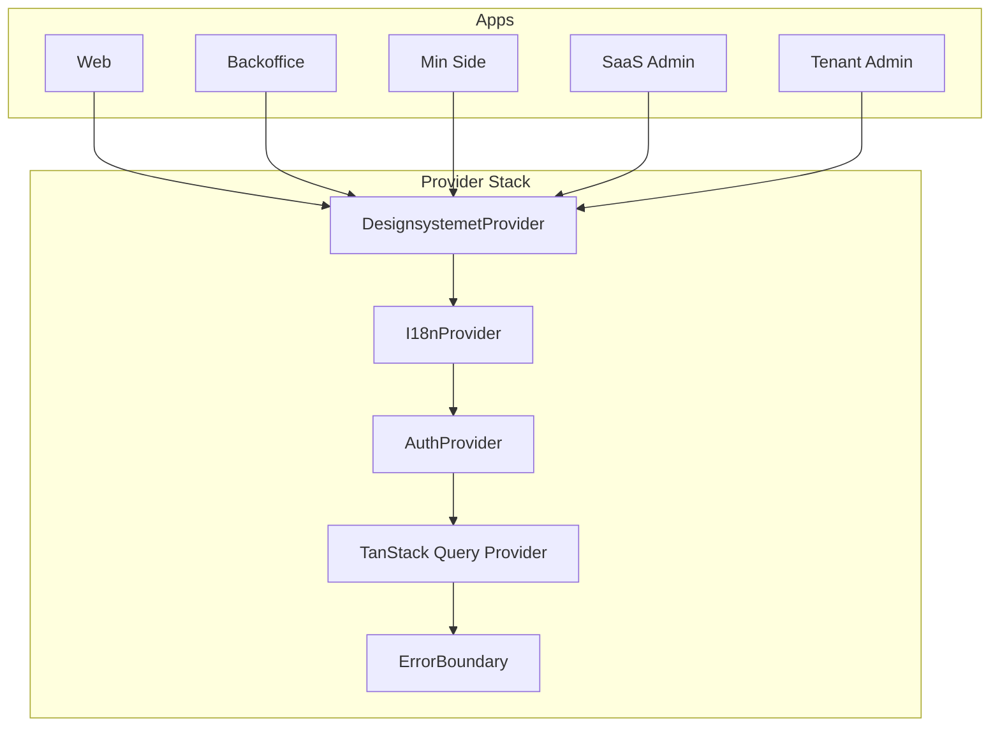
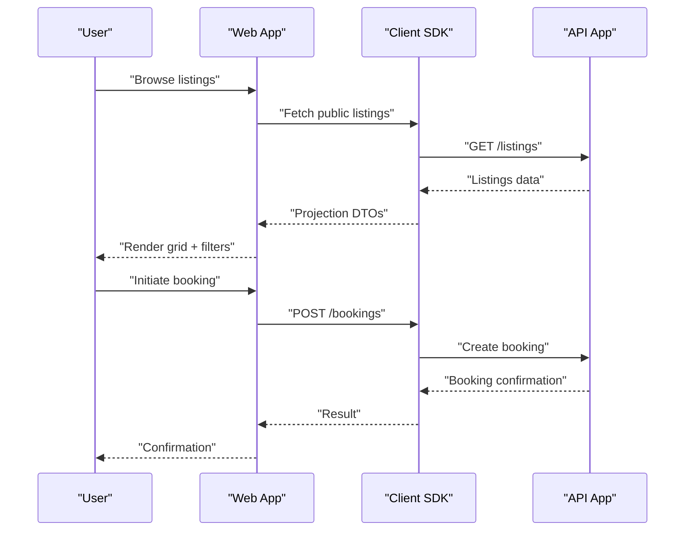
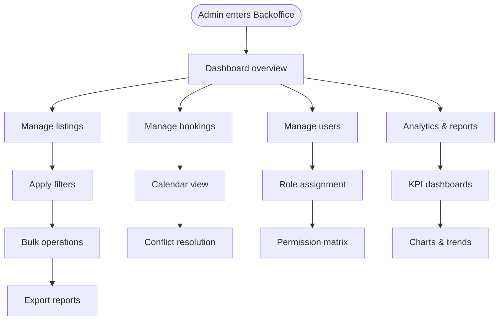
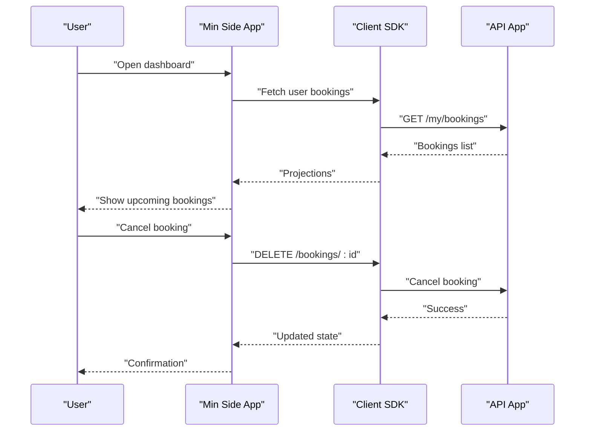
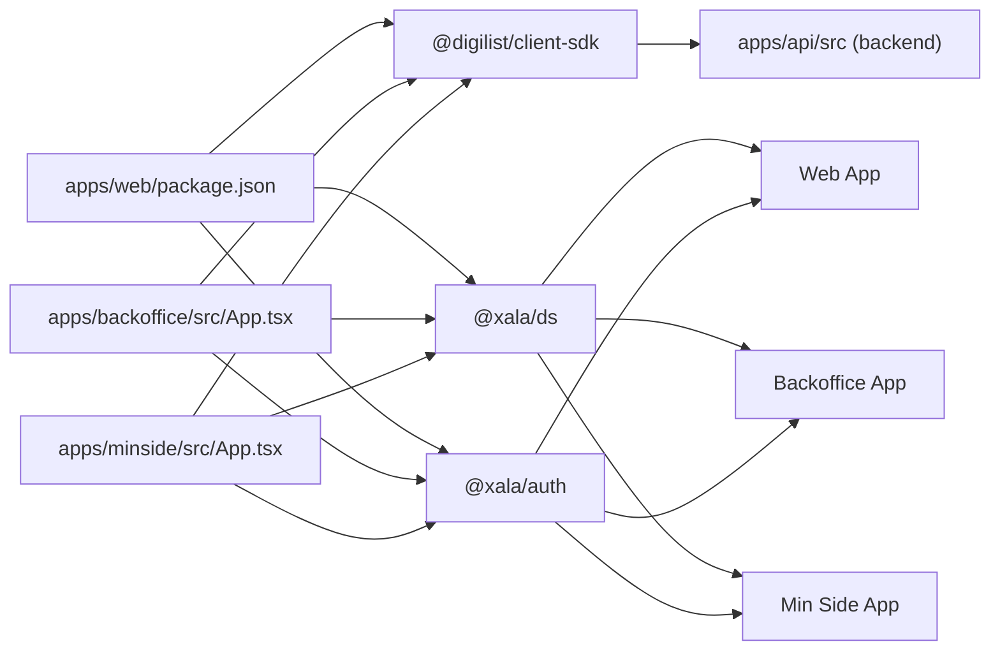

# Application Portfolio Overview

<cite>
**Referenced Files in This Document**
- [apps/README.md](file://docs/apps/README.md)
- [apps/01-web.md](file://docs/apps/01-web.md)
- [apps/02-backoffice.md](file://docs/apps/02-backoffice.md)
- [apps/03-minside.md](file://docs/apps/03-minside.md)
- [apps/04-api.md](file://docs/apps/04-api.md)
- [architecture/03-applications.md](file://docs/architecture/03-applications.md)
- [architecture/04-design-system.md](file://docs/architecture/04-design-system.md)
- [architecture/05-security.md](file://docs/architecture/05-security.md)
- [packages/ds/src/index.ts](file://packages/ds/src/index.ts)
- [packages/client-sdk/src/index.ts](file://packages/client-sdk/src/index.ts)
- [packages/auth/src/index.ts](file://packages/auth/src/index.ts)
- [apps/web/package.json](file://apps/web/package.json)
- [apps/backoffice/src/App.tsx](file://apps/backoffice/src/App.tsx)
- [apps/minside/src/App.tsx](file://apps/minside/src/App.tsx)
</cite>

## Table of Contents
1. [Introduction](#introduction)
2. [Project Structure](#project-structure)
3. [Core Components](#core-components)
4. [Architecture Overview](#architecture-overview)
5. [Detailed Component Analysis](#detailed-component-analysis)
6. [Dependency Analysis](#dependency-analysis)
7. [Performance Considerations](#performance-considerations)
8. [Troubleshooting Guide](#troubleshooting-guide)
9. [Conclusion](#conclusion)

## Introduction
This document presents the Xala Digdir application portfolio and explains how five distinct applications collaborate within a unified platform ecosystem. The portfolio includes:
- Web (public portal for property browsing and booking)
- Backoffice (property manager interface)
- Min Side (tenant personal portal)
- SaaS Admin (platform administration)
- Tenant Admin (organization-level management)

Each application targets specific user personas and use cases, while sharing common architectural patterns, authentication, design systems, and data access layers. The multi-application approach enables role-based personalization, scalability, and maintainability across diverse operational contexts.

## Project Structure
The platform is organized as a monorepo with:
- Five frontend applications under apps/
- A shared backend API under apps/api
- Shared packages for design system, authentication, and client SDK under packages/

**Diagram sources**
- [apps/README.md](file://docs/apps/README.md#L1-L238)
- [architecture/03-applications.md](file://docs/architecture/03-applications.md#L1-L535)

**Section sources**
- [apps/README.md](file://docs/apps/README.md#L1-L238)
- [architecture/03-applications.md](file://docs/architecture/03-applications.md#L1-L535)

## Core Components
This section summarizes each application’s purpose, audience, and core capabilities.

- Web (Public Portal)
  - Purpose: Public discovery, search, and booking of listings
  - Audience: General public, registered users
  - Key features: Search, filters, listing grid, booking flow, user authentication
  - Integration: Client SDK, Design System, ID-porten authentication

- Backoffice (Property Manager Interface)
  - Purpose: Administrative management of listings, bookings, users, analytics
  - Audience: Organization administrators and managers
  - Key features: Dashboard, listing management, booking calendar, user management, analytics
  - Integration: Client SDK, Design System, RBAC, real-time updates

- Min Side (Tenant Personal Portal)
  - Purpose: Personal dashboard for registered users
  - Audience: Individual users
  - Key features: Booking management, profile, notifications, settings
  - Integration: Client SDK, Design System, ID-porten authentication

- SaaS Admin (Platform Administration)
  - Purpose: Platform-wide administration and oversight
  - Audience: Platform administrators
  - Key features: Organization management, tenant settings, audit logs, reports
  - Integration: Client SDK, Design System, RBAC

- Tenant Admin (Organization-Level Management)
  - Purpose: Organization-level configuration and management
  - Audience: Organization administrators
  - Key features: Users, branding, features, audit, settings
  - Integration: Client SDK, Design System, RBAC

**Section sources**
- [apps/README.md](file://docs/apps/README.md#L1-L238)
- [apps/01-web.md](file://docs/apps/01-web.md#L1-L599)
- [apps/02-backoffice.md](file://docs/apps/02-backoffice.md#L1-L803)
- [apps/03-minside.md](file://docs/apps/03-minside.md#L1-L920)

## Architecture Overview
The applications follow a consistent architecture with shared patterns:
- Contract-first data fetching via a centralized client SDK
- Design system compliance for UI consistency
- TypeScript across the stack
- Feature-based organization
- Provider stacks for authentication, i18n, design system, and error handling

**Diagram sources**
- [architecture/03-applications.md](file://docs/architecture/03-applications.md#L42-L65)
- [apps/backoffice/src/App.tsx](file://apps/backoffice/src/App.tsx#L87-L120)
- [apps/minside/src/App.tsx](file://apps/minside/src/App.tsx#L103-L123)

**Section sources**
- [architecture/03-applications.md](file://docs/architecture/03-applications.md#L13-L65)
- [apps/backoffice/src/App.tsx](file://apps/backoffice/src/App.tsx#L87-L120)
- [apps/minside/src/App.tsx](file://apps/minside/src/App.tsx#L103-L123)

## Detailed Component Analysis

### Web Application
- Target users: General public and registered users
- Core functionalities: Public listing discovery, advanced search, booking flow, user authentication
- Integration points:
  - Client SDK for API communication
  - Design System for UI components
  - Authentication via ID-porten
  - Real-time updates via WebSocket

**Diagram sources**
- [apps/01-web.md](file://docs/apps/01-web.md#L129-L159)
- [apps/04-api.md](file://docs/apps/04-api.md#L342-L510)
- [packages/client-sdk/src/index.ts](file://packages/client-sdk/src/index.ts#L79-L88)

**Section sources**
- [apps/01-web.md](file://docs/apps/01-web.md#L1-L599)
- [apps/04-api.md](file://docs/apps/04-api.md#L1-L800)
- [packages/client-sdk/src/index.ts](file://packages/client-sdk/src/index.ts#L1-L168)

### Backoffice Application
- Target users: Organization administrators
- Core functionalities: Dashboard, listing management, booking calendar, user management, analytics
- Integration points:
  - Client SDK for CRUD operations
  - Design System for consistent UI
  - RBAC for granular permissions
  - Real-time updates for live collaboration

**Diagram sources**
- [apps/02-backoffice.md](file://docs/apps/02-backoffice.md#L129-L180)
- [apps/02-backoffice.md](file://docs/apps/02-backoffice.md#L293-L358)
- [apps/02-backoffice.md](file://docs/apps/02-backoffice.md#L360-L438)

**Section sources**
- [apps/02-backoffice.md](file://docs/apps/02-backoffice.md#L1-L803)

### Min Side Application
- Target users: Registered users
- Core functionalities: Personal dashboard, booking management, profile, notifications
- Integration points:
  - Client SDK for personal data
  - Design System for UI
  - ID-porten authentication
  - Real-time notifications

**Diagram sources**
- [apps/03-minside.md](file://docs/apps/03-minside.md#L159-L263)
- [apps/04-api.md](file://docs/apps/04-api.md#L342-L469)
- [packages/client-sdk/src/index.ts](file://packages/client-sdk/src/index.ts#L79-L88)

**Section sources**
- [apps/03-minside.md](file://docs/apps/03-minside.md#L1-L920)

### SaaS Admin and Tenant Admin Applications
- SaaS Admin (Platform Administration):
  - Purpose: Platform-wide administration (organizations, tenants, audit)
  - Integration: Client SDK, Design System, RBAC
- Tenant Admin (Organization-Level Management):
  - Purpose: Organization-level configuration (users, branding, features)
  - Integration: Client SDK, Design System, RBAC

These applications share the same architectural patterns and provider stack as other frontend apps, enabling consistent development and maintenance.

**Section sources**
- [apps/README.md](file://docs/apps/README.md#L1-L238)
- [apps/02-backoffice.md](file://docs/apps/02-backoffice.md#L365-L414)

## Dependency Analysis
The applications depend on shared packages and the backend API. The following diagram shows key dependencies:

**Diagram sources**
- [apps/web/package.json](file://apps/web/package.json#L13-L27)
- [apps/backoffice/src/App.tsx](file://apps/backoffice/src/App.tsx#L1-L15)
- [apps/minside/src/App.tsx](file://apps/minside/src/App.tsx#L1-L11)
- [packages/client-sdk/src/index.ts](file://packages/client-sdk/src/index.ts#L1-L168)
- [packages/ds/src/index.ts](file://packages/ds/src/index.ts#L1-L596)
- [packages/auth/src/index.ts](file://packages/auth/src/index.ts#L1-L52)

**Section sources**
- [apps/web/package.json](file://apps/web/package.json#L1-L39)
- [apps/backoffice/src/App.tsx](file://apps/backoffice/src/App.tsx#L1-L15)
- [apps/minside/src/App.tsx](file://apps/minside/src/App.tsx#L1-L11)
- [packages/client-sdk/src/index.ts](file://packages/client-sdk/src/index.ts#L1-L168)
- [packages/ds/src/index.ts](file://packages/ds/src/index.ts#L1-L596)
- [packages/auth/src/index.ts](file://packages/auth/src/index.ts#L1-L52)

## Performance Considerations
- Frontend optimizations:
  - Route-level code splitting and lazy loading
  - TanStack Query caching and prefetching
  - Image optimization with responsive URLs and lazy loading
  - Virtualization for large datasets
- Backend optimizations:
  - Database indexing and query caching
  - Response caching decorators
  - WebSocket-based real-time updates
- Monitoring:
  - Application metrics (Core Web Vitals, error tracking)
  - API health checks and performance monitoring

[No sources needed since this section provides general guidance]

## Troubleshooting Guide
Common issues and resolutions:
- Port conflicts: Ensure ports are free (Web: 5173, Backoffice: 5174, Min Side: 5175, API: 3002)
- CORS errors: Verify API configuration and proxy settings
- Build failures: Check TypeScript errors and missing dependencies
- Test failures: Validate mock data and environment variables

Debugging tools:
- React DevTools for frontend debugging
- API docs endpoint (/docs) for backend inspection
- Browser console and network tab for API calls
- Application error boundaries and global error handlers

**Section sources**
- [apps/README.md](file://docs/apps/README.md#L204-L217)

## Conclusion
The Xala Digdir application portfolio leverages a multi-application architecture to serve distinct user personas while maintaining consistency through shared design systems, authentication, and data access layers. This approach enables scalable, maintainable, and secure delivery of public browsing, administrative management, and personal dashboards, forming a cohesive platform ecosystem.