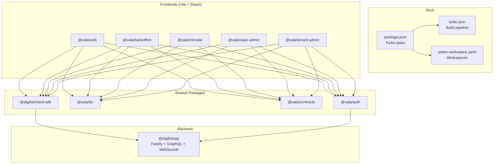
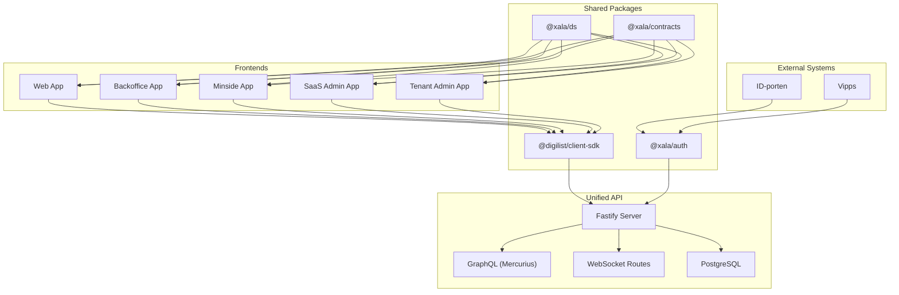
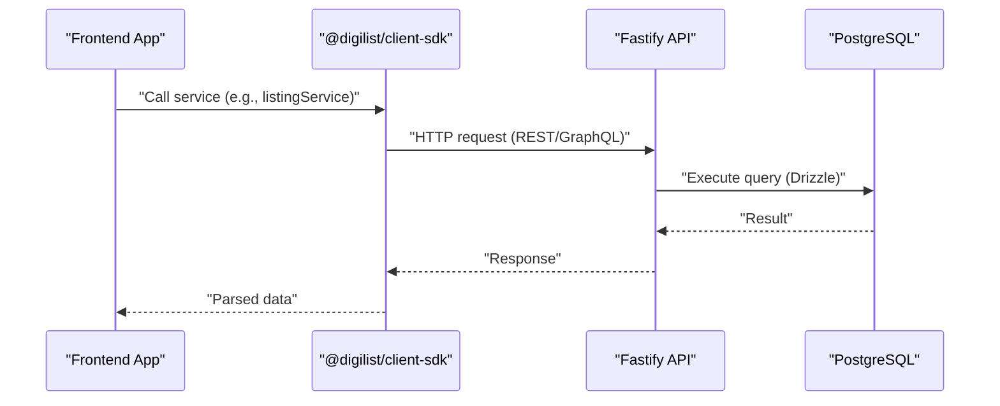
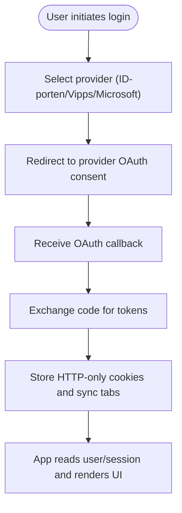
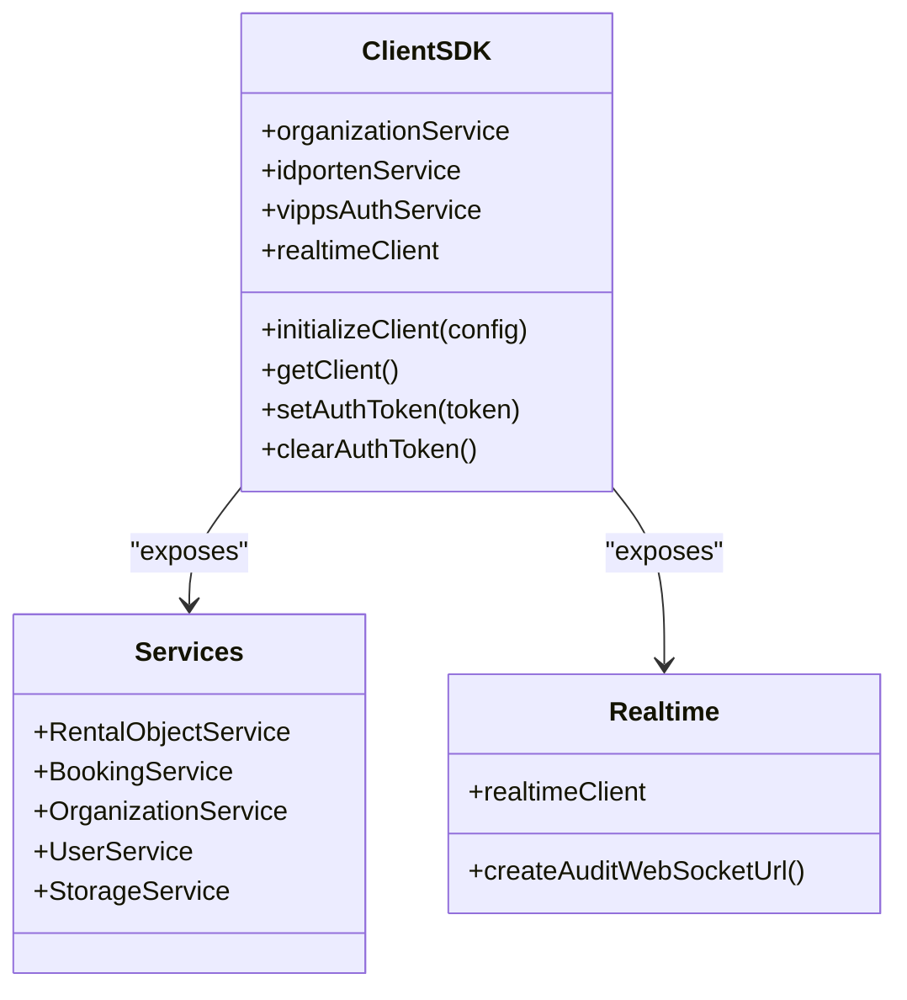
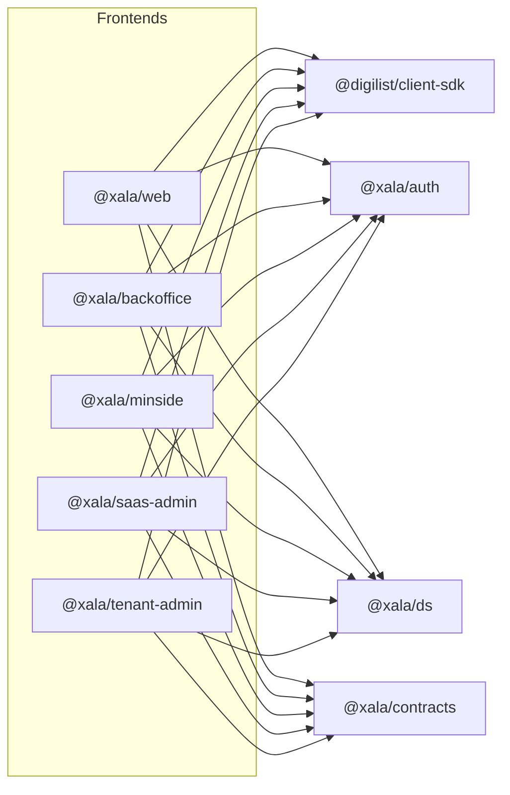

# Architecture Overview

<cite>
**Referenced Files in This Document**
- [package.json](file://package.json)
- [turbo.json](file://turbo.json)
- [pnpm-workspace.yaml](file://pnpm-workspace.yaml)
- [apps/api/package.json](file://apps/api/package.json)
- [apps/api/src/main.ts](file://apps/api/src/main.ts)
- [apps/api/src/config/index.ts](file://apps/api/src/config/index.ts)
- [apps/web/package.json](file://apps/web/package.json)
- [apps/backoffice/package.json](file://apps/backoffice/package.json)
- [apps/minside/package.json](file://apps/minside/package.json)
- [apps/saas-admin/package.json](file://apps/saas-admin/package.json)
- [apps/tenant-admin/package.json](file://apps/tenant-admin/package.json)
- [packages/client-sdk/src/index.ts](file://packages/client-sdk/src/index.ts)
- [packages/auth/src/index.ts](file://packages/auth/src/index.ts)
- [packages/ds/src/index.ts](file://packages/ds/src/index.ts)
- [packages/contracts/src/index.ts](file://packages/contracts/src/index.ts)
</cite>

## Table of Contents
1. [Introduction](#introduction)
2. [Project Structure](#project-structure)
3. [Core Components](#core-components)
4. [Architecture Overview](#architecture-overview)
5. [Detailed Component Analysis](#detailed-component-analysis)
6. [Dependency Analysis](#dependency-analysis)
7. [Performance Considerations](#performance-considerations)
8. [Troubleshooting Guide](#troubleshooting-guide)
9. [Conclusion](#conclusion)

## Introduction
This document describes the Xala Digdir platform architecture as a Turborepo monorepo powered by Vite + React applications and a Fastify-based API server. The system is organized into five frontend applications (web, backoffice, minside, saas-admin, tenant-admin), a unified backend API, and shared packages for authentication, design system, contracts, and a client SDK. The backend persists data in PostgreSQL and exposes REST, GraphQL, and WebSocket endpoints. Cross-cutting concerns include authentication and authorization (via ID-porten and Vipps), real-time communication, and data consistency across modules.

## Project Structure
The repository follows a Turborepo monorepo with pnpm workspaces:
- Root orchestrates builds, linting, testing, and deployment via Turbo and pnpm scripts.
- apps/ contains five frontend Vite applications and the backend API.
- packages/ contains shared libraries: auth, design system, contracts, client SDK, and others.
- docker/ provides Nginx routing for subdomain-based app hosting.

**Diagram sources**
- [package.json](file://package.json#L1-L115)
- [turbo.json](file://turbo.json#L1-L19)
- [pnpm-workspace.yaml](file://pnpm-workspace.yaml#L1-L6)
- [apps/web/package.json](file://apps/web/package.json#L1-L39)
- [apps/backoffice/package.json](file://apps/backoffice/package.json#L1-L36)
- [apps/minside/package.json](file://apps/minside/package.json#L1-L36)
- [apps/saas-admin/package.json](file://apps/saas-admin/package.json#L1-L35)
- [apps/tenant-admin/package.json](file://apps/tenant-admin/package.json#L1-L35)
- [apps/api/package.json](file://apps/api/package.json#L1-L73)
- [packages/client-sdk/src/index.ts](file://packages/client-sdk/src/index.ts#L1-L168)
- [packages/auth/src/index.ts](file://packages/auth/src/index.ts#L1-L52)
- [packages/ds/src/index.ts](file://packages/ds/src/index.ts#L1-L596)
- [packages/contracts/src/index.ts](file://packages/contracts/src/index.ts#L1-L139)

**Section sources**
- [package.json](file://package.json#L1-L115)
- [turbo.json](file://turbo.json#L1-L19)
- [pnpm-workspace.yaml](file://pnpm-workspace.yaml#L1-L6)

## Core Components
- Unified API server (Fastify):
  - Registers controllers, plugins, GraphQL (Mercurius), and WebSocket routes.
  - Uses dependency injection container to register repositories, services, and controllers.
  - Connects to PostgreSQL via Drizzle ORM and exposes health, REST, GraphQL, and WebSocket endpoints.
- Frontend applications:
  - Five Vite + React apps share the client SDK, authentication, design system, and contracts.
  - Each app integrates React Router, TanStack React Query, and Sentry for error tracking.
- Shared packages:
  - @xala/auth: centralized OAuth providers (ID-porten, Vipps, Microsoft) and protected routing.
  - @xala/ds: design system built on Digdir Designsystemet with layered components.
  - @xala/contracts: Zod schemas, TypeScript types, and UI projections for API contracts.
  - @digilist/client-sdk: type-safe HTTP client, React Query hooks, and real-time WebSocket client.

**Section sources**
- [apps/api/src/main.ts](file://apps/api/src/main.ts#L1-L366)
- [apps/api/package.json](file://apps/api/package.json#L1-L73)
- [apps/web/package.json](file://apps/web/package.json#L1-L39)
- [apps/backoffice/package.json](file://apps/backoffice/package.json#L1-L36)
- [apps/minside/package.json](file://apps/minside/package.json#L1-L36)
- [apps/saas-admin/package.json](file://apps/saas-admin/package.json#L1-L35)
- [apps/tenant-admin/package.json](file://apps/tenant-admin/package.json#L1-L35)
- [packages/auth/src/index.ts](file://packages/auth/src/index.ts#L1-L52)
- [packages/ds/src/index.ts](file://packages/ds/src/index.ts#L1-L596)
- [packages/contracts/src/index.ts](file://packages/contracts/src/index.ts#L1-L139)
- [packages/client-sdk/src/index.ts](file://packages/client-sdk/src/index.ts#L1-L168)

## Architecture Overview
High-level system context:
- Frontends communicate with the backend via REST and GraphQL endpoints exposed by the API server.
- The API server connects to PostgreSQL for persistence and exposes WebSocket endpoints for real-time audit events.
- Authentication integrates with ID-porten and Vipps through dedicated controllers and OAuth flows.
- Shared packages enforce contract-first development and consistent UI behavior across apps.

**Diagram sources**
- [apps/api/src/main.ts](file://apps/api/src/main.ts#L1-L366)
- [apps/api/src/config/index.ts](file://apps/api/src/config/index.ts#L1-L5)
- [packages/auth/src/index.ts](file://packages/auth/src/index.ts#L1-L52)
- [packages/client-sdk/src/index.ts](file://packages/client-sdk/src/index.ts#L1-L168)
- [packages/ds/src/index.ts](file://packages/ds/src/index.ts#L1-L596)
- [packages/contracts/src/index.ts](file://packages/contracts/src/index.ts#L1-L139)

## Detailed Component Analysis

### Backend API (Fastify)
- Bootstrapping:
  - Initializes platform adapters, registers database, JWT service, repositories, services, and controllers.
  - Loads modular controllers and registers REST plugin routes (features, amenities, addons, favorites).
  - Registers GraphQL schema and resolvers via Mercurius and exposes WebSocket routes for real-time events.
- Endpoints:
  - REST: tenant, rental-objects, bookings, audit, health, and more.
  - GraphQL: endpoint at /graphql with GraphiQL enabled.
  - WebSocket: real-time audit events at ws://host/ws/audit.
- Persistence:
  - PostgreSQL connection configured via DATABASE_URL; Drizzle ORM used for schema and queries.
- Security:
  - JWT_SECRET required for authentication; rate limiting and CORS enabled via Fastify plugins.

**Diagram sources**
- [apps/api/src/main.ts](file://apps/api/src/main.ts#L1-L366)
- [packages/client-sdk/src/index.ts](file://packages/client-sdk/src/index.ts#L1-L168)

**Section sources**
- [apps/api/src/main.ts](file://apps/api/src/main.ts#L112-L360)
- [apps/api/package.json](file://apps/api/package.json#L35-L56)

### Authentication and Authorization (@xala/auth)
- Provides:
  - OAuth providers: ID-porten, Vipps, Microsoft, and demo provider.
  - Auth context and protected routes.
  - App-specific auth configurations (web, minside, backoffice, saas-admin).
- Cross-tab session synchronization and flow context preservation support.
- No mock authentication; security-first implementation.

**Diagram sources**
- [packages/auth/src/index.ts](file://packages/auth/src/index.ts#L1-L52)

**Section sources**
- [packages/auth/src/index.ts](file://packages/auth/src/index.ts#L1-L52)

### Client SDK (@digilist/client-sdk)
- Exposes:
  - Client factory and configuration utilities.
  - 24+ domain services (e.g., rental-object, booking, organization, user).
  - React Query hooks and providers.
  - Real-time client for WebSocket audit events.
  - Utility functions for date formatting, geocoding, upload progress, and flow context.
- Enables type-safe consumption of backend APIs and real-time updates.

**Diagram sources**
- [packages/client-sdk/src/index.ts](file://packages/client-sdk/src/index.ts#L1-L168)

**Section sources**
- [packages/client-sdk/src/index.ts](file://packages/client-sdk/src/index.ts#L1-L168)

### Design System (@xala/ds)
- Layered component architecture:
  - Primitives (low-level): containers, grids, stacks, icons.
  - Composed (mid-level): content layouts, navigation, dialogs.
  - Blocks (business logic): listing cards, calendars, forms.
  - Shells (application level): app shell and page layouts.
- Re-exports Digdir Designsystemet components and enforces single CSS import policy.

**Section sources**
- [packages/ds/src/index.ts](file://packages/ds/src/index.ts#L1-L596)

### Contracts (@xala/contracts)
- Single source of truth for API contracts:
  - Zod schemas for validation.
  - TypeScript types for strong typing.
  - UI projections for rendering.
- Used by API, SDK, and frontends to maintain contract parity.

**Section sources**
- [packages/contracts/src/index.ts](file://packages/contracts/src/index.ts#L1-L139)

### Frontend Applications
- Web, Backoffice, Minside, SaaS Admin, Tenant Admin:
  - Vite + React with React Router and TanStack React Query.
  - Integrate @xala/auth for authentication and @xala/ds for UI.
  - Consume @digilist/client-sdk for API interactions and real-time events.
  - Use @xala/contracts for type safety and projections.

**Section sources**
- [apps/web/package.json](file://apps/web/package.json#L1-L39)
- [apps/backoffice/package.json](file://apps/backoffice/package.json#L1-L36)
- [apps/minside/package.json](file://apps/minside/package.json#L1-L36)
- [apps/saas-admin/package.json](file://apps/saas-admin/package.json#L1-L35)
- [apps/tenant-admin/package.json](file://apps/tenant-admin/package.json#L1-L35)

## Dependency Analysis
- Monorepo tooling:
  - pnpm workspaces define package locations.
  - Turbo orchestrates build/lint/test tasks with caching and incremental builds.
- Internal dependencies:
  - Frontends depend on @digilist/client-sdk, @xala/auth, @xala/ds, @xala/contracts.
  - API depends on @digilist/database-schema and @xala/contracts.
  - Shared packages are published as workspace:* to enable local linking.

**Diagram sources**
- [pnpm-workspace.yaml](file://pnpm-workspace.yaml#L1-L6)
- [apps/web/package.json](file://apps/web/package.json#L13-L26)
- [apps/backoffice/package.json](file://apps/backoffice/package.json#L12-L23)
- [apps/minside/package.json](file://apps/minside/package.json#L12-L24)
- [apps/saas-admin/package.json](file://apps/saas-admin/package.json#L12-L23)
- [apps/tenant-admin/package.json](file://apps/tenant-admin/package.json#L12-L23)
- [packages/client-sdk/src/index.ts](file://packages/client-sdk/src/index.ts#L1-L168)
- [packages/auth/src/index.ts](file://packages/auth/src/index.ts#L1-L52)
- [packages/ds/src/index.ts](file://packages/ds/src/index.ts#L1-L596)
- [packages/contracts/src/index.ts](file://packages/contracts/src/index.ts#L1-L139)

**Section sources**
- [pnpm-workspace.yaml](file://pnpm-workspace.yaml#L1-L6)
- [package.json](file://package.json#L1-L115)

## Performance Considerations
- Build optimization:
  - Turbo enables parallel builds, caching, and incremental rebuilds across apps and packages.
- Frontend performance:
  - Vite provides fast dev server and optimized production builds.
  - React Query manages caching and background refetching; configure staleTime/cacheTime appropriately.
- Backend performance:
  - Drizzle ORM with connection pooling; keep max connections aligned with database capacity.
  - GraphQL schema and resolvers should avoid N+1 queries; use DataLoader patterns if needed.
- Real-time:
  - WebSocket connections should be monitored for memory leaks; ensure proper cleanup on unmount.

[No sources needed since this section provides general guidance]

## Troubleshooting Guide
- Environment variables:
  - API requires DATABASE_URL and JWT_SECRET; missing values cause startup failures.
- Authentication:
  - Verify OAuth provider configurations and callback URLs for each app.
  - Ensure HTTP-only cookies are set correctly for cross-tab synchronization.
- Real-time:
  - Confirm WebSocket URL and permissions; check browser console for connection errors.
- Database:
  - Run migrations and seed scripts via API package scripts; validate schema and data integrity.

**Section sources**
- [apps/api/src/main.ts](file://apps/api/src/main.ts#L122-L146)
- [apps/api/package.json](file://apps/api/package.json#L23-L33)

## Conclusion
The Xala Digdir platform employs a cohesive Turborepo architecture with Vite + React frontends and a Fastify-powered backend. Shared packages enforce contract-first development, consistent UI, and robust authentication. The system’s modular design, real-time capabilities, and clear separation of concerns support scalable growth and maintainability across the five frontend applications and unified backend services.