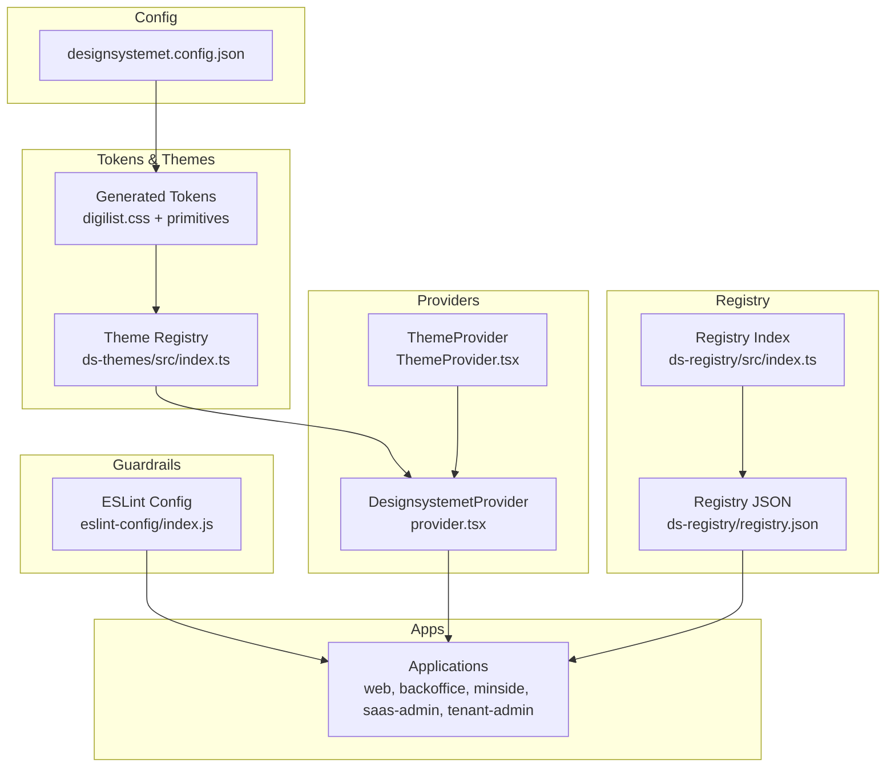
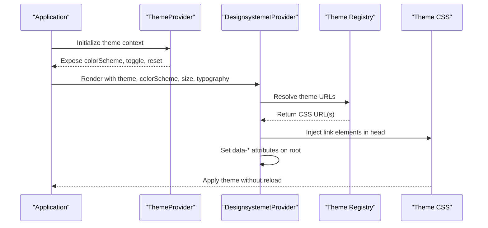
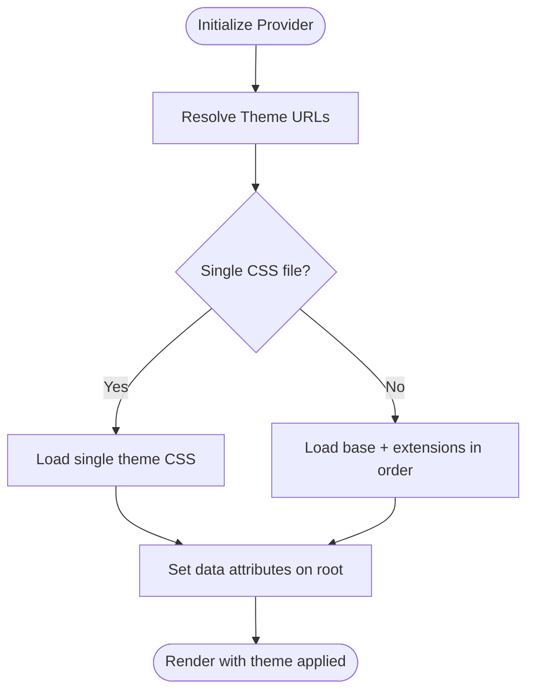
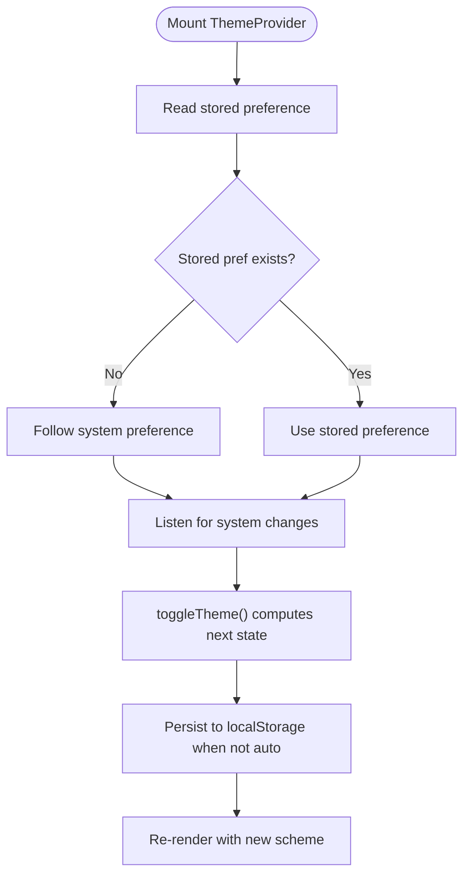
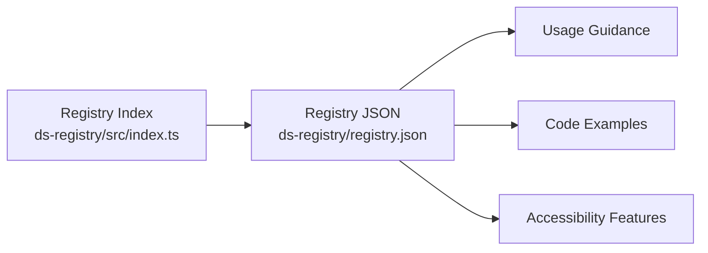
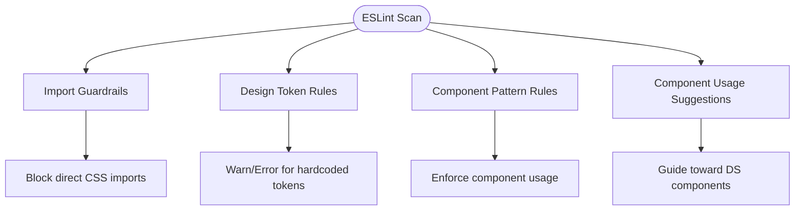
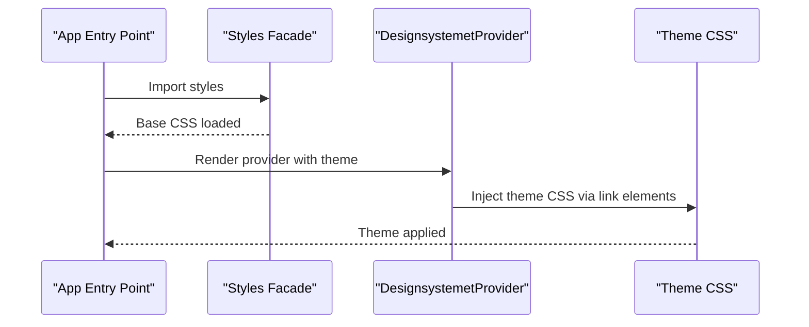
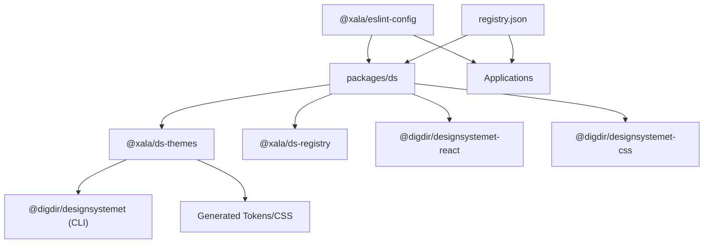
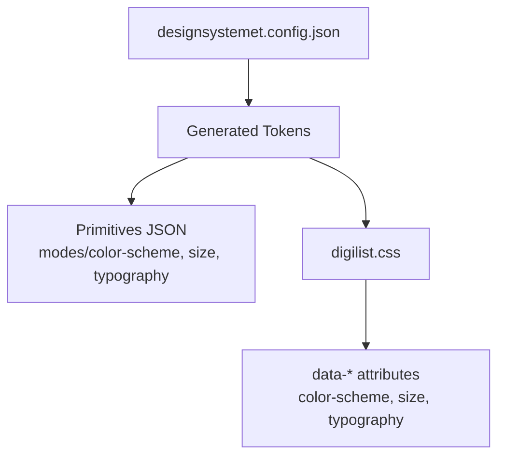

# Design System Integration

<cite>
**Referenced Files in This Document**
- [designsystemet.config.json](file://designsystemet.config.json)
- [packages/ds/package.json](file://packages/ds/package.json)
- [packages/ds-themes/package.json](file://packages/ds-themes/package.json)
- [packages/ds-registry/package.json](file://packages/ds-registry/package.json)
- [packages/eslint-config/package.json](file://packages/eslint-config/package.json)
- [packages/ds/src/provider.tsx](file://packages/ds/src/provider.tsx)
- [packages/ds/src/ThemeProvider.tsx](file://packages/ds/src/ThemeProvider.tsx)
- [packages/ds-themes/src/index.ts](file://packages/ds-themes/src/index.ts)
- [packages/ds-registry/src/index.ts](file://packages/ds-registry/src/index.ts)
- [packages/eslint-config/index.js](file://packages/eslint-config/index.js)
- [packages/ds/src/styles.ts](file://packages/ds/src/styles.ts)
- [packages/ds-themes/generated/digilist.css](file://packages/ds-themes/generated/digilist.css)
- [packages/ds-themes/generated/primitives/modes/color-scheme/dark/digilist.json](file://packages/ds-themes/generated/primitives/modes/color-scheme/dark/digilist.json)
- [packages/ds-themes/generated/primitives/modes/color-scheme/light/digilist.json](file://packages/ds-themes/generated/primitives/modes/color-scheme/light/digilist.json)
- [packages/ds-themes/generated/primitives/modes/size/global.json](file://packages/ds-themes/generated/primitives/modes/size/global.json)
- [packages/ds-themes/generated/primitives/modes/typography/primary/digilist.json](file://packages/ds-themes/generated/primitives/modes/typography/primary/digilist.json)
- [packages/ds-registry/registry.json](file://packages/ds-registry/registry.json)
</cite>

## Table of Contents
1. [Introduction](#introduction)
2. [Project Structure](#project-structure)
3. [Core Components](#core-components)
4. [Architecture Overview](#architecture-overview)
5. [Detailed Component Analysis](#detailed-component-analysis)
6. [Dependency Analysis](#dependency-analysis)
7. [Performance Considerations](#performance-considerations)
8. [Troubleshooting Guide](#troubleshooting-guide)
9. [Conclusion](#conclusion)
10. [Appendices](#appendices)

## Introduction
This document explains how the platform integrates the Norwegian National Design System (Designsystemet) to ensure visual and behavioral consistency across all applications. It covers theme switching between official Digdir brand themes and custom Digilist extensions, the component registry system, design tokens management, and the enforcement of design system usage through ESLint rules. It also details how design tokens map to CSS variables, how the system balances standardization with customization, and how accessibility is supported across applications.

## Project Structure
The design system integration spans several packages and configuration files:
- Designsystemet configuration and theme generation
- Theme registry and runtime switching
- Provider components for theme application
- Component registry for documentation and usage guidance
- ESLint guardrails enforcing design system usage
- Styles facade ensuring consistent CSS loading

**Diagram sources**
- [designsystemet.config.json](file://designsystemet.config.json#L1-L21)
- [packages/ds-themes/src/index.ts](file://packages/ds-themes/src/index.ts#L1-L56)
- [packages/ds/src/provider.tsx](file://packages/ds/src/provider.tsx#L1-L130)
- [packages/ds/src/ThemeProvider.tsx](file://packages/ds/src/ThemeProvider.tsx#L1-L120)
- [packages/ds-registry/src/index.ts](file://packages/ds-registry/src/index.ts#L1-L36)
- [packages/eslint-config/index.js](file://packages/eslint-config/index.js#L1-L220)

**Section sources**
- [designsystemet.config.json](file://designsystemet.config.json#L1-L21)
- [packages/ds-themes/package.json](file://packages/ds-themes/package.json#L1-L27)
- [packages/ds/package.json](file://packages/ds/package.json#L1-L42)
- [packages/ds-registry/package.json](file://packages/ds-registry/package.json#L1-L45)
- [packages/eslint-config/package.json](file://packages/eslint-config/package.json#L1-L15)

## Core Components
- Theme registry and runtime switching: The theme registry defines official Digdir themes and the Digilist custom theme as an ordered pair of CSS files (base + extensions). The provider dynamically loads theme CSS via link elements and applies data attributes for color scheme, size, and typography.
- Providers: The ThemeProvider manages user preferences and system color-scheme detection, while the DesignsystemetProvider applies the chosen theme and attributes to the DOM.
- Component registry: A JSON-based registry documents components, their props, accessibility features, and usage examples, enabling consistent adoption across applications.
- ESLint guardrails: The ESLint configuration enforces importing design tokens and components via the @xala/ds facade, restricts direct imports of Designsystemet CSS and theme CSS, and suggests preferred component usage and provider presence.
- Styles facade: A single import point ensures all applications consume Designsystemet CSS consistently and prevents duplicate loading.

**Section sources**
- [packages/ds-themes/src/index.ts](file://packages/ds-themes/src/index.ts#L1-L56)
- [packages/ds/src/provider.tsx](file://packages/ds/src/provider.tsx#L1-L130)
- [packages/ds/src/ThemeProvider.tsx](file://packages/ds/src/ThemeProvider.tsx#L1-L120)
- [packages/ds-registry/src/index.ts](file://packages/ds-registry/src/index.ts#L1-L36)
- [packages/eslint-config/index.js](file://packages/eslint-config/index.js#L64-L194)
- [packages/ds/src/styles.ts](file://packages/ds/src/styles.ts#L1-L24)

## Architecture Overview
The system separates concerns between token generation, theme registry, runtime application, and usage enforcement:
- Token generation: The configuration defines a Digilist theme with color palettes and border radius. The theme package generates CSS and primitive token JSON files.
- Theme registry: Maps theme identifiers to CSS URLs, supporting single or multiple-file themes.
- Runtime application: The provider injects theme CSS into the document head and sets data attributes for responsive and accessible styling.
- Registry and guardrails: The registry provides usage guidance; ESLint enforces design system adherence across applications.

**Diagram sources**
- [packages/ds/src/ThemeProvider.tsx](file://packages/ds/src/ThemeProvider.tsx#L45-L112)
- [packages/ds/src/provider.tsx](file://packages/ds/src/provider.tsx#L102-L129)
- [packages/ds-themes/src/index.ts](file://packages/ds-themes/src/index.ts#L38-L55)

## Detailed Component Analysis

### Theme Registry and Runtime Switching
The theme registry centralizes theme definitions and provides a consistent API for resolving theme URLs. It supports official Digdir themes and the Digilist custom theme as a base plus extension pair. The provider dynamically injects CSS link elements and applies data attributes for color scheme, size, and typography.

**Diagram sources**
- [packages/ds-themes/src/index.ts](file://packages/ds-themes/src/index.ts#L38-L55)
- [packages/ds/src/provider.tsx](file://packages/ds/src/provider.tsx#L73-L89)
- [packages/ds/src/provider.tsx](file://packages/ds/src/provider.tsx#L102-L129)

**Section sources**
- [packages/ds-themes/src/index.ts](file://packages/ds-themes/src/index.ts#L1-L56)
- [packages/ds/src/provider.tsx](file://packages/ds/src/provider.tsx#L1-L130)

### ThemeProvider: User Preference and System Detection
The ThemeProvider manages user preferences persisted in local storage and follows system color-scheme detection. It exposes utilities to toggle, set, and reset the color scheme, computing an effective dark state for UI rendering.

**Diagram sources**
- [packages/ds/src/ThemeProvider.tsx](file://packages/ds/src/ThemeProvider.tsx#L45-L112)

**Section sources**
- [packages/ds/src/ThemeProvider.tsx](file://packages/ds/src/ThemeProvider.tsx#L1-L120)

### Component Registry System
The registry provides a JSON-based index of components with metadata, props, accessibility features, and related components. Applications can import the registry to discover components and examples.

**Diagram sources**
- [packages/ds-registry/src/index.ts](file://packages/ds-registry/src/index.ts#L24-L31)
- [packages/ds-registry/registry.json](file://packages/ds-registry/registry.json#L1-L800)

**Section sources**
- [packages/ds-registry/src/index.ts](file://packages/ds-registry/src/index.ts#L1-L36)
- [packages/ds-registry/registry.json](file://packages/ds-registry/registry.json#L1-L800)

### ESLint Guardrails: Enforcing Design System Usage
The ESLint configuration enforces:
- Import restrictions: Prevents direct imports of Designsystemet CSS and theme CSS; applications must use the @xala/ds facade and provider.
- Design tokens: Flags hardcoded colors, spacing, typography, and border radius.
- Component patterns: Enforces proper usage of DS components and provider presence.
- App-wide rules: Additional rules for console usage and restricted imports in applications.

**Diagram sources**
- [packages/eslint-config/index.js](file://packages/eslint-config/index.js#L64-L194)

**Section sources**
- [packages/eslint-config/index.js](file://packages/eslint-config/index.js#L64-L194)

### Styles Facade and CSS Loading Strategy
The styles facade imports the base Designsystemet CSS and theme entry, ensuring a single source of truth for CSS loading. Theme CSS is injected at runtime via the provider to enable switching without reloads.

**Diagram sources**
- [packages/ds/src/styles.ts](file://packages/ds/src/styles.ts#L13-L14)
- [packages/ds/src/provider.tsx](file://packages/ds/src/provider.tsx#L73-L89)

**Section sources**
- [packages/ds/src/styles.ts](file://packages/ds/src/styles.ts#L1-L24)
- [packages/ds/src/provider.tsx](file://packages/ds/src/provider.tsx#L73-L89)

## Dependency Analysis
The design system packages depend on each other and on external Designsystemet packages. The DS package consumes the theme registry and the registry package, while the theme package depends on the Designsystemet CLI to generate tokens and CSS.

**Diagram sources**
- [packages/ds/package.json](file://packages/ds/package.json#L22-L34)
- [packages/ds-themes/package.json](file://packages/ds-themes/package.json#L20-L26)
- [packages/ds-registry/package.json](file://packages/ds-registry/package.json#L34-L43)
- [packages/eslint-config/package.json](file://packages/eslint-config/package.json#L7-L13)

**Section sources**
- [packages/ds/package.json](file://packages/ds/package.json#L1-L42)
- [packages/ds-themes/package.json](file://packages/ds-themes/package.json#L1-L27)
- [packages/ds-registry/package.json](file://packages/ds-registry/package.json#L1-L45)
- [packages/eslint-config/package.json](file://packages/eslint-config/package.json#L1-L15)

## Performance Considerations
- Dynamic CSS injection: Theme switching uses link elements and does not require page reloads, minimizing disruption.
- Single CSS import: The styles facade ensures base CSS is loaded once, preventing duplication.
- Primitive tokens: Generated primitives enable efficient CSS variable substitution and reduce runtime overhead.
- Registry size: The JSON registry is lightweight and suitable for in-app consumption.

[No sources needed since this section provides general guidance]

## Troubleshooting Guide
Common issues and resolutions:
- Theme not applying: Verify the provider is rendered with a valid theme ID and that theme URLs resolve correctly.
- Conflicting CSS: Ensure imports go through the styles facade and provider; avoid direct imports of Designsystemet CSS or theme CSS.
- Hardcoded tokens: Fix ESLint warnings by using design tokens and DS components.
- Provider missing: Ensure the application wraps its UI with the provider and that ThemeProvider is configured when needed.

**Section sources**
- [packages/ds/src/provider.tsx](file://packages/ds/src/provider.tsx#L102-L129)
- [packages/ds/src/styles.ts](file://packages/ds/src/styles.ts#L13-L14)
- [packages/eslint-config/index.js](file://packages/eslint-config/index.js#L64-L194)

## Conclusion
The platform achieves consistency across applications by centralizing theme management, enforcing design system usage through ESLint, and providing a comprehensive component registry. The runtime theme switching capability allows seamless transitions between Digdir brand themes and Digilist customizations, while token-based theming ensures maintainable and accessible UIs.

[No sources needed since this section summarizes without analyzing specific files]

## Appendices

### Design Tokens and CSS Variables Mapping
Design tokens are generated into JSON primitives and compiled into CSS. The Digilist theme includes color schemes (light/dark), size modes, and typography presets. These map to CSS variables and data attributes applied by the provider.

**Diagram sources**
- [designsystemet.config.json](file://designsystemet.config.json#L1-L21)
- [packages/ds-themes/generated/primitives/modes/color-scheme/dark/digilist.json](file://packages/ds-themes/generated/primitives/modes/color-scheme/dark/digilist.json)
- [packages/ds-themes/generated/primitives/modes/color-scheme/light/digilist.json](file://packages/ds-themes/generated/primitives/modes/color-scheme/light/digilist.json)
- [packages/ds-themes/generated/primitives/modes/size/global.json](file://packages/ds-themes/generated/primitives/modes/size/global.json)
- [packages/ds-themes/generated/primitives/modes/typography/primary/digilist.json](file://packages/ds-themes/generated/primitives/modes/typography/primary/digilist.json)
- [packages/ds-themes/generated/digilist.css](file://packages/ds-themes/generated/digilist.css)

**Section sources**
- [designsystemet.config.json](file://designsystemet.config.json#L1-L21)
- [packages/ds-themes/generated/primitives/modes/color-scheme/dark/digilist.json](file://packages/ds-themes/generated/primitives/modes/color-scheme/dark/digilist.json)
- [packages/ds-themes/generated/primitives/modes/color-scheme/light/digilist.json](file://packages/ds-themes/generated/primitives/modes/color-scheme/light/digilist.json)
- [packages/ds-themes/generated/primitives/modes/size/global.json](file://packages/ds-themes/generated/primitives/modes/size/global.json)
- [packages/ds-themes/generated/primitives/modes/typography/primary/digilist.json](file://packages/ds-themes/generated/primitives/modes/typography/primary/digilist.json)
- [packages/ds-themes/generated/digilist.css](file://packages/ds-themes/generated/digilist.css)

### Practical Usage Examples
- Applying a theme: Wrap the application with the provider and specify the desired theme, color scheme, size, and typography.
- Switching themes: Use the theme registry to resolve URLs and rely on the provider to inject CSS dynamically.
- Using components: Import from the registry JSON to discover component props, accessibility features, and examples.

**Section sources**
- [packages/ds/src/provider.tsx](file://packages/ds/src/provider.tsx#L102-L129)
- [packages/ds-themes/src/index.ts](file://packages/ds-themes/src/index.ts#L38-L55)
- [packages/ds-registry/registry.json](file://packages/ds-registry/registry.json#L1-L800)