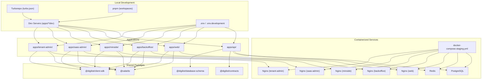
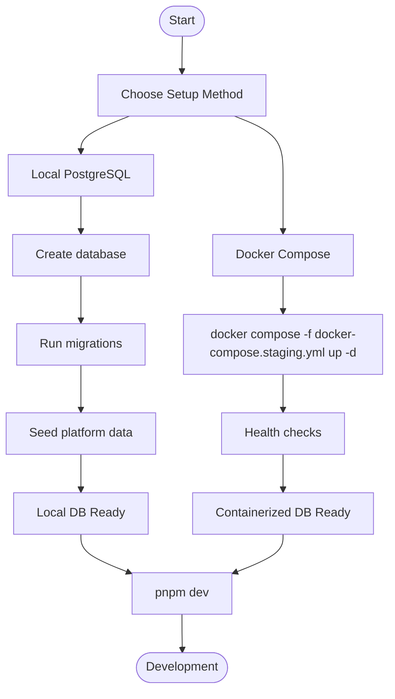
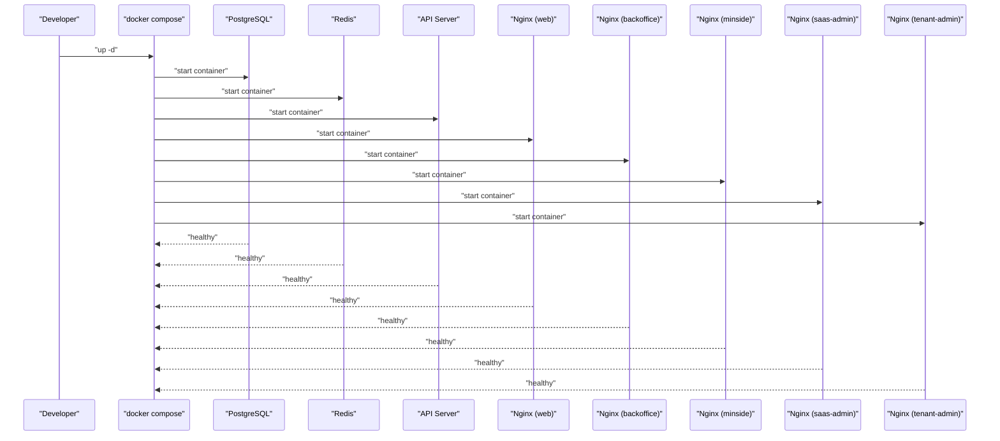
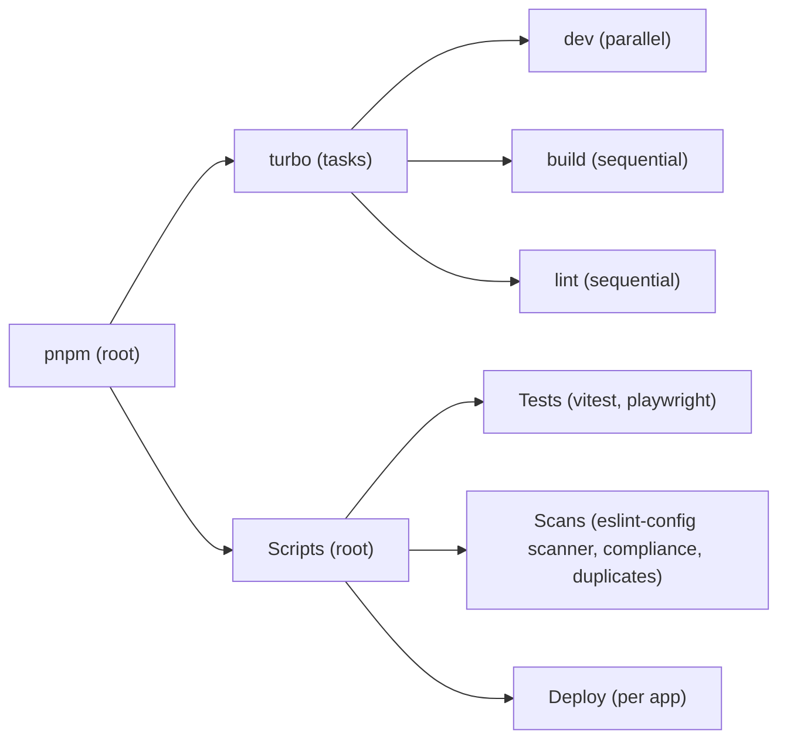
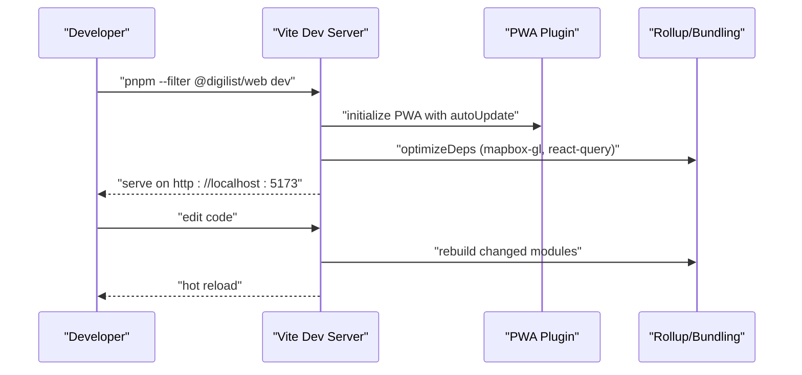
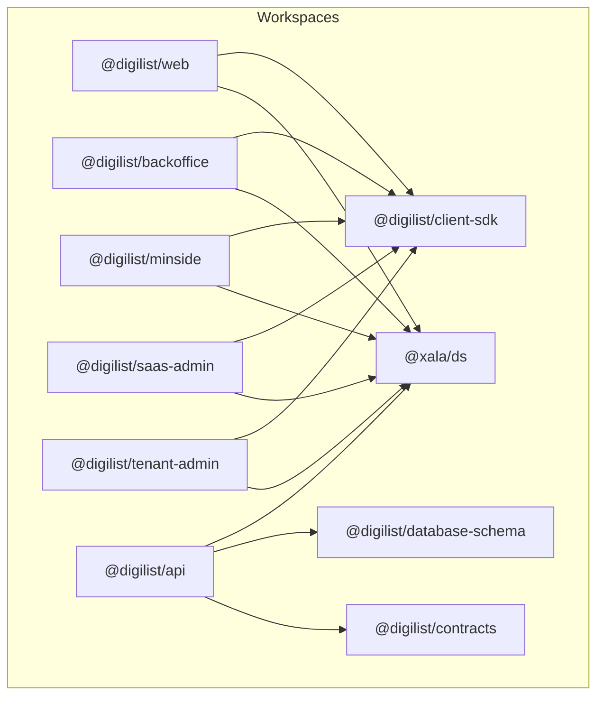

# Development Environment Setup

<cite>
**Referenced Files in This Document**
- [README.md](file://README.md)
- [package.json](file://package.json)
- [pnpm-workspace.yaml](file://pnpm-workspace.yaml)
- [.env.example](file://.env.example)
- [.env.development.example](file://.env.development.example)
- [docker-compose.staging.yml](file://docker-compose.staging.yml)
- [apps/api/Dockerfile](file://apps/api/Dockerfile)
- [apps/api/src/main.ts](file://apps/api/src/main.ts)
- [apps/api/.env.example](file://apps/api/.env.example)
- [apps/api/setup-db.sh](file://apps/api/setup-db.sh)
- [scripts/setup-fresh-db.sh](file://scripts/setup-fresh-db.sh)
- [turbo.json](file://turbo.json)
- [apps/web/vite.config.ts](file://apps/web/vite.config.ts)
- [docs/02-quick-start.md](file://docs/02-quick-start.md)
- [docs/03-development-workflow.md](file://docs/03-development-workflow.md)
</cite>

## Table of Contents
1. [Introduction](#introduction)
2. [Project Structure](#project-structure)
3. [Core Components](#core-components)
4. [Architecture Overview](#architecture-overview)
5. [Detailed Component Analysis](#detailed-component-analysis)
6. [Dependency Analysis](#dependency-analysis)
7. [Performance Considerations](#performance-considerations)
8. [Troubleshooting Guide](#troubleshooting-guide)
9. [Conclusion](#conclusion)
10. [Appendices](#appendices)

## Introduction
This document provides a comprehensive guide to setting up the development environment for the Xala Digdir platform. It covers prerequisites, environment configuration, database setup, Docker-based development workflow, monorepo management with pnpm workspaces and Turborepo, development server configuration, hot reloading, debugging, troubleshooting, and team collaboration practices.

## Project Structure
The repository follows a monorepo layout with pnpm workspaces and Turborepo. Applications (apps) and shared packages (packages) are organized under dedicated directories. The root provides unified scripts and configuration for building, linting, testing, and development across all packages.

```mermaid
graph TB
Root["Root (monorepo)"]
Apps["apps/"]
Packages["packages/"]
Docs["docs/"]
Scripts["scripts/"]
Root --> Apps
Root --> Packages
Root --> Docs
Root --> Scripts
subgraph "Apps"
Web["apps/web/"]
Api["apps/api/"]
Backoffice["apps/backoffice/"]
Minside["apps/minside/"]
SaasAdmin["apps/saas-admin/"]
TenantAdmin["apps/tenant-admin/"]
DocsLearning["apps/docs-learning/"]
end
subgraph "Packages"
DS["packages/ds/"]
DSThemes["packages/ds-themes/"]
DSRegistry["packages/ds-registry/"]
ESLintConfig["packages/eslint-config/"]
ClientSDK["packages/client-sdk/"]
Contracts["packages/contracts/"]
DatabaseSchema["packages/database-schema/"]
DocsContent["packages/docs-content/"]
I18n["packages/i18n/"]
Platform["packages/platform/"]
SDKCore["packages/sdk-core/"]
end
Apps --- Web
Apps --- Api
Apps --- Backoffice
Apps --- Minside
Apps --- SaasAdmin
Apps --- TenantAdmin
Apps --- DocsLearning
Packages --- DS
Packages --- DSThemes
Packages --- DSRegistry
Packages --- ESLintConfig
Packages --- ClientSDK
Packages --- Contracts
Packages --- DatabaseSchema
Packages --- DocsContent
Packages --- I18n
Packages --- Platform
Packages --- SDKCore
```

**Diagram sources**
- [pnpm-workspace.yaml](file://pnpm-workspace.yaml#L1-L6)
- [README.md](file://README.md#L89-L101)

**Section sources**
- [pnpm-workspace.yaml](file://pnpm-workspace.yaml#L1-L6)
- [README.md](file://README.md#L89-L101)

## Core Components
- Monorepo management: pnpm workspaces + Turborepo
- Applications:
  - Web app (Vite + React + TypeScript)
  - API server (Fastify)
  - Backoffice, Min Side, SaaS Admin, Tenant Admin, Docs Learning apps
- Shared packages:
  - UI facade and design system integration
  - Client SDK
  - Contracts and database schema
  - i18n and linting configuration

Key development URLs and ports:
- Web app: http://localhost:5173
- API health: http://localhost:3002/health

**Section sources**
- [README.md](file://README.md#L45-L48)
- [package.json](file://package.json#L5-L53)

## Architecture Overview
The development environment supports:
- Local development with Turborepo-driven parallel dev servers
- Containerized services for databases and static assets
- Workspace-based package linking and dependency resolution
- Environment-specific configuration via .env files

**Diagram sources**
- [turbo.json](file://turbo.json#L1-L19)
- [pnpm-workspace.yaml](file://pnpm-workspace.yaml#L1-L6)
- [docker-compose.staging.yml](file://docker-compose.staging.yml#L1-L140)
- [apps/api/src/main.ts](file://apps/api/src/main.ts#L122-L146)
- [apps/web/vite.config.ts](file://apps/web/vite.config.ts#L1-L145)

## Detailed Component Analysis

### Prerequisites and Installation
- Node.js 18+ (preferably 20.x)
- pnpm 9.15.0+
- Git
- PostgreSQL 14+ (local or containerized)
- Docker (optional, for containerized services)

Install dependencies and start development:
- Install: pnpm install
- Dev: pnpm dev
- Build: pnpm build
- Lint: pnpm lint

**Section sources**
- [docs/02-quick-start.md](file://docs/02-quick-start.md#L5-L12)
- [README.md](file://README.md#L29-L43)

### Environment Variable Configuration
- Root environment template: copy .env.example to .env and configure:
  - Database connection (DATABASE_URL)
  - Redis connection (REDIS_URL)
  - API server settings (API_PORT, API_HOST, API_BASE_URL)
  - Security secrets (JWT_SECRET, CSRF_SECRET, SESSION_SECRET)
  - CORS origins (CORS_ORIGIN)
  - Frontend variables (VITE_API_URL, VITE_WS_URL, VITE_TENANT_ID)
  - ID-porten/BankID integration (IDPORTEN_* variables)
  - Vipps integration (VIPPS_* variables)
  - Email/SMS providers (EMAIL_*, SMS_*)
  - Storage provider (STORAGE_PROVIDER, AWS_* variables)
  - Monitoring/analytics (SENTRY_*, GOOGLE_ANALYTICS_ID)
  - Rate limiting (RATE_LIMIT_WINDOW_MS, RATE_LIMIT_MAX_REQUESTS)
  - Logging (LOG_LEVEL, LOG_FORMAT)
  - Feature flags (FEATURE_VIPPS_LOGIN, FEATURE_VIPPS_PAYMENTS, FEATURE_IDPORTEN_LOGIN)

- Development-only template: .env.development.example enables dev mode and sets VITE_ENABLE_DEV_MODE, VITE_API_URL, VITE_WS_URL, VITE_TENANT_ID, and feature flags.

- API-specific environment: apps/api/.env.example includes server settings, database URL, JWT secret, CORS, ID-porten configuration, cookies, email, feature flags, and logging.

**Section sources**
- [.env.example](file://.env.example#L1-L171)
- [.env.development.example](file://.env.development.example#L1-L22)
- [apps/api/.env.example](file://apps/api/.env.example#L1-L38)

### Database Setup
Two primary approaches are supported:

1) Local PostgreSQL with manual setup:
- Ensure PostgreSQL is running
- Create database (e.g., xala_diglist)
- Run migrations (when available)
- Seed platform data using scripts

2) Containerized services with Docker Compose:
- Use docker-compose.staging.yml to spin up PostgreSQL, Redis, and Nginx-based static frontends
- Services include: postgres, redis, api, web, backoffice, minside, saas-admin, tenant-admin
- Health checks are configured for each service

**Diagram sources**
- [docker-compose.staging.yml](file://docker-compose.staging.yml#L1-L140)
- [apps/api/setup-db.sh](file://apps/api/setup-db.sh#L1-L74)
- [scripts/setup-fresh-db.sh](file://scripts/setup-fresh-db.sh#L1-L197)

**Section sources**
- [docs/02-quick-start.md](file://docs/02-quick-start.md#L41-L49)
- [docker-compose.staging.yml](file://docker-compose.staging.yml#L1-L140)
- [apps/api/setup-db.sh](file://apps/api/setup-db.sh#L1-L74)
- [scripts/setup-fresh-db.sh](file://scripts/setup-fresh-db.sh#L1-L197)

### Docker-based Development Workflow
- Build and run containers:
  - Build API image: docker build -f apps/api/Dockerfile .
  - Or use docker compose: docker compose -f docker-compose.staging.yml up -d
- Services orchestrated:
  - PostgreSQL with health checks
  - Redis with health checks
  - API service with health checks
  - Static Nginx-based frontends for web, backoffice, minside, saas-admin, tenant-admin
- Network isolation:
  - All services share a named network (digilist-network)

**Diagram sources**
- [docker-compose.staging.yml](file://docker-compose.staging.yml#L1-L140)

**Section sources**
- [docker-compose.staging.yml](file://docker-compose.staging.yml#L1-L140)
- [apps/api/Dockerfile](file://apps/api/Dockerfile#L1-L56)

### Monorepo Development with pnpm Workspaces and Turborepo
- Workspaces:
  - Declared in pnpm-workspace.yaml to include apps/* and packages/*
- Turborepo tasks:
  - dev: persistent, non-cached tasks per app
  - build: depends on ^build with dist/** outputs
  - lint: depends on ^lint with inputs and no outputs caching
- Root scripts:
  - Unified commands for dev, build, lint, format, test, and scanning
  - E2E and unit test orchestration
  - Deployment helpers per app

**Diagram sources**
- [turbo.json](file://turbo.json#L1-L19)
- [package.json](file://package.json#L5-L53)
- [pnpm-workspace.yaml](file://pnpm-workspace.yaml#L1-L6)

**Section sources**
- [pnpm-workspace.yaml](file://pnpm-workspace.yaml#L1-L6)
- [turbo.json](file://turbo.json#L1-L19)
- [package.json](file://package.json#L5-L53)

### Development Server Configuration and Hot Reloading
- API server (Fastify):
  - Entry point initializes adapters, connects to PostgreSQL, registers JWT service, DI container, modules, routes, WebSocket, and GraphQL
  - Exposes health, REST endpoints, GraphQL, and WebSocket
  - Graceful shutdown handling

- Web app (Vite + React + PWA):
  - Vite configuration includes React plugin, PWA plugin with auto-update and caching strategies
  - Build optimization with manualChunks for vendor separation (Mapbox GL, React Query, Client SDK, Design System)
  - Resolve aliases for client SDK
  - Optimize dependencies with Node.js polyfills for Mapbox GL

**Diagram sources**
- [apps/web/vite.config.ts](file://apps/web/vite.config.ts#L1-L145)

**Section sources**
- [apps/api/src/main.ts](file://apps/api/src/main.ts#L112-L360)
- [apps/web/vite.config.ts](file://apps/web/vite.config.ts#L1-L145)

### Debugging Approaches
- API debugging:
  - Use health endpoint and GraphQL playground
  - Inspect logs in terminal
  - Use browser dev tools for network and console
- Frontend debugging:
  - React DevTools
  - TanStack DevTools for query debugging
  - Browser console and network tab
- Database:
  - Use psql to inspect tables and verify seeds
  - Confirm migrations applied

**Section sources**
- [docs/02-quick-start.md](file://docs/02-quick-start.md#L149-L184)
- [apps/api/src/main.ts](file://apps/api/src/main.ts#L342-L360)

### Team Collaboration and Git Workflow
- Branch strategy:
  - main (production-ready)
  - develop (integration)
  - feature/*, fix/*, docs/*
- Commit messages:
  - feat(scope): description
  - fix(scope): description
  - docs(scope): description
  - refactor(scope): description
- Development checklist:
  - Understand requirements and acceptance criteria
  - Check for existing implementations
  - Review contract-first principles
  - Plan component structure
  - Use only @xala/ds components
  - Follow no-transformers rule
  - Write tests alongside code
  - Add proper TypeScript types
  - Include accessibility attributes
  - Run lint, scan, tests, and compliance checks
- Code review process:
  - Create PR with clear description
  - Ensure all checks pass
  - Request review from team members
  - Address feedback promptly
  - Maintain clean commit history

**Section sources**
- [docs/03-development-workflow.md](file://docs/03-development-workflow.md#L264-L319)

## Dependency Analysis
- Workspace dependencies:
  - apps depend on shared packages (e.g., @xala/ds, @digilist/client-sdk)
  - Root scripts coordinate builds and tests across workspaces
- External dependencies:
  - Node.js runtime and pnpm package manager
  - PostgreSQL and Redis for persistence and sessions
  - Nginx for serving static assets
- Internal dependencies:
  - API depends on database schema and contracts
  - Frontends depend on client SDK and design system

**Diagram sources**
- [pnpm-workspace.yaml](file://pnpm-workspace.yaml#L1-L6)
- [apps/web/vite.config.ts](file://apps/web/vite.config.ts#L122-L127)

**Section sources**
- [pnpm-workspace.yaml](file://pnpm-workspace.yaml#L1-L6)
- [apps/web/vite.config.ts](file://apps/web/vite.config.ts#L122-L127)

## Performance Considerations
- Frontend bundle optimization:
  - Separate vendor chunks for Mapbox GL, React Query, Client SDK, and Design System
  - Increased chunk size warning threshold
  - Node.js polyfills for Mapbox GL in optimizeDeps
- Caching strategies:
  - PWA runtime caching for fonts and API responses
  - Cache-first strategies for Google Fonts
  - Network-first for API cache with timeouts
- Backend considerations:
  - PostgreSQL connection pooling
  - Redis for sessions and queues
  - Health checks for service readiness

**Section sources**
- [apps/web/vite.config.ts](file://apps/web/vite.config.ts#L86-L144)

## Troubleshooting Guide
Common setup issues and resolutions:
- Port conflicts:
  - Identify process using port and terminate if safe
- Database connection issues:
  - Ensure PostgreSQL is running
  - Verify DATABASE_URL in .env
  - Confirm database exists
- Permission errors:
  - Fix file permissions recursively
- API startup errors:
  - Check DATABASE_URL and JWT_SECRET environment variables
  - Confirm migrations applied
- Frontend build errors:
  - Verify SDK aliases and optimizeDeps configuration
  - Ensure Node.js polyfills for Mapbox GL

**Section sources**
- [docs/02-quick-start.md](file://docs/02-quick-start.md#L149-L171)
- [apps/api/src/main.ts](file://apps/api/src/main.ts#L122-L146)
- [apps/web/vite.config.ts](file://apps/web/vite.config.ts#L128-L143)

## Conclusion
The Xala Digdir platform provides a robust, scalable monorepo development environment powered by pnpm workspaces and Turborepo. With clear environment configuration, flexible database setup options (local or containerized), and comprehensive development tooling, teams can efficiently collaborate and iterate. Following the documented workflows ensures consistent development practices, reliable builds, and smooth debugging experiences.

## Appendices

### Appendix A: Environment Variables Reference
- Root .env:
  - Database: DATABASE_URL, REDIS_URL
  - API: API_PORT, API_HOST, API_BASE_URL
  - Security: JWT_SECRET, JWT_REFRESH_SECRET, CSRF_SECRET, SESSION_SECRET, JWT_EXPIRES_IN, JWT_REFRESH_EXPIRES_IN
  - CORS: CORS_ORIGIN
  - Frontend: VITE_API_URL, VITE_WS_URL, VITE_TENANT_ID, VITE_LICENSE_KEY
  - Maps: VITE_MAPBOX_TOKEN, VITE_GEOCODING_API_KEY, VITE_GOOGLE_PLACES_API_KEY
  - ID-porten/BankID: IDPORTEN_CLIENT_ID, IDPORTEN_CLIENT_SECRET, IDPORTEN_BASE_URL, IDPORTEN_CALLBACK_URL, IDPORTEN_REDIRECT_URI, IDPORTEN_ISSUER, IDPORTEN_ACR_VALUES
  - Vipps: VIPPS_CLIENT_ID, VIPPS_CLIENT_SECRET, VIPPS_SUBSCRIPTION_KEY, VIPPS_MSN, VIPPS_MERCHANT_SERIAL_NUMBER, VIPPS_ENVIRONMENT, VIPPS_AUTH_CALLBACK_URL, VIPPS_PAYMENT_CALLBACK_URL, VIPPS_WEBHOOK_SECRET
  - OAuth providers: GOOGLE_*, FACEBOOK_*, GITHUB_*
  - Email/SMS: EMAIL_PROVIDER, SENDGRID_API_KEY, EMAIL_FROM, EMAIL_FROM_NAME, SMS_PROVIDER, TWILIO_ACCOUNT_SID, TWILIO_AUTH_TOKEN, TWILIO_PHONE_NUMBER
  - Storage: STORAGE_PROVIDER, AWS_ACCESS_KEY_ID, AWS_SECRET_ACCESS_KEY, AWS_REGION, AWS_S3_BUCKET
  - Monitoring: SENTRY_DSN, SENTRY_ENVIRONMENT, GOOGLE_ANALYTICS_ID
  - Rate limiting: RATE_LIMIT_WINDOW_MS, RATE_LIMIT_MAX_REQUESTS
  - Logging: LOG_LEVEL, LOG_FORMAT
  - Feature flags: FEATURE_VIPPS_LOGIN, FEATURE_VIPPS_PAYMENTS, FEATURE_IDPORTEN_LOGIN

- Development .env:
  - VITE_ENABLE_DEV_MODE=true
  - VITE_API_URL, VITE_WS_URL, VITE_TENANT_ID
  - VITE_ENABLE_OAUTH=true, VITE_ENABLE_DEMO_LOGIN=true

- API .env:
  - NODE_ENV, PORT, HOST
  - DATABASE_URL
  - JWT_SECRET, JWT_EXPIRES_IN
  - CORS_ORIGIN
  - IDPORTEN_* settings
  - COOKIE_* settings
  - SENDGRID_* settings
  - FEATURE flags
  - LOG_LEVEL

**Section sources**
- [.env.example](file://.env.example#L1-L171)
- [.env.development.example](file://.env.development.example#L1-L22)
- [apps/api/.env.example](file://apps/api/.env.example#L1-L38)

### Appendix B: Development Commands
- Install dependencies: pnpm install
- Start all dev servers: pnpm dev
- Build all packages: pnpm build
- Lint all code: pnpm lint
- Run unit tests: pnpm test
- Run E2E tests: pnpm test:e2e
- Run all tests: pnpm test:all
- Scanning tools: pnpm scan, pnpm scan:compliance, pnpm scan:duplicates, pnpm scan:all
- i18n tools: pnpm i18n:check, pnpm i18n:unused, pnpm i18n:scan, pnpm i18n:migrate
- Tokens generation: pnpm tokens:create, pnpm tokens:build

**Section sources**
- [package.json](file://package.json#L5-L53)