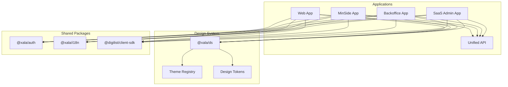
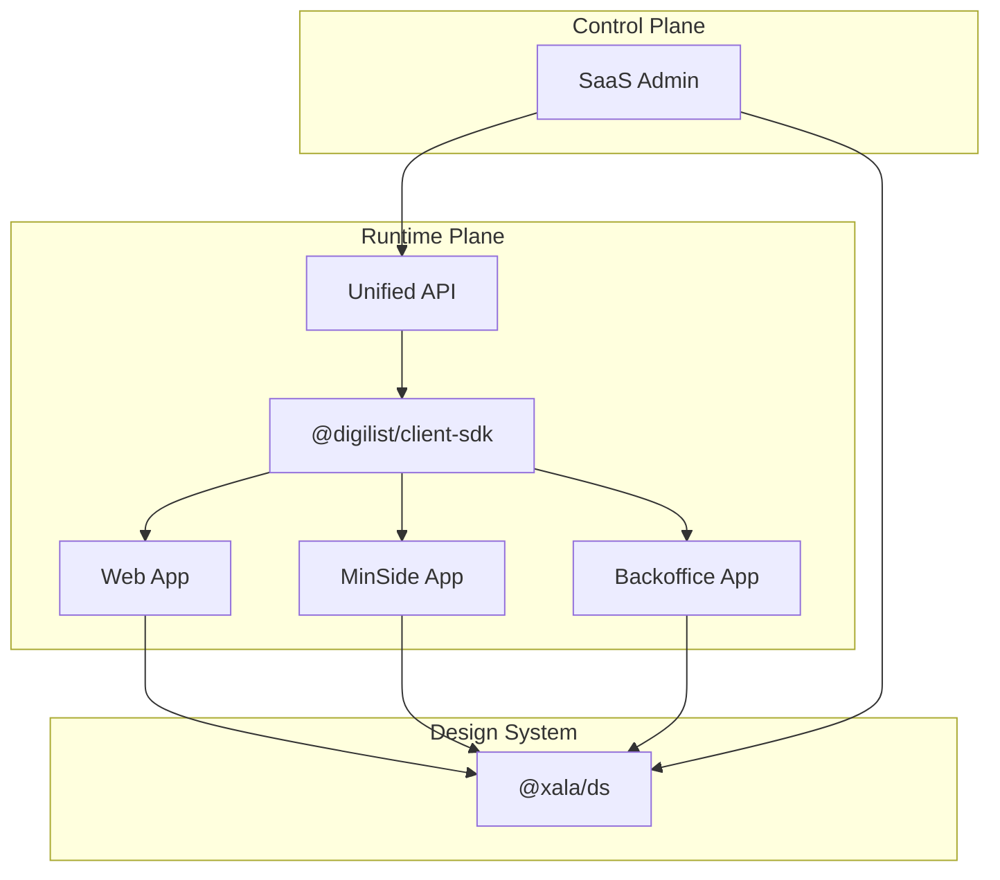
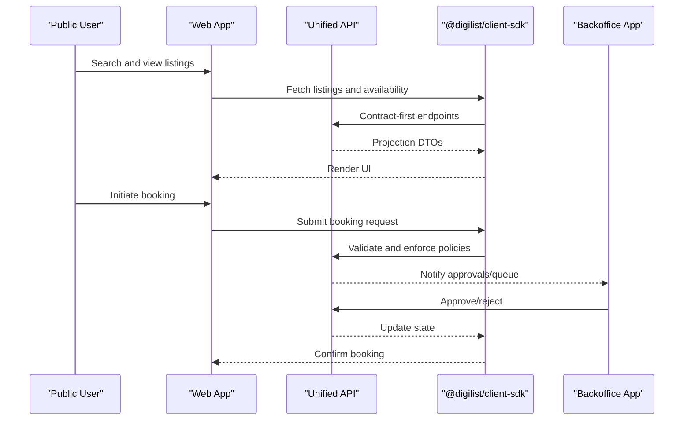
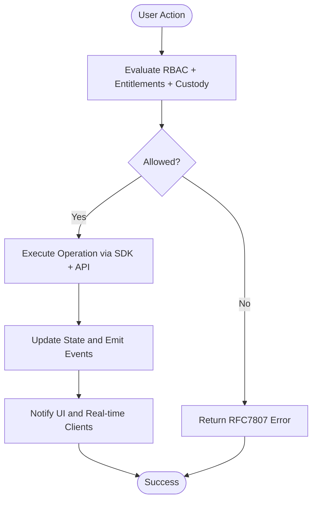
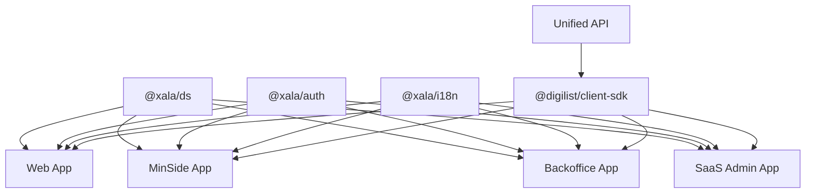

# Introduction and Purpose

<cite>
**Referenced Files in This Document**
- [README.md](file://README.md)
- [01-introduction.md](file://docs/01-introduction.md)
- [prd.md](file://docs/digilist-platform/prd.md)
- [srsd.md](file://docs/digilist-platform/srsd.md)
- [04-design-system.md](file://docs/architecture/04-design-system.md)
- [roadmap-highlevel.md](file://docs/roadmap/roadmap-highlevel.md)
- [ssa-l-compliance.md](file://docs/reference/ssa-l-compliance.md)
- [GDPR-EVIDENCE.md](file://docs/quality/GDPR-EVIDENCE.md)
- [App.tsx (web)](file://apps/web/src/App.tsx)
- [App.tsx (backoffice)](file://apps/backoffice/src/App.tsx)
- [App.tsx (minside)](file://apps/minside/src/App.tsx)
- [App.tsx (saas-admin)](file://apps/saas-admin/src/App.tsx)
- [App.tsx (api)](file://apps/api/README.md)
</cite>

## Table of Contents
1. [Introduction](#introduction)
2. [Project Structure](#project-structure)
3. [Core Components](#core-components)
4. [Architecture Overview](#architecture-overview)
5. [Detailed Component Analysis](#detailed-component-analysis)
6. [Dependency Analysis](#dependency-analysis)
7. [Performance Considerations](#performance-considerations)
8. [Troubleshooting Guide](#troubleshooting-guide)
9. [Conclusion](#conclusion)

## Introduction
Xala Digdir is a multi-tenant SaaS platform designed specifically for the Norwegian public sector to streamline the management, publication, and booking of rental and facility resources. Its mission is to modernize public housing and municipal services by offering a unified, secure, and accessible platform that aligns with national digitalization goals and standards.

Key aspects of the platform’s purpose:
- Multi-tenant SaaS for Norwegian municipalities and partner organizations
- Unified listing and booking workflows across public and private contexts
- Strong governance, compliance, and operational control
- Alignment with Norwegian government digitalization priorities and national standards

Target audiences:
- Property managers and administrators within municipalities and partner organizations
- Tenants and end users seeking transparent, accessible booking experiences
- Public administrators responsible for oversight, compliance, and tenant services

Core value propositions:
- Streamlined property management with centralized administration and tenant control
- Enhanced tenant experience through intuitive discovery, calendar-based booking, and responsive design
- Efficient administrative workflows powered by role-based access control (RBAC), entitlements, and auditability

Strategic importance of Norwegian Designsystemet integration:
- Ensures consistent, accessible, and theme-compliant user interfaces across all applications
- Enforces strict design system guardrails to maintain brand coherence and accessibility standards
- Enables runtime theme switching and localization for a culturally aligned experience

Compliance and standards:
- Built-in adherence to WCAG 2.1 AA, GDPR, and SSA-L requirements
- ID-porten integration for national authentication
- Contract-first, SDK-first development to ensure consistency and traceability

Evolution from pilot to enterprise-scale:
- The platform evolved through prioritized phases, starting with absolute core functionality and progressing to advanced modules, integrations, and governance features
- Demonstrates continuous delivery of value while maintaining strict architectural and compliance discipline

## Project Structure
The repository is organized as a Turborepo monorepo with four primary applications and supporting packages:
- apps/web: Public-facing discovery and booking application
- apps/minside: End-user dashboard for personal and organizational contexts
- apps/backoffice: Administrative operations for property managers and case handlers
- apps/saas-admin: Control plane for tenants, plans, subscriptions, and governance
- apps/api: Unified enterprise API with modular domain modules
- packages/ds and related packages: Norwegian Designsystemet facade, themes, and shared tooling

**Diagram sources**
- [README.md](file://README.md#L1-L113)
- [04-design-system.md](file://docs/architecture/04-design-system.md#L1-L743)
- [App.tsx (web)](file://apps/web/src/App.tsx#L1-L275)
- [App.tsx (backoffice)](file://apps/backoffice/src/App.tsx#L1-L445)
- [App.tsx (minside)](file://apps/minside/src/App.tsx#L1-L184)
- [App.tsx (saas-admin)](file://apps/saas-admin/src/App.tsx#L1-L93)

**Section sources**
- [README.md](file://README.md#L1-L113)
- [04-design-system.md](file://docs/architecture/04-design-system.md#L1-L743)

## Core Components
- Multi-tenant architecture enabling isolated data and configurations per municipality while allowing centralized management
- Unified API with modular domain modules (tenant, listing, booking) and contract-first DTOs
- Client SDK providing typed services, hooks, and query keys for consistent integration across applications
- Norwegian Designsystemet facade enforcing design tokens, runtime theme switching, and accessibility compliance
- RBAC + entitlements hybrid for fine-grained access control and feature gating
- Compliance baseline covering GDPR, WCAG 2.1 AA, and SSA-L requirements

**Section sources**
- [01-introduction.md](file://docs/01-introduction.md#L1-L127)
- [srsd.md](file://docs/digilist-platform/srsd.md#L1-L574)
- [04-design-system.md](file://docs/architecture/04-design-system.md#L1-L743)

## Architecture Overview
The platform follows a contract-first, SDK-first approach with clear separation between control plane (SaaS Admin) and runtime plane (API + client applications). Policy-driven enforcement ensures that UI visibility mirrors server-side authorization, and all changes propagate deterministically through the stack.

**Diagram sources**
- [srsd.md](file://docs/digilist-platform/srsd.md#L9-L52)
- [prd.md](file://docs/digilist-platform/prd.md#L1-L391)
- [04-design-system.md](file://docs/architecture/04-design-system.md#L1-L743)

**Section sources**
- [srsd.md](file://docs/digilist-platform/srsd.md#L9-L52)
- [prd.md](file://docs/digilist-platform/prd.md#L1-L391)

## Detailed Component Analysis

### Multi-Tenant SaaS for Norwegian Public Sector
- Mission: Enable municipalities and partner organizations to publish, manage, delegate, and book resources with strong governance and compliance
- Scope: Listing management, booking engine, user and organization management, audit and compliance, notifications, and integrations
- Compliance: WCAG 2.1 AA, GDPR, SSA-L, and ID-porten integration

**Section sources**
- [prd.md](file://docs/digilist-platform/prd.md#L9-L56)
- [01-introduction.md](file://docs/01-introduction.md#L3-L41)

### Strategic Importance of Norwegian Designsystemet Integration
- Facade pattern ensures all UI components come through @xala/ds, preventing direct imports from Designsystemet
- Runtime theme switching and design tokens guarantee consistent branding and accessibility
- Guardrails enforced via ESLint and shared tooling

**Section sources**
- [04-design-system.md](file://docs/architecture/04-design-system.md#L13-L46)
- [README.md](file://README.md#L17-L88)

### Compliance and National Standards
- WCAG 2.1 AA baseline for critical routes and flows
- GDPR by design with consent, retention, and data subject request capabilities
- SSA-L compliance mapping and verification
- ID-porten integration for national authentication

**Section sources**
- [01-introduction.md](file://docs/01-introduction.md#L107-L119)
- [ssa-l-compliance.md](file://docs/reference/ssa-l-compliance.md#L26-L229)
- [GDPR-EVIDENCE.md](file://docs/quality/GDPR-EVIDENCE.md#L1-L188)

### Evolution from Pilot Projects to Enterprise Deployment
- Level 0: Absolute core (identity, session, rental objects, availability/booking, notifications)
- Level 1: Core domain modules (calendar/blocking, pricing, backoffice essentials)
- Level 2: Enterprise SaaS modules (feature flags, billing, audit/monitoring)
- Level 3: UX modules (messaging, favorites, activities, reviews)
- Level 4: Integrations (authentication providers, payments, notifications)

**Section sources**
- [roadmap-highlevel.md](file://docs/roadmap/roadmap-highlevel.md#L1-L800)

### Applications and User Journeys
- Web: Public discovery, listing details, dynamic calendar, and booking flows
- MinSide: Personal and organizational dashboards, bookings, and self-service
- Backoffice: Administrative operations, approvals, reporting, and audit
- SaaS Admin: Tenant management, plans, subscriptions, entitlements, and governance

**Diagram sources**
- [srsd.md](file://docs/digilist-platform/srsd.md#L40-L49)
- [App.tsx (web)](file://apps/web/src/App.tsx#L1-L275)
- [App.tsx (backoffice)](file://apps/backoffice/src/App.tsx#L1-L445)

**Section sources**
- [prd.md](file://docs/digilist-platform/prd.md#L181-L210)
- [srsd.md](file://docs/digilist-platform/srsd.md#L21-L38)

### Conceptual Overview
- RBAC + ABAC hybrid for resource-scoped permissions and feature entitlements
- Deterministic governance with feature flags controlling modules end-to-end
- SDK-first integration minimizing UI logic and maximizing consistency

[No sources needed since this diagram shows conceptual workflow, not actual code structure]

[No sources needed since this section doesn't analyze specific files]

## Dependency Analysis
The platform’s dependencies emphasize consistency, security, and compliance:
- Design system guardrails enforced via shared ESLint configuration and package exports
- SDK-first integration ensuring all UI interactions flow through typed services and hooks
- Strict separation between control plane and runtime plane with deterministic policy evaluation

**Diagram sources**
- [04-design-system.md](file://docs/architecture/04-design-system.md#L1-L743)
- [App.tsx (web)](file://apps/web/src/App.tsx#L1-L275)
- [App.tsx (backoffice)](file://apps/backoffice/src/App.tsx#L1-L445)
- [App.tsx (minside)](file://apps/minside/src/App.tsx#L1-L184)
- [App.tsx (saas-admin)](file://apps/saas-admin/src/App.tsx#L1-L93)

**Section sources**
- [04-design-system.md](file://docs/architecture/04-design-system.md#L1-L743)
- [README.md](file://README.md#L13-L28)

## Performance Considerations
- Optimized for Core Web Vitals with progressive enhancement and offline capabilities
- Lazy loading and code splitting across applications
- Real-time updates via WebSocket and structured logging for observability

[No sources needed since this section provides general guidance]

## Troubleshooting Guide
Common areas to verify:
- Authentication and session continuity across applications
- Theme switching and design token consistency
- Feature flag evaluation and entitlement enforcement
- Audit logging completeness and immutability
- GDPR data handling and consent management

**Section sources**
- [ssa-l-compliance.md](file://docs/reference/ssa-l-compliance.md#L26-L229)
- [GDPR-EVIDENCE.md](file://docs/quality/GDPR-EVIDENCE.md#L1-L188)
- [roadmap-highlevel.md](file://docs/roadmap/roadmap-highlevel.md#L1-L800)

## Conclusion
Xala Digdir positions itself as a comprehensive, standards-aligned SaaS platform tailored to the Norwegian public sector’s needs. By combining a robust multi-tenant architecture, strict compliance frameworks, and a unified design system, it delivers streamlined property management, enhanced tenant experiences, and efficient administrative workflows—directly supporting the digital transformation of public housing services and aligning with national digitalization goals.