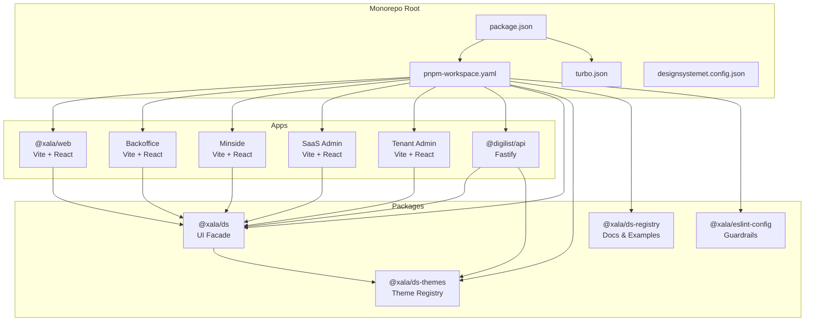
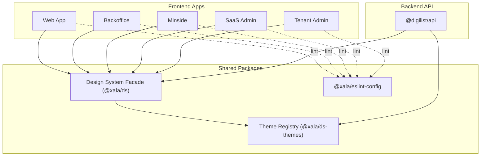
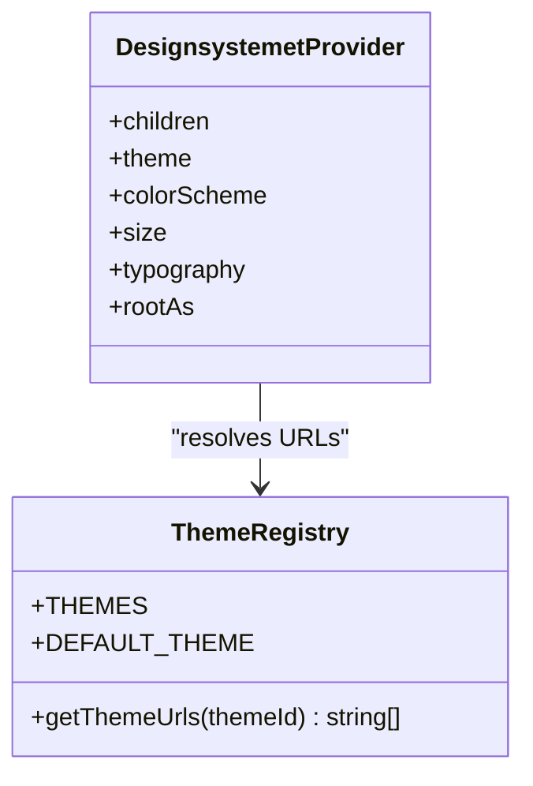
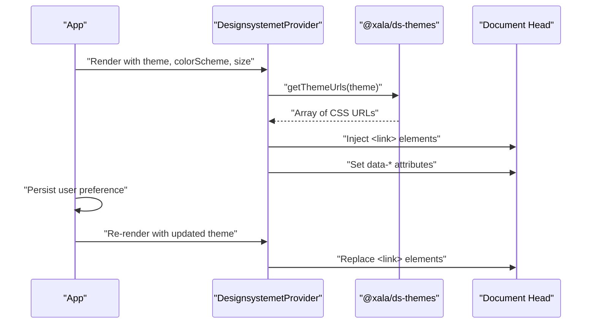
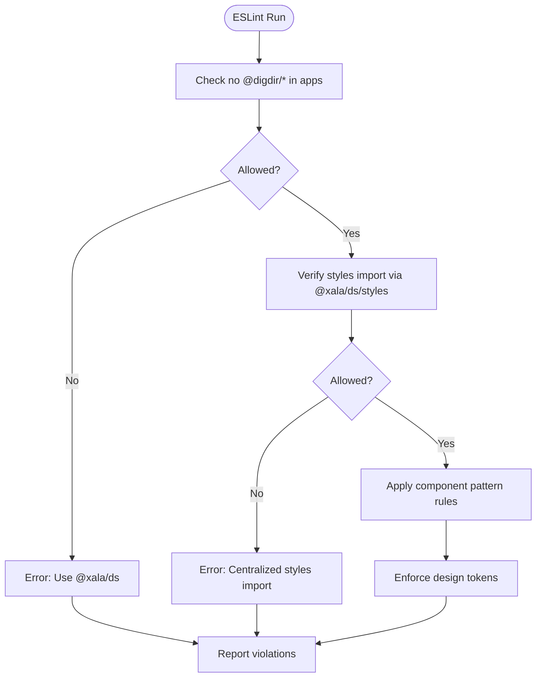
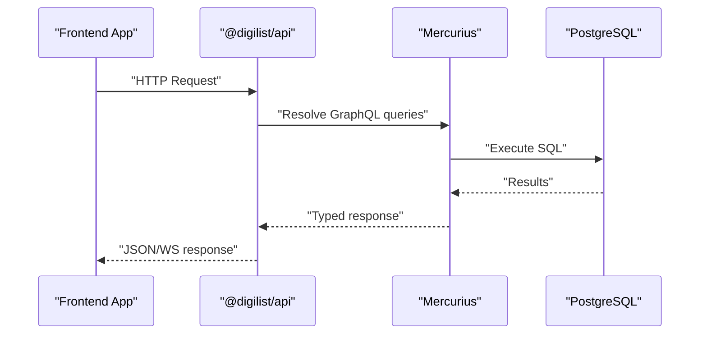
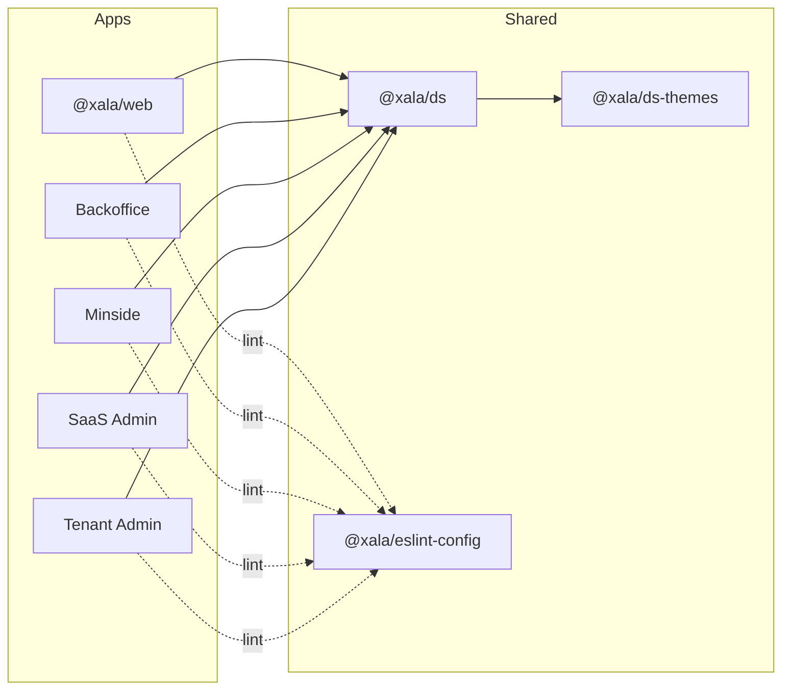

# Project Overview

<cite>
**Referenced Files in This Document**
- [README.md](file://README.md)
- [package.json](file://package.json)
- [turbo.json](file://turbo.json)
- [pnpm-workspace.yaml](file://pnpm-workspace.yaml)
- [designsystemet.config.json](file://designsystemet.config.json)
- [packages/ds/package.json](file://packages/ds/package.json)
- [packages/ds-themes/package.json](file://packages/ds-themes/package.json)
- [packages/ds-themes/src/index.ts](file://packages/ds-themes/src/index.ts)
- [packages/ds/src/provider.tsx](file://packages/ds/src/provider.tsx)
- [packages/eslint-config/index.js](file://packages/eslint-config/index.js)
- [apps/web/package.json](file://apps/web/package.json)
- [apps/web/src/App.tsx](file://apps/web/src/App.tsx)
- [apps/api/package.json](file://apps/api/package.json)
- [apps/api/src/main.ts](file://apps/api/src/main.ts)
</cite>

## Table of Contents
1. [Introduction](#introduction)
2. [Project Structure](#project-structure)
3. [Core Components](#core-components)
4. [Architecture Overview](#architecture-overview)
5. [Detailed Component Analysis](#detailed-component-analysis)
6. [Dependency Analysis](#dependency-analysis)
7. [Performance Considerations](#performance-considerations)
8. [Troubleshooting Guide](#troubleshooting-guide)
9. [Conclusion](#conclusion)
10. [Appendices](#appendices)

## Introduction
Xala Digdir is a multi-tenant SaaS platform for rental property management built as a Turborepo monorepo using pnpm workspaces. The platform integrates Norwegian Designsystemet to deliver a consistent, accessible, and themeable UI across five frontend applications while enforcing strict design system guardrails. The backend is a unified Fastify API server with GraphQL and REST endpoints, supporting advanced features such as real-time updates, tenant isolation, and role-based access control.

Key goals:
- Enforce a single source of truth for design tokens and components via a dedicated design system facade.
- Enable runtime theme switching across tenants and applications.
- Provide a scalable, maintainable architecture for rapid feature delivery and multi-tenant customization.

## Project Structure
The repository is organized into:
- apps: Five Vite + React applications (web, backoffice, minside, saas-admin, tenant-admin) plus the Fastify API server.
- packages: Shared libraries including the design system facade (@xala/ds), theme registry (@xala/ds-themes), documentation registry (@xala/ds-registry), and ESLint guardrails (@xala/eslint-config).
- docs: Comprehensive architecture, guides, and operational documentation.
- Infrastructure and scripts: Deployment, testing, and quality assurance tooling.

**Diagram sources**
- [pnpm-workspace.yaml](file://pnpm-workspace.yaml#L1-L6)
- [package.json](file://package.json#L1-L115)
- [turbo.json](file://turbo.json#L1-L19)
- [apps/web/package.json](file://apps/web/package.json#L1-L39)
- [apps/api/package.json](file://apps/api/package.json#L1-L73)
- [packages/ds/package.json](file://packages/ds/package.json#L1-L42)
- [packages/ds-themes/package.json](file://packages/ds-themes/package.json#L1-L27)

**Section sources**
- [README.md](file://README.md#L1-L113)
- [pnpm-workspace.yaml](file://pnpm-workspace.yaml#L1-L6)
- [package.json](file://package.json#L1-L115)
- [turbo.json](file://turbo.json#L1-L19)

## Core Components
- Design System Facade (@xala/ds): Provides a single import surface for Norwegian Designsystemet components and CSS, enforced by ESLint guardrails. It exports the DesignsystemetProvider for runtime theming and a styles entry point.
- Theme Registry (@xala/ds-themes): Centralizes theme identifiers and resolves theme CSS URLs, enabling runtime switching across tenants and applications.
- ESLint Guardrails (@xala/eslint-config): Enforces critical rules to prevent direct imports of Designsystemet packages in apps, restricts theme CSS imports to the styles entry, and enforces component usage patterns.
- Frontend Applications: web, backoffice, minside, saas-admin, tenant-admin — all consuming @xala/ds and @xala/ds-themes for consistent UI and theming.
- Backend API (@digilist/api): A unified Fastify server exposing REST and GraphQL endpoints, with DI-based modules and real-time WebSocket routes.

Practical integration highlights:
- Single CSS import via @xala/ds/styles in main entry points.
- Runtime theme switching using DesignsystemetProvider with theme, colorScheme, and size props.
- Theme URLs resolved centrally by @xala/ds-themes and injected dynamically into the document head.

**Section sources**
- [README.md](file://README.md#L15-L88)
- [packages/ds/package.json](file://packages/ds/package.json#L1-L42)
- [packages/ds-themes/src/index.ts](file://packages/ds-themes/src/index.ts#L1-L56)
- [packages/eslint-config/index.js](file://packages/eslint-config/index.js#L64-L194)
- [apps/web/src/App.tsx](file://apps/web/src/App.tsx#L1-L275)
- [apps/api/src/main.ts](file://apps/api/src/main.ts#L1-L366)

## Architecture Overview
The system follows a Turborepo architecture with pnpm workspaces and Turborepo task orchestration. The frontend apps depend on @xala/ds for UI and theming, while @xala/ds-themes supplies theme URLs. The backend API is a contract-first, type-safe service with GraphQL and REST endpoints, supporting tenant isolation and real-time features.

**Diagram sources**
- [apps/web/src/App.tsx](file://apps/web/src/App.tsx#L1-L275)
- [apps/api/src/main.ts](file://apps/api/src/main.ts#L1-L366)
- [packages/ds/src/provider.tsx](file://packages/ds/src/provider.tsx#L1-L130)
- [packages/ds-themes/src/index.ts](file://packages/ds-themes/src/index.ts#L1-L56)
- [packages/eslint-config/index.js](file://packages/eslint-config/index.js#L64-L194)

## Detailed Component Analysis

### Design System Facade and Theme Provider
The design system facade encapsulates Norwegian Designsystemet usage behind a controlled interface. It exposes:
- A provider (DesignsystemetProvider) that injects theme CSS into the document head and sets data attributes for color scheme, size, and typography.
- A styles entry point for centralized CSS import.
- A theme registry that resolves theme URLs for runtime switching.

**Diagram sources**
- [packages/ds/src/provider.tsx](file://packages/ds/src/provider.tsx#L102-L129)
- [packages/ds-themes/src/index.ts](file://packages/ds-themes/src/index.ts#L38-L55)

Implementation highlights:
- Dynamic link injection ensures only one theme CSS load per app lifecycle.
- Data attributes propagate styling preferences to CSS selectors.
- Theme arrays support CLI-generated base themes plus app-specific extensions.

**Section sources**
- [packages/ds/src/provider.tsx](file://packages/ds/src/provider.tsx#L1-L130)
- [packages/ds-themes/src/index.ts](file://packages/ds-themes/src/index.ts#L1-L56)

### Runtime Theme Switching Flow
The frontend orchestrates theme switching through the provider and local preferences, updating both DOM attributes and CSS link elements.

**Diagram sources**
- [apps/web/src/App.tsx](file://apps/web/src/App.tsx#L167-L215)
- [packages/ds-themes/src/index.ts](file://packages/ds-themes/src/index.ts#L49-L52)
- [packages/ds/src/provider.tsx](file://packages/ds/src/provider.tsx#L73-L89)

**Section sources**
- [apps/web/src/App.tsx](file://apps/web/src/App.tsx#L167-L215)
- [packages/ds-themes/src/index.ts](file://packages/ds-themes/src/index.ts#L18-L55)
- [packages/ds/src/provider.tsx](file://packages/ds/src/provider.tsx#L102-L129)

### ESLint Guardrails and Design System Rules
The ESLint configuration enforces:
- Prohibition of direct imports from @digdir/* in apps.
- Centralized CSS imports via @xala/ds/styles.
- Component usage patterns (e.g., as-child rule, button type requirements).
- Token-based design constraints (colors, spacing, typography, border radius).

**Diagram sources**
- [packages/eslint-config/index.js](file://packages/eslint-config/index.js#L64-L194)

**Section sources**
- [packages/eslint-config/index.js](file://packages/eslint-config/index.js#L64-L194)

### Multi-Tenant SaaS Backend (Unified API)
The backend API is a modular, DI-driven Fastify server with:
- REST endpoints and GraphQL (/graphql) for unified access.
- Tenant isolation and RBAC modules.
- Real-time WebSocket routes for audit and notifications.
- Drizzle ORM for schema-first database operations.

**Diagram sources**
- [apps/api/src/main.ts](file://apps/api/src/main.ts#L322-L330)

**Section sources**
- [apps/api/src/main.ts](file://apps/api/src/main.ts#L1-L366)
- [apps/api/package.json](file://apps/api/package.json#L1-L73)

### Practical Examples and Configuration
- Theme configuration: The designsystemet.config.json defines theme tokens and output directory for CLI-generated themes. The CLI tasks generate base and extension CSS files under packages/ds-themes/generated and are published to the themes directory for runtime loading.
- Theme switching in apps: The web application demonstrates runtime theme switching with a theme preference persisted in localStorage and a system preference fallback.
- Design system integration: All apps import @xala/ds and use DesignsystemetProvider to ensure consistent theming and component usage.

**Section sources**
- [designsystemet.config.json](file://designsystemet.config.json#L1-L21)
- [apps/web/src/App.tsx](file://apps/web/src/App.tsx#L167-L215)
- [packages/ds-themes/src/index.ts](file://packages/ds-themes/src/index.ts#L18-L55)

## Dependency Analysis
The monorepo’s dependency model emphasizes shared packages and controlled imports:
- Frontend apps depend on @xala/ds and @xala/ds-themes.
- @xala/ds depends on @digdir/designsystemet-css and @digdir/designsystemet-react, plus workspace packages for auth, i18n, and themes.
- ESLint guardrails apply across apps to enforce design system usage.

**Diagram sources**
- [apps/web/package.json](file://apps/web/package.json#L1-L39)
- [packages/ds/package.json](file://packages/ds/package.json#L1-L42)
- [packages/ds-themes/package.json](file://packages/ds-themes/package.json#L1-L27)
- [packages/eslint-config/index.js](file://packages/eslint-config/index.js#L64-L194)

**Section sources**
- [apps/web/package.json](file://apps/web/package.json#L1-L39)
- [packages/ds/package.json](file://packages/ds/package.json#L1-L42)
- [packages/ds-themes/package.json](file://packages/ds-themes/package.json#L1-L27)
- [packages/eslint-config/index.js](file://packages/eslint-config/index.js#L64-L194)

## Performance Considerations
- Theme switching avoids full page reloads by dynamically injecting/removing CSS links, minimizing layout shifts and paint churn.
- Turborepo caching accelerates builds and reduces redundant work across apps and packages.
- The backend leverages GraphQL for efficient data fetching and real-time WebSocket routes for targeted updates.

## Troubleshooting Guide
Common issues and resolutions:
- Theme not applying: Verify that @xala/ds/styles is imported exactly once in the app entry and that DesignsystemetProvider wraps the application root.
- Theme conflicts: Ensure only one theme CSS is loaded at a time; the provider removes previous links before adding new ones.
- ESLint violations: Fix direct imports from @digdir/* and use @xala/ds components; adhere to as-child and interactive label rules.
- API startup failures: Confirm DATABASE_URL and JWT_SECRET environment variables are configured; check module registration and controller wiring.

**Section sources**
- [packages/eslint-config/index.js](file://packages/eslint-config/index.js#L64-L194)
- [apps/api/src/main.ts](file://apps/api/src/main.ts#L122-L146)
- [apps/web/src/App.tsx](file://apps/web/src/App.tsx#L216-L251)

## Conclusion
Xala Digdir delivers a robust, multi-tenant SaaS platform with a strong design system foundation. The Turborepo architecture, combined with @xala/ds and @xala/ds-themes, ensures consistent theming and component usage across applications. Strict ESLint guardrails and a unified Fastify API further enhance maintainability, scalability, and compliance with Norwegian Designsystemet standards.

## Appendices
- Development commands and scripts are orchestrated via pnpm scripts and Turborepo tasks.
- Theme generation uses the Designsystemet CLI with designsystemet.config.json to produce base and extension CSS files.

**Section sources**
- [package.json](file://package.json#L5-L53)
- [turbo.json](file://turbo.json#L1-L19)
- [designsystemet.config.json](file://designsystemet.config.json#L1-L21)