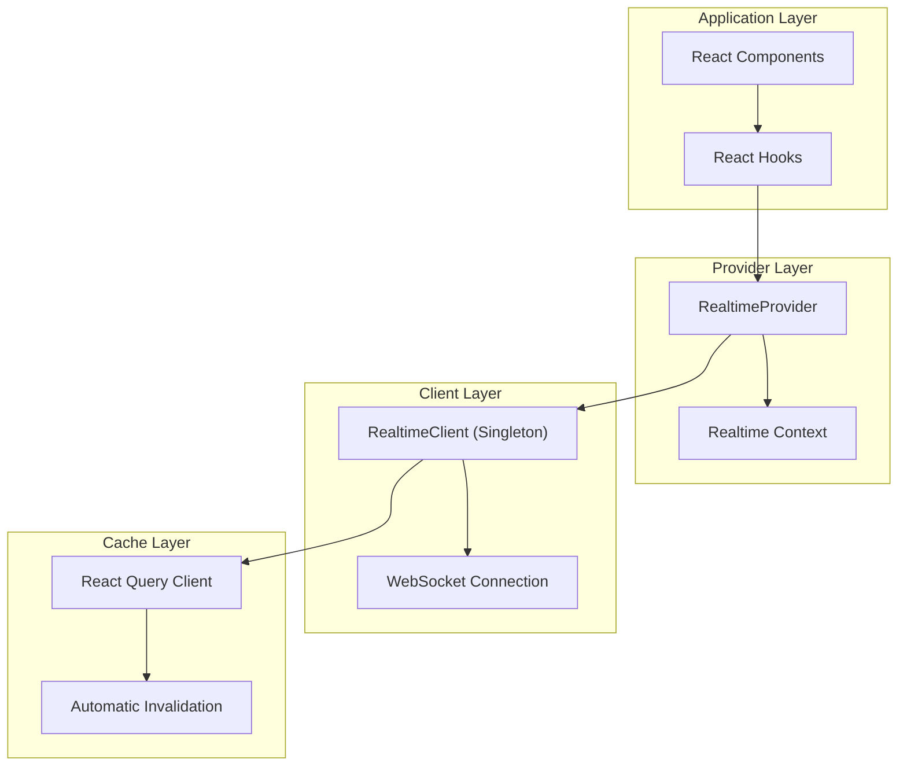
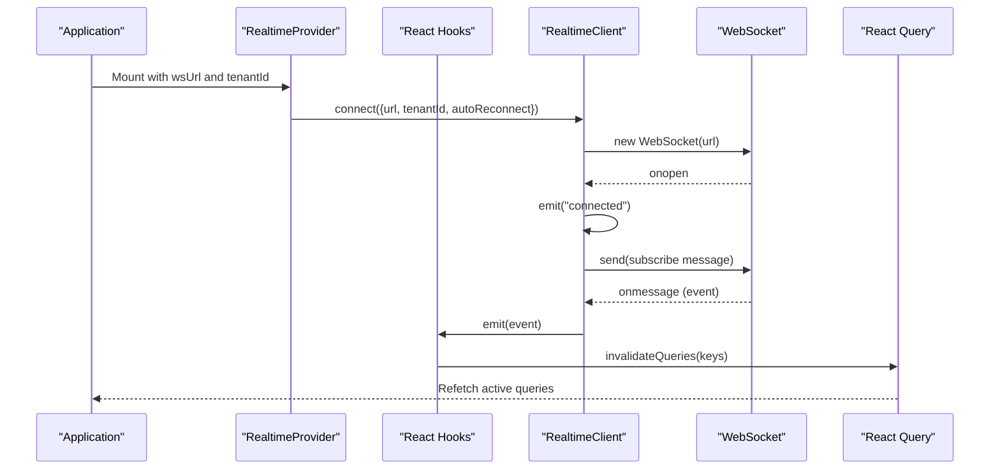
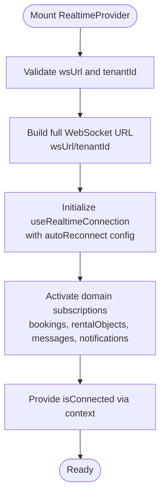
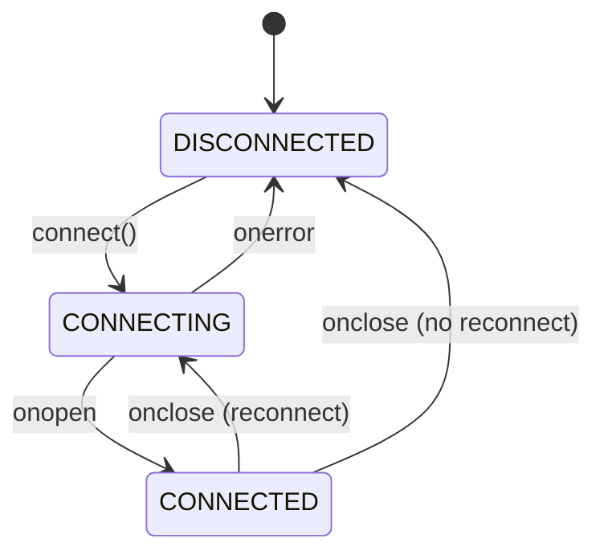

# Client SDK Real-time Integration

<cite>
**Referenced Files in This Document**
- [RealtimeProvider.tsx](file://packages/client-sdk/src/providers/RealtimeProvider.tsx)
- [use-realtime.ts](file://packages/client-sdk/src/hooks/use-realtime.ts)
- [index.ts](file://packages/client-sdk/src/realtime/index.ts)
- [ws-cache-sync.ts](file://packages/client-sdk/src/realtime/ws-cache-sync.ts)
- [index.ts](file://packages/client-sdk/src/index.ts)
- [websocket-realtime.md](file://docs/guides/websocket-realtime.md)
</cite>

## Table of Contents
1. [Introduction](#introduction)
2. [Project Structure](#project-structure)
3. [Core Components](#core-components)
4. [Architecture Overview](#architecture-overview)
5. [Detailed Component Analysis](#detailed-component-analysis)
6. [Dependency Analysis](#dependency-analysis)
7. [Performance Considerations](#performance-considerations)
8. [Troubleshooting Guide](#troubleshooting-guide)
9. [Conclusion](#conclusion)

## Introduction
This document provides comprehensive guidance for integrating the client SDK's real-time WebSocket functionality. It covers the RealtimeProvider React component, connection establishment, automatic reconnection logic, cache synchronization mechanisms, event handling patterns, state management, optimistic updates, conflict resolution, and practical troubleshooting and optimization strategies.

## Project Structure
The real-time integration spans three primary areas:
- Provider layer: RealtimeProvider wraps the application and manages connection lifecycle and context.
- Hook layer: React hooks provide subscription management and automatic cache invalidation.
- Client layer: The RealtimeClient singleton handles WebSocket communication, event routing, and reconnection.



**Diagram sources**
- [RealtimeProvider.tsx](file://packages/client-sdk/src/providers/RealtimeProvider.tsx#L47-L90)
- [use-realtime.ts](file://packages/client-sdk/src/hooks/use-realtime.ts#L17-L41)
- [index.ts](file://packages/client-sdk/src/realtime/index.ts#L28-L112)

**Section sources**
- [RealtimeProvider.tsx](file://packages/client-sdk/src/providers/RealtimeProvider.tsx#L1-L98)
- [use-realtime.ts](file://packages/client-sdk/src/hooks/use-realtime.ts#L1-L244)
- [index.ts](file://packages/client-sdk/src/realtime/index.ts#L1-L296)

## Core Components
This section outlines the primary building blocks of the real-time system and their responsibilities.

- RealtimeProvider: Establishes the WebSocket connection, manages subscriptions, and exposes connection status via context.
- RealtimeClient: Singleton WebSocket client that handles connection, event emission, and reconnection logic.
- React Hooks: Provide declarative subscription APIs and automatic cache invalidation.
- WebSocketCacheSync: Alternative cache synchronization mechanism with explicit event mapping.

Key responsibilities:
- Connection management: Establishing, maintaining, and recovering from WebSocket connections.
- Event routing: Parsing incoming messages and dispatching to registered handlers.
- Cache synchronization: Invalidating React Query caches based on event types.
- State exposure: Providing connection status and error information to components.

**Section sources**
- [RealtimeProvider.tsx](file://packages/client-sdk/src/providers/RealtimeProvider.tsx#L15-L98)
- [index.ts](file://packages/client-sdk/src/realtime/index.ts#L28-L279)
- [use-realtime.ts](file://packages/client-sdk/src/hooks/use-realtime.ts#L17-L244)
- [ws-cache-sync.ts](file://packages/client-sdk/src/realtime/ws-cache-sync.ts#L152-L222)

## Architecture Overview
The real-time architecture follows a layered approach:
- Provider layer: Manages global connection and context.
- Hook layer: Encapsulates subscription logic and cache invalidation.
- Client layer: Handles WebSocket communication and event distribution.
- Cache layer: Integrates with React Query for automatic cache management.



**Diagram sources**
- [RealtimeProvider.tsx](file://packages/client-sdk/src/providers/RealtimeProvider.tsx#L47-L83)
- [index.ts](file://packages/client-sdk/src/realtime/index.ts#L39-L101)
- [use-realtime.ts](file://packages/client-sdk/src/hooks/use-realtime.ts#L47-L63)

**Section sources**
- [websocket-realtime.md](file://docs/guides/websocket-realtime.md#L41-L128)
- [index.ts](file://packages/client-sdk/src/realtime/index.ts#L28-L112)

## Detailed Component Analysis

### RealtimeProvider Component
The RealtimeProvider serves as the application-wide entry point for real-time functionality. It constructs the WebSocket URL using the tenant ID and initializes the connection with configurable reconnection behavior.

Key features:
- URL construction: Appends tenantId to the base wsUrl for multi-tenant isolation.
- Connection configuration: Supports autoReconnect, reconnectInterval, and maxReconnectAttempts.
- Subscription orchestration: Enables booking, rental object, message, and notification subscriptions.
- Context exposure: Provides isConnected status to descendant components.

Implementation highlights:
- Full URL composition: `${wsUrl}/${tenantId}` when both are provided.
- Connection initialization: Delegates to useRealtimeConnection with provided config.
- Subscription activation: Calls useRealtime* hooks based on props.



**Diagram sources**
- [RealtimeProvider.tsx](file://packages/client-sdk/src/providers/RealtimeProvider.tsx#L56-L83)

**Section sources**
- [RealtimeProvider.tsx](file://packages/client-sdk/src/providers/RealtimeProvider.tsx#L47-L98)

### RealtimeClient WebSocket Implementation
The RealtimeClient singleton manages the underlying WebSocket connection and event distribution. It implements robust connection lifecycle management and event routing.

Core functionality:
- Connection lifecycle: Handles onopen, onmessage, onclose, and onerror events.
- Event emission: Parses incoming messages and dispatches to registered handlers.
- Reconnection logic: Attempts reconnection with configurable intervals and limits.
- Handler management: Maintains a map of event types to handler sets.

Connection flow:
- onopen: Resets reconnectAttempts, emits "connected" event, sends subscription message.
- onmessage: Parses JSON, validates event type, emits to handlers, supports wildcard "*".
- onclose: Initiates reconnection if autoReconnect is enabled and attempts < max.
- onerror: Silently handled to prevent noise during transient failures.



**Diagram sources**
- [index.ts](file://packages/client-sdk/src/realtime/index.ts#L258-L275)

**Section sources**
- [index.ts](file://packages/client-sdk/src/realtime/index.ts#L28-L279)

### React Hooks for Real-time Subscriptions
The SDK provides specialized hooks for subscribing to different event categories. Each hook automatically invalidates relevant React Query caches and cleans up subscriptions.

Subscription patterns:
- useRealtimeConnection: Low-level connection management with state tracking.
- useRealtimeBookings: Invalidates booking and calendar-related queries.
- useRealtimeRentalObjects: Invalidates listing queries.
- useRealtimeCalendar: Invalidates availability and calendar queries.
- useRealtimeMessages: Invalidates conversation and message queries.
- useRealtimeNotifications: Invalidates notification queries.
- useRealtimeAudit/Monitoring: Specialized admin-only subscriptions.
- useRealtimeEvents: Wildcard subscription for debugging.
- useNotificationBadge: Tracks unread notification counts.
- useRealtimeSend: Provides send/ping utilities and connection status.

Handler management:
- Uses useRef to maintain stable handler references across renders.
- Returns unsubscribe functions for proper cleanup.
- Integrates with React Query's invalidateQueries for cache synchronization.

**Section sources**
- [use-realtime.ts](file://packages/client-sdk/src/hooks/use-realtime.ts#L17-L244)

### WebSocket Cache Synchronization
The WebSocketCacheSync class offers an alternative approach to cache synchronization with explicit event-to-query mapping.

Key aspects:
- Event mapping: wsInvalidationMap defines which query keys to invalidate for each event type.
- Automatic invalidation: Processes incoming events and invalidates matching queries.
- Refetch strategy: Uses refetchType: 'active' to minimize unnecessary network requests.
- Reconnection: Automatically reconnects with 3-second intervals.

Integration patterns:
- Provider-based: RealtimeProvider integrates cache sync automatically.
- Manual usage: Advanced scenarios can initialize and connect directly.
- Custom hooks: createUseWebSocketCacheSync enables flexible integration.

**Section sources**
- [ws-cache-sync.ts](file://packages/client-sdk/src/realtime/ws-cache-sync.ts#L152-L245)

### Event Handling Patterns and State Management
The SDK employs several patterns for robust event handling and state management:

Connection state tracking:
- isConnected property reflects WebSocket readiness state.
- Internal flags track isConnecting and reconnectAttempts.
- Connection events provide human-readable messages.

Handler patterns:
- useRef for stable handler references.
- useEffect for subscription lifecycle management.
- Cleanup functions prevent memory leaks.

Error handling:
- Silent connection errors to avoid console spam.
- Handler errors logged but don't crash the system.
- Send errors produce warnings for development awareness.

**Section sources**
- [index.ts](file://packages/client-sdk/src/realtime/index.ts#L241-L256)
- [use-realtime.ts](file://packages/client-sdk/src/hooks/use-realtime.ts#L210-L228)

### Optimistic Updates and Conflict Resolution
The SDK supports optimistic UI patterns with robust conflict resolution:

Optimistic patterns:
- Immediate UI updates followed by server confirmation.
- Rollback on mutation errors using React Query's snapshot mechanism.
- WebSocket events serve as the authoritative source after successful mutations.

Conflict detection:
- Monitors concurrent edits and alerts users to potential conflicts.
- Provides mechanisms to reload latest versions when conflicts are detected.

Background synchronization:
- Notifications and messages update without user interaction.
- Reduces polling by leveraging WebSocket events.

**Section sources**
- [websocket-realtime.md](file://docs/guides/websocket-realtime.md#L2798-L3018)

## Dependency Analysis
The real-time system exhibits clear separation of concerns with minimal coupling between components.

```mermaid
graph TB
subgraph "Exports"
Exports["SDK Exports"]
end
subgraph "Providers"
Provider["RealtimeProvider"]
end
subgraph "Hooks"
Hooks["Realtime Hooks"]
end
subgraph "Client"
Client["RealtimeClient"]
end
subgraph "Cache Sync"
CacheSync["WebSocketCacheSync"]
end
Exports --> Provider
Exports --> Hooks
Exports --> Client
Exports --> CacheSync
Provider --> Hooks
Hooks --> Client
Hooks --> CacheSync
Client --> CacheSync
```

**Diagram sources**
- [index.ts](file://packages/client-sdk/src/index.ts#L90-L101)
- [RealtimeProvider.tsx](file://packages/client-sdk/src/providers/RealtimeProvider.tsx#L6-L13)
- [use-realtime.ts](file://packages/client-sdk/src/hooks/use-realtime.ts#L6-L12)
- [index.ts](file://packages/client-sdk/src/realtime/index.ts#L278-L279)
- [ws-cache-sync.ts](file://packages/client-sdk/src/realtime/ws-cache-sync.ts#L221-L222)

**Section sources**
- [index.ts](file://packages/client-sdk/src/index.ts#L90-L101)

## Performance Considerations
The SDK incorporates several performance optimizations:

Cache invalidation strategy:
- Automatic invalidation via wsInvalidationMap ensures cache consistency.
- refetchType: 'active' minimizes unnecessary network requests.
- Query keys are organized to target specific data subsets.

Connection management:
- Fixed interval reconnection (current implementation) balances responsiveness with server load.
- Debug mode disabled by default to avoid performance impact.
- Connection state flags prevent redundant operations.

Event processing:
- Handler errors are caught and logged without affecting other handlers.
- Silent parsing errors prevent crashes from malformed messages.
- Subscription cleanup prevents memory leaks and reduces handler overhead.

**Section sources**
- [websocket-realtime.md](file://docs/guides/websocket-realtime.md#L2536-L2555)
- [index.ts](file://packages/client-sdk/src/realtime/index.ts#L338-L430)

## Troubleshooting Guide

### Common Connection Issues
Network connectivity problems:
- Initial connection failures: The client attempts reconnection up to maxReconnectAttempts.
- Connection loss after successful connection: Automatic reconnection with fixed intervals.
- Server restarts: Reconnection attempts resume normal operation.

Firewall/proxy restrictions:
- Corporate firewalls may block WebSocket connections.
- Verify WebSocket support in corporate environments.
- Check browser developer tools for connection refusal errors.

Debugging techniques:
- Enable debug mode in development to observe connection and event flow.
- Monitor console output for reconnection attempts and error messages.
- Use connection status indicators to diagnose intermittent issues.

### Performance Optimization Tips
Reduce unnecessary updates:
- Filter events client-side using handler logic.
- Use specific subscription hooks instead of wildcard subscriptions.
- Debounce high-frequency event processing when appropriate.

Memory management:
- Always return cleanup functions from useEffect hooks.
- Avoid creating multiple WebSocket connections.
- Leverage the singleton RealtimeClient for shared connection state.

Error handling improvements:
- Implement try-catch blocks around event handlers.
- Validate event data structures before processing.
- Use schema validation libraries for complex event payloads.

### Best Practices Checklist
- ✅ Use RealtimeProvider for centralized connection management
- ✅ Implement proper cleanup in all subscription hooks
- ✅ Enable debug mode only in development environments
- ✅ Filter events to relevant data subsets
- ✅ Handle reconnection automatically with sensible intervals
- ✅ Use optimistic updates with proper rollback logic
- ✅ Monitor connection health and display status indicators

**Section sources**
- [websocket-realtime.md](file://docs/guides/websocket-realtime.md#L438-L577)
- [websocket-realtime.md](file://docs/guides/websocket-realtime.md#L3163-L3207)
- [websocket-realtime.md](file://docs/guides/websocket-realtime.md#L3783-L3808)

## Conclusion
The client SDK's real-time integration provides a robust, scalable foundation for live updates across applications. The combination of the RealtimeProvider, specialized React hooks, and the RealtimeClient singleton delivers automatic cache synchronization, reliable reconnection logic, and flexible event handling patterns. By following the documented patterns and best practices, developers can implement responsive real-time features with minimal complexity while maintaining optimal performance and reliability.

The system's architecture supports both simple use cases through the provider-based approach and advanced scenarios through direct client access, ensuring flexibility for diverse application requirements. The comprehensive error handling, performance optimizations, and debugging capabilities make it suitable for production deployments across various environments and use cases.