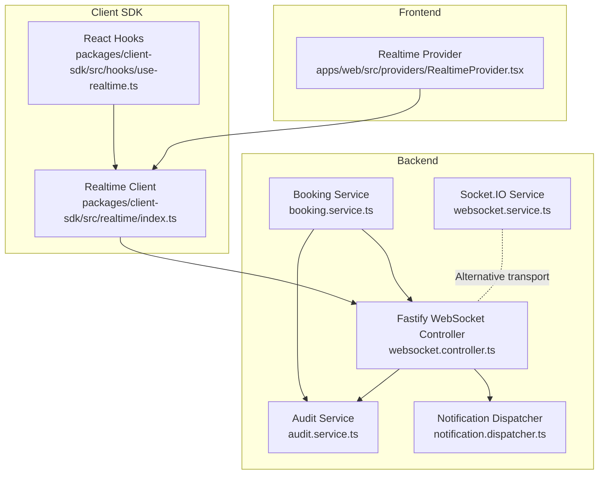
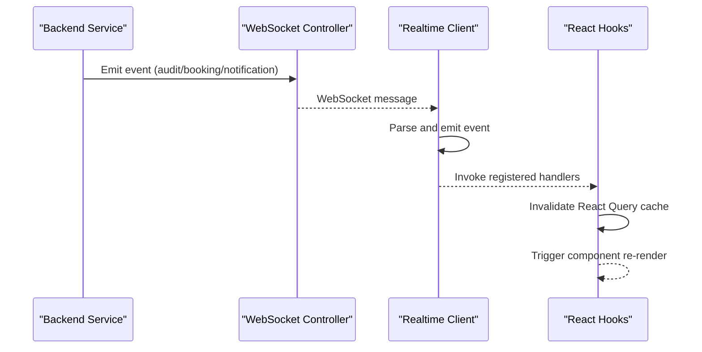
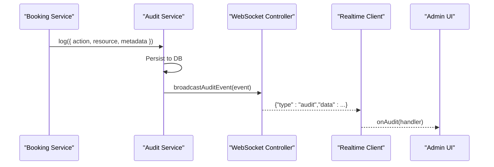
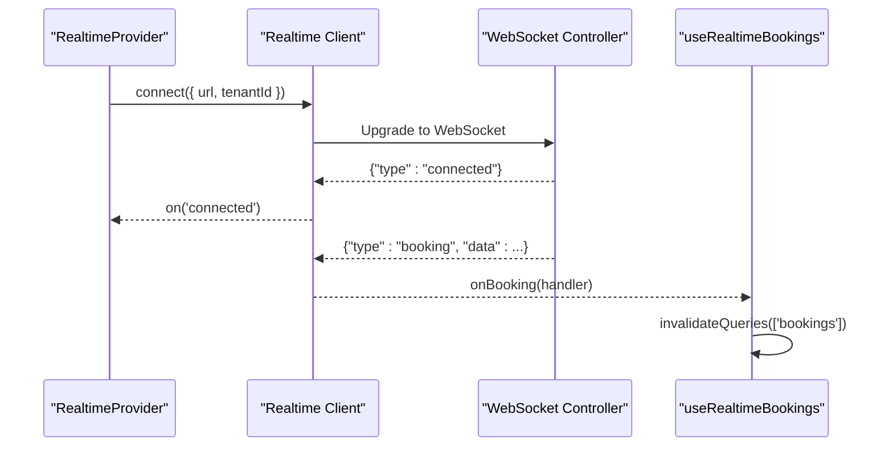
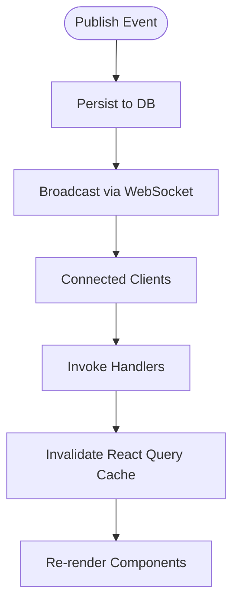
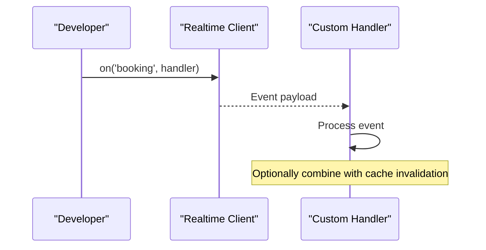
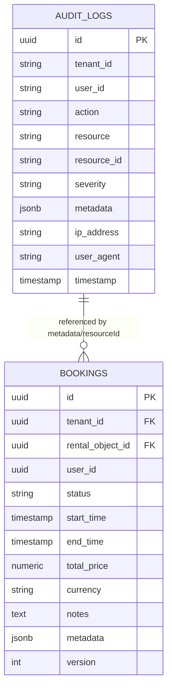
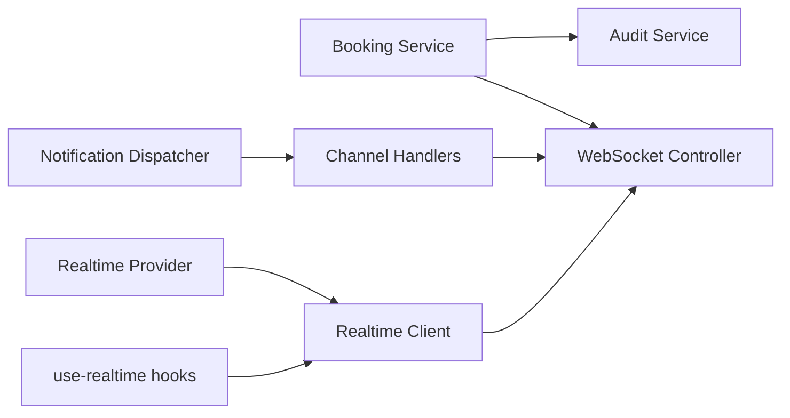

# Event-Driven Communication Patterns

<cite>
**Referenced Files in This Document**
- [audit.service.ts](file://apps/api/src/core/audit/audit.service.ts)
- [websocket.controller.ts](file://apps/api/src/modules/websocket/websocket.controller.ts)
- [websocket.service.ts](file://apps/api/src/services/websocket.service.ts)
- [index.ts](file://packages/client-sdk/src/realtime/index.ts)
- [RealtimeProvider.tsx](file://apps/web/src/providers/RealtimeProvider.tsx)
- [use-realtime.ts](file://packages/client-sdk/src/hooks/use-realtime.ts)
- [notification.dispatcher.ts](file://apps/api/src/modules/notification-system/notification.dispatcher.ts)
- [vipps-webhook.controller.ts](file://apps/api/src/modules/webhooks/vipps-webhook.controller.ts)
- [booking.service.ts](file://apps/api/src/modules/booking/booking.service.ts)
- [websocket-latency-performance.test.ts](file://apps/api/tests/integration/websocket-latency-performance.test.ts)
- [websocket-realtime.md](file://docs/guides/websocket-realtime.md)
- [ERD.md](file://docs/technical/ERD.md)
</cite>

## Table of Contents
1. [Introduction](#introduction)
2. [Project Structure](#project-structure)
3. [Core Components](#core-components)
4. [Architecture Overview](#architecture-overview)
5. [Detailed Component Analysis](#detailed-component-analysis)
6. [Dependency Analysis](#dependency-analysis)
7. [Performance Considerations](#performance-considerations)
8. [Troubleshooting Guide](#troubleshooting-guide)
9. [Conclusion](#conclusion)
10. [Appendices](#appendices)

## Introduction
This document explains the event-driven communication patterns powering the platform’s reactive architecture. It covers the audit event system, real-time data synchronization via WebSocket, and event propagation across the backend and frontend. It also documents the publish-subscribe model, event sourcing concepts, state consistency strategies, and practical guidance for building new real-time features while maintaining performance and reliability.

## Project Structure
The event-driven system spans three layers:
- Backend services that produce events (audit, booking, notifications) and expose WebSocket endpoints.
- A client SDK that consumes WebSocket streams and integrates with React Query for cache synchronization.
- Frontend providers and hooks that subscribe to events and drive UI updates.

**Diagram sources**
- [websocket.controller.ts](file://apps/api/src/modules/websocket/websocket.controller.ts#L10-L60)
- [audit.service.ts](file://apps/api/src/core/audit/audit.service.ts#L74-L210)
- [notification.dispatcher.ts](file://apps/api/src/modules/notification-system/notification.dispatcher.ts#L40-L119)
- [booking.service.ts](file://apps/api/src/modules/booking/booking.service.ts#L54-L138)
- [websocket.service.ts](file://apps/api/src/services/websocket.service.ts#L36-L177)
- [index.ts](file://packages/client-sdk/src/realtime/index.ts#L28-L276)
- [use-realtime.ts](file://packages/client-sdk/src/hooks/use-realtime.ts#L17-L41)
- [RealtimeProvider.tsx](file://apps/web/src/providers/RealtimeProvider.tsx#L61-L176)

**Section sources**
- [websocket.controller.ts](file://apps/api/src/modules/websocket/websocket.controller.ts#L10-L60)
- [audit.service.ts](file://apps/api/src/core/audit/audit.service.ts#L74-L210)
- [notification.dispatcher.ts](file://apps/api/src/modules/notification-system/notification.dispatcher.ts#L40-L119)
- [booking.service.ts](file://apps/api/src/modules/booking/booking.service.ts#L54-L138)
- [websocket.service.ts](file://apps/api/src/services/websocket.service.ts#L36-L177)
- [index.ts](file://packages/client-sdk/src/realtime/index.ts#L28-L276)
- [use-realtime.ts](file://packages/client-sdk/src/hooks/use-realtime.ts#L17-L41)
- [RealtimeProvider.tsx](file://apps/web/src/providers/RealtimeProvider.tsx#L61-L176)

## Core Components
- Audit service: Produces audit events and broadcasts them over WebSocket for admin dashboards and compliance.
- Booking service: Emits booking lifecycle events (created, updated, confirmed, cancelled, completed) to keep clients synchronized.
- Notification dispatcher: Routes notifications to channels and supports real-time in-app delivery via WebSocket.
- WebSocket controller: Registers WebSocket routes for tenant-scoped event streams and audit-only streams.
- Realtime client: Singleton WebSocket client with event subscription, reconnection, and ping/pong support.
- Frontend provider and hooks: Manage connection lifecycle, subscriptions, and automatic cache invalidation.

**Section sources**
- [audit.service.ts](file://apps/api/src/core/audit/audit.service.ts#L74-L210)
- [booking.service.ts](file://apps/api/src/modules/booking/booking.service.ts#L115-L138)
- [notification.dispatcher.ts](file://apps/api/src/modules/notification-system/notification.dispatcher.ts#L40-L119)
- [websocket.controller.ts](file://apps/api/src/modules/websocket/websocket.controller.ts#L14-L60)
- [index.ts](file://packages/client-sdk/src/realtime/index.ts#L28-L276)
- [RealtimeProvider.tsx](file://apps/web/src/providers/RealtimeProvider.tsx#L61-L176)
- [use-realtime.ts](file://packages/client-sdk/src/hooks/use-realtime.ts#L47-L172)

## Architecture Overview
The system follows a publish-subscribe model:
- Publishers: Backend services (audit, booking, notifications) emit events.
- Transport: WebSocket endpoints deliver events to subscribed clients.
- Subscribers: Frontend hooks and providers consume events and synchronize React Query caches.

**Diagram sources**
- [websocket.controller.ts](file://apps/api/src/modules/websocket/websocket.controller.ts#L14-L60)
- [index.ts](file://packages/client-sdk/src/realtime/index.ts#L73-L83)
- [use-realtime.ts](file://packages/client-sdk/src/hooks/use-realtime.ts#L47-L172)

## Detailed Component Analysis

### Audit Event System
- Audit entries are persisted to the database and broadcast to WebSocket clients with type "audit".
- The audit service maintains a set of active WebSocket connections and sends audit events to all connected clients.
- Consumers can subscribe to audit events via the realtime client or the dedicated audit WebSocket route.

**Diagram sources**
- [booking.service.ts](file://apps/api/src/modules/booking/booking.service.ts#L115-L138)
- [audit.service.ts](file://apps/api/src/core/audit/audit.service.ts#L84-L120)
- [websocket.controller.ts](file://apps/api/src/modules/websocket/websocket.controller.ts#L14-L41)
- [index.ts](file://packages/client-sdk/src/realtime/index.ts#L132-L134)

**Section sources**
- [audit.service.ts](file://apps/api/src/core/audit/audit.service.ts#L74-L120)
- [websocket.controller.ts](file://apps/api/src/modules/websocket/websocket.controller.ts#L14-L41)
- [RealtimeProvider.tsx](file://apps/web/src/providers/RealtimeProvider.tsx#L224-L231)
- [use-realtime.ts](file://packages/client-sdk/src/hooks/use-realtime.ts#L161-L172)

### Real-Time Data Synchronization
- Tenant-scoped WebSocket endpoints stream events filtered by tenantId.
- The frontend provider creates a WebSocket URL using the tenantId and manages connection lifecycle.
- React hooks automatically invalidate React Query caches upon receiving events, ensuring UI consistency.

**Diagram sources**
- [RealtimeProvider.tsx](file://apps/web/src/providers/RealtimeProvider.tsx#L85-L98)
- [websocket.controller.ts](file://apps/api/src/modules/websocket/websocket.controller.ts#L43-L60)
- [index.ts](file://packages/client-sdk/src/realtime/index.ts#L39-L101)
- [use-realtime.ts](file://packages/client-sdk/src/hooks/use-realtime.ts#L47-L64)

**Section sources**
- [RealtimeProvider.tsx](file://apps/web/src/providers/RealtimeProvider.tsx#L61-L176)
- [websocket.controller.ts](file://apps/api/src/modules/websocket/websocket.controller.ts#L43-L60)
- [index.ts](file://packages/client-sdk/src/realtime/index.ts#L28-L101)
- [use-realtime.ts](file://packages/client-sdk/src/hooks/use-realtime.ts#L47-L172)

### Event Propagation Mechanisms
- Publish-subscribe: Backend services publish events; WebSocket routes distribute them to subscribers.
- Multi-tenant isolation: WebSocket endpoints accept a tenantId parameter to scope event streams.
- Reconnection: The client implements exponential backoff-like behavior and emits a "connected" event upon successful reconnection.

**Diagram sources**
- [audit.service.ts](file://apps/api/src/core/audit/audit.service.ts#L84-L120)
- [websocket.controller.ts](file://apps/api/src/modules/websocket/websocket.controller.ts#L14-L60)
- [index.ts](file://packages/client-sdk/src/realtime/index.ts#L73-L83)
- [use-realtime.ts](file://packages/client-sdk/src/hooks/use-realtime.ts#L47-L64)

**Section sources**
- [websocket-realtime.md](file://docs/guides/websocket-realtime.md#L102-L155)
- [websocket.controller.ts](file://apps/api/src/modules/websocket/websocket.controller.ts#L43-L60)
- [index.ts](file://packages/client-sdk/src/realtime/index.ts#L258-L275)

### Implementing Custom Event Handlers
- Use the realtime client’s subscription APIs to attach handlers for specific event types.
- Combine wildcard subscriptions with targeted handlers for fine-grained control.
- For React, use the provided hooks to subscribe and invalidate caches automatically.

**Diagram sources**
- [index.ts](file://packages/client-sdk/src/realtime/index.ts#L117-L127)
- [use-realtime.ts](file://packages/client-sdk/src/hooks/use-realtime.ts#L47-L64)

**Section sources**
- [index.ts](file://packages/client-sdk/src/realtime/index.ts#L117-L127)
- [use-realtime.ts](file://packages/client-sdk/src/hooks/use-realtime.ts#L47-L64)

### Managing Event Ordering
- The singleton client ensures a single connection and consistent event delivery order.
- Automatic reconnection preserves subscription state and minimizes duplicate handling.

**Section sources**
- [websocket-realtime.md](file://docs/guides/websocket-realtime.md#L41-L60)
- [index.ts](file://packages/client-sdk/src/realtime/index.ts#L258-L275)

### Handling Event Replay Scenarios
- Use the audit service’s query API to reconstruct historical state for replay or debugging.
- The audit log includes who, what, when, tenantId, and metadata for compliance and troubleshooting.

**Section sources**
- [audit.service.ts](file://apps/api/src/core/audit/audit.service.ts#L125-L177)

### Database Triggers, Event Dispatchers, and WebSocket Broadcasters
- Database-level audit triggers capture mutations and persist them to audit_logs.
- Backend services log audit entries and broadcast events to WebSocket clients.
- Notification dispatcher coordinates channel-specific delivery and can broadcast in-app notifications via WebSocket.

**Diagram sources**
- [ERD.md](file://docs/technical/ERD.md#L407-L447)
- [audit.service.ts](file://apps/api/src/core/audit/audit.service.ts#L24-L48)
- [booking.service.ts](file://apps/api/src/modules/booking/booking.service.ts#L54-L138)

**Section sources**
- [ERD.md](file://docs/technical/ERD.md#L407-L447)
- [audit.service.ts](file://apps/api/src/core/audit/audit.service.ts#L58-L72)
- [notification.dispatcher.ts](file://apps/api/src/modules/notification-system/notification.dispatcher.ts#L59-L61)

## Dependency Analysis
- Backend dependencies:
  - Audit service depends on the container-resolved database and Fastify WebSocket registration.
  - Booking service depends on repositories and the audit service for logging and broadcasting.
  - Notification dispatcher depends on channel handlers and repositories for delivery logs.
- Frontend dependencies:
  - Realtime client depends on browser WebSocket API and React Query for cache invalidation.
  - Provider and hooks depend on the realtime client and React context.

**Diagram sources**
- [booking.service.ts](file://apps/api/src/modules/booking/booking.service.ts#L10-L12)
- [audit.service.ts](file://apps/api/src/core/audit/audit.service.ts#L74-L80)
- [websocket.controller.ts](file://apps/api/src/modules/websocket/websocket.controller.ts#L8)
- [notification.dispatcher.ts](file://apps/api/src/modules/notification-system/notification.dispatcher.ts#L40-L54)
- [index.ts](file://packages/client-sdk/src/realtime/index.ts#L28-L47)
- [RealtimeProvider.tsx](file://apps/web/src/providers/RealtimeProvider.tsx#L61-L98)
- [use-realtime.ts](file://packages/client-sdk/src/hooks/use-realtime.ts#L17-L41)

**Section sources**
- [booking.service.ts](file://apps/api/src/modules/booking/booking.service.ts#L10-L12)
- [audit.service.ts](file://apps/api/src/core/audit/audit.service.ts#L74-L80)
- [websocket.controller.ts](file://apps/api/src/modules/websocket/websocket.controller.ts#L8)
- [notification.dispatcher.ts](file://apps/api/src/modules/notification-system/notification.dispatcher.ts#L40-L54)
- [index.ts](file://packages/client-sdk/src/realtime/index.ts#L28-L47)
- [RealtimeProvider.tsx](file://apps/web/src/providers/RealtimeProvider.tsx#L61-L98)
- [use-realtime.ts](file://packages/client-sdk/src/hooks/use-realtime.ts#L17-L41)

## Performance Considerations
- Latency targets: End-to-end event delivery latency is measured and kept under defined thresholds during integration tests.
- Reconnection strategy: The client attempts reconnection with bounded retries and fixed intervals to balance resilience and resource usage.
- Cache invalidation: Automatic React Query invalidation ensures minimal stale data but should be scoped to reduce unnecessary refetches.

**Section sources**
- [websocket-latency-performance.test.ts](file://apps/api/tests/integration/websocket-latency-performance.test.ts#L289-L312)
- [websocket-realtime.md](file://docs/guides/websocket-realtime.md#L143-L154)
- [use-realtime.ts](file://packages/client-sdk/src/hooks/use-realtime.ts#L47-L172)

## Troubleshooting Guide
- Connection issues: Verify WebSocket URL construction and tenantId scoping. Use the provider’s connect/disconnect lifecycle and inspect status/error states.
- Handler errors: The client wraps handler invocations and logs errors; ensure handlers are resilient and idempotent.
- Idempotency for external webhooks: Use an idempotency store keyed by eventId with TTL to prevent duplicate processing.

**Section sources**
- [RealtimeProvider.tsx](file://apps/web/src/providers/RealtimeProvider.tsx#L75-L98)
- [index.ts](file://packages/client-sdk/src/realtime/index.ts#L245-L256)
- [vipps-webhook.controller.ts](file://apps/api/src/modules/webhooks/vipps-webhook.controller.ts#L57-L85)

## Conclusion
The platform’s event-driven architecture combines database-level audit triggers, backend event producers, and a robust WebSocket-based publish-subscribe system. The client SDK and React hooks provide a clean, efficient way to subscribe to events, maintain cache consistency, and build responsive real-time features. Following the documented patterns ensures scalability, compliance, and predictable performance.

## Appendices

### Implementing Custom Event Handlers
- Subscribe to event types using the realtime client’s on() methods.
- For React, wrap handlers with the provided hooks to benefit from automatic cache invalidation.
- For global handling, use wildcard subscriptions and apply filtering logic within handlers.

**Section sources**
- [index.ts](file://packages/client-sdk/src/realtime/index.ts#L117-L127)
- [use-realtime.ts](file://packages/client-sdk/src/hooks/use-realtime.ts#L47-L64)

### Designing New Real-Time Features
- Define event types and payloads in the backend service.
- Log audit entries for compliance and broadcast events to WebSocket clients.
- Expose a tenant-scoped WebSocket route and document event shapes.
- On the frontend, add a provider-level subscription and a React hook for cache invalidation.

**Section sources**
- [websocket.controller.ts](file://apps/api/src/modules/websocket/websocket.controller.ts#L43-L60)
- [audit.service.ts](file://apps/api/src/core/audit/audit.service.ts#L84-L120)
- [RealtimeProvider.tsx](file://apps/web/src/providers/RealtimeProvider.tsx#L108-L112)
- [use-realtime.ts](file://packages/client-sdk/src/hooks/use-realtime.ts#L47-L64)