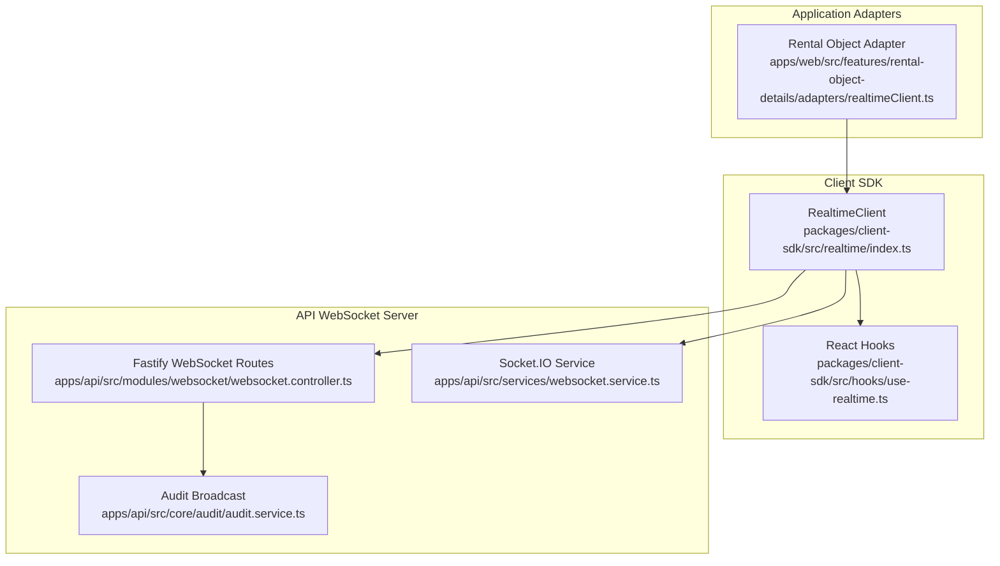
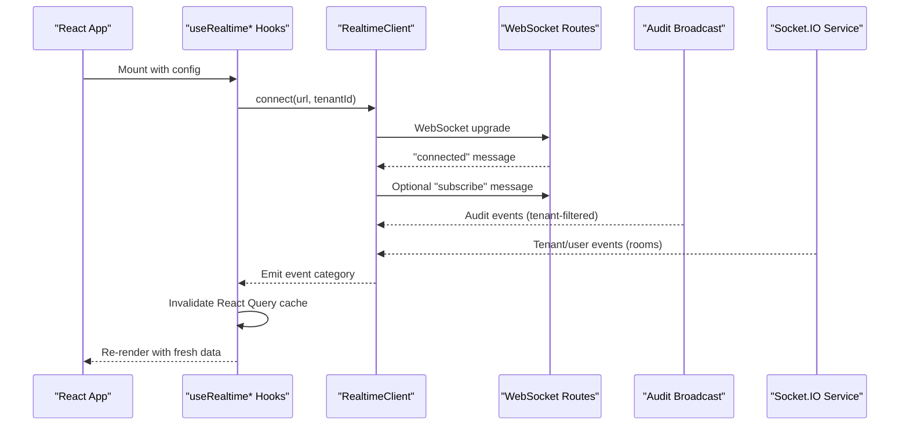
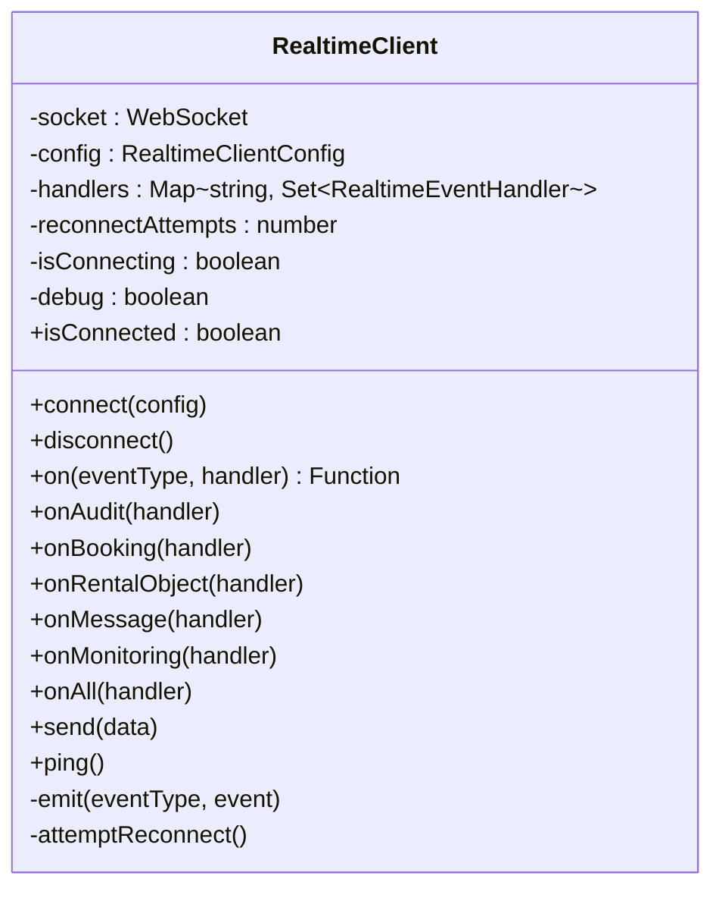
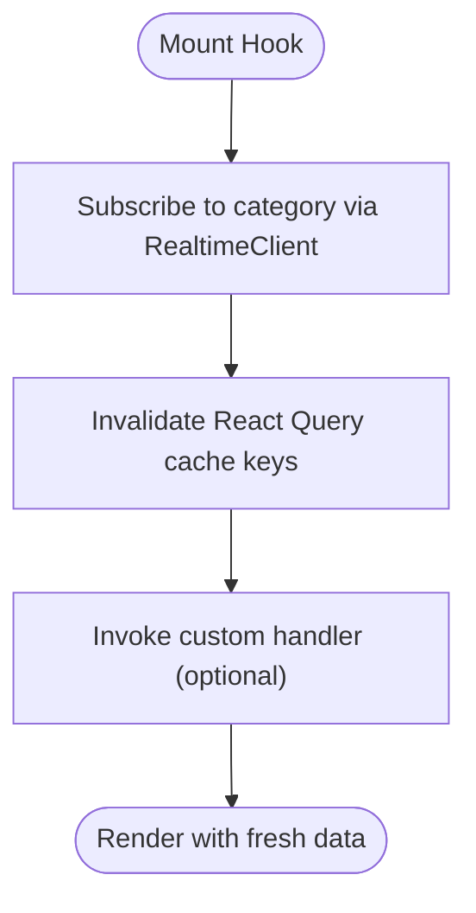
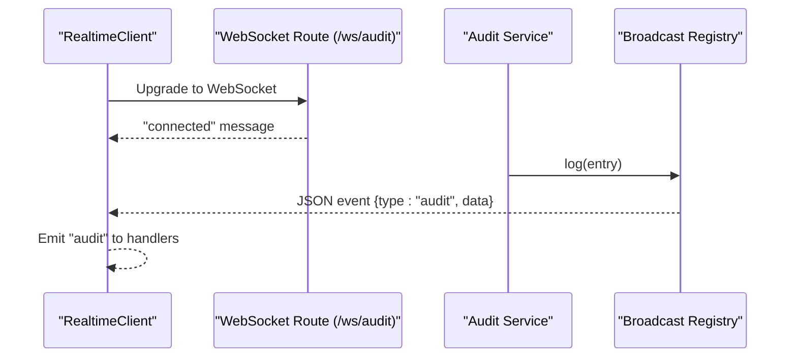
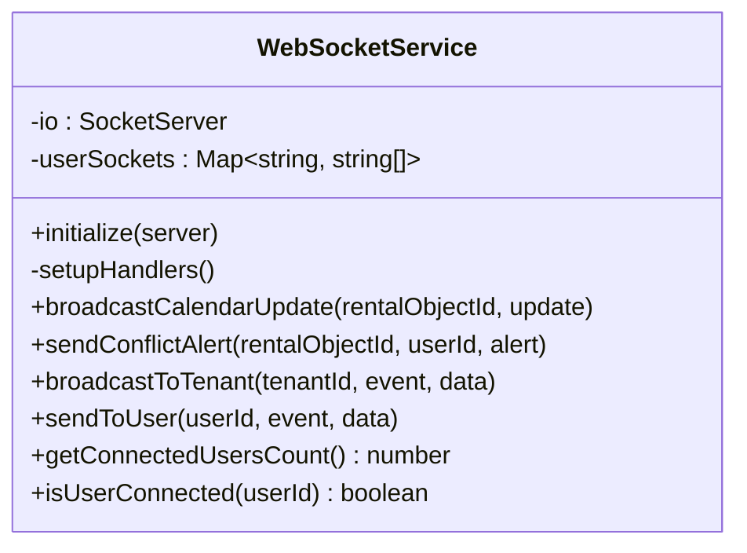
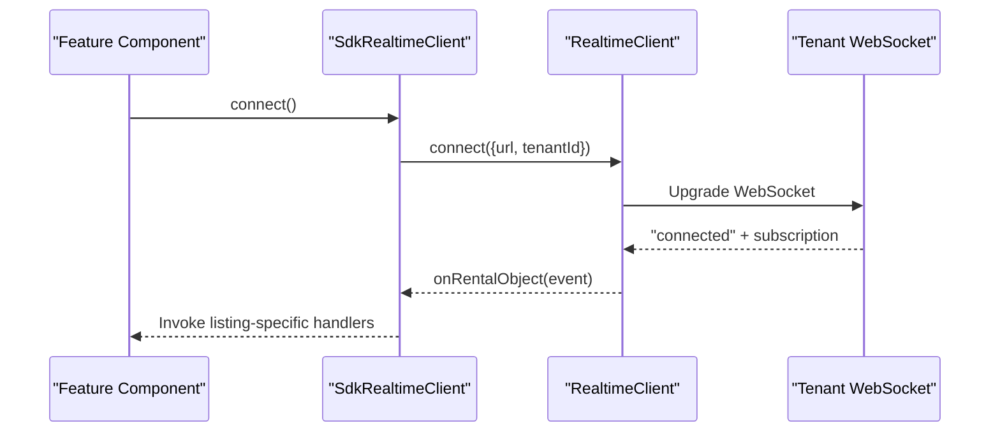
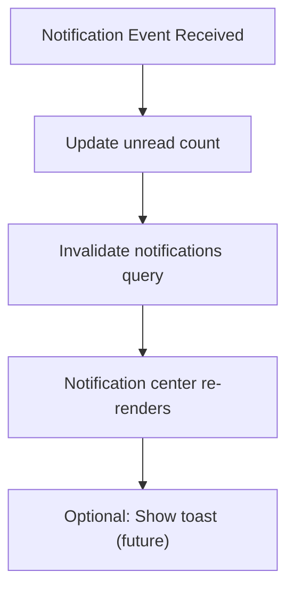
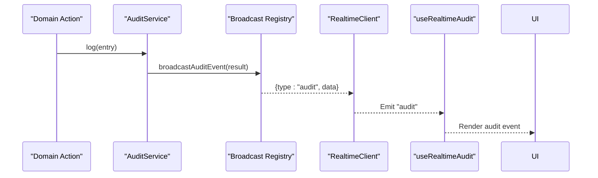
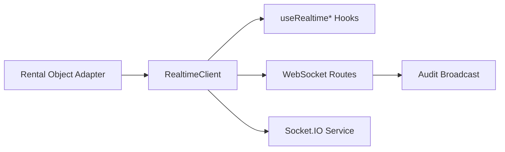

# Real-time Communication

<cite>
**Referenced Files in This Document**
- [websocket-realtime.md](file://docs/guides/websocket-realtime.md)
- [index.ts](file://packages/client-sdk/src/realtime/index.ts)
- [use-realtime.ts](file://packages/client-sdk/src/hooks/use-realtime.ts)
- [websocket.controller.ts](file://apps/api/src/modules/websocket/websocket.controller.ts)
- [websocket.service.ts](file://apps/api/src/services/websocket.service.ts)
- [audit.service.ts](file://apps/api/src/core/audit/audit.service.ts)
- [realtimeClient.ts](file://apps/web/src/features/rental-object-details/adapters/realtimeClient.ts)
- [notification-system.ts](file://packages/client-sdk/src/types/notification-system.ts)
- [priority-2-execution-plan.md](file://docs/roadmap/priority-2-execution-plan.md)
</cite>

## Table of Contents
1. [Introduction](#introduction)
2. [Project Structure](#project-structure)
3. [Core Components](#core-components)
4. [Architecture Overview](#architecture-overview)
5. [Detailed Component Analysis](#detailed-component-analysis)
6. [Dependency Analysis](#dependency-analysis)
7. [Performance Considerations](#performance-considerations)
8. [Troubleshooting Guide](#troubleshooting-guide)
9. [Conclusion](#conclusion)
10. [Appendices](#appendices)

## Introduction
This document explains the WebSocket-based real-time communication system powering live updates across the platform. It covers the WebSocket architecture, connection lifecycle, event broadcasting, client-side integration, and state synchronization. It also documents the notification system, messaging features, and audit logging real-time updates. Guidance is included for extending the system with new real-time features and handling connection failures.

## Project Structure
The real-time system spans three layers:
- Client SDK: a singleton WebSocket client and React hooks for event subscription and cache invalidation
- API WebSocket server: routes for tenant-scoped event streams and audit broadcast
- Application adapters: framework-specific adapters that wrap the SDK for domain features

**Diagram sources**
- [index.ts](file://packages/client-sdk/src/realtime/index.ts#L1-L296)
- [use-realtime.ts](file://packages/client-sdk/src/hooks/use-realtime.ts#L1-L244)
- [websocket.controller.ts](file://apps/api/src/modules/websocket/websocket.controller.ts#L1-L61)
- [websocket.service.ts](file://apps/api/src/services/websocket.service.ts#L1-L188)
- [audit.service.ts](file://apps/api/src/core/audit/audit.service.ts#L50-L139)
- [realtimeClient.ts](file://apps/web/src/features/rental-object-details/adapters/realtimeClient.ts#L1-L163)

**Section sources**
- [websocket-realtime.md](file://docs/guides/websocket-realtime.md#L41-L128)
- [index.ts](file://packages/client-sdk/src/realtime/index.ts#L1-L296)
- [use-realtime.ts](file://packages/client-sdk/src/hooks/use-realtime.ts#L1-L244)
- [websocket.controller.ts](file://apps/api/src/modules/websocket/websocket.controller.ts#L1-L61)
- [websocket.service.ts](file://apps/api/src/services/websocket.service.ts#L1-L188)
- [audit.service.ts](file://apps/api/src/core/audit/audit.service.ts#L50-L139)
- [realtimeClient.ts](file://apps/web/src/features/rental-object-details/adapters/realtimeClient.ts#L1-L163)

## Core Components
- RealtimeClient (singleton): Manages WebSocket connection, event subscription, reconnection, and message dispatch
- React hooks: Provide declarative subscription to specific event categories and automatic cache invalidation
- API WebSocket routes: Serve tenant-scoped event streams and audit broadcasts
- Socket.IO service: Manages user/tenant room subscriptions and targeted/broadcast events
- Audit broadcast: Streams audit events to WebSocket clients
- Application adapter: Wraps SDK for domain-specific features (e.g., rental object updates)

Key responsibilities:
- Transport-level event types and payloads
- Multi-tenant isolation and filtering
- Automatic reconnection and heartbeat
- Seamless React Query cache synchronization

**Section sources**
- [index.ts](file://packages/client-sdk/src/realtime/index.ts#L6-L296)
- [use-realtime.ts](file://packages/client-sdk/src/hooks/use-realtime.ts#L1-L244)
- [websocket.controller.ts](file://apps/api/src/modules/websocket/websocket.controller.ts#L1-L61)
- [websocket.service.ts](file://apps/api/src/services/websocket.service.ts#L36-L180)
- [audit.service.ts](file://apps/api/src/core/audit/audit.service.ts#L58-L120)
- [realtimeClient.ts](file://apps/web/src/features/rental-object-details/adapters/realtimeClient.ts#L41-L98)

## Architecture Overview
The system follows a layered, event-driven design:
- A singleton RealtimeClient encapsulates the WebSocket connection and event routing
- React hooks subscribe to event categories and invalidate caches on receipt
- API routes serve tenant-scoped event streams and audit broadcasts
- Socket.IO supports user/tenant room subscriptions and targeted notifications
- Application adapters translate transport events into domain-specific handlers

**Diagram sources**
- [use-realtime.ts](file://packages/client-sdk/src/hooks/use-realtime.ts#L17-L41)
- [index.ts](file://packages/client-sdk/src/realtime/index.ts#L39-L101)
- [websocket.controller.ts](file://apps/api/src/modules/websocket/websocket.controller.ts#L14-L61)
- [audit.service.ts](file://apps/api/src/core/audit/audit.service.ts#L58-L72)
- [websocket.service.ts](file://apps/api/src/services/websocket.service.ts#L124-L153)

## Detailed Component Analysis

### WebSocket Client (RealtimeClient)
Responsibilities:
- Establish and maintain a WebSocket connection
- Parse inbound messages and emit typed events
- Support wildcard and category-specific subscriptions
- Manage reconnection with fixed intervals
- Send ping/pong and optional subscription messages

**Diagram sources**
- [index.ts](file://packages/client-sdk/src/realtime/index.ts#L28-L279)

**Section sources**
- [index.ts](file://packages/client-sdk/src/realtime/index.ts#L28-L279)

### React Hooks Integration
Purpose:
- Provide declarative subscription to event categories
- Automatically invalidate React Query caches on event receipt
- Expose connection state and utilities for sending messages

Highlights:
- useRealtimeConnection: establishes the singleton connection
- useRealtimeBookings/useRealtimeRentalObjects/useRealtimeCalendar/useRealtimeMessages/useRealtimeNotifications: subscribe to categories and invalidate related queries
- useRealtimeAudit/useRealtimeMonitoring: admin-only streams
- useNotificationBadge: tracks unread counts from notification events
- useRealtimeSend: exposes send and ping helpers

**Diagram sources**
- [use-realtime.ts](file://packages/client-sdk/src/hooks/use-realtime.ts#L47-L86)
- [use-realtime.ts](file://packages/client-sdk/src/hooks/use-realtime.ts#L117-L134)
- [use-realtime.ts](file://packages/client-sdk/src/hooks/use-realtime.ts#L140-L156)

**Section sources**
- [use-realtime.ts](file://packages/client-sdk/src/hooks/use-realtime.ts#L17-L41)
- [use-realtime.ts](file://packages/client-sdk/src/hooks/use-realtime.ts#L47-L86)
- [use-realtime.ts](file://packages/client-sdk/src/hooks/use-realtime.ts#L117-L156)
- [use-realtime.ts](file://packages/client-sdk/src/hooks/use-realtime.ts#L210-L228)
- [use-realtime.ts](file://packages/client-sdk/src/hooks/use-realtime.ts#L233-L243)

### API WebSocket Routes and Audit Broadcast
- Tenant-scoped event stream: serves filtered events per tenantId
- Audit broadcast: streams audit events to all connected clients
- Heartbeat: responds to ping with pong

**Diagram sources**
- [websocket.controller.ts](file://apps/api/src/modules/websocket/websocket.controller.ts#L14-L41)
- [audit.service.ts](file://apps/api/src/core/audit/audit.service.ts#L58-L72)

**Section sources**
- [websocket.controller.ts](file://apps/api/src/modules/websocket/websocket.controller.ts#L14-L61)
- [audit.service.ts](file://apps/api/src/core/audit/audit.service.ts#L58-L120)

### Socket.IO Service (User/Tenant Rooms)
- Initializes Socket.IO with CORS and path configuration
- Handles authentication and room joins (user, tenant, calendar, conflicts)
- Broadcasts calendar updates and conflict alerts
- Supports targeted messages per user and tenant-wide broadcasts

**Diagram sources**
- [websocket.service.ts](file://apps/api/src/services/websocket.service.ts#L36-L180)

**Section sources**
- [websocket.service.ts](file://apps/api/src/services/websocket.service.ts#L36-L180)

### Application Adapter (Domain-Specific Real-time)
The rental object adapter wraps the SDK to:
- Create a tenant-scoped WebSocket URL
- Connect the singleton client
- Route rental object events to per-listing handlers
- Provide a simple interface for subscription and disconnection

**Diagram sources**
- [realtimeClient.ts](file://apps/web/src/features/rental-object-details/adapters/realtimeClient.ts#L41-L98)

**Section sources**
- [realtimeClient.ts](file://apps/web/src/features/rental-object-details/adapters/realtimeClient.ts#L41-L98)

### Notification System and Messaging Features
- Notification types and channels are defined in the SDK types
- Notification queries support filtering and pagination
- React hooks provide unread count and notification subscriptions
- Roadmap outlines enhancements for preferences, reliability, and toast notifications

**Diagram sources**
- [notification-system.ts](file://packages/client-sdk/src/types/notification-system.ts#L160-L199)
- [use-realtime.ts](file://packages/client-sdk/src/hooks/use-realtime.ts#L140-L156)
- [use-realtime.ts](file://packages/client-sdk/src/hooks/use-realtime.ts#L210-L228)
- [priority-2-execution-plan.md](file://docs/roadmap/priority-2-execution-plan.md#L189-L225)

**Section sources**
- [notification-system.ts](file://packages/client-sdk/src/types/notification-system.ts#L160-L199)
- [use-realtime.ts](file://packages/client-sdk/src/hooks/use-realtime.ts#L140-L156)
- [use-realtime.ts](file://packages/client-sdk/src/hooks/use-realtime.ts#L210-L228)
- [priority-2-execution-plan.md](file://docs/roadmap/priority-2-execution-plan.md#L189-L225)

### Audit Logging Real-time Updates
- Audit entries are logged to the database and broadcast to WebSocket clients
- Clients receive events with type "audit" and can subscribe via useRealtimeAudit
- Admin dashboards can display live audit trails

**Diagram sources**
- [audit.service.ts](file://apps/api/src/core/audit/audit.service.ts#L84-L120)
- [websocket.controller.ts](file://apps/api/src/modules/websocket/websocket.controller.ts#L14-L41)
- [use-realtime.ts](file://packages/client-sdk/src/hooks/use-realtime.ts#L161-L172)

**Section sources**
- [audit.service.ts](file://apps/api/src/core/audit/audit.service.ts#L84-L120)
- [websocket.controller.ts](file://apps/api/src/modules/websocket/websocket.controller.ts#L14-L41)
- [use-realtime.ts](file://packages/client-sdk/src/hooks/use-realtime.ts#L161-L172)

## Dependency Analysis
- RealtimeClient depends on the browser WebSocket API and emits events to registered handlers
- React hooks depend on RealtimeClient and React Query for cache invalidation
- API WebSocket routes depend on the audit broadcast registry and optionally Socket.IO
- Application adapters depend on the SDK and expose domain-specific subscriptions

**Diagram sources**
- [index.ts](file://packages/client-sdk/src/realtime/index.ts#L1-L296)
- [use-realtime.ts](file://packages/client-sdk/src/hooks/use-realtime.ts#L1-L244)
- [websocket.controller.ts](file://apps/api/src/modules/websocket/websocket.controller.ts#L1-L61)
- [audit.service.ts](file://apps/api/src/core/audit/audit.service.ts#L50-L72)
- [websocket.service.ts](file://apps/api/src/services/websocket.service.ts#L36-L180)
- [realtimeClient.ts](file://apps/web/src/features/rental-object-details/adapters/realtimeClient.ts#L1-L163)

**Section sources**
- [index.ts](file://packages/client-sdk/src/realtime/index.ts#L1-L296)
- [use-realtime.ts](file://packages/client-sdk/src/hooks/use-realtime.ts#L1-L244)
- [websocket.controller.ts](file://apps/api/src/modules/websocket/websocket.controller.ts#L1-L61)
- [audit.service.ts](file://apps/api/src/core/audit/audit.service.ts#L50-L72)
- [websocket.service.ts](file://apps/api/src/services/websocket.service.ts#L36-L180)
- [realtimeClient.ts](file://apps/web/src/features/rental-object-details/adapters/realtimeClient.ts#L1-L163)

## Performance Considerations
- Resource efficiency: The singleton client ensures a single connection per app instance
- Event ordering: Centralized handler dispatch maintains consistent ordering across subscribers
- Cache invalidation: Automatic React Query invalidation minimizes stale data and reduces redundant requests
- Reconnection strategy: Fixed interval reconnection prevents overwhelming the server during outages
- Multi-tenant filtering: Tenant-scoped URLs and server-side filtering reduce unnecessary traffic

[No sources needed since this section provides general guidance]

## Troubleshooting Guide
Common issues and resolutions:
- Initial connection failure: The client attempts reconnection with a fixed interval; verify server availability and network connectivity
- Connection loss after successful connection: Automatic reconnection resumes after network restoration
- Server restart: Clients reconnect and resend subscription messages; ensure subscription logic is present on reconnection
- Protocol errors: Investigate server logs; persistent protocol errors require server-side fixes
- Firewall/proxy blocking: Confirm WebSocket support; adjust network policies or use alternative transports if needed
- Handler errors: Wrap custom handlers in try-catch; errors are logged but do not break other handlers
- Send attempts while disconnected: Use isConnected to guard send operations; warnings are emitted when attempting to send while offline

**Section sources**
- [index.ts](file://packages/client-sdk/src/realtime/index.ts#L85-L101)
- [index.ts](file://packages/client-sdk/src/realtime/index.ts#L258-L275)
- [websocket-realtime.md](file://docs/guides/websocket-realtime.md#L438-L577)

## Conclusion
The real-time communication system leverages a robust, event-driven architecture with a singleton WebSocket client, React hooks for seamless integration, and multi-tenant WebSocket routes. It provides reliable reconnection, automatic cache synchronization, and extensible event categories. The notification and audit systems demonstrate practical applications, with roadmap items targeting enhanced reliability and user-facing toast notifications.

[No sources needed since this section summarizes without analyzing specific files]

## Appendices

### Implementing New Real-time Features
Steps:
- Define event types and payloads in the client SDK
- Extend RealtimeClient with category-specific subscription helpers
- Add React hooks to subscribe and invalidate caches
- Implement server-side event emission and routing
- Wire application adapters to route domain-specific events
- Add tests for connection, reconnection, and event handling

**Section sources**
- [index.ts](file://packages/client-sdk/src/realtime/index.ts#L117-L169)
- [use-realtime.ts](file://packages/client-sdk/src/hooks/use-realtime.ts#L193-L204)
- [websocket-realtime.md](file://docs/guides/websocket-realtime.md#L102-L128)

### Handling Connection Failures
- Use debug mode during development to inspect connection and event logs
- Monitor connection status via useRealtimeContext or isConnected property
- Implement graceful UI feedback for reconnecting states
- Validate server availability and network configuration
- Review server logs for protocol or authentication issues

**Section sources**
- [websocket-realtime.md](file://docs/guides/websocket-realtime.md#L678-L718)
- [index.ts](file://packages/client-sdk/src/realtime/index.ts#L241-L243)