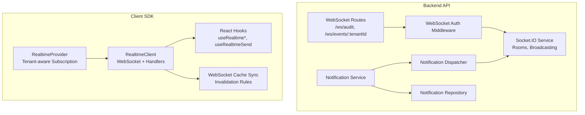
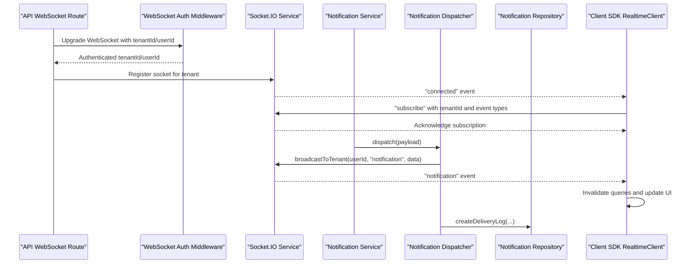
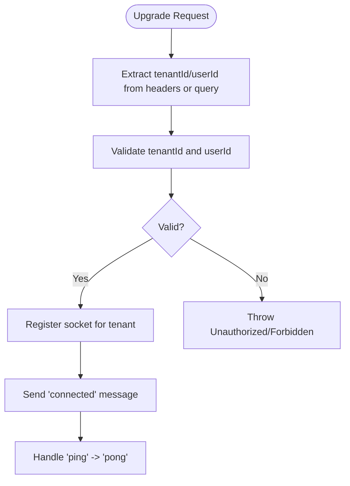
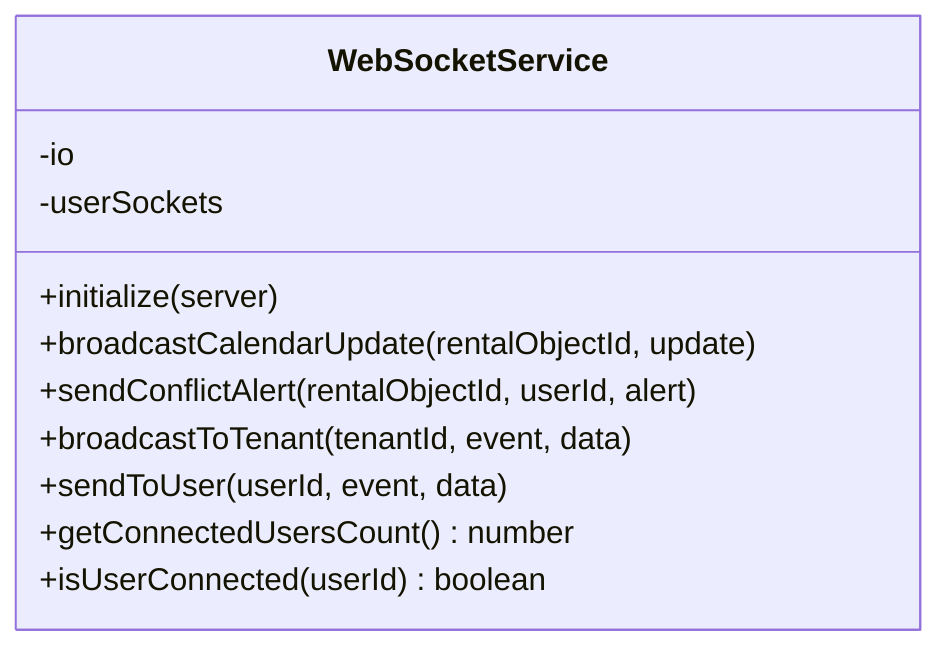
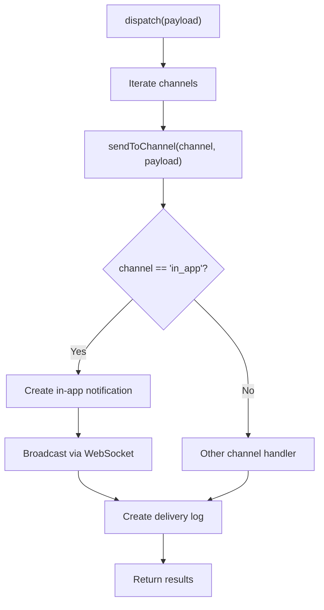
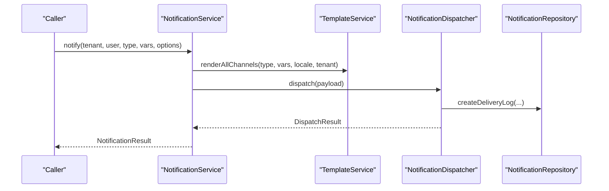
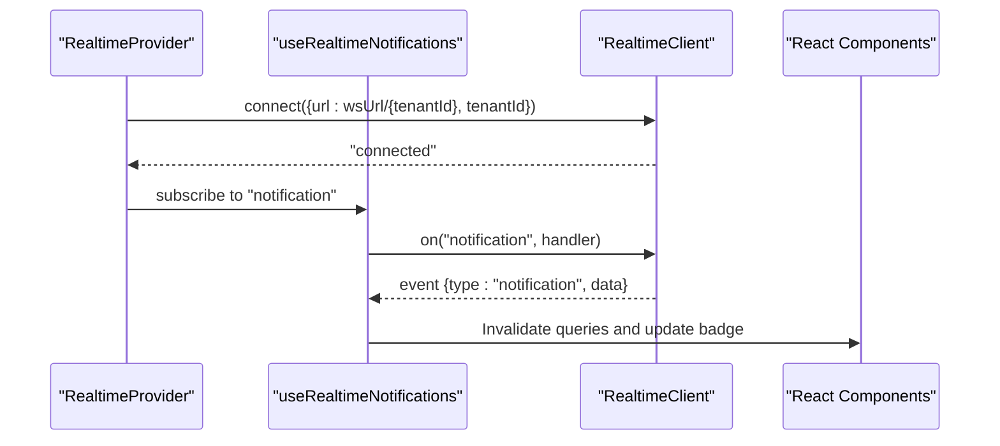
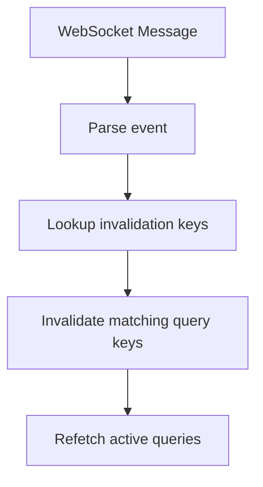
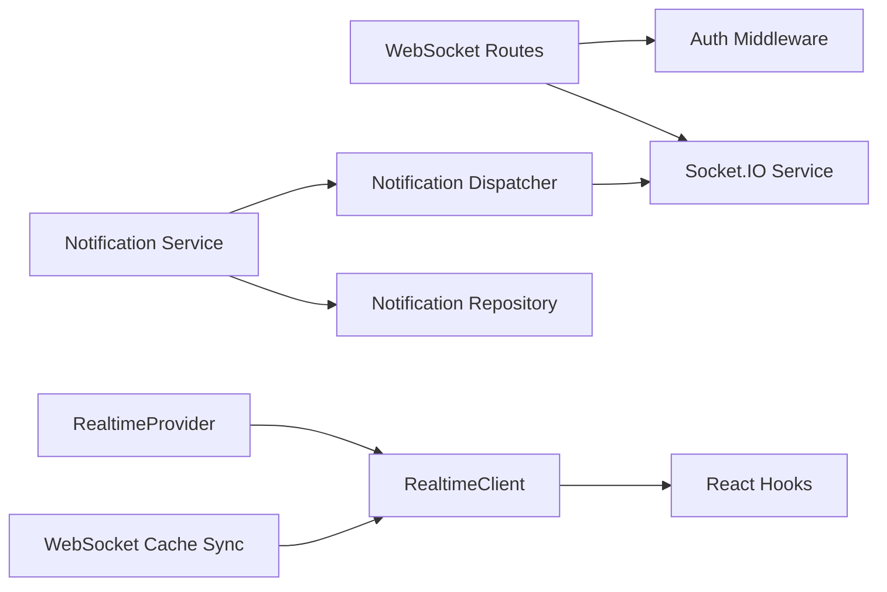

# Real-time Notifications

<cite>
**Referenced Files in This Document**
- [websocket.controller.ts](file://apps/api/src/modules/websocket/websocket.controller.ts)
- [websocket.middleware.ts](file://apps/api/src/modules/websocket/websocket.middleware.ts)
- [websocket.service.ts](file://apps/api/src/services/websocket.service.ts)
- [index.ts](file://packages/client-sdk/src/realtime/index.ts)
- [use-realtime.ts](file://packages/client-sdk/src/hooks/use-realtime.ts)
- [RealtimeProvider.tsx](file://packages/client-sdk/src/providers/RealtimeProvider.tsx)
- [ws-cache-sync.ts](file://packages/client-sdk/src/realtime/ws-cache-sync.ts)
- [notification.dispatcher.ts](file://apps/api/src/modules/notification-system/notification.dispatcher.ts)
- [notification.service.ts](file://apps/api/src/modules/notification-system/notification.service.ts)
- [notification.repository.ts](file://apps/api/src/modules/notification-system/notification.repository.ts)
</cite>

## Table of Contents
1. [Introduction](#introduction)
2. [Project Structure](#project-structure)
3. [Core Components](#core-components)
4. [Architecture Overview](#architecture-overview)
5. [Detailed Component Analysis](#detailed-component-analysis)
6. [Dependency Analysis](#dependency-analysis)
7. [Performance Considerations](#performance-considerations)
8. [Troubleshooting Guide](#troubleshooting-guide)
9. [Conclusion](#conclusion)

## Introduction
This document explains the real-time notification system built on WebSocket technology. It covers the notification dispatcher, tenant-specific event routing, real-time event broadcasting, and client-side handling. It also documents the WebSocket event format, retry mechanisms for failed deliveries, and integration with the broader notification system.

## Project Structure
The real-time notification system spans backend WebSocket routes and services, a notification pipeline, and a client SDK with React hooks and providers.

**Diagram sources**
- [websocket.controller.ts](file://apps/api/src/modules/websocket/websocket.controller.ts#L10-L60)
- [websocket.middleware.ts](file://apps/api/src/modules/websocket/websocket.middleware.ts#L17-L53)
- [websocket.service.ts](file://apps/api/src/services/websocket.service.ts#L36-L177)
- [notification.service.ts](file://apps/api/src/modules/notification-system/notification.service.ts#L33-L50)
- [notification.dispatcher.ts](file://apps/api/src/modules/notification-system/notification.dispatcher.ts#L40-L61)
- [notification.repository.ts](file://apps/api/src/modules/notification-system/notification.repository.ts#L26-L482)
- [index.ts](file://packages/client-sdk/src/realtime/index.ts#L28-L279)
- [use-realtime.ts](file://packages/client-sdk/src/hooks/use-realtime.ts#L17-L41)
- [RealtimeProvider.tsx](file://packages/client-sdk/src/providers/RealtimeProvider.tsx#L47-L90)
- [ws-cache-sync.ts](file://packages/client-sdk/src/realtime/ws-cache-sync.ts#L152-L219)

**Section sources**
- [websocket.controller.ts](file://apps/api/src/modules/websocket/websocket.controller.ts#L10-L60)
- [websocket.middleware.ts](file://apps/api/src/modules/websocket/websocket.middleware.ts#L17-L53)
- [websocket.service.ts](file://apps/api/src/services/websocket.service.ts#L36-L177)
- [notification.service.ts](file://apps/api/src/modules/notification-system/notification.service.ts#L33-L50)
- [notification.dispatcher.ts](file://apps/api/src/modules/notification-system/notification.dispatcher.ts#L40-L61)
- [notification.repository.ts](file://apps/api/src/modules/notification-system/notification.repository.ts#L26-L482)
- [index.ts](file://packages/client-sdk/src/realtime/index.ts#L28-L279)
- [use-realtime.ts](file://packages/client-sdk/src/hooks/use-realtime.ts#L17-L41)
- [RealtimeProvider.tsx](file://packages/client-sdk/src/providers/RealtimeProvider.tsx#L47-L90)
- [ws-cache-sync.ts](file://packages/client-sdk/src/realtime/ws-cache-sync.ts#L152-L219)

## Core Components
- Backend WebSocket routes and authentication:
  - Audit stream and tenant-specific event streams.
  - Authentication via headers or query parameters; tenant scope validation.
- Socket.IO service:
  - Room-based broadcasting for tenants and users.
  - Event handlers for calendar, conflicts, and user/tenant targeting.
- Notification pipeline:
  - Dispatcher routes notifications to channels and sets WebSocket broadcast callback for in-app notifications.
  - Service orchestrates templating, scheduling, queue processing, and delivery logs.
  - Repository persists notifications, templates, delivery logs, and queue items.
- Client SDK:
  - RealtimeClient manages WebSocket lifecycle, handlers, reconnection, and event emission.
  - React hooks provide subscription and cache invalidation for notifications and other domains.
  - Provider wires tenant-aware subscriptions and connection.
  - Cache sync enforces strict invalidation rules per event type.

**Section sources**
- [websocket.controller.ts](file://apps/api/src/modules/websocket/websocket.controller.ts#L14-L60)
- [websocket.middleware.ts](file://apps/api/src/modules/websocket/websocket.middleware.ts#L17-L82)
- [websocket.service.ts](file://apps/api/src/services/websocket.service.ts#L36-L177)
- [notification.dispatcher.ts](file://apps/api/src/modules/notification-system/notification.dispatcher.ts#L40-L119)
- [notification.service.ts](file://apps/api/src/modules/notification-system/notification.service.ts#L33-L194)
- [notification.repository.ts](file://apps/api/src/modules/notification-system/notification.repository.ts#L26-L482)
- [index.ts](file://packages/client-sdk/src/realtime/index.ts#L28-L279)
- [use-realtime.ts](file://packages/client-sdk/src/hooks/use-realtime.ts#L140-L156)
- [RealtimeProvider.tsx](file://packages/client-sdk/src/providers/RealtimeProvider.tsx#L47-L90)
- [ws-cache-sync.ts](file://packages/client-sdk/src/realtime/ws-cache-sync.ts#L152-L219)

## Architecture Overview
The system delivers real-time notifications via two complementary paths:
- WebSocket-based in-app notifications for live UI updates.
- Traditional notification channels (email, SMS, push) with delivery logs and retry.

**Diagram sources**
- [websocket.controller.ts](file://apps/api/src/modules/websocket/websocket.controller.ts#L14-L60)
- [websocket.middleware.ts](file://apps/api/src/modules/websocket/websocket.middleware.ts#L17-L82)
- [websocket.service.ts](file://apps/api/src/services/websocket.service.ts#L36-L177)
- [notification.service.ts](file://apps/api/src/modules/notification-system/notification.service.ts#L33-L119)
- [notification.dispatcher.ts](file://apps/api/src/modules/notification-system/notification.dispatcher.ts#L40-L119)
- [notification.repository.ts](file://apps/api/src/modules/notification-system/notification.repository.ts#L244-L321)
- [index.ts](file://packages/client-sdk/src/realtime/index.ts#L39-L101)

## Detailed Component Analysis

### Backend WebSocket Routing and Authentication
- Routes:
  - Audit stream: unauthenticated welcome and ping/pong.
  - Tenant-specific events: authenticated registration and tenant-scoped welcome.
- Authentication:
  - Supports headers (X-Tenant-Id, X-User-Id) and query parameters (tenantId, userId).
  - Throws unauthorized errors for missing credentials; tenant scope enforced via middleware.

**Diagram sources**
- [websocket.controller.ts](file://apps/api/src/modules/websocket/websocket.controller.ts#L14-L41)
- [websocket.middleware.ts](file://apps/api/src/modules/websocket/websocket.middleware.ts#L17-L53)

**Section sources**
- [websocket.controller.ts](file://apps/api/src/modules/websocket/websocket.controller.ts#L14-L60)
- [websocket.middleware.ts](file://apps/api/src/modules/websocket/websocket.middleware.ts#L17-L82)

### Socket.IO Service: Rooms and Broadcasting
- Rooms:
  - user:{userId}, tenant:{tenantId}, calendar:{id}, conflicts:{id}.
- Events:
  - Calendar updates, conflict alerts, tenant broadcasts, user-specific sends.
- Lifecycle:
  - On authenticate: join rooms and emit authenticated.
  - On disconnect: remove socket from user mappings.

**Diagram sources**
- [websocket.service.ts](file://apps/api/src/services/websocket.service.ts#L36-L177)

**Section sources**
- [websocket.service.ts](file://apps/api/src/services/websocket.service.ts#L36-L177)

### Notification Dispatcher and Real-time In-App Delivery
- Responsibilities:
  - Dispatch to channels: email, SMS, in-app, push.
  - For in-app: persist notification and broadcast via WebSocket.
  - Create delivery logs for each channel.
  - Expose available channels and rate limits.
- Real-time integration:
  - Accepts a broadcast callback to send "notification" events to the WebSocket service.

**Diagram sources**
- [notification.dispatcher.ts](file://apps/api/src/modules/notification-system/notification.dispatcher.ts#L66-L119)
- [websocket.service.ts](file://apps/api/src/services/websocket.service.ts#L148-L162)

**Section sources**
- [notification.dispatcher.ts](file://apps/api/src/modules/notification-system/notification.dispatcher.ts#L40-L119)
- [websocket.service.ts](file://apps/api/src/services/websocket.service.ts#L148-L162)

### Notification Service: Orchestrator and Queue
- Responsibilities:
  - Render templates across channels.
  - Select channels and build dispatch payload.
  - Schedule notifications and process queue with retries.
  - Manage user notifications, read/dismiss/delete, and statistics.
- Integration:
  - Sets WebSocket broadcast callback on the dispatcher.

**Diagram sources**
- [notification.service.ts](file://apps/api/src/modules/notification-system/notification.service.ts#L59-L125)
- [notification.dispatcher.ts](file://apps/api/src/modules/notification-system/notification.dispatcher.ts#L66-L119)
- [notification.repository.ts](file://apps/api/src/modules/notification-system/notification.repository.ts#L244-L321)

**Section sources**
- [notification.service.ts](file://apps/api/src/modules/notification-system/notification.service.ts#L33-L194)
- [notification.repository.ts](file://apps/api/src/modules/notification-system/notification.repository.ts#L26-L482)

### Client SDK: RealtimeClient and React Hooks
- RealtimeClient:
  - Connects to tenant-specific WebSocket, handles ping/pong, emits events, supports reconnection.
  - Emits "notification" events to subscribed handlers.
- React Hooks:
  - useRealtimeNotifications: subscribes to notification events and invalidates queries.
  - useRealtimeConnection: manages connection lifecycle and tenantId.
  - useRealtimeSend: exposes send/ping utilities.
- Provider:
  - Builds tenant-aware WebSocket URL and subscribes to multiple event categories.

**Diagram sources**
- [RealtimeProvider.tsx](file://packages/client-sdk/src/providers/RealtimeProvider.tsx#L47-L90)
- [use-realtime.ts](file://packages/client-sdk/src/hooks/use-realtime.ts#L140-L156)
- [index.ts](file://packages/client-sdk/src/realtime/index.ts#L39-L101)

**Section sources**
- [index.ts](file://packages/client-sdk/src/realtime/index.ts#L28-L279)
- [use-realtime.ts](file://packages/client-sdk/src/hooks/use-realtime.ts#L140-L156)
- [RealtimeProvider.tsx](file://packages/client-sdk/src/providers/RealtimeProvider.tsx#L47-L90)

### WebSocket Cache Sync (Risk Mitigation)
- Ensures WebSocket events trigger the same cache invalidation rules as mutations.
- Maintains a strict mapping from event types to query keys and invalidates them automatically.

**Diagram sources**
- [ws-cache-sync.ts](file://packages/client-sdk/src/realtime/ws-cache-sync.ts#L152-L188)

**Section sources**
- [ws-cache-sync.ts](file://packages/client-sdk/src/realtime/ws-cache-sync.ts#L152-L219)

## Dependency Analysis
- Backend:
  - WebSocket routes depend on authentication middleware and the Socket.IO service.
  - Notification service depends on the dispatcher and repository.
  - Dispatcher depends on channel handlers and repositories for persistence/logging.
- Frontend:
  - RealtimeClient depends on WebSocket API and event handlers.
  - React hooks depend on RealtimeClient and React Query for cache invalidation.
  - Provider composes connection and subscription logic.

**Diagram sources**
- [websocket.controller.ts](file://apps/api/src/modules/websocket/websocket.controller.ts#L14-L60)
- [websocket.middleware.ts](file://apps/api/src/modules/websocket/websocket.middleware.ts#L17-L82)
- [websocket.service.ts](file://apps/api/src/services/websocket.service.ts#L36-L177)
- [notification.service.ts](file://apps/api/src/modules/notification-system/notification.service.ts#L33-L119)
- [notification.dispatcher.ts](file://apps/api/src/modules/notification-system/notification.dispatcher.ts#L40-L119)
- [notification.repository.ts](file://apps/api/src/modules/notification-system/notification.repository.ts#L26-L482)
- [index.ts](file://packages/client-sdk/src/realtime/index.ts#L28-L279)
- [use-realtime.ts](file://packages/client-sdk/src/hooks/use-realtime.ts#L140-L156)
- [RealtimeProvider.tsx](file://packages/client-sdk/src/providers/RealtimeProvider.tsx#L47-L90)
- [ws-cache-sync.ts](file://packages/client-sdk/src/realtime/ws-cache-sync.ts#L152-L219)

**Section sources**
- [websocket.controller.ts](file://apps/api/src/modules/websocket/websocket.controller.ts#L14-L60)
- [websocket.middleware.ts](file://apps/api/src/modules/websocket/websocket.middleware.ts#L17-L82)
- [websocket.service.ts](file://apps/api/src/services/websocket.service.ts#L36-L177)
- [notification.service.ts](file://apps/api/src/modules/notification-system/notification.service.ts#L33-L119)
- [notification.dispatcher.ts](file://apps/api/src/modules/notification-system/notification.dispatcher.ts#L40-L119)
- [notification.repository.ts](file://apps/api/src/modules/notification-system/notification.repository.ts#L26-L482)
- [index.ts](file://packages/client-sdk/src/realtime/index.ts#L28-L279)
- [use-realtime.ts](file://packages/client-sdk/src/hooks/use-realtime.ts#L140-L156)
- [RealtimeProvider.tsx](file://packages/client-sdk/src/providers/RealtimeProvider.tsx#L47-L90)
- [ws-cache-sync.ts](file://packages/client-sdk/src/realtime/ws-cache-sync.ts#L152-L219)

## Performance Considerations
- Connection lifecycle:
  - RealtimeClient supports configurable auto-reconnect with capped attempts and intervals.
  - Socket.IO rooms minimize fan-out by targeting specific rooms.
- Throughput:
  - Tenant-specific WebSocket endpoints reduce unnecessary broadcasts.
  - Delivery logs and queue processing decouple immediate delivery from background processing.
- Caching:
  - Cache invalidation rules ensure UI consistency without redundant polling.

[No sources needed since this section provides general guidance]

## Troubleshooting Guide
- Authentication failures:
  - Missing or invalid tenantId/userId cause unauthorized/forbidden responses; verify headers or query parameters.
- Connection drops:
  - RealtimeClient attempts reconnection up to configured attempts; inspect debug logs and network conditions.
- No notifications received:
  - Ensure tenantId is included in the WebSocket URL and subscription message is accepted by the server.
  - Confirm the "notification" event handler is registered and cache invalidation is triggered.
- Delivery failures:
  - Check delivery logs for channel-specific errors and retry counts; repository marks items as failed after max retries.

**Section sources**
- [websocket.middleware.ts](file://apps/api/src/modules/websocket/websocket.middleware.ts#L44-L52)
- [index.ts](file://packages/client-sdk/src/realtime/index.ts#L85-L101)
- [notification.repository.ts](file://apps/api/src/modules/notification-system/notification.repository.ts#L367-L384)

## Conclusion
The real-time notification system combines WebSocket-based in-app delivery with a robust notification pipeline supporting multiple channels, scheduling, retries, and comprehensive delivery tracking. The client SDK provides ergonomic React hooks and cache synchronization to maintain UI consistency and responsiveness.