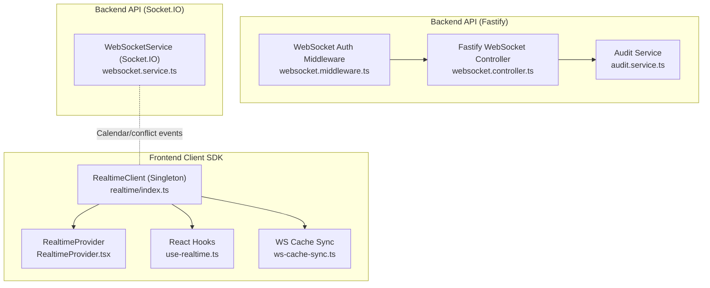
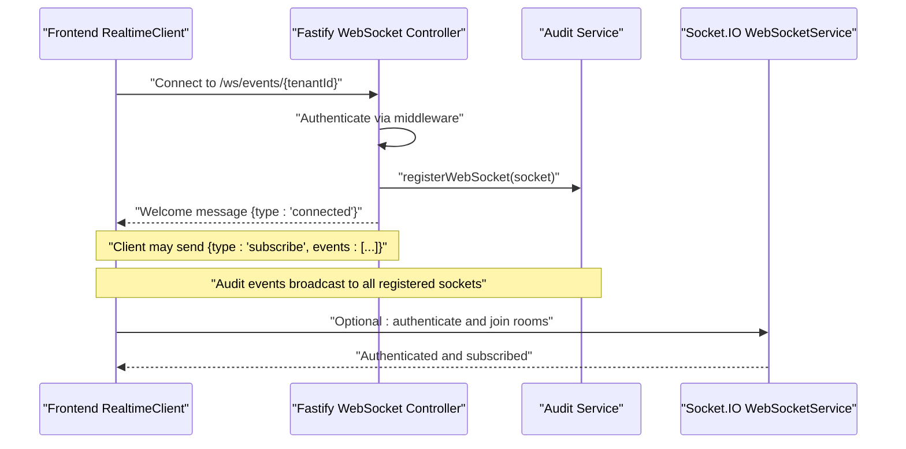
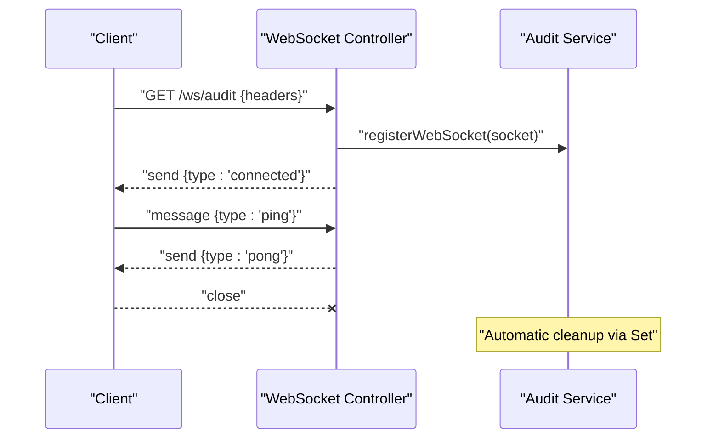
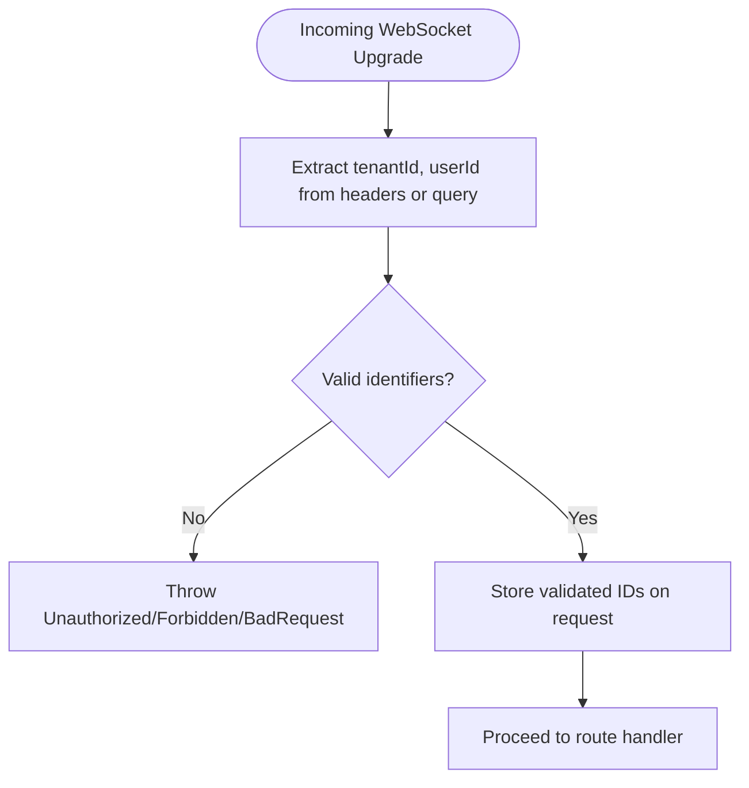
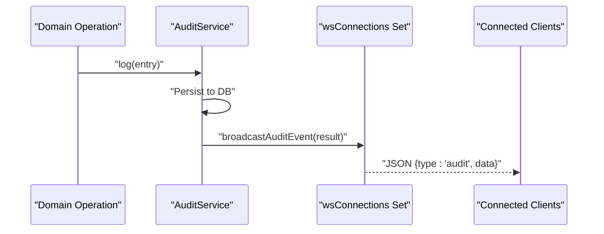
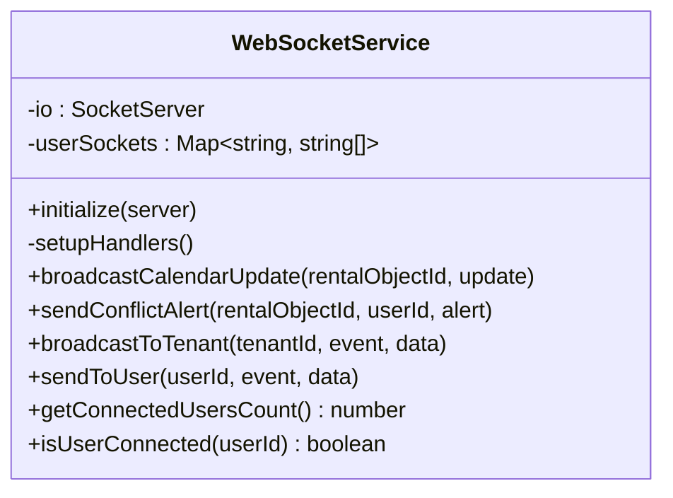
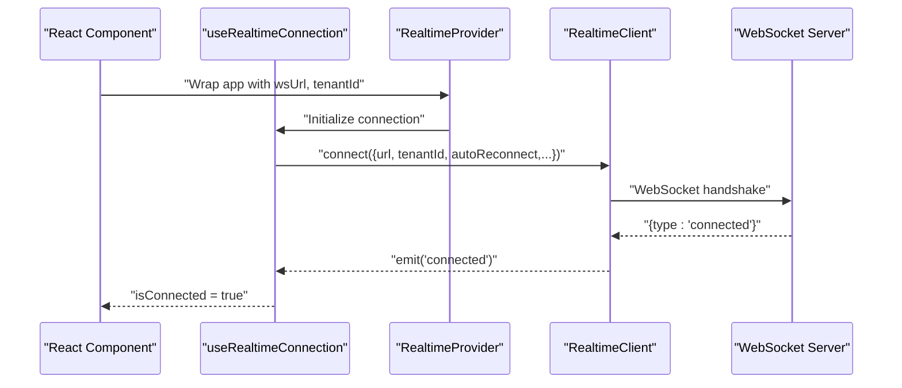
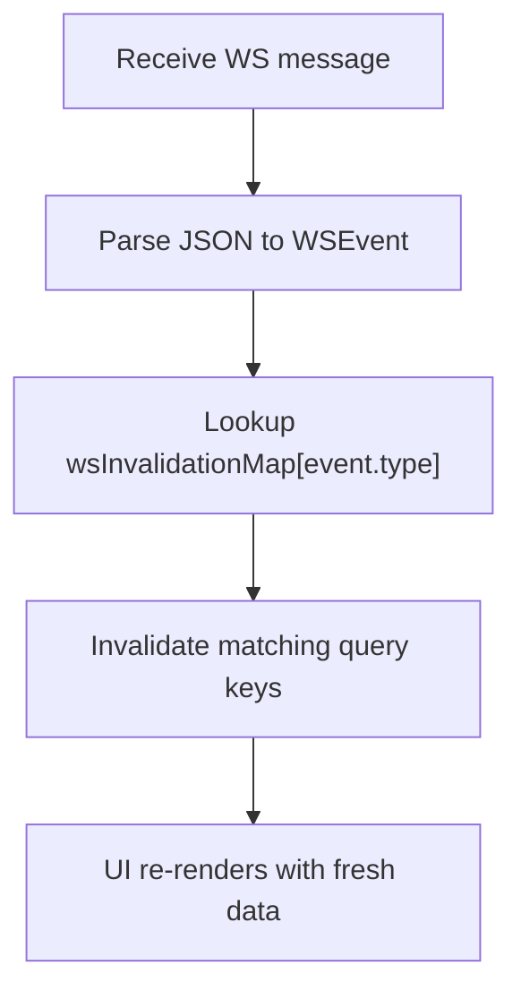
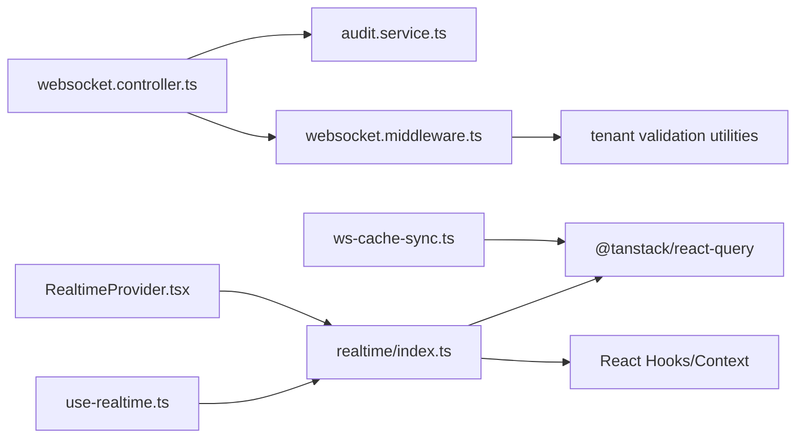

# WebSocket Architecture

<cite>
**Referenced Files in This Document**
- [websocket.controller.ts](file://apps/api/src/modules/websocket/websocket.controller.ts)
- [websocket.middleware.ts](file://apps/api/src/modules/websocket/websocket.middleware.ts)
- [websocket.service.ts](file://apps/api/src/services/websocket.service.ts)
- [audit.service.ts](file://apps/api/src/core/audit/audit.service.ts)
- [index.ts](file://packages/client-sdk/src/realtime/index.ts)
- [use-realtime.ts](file://packages/client-sdk/src/hooks/use-realtime.ts)
- [RealtimeProvider.tsx](file://packages/client-sdk/src/providers/RealtimeProvider.tsx)
- [ws-cache-sync.ts](file://packages/client-sdk/src/realtime/ws-cache-sync.ts)
- [websocket-realtime.md](file://docs/guides/websocket-realtime.md)
- [websocket-latency-performance.test.ts](file://apps/api/tests/integration/websocket-latency-performance.test.ts)
- [websocket-auth.test.ts](file://apps/api/tests/security/websocket-auth.test.ts)
</cite>

## Table of Contents
1. [Introduction](#introduction)
2. [Project Structure](#project-structure)
3. [Core Components](#core-components)
4. [Architecture Overview](#architecture-overview)
5. [Detailed Component Analysis](#detailed-component-analysis)
6. [Dependency Analysis](#dependency-analysis)
7. [Performance Considerations](#performance-considerations)
8. [Troubleshooting Guide](#troubleshooting-guide)
9. [Conclusion](#conclusion)
10. [Appendices](#appendices)

## Introduction
This document describes the WebSocket real-time event streaming system powering live updates across tenants. It covers the WebSocket controller implementation, connection registration, tenant-specific routing, middleware integration, connection lifecycle management, automatic cleanup, audit event broadcasting, message formats, and connection state management. It also includes examples for establishing connections, handling disconnections, implementing custom event handlers, and outlines security considerations, rate limiting, and connection pooling strategies.

## Project Structure
The WebSocket system spans backend and frontend packages:
- Backend Fastify routes expose two WebSocket endpoints: a global audit stream and tenant-scoped event streams.
- A dedicated audit service maintains a set of WebSocket connections and broadcasts audit events to all connected clients.
- A separate Socket.IO-based service provides broader real-time features (calendar updates, conflict alerts, tenant/user scoping).
- Frontend client SDK provides a singleton WebSocket client, React hooks, and cache synchronization with React Query.

**Diagram sources**
- [websocket.controller.ts](file://apps/api/src/modules/websocket/websocket.controller.ts#L10-L60)
- [websocket.middleware.ts](file://apps/api/src/modules/websocket/websocket.middleware.ts#L17-L53)
- [audit.service.ts](file://apps/api/src/core/audit/audit.service.ts#L50-L72)
- [websocket.service.ts](file://apps/api/src/services/websocket.service.ts#L36-L180)
- [index.ts](file://packages/client-sdk/src/realtime/index.ts#L28-L279)
- [RealtimeProvider.tsx](file://packages/client-sdk/src/providers/RealtimeProvider.tsx#L47-L90)
- [use-realtime.ts](file://packages/client-sdk/src/hooks/use-realtime.ts#L17-L41)
- [ws-cache-sync.ts](file://packages/client-sdk/src/realtime/ws-cache-sync.ts#L152-L218)

**Section sources**
- [websocket.controller.ts](file://apps/api/src/modules/websocket/websocket.controller.ts#L10-L60)
- [websocket.middleware.ts](file://apps/api/src/modules/websocket/websocket.middleware.ts#L17-L53)
- [audit.service.ts](file://apps/api/src/core/audit/audit.service.ts#L50-L72)
- [websocket.service.ts](file://apps/api/src/services/websocket.service.ts#L36-L180)
- [index.ts](file://packages/client-sdk/src/realtime/index.ts#L28-L279)
- [RealtimeProvider.tsx](file://packages/client-sdk/src/providers/RealtimeProvider.tsx#L47-L90)
- [use-realtime.ts](file://packages/client-sdk/src/hooks/use-realtime.ts#L17-L41)
- [ws-cache-sync.ts](file://packages/client-sdk/src/realtime/ws-cache-sync.ts#L152-L218)

## Core Components
- Fastify WebSocket Controller
  - Registers the @fastify/websocket plugin and exposes two WebSocket routes:
    - Audit stream: GET /ws/audit
    - Tenant-scoped events: GET /ws/events/:tenantId
  - On connection, registers the socket with the audit service and sends a welcome message. Supports ping/pong for keepalive.
- WebSocket Authentication Middleware
  - Validates tenant and user identifiers from headers or query parameters.
  - Enforces tenant scope for tenant-specific routes.
- Audit Service
  - Maintains a set of WebSocket connections and broadcasts audit events to all connected clients.
  - Provides convenience methods for booking event broadcasting.
- Socket.IO WebSocketService
  - Manages Socket.IO server, room-based subscriptions, and targeted broadcasts to users/tenants.
  - Handles authentication, subscription, and cleanup on disconnect.
- Frontend RealtimeClient
  - Singleton WebSocket client with connection lifecycle, reconnection, event handlers, and ping support.
  - Emits transport-level events to React components and integrates with React Query cache invalidation.
- React Hooks and Provider
  - useRealtimeConnection, useRealtimeBookings, useRealtimeNotifications, etc.
  - RealtimeProvider wires the client, tenantId, and subscribes to domain events.
- WS Cache Sync
  - Maps business-level event types to React Query keys and invalidates them automatically.

**Section sources**
- [websocket.controller.ts](file://apps/api/src/modules/websocket/websocket.controller.ts#L10-L60)
- [websocket.middleware.ts](file://apps/api/src/modules/websocket/websocket.middleware.ts#L17-L53)
- [audit.service.ts](file://apps/api/src/core/audit/audit.service.ts#L50-L72)
- [websocket.service.ts](file://apps/api/src/services/websocket.service.ts#L36-L180)
- [index.ts](file://packages/client-sdk/src/realtime/index.ts#L28-L279)
- [use-realtime.ts](file://packages/client-sdk/src/hooks/use-realtime.ts#L17-L41)
- [RealtimeProvider.tsx](file://packages/client-sdk/src/providers/RealtimeProvider.tsx#L47-L90)
- [ws-cache-sync.ts](file://packages/client-sdk/src/realtime/ws-cache-sync.ts#L152-L218)

## Architecture Overview
The system provides two complementary real-time pathways:
- Fastify WebSocket (audit and tenant events)
  - Stateless, minimal, and focused on audit and tenant-scoped event broadcasting.
  - Uses a simple connection registry and JSON message format.
- Socket.IO WebSocketService
  - Richer real-time features: calendar updates, conflict alerts, user/tenant room subscriptions, and targeted messaging.

**Diagram sources**
- [websocket.controller.ts](file://apps/api/src/modules/websocket/websocket.controller.ts#L14-L59)
- [websocket.middleware.ts](file://apps/api/src/modules/websocket/websocket.middleware.ts#L17-L53)
- [audit.service.ts](file://apps/api/src/core/audit/audit.service.ts#L50-L72)
- [websocket.service.ts](file://apps/api/src/services/websocket.service.ts#L36-L119)
- [index.ts](file://packages/client-sdk/src/realtime/index.ts#L39-L101)

## Detailed Component Analysis

### Fastify WebSocket Controller
- Route registration
  - Registers @fastify/websocket and defines:
    - GET /ws/audit: audit event stream
    - GET /ws/events/:tenantId: tenant-scoped event stream
- Connection handling
  - Calls registerWebSocket(socket) to add to the audit broadcast registry.
  - Sends a welcome message upon successful connection.
  - Listens for ping messages and responds with pong.
  - Closes gracefully; cleanup is handled by the audit service’s connection set.

**Diagram sources**
- [websocket.controller.ts](file://apps/api/src/modules/websocket/websocket.controller.ts#L14-L41)
- [audit.service.ts](file://apps/api/src/core/audit/audit.service.ts#L50-L72)

**Section sources**
- [websocket.controller.ts](file://apps/api/src/modules/websocket/websocket.controller.ts#L10-L60)
- [audit.service.ts](file://apps/api/src/core/audit/audit.service.ts#L50-L72)

### WebSocket Authentication Middleware
- Credential extraction
  - Attempts to extract tenantId and userId from headers first, then falls back to query parameters.
- Validation
  - Validates identifiers using tenant utilities; throws appropriate errors for missing or invalid values.
- Scope enforcement
  - validateTenantScope ensures authenticated tenant matches the requested tenant parameter.

**Diagram sources**
- [websocket.middleware.ts](file://apps/api/src/modules/websocket/websocket.middleware.ts#L17-L53)

**Section sources**
- [websocket.middleware.ts](file://apps/api/src/modules/websocket/websocket.middleware.ts#L17-L82)

### Audit Service and Audit Event Broadcasting
- Connection registry
  - Maintains a Set of WebSocket connections and removes them on close.
- Broadcast mechanism
  - Serializes audit events and sends JSON messages to all connected clients.
- Booking event broadcasting
  - Provides a convenience function to broadcast booking events with standardized payload.

**Diagram sources**
- [audit.service.ts](file://apps/api/src/core/audit/audit.service.ts#L50-L72)
- [audit.service.ts](file://apps/api/src/core/audit/audit.service.ts#L84-L120)

**Section sources**
- [audit.service.ts](file://apps/api/src/core/audit/audit.service.ts#L50-L120)
- [audit.service.ts](file://apps/api/src/core/audit/audit.service.ts#L247-L276)

### Socket.IO WebSocketService
- Initialization
  - Creates a Socket.IO server with CORS and path configuration.
- Event handlers
  - authenticate: stores socket by user and joins user/tenant rooms.
  - subscribe/unsubscribe: manages calendar and conflict room subscriptions.
  - disconnect: cleans up user socket mappings.
- Broadcasting
  - broadcastCalendarUpdate, sendConflictAlert, broadcastToTenant, sendToUser.

**Diagram sources**
- [websocket.service.ts](file://apps/api/src/services/websocket.service.ts#L36-L180)

**Section sources**
- [websocket.service.ts](file://apps/api/src/services/websocket.service.ts#L36-L180)

### Frontend RealtimeClient and React Integration
- RealtimeClient
  - Singleton client with connect/disconnect, event handlers, ping, and reconnection logic.
  - Emits transport-level events (audit, booking, message, notification, monitoring, connected, pong).
- React Hooks
  - useRealtimeConnection: establishes connection with optional reconnection settings.
  - useRealtimeBookings, useRealtimeNotifications, etc.: subscribe to domain events and invalidate React Query caches.
- Provider
  - RealtimeProvider wires wsUrl, tenantId, and subscribes to selected event categories.

**Diagram sources**
- [RealtimeProvider.tsx](file://packages/client-sdk/src/providers/RealtimeProvider.tsx#L47-L90)
- [use-realtime.ts](file://packages/client-sdk/src/hooks/use-realtime.ts#L17-L41)
- [index.ts](file://packages/client-sdk/src/realtime/index.ts#L39-L101)

**Section sources**
- [index.ts](file://packages/client-sdk/src/realtime/index.ts#L28-L279)
- [use-realtime.ts](file://packages/client-sdk/src/hooks/use-realtime.ts#L17-L41)
- [RealtimeProvider.tsx](file://packages/client-sdk/src/providers/RealtimeProvider.tsx#L47-L90)

### WS Cache Sync and Business-Level Events
- Event mapping
  - wsInvalidationMap defines which React Query keys to invalidate per business-level event type.
- Cache sync handler
  - Parses incoming events and invalidates mapped query keys.
- React integration hook
  - createUseWebSocketCacheSync initializes and connects the cache sync.

**Diagram sources**
- [ws-cache-sync.ts](file://packages/client-sdk/src/realtime/ws-cache-sync.ts#L152-L188)

**Section sources**
- [ws-cache-sync.ts](file://packages/client-sdk/src/realtime/ws-cache-sync.ts#L152-L218)

## Dependency Analysis
- Backend dependencies
  - Fastify WebSocket Controller depends on:
    - @fastify/websocket
    - Audit Service for connection registration and broadcasting
    - Tenant validation utilities for authentication middleware
- Frontend dependencies
  - RealtimeClient depends on:
    - React Query for cache invalidation
    - React for hooks and context
    - WebSocket API for transport

**Diagram sources**
- [websocket.controller.ts](file://apps/api/src/modules/websocket/websocket.controller.ts#L5-L8)
- [websocket.middleware.ts](file://apps/api/src/modules/websocket/websocket.middleware.ts#L6-L7)
- [audit.service.ts](file://apps/api/src/core/audit/audit.service.ts#L50-L72)
- [index.ts](file://packages/client-sdk/src/realtime/index.ts#L28-L279)
- [use-realtime.ts](file://packages/client-sdk/src/hooks/use-realtime.ts#L6-L12)
- [RealtimeProvider.tsx](file://packages/client-sdk/src/providers/RealtimeProvider.tsx#L6-L13)
- [ws-cache-sync.ts](file://packages/client-sdk/src/realtime/ws-cache-sync.ts#L8-L9)

**Section sources**
- [websocket.controller.ts](file://apps/api/src/modules/websocket/websocket.controller.ts#L5-L8)
- [websocket.middleware.ts](file://apps/api/src/modules/websocket/websocket.middleware.ts#L6-L7)
- [audit.service.ts](file://apps/api/src/core/audit/audit.service.ts#L50-L72)
- [index.ts](file://packages/client-sdk/src/realtime/index.ts#L28-L279)
- [use-realtime.ts](file://packages/client-sdk/src/hooks/use-realtime.ts#L6-L12)
- [RealtimeProvider.tsx](file://packages/client-sdk/src/providers/RealtimeProvider.tsx#L6-L13)
- [ws-cache-sync.ts](file://packages/client-sdk/src/realtime/ws-cache-sync.ts#L8-L9)

## Performance Considerations
- Latency targets
  - Concurrency tests demonstrate sub-second latency for single and multiple clients.
- Reconnection behavior
  - Frontend client supports fixed-interval reconnection with configurable attempts.
- Scalability
  - Socket.IO rooms and targeted broadcasting reduce unnecessary fan-out compared to naive broadcast.
- Recommendations
  - Prefer room-based subscriptions to minimize message volume.
  - Use cache invalidation mapping to avoid redundant data fetches.
  - Monitor connection counts and consider load balancing for high-tenant workloads.

**Section sources**
- [websocket-latency-performance.test.ts](file://apps/api/tests/integration/websocket-latency-performance.test.ts#L146-L211)
- [websocket-latency-performance.test.ts](file://apps/api/tests/integration/websocket-latency-performance.test.ts#L213-L333)
- [websocket-latency-performance.test.ts](file://apps/api/tests/integration/websocket-latency-performance.test.ts#L335-L470)
- [websocket-latency-performance.test.ts](file://apps/api/tests/integration/websocket-latency-performance.test.ts#L472-L578)
- [index.ts](file://packages/client-sdk/src/realtime/index.ts#L258-L275)

## Troubleshooting Guide
- Authentication failures
  - Ensure X-Tenant-Id and X-User-Id headers are present and valid; tests verify rejection for missing/invalid credentials and enforcement of tenant scope.
- Connection stability
  - The client sends a ping message and expects a pong response; tests validate this behavior.
- Reconnection issues
  - Verify autoReconnect settings and maxReconnectAttempts; the client resets counters on successful reconnection.
- Cross-tenant isolation
  - Tenant mismatch leads to forbidden responses; ensure authenticated tenant matches the URL parameter.

**Section sources**
- [websocket-auth.test.ts](file://apps/api/tests/security/websocket-auth.test.ts#L89-L201)
- [websocket-auth.test.ts](file://apps/api/tests/security/websocket-auth.test.ts#L203-L289)
- [websocket-auth.test.ts](file://apps/api/tests/security/websocket-auth.test.ts#L291-L321)
- [websocket-auth.test.ts](file://apps/api/tests/security/websocket-auth.test.ts#L355-L407)
- [websocket-auth.test.ts](file://apps/api/tests/security/websocket-auth.test.ts#L409-L431)
- [index.ts](file://packages/client-sdk/src/realtime/index.ts#L85-L92)

## Conclusion
The WebSocket architecture combines a lightweight Fastify WebSocket layer for audit and tenant-scoped events with a richer Socket.IO service for calendar and conflict updates. The frontend provides a robust singleton client, React hooks, and cache synchronization to ensure consistent, low-latency updates. Strong tenant isolation, graceful reconnection, and clear message formats form the backbone of a secure and scalable real-time system.

## Appendices

### Message Formats
- Transport-level events (RealtimeClient)
  - { type: 'connected' | 'pong' | 'audit' | 'booking' | 'rentalObject' | 'message' | 'notification' | 'monitoring', data?, timestamp?, tenantId?, message? }
- Business-level events (ws-cache-sync)
  - { type: WSEventType, payload, tenantId, timestamp, correlationId? }
- Subscription message
  - { type: 'subscribe', tenantId, events: string[] }

**Section sources**
- [index.ts](file://packages/client-sdk/src/realtime/index.ts#L8-L14)
- [ws-cache-sync.ts](file://packages/client-sdk/src/realtime/ws-cache-sync.ts#L42-L48)
- [websocket.controller.ts](file://apps/api/src/modules/websocket/websocket.controller.ts#L27-L36)

### Connection Lifecycle Examples
- Establishing a connection
  - Use RealtimeProvider with wsUrl and tenantId; the provider calls useRealtimeConnection internally.
  - Alternatively, call RealtimeClient.connect with url and tenantId.
- Handling disconnections
  - The client emits 'connected' on successful connection and triggers reconnection logic on close.
- Implementing custom event handlers
  - Use hooks like useRealtimeBookings or RealtimeClient.on('booking', handler) to subscribe to specific events.

**Section sources**
- [RealtimeProvider.tsx](file://packages/client-sdk/src/providers/RealtimeProvider.tsx#L47-L90)
- [use-realtime.ts](file://packages/client-sdk/src/hooks/use-realtime.ts#L17-L41)
- [index.ts](file://packages/client-sdk/src/realtime/index.ts#L117-L127)

### Security Considerations
- Authentication
  - Both audit and tenant event endpoints require valid tenant and user identifiers.
- Tenant scope
  - validateTenantScope enforces that authenticated tenant matches the requested tenant parameter.
- Cross-tenant isolation
  - Tests confirm that attempting to access another tenant’s events is rejected.

**Section sources**
- [websocket.middleware.ts](file://apps/api/src/modules/websocket/websocket.middleware.ts#L63-L82)
- [websocket-auth.test.ts](file://apps/api/tests/security/websocket-auth.test.ts#L232-L245)
- [websocket-auth.test.ts](file://apps/api/tests/security/websocket-auth.test.ts#L292-L321)

### Rate Limiting and Connection Pooling
- Rate limiting
  - The WebSocket endpoints themselves do not implement rate limiting; consider applying rate limits at the gateway or reverse proxy level.
- Connection pooling
  - The backend maintains a simple Set of connections for audit broadcasting; for high concurrency, consider Socket.IO rooms and horizontal scaling with multiple instances behind a load balancer.

**Section sources**
- [audit.service.ts](file://apps/api/src/core/audit/audit.service.ts#L50-L72)
- [websocket.service.ts](file://apps/api/src/services/websocket.service.ts#L36-L54)