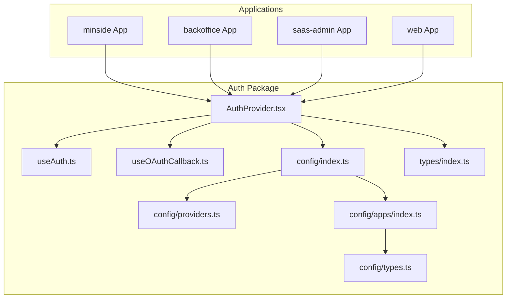
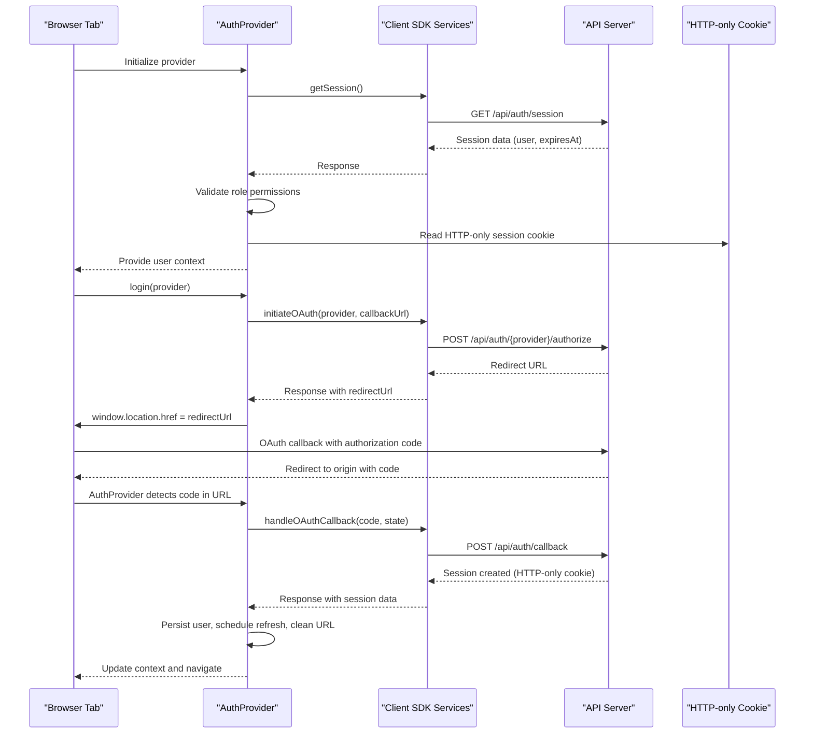
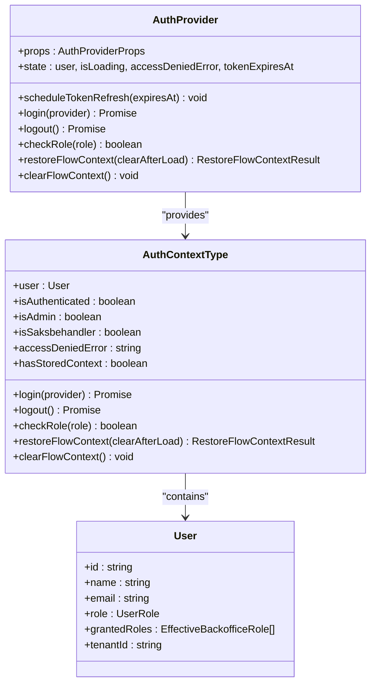
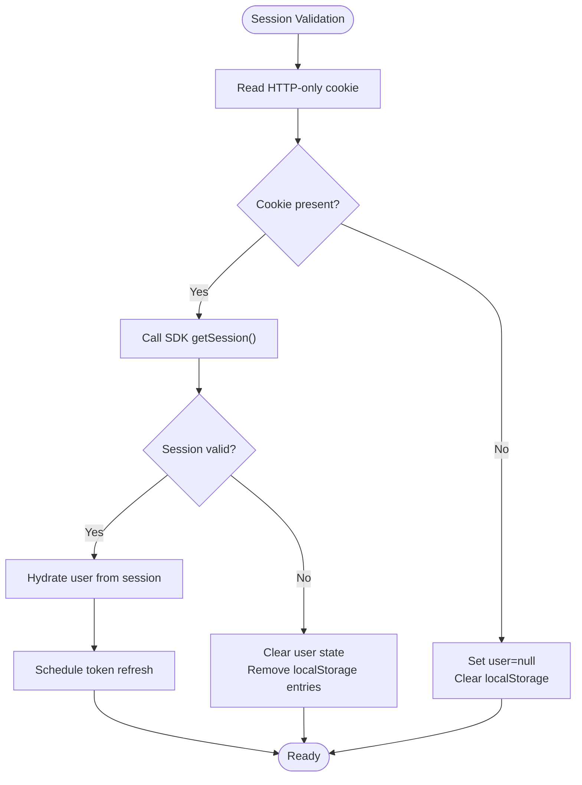
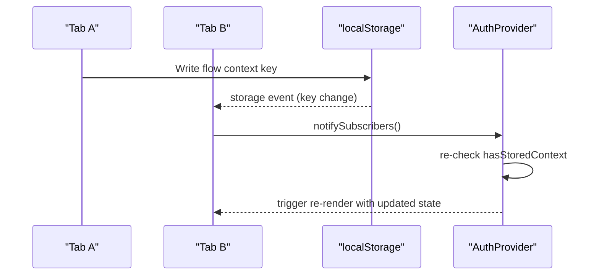
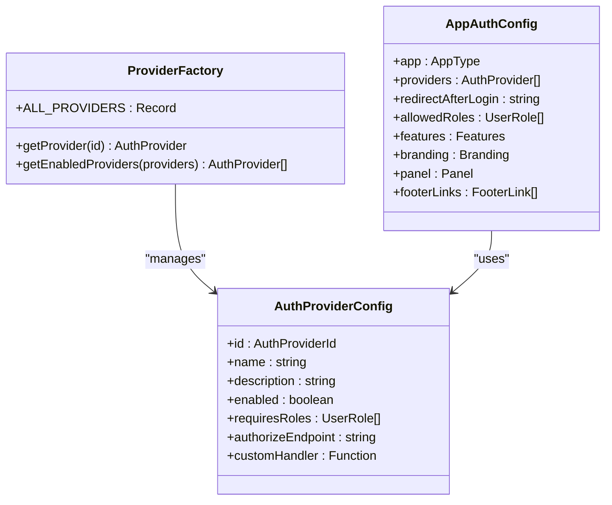
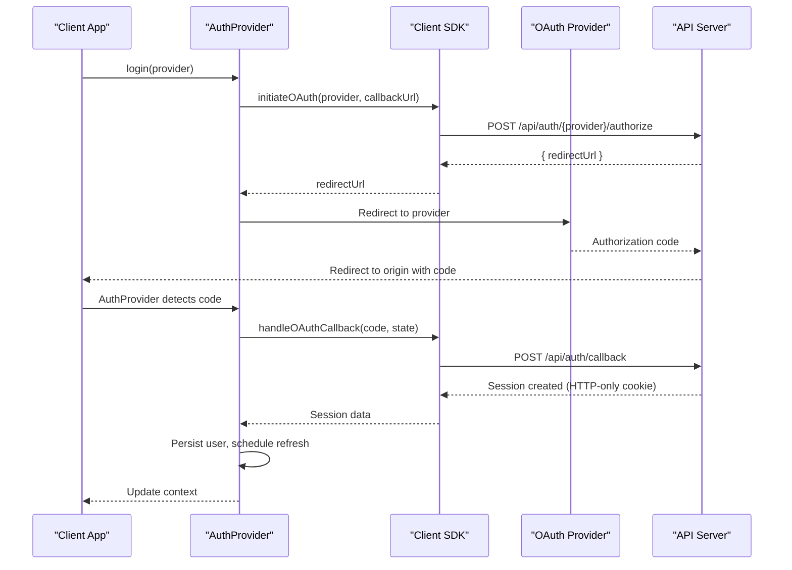
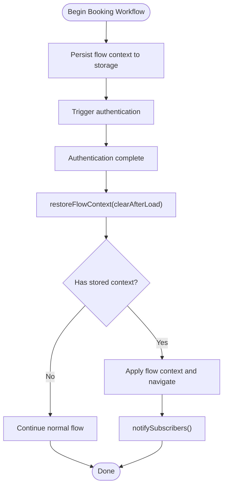
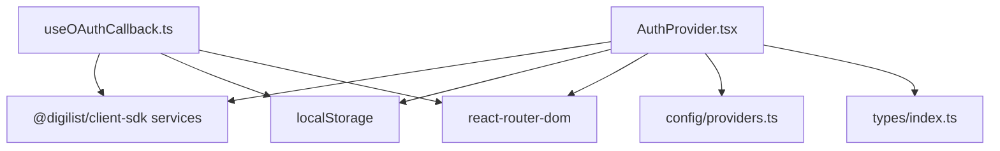

# Authentication Architecture

<cite>
**Referenced Files in This Document**
- [packages/auth/README.md](file://packages/auth/README.md)
- [packages/auth/src/providers/AuthProvider.tsx](file://packages/auth/src/providers/AuthProvider.tsx)
- [packages/auth/src/hooks/useAuth.ts](file://packages/auth/src/hooks/useAuth.ts)
- [packages/auth/src/hooks/useOAuthCallback.ts](file://packages/auth/src/hooks/useOAuthCallback.ts)
- [packages/auth/src/config/index.ts](file://packages/auth/src/config/index.ts)
- [packages/auth/src/config/providers.ts](file://packages/auth/src/config/providers.ts)
- [packages/auth/src/config/apps/index.ts](file://packages/auth/src/config/apps/index.ts)
- [packages/auth/src/config/types.ts](file://packages/auth/src/config/types.ts)
- [packages/auth/src/types/index.ts](file://packages/auth/src/types/index.ts)
</cite>

## Table of Contents
1. [Introduction](#introduction)
2. [Project Structure](#project-structure)
3. [Core Components](#core-components)
4. [Architecture Overview](#architecture-overview)
5. [Detailed Component Analysis](#detailed-component-analysis)
6. [Dependency Analysis](#dependency-analysis)
7. [Performance Considerations](#performance-considerations)
8. [Troubleshooting Guide](#troubleshooting-guide)
9. [Conclusion](#conclusion)

## Introduction
This document explains the centralized authentication architecture used across all Xala/Digilist applications. The system implements a unified AuthProvider component that manages HTTP-only cookie-based sessions, cross-tab synchronization, OAuth 2.0 integration, and role-based access control. It emphasizes a security-first approach without mock authentication in production, while supporting flow context preservation for booking workflows and a provider abstraction layer for extensible identity providers.

## Project Structure
The authentication system is encapsulated in a dedicated package that all applications import. The package exposes:
- A React context provider (AuthProvider) that centralizes authentication logic
- Hooks for consuming authentication state (useAuth, useOAuthCallback)
- A configuration module for providers and app-specific settings
- Strong TypeScript types for users, roles, and configuration

**Diagram sources**
- [packages/auth/src/providers/AuthProvider.tsx](file://packages/auth/src/providers/AuthProvider.tsx#L1-L592)
- [packages/auth/src/hooks/useAuth.ts](file://packages/auth/src/hooks/useAuth.ts#L1-L21)
- [packages/auth/src/hooks/useOAuthCallback.ts](file://packages/auth/src/hooks/useOAuthCallback.ts#L1-L52)
- [packages/auth/src/config/index.ts](file://packages/auth/src/config/index.ts#L1-L25)
- [packages/auth/src/config/providers.ts](file://packages/auth/src/config/providers.ts#L1-L78)
- [packages/auth/src/config/apps/index.ts](file://packages/auth/src/config/apps/index.ts#L1-L46)
- [packages/auth/src/config/types.ts](file://packages/auth/src/config/types.ts#L1-L125)
- [packages/auth/src/types/index.ts](file://packages/auth/src/types/index.ts#L1-L145)

**Section sources**
- [packages/auth/README.md](file://packages/auth/README.md#L1-L214)
- [packages/auth/src/providers/AuthProvider.tsx](file://packages/auth/src/providers/AuthProvider.tsx#L1-L592)
- [packages/auth/src/config/index.ts](file://packages/auth/src/config/index.ts#L1-L25)

## Core Components
- AuthProvider: Central React context provider managing authentication lifecycle, session validation, OAuth callbacks, role checks, and flow context restoration.
- useAuth: Hook to consume authentication state and actions from the AuthProvider.
- useOAuthCallback: Hook to process token-based OAuth callbacks and persist tokens for browser sessions.
- Provider Configuration: Centralized definitions for OAuth providers and app-specific authentication settings.
- Types and Contracts: Strongly typed user roles, app types, and configuration interfaces.

Key responsibilities:
- HTTP-only cookie-based session management with automatic refresh scheduling
- Cross-tab synchronization via storage events
- OAuth 2.0 Authorization Code flow with provider selection
- Role-based access control per application type
- Flow context preservation for booking and multi-step workflows
- Security-first design excluding mock authentication in production

**Section sources**
- [packages/auth/src/providers/AuthProvider.tsx](file://packages/auth/src/providers/AuthProvider.tsx#L1-L592)
- [packages/auth/src/hooks/useAuth.ts](file://packages/auth/src/hooks/useAuth.ts#L1-L21)
- [packages/auth/src/hooks/useOAuthCallback.ts](file://packages/auth/src/hooks/useOAuthCallback.ts#L1-L52)
- [packages/auth/src/config/providers.ts](file://packages/auth/src/config/providers.ts#L1-L78)
- [packages/auth/src/config/types.ts](file://packages/auth/src/config/types.ts#L1-L125)
- [packages/auth/src/types/index.ts](file://packages/auth/src/types/index.ts#L1-L145)

## Architecture Overview
The authentication architecture follows a centralized provider pattern with a strong emphasis on security and cross-application consistency.

**Diagram sources**
- [packages/auth/src/providers/AuthProvider.tsx](file://packages/auth/src/providers/AuthProvider.tsx#L240-L437)
- [packages/auth/src/hooks/useOAuthCallback.ts](file://packages/auth/src/hooks/useOAuthCallback.ts#L20-L51)

## Detailed Component Analysis

### AuthProvider Component
The AuthProvider is the central orchestrator for authentication across applications. It:
- Initializes authentication state and performs session validation
- Handles OAuth callbacks, exchanges authorization codes for sessions, and sets HTTP-only cookies
- Manages role-based access control per application type
- Schedules token refreshes before expiration
- Provides flow context restoration and clearing utilities
- Implements cross-tab synchronization via storage events

**Diagram sources**
- [packages/auth/src/providers/AuthProvider.tsx](file://packages/auth/src/providers/AuthProvider.tsx#L126-L591)
- [packages/auth/src/types/index.ts](file://packages/auth/src/types/index.ts#L27-L37)

**Section sources**
- [packages/auth/src/providers/AuthProvider.tsx](file://packages/auth/src/providers/AuthProvider.tsx#L1-L592)
- [packages/auth/src/types/index.ts](file://packages/auth/src/types/index.ts#L1-L145)

### Session Management with HTTP-only Cookies
- Session validation occurs via a dedicated SDK service that reads the HTTP-only cookie set by the API server.
- On successful validation, user data is hydrated and stored in localStorage for quick access (not for authentication).
- Token refresh is scheduled before expiration to maintain seamless sessions.
- On logout, both client-side state and server-side session are cleared, ensuring no residual authentication state.

**Diagram sources**
- [packages/auth/src/providers/AuthProvider.tsx](file://packages/auth/src/providers/AuthProvider.tsx#L363-L428)

**Section sources**
- [packages/auth/src/providers/AuthProvider.tsx](file://packages/auth/src/providers/AuthProvider.tsx#L363-L428)

### Cross-tab Synchronization Mechanisms
- Subscribes to storage events to detect changes in flow context keys and react accordingly.
- Uses a subscriber set pattern to notify components when cross-tab changes occur.
- Notifies subscribers upon logout and flow context operations to keep tabs synchronized.

**Diagram sources**
- [packages/auth/src/providers/AuthProvider.tsx](file://packages/auth/src/providers/AuthProvider.tsx#L81-L114)

**Section sources**
- [packages/auth/src/providers/AuthProvider.tsx](file://packages/auth/src/providers/AuthProvider.tsx#L77-L114)

### Provider Abstraction Layer
The provider abstraction defines OAuth providers and app-specific configurations:
- Provider definitions include ID-porten, Vipps, Microsoft, and a demo provider.
- App-specific configurations define allowed roles, redirect paths, and feature flags.
- The provider factory pattern enables dynamic selection and filtering of enabled providers.

**Diagram sources**
- [packages/auth/src/config/providers.ts](file://packages/auth/src/config/providers.ts#L1-L78)
- [packages/auth/src/config/types.ts](file://packages/auth/src/config/types.ts#L17-L41)
- [packages/auth/src/config/types.ts](file://packages/auth/src/config/types.ts#L46-L116)

**Section sources**
- [packages/auth/src/config/providers.ts](file://packages/auth/src/config/providers.ts#L1-L78)
- [packages/auth/src/config/apps/index.ts](file://packages/auth/src/config/apps/index.ts#L1-L46)
- [packages/auth/src/config/types.ts](file://packages/auth/src/config/types.ts#L1-L125)

### OAuth 2.0 Integration Strategy
- Uses Authorization Code flow with PKCE recommended by RFC 8252.
- Supports provider selection (ID-porten, Microsoft, Vipps) with configurable authorize endpoints.
- Handles OAuth callbacks, exchanges authorization codes for sessions, and sets HTTP-only cookies.
- Integrates with a dedicated SDK service for initiating OAuth and handling callbacks.

**Diagram sources**
- [packages/auth/src/providers/AuthProvider.tsx](file://packages/auth/src/providers/AuthProvider.tsx#L473-L488)
- [packages/auth/src/providers/AuthProvider.tsx](file://packages/auth/src/providers/AuthProvider.tsx#L286-L361)

**Section sources**
- [packages/auth/src/providers/AuthProvider.tsx](file://packages/auth/src/providers/AuthProvider.tsx#L473-L488)
- [packages/auth/src/providers/AuthProvider.tsx](file://packages/auth/src/providers/AuthProvider.tsx#L286-L361)

### Flow Context Preservation for Booking Workflows
- Flow context is preserved using a dedicated key in storage to maintain user intent across authentication.
- The AuthProvider exposes restoreFlowContext and clearFlowContext utilities to manage persisted state.
- Cross-tab synchronization ensures that restored contexts are visible across all tabs.

**Diagram sources**
- [packages/auth/src/providers/AuthProvider.tsx](file://packages/auth/src/providers/AuthProvider.tsx#L538-L569)

**Section sources**
- [packages/auth/src/providers/AuthProvider.tsx](file://packages/auth/src/providers/AuthProvider.tsx#L538-L569)

### Security-First Approach Without Mock Authentication
- Production builds enforce real authentication; mock authentication is removed and development mode uses a demo token login instead.
- HTTP-only cookies prevent XSS token theft and are the sole source of authentication truth.
- Tokens are never exposed in URLs; only single-use authorization codes are transmitted.
- Session validation failures result in immediate state cleanup to avoid stale authentication.

**Section sources**
- [packages/auth/src/providers/AuthProvider.tsx](file://packages/auth/src/providers/AuthProvider.tsx#L132-L272)
- [packages/auth/src/providers/AuthProvider.tsx](file://packages/auth/src/providers/AuthProvider.tsx#L413-L428)

## Dependency Analysis
The AuthProvider depends on:
- Client SDK services for session management and OAuth operations
- Local storage for user data persistence and flow context
- React Router for navigation during redirects and post-login flows
- A provider configuration module for OAuth provider definitions and app-specific settings

**Diagram sources**
- [packages/auth/src/providers/AuthProvider.tsx](file://packages/auth/src/providers/AuthProvider.tsx#L34-L49)
- [packages/auth/src/hooks/useOAuthCallback.ts](file://packages/auth/src/hooks/useOAuthCallback.ts#L16-L18)

**Section sources**
- [packages/auth/src/providers/AuthProvider.tsx](file://packages/auth/src/providers/AuthProvider.tsx#L32-L49)
- [packages/auth/src/hooks/useOAuthCallback.ts](file://packages/auth/src/hooks/useOAuthCallback.ts#L16-L18)

## Performance Considerations
- Token refresh scheduling prevents unnecessary network calls and maintains long-lived sessions efficiently.
- Cross-tab synchronization uses minimal event listeners and targeted storage key checks.
- Role checks are computed once per user and cached via memoization to reduce re-renders.
- Session validation on visibility change ensures timely refresh without impacting user experience.

## Troubleshooting Guide
Common issues and resolutions:
- Authentication expired events: The provider listens for auth:expired events and resets state, clearing timers and navigating to the login path.
- Session validation failures: On failure, user state is cleared and localStorage entries are removed to prevent stale data.
- OAuth callback errors: The provider cleans the URL and resets state if the callback fails.
- Logout inconsistencies: The provider clears local state, notifies subscribers, and invokes server-side logout to ensure consistency across tabs.

**Section sources**
- [packages/auth/src/providers/AuthProvider.tsx](file://packages/auth/src/providers/AuthProvider.tsx#L240-L272)
- [packages/auth/src/providers/AuthProvider.tsx](file://packages/auth/src/providers/AuthProvider.tsx#L412-L428)
- [packages/auth/src/providers/AuthProvider.tsx](file://packages/auth/src/providers/AuthProvider.tsx#L493-L521)

## Conclusion
The centralized authentication architecture delivers a secure, scalable, and consistent authentication experience across all Xala/Digilist applications. By leveraging HTTP-only cookies, OAuth 2.0, role-based access control, and cross-tab synchronization, it ensures robust security and seamless user experiences. The provider abstraction layer and configuration system enable easy extension and customization for diverse application needs.