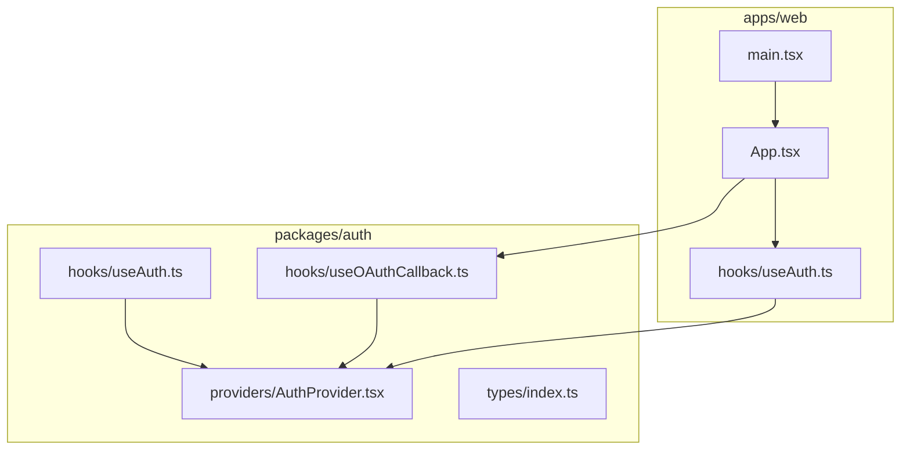
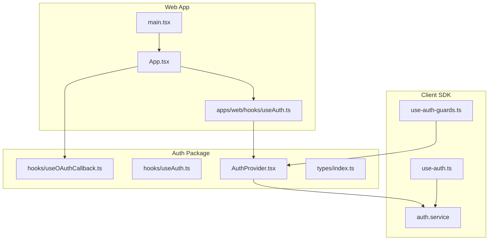
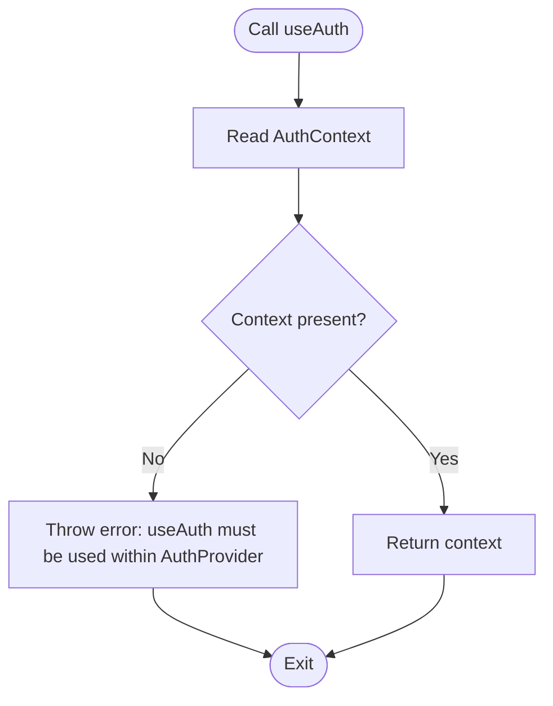
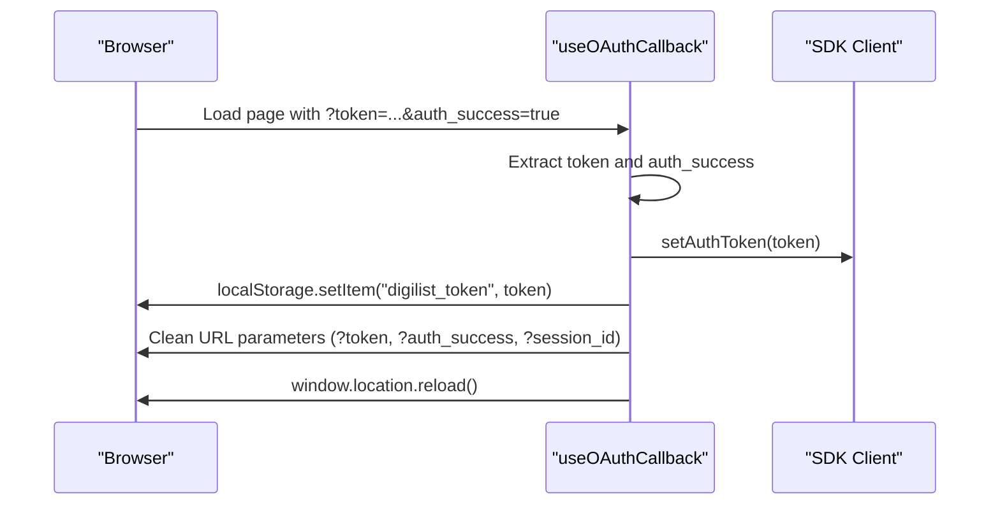
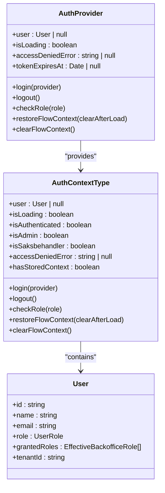
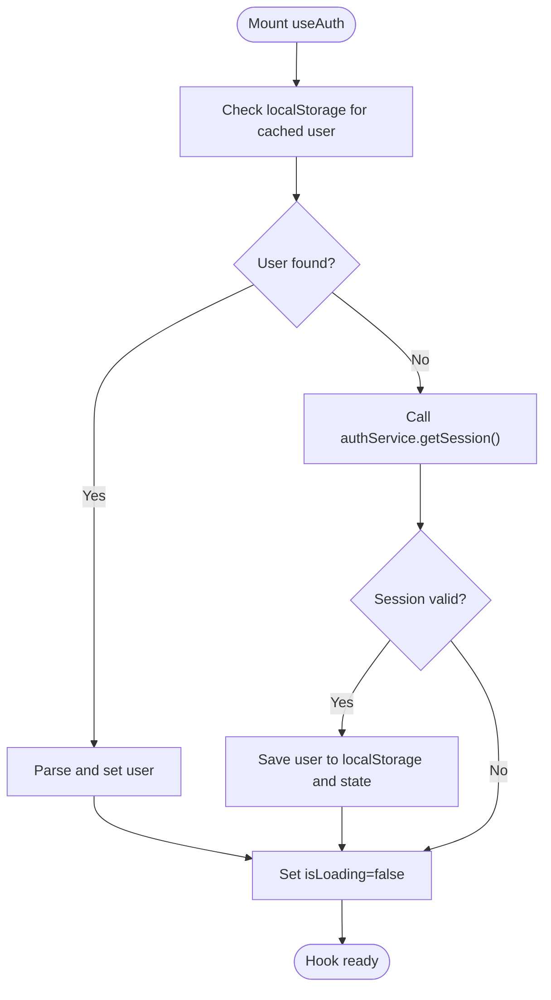
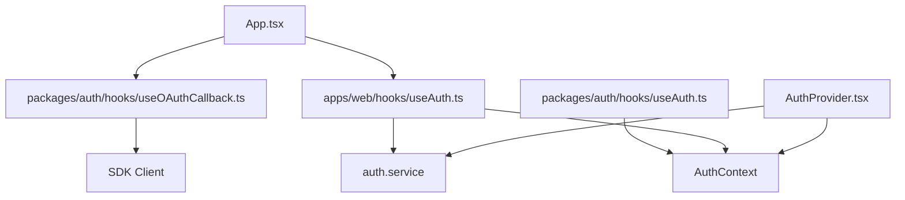

# Authentication Hooks

<cite>
**Referenced Files in This Document**
- [useAuth.ts](file://packages/auth/src/hooks/useAuth.ts)
- [useOAuthCallback.ts](file://packages/auth/src/hooks/useOAuthCallback.ts)
- [index.ts](file://packages/auth/src/hooks/index.ts)
- [AuthProvider.tsx](file://packages/auth/src/providers/AuthProvider.tsx)
- [types/index.ts](file://packages/auth/src/types/index.ts)
- [useAuth.ts](file://apps/web/src/hooks/useAuth.ts)
- [useAuth.test.ts](file://apps/web/src/hooks/useAuth.test.ts)
- [App.tsx](file://apps/web/src/App.tsx)
- [main.tsx](file://apps/web/src/main.tsx)
- [use-auth.ts](file://packages/client-sdk/src/hooks/use-auth.ts)
- [use-auth-guards.ts](file://packages/client-sdk/src/hooks/use-auth-guards.ts)
</cite>

## Table of Contents
1. [Introduction](#introduction)
2. [Project Structure](#project-structure)
3. [Core Components](#core-components)
4. [Architecture Overview](#architecture-overview)
5. [Detailed Component Analysis](#detailed-component-analysis)
6. [Dependency Analysis](#dependency-analysis)
7. [Performance Considerations](#performance-considerations)
8. [Troubleshooting Guide](#troubleshooting-guide)
9. [Conclusion](#conclusion)

## Introduction
This document provides comprehensive documentation for the authentication hook utilities in the monorepo. It focuses on:
- The useAuth hook for accessing authentication state, user data, and authentication actions
- The useOAuthCallback hook for handling OAuth redirects, token exchange, and session establishment
- Practical examples of hook usage in React components
- Error handling patterns, loading states, and integration with form validation
- The hooks' dependency on the AuthProvider context and how to properly wrap components for authentication functionality

The authentication system is built around HTTP-only cookie-based authentication with OAuth 2.0 Authorization Code flow, ensuring secure session management across subdomains and supporting role-based access control.

## Project Structure
The authentication hooks and providers are organized across two primary locations:
- packages/auth: Shared, centralized authentication hooks and provider for unified auth across applications
- apps/web: Application-specific useAuth hook tailored to the web app’s needs, including flow context preservation and return-to handling

**Diagram sources**
- [useAuth.ts](file://packages/auth/src/hooks/useAuth.ts#L1-L21)
- [useOAuthCallback.ts](file://packages/auth/src/hooks/useOAuthCallback.ts#L1-L52)
- [AuthProvider.tsx](file://packages/auth/src/providers/AuthProvider.tsx#L1-L592)
- [types/index.ts](file://packages/auth/src/types/index.ts#L1-L145)
- [useAuth.ts](file://apps/web/src/hooks/useAuth.ts#L1-L410)
- [App.tsx](file://apps/web/src/App.tsx#L1-L275)
- [main.tsx](file://apps/web/src/main.tsx#L1-L44)

**Section sources**
- [useAuth.ts](file://packages/auth/src/hooks/useAuth.ts#L1-L21)
- [useOAuthCallback.ts](file://packages/auth/src/hooks/useOAuthCallback.ts#L1-L52)
- [AuthProvider.tsx](file://packages/auth/src/providers/AuthProvider.tsx#L1-L592)
- [types/index.ts](file://packages/auth/src/types/index.ts#L1-L145)
- [useAuth.ts](file://apps/web/src/hooks/useAuth.ts#L1-L410)
- [App.tsx](file://apps/web/src/App.tsx#L1-L275)
- [main.tsx](file://apps/web/src/main.tsx#L1-L44)

## Core Components
This section outlines the primary authentication hooks and their responsibilities.

- useAuth (packages/auth):
  - Provides a minimal, context-based hook to access authentication state from the AuthProvider
  - Throws a clear error if used outside of AuthProvider context
  - Intended for simple consumers that only need to read auth state

- useOAuthCallback (packages/auth):
  - Handles OAuth callback parameters (token, auth_success, session_id)
  - Stores the token in localStorage and updates the SDK client
  - Cleans up URL parameters and reloads to reflect auth state

- useAuth (apps/web):
  - Application-specific hook with comprehensive authentication features
  - Manages user state, loading states, and session restoration
  - Supports OAuth login with flow context preservation and return-to handling
  - Integrates with authService for session checks, logout, and flow context operations

- AuthProvider (packages/auth):
  - Centralized authentication provider managing user state, role checks, and session lifecycle
  - Handles OAuth callbacks, token refresh scheduling, and access control
  - Provides context values for downstream components

**Section sources**
- [useAuth.ts](file://packages/auth/src/hooks/useAuth.ts#L1-L21)
- [useOAuthCallback.ts](file://packages/auth/src/hooks/useOAuthCallback.ts#L1-L52)
- [useAuth.ts](file://apps/web/src/hooks/useAuth.ts#L1-L410)
- [AuthProvider.tsx](file://packages/auth/src/providers/AuthProvider.tsx#L1-L592)

## Architecture Overview
The authentication architecture follows a layered approach:
- Client SDK: Provides services and hooks for session management and OAuth mutations
- AuthProvider: Centralizes authentication state, handles OAuth callbacks, and enforces access control
- Application-specific hooks: Extend functionality for app-specific needs (e.g., flow context preservation)

**Diagram sources**
- [AuthProvider.tsx](file://packages/auth/src/providers/AuthProvider.tsx#L1-L592)
- [useAuth.ts](file://packages/auth/src/hooks/useAuth.ts#L1-L21)
- [useOAuthCallback.ts](file://packages/auth/src/hooks/useOAuthCallback.ts#L1-L52)
- [types/index.ts](file://packages/auth/src/types/index.ts#L1-L145)
- [use-auth.ts](file://packages/client-sdk/src/hooks/use-auth.ts#L1-L188)
- [use-auth-guards.ts](file://packages/client-sdk/src/hooks/use-auth-guards.ts#L1-L133)
- [useAuth.ts](file://apps/web/src/hooks/useAuth.ts#L1-L410)
- [App.tsx](file://apps/web/src/App.tsx#L1-L275)
- [main.tsx](file://apps/web/src/main.tsx#L1-L44)

## Detailed Component Analysis

### useAuth Hook (packages/auth)
Purpose:
- Provides a simple way to access authentication context from any component
- Enforces that the hook is used within an AuthProvider

Behavior:
- Reads from AuthContext
- Throws an error if context is missing

Usage pattern:
- Import from the auth package
- Wrap components with AuthProvider
- Use in any descendant component

**Diagram sources**
- [useAuth.ts](file://packages/auth/src/hooks/useAuth.ts#L12-L20)

**Section sources**
- [useAuth.ts](file://packages/auth/src/hooks/useAuth.ts#L1-L21)

### useOAuthCallback Hook (packages/auth)
Purpose:
- Automatically handles OAuth callback parameters and establishes session
- Updates SDK client with JWT token and persists it in localStorage
- Cleans up URL parameters and reloads to reflect auth state

Behavior:
- Listens for URL search parameters (token, auth_success, session_id)
- On detection, sets auth token, stores it locally, removes parameters, and reloads
- Uses SDK client to manage token state

**Diagram sources**
- [useOAuthCallback.ts](file://packages/auth/src/hooks/useOAuthCallback.ts#L20-L51)

**Section sources**
- [useOAuthCallback.ts](file://packages/auth/src/hooks/useOAuthCallback.ts#L1-L52)

### AuthProvider (packages/auth)
Purpose:
- Centralized authentication provider for the entire platform
- Manages user state, role checks, session lifecycle, and OAuth callbacks
- Enforces access control and schedules token refresh

Key responsibilities:
- Session validation via HTTP-only cookies
- OAuth callback handling with authorization code exchange
- Role-based access control per application type
- Token refresh scheduling and cleanup
- Cross-tab synchronization for flow context

**Diagram sources**
- [AuthProvider.tsx](file://packages/auth/src/providers/AuthProvider.tsx#L120-L591)
- [types/index.ts](file://packages/auth/src/types/index.ts#L28-L144)

**Section sources**
- [AuthProvider.tsx](file://packages/auth/src/providers/AuthProvider.tsx#L1-L592)
- [types/index.ts](file://packages/auth/src/types/index.ts#L1-L145)

### Application-Specific useAuth Hook (apps/web)
Purpose:
- Extends the shared useAuth hook with application-specific features
- Manages user state, loading states, and session restoration
- Supports OAuth login with flow context preservation and return-to handling

Key features:
- Session restoration on mount by checking localStorage and server session
- OAuth login with provider selection and return-to URL construction
- Flow context preservation using authService.requireAuth and resumeFlow
- Logout with localStorage cleanup and API logout
- URL validation for return-to safety
- Cross-tab synchronization for flow context

**Diagram sources**
- [useAuth.ts](file://apps/web/src/hooks/useAuth.ts#L215-L250)

**Section sources**
- [useAuth.ts](file://apps/web/src/hooks/useAuth.ts#L1-L410)

### Integration in Web App (App.tsx)
Purpose:
- Demonstrates proper wrapping of components with AuthProvider
- Shows usage of useOAuthCallback for automatic OAuth handling
- Integrates authentication state into layout components

Key integration points:
- Wrapping the entire app with AuthProvider
- Using useOAuthCallback at the top level to handle redirects
- Consuming authentication state in layout components

**Section sources**
- [App.tsx](file://apps/web/src/App.tsx#L255-L272)
- [App.tsx](file://apps/web/src/App.tsx#L171-L172)

### Client SDK Hooks (packages/client-sdk)
Purpose:
- Provides React Query hooks for authentication operations
- Handles cookie-based authentication with automatic token management
- Offers guards for redirect loops and session restoration

Highlights:
- useSession, useAuthProviders, useLogin, useEmailLogin, useLogout, useRefreshToken
- useVippsLogin and useVippsCallback for Vipps OAuth integration
- useAuthRedirectGuard and useSessionRestoration for robust auth flows

**Section sources**
- [use-auth.ts](file://packages/client-sdk/src/hooks/use-auth.ts#L1-L188)
- [use-auth-guards.ts](file://packages/client-sdk/src/hooks/use-auth-guards.ts#L1-L133)

## Dependency Analysis
The authentication hooks and provider depend on:
- AuthProvider context for state management
- Client SDK services for session and OAuth operations
- React Router for navigation and URL parameter handling
- Local storage for persisting tokens and user data

**Diagram sources**
- [useAuth.ts](file://packages/auth/src/hooks/useAuth.ts#L8-L10)
- [useOAuthCallback.ts](file://packages/auth/src/hooks/useOAuthCallback.ts#L18-L20)
- [useAuth.ts](file://apps/web/src/hooks/useAuth.ts#L8-L18)
- [AuthProvider.tsx](file://packages/auth/src/providers/AuthProvider.tsx#L34-L40)
- [App.tsx](file://apps/web/src/App.tsx#L25-L25)

**Section sources**
- [useAuth.ts](file://packages/auth/src/hooks/useAuth.ts#L8-L10)
- [useOAuthCallback.ts](file://packages/auth/src/hooks/useOAuthCallback.ts#L18-L20)
- [useAuth.ts](file://apps/web/src/hooks/useAuth.ts#L8-L18)
- [AuthProvider.tsx](file://packages/auth/src/providers/AuthProvider.tsx#L34-L40)
- [App.tsx](file://apps/web/src/App.tsx#L25-L25)

## Performance Considerations
- Session caching: AuthProvider caches session data and schedules token refresh before expiry to minimize unnecessary requests
- Cross-tab synchronization: Uses useSyncExternalStore to synchronize flow context across browser tabs efficiently
- Lazy initialization: AuthProvider defers heavy operations until mounted to avoid blocking initial render
- Minimal re-renders: Application-specific useAuth hook uses memoization and callbacks to reduce re-renders during authentication operations

## Troubleshooting Guide
Common issues and resolutions:
- useAuth used outside AuthProvider:
  - Symptom: Error indicating useAuth must be used within AuthProvider
  - Resolution: Ensure components are wrapped with AuthProvider

- OAuth callback not handled:
  - Symptom: URL remains with token parameters after redirect
  - Resolution: Verify useOAuthCallback is called at the top level and token parameters are present

- Session validation failures:
  - Symptom: User appears unauthenticated despite valid cookies
  - Resolution: Check AuthProvider session validation and ensure HTTP-only cookies are set correctly

- Redirect loops:
  - Symptom: Infinite redirects between login and protected routes
  - Resolution: Use useAuthRedirectGuard to prevent redirect loops and clear auth state when necessary

- Flow context not restored:
  - Symptom: Lost booking or application state after authentication
  - Resolution: Ensure authService.requireAuth is called before redirect and resumeFlow is invoked after login

**Section sources**
- [useAuth.ts](file://packages/auth/src/hooks/useAuth.ts#L15-L17)
- [useOAuthCallback.ts](file://packages/auth/src/hooks/useOAuthCallback.ts#L24-L50)
- [AuthProvider.tsx](file://packages/auth/src/providers/AuthProvider.tsx#L412-L428)
- [use-auth-guards.ts](file://packages/client-sdk/src/hooks/use-auth-guards.ts#L28-L56)

## Conclusion
The authentication hooks and provider system provides a robust, secure, and extensible foundation for authentication across the monorepo. The useAuth hook offers simple context access, while the application-specific useAuth hook delivers comprehensive authentication features including flow context preservation. The AuthProvider centralizes state management and access control, ensuring consistent behavior across applications. Proper integration with AuthProvider and adherence to the documented usage patterns will deliver reliable authentication experiences with strong error handling and performance characteristics.