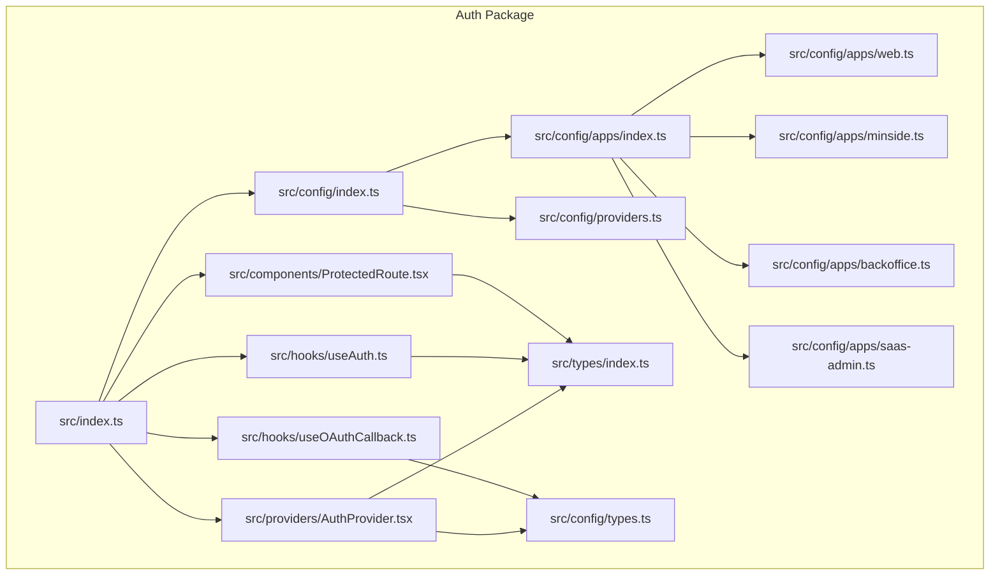
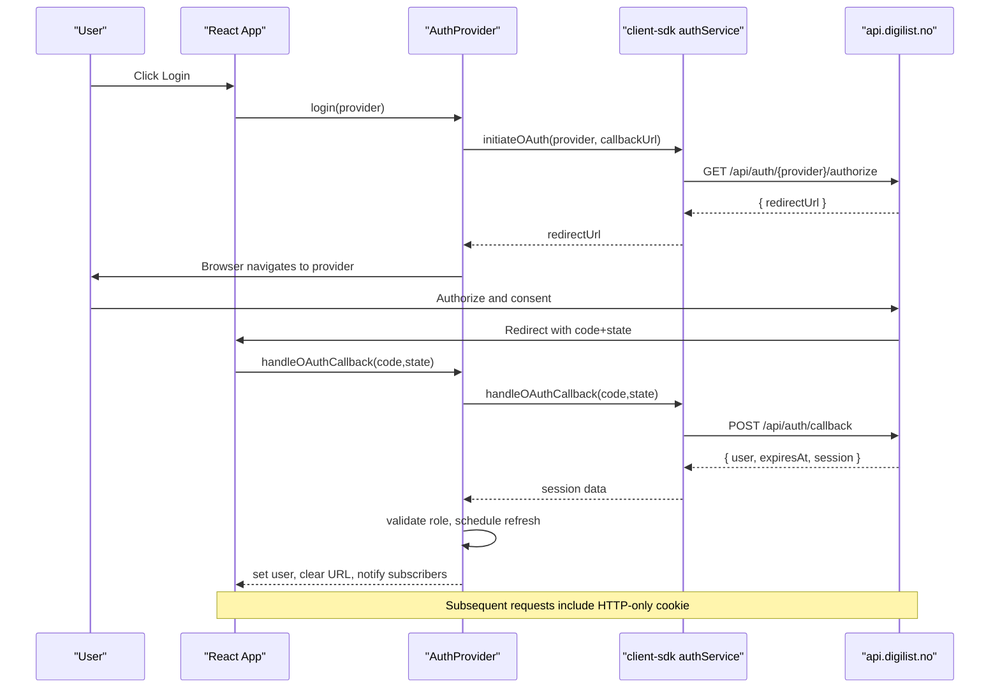
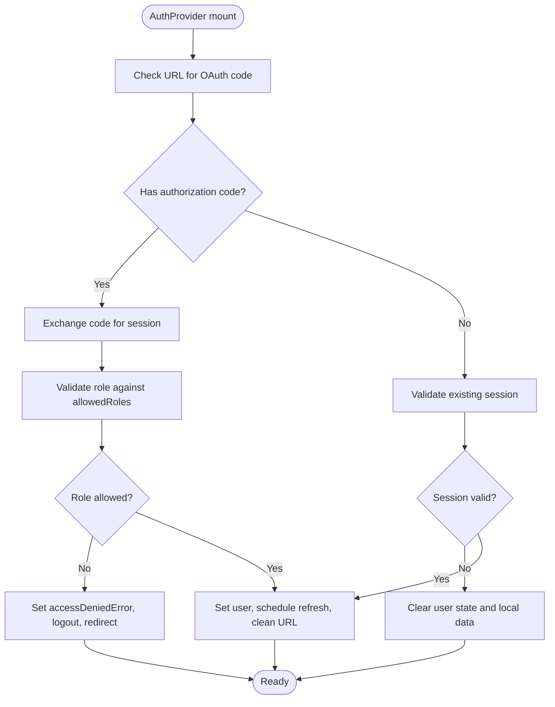
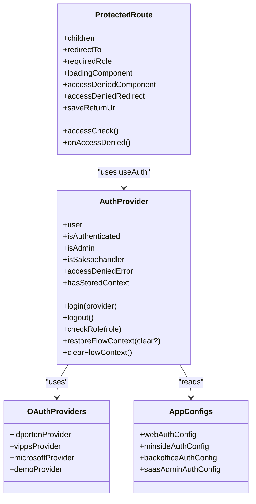
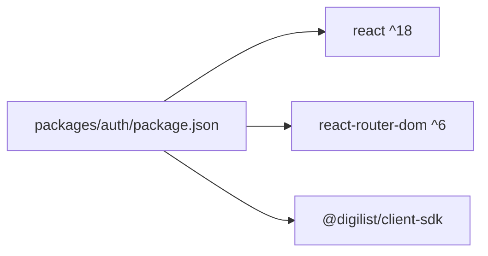

# Authentication Package

<cite>
**Referenced Files in This Document**
- [README.md](file://packages/auth/README.md)
- [index.ts](file://packages/auth/src/index.ts)
- [AuthProvider.tsx](file://packages/auth/src/providers/AuthProvider.tsx)
- [useAuth.ts](file://packages/auth/src/hooks/useAuth.ts)
- [useOAuthCallback.ts](file://packages/auth/src/hooks/useOAuthCallback.ts)
- [ProtectedRoute.tsx](file://packages/auth/src/components/ProtectedRoute.tsx)
- [providers.ts](file://packages/auth/src/config/providers.ts)
- [apps/index.ts](file://packages/auth/src/config/apps/index.ts)
- [web.ts](file://packages/auth/src/config/apps/web.ts)
- [minside.ts](file://packages/auth/src/config/apps/minside.ts)
- [backoffice.ts](file://packages/auth/src/config/apps/backoffice.ts)
- [saas-admin.ts](file://packages/auth/src/config/apps/saas-admin.ts)
- [types/index.ts](file://packages/auth/src/types/index.ts)
- [types.ts](file://packages/auth/src/config/types.ts)
- [package.json](file://packages/auth/package.json)
</cite>

## Table of Contents
1. [Introduction](#introduction)
2. [Project Structure](#project-structure)
3. [Core Components](#core-components)
4. [Architecture Overview](#architecture-overview)
5. [Detailed Component Analysis](#detailed-component-analysis)
6. [Dependency Analysis](#dependency-analysis)
7. [Performance Considerations](#performance-considerations)
8. [Troubleshooting Guide](#troubleshooting-guide)
9. [Conclusion](#conclusion)
10. [Appendices](#appendices)

## Introduction
This document describes the centralized authentication package used across all Xala/Digilist applications. It covers OAuth 2.0 integration with ID-porten, Vipps, and Microsoft providers, HTTP-only cookie–based session management, cross-tab synchronization, role-based access control per application type, ProtectedRoute implementation, and configuration patterns for web, minside, backoffice, and saas-admin. It also explains flow context preservation for booking workflows, security considerations, and practical setup examples for React applications.

## Project Structure
The authentication package is organized into providers, hooks, components, configuration, and shared types. It exposes a single AuthProvider, hooks, and a ProtectedRoute component, plus configuration modules for providers and app-specific settings.

**Diagram sources**
- [index.ts](file://packages/auth/src/index.ts#L17-L52)
- [AuthProvider.tsx](file://packages/auth/src/providers/AuthProvider.tsx#L131-L592)
- [useAuth.ts](file://packages/auth/src/hooks/useAuth.ts#L12-L21)
- [useOAuthCallback.ts](file://packages/auth/src/hooks/useOAuthCallback.ts#L20-L52)
- [ProtectedRoute.tsx](file://packages/auth/src/components/ProtectedRoute.tsx#L61-L140)
- [providers.ts](file://packages/auth/src/config/providers.ts#L8-L78)
- [apps/index.ts](file://packages/auth/src/config/apps/index.ts#L18-L46)
- [web.ts](file://packages/auth/src/config/apps/web.ts#L9-L63)
- [minside.ts](file://packages/auth/src/config/apps/minside.ts#L9-L64)
- [backoffice.ts](file://packages/auth/src/config/apps/backoffice.ts#L9-L64)
- [saas-admin.ts](file://packages/auth/src/config/apps/saas-admin.ts#L9-L63)
- [types/index.ts](file://packages/auth/src/types/index.ts#L64-L145)
- [types.ts](file://packages/auth/src/config/types.ts#L46-L116)

**Section sources**
- [README.md](file://packages/auth/README.md#L1-L214)
- [index.ts](file://packages/auth/src/index.ts#L1-L52)
- [package.json](file://packages/auth/package.json#L1-L41)

## Core Components
- AuthProvider: Central React context provider that manages authentication state, session lifecycle, OAuth callbacks, role checks, flow context restoration, and cross-tab synchronization.
- useAuth: Hook to access authentication state and actions from any component.
- ProtectedRoute: Route wrapper enforcing authentication, optional role checks, and configurable redirects.
- useOAuthCallback: Hook to process token-based OAuth callbacks and persist tokens for SDK usage.
- Configuration: OAuth providers and app-specific auth settings (allowed roles, branding, features).

Key capabilities:
- HTTP-only cookie–based sessions with cross-subdomain SSO on .digilist.no.
- OAuth 2.0 Authorization Code flow with ID-porten, Vipps, and Microsoft providers.
- Role-based access control per app type with extended granted roles for backoffice.
- Cross-tab synchronization via storage events and useSyncExternalStore.
- Flow context preservation for booking workflows with TTL-aware restoration.

**Section sources**
- [AuthProvider.tsx](file://packages/auth/src/providers/AuthProvider.tsx#L131-L592)
- [useAuth.ts](file://packages/auth/src/hooks/useAuth.ts#L12-L21)
- [ProtectedRoute.tsx](file://packages/auth/src/components/ProtectedRoute.tsx#L61-L140)
- [useOAuthCallback.ts](file://packages/auth/src/hooks/useOAuthCallback.ts#L20-L52)
- [providers.ts](file://packages/auth/src/config/providers.ts#L8-L78)
- [apps/index.ts](file://packages/auth/src/config/apps/index.ts#L18-L46)

## Architecture Overview
The authentication system is built around a React context provider that coordinates with a backend service to manage HTTP-only session cookies. It supports OAuth providers and enforces role-based access control per application type. ProtectedRoute integrates with routing to enforce access policies.

**Diagram sources**
- [AuthProvider.tsx](file://packages/auth/src/providers/AuthProvider.tsx#L276-L361)
- [AuthProvider.tsx](file://packages/auth/src/providers/AuthProvider.tsx#L473-L488)
- [useOAuthCallback.ts](file://packages/auth/src/hooks/useOAuthCallback.ts#L24-L50)

**Section sources**
- [AuthProvider.tsx](file://packages/auth/src/providers/AuthProvider.tsx#L131-L592)
- [useOAuthCallback.ts](file://packages/auth/src/hooks/useOAuthCallback.ts#L20-L52)

## Detailed Component Analysis

### AuthProvider
Responsibilities:
- Initialize authentication by checking URL for OAuth code, validating existing session, scheduling token refresh, and handling auth:expired events.
- Manage user state, loading state, access denied errors, and token expiration.
- Provide login/logout actions, role checks, and flow context helpers.
- Support cross-tab synchronization via storage events and useSyncExternalStore.
- Enforce role-based access control per app type, including granted roles for backoffice.

Security highlights:
- HTTP-only cookies prevent XSS token theft.
- No tokens in URLs or localStorage except for non-auth data (user object).
- OAuth codes are short-lived and exchanged server-side.
- Strict development mode safeguards.

**Diagram sources**
- [AuthProvider.tsx](file://packages/auth/src/providers/AuthProvider.tsx#L240-L437)

**Section sources**
- [AuthProvider.tsx](file://packages/auth/src/providers/AuthProvider.tsx#L131-L592)
- [types/index.ts](file://packages/auth/src/types/index.ts#L108-L145)

### useAuth Hook
- Provides access to authentication state and actions from any component.
- Throws if used outside AuthProvider.

Usage pattern:
- Destructure user, isAuthenticated, isLoading, isAdmin, isSaksbehandler, accessDeniedError, hasStoredContext, login, logout, checkRole, restoreFlowContext, clearFlowContext.

**Section sources**
- [useAuth.ts](file://packages/auth/src/hooks/useAuth.ts#L12-L21)
- [AuthProvider.tsx](file://packages/auth/src/providers/AuthProvider.tsx#L571-L588)

### ProtectedRoute
- Enforces authentication and optional role/access checks.
- Supports custom loading and access denied components or redirects.
- Can preserve return URL in navigation state.

Behavior:
- If loading: renders loadingComponent or default spinner.
- If accessDeniedError exists: navigates to /access-denied.
- If not authenticated: navigates to redirectTo with return URL state.
- If access denied: renders accessDeniedComponent or navigates to accessDeniedRedirect.
- Otherwise renders children.

**Section sources**
- [ProtectedRoute.tsx](file://packages/auth/src/components/ProtectedRoute.tsx#L61-L140)
- [types/index.ts](file://packages/auth/src/types/index.ts#L108-L145)

### useOAuthCallback Hook
- Processes token-based OAuth callbacks from URL parameters.
- Updates SDK client with JWT token and persists token in localStorage.
- Cleans up URL parameters and reloads to reinitialize auth state.

**Section sources**
- [useOAuthCallback.ts](file://packages/auth/src/hooks/useOAuthCallback.ts#L20-L52)

### OAuth Providers and App Configurations
Providers:
- ID-porten: enabled, national identity provider.
- Vipps: currently disabled.
- Microsoft: currently disabled.
- Demo: enabled for development/testing.

App configs:
- web: public booking site; all authenticated users allowed; flow context preservation enabled.
- minside: citizen portal; all authenticated users allowed; flow context preservation enabled.
- backoffice: admin interface; restricted to admin, saksbehandler, super_admin, case_handler; role selection enabled.
- saas-admin: platform admin; restricted to super_admin, admin; flow context preservation disabled.

**Diagram sources**
- [AuthProvider.tsx](file://packages/auth/src/providers/AuthProvider.tsx#L131-L592)
- [ProtectedRoute.tsx](file://packages/auth/src/components/ProtectedRoute.tsx#L61-L140)
- [providers.ts](file://packages/auth/src/config/providers.ts#L8-L78)
- [apps/index.ts](file://packages/auth/src/config/apps/index.ts#L18-L46)
- [web.ts](file://packages/auth/src/config/apps/web.ts#L9-L63)
- [minside.ts](file://packages/auth/src/config/apps/minside.ts#L9-L64)
- [backoffice.ts](file://packages/auth/src/config/apps/backoffice.ts#L9-L64)
- [saas-admin.ts](file://packages/auth/src/config/apps/saas-admin.ts#L9-L63)

**Section sources**
- [providers.ts](file://packages/auth/src/config/providers.ts#L8-L78)
- [apps/index.ts](file://packages/auth/src/config/apps/index.ts#L18-L46)
- [web.ts](file://packages/auth/src/config/apps/web.ts#L9-L63)
- [minside.ts](file://packages/auth/src/config/apps/minside.ts#L9-L64)
- [backoffice.ts](file://packages/auth/src/config/apps/backoffice.ts#L9-L64)
- [saas-admin.ts](file://packages/auth/src/config/apps/saas-admin.ts#L9-L63)

## Dependency Analysis
- Peer dependencies: react and react-router-dom.
- Internal dependency: @digilist/client-sdk for authService integration.
- Exported entry points: providers, hooks, components, types, config.

**Diagram sources**
- [package.json](file://packages/auth/package.json#L24-L27)
- [package.json](file://packages/auth/package.json#L21-L23)

**Section sources**
- [package.json](file://packages/auth/package.json#L1-L41)

## Performance Considerations
- Token auto-refresh: scheduled 2 minutes before expiry to minimize downtime.
- Visibility change checks: re-validates session when tab becomes visible.
- Cross-tab sync: uses storage events to keep tabs in sync without polling.
- Minimal local storage usage: only non-auth user data and flow context.

[No sources needed since this section provides general guidance]

## Troubleshooting Guide
Common issues and resolutions:
- Access denied: occurs when user role is not permitted for the app type. The provider sets an accessDeniedError and logs out the user.
- OAuth callback fails: URL is cleaned and user state reset; check provider configuration and backend callback endpoint.
- Session invalidation: on visibility change or validation failure, the provider clears user state and local data.
- Logout: clears local state, flow context, and notifies subscribers; server-side session invalidated via SDK.

Operational tips:
- Enable debug logging via config.debug to trace auth lifecycle.
- Verify allowedRoles per app type align with user entitlements.
- Ensure cross-tab synchronization by checking storage event listeners.

**Section sources**
- [AuthProvider.tsx](file://packages/auth/src/providers/AuthProvider.tsx#L240-L437)
- [AuthProvider.tsx](file://packages/auth/src/providers/AuthProvider.tsx#L493-L521)
- [ProtectedRoute.tsx](file://packages/auth/src/components/ProtectedRoute.tsx#L94-L120)

## Conclusion
The @xala/auth package provides a unified, secure, and scalable authentication solution across Xala/Digilist applications. It leverages HTTP-only cookies, OAuth 2.0, cross-tab synchronization, and role-based access control tailored per app type. The AuthProvider, useAuth hook, ProtectedRoute, and configuration modules offer a cohesive developer experience while maintaining strong security practices.

[No sources needed since this section summarizes without analyzing specific files]

## Appendices

### Practical Setup Examples
- Wrap your app with AuthProvider and specify appType and optional overrides.
- Use useAuth in components to access user state and actions.
- Wrap protected routes with ProtectedRoute and configure redirects and role checks.
- Use useOAuthCallback for token-based OAuth flows.

References:
- [README.md](file://packages/auth/README.md#L24-L87)
- [AuthProvider.tsx](file://packages/auth/src/providers/AuthProvider.tsx#L131-L131)
- [useAuth.ts](file://packages/auth/src/hooks/useAuth.ts#L12-L21)
- [ProtectedRoute.tsx](file://packages/auth/src/components/ProtectedRoute.tsx#L61-L140)
- [useOAuthCallback.ts](file://packages/auth/src/hooks/useOAuthCallback.ts#L20-L52)

### Configuration Patterns by App Type
- web: public, flow context preservation enabled, all authenticated users allowed.
- minside: citizen portal, flow context preservation enabled, all authenticated users allowed.
- backoffice: admin interface, restricted roles, role selection enabled.
- saas-admin: platform admin, restricted roles, flow context preservation disabled.

References:
- [apps/index.ts](file://packages/auth/src/config/apps/index.ts#L18-L46)
- [web.ts](file://packages/auth/src/config/apps/web.ts#L9-L63)
- [minside.ts](file://packages/auth/src/config/apps/minside.ts#L9-L64)
- [backoffice.ts](file://packages/auth/src/config/apps/backoffice.ts#L9-L64)
- [saas-admin.ts](file://packages/auth/src/config/apps/saas-admin.ts#L9-L63)

### Security Considerations
- HTTP-only cookies prevent XSS token theft.
- OAuth codes are single-use and exchanged server-side.
- Tokens are not logged or exposed in URLs.
- CSRF protection via SameSite cookie attribute.
- Mock authentication removed in production.

References:
- [README.md](file://packages/auth/README.md#L156-L175)