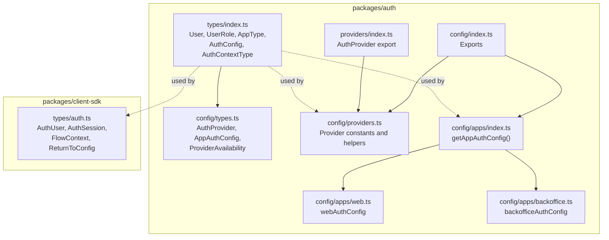
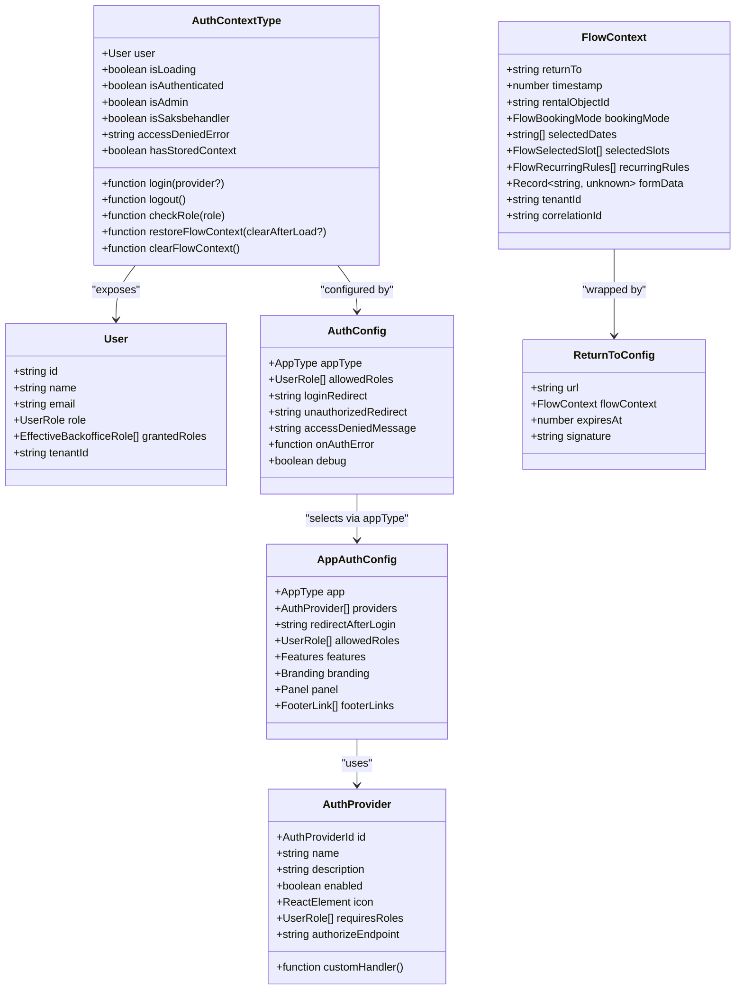
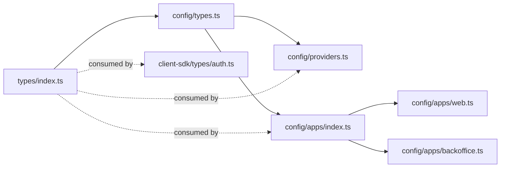

# Authentication Types & Interfaces

<cite>
**Referenced Files in This Document**
- [packages/auth/src/types/index.ts](file://packages/auth/src/types/index.ts)
- [packages/auth/src/config/types.ts](file://packages/auth/src/config/types.ts)
- [packages/auth/src/config/index.ts](file://packages/auth/src/config/index.ts)
- [packages/auth/src/config/providers.ts](file://packages/auth/src/config/providers.ts)
- [packages/auth/src/config/apps/index.ts](file://packages/auth/src/config/apps/index.ts)
- [packages/auth/src/config/apps/web.ts](file://packages/auth/src/config/apps/web.ts)
- [packages/auth/src/config/apps/backoffice.ts](file://packages/auth/src/config/apps/backoffice.ts)
- [packages/auth/src/providers/index.ts](file://packages/auth/src/providers/index.ts)
- [packages/client-sdk/src/types/auth.ts](file://packages/client-sdk/src/types/auth.ts)
</cite>

## Table of Contents
1. [Introduction](#introduction)
2. [Project Structure](#project-structure)
3. [Core Components](#core-components)
4. [Architecture Overview](#architecture-overview)
5. [Detailed Component Analysis](#detailed-component-analysis)
6. [Dependency Analysis](#dependency-analysis)
7. [Performance Considerations](#performance-considerations)
8. [Troubleshooting Guide](#troubleshooting-guide)
9. [Conclusion](#conclusion)

## Introduction
This document provides comprehensive type documentation for the authentication system’s TypeScript interfaces and types. It focuses on the unified User, UserRole, AppType, AuthConfig, AuthContextType, and related interfaces. It explains how these types ensure type safety, maintain compile-time validation, and enforce consistency across multiple application types and authentication providers. Practical usage examples are included for components, services, and configuration files.

## Project Structure
The authentication type system spans two primary packages:
- packages/auth: Shared front-end types, app/provider configurations, and provider definitions
- packages/client-sdk: Backend-facing SDK types for session, permissions, and flow context

Key areas:
- Unified types for users and roles
- App-specific configuration and provider definitions
- Auth context and configuration interfaces
- SDK-side session and permission types

**Diagram sources**
- [packages/auth/src/types/index.ts](file://packages/auth/src/types/index.ts#L1-L145)
- [packages/auth/src/config/types.ts](file://packages/auth/src/config/types.ts#L1-L125)
- [packages/auth/src/config/index.ts](file://packages/auth/src/config/index.ts#L1-L25)
- [packages/auth/src/config/providers.ts](file://packages/auth/src/config/providers.ts#L1-L78)
- [packages/auth/src/config/apps/index.ts](file://packages/auth/src/config/apps/index.ts#L1-L46)
- [packages/auth/src/config/apps/web.ts](file://packages/auth/src/config/apps/web.ts#L1-L63)
- [packages/auth/src/config/apps/backoffice.ts](file://packages/auth/src/config/apps/backoffice.ts#L1-L64)
- [packages/auth/src/providers/index.ts](file://packages/auth/src/providers/index.ts#L1-L2)
- [packages/client-sdk/src/types/auth.ts](file://packages/client-sdk/src/types/auth.ts#L1-L162)

**Section sources**
- [packages/auth/src/types/index.ts](file://packages/auth/src/types/index.ts#L1-L145)
- [packages/auth/src/config/types.ts](file://packages/auth/src/config/types.ts#L1-L125)
- [packages/auth/src/config/index.ts](file://packages/auth/src/config/index.ts#L1-L25)
- [packages/auth/src/config/providers.ts](file://packages/auth/src/config/providers.ts#L1-L78)
- [packages/auth/src/config/apps/index.ts](file://packages/auth/src/config/apps/index.ts#L1-L46)
- [packages/auth/src/config/apps/web.ts](file://packages/auth/src/config/apps/web.ts#L1-L63)
- [packages/auth/src/config/apps/backoffice.ts](file://packages/auth/src/config/apps/backoffice.ts#L1-L64)
- [packages/auth/src/providers/index.ts](file://packages/auth/src/providers/index.ts#L1-L2)
- [packages/client-sdk/src/types/auth.ts](file://packages/client-sdk/src/types/auth.ts#L1-L162)

## Core Components
This section documents the foundational types and their relationships.

- AppType: Discriminated union of supported application identifiers used to select app-specific configurations and access rules.
- UserRole: Union of all platform roles, including administrative and functional roles across applications.
- EffectiveBackofficeRole: Subset of effective roles used in backoffice contexts.
- User: Base user interface used across all applications, including optional tenant and granted roles.
- FlowContext: Serializable context for preserving user intent across authentication interruptions.
- RestoreFlowContextResult: Outcome of restoring flow context, including expiration and validity flags.
- AuthConfig: Per-app configuration for authentication behavior, redirects, and error handling.
- AuthContextType: Contract for the authentication provider’s exposed context, including login/logout, role checks, and flow context utilities.

These types collectively ensure:
- Compile-time validation of app types and roles
- Consistent user representation across apps
- Safe handling of flow context and return-to flows
- Type-safe configuration of providers and apps

**Section sources**
- [packages/auth/src/types/index.ts](file://packages/auth/src/types/index.ts#L9-L145)

## Architecture Overview
The authentication type system is designed around a shared contract for user identity and roles, with app-specific configurations and provider definitions. The SDK provides complementary types for session and flow context.

**Diagram sources**
- [packages/auth/src/types/index.ts](file://packages/auth/src/types/index.ts#L29-L145)
- [packages/auth/src/config/types.ts](file://packages/auth/src/config/types.ts#L17-L125)
- [packages/client-sdk/src/types/auth.ts](file://packages/client-sdk/src/types/auth.ts#L118-L162)

## Detailed Component Analysis

### User and Role Types
- AppType: Discriminated union of supported applications.
- UserRole: Union of roles across the platform, including administrative and functional roles.
- EffectiveBackofficeRole: Backoffice-specific effective roles.
- User: Base user interface with optional tenant and granted roles.

Type safety benefits:
- Compile-time enforcement of allowed app types and roles
- Prevention of invalid role assignments
- Consistent user shape across applications

Usage examples:
- Components can assert user.role against UserRole to render role-specific UI.
- Services can filter allowedRoles in AuthConfig to gate access.

**Section sources**
- [packages/auth/src/types/index.ts](file://packages/auth/src/types/index.ts#L9-L37)

### AuthConfig and AuthContextType
- AuthConfig: Defines per-app authentication behavior, including allowed roles, redirects, and error callbacks.
- AuthContextType: Contract for the authentication provider’s exposed context, including login/logout, role checks, and flow context utilities.

Type safety benefits:
- Ensures consistent configuration across apps
- Compile-time validation of context method signatures
- Prevents misuse of flow context APIs

Usage examples:
- Components consume AuthContextType to check roles and initiate login.
- Services use AuthConfig to validate redirects and access control.

**Section sources**
- [packages/auth/src/types/index.ts](file://packages/auth/src/types/index.ts#L64-L145)

### AppAuthConfig and AuthProvider
- AppAuthConfig: App-specific configuration including providers, allowed roles, feature flags, branding, and UI panels.
- AuthProvider: Provider definition with metadata, availability, and optional OAuth endpoints.

Type safety benefits:
- Centralized provider definitions prevent duplication
- Strong typing for provider availability and feature flags
- Compile-time validation of app-specific configs

Usage examples:
- getAppAuthConfig(appType) selects the correct configuration.
- getEnabledProviders filters disabled providers.

**Section sources**
- [packages/auth/src/config/types.ts](file://packages/auth/src/config/types.ts#L46-L125)
- [packages/auth/src/config/providers.ts](file://packages/auth/src/config/providers.ts#L12-L77)
- [packages/auth/src/config/apps/index.ts](file://packages/auth/src/config/apps/index.ts#L20-L45)
- [packages/auth/src/config/apps/web.ts](file://packages/auth/src/config/apps/web.ts#L9-L62)
- [packages/auth/src/config/apps/backoffice.ts](file://packages/auth/src/config/apps/backoffice.ts#L9-L63)

### Flow Context and Return-to Types
- FlowContext: Serializable navigation and booking state used to preserve user journeys across authentication.
- ReturnToConfig: Wraps FlowContext with security metadata including expiration and signature.

Type safety benefits:
- Ensures only valid booking modes and slot structures are used
- Compile-time validation of return-to URLs and context shapes
- Tamper protection via signature and expiration

Usage examples:
- Components can persist FlowContext before initiating login.
- Services can restore FlowContext post-authentication and enforce TTL.

**Section sources**
- [packages/client-sdk/src/types/auth.ts](file://packages/client-sdk/src/types/auth.ts#L118-L162)

### Provider Availability and Selection
- ProviderAvailability: Result of availability checks.
- Helper functions: getProvider and getEnabledProviders.

Type safety benefits:
- Prevents runtime errors from missing provider IDs
- Ensures only enabled providers are presented to users

Usage examples:
- UI components can render only enabled providers.
- Services can programmatically select providers based on conditions.

**Section sources**
- [packages/auth/src/config/types.ts](file://packages/auth/src/config/types.ts#L121-L125)
- [packages/auth/src/config/providers.ts](file://packages/auth/src/config/providers.ts#L68-L77)

### Auth Provider Export
- providers/index.ts re-exports AuthProvider and AuthContext for consumption by applications.

Type safety benefits:
- Centralized exports reduce coupling and ensure consistent imports.

**Section sources**
- [packages/auth/src/providers/index.ts](file://packages/auth/src/providers/index.ts#L1-L2)

## Dependency Analysis
The type system exhibits low coupling and high cohesion:
- Front-end types depend on shared enums and interfaces
- App configurations depend on provider definitions
- SDK types complement front-end types for session and flow context

**Diagram sources**
- [packages/auth/src/types/index.ts](file://packages/auth/src/types/index.ts#L1-L145)
- [packages/auth/src/config/types.ts](file://packages/auth/src/config/types.ts#L1-L125)
- [packages/auth/src/config/providers.ts](file://packages/auth/src/config/providers.ts#L1-L78)
- [packages/auth/src/config/apps/index.ts](file://packages/auth/src/config/apps/index.ts#L1-L46)
- [packages/auth/src/config/apps/web.ts](file://packages/auth/src/config/apps/web.ts#L1-L63)
- [packages/auth/src/config/apps/backoffice.ts](file://packages/auth/src/config/apps/backoffice.ts#L1-L64)
- [packages/client-sdk/src/types/auth.ts](file://packages/client-sdk/src/types/auth.ts#L1-L162)

**Section sources**
- [packages/auth/src/types/index.ts](file://packages/auth/src/types/index.ts#L1-L145)
- [packages/auth/src/config/types.ts](file://packages/auth/src/config/types.ts#L1-L125)
- [packages/auth/src/config/providers.ts](file://packages/auth/src/config/providers.ts#L1-L78)
- [packages/auth/src/config/apps/index.ts](file://packages/auth/src/config/apps/index.ts#L1-L46)
- [packages/auth/src/config/apps/web.ts](file://packages/auth/src/config/apps/web.ts#L1-L63)
- [packages/auth/src/config/apps/backoffice.ts](file://packages/auth/src/config/apps/backoffice.ts#L1-L64)
- [packages/client-sdk/src/types/auth.ts](file://packages/client-sdk/src/types/auth.ts#L1-L162)

## Performance Considerations
- Prefer discriminated unions (AppType, UserRole) to avoid expensive runtime checks
- Use feature flags in AppAuthConfig to conditionally enable expensive flows
- Keep FlowContext minimal to reduce serialization overhead
- Cache provider availability checks to avoid repeated filtering

## Troubleshooting Guide
Common issues and resolutions:
- Unknown app type: getAppAuthConfig throws on unsupported AppType; ensure the app type matches supported values.
- Missing provider: getProvider returns undefined for unknown IDs; validate provider IDs before use.
- Disabled provider: getEnabledProviders filters out disabled entries; ensure providers are enabled before rendering.
- Flow context restoration: RestoreFlowContextResult indicates expiration or invalidity; handle TTL and validation gracefully.

**Section sources**
- [packages/auth/src/config/apps/index.ts](file://packages/auth/src/config/apps/index.ts#L42-L44)
- [packages/auth/src/config/providers.ts](file://packages/auth/src/config/providers.ts#L68-L77)
- [packages/auth/src/types/index.ts](file://packages/auth/src/types/index.ts#L53-L59)

## Conclusion
The authentication type system establishes a robust, type-safe foundation for user identity, roles, and app/provider configurations. By leveraging discriminated unions, structured interfaces, and centralized provider definitions, it ensures compile-time validation, consistent behavior across applications, and maintainable integration with authentication providers. The SDK’s session and flow context types further strengthen the system by providing secure, serializable state management for user journeys.