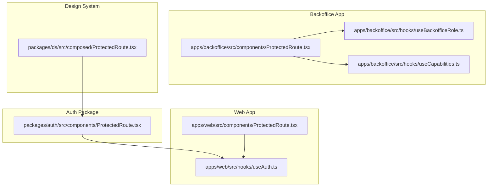
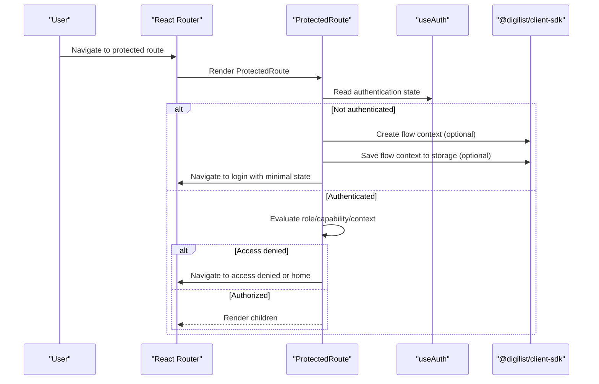
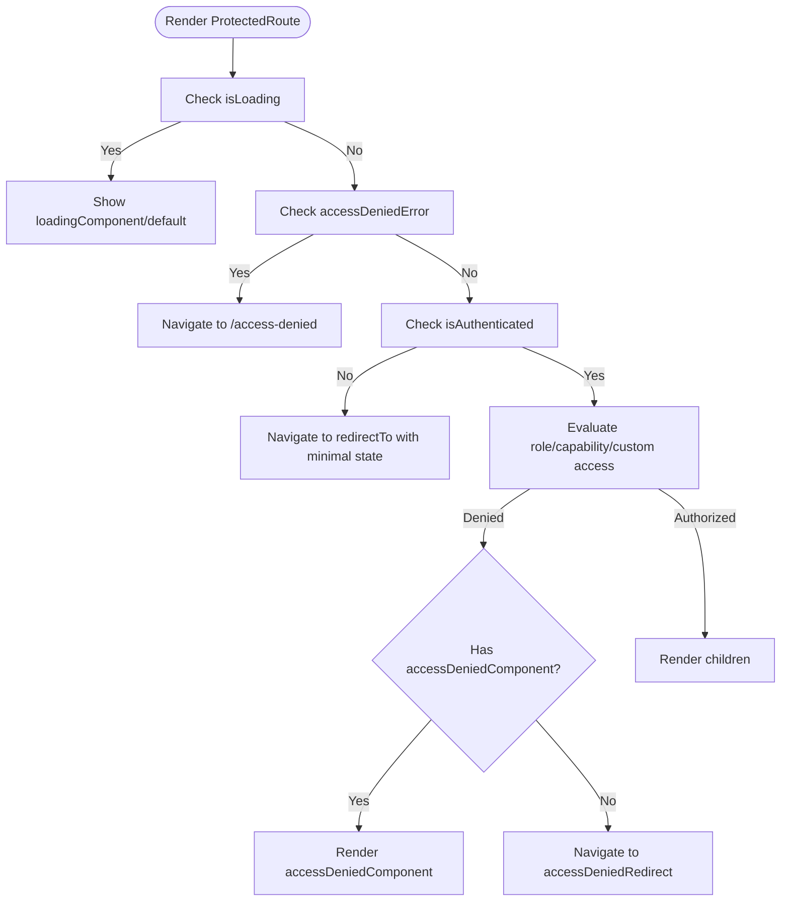
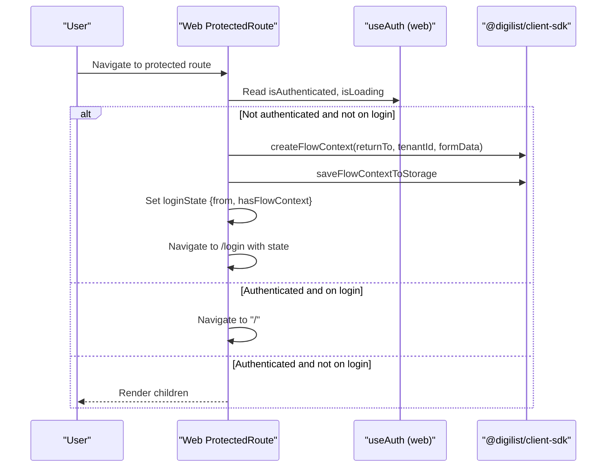
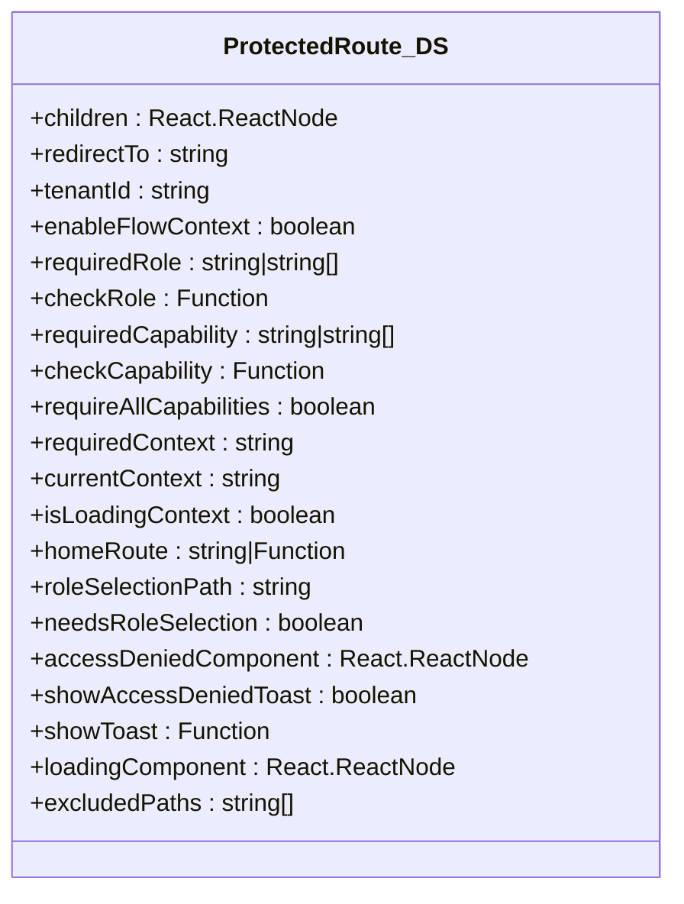
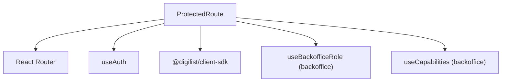

# Protected Routing

<cite>
**Referenced Files in This Document**
- [ProtectedRoute.tsx](file://packages/auth/src/components/ProtectedRoute.tsx)
- [ProtectedRoute.tsx](file://apps/web/src/components/ProtectedRoute.tsx)
- [ProtectedRoute.tsx](file://apps/backoffice/src/components/ProtectedRoute.tsx)
- [ProtectedRoute.tsx](file://packages/ds/src/composed/ProtectedRoute.tsx)
- [ProtectedRoute.test.tsx](file://packages/auth/src/components/__tests__/ProtectedRoute.test.tsx)
- [ProtectedRoute.test.tsx](file://apps/web/src/components/ProtectedRoute.test.tsx)
- [ProtectedRoute.test.tsx](file://apps/minside/src/components/ProtectedRoute.test.tsx)
- [ProtectedRoute.test.tsx](file://apps/monitoring/src/components/ProtectedRoute.test.tsx)
- [useAuth.ts](file://packages/auth/src/hooks/useAuth.ts)
- [useAuth.ts](file://apps/web/src/hooks/useAuth.ts)
- [useBackofficeRole.ts](file://apps/backoffice/src/hooks/useBackofficeRole.ts)
- [useCapabilities.ts](file://apps/backoffice/src/hooks/useCapabilities.ts)
</cite>

## Table of Contents
1. [Introduction](#introduction)
2. [Project Structure](#project-structure)
3. [Core Components](#core-components)
4. [Architecture Overview](#architecture-overview)
5. [Detailed Component Analysis](#detailed-component-analysis)
6. [Dependency Analysis](#dependency-analysis)
7. [Performance Considerations](#performance-considerations)
8. [Troubleshooting Guide](#troubleshooting-guide)
9. [Conclusion](#conclusion)

## Introduction
This document explains the ProtectedRoute component implementations across the monorepo, focusing on route protection mechanisms, authentication guards, conditional rendering, and integration with React Router. It covers fallback routing for unauthenticated users, role-based access control (RBAC), capability-based access control, and flow context preservation for seamless authentication experiences. The guide also documents component props, usage patterns, and integration with the broader authentication system.

## Project Structure
ProtectedRoute appears in multiple forms across the repository:
- A lightweight, generic implementation in the shared auth package suitable for most apps
- An app-specific implementation in the web application with flow context preservation
- A comprehensive implementation in the backoffice application supporting legacy roles and capability-based checks
- A unified, composable implementation in the design system package offering extensive customization

**Diagram sources**
- [ProtectedRoute.tsx](file://packages/auth/src/components/ProtectedRoute.tsx#L1-L140)
- [ProtectedRoute.tsx](file://apps/web/src/components/ProtectedRoute.tsx#L1-L190)
- [ProtectedRoute.tsx](file://apps/backoffice/src/components/ProtectedRoute.tsx#L1-L274)
- [ProtectedRoute.tsx](file://packages/ds/src/composed/ProtectedRoute.tsx#L1-L357)
- [useAuth.ts](file://apps/web/src/hooks/useAuth.ts#L1-L410)
- [useBackofficeRole.ts](file://apps/backoffice/src/hooks/useBackofficeRole.ts#L1-L150)
- [useCapabilities.ts](file://apps/backoffice/src/hooks/useCapabilities.ts#L1-L255)

**Section sources**
- [ProtectedRoute.tsx](file://packages/auth/src/components/ProtectedRoute.tsx#L1-L140)
- [ProtectedRoute.tsx](file://apps/web/src/components/ProtectedRoute.tsx#L1-L190)
- [ProtectedRoute.tsx](file://apps/backoffice/src/components/ProtectedRoute.tsx#L1-L274)
- [ProtectedRoute.tsx](file://packages/ds/src/composed/ProtectedRoute.tsx#L1-L357)

## Core Components
This section summarizes the responsibilities and key behaviors of each ProtectedRoute variant.

- Generic ProtectedRoute (auth package)
  - Purpose: Basic authentication gating with optional role and custom access checks
  - Key features:
    - Authentication state from useAuth
    - Role validation via checkRole
    - Custom access checks via accessCheck
    - Loading and access denied handling
    - Redirect behavior configurable via redirectTo and accessDeniedRedirect
  - Props include children, redirectTo, requiredRole, accessCheck, onAccessDenied, loadingComponent, accessDeniedComponent, accessDeniedRedirect, saveReturnUrl

- Web App ProtectedRoute
  - Purpose: Session-safe return-to-flow with flow context preservation for OAuth
  - Key features:
    - Flow context creation and storage in sessionStorage
    - Minimal state forwarding to login
    - Redirect loop prevention
    - Login-to-home redirection for authenticated users
    - Tenant-aware flow context resolution

- Backoffice ProtectedRoute
  - Purpose: RBAC with legacy roles and capability-based checks
  - Key features:
    - Legacy role checks (admin, case handler)
    - Capability-based checks (single, all, any)
    - Toast notifications for access denials
    - Role selection flow for dual-role users
    - Home route redirection based on effective role

- Design System ProtectedRoute
  - Purpose: Unified, highly configurable route protection
  - Key features:
    - Role, capability, and context checks
    - Flow context preservation
    - Excluded paths, home route customization, role selection path
    - Access denied UI or component
    - Toast integration for access denials

**Section sources**
- [ProtectedRoute.tsx](file://packages/auth/src/components/ProtectedRoute.tsx#L37-L121)
- [ProtectedRoute.tsx](file://apps/web/src/components/ProtectedRoute.tsx#L74-L186)
- [ProtectedRoute.tsx](file://apps/backoffice/src/components/ProtectedRoute.tsx#L100-L273)
- [ProtectedRoute.tsx](file://packages/ds/src/composed/ProtectedRoute.tsx#L124-L355)

## Architecture Overview
ProtectedRoute integrates with React Router and the authentication system to enforce access control and preserve user context during authentication flows.

**Diagram sources**
- [ProtectedRoute.tsx](file://apps/web/src/components/ProtectedRoute.tsx#L114-L186)
- [ProtectedRoute.tsx](file://packages/auth/src/components/ProtectedRoute.tsx#L72-L121)
- [ProtectedRoute.tsx](file://apps/backoffice/src/components/ProtectedRoute.tsx#L185-L273)
- [ProtectedRoute.tsx](file://packages/ds/src/composed/ProtectedRoute.tsx#L226-L355)
- [useAuth.ts](file://apps/web/src/hooks/useAuth.ts#L199-L409)

## Detailed Component Analysis

### Generic ProtectedRoute (auth package)
- Responsibilities:
  - Gate access based on authentication, role, and custom checks
  - Provide loading and access denied UI
  - Redirect unauthenticated users with optional return URL state
- Conditional rendering logic:
  - Loading: show loadingComponent or default spinner
  - Access denied error: redirect to /access-denied
  - Unauthenticated: redirect to redirectTo with minimal state
  - Access denied (authenticated but unauthorized): render accessDeniedComponent or redirect to accessDeniedRedirect
  - Authorized: render children

**Diagram sources**
- [ProtectedRoute.tsx](file://packages/auth/src/components/ProtectedRoute.tsx#L72-L121)

**Section sources**
- [ProtectedRoute.tsx](file://packages/auth/src/components/ProtectedRoute.tsx#L37-L121)
- [ProtectedRoute.test.tsx](file://packages/auth/src/components/__tests__/ProtectedRoute.test.tsx#L43-L112)

### Web App ProtectedRoute
- Responsibilities:
  - Preserve flow context for OAuth redirects
  - Prevent redirect loops
  - Redirect authenticated users away from login/role selection pages
- Key behaviors:
  - On unauthenticated state, create and save flow context to sessionStorage
  - Forward minimal state to login (pathname and hasFlowContext flag)
  - On login success, restore flow context and navigate appropriately

**Diagram sources**
- [ProtectedRoute.tsx](file://apps/web/src/components/ProtectedRoute.tsx#L114-L186)
- [useAuth.ts](file://apps/web/src/hooks/useAuth.ts#L199-L409)

**Section sources**
- [ProtectedRoute.tsx](file://apps/web/src/components/ProtectedRoute.tsx#L74-L186)
- [ProtectedRoute.test.tsx](file://apps/web/src/components/ProtectedRoute.test.tsx#L152-L225)

### Backoffice ProtectedRoute
- Responsibilities:
  - Support legacy roles and modern capability-based access control
  - Handle dual-role users with role selection
  - Provide toast feedback for access denials
- Access evaluation order:
  - Authentication check (must be authenticated)
  - Role check (legacy)
  - Capability checks (single, all, any)
  - Context validation (if required)
  - Redirect to home route or show access denied UI

```mermaid
flowchart TD
Start(["Render Backoffice ProtectedRoute"]) --> CheckAuth["Check isAuthenticated"]
CheckAuth --> |No| RedirectLogin["Navigate to /login"]
CheckAuth --> |Yes| CheckDualRole["Check needsRoleSelection"]
CheckDualRole --> |Yes| RedirectRoleSel["Navigate to /role-selection"]
CheckDualRole --> |No| CheckRole["Check requiredRole"]
CheckRole --> |Fail| Deny["Show toast and redirect to home"]
CheckRole --> |Pass| CheckCaps["Evaluate requiredCapability/all/any"]
CheckCaps --> |Fail| Deny
CheckCaps --> |Pass| CheckContext["Validate requiredContext vs currentContext"]
CheckContext --> |Fail| RedirectHome["Navigate to home route"]
CheckContext --> |Pass| Render["Render children"]
```

**Diagram sources**
- [ProtectedRoute.tsx](file://apps/backoffice/src/components/ProtectedRoute.tsx#L100-L273)
- [useBackofficeRole.ts](file://apps/backoffice/src/hooks/useBackofficeRole.ts#L119-L127)
- [useCapabilities.ts](file://apps/backoffice/src/hooks/useCapabilities.ts#L143-L178)

**Section sources**
- [ProtectedRoute.tsx](file://apps/backoffice/src/components/ProtectedRoute.tsx#L17-L273)
- [useBackofficeRole.ts](file://apps/backoffice/src/hooks/useBackofficeRole.ts#L119-L127)
- [useCapabilities.ts](file://apps/backoffice/src/hooks/useCapabilities.ts#L143-L178)

### Design System ProtectedRoute
- Responsibilities:
  - Unified, composable route protection across applications
  - Extensive customization via props (roles, capabilities, contexts)
  - Built-in flow context preservation and excluded paths
- Advanced features:
  - Custom role and capability check functions
  - Require all or any capabilities
  - Context-aware access control
  - Access denied component or default UI
  - Toast integration and customizable home route

**Diagram sources**
- [ProtectedRoute.tsx](file://packages/ds/src/composed/ProtectedRoute.tsx#L31-L91)

**Section sources**
- [ProtectedRoute.tsx](file://packages/ds/src/composed/ProtectedRoute.tsx#L124-L355)

## Dependency Analysis
ProtectedRoute depends on:
- React Router (Navigate, useLocation)
- useAuth hook for authentication state
- App-specific hooks/providers for advanced RBAC (backoffice)
- @digilist/client-sdk for flow context preservation (web and DS variants)

**Diagram sources**
- [ProtectedRoute.tsx](file://packages/auth/src/components/ProtectedRoute.tsx#L32-L35)
- [ProtectedRoute.tsx](file://apps/web/src/components/ProtectedRoute.tsx#L21-L31)
- [ProtectedRoute.tsx](file://apps/backoffice/src/components/ProtectedRoute.tsx#L1-L16)
- [useAuth.ts](file://packages/auth/src/hooks/useAuth.ts#L8-L20)

**Section sources**
- [ProtectedRoute.tsx](file://packages/auth/src/components/ProtectedRoute.tsx#L32-L35)
- [ProtectedRoute.tsx](file://apps/web/src/components/ProtectedRoute.tsx#L21-L31)
- [ProtectedRoute.tsx](file://apps/backoffice/src/components/ProtectedRoute.tsx#L1-L16)
- [useAuth.ts](file://packages/auth/src/hooks/useAuth.ts#L8-L20)

## Performance Considerations
- Minimize re-renders by memoizing capability and role checks
- Avoid excessive storage writes by preventing double-saving flow context
- Keep redirect logic simple to reduce navigation overhead
- Use default loading components sparingly; provide lightweight alternatives for critical routes

## Troubleshooting Guide
Common issues and resolutions:
- Redirect loops
  - Cause: Being on the login page while authenticated
  - Resolution: Ensure authenticated users are redirected to home or role selection
  - Evidence: Web and backoffice implementations check login and role selection pages to prevent loops

- Flow context not restored
  - Cause: Missing or invalid flow context in storage
  - Resolution: Verify flow context creation and storage, and ensure restoration on login callback

- Access denied toast not shown
  - Cause: Access denied callback not invoked or toast provider missing
  - Resolution: Confirm onAccessDenied or showAccessDeniedToast integration

- Role-based access control precedence
  - Cause: Confusion about order of checks
  - Resolution: Authentication must pass before role/capability checks; see combined requirements tests

**Section sources**
- [ProtectedRoute.test.tsx](file://apps/web/src/components/ProtectedRoute.test.tsx#L266-L325)
- [ProtectedRoute.test.tsx](file://apps/monitoring/src/components/ProtectedRoute.test.tsx#L485-L522)
- [ProtectedRoute.test.tsx](file://apps/minside/src/components/ProtectedRoute.test.tsx#L485-L522)

## Conclusion
The ProtectedRoute implementations provide robust, extensible route protection across the monorepo. The generic auth package offers a solid foundation, while app-specific variants enhance UX with flow context preservation and advanced RBAC. The design system variant unifies these concerns into a single, configurable component. Together, they ensure secure, user-friendly navigation and seamless authentication experiences.