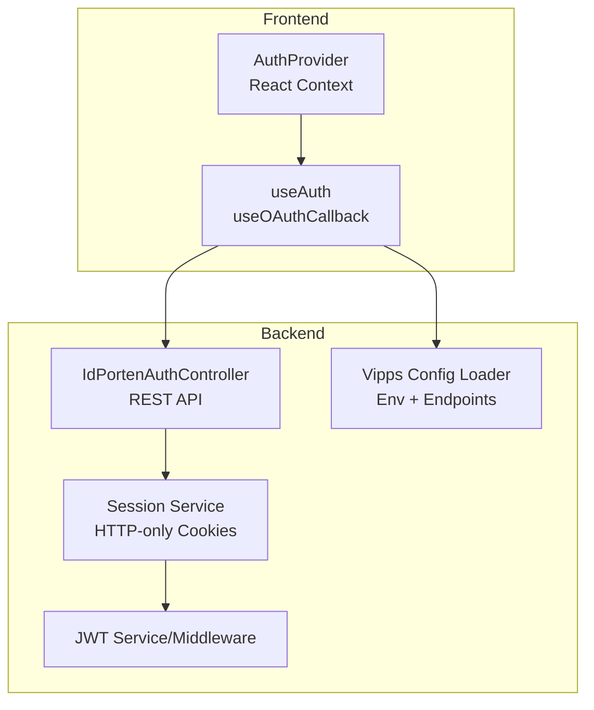
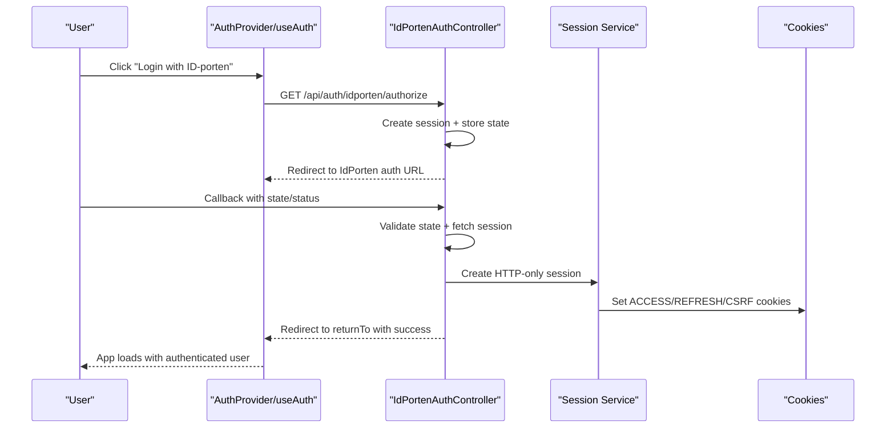
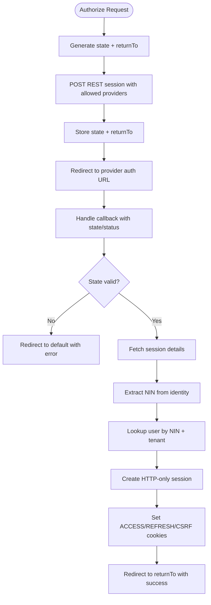
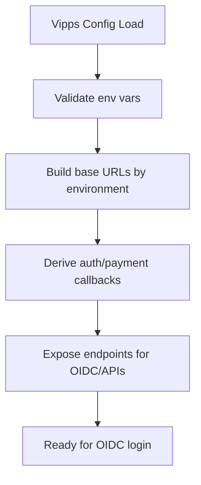
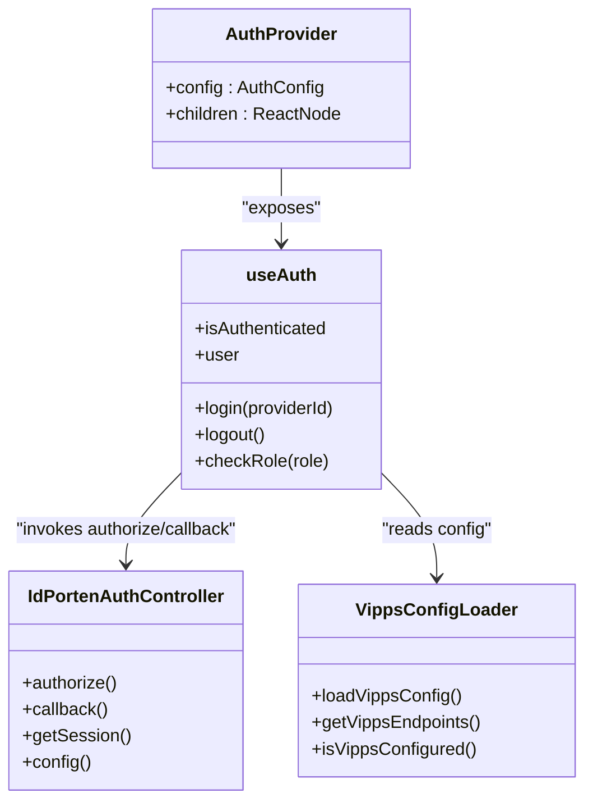
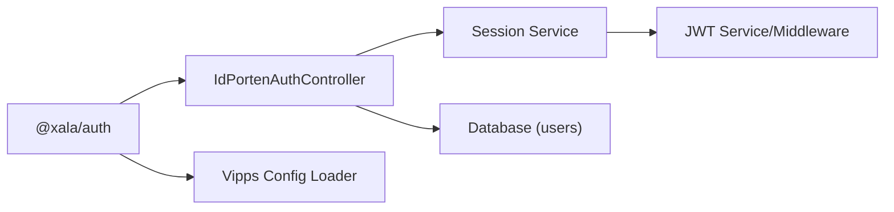

# Provider Configuration

<cite>
**Referenced Files in This Document**
- [packages/auth/src/index.ts](file://packages/auth/src/index.ts)
- [packages/auth/README.md](file://packages/auth/README.md)
- [packages/auth/src/config/index.ts](file://packages/auth/src/config/index.ts)
- [packages/auth/src/config/types.ts](file://packages/auth/src/config/types.ts)
- [packages/auth/src/config/providers.ts](file://packages/auth/src/config/providers.ts)
- [packages/auth/src/providers/AuthProvider.tsx](file://packages/auth/src/providers/AuthProvider.tsx)
- [apps/api/src/config/vipps.config.ts](file://apps/api/src/config/vipps.config.ts)
- [apps/api/src/modules/auth/idporten.controller.ts](file://apps/api/src/modules/auth/idporten.controller.ts)
- [apps/api/src/modules/auth/idporten-session-store.ts](file://apps/api/src/modules/auth/idporten-session-store.ts)
- [apps/api/src/modules/auth/vipps-user.service.ts](file://apps/api/src/modules/auth/vipps-user.service.ts)
- [apps/api/src/modules/auth/vipps-session-store.ts](file://apps/api/src/modules/auth/vipps-session-store.ts)
- [apps/api/src/modules/auth/auth.controller.ts](file://apps/api/src/modules/auth/auth.controller.ts)
- [apps/api/src/core/auth/jwt.service.ts](file://apps/api/src/core/auth/jwt.service.ts)
- [apps/api/src/core/auth/jwt.middleware.ts](file://apps/api/src/core/auth/jwt.middleware.ts)
- [apps/api/src/modules/auth/session.service.ts](file://apps/api/src/modules/auth/session.service.ts)
- [apps/api/src/config/cookies.ts](file://apps/api/src/config/cookies.ts)
- [apps/web/src/providers/index.ts](file://apps/web/src/providers/index.ts)
</cite>

## Table of Contents
1. [Introduction](#introduction)
2. [Project Structure](#project-structure)
3. [Core Components](#core-components)
4. [Architecture Overview](#architecture-overview)
5. [Detailed Component Analysis](#detailed-component-analysis)
6. [Dependency Analysis](#dependency-analysis)
7. [Performance Considerations](#performance-considerations)
8. [Troubleshooting Guide](#troubleshooting-guide)
9. [Conclusion](#conclusion)
10. [Appendices](#appendices)

## Introduction
This document explains how OAuth providers are configured and managed across the monorepo. It covers ID-porten, Vipps, Microsoft, and the demo provider, detailing client credentials, scopes, redirect URIs, and callback handling. It also documents provider availability detection, dynamic provider loading, app-specific authentication configurations, the provider factory pattern, and how providers integrate into the authentication flow.

## Project Structure
Authentication is centralized in the @xala/auth package, while provider-specific backend integrations live under the API application. The React provider wraps the app and exposes hooks for login/logout and protected routing. Backend controllers handle provider-specific flows and session management.

**Diagram sources**
- [packages/auth/src/providers/AuthProvider.tsx](file://packages/auth/src/providers/AuthProvider.tsx)
- [packages/auth/src/hooks/useAuth.ts](file://packages/auth/src/hooks/useAuth.ts)
- [apps/api/src/modules/auth/idporten.controller.ts](file://apps/api/src/modules/auth/idporten.controller.ts)
- [apps/api/src/config/vipps.config.ts](file://apps/api/src/config/vipps.config.ts)
- [apps/api/src/modules/auth/session.service.ts](file://apps/api/src/modules/auth/session.service.ts)
- [apps/api/src/core/auth/jwt.service.ts](file://apps/api/src/core/auth/jwt.service.ts)
- [apps/api/src/core/auth/jwt.middleware.ts](file://apps/api/src/core/auth/jwt.middleware.ts)

**Section sources**
- [packages/auth/src/index.ts](file://packages/auth/src/index.ts#L17-L51)
- [packages/auth/README.md](file://packages/auth/README.md#L1-L214)

## Core Components
- Provider definitions and availability: ID-porten, Vipps, Microsoft, and demo are defined centrally with enable flags and authorize endpoints.
- App-specific configuration: Each app type defines which providers are available, redirect behavior, allowed roles, and feature flags.
- React provider and hooks: AuthProvider wraps the app and exposes useAuth/useOAuthCallback for login/logout and protected routing.
- Backend controllers: Handle provider-specific authorization, callback processing, session creation, and cookie-based HTTP-only sessions.

**Section sources**
- [packages/auth/src/config/providers.ts](file://packages/auth/src/config/providers.ts#L12-L77)
- [packages/auth/src/config/types.ts](file://packages/auth/src/config/types.ts#L17-L124)
- [packages/auth/src/config/index.ts](file://packages/auth/src/config/index.ts#L8-L24)
- [packages/auth/src/providers/AuthProvider.tsx](file://packages/auth/src/providers/AuthProvider.tsx)
- [apps/api/src/modules/auth/idporten.controller.ts](file://apps/api/src/modules/auth/idporten.controller.ts#L196-L786)

## Architecture Overview
The authentication flow integrates frontend and backend:
- Frontend: AuthProvider initializes provider configs and exposes login methods. useOAuthCallback handles OAuth callbacks.
- Backend: Provider controllers manage authorization endpoints, exchange codes for tokens/sessions, and set secure HTTP-only cookies.
- Session management: Session service creates and validates sessions; JWT middleware protects downstream routes.

**Diagram sources**
- [apps/api/src/modules/auth/idporten.controller.ts](file://apps/api/src/modules/auth/idporten.controller.ts#L206-L336)
- [apps/api/src/modules/auth/idporten.controller.ts](file://apps/api/src/modules/auth/idporten.controller.ts#L346-L735)
- [apps/api/src/modules/auth/session.service.ts](file://apps/api/src/modules/auth/session.service.ts)
- [apps/api/src/config/cookies.ts](file://apps/api/src/config/cookies.ts)

## Detailed Component Analysis

### ID-porten Provider Configuration
ID-porten is a REST-based authentication hub used for Norwegian national ID providers (e.g., BankID). The backend controller manages:
- Authorization: Creates a session via REST, stores state, and redirects the user to the provider.
- Callback: Validates state, retrieves session details, extracts identity attributes, resolves user by national ID, and sets HTTP-only cookies.
- Configuration: Reads client credentials, tenant/base URLs, and callback URL from environment variables.

Key configuration and behavior:
- Client credentials and base URLs are loaded from environment variables.
- Session lifetime and allowed providers are configurable.
- Identity extraction supports multiple response shapes.
- HTTP-only cookies are set for secure session handling.

Environment variables:
- IDPORTEN_CLIENT_ID, IDPORTEN_CLIENT_SECRET, IDPORTEN_BASE_URL, IDPORTEN_API_URL, IDPORTEN_CALLBACK_URL.

Scopes and attributes:
- Requested attributes include personal details; the controller extracts the national identity number (NIN) to resolve the user.

Redirect URIs:
- Authorize endpoint: /api/auth/idporten/authorize
- Callback endpoint: /api/auth/idporten/callback
- Session status endpoint: /api/auth/idporten/session/:id
- Public config endpoint: /api/auth/idporten/config

**Diagram sources**
- [apps/api/src/modules/auth/idporten.controller.ts](file://apps/api/src/modules/auth/idporten.controller.ts#L206-L336)
- [apps/api/src/modules/auth/idporten.controller.ts](file://apps/api/src/modules/auth/idporten.controller.ts#L346-L735)

**Section sources**
- [apps/api/src/modules/auth/idporten.controller.ts](file://apps/api/src/modules/auth/idporten.controller.ts#L27-L61)
- [apps/api/src/modules/auth/idporten.controller.ts](file://apps/api/src/modules/auth/idporten.controller.ts#L206-L336)
- [apps/api/src/modules/auth/idporten.controller.ts](file://apps/api/src/modules/auth/idporten.controller.ts#L346-L735)
- [apps/api/src/modules/auth/idporten-session-store.ts](file://apps/api/src/modules/auth/idporten-session-store.ts)

### Vipps Provider Configuration
Vipps supports OIDC login and payment APIs. The backend provides:
- Configuration loader: Validates environment variables and constructs base URLs and endpoints.
- OIDC scopes: Includes openid plus profile attributes; optional national identity number scope.
- Endpoints: OpenID discovery, authorize, token, userinfo, JWKS; Checkout and ePayment APIs; Webhooks; Access token endpoint.

Environment variables:
- VIPPS_CLIENT_ID, VIPPS_CLIENT_SECRET, VIPPS_SUBSCRIPTION_KEY, VIPPS_MSN, VIPPS_ENVIRONMENT, VIPPS_AUTH_CALLBACK_URL, VIPPS_PAYMENT_CALLBACK_URL, VIPPS_WEBHOOK_SECRET.

Scopes:
- Default scopes: openid, name, email, phoneNumber
- Optional: nin (requires approval)

Redirect URIs:
- OIDC authorize endpoint: /api/auth/vipps/authorize
- OIDC token endpoint: /api/auth/vipps/token
- OIDC userinfo endpoint: /api/auth/vipps/userinfo
- OIDC JWKS endpoint: /api/auth/vipps/jwks
- Callback URLs are derived from environment or defaults.

**Diagram sources**
- [apps/api/src/config/vipps.config.ts](file://apps/api/src/config/vipps.config.ts#L111-L144)
- [apps/api/src/config/vipps.config.ts](file://apps/api/src/config/vipps.config.ts#L149-L183)

**Section sources**
- [apps/api/src/config/vipps.config.ts](file://apps/api/src/config/vipps.config.ts#L7-L14)
- [apps/api/src/config/vipps.config.ts](file://apps/api/src/config/vipps.config.ts#L77-L86)
- [apps/api/src/config/vipps.config.ts](file://apps/api/src/config/vipps.config.ts#L111-L144)
- [apps/api/src/config/vipps.config.ts](file://apps/api/src/config/vipps.config.ts#L226-L257)

### Microsoft (Azure AD / Entra ID) Provider Configuration
Microsoft provider is defined as disabled by default. To enable it, set the provider’s enabled flag and configure authorizeEndpoint. The backend controller for Microsoft is not present in the current codebase snapshot; enabling it would require adding a dedicated controller similar to ID-porten’s.

Provider definition highlights:
- Identifier: microsoft
- Enabled: false (by default)
- Authorize endpoint: /api/auth/microsoft/authorize

Integration steps (conceptual):
- Add Microsoft controller implementing authorize and callback endpoints.
- Configure client credentials and tenant-specific endpoints.
- Map returned claims to user records and create HTTP-only sessions.

**Section sources**
- [packages/auth/src/config/providers.ts](file://packages/auth/src/config/providers.ts#L36-L42)

### Demo Provider Configuration
The demo provider enables development and testing with a custom handler. It is enabled by default and intended for non-production use.

Highlights:
- Identifier: demo
- Enabled: true
- Purpose: Demo login flow for testing without external providers.

**Section sources**
- [packages/auth/src/config/providers.ts](file://packages/auth/src/config/providers.ts#L48-L53)

### Provider Availability Detection and Dynamic Loading
Providers are defined centrally with an enabled flag and a lookup map. The helper functions:
- getProvider(id): Retrieve a single provider by ID.
- getEnabledProviders(providers[]): Filter providers by enabled flag.

These utilities support dynamic provider loading and availability checks in the frontend.

**Section sources**
- [packages/auth/src/config/providers.ts](file://packages/auth/src/config/providers.ts#L68-L77)

### App-Specific Authentication Configurations
App-specific configurations define which providers are available per app, redirect behavior, allowed roles, and feature flags. The configuration module exports app configs and a getter to resolve the appropriate config for each app type.

Key elements:
- App type: minside, backoffice, saas-admin, tenant-admin, web
- Providers: Array of provider objects enabled for the app
- Redirect after login: default redirect path
- Allowed roles: override defaults per app
- Features: flow context preservation, role selection, org context switch, remember me
- Branding and UI panels: optional customization

**Section sources**
- [packages/auth/src/config/types.ts](file://packages/auth/src/config/types.ts#L46-L116)
- [packages/auth/src/config/index.ts](file://packages/auth/src/config/index.ts#L18-L24)

### Provider Factory Pattern and Integration into Authentication Flow
The @xala/auth package centralizes provider definitions and app configs. The React provider integrates with:
- useAuth hook: Provides login, logout, user info, and role checks.
- useOAuthCallback hook: Handles OAuth callbacks and session establishment.
- ProtectedRoute component: Guards routes based on authentication and roles.

The backend controllers act as factories for provider-specific flows:
- ID-porten: REST-based session creation and callback handling.
- Vipps: OIDC endpoints and payment APIs.
- Microsoft: Would follow a similar controller pattern when enabled.

**Diagram sources**
- [packages/auth/src/providers/AuthProvider.tsx](file://packages/auth/src/providers/AuthProvider.tsx)
- [packages/auth/src/hooks/useAuth.ts](file://packages/auth/src/hooks/useAuth.ts)
- [apps/api/src/modules/auth/idporten.controller.ts](file://apps/api/src/modules/auth/idporten.controller.ts#L196-L786)
- [apps/api/src/config/vipps.config.ts](file://apps/api/src/config/vipps.config.ts#L107-L144)

**Section sources**
- [packages/auth/src/index.ts](file://packages/auth/src/index.ts#L17-L51)
- [packages/auth/README.md](file://packages/auth/README.md#L26-L87)

## Dependency Analysis
- Frontend depends on @xala/auth for provider definitions and React context.
- Backend controllers depend on session services and JWT middleware for secure session handling.
- ID-porten controller depends on session storage and database to resolve users by identity.
- Vipps config loader depends on environment variables and Zod validation.

**Diagram sources**
- [packages/auth/src/providers/AuthProvider.tsx](file://packages/auth/src/providers/AuthProvider.tsx)
- [apps/api/src/modules/auth/idporten.controller.ts](file://apps/api/src/modules/auth/idporten.controller.ts#L548-L620)
- [apps/api/src/modules/auth/session.service.ts](file://apps/api/src/modules/auth/session.service.ts)
- [apps/api/src/core/auth/jwt.service.ts](file://apps/api/src/core/auth/jwt.service.ts)

**Section sources**
- [packages/auth/src/config/index.ts](file://packages/auth/src/config/index.ts#L8-L24)
- [apps/api/src/modules/auth/idporten.controller.ts](file://apps/api/src/modules/auth/idporten.controller.ts#L548-L620)

## Performance Considerations
- Token caching: ID-porten caches access tokens to reduce repeated client credential grants.
- Session storage: Redis-backed session store with in-memory fallback minimizes latency and improves reliability.
- Endpoint reuse: Vipps endpoints are computed once and reused across requests.
- Cookie security: HTTP-only cookies prevent XSS and reduce token exposure.

**Section sources**
- [apps/api/src/modules/auth/idporten.controller.ts](file://apps/api/src/modules/auth/idporten.controller.ts#L69-L124)
- [apps/api/src/modules/auth/idporten-session-store.ts](file://apps/api/src/modules/auth/idporten-session-store.ts)
- [apps/api/src/config/vipps.config.ts](file://apps/api/src/config/vipps.config.ts#L149-L183)

## Troubleshooting Guide
Common issues and resolutions:
- Missing environment variables for Vipps:
  - Symptom: Configuration validation error during load.
  - Resolution: Set VIPPS_CLIENT_ID, VIPPS_CLIENT_SECRET, VIPPS_SUBSCRIPTION_KEY, VIPPS_MSN, VIPPS_ENVIRONMENT. Optionally set VIPPS_AUTH_CALLBACK_URL and VIPPS_PAYMENT_CALLBACK_URL.
  - Section sources
    - [apps/api/src/config/vipps.config.ts](file://apps/api/src/config/vipps.config.ts#L77-L86)
    - [apps/api/src/config/vipps.config.ts](file://apps/api/src/config/vipps.config.ts#L111-L144)

- ID-porten authorization failures:
  - Symptom: Session creation fails or invalid state errors.
  - Resolution: Verify IDPORTEN_CLIENT_ID, IDPORTEN_CLIENT_SECRET, IDPORTEN_BASE_URL, IDPORTEN_API_URL, IDPORTEN_CALLBACK_URL. Ensure returnTo is valid and whitelisted.
  - Section sources
    - [apps/api/src/modules/auth/idporten.controller.ts](file://apps/api/src/modules/auth/idporten.controller.ts#L240-L278)
    - [apps/api/src/modules/auth/idporten.controller.ts](file://apps/api/src/modules/auth/idporten.controller.ts#L368-L415)

- User not found after successful authentication:
  - Symptom: Callback succeeds but user lookup fails.
  - Resolution: Confirm the national identity number (NIN) is present and matches the user record for the current tenant.
  - Section sources
    - [apps/api/src/modules/auth/idporten.controller.ts](file://apps/api/src/modules/auth/idporten.controller.ts#L507-L545)
    - [apps/api/src/modules/auth/idporten.controller.ts](file://apps/api/src/modules/auth/idporten.controller.ts#L595-L617)

- Cookies not set or blocked:
  - Symptom: Redirect succeeds but user remains unauthenticated.
  - Resolution: Ensure HTTPS in production, SameSite and domain settings align with frontend/backend, and browser allows third-party cookies if cross-app SSO is required.
  - Section sources
    - [apps/api/src/config/cookies.ts](file://apps/api/src/config/cookies.ts)
    - [apps/api/src/modules/auth/session.service.ts](file://apps/api/src/modules/auth/session.service.ts)

- Microsoft provider not appearing:
  - Symptom: Provider not visible in UI.
  - Resolution: Enable the provider and set authorizeEndpoint; ensure a backend controller is implemented.
  - Section sources
    - [packages/auth/src/config/providers.ts](file://packages/auth/src/config/providers.ts#L36-L42)

## Conclusion
The monorepo’s authentication system centralizes provider configuration and app-specific behavior while delegating provider-specific flows to backend controllers. ID-porten is production-ready with robust session handling and identity extraction. Vipps configuration is validated and ready for OIDC login and payment APIs. Microsoft and demo providers are defined for future use and testing respectively. The provider factory pattern and dynamic availability checks enable flexible, app-specific authentication setups.

## Appendices

### Practical Setup Examples

- ID-porten
  - Set environment variables: IDPORTEN_CLIENT_ID, IDPORTEN_CLIENT_SECRET, IDPORTEN_BASE_URL, IDPORTEN_API_URL, IDPORTEN_CALLBACK_URL.
  - Use authorize endpoint: /api/auth/idporten/authorize
  - Callback endpoint: /api/auth/idporten/callback
  - Section sources
    - [apps/api/src/modules/auth/idporten.controller.ts](file://apps/api/src/modules/auth/idporten.controller.ts#L36-L61)
    - [apps/api/src/modules/auth/idporten.controller.ts](file://apps/api/src/modules/auth/idporten.controller.ts#L206-L336)

- Vipps
  - Set environment variables: VIPPS_CLIENT_ID, VIPPS_CLIENT_SECRET, VIPPS_SUBSCRIPTION_KEY, VIPPS_MSN, VIPPS_ENVIRONMENT.
  - Optional: VIPPS_AUTH_CALLBACK_URL, VIPPS_PAYMENT_CALLBACK_URL, VIPPS_WEBHOOK_SECRET.
  - Scopes: openid, name, email, phoneNumber (optionally nin).
  - Section sources
    - [apps/api/src/config/vipps.config.ts](file://apps/api/src/config/vipps.config.ts#L7-L14)
    - [apps/api/src/config/vipps.config.ts](file://apps/api/src/config/vipps.config.ts#L226-L257)

- Microsoft
  - Enable provider and set authorizeEndpoint.
  - Implement a backend controller mirroring ID-porten’s pattern.
  - Section sources
    - [packages/auth/src/config/providers.ts](file://packages/auth/src/config/providers.ts#L36-L42)

- Demo
  - Keep enabled for development; use custom handler for demo login.
  - Section sources
    - [packages/auth/src/config/providers.ts](file://packages/auth/src/config/providers.ts#L48-L53)

### Environment Variables Summary
- ID-porten: IDPORTEN_CLIENT_ID, IDPORTEN_CLIENT_SECRET, IDPORTEN_BASE_URL, IDPORTEN_API_URL, IDPORTEN_CALLBACK_URL
- Vipps: VIPPS_CLIENT_ID, VIPPS_CLIENT_SECRET, VIPPS_SUBSCRIPTION_KEY, VIPPS_MSN, VIPPS_ENVIRONMENT, VIPPS_AUTH_CALLBACK_URL, VIPPS_PAYMENT_CALLBACK_URL, VIPPS_WEBHOOK_SECRET

**Section sources**
- [apps/api/src/modules/auth/idporten.controller.ts](file://apps/api/src/modules/auth/idporten.controller.ts#L36-L61)
- [apps/api/src/config/vipps.config.ts](file://apps/api/src/config/vipps.config.ts#L77-L86)