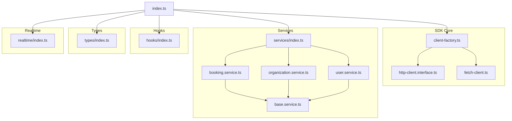
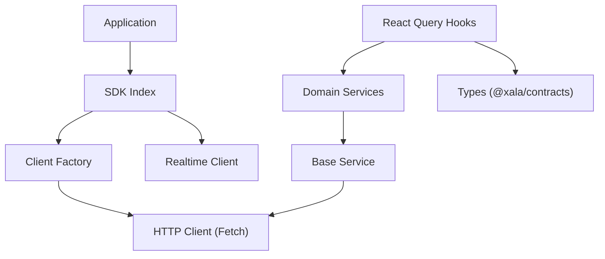
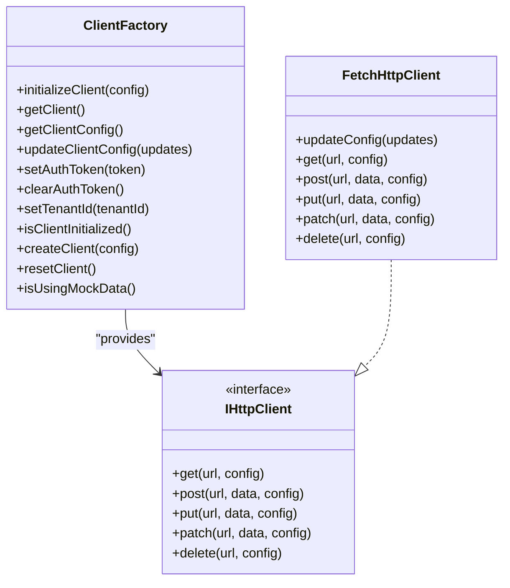
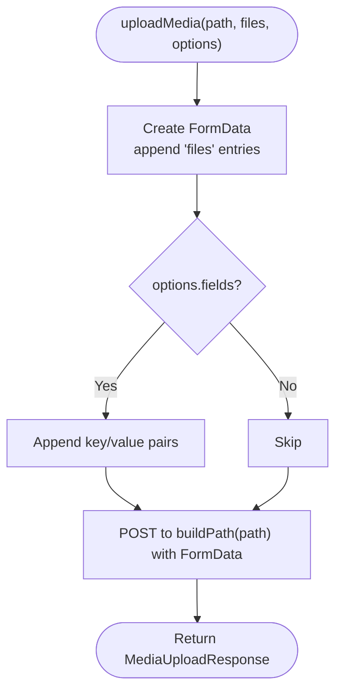
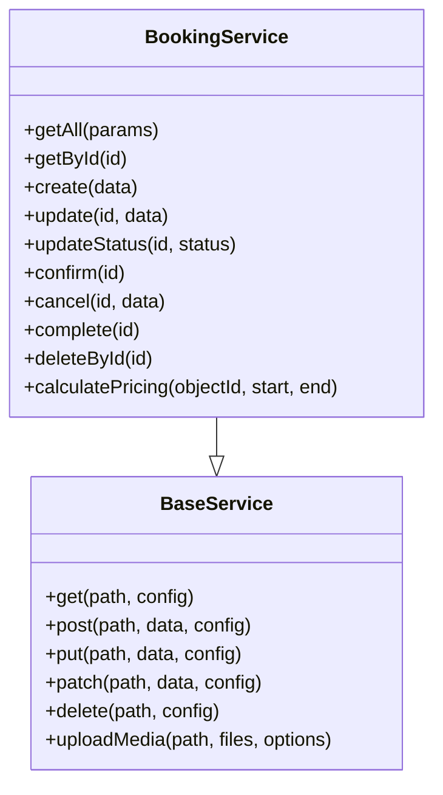
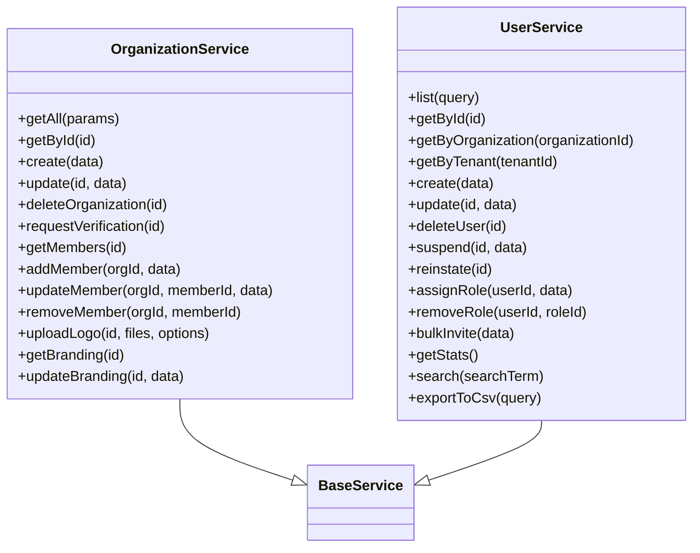
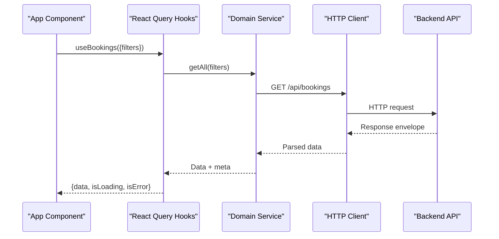
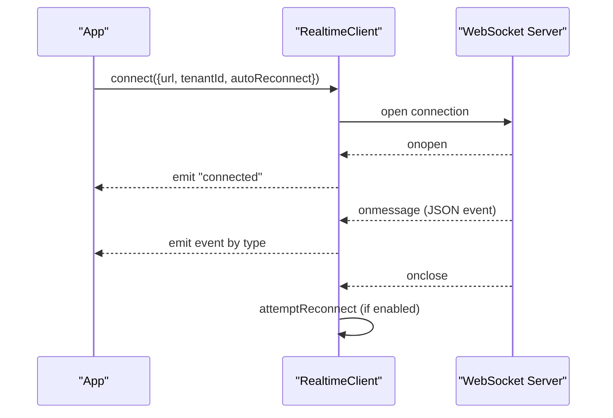
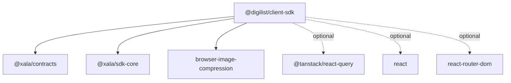

# Client SDK

<cite>
**Referenced Files in This Document**
- [package.json](file://packages/client-sdk/package.json)
- [README.md](file://packages/client-sdk/README.md)
- [index.ts](file://packages/client-sdk/src/index.ts)
- [client-factory.ts](file://packages/client-sdk/src/core/client-factory.ts)
- [http-client.interface.ts](file://packages/client-sdk/src/core/http-client.interface.ts)
- [fetch-client.ts](file://packages/client-sdk/src/core/fetch-client.ts)
- [base.service.ts](file://packages/client-sdk/src/services/base.service.ts)
- [booking.service.ts](file://packages/client-sdk/src/services/booking.service.ts)
- [organization.service.ts](file://packages/client-sdk/src/services/organization.service.ts)
- [user.service.ts](file://packages/client-sdk/src/services/user.service.ts)
- [services/index.ts](file://packages/client-sdk/src/services/index.ts)
- [hooks/index.ts](file://packages/client-sdk/src/hooks/index.ts)
- [types/index.ts](file://packages/client-sdk/src/types/index.ts)
- [realtime/index.ts](file://packages/client-sdk/src/realtime/index.ts)
</cite>

## Table of Contents
1. [Introduction](#introduction)
2. [Project Structure](#project-structure)
3. [Core Components](#core-components)
4. [Architecture Overview](#architecture-overview)
5. [Detailed Component Analysis](#detailed-component-analysis)
6. [Dependency Analysis](#dependency-analysis)
7. [Performance Considerations](#performance-considerations)
8. [Troubleshooting Guide](#troubleshooting-guide)
9. [Conclusion](#conclusion)
10. [Appendices](#appendices)

## Introduction
This document describes the @digilist/client-sdk, an enterprise-grade, type-safe API client for the Xala/Digilist platform. It provides:
- A unified client factory for HTTP requests
- 24 domain services for bookings, users, organizations, integrations, reporting, and more
- React Query hooks for data fetching and mutations
- WebSocket-based real-time event streaming
- Built-in upload utilities with progress tracking and compression
- Strong TypeScript types sourced from shared contracts

The SDK is designed for use across multiple applications in the monorepo and supports both programmatic service usage and declarative React Query hooks.

## Project Structure
The SDK is organized around a core client factory, domain services, React Query hooks, types, and a real-time client. The index barrel exports the most commonly used APIs.

**Diagram sources**
- [index.ts](file://packages/client-sdk/src/index.ts#L1-L168)
- [client-factory.ts](file://packages/client-sdk/src/core/client-factory.ts#L1-L114)
- [http-client.interface.ts](file://packages/client-sdk/src/core/http-client.interface.ts)
- [fetch-client.ts](file://packages/client-sdk/src/core/fetch-client.ts)
- [base.service.ts](file://packages/client-sdk/src/services/base.service.ts#L1-L100)
- [booking.service.ts](file://packages/client-sdk/src/services/booking.service.ts#L1-L200)
- [organization.service.ts](file://packages/client-sdk/src/services/organization.service.ts#L1-L200)
- [user.service.ts](file://packages/client-sdk/src/services/user.service.ts#L1-L150)
- [services/index.ts](file://packages/client-sdk/src/services/index.ts#L1-L234)
- [hooks/index.ts](file://packages/client-sdk/src/hooks/index.ts#L1-L817)
- [types/index.ts](file://packages/client-sdk/src/types/index.ts#L1-L226)
- [realtime/index.ts](file://packages/client-sdk/src/realtime/index.ts#L1-L296)

**Section sources**
- [index.ts](file://packages/client-sdk/src/index.ts#L1-L168)
- [services/index.ts](file://packages/client-sdk/src/services/index.ts#L1-L234)
- [hooks/index.ts](file://packages/client-sdk/src/hooks/index.ts#L1-L817)
- [types/index.ts](file://packages/client-sdk/src/types/index.ts#L1-L226)
- [realtime/index.ts](file://packages/client-sdk/src/realtime/index.ts#L1-L296)

## Core Components
- Client factory: Initializes and manages a shared HTTP client, exposes configuration setters, and provides a typed error type.
- Base service: Provides a common HTTP wrapper and media upload helper.
- Domain services: Typed classes per domain (bookings, organizations, users, etc.) built on the base service.
- React Query hooks: Query keys factory and hooks for fetching, mutating, and subscribing to domain data.
- Types: Canonical type definitions sourced from @xala/contracts plus legacy compatibility types.
- Realtime client: WebSocket client for audit, booking, rental object, message, notification, and monitoring events.

**Section sources**
- [client-factory.ts](file://packages/client-sdk/src/core/client-factory.ts#L1-L114)
- [base.service.ts](file://packages/client-sdk/src/services/base.service.ts#L1-L100)
- [services/index.ts](file://packages/client-sdk/src/services/index.ts#L1-L234)
- [hooks/index.ts](file://packages/client-sdk/src/hooks/index.ts#L1-L817)
- [types/index.ts](file://packages/client-sdk/src/types/index.ts#L1-L226)
- [realtime/index.ts](file://packages/client-sdk/src/realtime/index.ts#L1-L296)

## Architecture Overview
The SDK follows a layered architecture:
- Core layer: HTTP client abstraction and factory
- Services layer: Domain-specific service classes
- Hooks layer: React Query integration for queries, mutations, and subscriptions
- Types layer: Shared type definitions
- Realtime layer: WebSocket event streaming

**Diagram sources**
- [index.ts](file://packages/client-sdk/src/index.ts#L1-L168)
- [client-factory.ts](file://packages/client-sdk/src/core/client-factory.ts#L1-L114)
- [fetch-client.ts](file://packages/client-sdk/src/core/fetch-client.ts)
- [base.service.ts](file://packages/client-sdk/src/services/base.service.ts#L1-L100)
- [services/index.ts](file://packages/client-sdk/src/services/index.ts#L1-L234)
- [hooks/index.ts](file://packages/client-sdk/src/hooks/index.ts#L1-L817)
- [types/index.ts](file://packages/client-sdk/src/types/index.ts#L1-L226)
- [realtime/index.ts](file://packages/client-sdk/src/realtime/index.ts#L1-L296)

## Detailed Component Analysis

### Client Factory and HTTP Layer
- Responsibilities: Initialize, configure, and expose a shared HTTP client; manage auth token and tenant ID; support runtime config updates.
- Key exports: initializeClient, getClient, updateClientConfig, setAuthToken, clearAuthToken, setTenantId, isClientInitialized, createClient, resetClient, isUsingMockData.
- Error handling: Throws descriptive errors when client is not initialized.

**Diagram sources**
- [client-factory.ts](file://packages/client-sdk/src/core/client-factory.ts#L1-L114)
- [http-client.interface.ts](file://packages/client-sdk/src/core/http-client.interface.ts)
- [fetch-client.ts](file://packages/client-sdk/src/core/fetch-client.ts)

**Section sources**
- [client-factory.ts](file://packages/client-sdk/src/core/client-factory.ts#L1-L114)
- [http-client.interface.ts](file://packages/client-sdk/src/core/http-client.interface.ts)
- [fetch-client.ts](file://packages/client-sdk/src/core/fetch-client.ts)

### Base Service and Media Upload
- Responsibilities: Provide a base class for domain services with HTTP helpers and a standardized media upload method.
- Media upload: Accepts multiple files, optional additional fields, and returns a structured media upload response.

**Diagram sources**
- [base.service.ts](file://packages/client-sdk/src/services/base.service.ts#L73-L98)

**Section sources**
- [base.service.ts](file://packages/client-sdk/src/services/base.service.ts#L1-L100)

### Booking Service
- Domain focus: CRUD for bookings, status transitions, pricing calculation, and related operations.
- Methods include getAll, getById, create, update, confirm, cancel, complete, deleteById, calculatePricing, and more.
- Returns standardized response envelopes.

**Diagram sources**
- [base.service.ts](file://packages/client-sdk/src/services/base.service.ts#L1-L100)
- [booking.service.ts](file://packages/client-sdk/src/services/booking.service.ts#L1-L200)

**Section sources**
- [booking.service.ts](file://packages/client-sdk/src/services/booking.service.ts#L1-L200)

### Organization and User Services
- OrganizationService: Manage organizations, members, branding, and logo uploads.
- UserService: Admin-only user management including listing, creating, updating, suspending, role assignment, and bulk invites.

**Diagram sources**
- [organization.service.ts](file://packages/client-sdk/src/services/organization.service.ts#L1-L200)
- [user.service.ts](file://packages/client-sdk/src/services/user.service.ts#L1-L150)
- [base.service.ts](file://packages/client-sdk/src/services/base.service.ts#L1-L100)

**Section sources**
- [organization.service.ts](file://packages/client-sdk/src/services/organization.service.ts#L1-L200)
- [user.service.ts](file://packages/client-sdk/src/services/user.service.ts#L1-L150)

### React Query Integration
- Query keys factory: Centralized key generation for cache invalidation and refetching.
- Hooks: Comprehensive hooks for each domain (bookings, organizations, users, notifications, reports, etc.).
- Mutations: Dedicated hooks for create/update/delete and status transitions.
- Subscriptions: Real-time event hooks for live updates.

**Diagram sources**
- [hooks/index.ts](file://packages/client-sdk/src/hooks/index.ts#L1-L817)
- [booking.service.ts](file://packages/client-sdk/src/services/booking.service.ts#L1-L200)
- [client-factory.ts](file://packages/client-sdk/src/core/client-factory.ts#L1-L114)

**Section sources**
- [hooks/index.ts](file://packages/client-sdk/src/hooks/index.ts#L1-L817)
- [services/index.ts](file://packages/client-sdk/src/services/index.ts#L1-L234)

### Real-time WebSocket Client
- Provides connection lifecycle, event subscription, and reconnection logic.
- Event types include audit, booking, rentalObject, message, notification, monitoring, connected, and pong.
- Helpers to construct WebSocket URLs for audit and tenant-specific streams.

**Diagram sources**
- [realtime/index.ts](file://packages/client-sdk/src/realtime/index.ts#L1-L296)

**Section sources**
- [realtime/index.ts](file://packages/client-sdk/src/realtime/index.ts#L1-L296)

### Type System
- Types are primarily sourced from @xala/contracts for schema-agnostic correctness.
- Legacy types are re-exported for backward compatibility.
- Includes projections, capabilities, enums, and domain DTOs.

**Section sources**
- [types/index.ts](file://packages/client-sdk/src/types/index.ts#L1-L226)

## Dependency Analysis
- Peer dependencies: @tanstack/react-query, react, react-router-dom (optional).
- Internal dependencies: @xala/contracts, @xala/sdk-core, browser-image-compression.
- Exports: index, hooks, types, services namespaces.

**Diagram sources**
- [package.json](file://packages/client-sdk/package.json#L44-L75)

**Section sources**
- [package.json](file://packages/client-sdk/package.json#L1-L101)

## Performance Considerations
- Prefer React Query hooks for automatic caching, background refetching, and optimistic updates where implemented by hooks.
- Use query keys consistently to invalidate and refetch targeted data efficiently.
- For uploads, leverage built-in compression and progress tracking to reduce payload sizes and improve UX.
- Configure autoReconnect for real-time clients judiciously to balance responsiveness and resource usage.
- Use environment-specific base URLs and tenant scoping to minimize cross-tenant cache pollution.

[No sources needed since this section provides general guidance]

## Troubleshooting Guide
- Initialization errors: Ensure initializeClient is called before any service usage.
- Authentication failures: Verify setAuthToken and tenantId are configured correctly.
- Upload issues: Validate file types and sizes; enable compression options when needed.
- Real-time connectivity: Confirm WebSocket URL construction and autoReconnect settings.

**Section sources**
- [client-factory.ts](file://packages/client-sdk/src/core/client-factory.ts#L27-L34)
- [realtime/index.ts](file://packages/client-sdk/src/realtime/index.ts#L39-L101)

## Conclusion
The @digilist/client-sdk offers a cohesive, type-safe, and extensible foundation for building applications against the Xala/Digilist platform. Its modular design, strong typing, React Query integration, and real-time capabilities streamline development while maintaining performance and reliability.

[No sources needed since this section summarizes without analyzing specific files]

## Appendices

### API Reference: Client Factory
- initializeClient(config): Creates and stores the default HTTP client.
- getClient(): Returns the initialized client.
- getClientConfig(): Returns current configuration.
- updateClientConfig(updates): Updates runtime configuration.
- setAuthToken(token), clearAuthToken(): Manage bearer token.
- setTenantId(tenantId): Set tenant context.
- isClientInitialized(): Boolean check.
- createClient(config): Create a new client instance.
- resetClient(): Clear global client and config.
- isUsingMockData(): Detects mock mode.

**Section sources**
- [client-factory.ts](file://packages/client-sdk/src/core/client-factory.ts#L17-L114)

### API Reference: Services Overview
- BookingService: getAll, getById, create, update, confirm, cancel, complete, deleteById, calculatePricing.
- OrganizationService: getAll, getById, create, update, deleteOrganization, requestVerification, getMembers, addMember, updateMember, removeMember, uploadLogo, getBranding, updateBranding.
- UserService: list, getById, getByOrganization, getByTenant, create, update, deleteUser, suspend, reinstate, assignRole, removeRole, bulkInvite, getStats, search, exportToCsv.

**Section sources**
- [booking.service.ts](file://packages/client-sdk/src/services/booking.service.ts#L1-L200)
- [organization.service.ts](file://packages/client-sdk/src/services/organization.service.ts#L1-L200)
- [user.service.ts](file://packages/client-sdk/src/services/user.service.ts#L1-L150)

### API Reference: Real-time Events
- realtimeClient.connect(config): Establishes WebSocket connection with optional autoReconnect.
- realtimeClient.on(eventType, handler): Subscribe to specific event types.
- realtimeClient.onAudit/onBooking/onRentalObject/onMessage/onMonitoring/onAll: Convenience handlers.
- createAuditWebSocketUrl(baseUrl), createTenantWebSocketUrl(baseUrl, tenantId): Build WebSocket URLs.

**Section sources**
- [realtime/index.ts](file://packages/client-sdk/src/realtime/index.ts#L1-L296)

### Migration and Compatibility Notes
- Types are sourced from @xala/contracts; consult the contracts package for schema changes.
- Service method signatures and response envelopes follow standardized patterns; refer to individual service files for exact shapes.
- Real-time event payloads are typed via RealtimeEvent; ensure consumers handle wildcard and specific event types appropriately.

**Section sources**
- [types/index.ts](file://packages/client-sdk/src/types/index.ts#L14-L42)
- [services/index.ts](file://packages/client-sdk/src/services/index.ts#L1-L234)
- [realtime/index.ts](file://packages/client-sdk/src/realtime/index.ts#L8-L16)