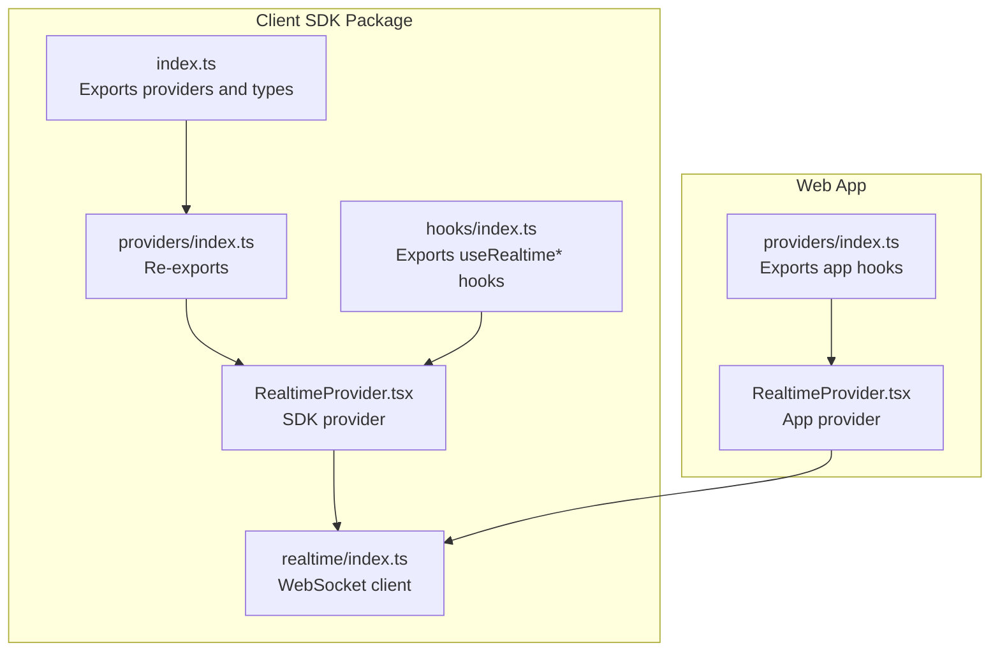
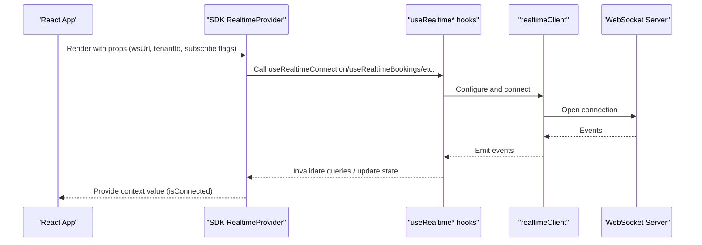
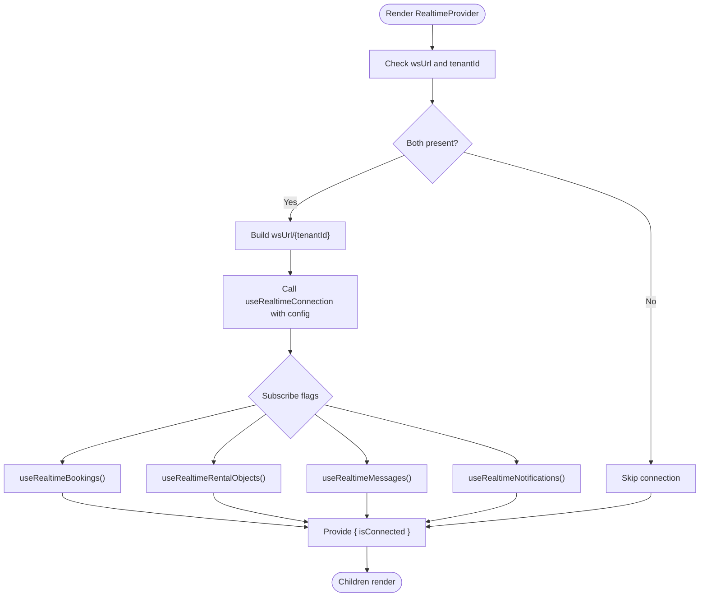
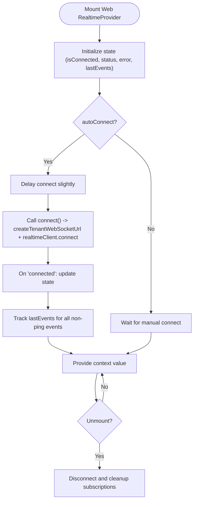
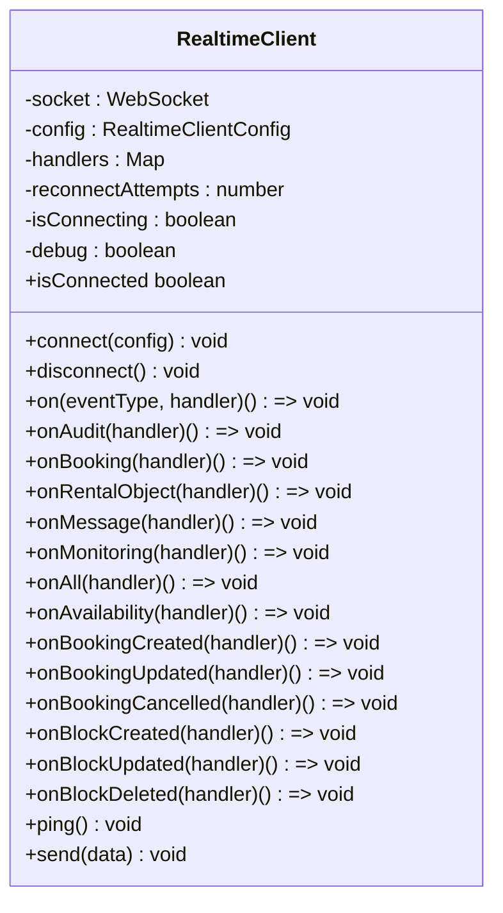
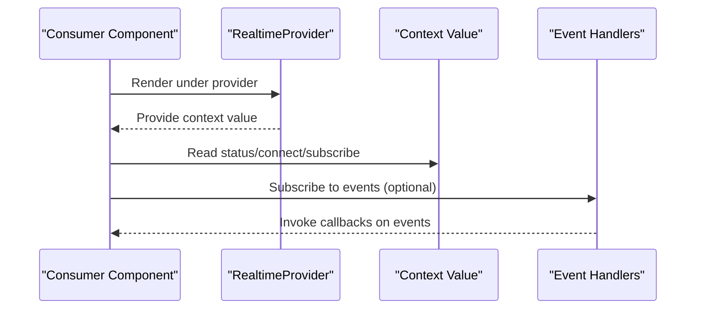
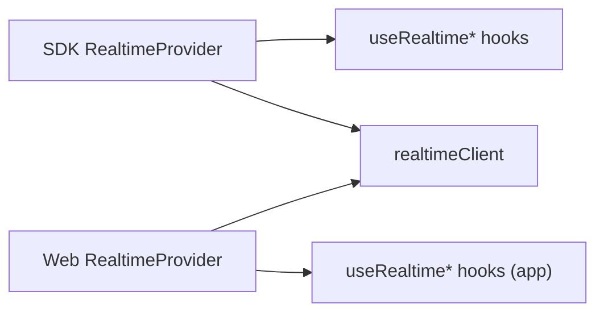

# Context Providers

<cite>
**Referenced Files in This Document**
- [packages/client-sdk/src/index.ts](file://packages/client-sdk/src/index.ts)
- [packages/client-sdk/src/providers/RealtimeProvider.tsx](file://packages/client-sdk/src/providers/RealtimeProvider.tsx)
- [packages/client-sdk/src/providers/index.ts](file://packages/client-sdk/src/providers/index.ts)
- [packages/client-sdk/src/realtime/index.ts](file://packages/client-sdk/src/realtime/index.ts)
- [apps/web/src/providers/RealtimeProvider.tsx](file://apps/web/src/providers/RealtimeProvider.tsx)
- [apps/web/src/providers/index.ts](file://apps/web/src/providers/index.ts)
- [packages/client-sdk/src/hooks/index.ts](file://packages/client-sdk/src/hooks/index.ts)
</cite>

## Table of Contents
1. [Introduction](#introduction)
2. [Project Structure](#project-structure)
3. [Core Components](#core-components)
4. [Architecture Overview](#architecture-overview)
5. [Detailed Component Analysis](#detailed-component-analysis)
6. [Dependency Analysis](#dependency-analysis)
7. [Performance Considerations](#performance-considerations)
8. [Troubleshooting Guide](#troubleshooting-guide)
9. [Conclusion](#conclusion)

## Introduction
This document explains the React context providers in the Client SDK with a focus on the RealtimeProvider. It covers the provider implementation, context value structure, configuration options, and how providers enable cross-component communication, shared state management, and real-time updates coordination. Practical usage patterns, composition strategies, lifecycle and cleanup, performance considerations, and debugging techniques are included to help teams integrate the SDK into existing React applications effectively.

## Project Structure
The Client SDK exposes a compact set of React providers and hooks. The RealtimeProvider is implemented in two places:
- A lightweight, SDK-focused provider in the Client SDK package
- A richer, application-focused provider in the Web app package

These providers share a common goal: to establish and maintain a WebSocket connection and expose a typed context for real-time event handling.

**Diagram sources**
- [packages/client-sdk/src/index.ts](file://packages/client-sdk/src/index.ts#L162-L164)
- [packages/client-sdk/src/providers/index.ts](file://packages/client-sdk/src/providers/index.ts#L6-L7)
- [packages/client-sdk/src/providers/RealtimeProvider.tsx](file://packages/client-sdk/src/providers/RealtimeProvider.tsx#L1-L98)
- [packages/client-sdk/src/realtime/index.ts](file://packages/client-sdk/src/realtime/index.ts#L1-L296)
- [apps/web/src/providers/RealtimeProvider.tsx](file://apps/web/src/providers/RealtimeProvider.tsx#L1-L322)
- [apps/web/src/providers/index.ts](file://apps/web/src/providers/index.ts#L6-L17)

**Section sources**
- [packages/client-sdk/src/index.ts](file://packages/client-sdk/src/index.ts#L162-L164)
- [packages/client-sdk/src/providers/index.ts](file://packages/client-sdk/src/providers/index.ts#L1-L8)
- [apps/web/src/providers/index.ts](file://apps/web/src/providers/index.ts#L1-L23)

## Core Components
- RealtimeProvider (SDK package): Minimal provider that wires up WebSocket connections and domain-specific subscriptions via SDK hooks. It exposes a simple context with connection status.
- RealtimeProvider (Web app): Rich provider that manages connection lifecycle, status, error tracking, event history, and convenience hooks for subscribing to specific event types. It integrates with the SDK’s realtime client.

Key exports and types:
- SDK exports: RealtimeProvider, useRealtimeStatus, RealtimeProviderProps, RealtimeContextValue
- Web app exports: RealtimeProvider, useRealtimeContext, useRealtimeStatus, useRealtimeBooking, useRealtimeRentalObject, useRealtimeAudit, useRealtimeNotification, useRealtimeMessage, useRealtimeAll, useRealtimeSlotAvailability, plus types

**Section sources**
- [packages/client-sdk/src/providers/RealtimeProvider.tsx](file://packages/client-sdk/src/providers/RealtimeProvider.tsx#L15-L35)
- [packages/client-sdk/src/providers/RealtimeProvider.tsx](file://packages/client-sdk/src/providers/RealtimeProvider.tsx#L95-L97)
- [packages/client-sdk/src/index.ts](file://packages/client-sdk/src/index.ts#L162-L164)
- [apps/web/src/providers/RealtimeProvider.tsx](file://apps/web/src/providers/RealtimeProvider.tsx#L22-L49)
- [apps/web/src/providers/RealtimeProvider.tsx](file://apps/web/src/providers/RealtimeProvider.tsx#L185-L191)
- [apps/web/src/providers/index.ts](file://apps/web/src/providers/index.ts#L6-L17)

## Architecture Overview
The SDK’s RealtimeProvider composes several domain-specific hooks to subscribe to real-time events. The Web app’s RealtimeProvider wraps the SDK’s realtime client, manages connection state, and exposes a richer context for UI components.

**Diagram sources**
- [packages/client-sdk/src/providers/RealtimeProvider.tsx](file://packages/client-sdk/src/providers/RealtimeProvider.tsx#L47-L90)
- [packages/client-sdk/src/realtime/index.ts](file://packages/client-sdk/src/realtime/index.ts#L28-L112)
- [packages/client-sdk/src/hooks/index.ts](file://packages/client-sdk/src/hooks/index.ts#L300-L313)

**Section sources**
- [packages/client-sdk/src/providers/RealtimeProvider.tsx](file://packages/client-sdk/src/providers/RealtimeProvider.tsx#L47-L90)
- [packages/client-sdk/src/realtime/index.ts](file://packages/client-sdk/src/realtime/index.ts#L28-L112)
- [packages/client-sdk/src/hooks/index.ts](file://packages/client-sdk/src/hooks/index.ts#L300-L313)

## Detailed Component Analysis

### SDK RealtimeProvider
- Purpose: Provide a minimal, SDK-centric real-time context with connection status.
- Context value: isConnected boolean.
- Configuration:
  - wsUrl: WebSocket endpoint; if omitted, provider disables real-time.
  - tenantId: Multi-tenancy support appended to the URL.
  - subscribeBookings, subscribeRentalObjects, subscribeMessages, subscribeNotifications: Toggle domain subscriptions.
- Behavior:
  - Builds a tenant-aware WebSocket URL.
  - Establishes connection with auto-reconnect and bounded attempts.
  - Subscribes to domain events (bookings, rental objects, messages, notifications) via SDK hooks.
  - Exposes a simple context value for consumers.

**Diagram sources**
- [packages/client-sdk/src/providers/RealtimeProvider.tsx](file://packages/client-sdk/src/providers/RealtimeProvider.tsx#L47-L90)

**Section sources**
- [packages/client-sdk/src/providers/RealtimeProvider.tsx](file://packages/client-sdk/src/providers/RealtimeProvider.tsx#L15-L35)
- [packages/client-sdk/src/providers/RealtimeProvider.tsx](file://packages/client-sdk/src/providers/RealtimeProvider.tsx#L47-L90)

### Web App RealtimeProvider
- Purpose: Application-level provider with robust connection management, status tracking, and event history.
- Context value: isConnected, status, error, connect, disconnect, subscribe, lastEvents.
- Configuration:
  - baseUrl: API base URL (defaults to environment variable).
  - tenantId: Tenant identifier for WebSocket URL construction.
  - autoConnect: Whether to connect automatically on mount.
  - enableInDev: Whether to enable real-time in development.
- Behavior:
  - Creates tenant-specific WebSocket URL using SDK utilities.
  - Manages connection lifecycle with explicit connect/disconnect.
  - Tracks last events per type for debugging and UI display.
  - Exposes convenience hooks for specific event types and status.
  - Cleans up subscriptions on unmount.

**Diagram sources**
- [apps/web/src/providers/RealtimeProvider.tsx](file://apps/web/src/providers/RealtimeProvider.tsx#L61-L176)

**Section sources**
- [apps/web/src/providers/RealtimeProvider.tsx](file://apps/web/src/providers/RealtimeProvider.tsx#L22-L49)
- [apps/web/src/providers/RealtimeProvider.tsx](file://apps/web/src/providers/RealtimeProvider.tsx#L61-L176)
- [apps/web/src/providers/RealtimeProvider.tsx](file://apps/web/src/providers/RealtimeProvider.tsx#L185-L191)

### Realtime Client (SDK)
- Role: Centralized WebSocket client managing connection, subscriptions, reconnection, and event emission.
- Features:
  - Connect/disconnect lifecycle.
  - Subscription model with event-type-specific and wildcard handlers.
  - Built-in subscription message to server (tenant-scoped).
  - Reconnection with configurable interval and attempts.
  - Debug logging toggle.

**Diagram sources**
- [packages/client-sdk/src/realtime/index.ts](file://packages/client-sdk/src/realtime/index.ts#L28-L276)

**Section sources**
- [packages/client-sdk/src/realtime/index.ts](file://packages/client-sdk/src/realtime/index.ts#L6-L26)
- [packages/client-sdk/src/realtime/index.ts](file://packages/client-sdk/src/realtime/index.ts#L28-L112)
- [packages/client-sdk/src/realtime/index.ts](file://packages/client-sdk/src/realtime/index.ts#L117-L169)
- [packages/client-sdk/src/realtime/index.ts](file://packages/client-sdk/src/realtime/index.ts#L278-L296)

### Provider Composition and Usage Patterns
- Composition: Wrap your app (or feature subtree) with the chosen RealtimeProvider. The SDK provider is suitable for SDK-centric usage; the Web app provider adds UI-friendly features.
- Context consumption:
  - SDK: useRealtimeStatus to read isConnected.
  - Web app: useRealtimeContext for full status, connect/disconnect, subscribe, and lastEvents; useRealtimeStatus for simplified status tuple.
- Event-specific hooks (Web app):
  - useRealtimeBooking, useRealtimeRentalObject, useRealtimeAudit, useRealtimeNotification, useRealtimeMessage, useRealtimeAll, useRealtimeSlotAvailability.

**Diagram sources**
- [apps/web/src/providers/RealtimeProvider.tsx](file://apps/web/src/providers/RealtimeProvider.tsx#L161-L169)
- [apps/web/src/providers/RealtimeProvider.tsx](file://apps/web/src/providers/RealtimeProvider.tsx#L185-L191)

**Section sources**
- [packages/client-sdk/src/providers/RealtimeProvider.tsx](file://packages/client-sdk/src/providers/RealtimeProvider.tsx#L95-L97)
- [apps/web/src/providers/RealtimeProvider.tsx](file://apps/web/src/providers/RealtimeProvider.tsx#L185-L191)
- [apps/web/src/providers/index.ts](file://apps/web/src/providers/index.ts#L6-L17)

## Dependency Analysis
- SDK RealtimeProvider depends on:
  - SDK hooks for real-time subscriptions (useRealtimeConnection, useRealtimeBookings, useRealtimeRentalObjects, useRealtimeMessages, useRealtimeNotifications).
  - SDK realtime client for connection management.
- Web App RealtimeProvider depends on:
  - SDK realtime client and URL builders.
  - React state and effects for lifecycle management.
  - Convenience hooks for event-specific subscriptions.

**Diagram sources**
- [packages/client-sdk/src/providers/RealtimeProvider.tsx](file://packages/client-sdk/src/providers/RealtimeProvider.tsx#L7-L13)
- [packages/client-sdk/src/realtime/index.ts](file://packages/client-sdk/src/realtime/index.ts#L28-L112)
- [apps/web/src/providers/RealtimeProvider.tsx](file://apps/web/src/providers/RealtimeProvider.tsx#L8-L16)

**Section sources**
- [packages/client-sdk/src/providers/RealtimeProvider.tsx](file://packages/client-sdk/src/providers/RealtimeProvider.tsx#L7-L13)
- [packages/client-sdk/src/hooks/index.ts](file://packages/client-sdk/src/hooks/index.ts#L300-L313)
- [packages/client-sdk/src/realtime/index.ts](file://packages/client-sdk/src/realtime/index.ts#L28-L112)
- [apps/web/src/providers/RealtimeProvider.tsx](file://apps/web/src/providers/RealtimeProvider.tsx#L8-L16)

## Performance Considerations
- Connection strategy:
  - Prefer the Web app provider’s managed lifecycle for production apps to avoid redundant connections and ensure proper cleanup.
  - Use subscribe flags in the SDK provider to limit event traffic to required domains.
- Reconnection:
  - Tune reconnectInterval and maxReconnectAttempts to balance resilience and resource usage.
- Event handling:
  - Avoid heavy work in event handlers; defer rendering updates to minimize layout thrashing.
  - Use event filtering (e.g., by listing ID in slot availability hook) to reduce unnecessary UI updates.
- Caching and invalidation:
  - SDK hooks leverage React Query; ensure query keys and invalidation patterns align with your caching strategy to prevent stale data.

[No sources needed since this section provides general guidance]

## Troubleshooting Guide
- Connection not establishing:
  - Verify wsUrl and tenantId configuration.
  - Check environment variables for baseUrl and tenantId in the Web app provider.
  - Inspect status and error fields from the context to diagnose connection issues.
- No events received:
  - Confirm that subscribe flags are enabled in the SDK provider or that event-specific hooks are used in the Web app provider.
  - Ensure the server supports tenant-scoped subscriptions and that the subscription message is accepted.
- Cleanup and memory leaks:
  - The Web app provider cleans up subscriptions on unmount; ensure components using event hooks are properly unmounted.
  - For manual subscriptions, always capture and call the returned unsubscribe function.
- Debugging:
  - Enable debug logging in the realtime client to inspect raw messages and emitted events.
  - Use lastEvents to inspect the most recent event per type for diagnostics.

**Section sources**
- [apps/web/src/providers/RealtimeProvider.tsx](file://apps/web/src/providers/RealtimeProvider.tsx#L76-L98)
- [apps/web/src/providers/RealtimeProvider.tsx](file://apps/web/src/providers/RealtimeProvider.tsx#L115-L152)
- [packages/client-sdk/src/realtime/index.ts](file://packages/client-sdk/src/realtime/index.ts#L48-L101)
- [packages/client-sdk/src/realtime/index.ts](file://packages/client-sdk/src/realtime/index.ts#L245-L256)

## Conclusion
The Client SDK provides two complementary RealtimeProvider implementations:
- A minimal SDK provider for lightweight, SDK-centric real-time integration.
- A rich Web app provider offering robust lifecycle management, status tracking, and convenient hooks.

Together, they enable reliable cross-component communication, shared state management, and coordinated real-time updates. Teams should choose the Web app provider for production React applications and use the SDK provider when integrating SDK hooks directly. Proper configuration, subscription scoping, and lifecycle cleanup are essential for performance and reliability.