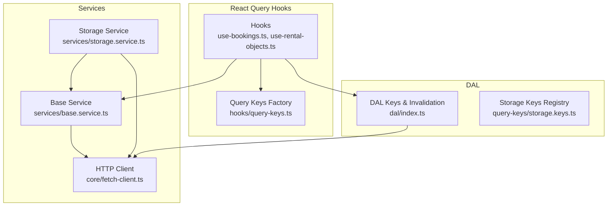
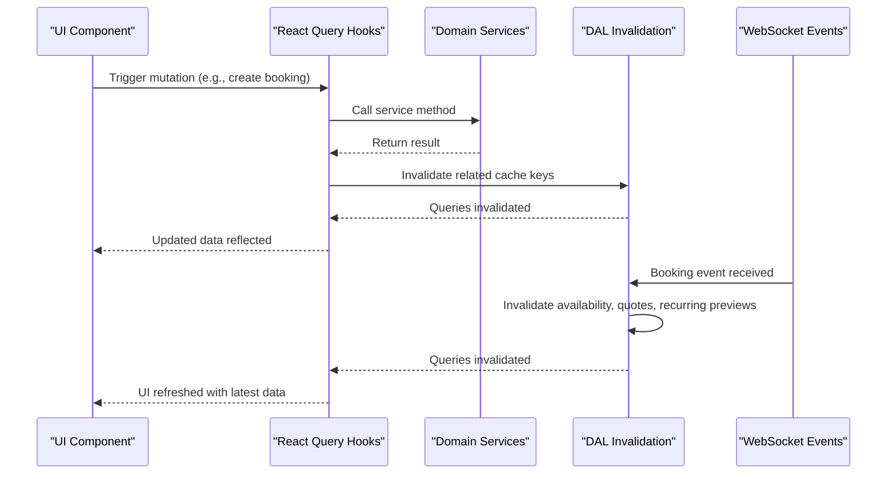
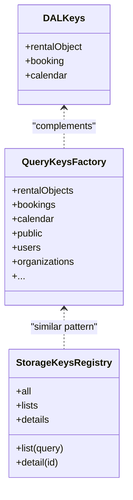
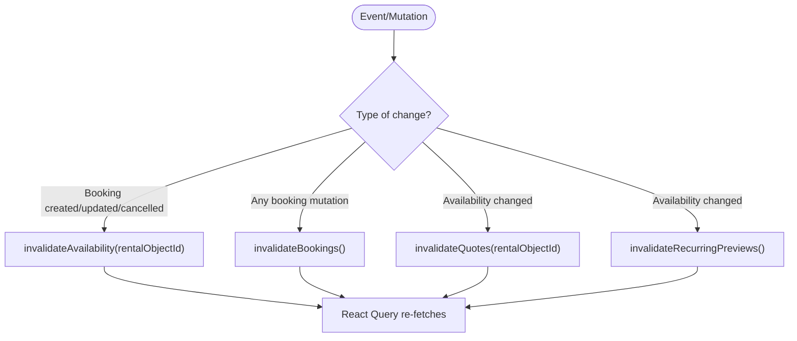
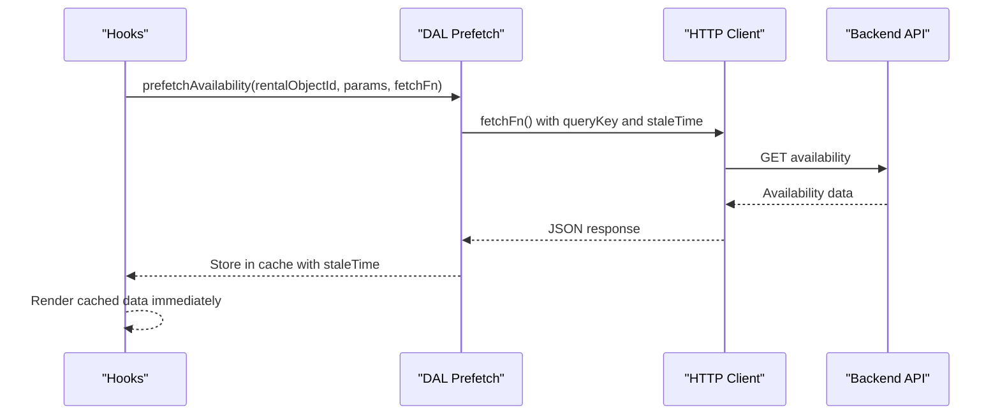
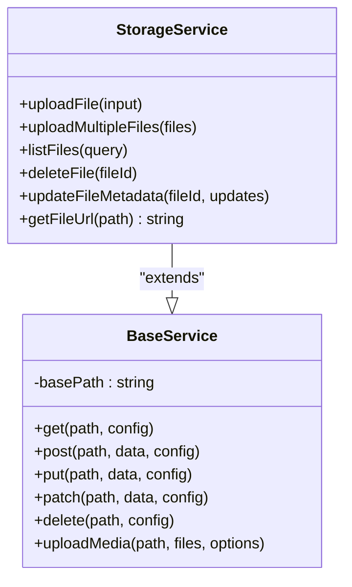
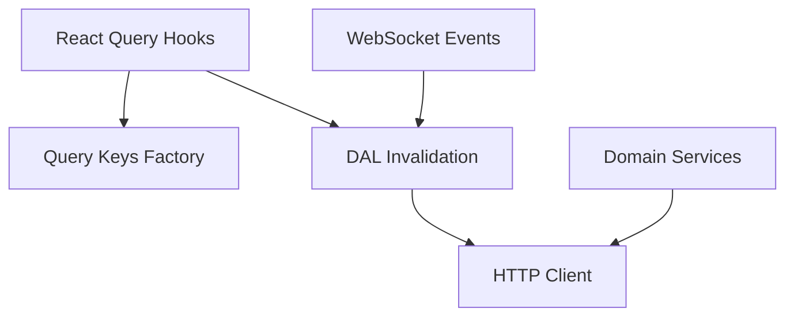

# Data Access Layer (DAL)

<cite>
**Referenced Files in This Document**
- [index.ts](file://packages/client-sdk/src/dal/index.ts)
- [storage.keys.ts](file://packages/client-sdk/src/query-keys/storage.keys.ts)
- [query-keys.ts](file://packages/client-sdk/src/hooks/query-keys.ts)
- [use-bookings.ts](file://packages/client-sdk/src/hooks/use-bookings.ts)
- [use-rental-objects.ts](file://packages/client-sdk/src/hooks/use-rental-objects.ts)
- [fetch-client.ts](file://packages/client-sdk/src/core/fetch-client.ts)
- [base.service.ts](file://packages/client-sdk/src/services/base.service.ts)
- [storage.service.ts](file://packages/client-sdk/src/services/storage.service.ts)
- [index.ts](file://packages/client-sdk/src/index.ts)
</cite>

## Table of Contents
1. [Introduction](#introduction)
2. [Project Structure](#project-structure)
3. [Core Components](#core-components)
4. [Architecture Overview](#architecture-overview)
5. [Detailed Component Analysis](#detailed-component-analysis)
6. [Dependency Analysis](#dependency-analysis)
7. [Performance Considerations](#performance-considerations)
8. [Troubleshooting Guide](#troubleshooting-guide)
9. [Conclusion](#conclusion)

## Introduction
This document explains the Data Access Layer (DAL) architecture within the Client SDK, focusing on query key management, cache invalidation, and data persistence patterns. It covers:
- Centralized query key factories for domain entities
- Cache invalidation policies triggered by mutations and WebSocket events
- Data synchronization mechanisms and offline handling considerations
- Background sync processes and conflict resolution strategies
- Practical examples for cache configuration, custom storage implementations, and performance optimization
- Data lifecycle management, cleanup procedures, and storage quota considerations

## Project Structure
The DAL sits at the intersection of React Query hooks, centralized query keys, and service-layer HTTP clients. The SDK exposes:
- A domain-specific DAL module for query keys and invalidation helpers
- A comprehensive query keys factory for React Query
- A storage-specific query keys registry
- HTTP client abstractions and service classes implementing CRUD and media operations

**Diagram sources**
- [index.ts](file://packages/client-sdk/src/dal/index.ts#L1-L230)
- [storage.keys.ts](file://packages/client-sdk/src/query-keys/storage.keys.ts#L1-L17)
- [query-keys.ts](file://packages/client-sdk/src/hooks/query-keys.ts#L1-L568)
- [use-bookings.ts](file://packages/client-sdk/src/hooks/use-bookings.ts#L1-L356)
- [use-rental-objects.ts](file://packages/client-sdk/src/hooks/use-rental-objects.ts#L1-L479)
- [base.service.ts](file://packages/client-sdk/src/services/base.service.ts#L1-L100)
- [storage.service.ts](file://packages/client-sdk/src/services/storage.service.ts#L1-L111)
- [fetch-client.ts](file://packages/client-sdk/src/core/fetch-client.ts#L1-L211)

**Section sources**
- [index.ts](file://packages/client-sdk/src/index.ts#L159-L168)
- [index.ts](file://packages/client-sdk/src/dal/index.ts#L1-L230)
- [storage.keys.ts](file://packages/client-sdk/src/query-keys/storage.keys.ts#L1-L17)
- [query-keys.ts](file://packages/client-sdk/src/hooks/query-keys.ts#L1-L568)
- [use-bookings.ts](file://packages/client-sdk/src/hooks/use-bookings.ts#L1-L356)
- [use-rental-objects.ts](file://packages/client-sdk/src/hooks/use-rental-objects.ts#L1-L479)
- [base.service.ts](file://packages/client-sdk/src/services/base.service.ts#L1-L100)
- [storage.service.ts](file://packages/client-sdk/src/services/storage.service.ts#L1-L111)
- [fetch-client.ts](file://packages/client-sdk/src/core/fetch-client.ts#L1-L211)

## Core Components
- DAL Keys and Invalidation: Centralizes query key construction and invalidation helpers for rentals, bookings, calendars, and WebSocket events.
- Query Keys Factory: Strongly typed keys for all domains, enabling precise cache targeting and prefetching.
- Storage Keys Registry: Dedicated keys for storage/list operations.
- HTTP Client: Fetch-based client with standardized request/response handling and error propagation.
- Base Service and Storage Service: Abstractions for API calls and specialized file upload/download operations.

**Section sources**
- [index.ts](file://packages/client-sdk/src/dal/index.ts#L19-L230)
- [query-keys.ts](file://packages/client-sdk/src/hooks/query-keys.ts#L23-L568)
- [storage.keys.ts](file://packages/client-sdk/src/query-keys/storage.keys.ts#L8-L17)
- [fetch-client.ts](file://packages/client-sdk/src/core/fetch-client.ts#L10-L211)
- [base.service.ts](file://packages/client-sdk/src/services/base.service.ts#L11-L100)
- [storage.service.ts](file://packages/client-sdk/src/services/storage.service.ts#L17-L111)

## Architecture Overview
The DAL ensures a single source of truth for query keys and cache invalidation. React Query hooks use the query keys factory to define cache scopes. Mutations trigger targeted invalidations. DAL invalidation helpers encapsulate domain-specific invalidation logic. WebSocket events drive global cache refresh for availability and related views.

**Diagram sources**
- [use-bookings.ts](file://packages/client-sdk/src/hooks/use-bookings.ts#L81-L170)
- [index.ts](file://packages/client-sdk/src/dal/index.ts#L82-L179)
- [fetch-client.ts](file://packages/client-sdk/src/core/fetch-client.ts#L74-L189)

## Detailed Component Analysis

### Query Key Management
- Domain-specific keys: The DAL defines structured keys for rental objects, bookings, and calendars, ensuring consistent cache scoping.
- Comprehensive keys factory: The hooks query keys factory provides strongly typed keys across all domains, enabling precise targeting for prefetching and invalidation.
- Storage keys registry: Dedicated keys for storage list/detail operations.

**Diagram sources**
- [index.ts](file://packages/client-sdk/src/dal/index.ts#L19-L76)
- [query-keys.ts](file://packages/client-sdk/src/hooks/query-keys.ts#L23-L568)
- [storage.keys.ts](file://packages/client-sdk/src/query-keys/storage.keys.ts#L8-L17)

**Section sources**
- [index.ts](file://packages/client-sdk/src/dal/index.ts#L19-L76)
- [query-keys.ts](file://packages/client-sdk/src/hooks/query-keys.ts#L23-L568)
- [storage.keys.ts](file://packages/client-sdk/src/query-keys/storage.keys.ts#L8-L17)

### Cache Invalidation Policies
- Availability invalidation: Triggered when booking lifecycle events occur, ensuring availability and calendar views stay synchronized.
- Booking invalidation: Global invalidation of booking lists and details after mutations.
- Quote and recurring preview invalidation: Ensures pricing previews remain consistent with availability changes.
- WebSocket event handling: Central handler invalidates affected caches upon receiving booking events.

**Diagram sources**
- [index.ts](file://packages/client-sdk/src/dal/index.ts#L82-L179)

**Section sources**
- [index.ts](file://packages/client-sdk/src/dal/index.ts#L82-L179)

### Data Synchronization and Offline Handling
- Stale-time configuration: Hooks set staleTime for long-lived resources (e.g., categories) to balance freshness and performance.
- Prefetch helpers: DAL provides prefetch helpers for availability and calendar configuration with short stale times to keep UI responsive.
- Error handling: HTTP client normalizes error responses and propagates them to callers, enabling UI to surface meaningful errors during offline attempts.

**Diagram sources**
- [index.ts](file://packages/client-sdk/src/dal/index.ts#L200-L229)
- [fetch-client.ts](file://packages/client-sdk/src/core/fetch-client.ts#L191-L209)

**Section sources**
- [use-rental-objects.ts](file://packages/client-sdk/src/hooks/use-rental-objects.ts#L111-L129)
- [index.ts](file://packages/client-sdk/src/dal/index.ts#L200-L229)
- [fetch-client.ts](file://packages/client-sdk/src/core/fetch-client.ts#L191-L209)

### Data Persistence Patterns and Storage Operations
- Base service abstraction: Provides generic HTTP methods and a media upload helper for multipart/form-data uploads.
- Storage service: Implements file upload, multiple-file upload, listing, deletion, and metadata updates. Also resolves absolute URLs for stored assets.
- URL resolution: Handles both relative storage paths and seed image paths, converting them to absolute URLs using the configured base URL.

**Diagram sources**
- [base.service.ts](file://packages/client-sdk/src/services/base.service.ts#L11-L100)
- [storage.service.ts](file://packages/client-sdk/src/services/storage.service.ts#L17-L111)

**Section sources**
- [base.service.ts](file://packages/client-sdk/src/services/base.service.ts#L11-L100)
- [storage.service.ts](file://packages/client-sdk/src/services/storage.service.ts#L17-L111)

### Conflict Resolution Strategies
- Mutation-side invalidation: After successful mutations, targeted invalidations ensure subsequent reads fetch fresh data from the server.
- WebSocket-driven refresh: Real-time events invalidate availability and related caches, reducing staleness caused by concurrent edits.
- Selection hashing: A deterministic hash derived from booking selections supports consistent caching of quote and recurring preview results.

**Section sources**
- [index.ts](file://packages/client-sdk/src/dal/index.ts#L102-L179)
- [index.ts](file://packages/client-sdk/src/dal/index.ts#L184-L191)

### Practical Examples

#### Cache Configuration
- Categories caching: Long staleTime to minimize network requests for static data.
- Availability and calendar config: Short staleTime to keep UI responsive while avoiding excessive freshness.
- Selection-based caching: Use selection hash to cache quote and recurring preview results.

**Section sources**
- [use-rental-objects.ts](file://packages/client-sdk/src/hooks/use-rental-objects.ts#L111-L129)
- [index.ts](file://packages/client-sdk/src/dal/index.ts#L200-L229)
- [index.ts](file://packages/client-sdk/src/dal/index.ts#L184-L191)

#### Custom Storage Implementations
- Extend BaseService to add domain-specific upload flows.
- Use uploadMedia for multipart/form-data uploads with optional fields.
- Implement custom URL resolution logic if your storage backend uses different path conventions.

**Section sources**
- [base.service.ts](file://packages/client-sdk/src/services/base.service.ts#L73-L98)
- [storage.service.ts](file://packages/client-sdk/src/services/storage.service.ts#L17-L111)

#### Performance Optimization Techniques
- Prefer targeted invalidations over global cache resets.
- Use prefetch helpers for anticipated navigation to reduce perceived latency.
- Compress images before upload to reduce payload sizes and improve throughput.

**Section sources**
- [index.ts](file://packages/client-sdk/src/dal/index.ts#L82-L179)
- [index.ts](file://packages/client-sdk/src/dal/index.ts#L200-L229)
- [use-rental-objects.ts](file://packages/client-sdk/src/hooks/use-rental-objects.ts#L405-L432)

### Data Lifecycle Management and Cleanup
- Lifecycle stages: Create, update, publish/archive, unpublish, restore, duplicate, delete.
- Invalidation strategy: Each mutation triggers invalidations for affected lists and details to maintain consistency.
- Cleanup procedures: Deleting a rental object invalidates lists; deleting media invalidates the rental object detail.

**Section sources**
- [use-rental-objects.ts](file://packages/client-sdk/src/hooks/use-rental-objects.ts#L138-L251)
- [use-rental-objects.ts](file://packages/client-sdk/src/hooks/use-rental-objects.ts#L405-L448)

### Storage Quota Considerations
- File upload limits: Enforce client-side checks for file sizes and counts before initiating uploads.
- Compression: Enable automatic compression for images to reduce bandwidth and storage footprint.
- Metadata updates: Use updateFileMetadata to manage alt text and captions, aiding discoverability and accessibility.

**Section sources**
- [storage.service.ts](file://packages/client-sdk/src/services/storage.service.ts#L25-L85)
- [use-rental-objects.ts](file://packages/client-sdk/src/hooks/use-rental-objects.ts#L405-L432)

## Dependency Analysis
The DAL orchestrates cache invalidation across domain boundaries. Hooks depend on the query keys factory and DAL invalidation helpers. Services depend on the HTTP client for transport. WebSocket events feed into DAL invalidation to synchronize state.

**Diagram sources**
- [use-bookings.ts](file://packages/client-sdk/src/hooks/use-bookings.ts#L1-L356)
- [query-keys.ts](file://packages/client-sdk/src/hooks/query-keys.ts#L1-L568)
- [index.ts](file://packages/client-sdk/src/dal/index.ts#L1-L230)
- [fetch-client.ts](file://packages/client-sdk/src/core/fetch-client.ts#L1-L211)

**Section sources**
- [use-bookings.ts](file://packages/client-sdk/src/hooks/use-bookings.ts#L1-L356)
- [index.ts](file://packages/client-sdk/src/dal/index.ts#L1-L230)
- [fetch-client.ts](file://packages/client-sdk/src/core/fetch-client.ts#L1-L211)

## Performance Considerations
- Use targeted invalidations to avoid unnecessary refetches.
- Configure appropriate staleTime for domain-specific data to balance freshness and performance.
- Leverage prefetch helpers for anticipated navigation to improve perceived performance.
- Compress images before upload to reduce payload sizes.

## Troubleshooting Guide
- Unauthorized responses: The HTTP client triggers onUnauthorized and throws a standardized ApiError.
- Network timeouts: AbortController-based timeouts propagate as ApiError with TIMEOUT code.
- RFC7807 errors: Normalized problem+json responses are mapped to ApiError with structured details.
- 204 No Content: Handled transparently by returning an empty object.

**Section sources**
- [fetch-client.ts](file://packages/client-sdk/src/core/fetch-client.ts#L108-L188)

## Conclusion
The Client SDK’s DAL provides a robust, centralized approach to query key management and cache invalidation. By combining strong typing, targeted invalidations, and prefetch strategies, it ensures consistent, up-to-date UI behavior across domains. The HTTP client and service abstractions enable extensibility for custom storage and media operations, while WebSocket event handling keeps the UI synchronized in real time. Proper cache configuration, targeted invalidations, and pre-fetching yield optimal performance and reliability.