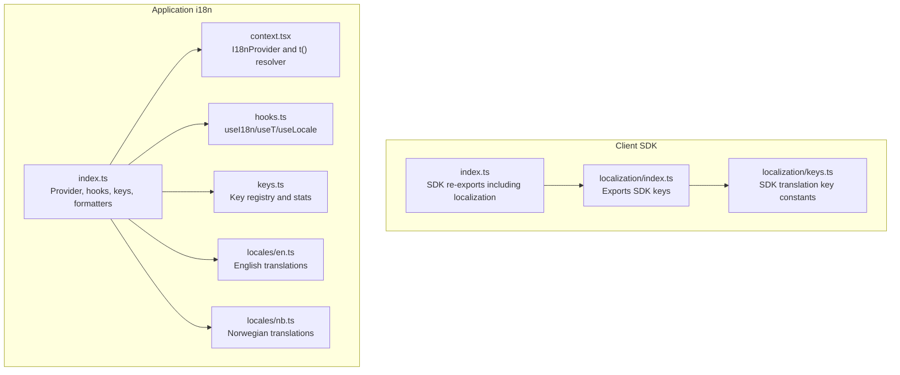
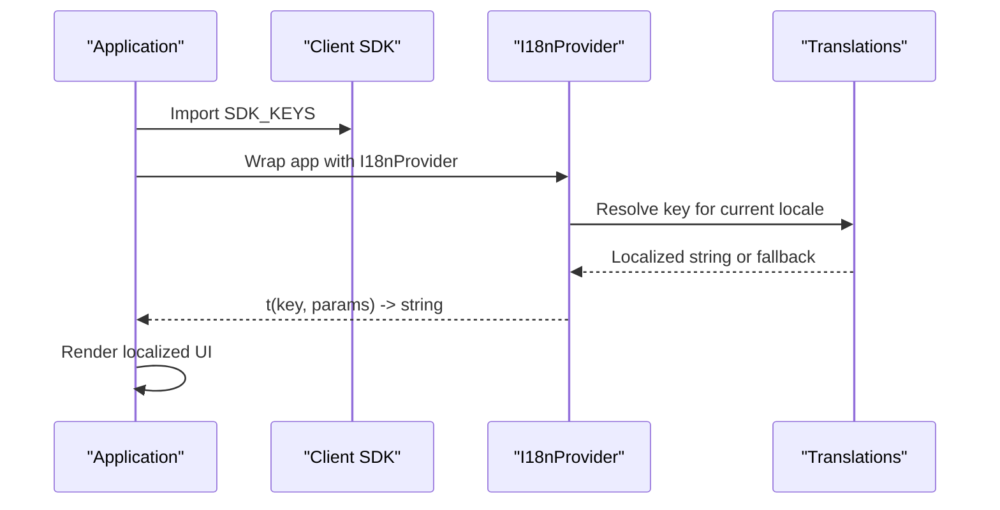
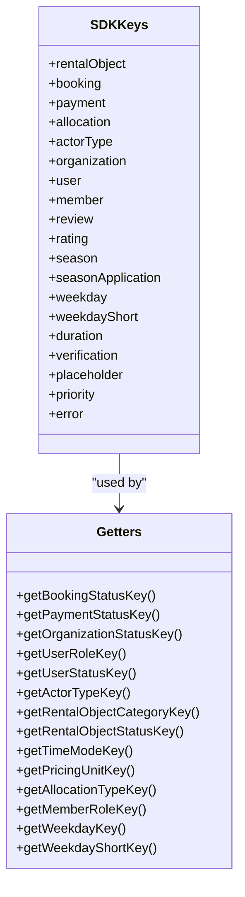
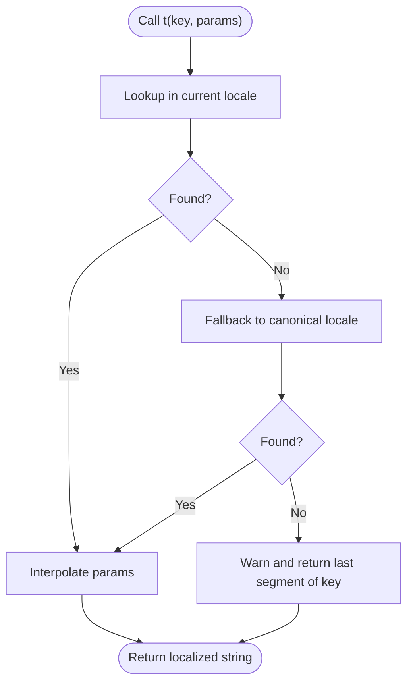
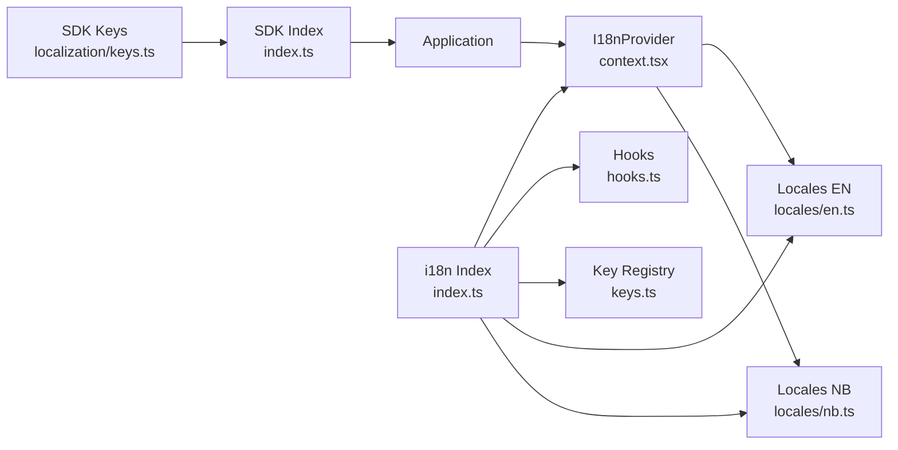

# Localization Integration

<cite>
**Referenced Files in This Document**
- [packages/client-sdk/src/localization/index.ts](file://packages/client-sdk/src/localization/index.ts)
- [packages/client-sdk/src/localization/keys.ts](file://packages/client-sdk/src/localization/keys.ts)
- [packages/client-sdk/src/index.ts](file://packages/client-sdk/src/index.ts)
- [packages/i18n/src/index.ts](file://packages/i18n/src/index.ts)
- [packages/i18n/src/context.tsx](file://packages/i18n/src/context.tsx)
- [packages/i18n/src/hooks.ts](file://packages/i18n/src/hooks.ts)
- [packages/i18n/src/keys.ts](file://packages/i18n/src/keys.ts)
- [packages/i18n/src/locales/en.ts](file://packages/i18n/src/locales/en.ts)
- [packages/i18n/src/locales/nb.ts](file://packages/i18n/src/locales/nb.ts)
- [docs/guides/internationalization.md](file://docs/guides/internationalization.md)
</cite>

## Table of Contents
1. [Introduction](#introduction)
2. [Project Structure](#project-structure)
3. [Core Components](#core-components)
4. [Architecture Overview](#architecture-overview)
5. [Detailed Component Analysis](#detailed-component-analysis)
6. [Dependency Analysis](#dependency-analysis)
7. [Performance Considerations](#performance-considerations)
8. [Troubleshooting Guide](#troubleshooting-guide)
9. [Conclusion](#conclusion)

## Introduction
This document explains how localization is integrated within the Client SDK and how applications can connect SDK components to their application-wide i18n systems. It covers translation key constants, i18n key management, naming conventions, hierarchical organization, dynamic key generation, pluralization, and performance considerations for large translation sets. Practical examples show how to use localized strings, manage updates, and maintain consistency across the SDK.

## Project Structure
The localization system spans two packages:
- Client SDK localization keys: centralized, type-safe translation key constants used by SDK components.
- Application i18n package: provides runtime resolution, formatting, lazy loading, and key registry utilities.

**Diagram sources**
- [packages/client-sdk/src/localization/index.ts](file://packages/client-sdk/src/localization/index.ts#L1-L9)
- [packages/client-sdk/src/localization/keys.ts](file://packages/client-sdk/src/localization/keys.ts#L1-L396)
- [packages/client-sdk/src/index.ts](file://packages/client-sdk/src/index.ts#L166-L168)
- [packages/i18n/src/index.ts](file://packages/i18n/src/index.ts#L1-L61)
- [packages/i18n/src/context.tsx](file://packages/i18n/src/context.tsx#L1-L87)
- [packages/i18n/src/hooks.ts](file://packages/i18n/src/hooks.ts#L1-L95)
- [packages/i18n/src/keys.ts](file://packages/i18n/src/keys.ts#L1-L98)
- [packages/i18n/src/locales/en.ts](file://packages/i18n/src/locales/en.ts#L1-L800)
- [packages/i18n/src/locales/nb.ts](file://packages/i18n/src/locales/nb.ts#L1-L800)

**Section sources**
- [packages/client-sdk/src/localization/index.ts](file://packages/client-sdk/src/localization/index.ts#L1-L9)
- [packages/client-sdk/src/localization/keys.ts](file://packages/client-sdk/src/localization/keys.ts#L1-L396)
- [packages/client-sdk/src/index.ts](file://packages/client-sdk/src/index.ts#L166-L168)
- [packages/i18n/src/index.ts](file://packages/i18n/src/index.ts#L1-L61)

## Core Components
- SDK localization keys: a single source of truth for translation keys used by SDK components. Keys are grouped by domain and entity to enable hierarchical organization and predictable lookups.
- Application i18n provider: resolves keys to localized strings, supports interpolation, fallbacks, and formatting.
- Key registry and utilities: validates keys, enumerates namespaces, and computes statistics for auditing and CI.

Key responsibilities:
- SDK keys define the contract between SDK components and the application’s i18n system.
- The i18n provider resolves keys to localized strings and exposes hooks for consumers.
- Key utilities ensure type safety and runtime validation.

**Section sources**
- [packages/client-sdk/src/localization/keys.ts](file://packages/client-sdk/src/localization/keys.ts#L1-L396)
- [packages/i18n/src/context.tsx](file://packages/i18n/src/context.tsx#L52-L73)
- [packages/i18n/src/keys.ts](file://packages/i18n/src/keys.ts#L14-L39)

## Architecture Overview
The SDK exposes translation keys; the application wraps them with an i18n provider to render localized strings. The provider supports interpolation, locale switching, and fallback behavior.

**Diagram sources**
- [packages/client-sdk/src/localization/index.ts](file://packages/client-sdk/src/localization/index.ts#L1-L9)
- [packages/client-sdk/src/localization/keys.ts](file://packages/client-sdk/src/localization/keys.ts#L1-L396)
- [packages/i18n/src/context.tsx](file://packages/i18n/src/context.tsx#L52-L73)
- [packages/i18n/src/locales/en.ts](file://packages/i18n/src/locales/en.ts#L1-L800)
- [packages/i18n/src/locales/nb.ts](file://packages/i18n/src/locales/nb.ts#L1-L800)

## Detailed Component Analysis

### SDK Localization Keys
The SDK defines a structured set of translation keys grouped by domain and entity. Examples include categories, statuses, durations, placeholders, and errors. A composite SDK_KEYS object organizes these into nested namespaces for easy consumption.

Key characteristics:
- Hierarchical grouping: sdk.{domain}.{entity}.{value}
- Type-safe getters for enums and statuses
- Exported via a single module for easy re-exports

**Diagram sources**
- [packages/client-sdk/src/localization/keys.ts](file://packages/client-sdk/src/localization/keys.ts#L277-L321)
- [packages/client-sdk/src/localization/keys.ts](file://packages/client-sdk/src/localization/keys.ts#L339-L395)

**Section sources**
- [packages/client-sdk/src/localization/keys.ts](file://packages/client-sdk/src/localization/keys.ts#L1-L396)
- [packages/client-sdk/src/localization/index.ts](file://packages/client-sdk/src/localization/index.ts#L1-L9)
- [packages/client-sdk/src/index.ts](file://packages/client-sdk/src/index.ts#L166-L168)

### Application i18n Provider and Resolution
The i18n provider resolves keys to localized strings, supports interpolation, and falls back to the canonical language when needed. It also exposes hooks for locale state and formatting.

Key behaviors:
- Locale resolution chain: current locale → canonical locale → key itself with warning
- Interpolation of parameters passed to the translation function
- Memoized formatters for relative time and durations based on current locale

**Diagram sources**
- [packages/i18n/src/context.tsx](file://packages/i18n/src/context.tsx#L52-L73)

**Section sources**
- [packages/i18n/src/context.tsx](file://packages/i18n/src/context.tsx#L1-L87)
- [packages/i18n/src/hooks.ts](file://packages/i18n/src/hooks.ts#L1-L95)

### Key Management and Validation
The i18n package provides a generated key registry and utilities for validating keys, enumerating namespaces, and computing statistics. This enables type-safe access and runtime checks.

Highlights:
- TranslationKeyPath type ensures compile-time key correctness
- isValidKey for runtime validation
- getKeysForNamespace and getAllNamespaces for organization and tooling
- getTranslationStats for audits and CI

**Section sources**
- [packages/i18n/src/keys.ts](file://packages/i18n/src/keys.ts#L1-L98)
- [packages/i18n/src/index.ts](file://packages/i18n/src/index.ts#L48-L61)

### Naming Conventions and Hierarchical Organization
The SDK follows a strict naming pattern and hierarchy to keep keys predictable and maintainable.

Patterns:
- Pattern: sdk.{domain}.{entity}.{value}
- Namespaces: lowercase, descriptive
- Entities: nouns or categories
- Values: concise and specific

Rules and reserved prefixes are documented to guide consistent key creation.

**Section sources**
- [packages/client-sdk/src/localization/keys.ts](file://packages/client-sdk/src/localization/keys.ts#L7-L15)
- [docs/guides/internationalization.md](file://docs/guides/internationalization.md#L322-L340)

### Dynamic Key Generation and Enum Helpers
The SDK provides helper functions that map enum values to translation keys. This allows dynamic resolution of localized labels from runtime values.

Examples of helpers:
- Booking status, payment status, organization/user roles
- Actor types, pricing units, time modes
- Weekday and short weekday labels

These functions fall back to the raw value if a key is missing, ensuring robustness.

**Section sources**
- [packages/client-sdk/src/localization/keys.ts](file://packages/client-sdk/src/localization/keys.ts#L339-L395)

### Pluralization and Parameterized Strings
Pluralization and parameterization are handled by the i18n provider’s interpolation mechanism. The provider supports parameter substitution, enabling localized strings with counts and dynamic values.

Practical usage:
- Pass parameters to the translation function
- Use ICU-style placeholders in translation files
- Leverage formatters for relative time and durations

**Section sources**
- [packages/i18n/src/context.tsx](file://packages/i18n/src/context.tsx#L69-L71)
- [packages/i18n/src/hooks.ts](file://packages/i18n/src/hooks.ts#L60-L94)

### Integration with Application i18n Systems
Applications should:
- Wrap their UI with the i18n provider
- Import SDK keys and pass them to the provider’s translation function
- Use SDK enum helpers to derive keys from runtime values
- Extend or override translations as needed

Re-exports:
- The SDK re-exports localization so applications can import from the SDK entry point.

**Section sources**
- [packages/client-sdk/src/index.ts](file://packages/client-sdk/src/index.ts#L166-L168)
- [packages/i18n/src/index.ts](file://packages/i18n/src/index.ts#L1-L61)

## Dependency Analysis
The SDK localization depends on the application’s i18n provider for resolution. The i18n package depends on locale files and exposes utilities for key management.

**Diagram sources**
- [packages/client-sdk/src/localization/keys.ts](file://packages/client-sdk/src/localization/keys.ts#L1-L396)
- [packages/client-sdk/src/index.ts](file://packages/client-sdk/src/index.ts#L166-L168)
- [packages/i18n/src/index.ts](file://packages/i18n/src/index.ts#L1-L61)
- [packages/i18n/src/context.tsx](file://packages/i18n/src/context.tsx#L1-L87)
- [packages/i18n/src/hooks.ts](file://packages/i18n/src/hooks.ts#L1-L95)
- [packages/i18n/src/keys.ts](file://packages/i18n/src/keys.ts#L1-L98)
- [packages/i18n/src/locales/en.ts](file://packages/i18n/src/locales/en.ts#L1-L800)
- [packages/i18n/src/locales/nb.ts](file://packages/i18n/src/locales/nb.ts#L1-L800)

**Section sources**
- [packages/client-sdk/src/index.ts](file://packages/client-sdk/src/index.ts#L166-L168)
- [packages/i18n/src/index.ts](file://packages/i18n/src/index.ts#L1-L61)

## Performance Considerations
- Keep translation sets organized by namespace to simplify scanning and reduce lookup overhead.
- Use lazy loading for locales to minimize initial bundle size.
- Prefer enum helpers to avoid repeated string concatenation and reduce memory churn.
- Validate keys at build time to catch missing translations early.
- Use the key registry utilities to audit and prune unused keys.

[No sources needed since this section provides general guidance]

## Troubleshooting Guide
Common issues and resolutions:
- Missing translation key: The provider logs a warning and returns the last segment of the key. Add the key to the appropriate locale file or use a fallback.
- Incorrect locale fallback: Ensure the canonical locale is properly configured and included in the translations registry.
- Parameter interpolation errors: Verify that placeholders in translation strings match the parameters passed to the translation function.
- Key validation failures: Use the key registry to check validity and enumerate namespaces for debugging.

**Section sources**
- [packages/i18n/src/context.tsx](file://packages/i18n/src/context.tsx#L63-L67)
- [packages/i18n/src/keys.ts](file://packages/i18n/src/keys.ts#L32-L39)

## Conclusion
The Client SDK provides a structured, type-safe set of translation keys that integrate seamlessly with application i18n systems. By following the naming conventions, leveraging enum helpers, and using the key registry utilities, applications can maintain consistency, handle pluralization and parameters, and scale efficiently with large translation sets. The i18n provider’s fallback and interpolation mechanisms ensure robust rendering across locales.