# Authentication Hooks

<cite>
**Referenced Files in This Document**
- [packages/client-sdk/src/hooks/use-auth.ts](file://packages/client-sdk/src/hooks/use-auth.ts)
- [packages/client-sdk/src/services/auth.service.ts](file://packages/client-sdk/src/services/auth.service.ts)
- [packages/auth/src/providers/AuthProvider.tsx](file://packages/auth/src/providers/AuthProvider.tsx)
- [packages/auth/src/hooks/useAuth.ts](file://packages/auth/src/hooks/useAuth.ts)
- [packages/auth/src/hooks/useOAuthCallback.ts](file://packages/auth/src/hooks/useOAuthCallback.ts)
- [packages/auth/src/components/ProtectedRoute.tsx](file://packages/auth/src/components/ProtectedRoute.tsx)
- [packages/auth/src/types/index.ts](file://packages/auth/src/types/index.ts)
- [packages/client-sdk/src/hooks/use-auth-guards.ts](file://packages/client-sdk/src/hooks/use-auth-guards.ts)
- [apps/web/src/App.tsx](file://apps/web/src/App.tsx)
</cite>

## Table of Contents
1. [Introduction](#introduction)
2. [Project Structure](#project-structure)
3. [Core Components](#core-components)
4. [Architecture Overview](#architecture-overview)
5. [Detailed Component Analysis](#detailed-component-analysis)
6. [Dependency Analysis](#dependency-analysis)
7. [Performance Considerations](#performance-considerations)
8. [Troubleshooting Guide](#troubleshooting-guide)
9. [Conclusion](#conclusion)

## Introduction
This document provides comprehensive documentation for authentication-related React Query hooks and supporting infrastructure used across the Xala/Digilist monorepo. It focuses on:
- useSession, useLogin, useLogout, useRefreshToken, and useAuthProviders hooks
- Session management, token refresh mechanisms, and authentication guards
- Practical examples for login flows, protected route handling, and session restoration
- Authentication state management, loading states, and error scenarios
- Security considerations and best practices for hook usage

The authentication system uses HTTP-only cookies for session storage, OAuth 2.0 flows, and centralized configuration for providers and app-specific access control.

## Project Structure
The authentication system spans two primary packages:
- @xala/auth: Centralized provider, guards, and UI components for authentication
- @digilist/client-sdk: React Query hooks and service layer for authentication operations

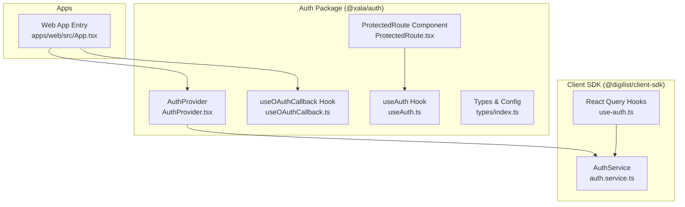

**Diagram sources**
- [packages/client-sdk/src/hooks/use-auth.ts](file://packages/client-sdk/src/hooks/use-auth.ts#L1-L188)
- [packages/client-sdk/src/services/auth.service.ts](file://packages/client-sdk/src/services/auth.service.ts#L1-L342)
- [packages/auth/src/providers/AuthProvider.tsx](file://packages/auth/src/providers/AuthProvider.tsx#L1-L592)
- [packages/auth/src/hooks/useAuth.ts](file://packages/auth/src/hooks/useAuth.ts#L1-L21)
- [packages/auth/src/hooks/useOAuthCallback.ts](file://packages/auth/src/hooks/useOAuthCallback.ts#L1-L52)
- [packages/auth/src/components/ProtectedRoute.tsx](file://packages/auth/src/components/ProtectedRoute.tsx#L1-L140)
- [apps/web/src/App.tsx](file://apps/web/src/App.tsx#L1-L275)

**Section sources**
- [packages/client-sdk/src/hooks/use-auth.ts](file://packages/client-sdk/src/hooks/use-auth.ts#L1-L188)
- [packages/auth/src/providers/AuthProvider.tsx](file://packages/auth/src/providers/AuthProvider.tsx#L1-L592)
- [apps/web/src/App.tsx](file://apps/web/src/App.tsx#L1-L275)

## Core Components
This section documents the five primary React Query hooks and related utilities used for authentication.

- useSession
  - Purpose: Fetch and cache the current authenticated session
  - Parameters: None
  - Return: Query result with session data and status flags
  - Behavior: Uses React Query to fetch session data, sets staleTime to balance freshness vs. network usage
  - Error handling: Retries disabled; consumers should handle 401/403 gracefully
  - Example usage: Display user profile or guard protected routes

- useLogin
  - Purpose: Perform email/password login
  - Parameters: Login credentials object
  - Return: Mutation result with loading/error states
  - Behavior: On success, updates the session cache; HTTP-only cookies are set server-side
  - Error handling: Consumers should surface errors and prevent silent failures

- useLogout
  - Purpose: Terminate the current session
  - Parameters: None
  - Return: Mutation result
  - Behavior: Clears auth token from client factory and removes session cache; optionally clears entire cache
  - Error handling: Attempts cleanup even if server logout fails

- useRefreshToken
  - Purpose: Rotate the session token before expiry
  - Parameters: None
  - Return: Mutation result
  - Behavior: On success, updates session cache; relies on server setting new HTTP-only cookies
  - Error handling: Consumers should handle failure (e.g., trigger logout)

- useAuthProviders
  - Purpose: Fetch available OAuth providers
  - Parameters: None
  - Return: Query result with provider list
  - Behavior: Uses React Query with infinite staleTime since providers rarely change
  - Error handling: Consumers should handle network errors and fallback UI

**Section sources**
- [packages/client-sdk/src/hooks/use-auth.ts](file://packages/client-sdk/src/hooks/use-auth.ts#L15-L102)
- [packages/client-sdk/src/services/auth.service.ts](file://packages/client-sdk/src/services/auth.service.ts#L62-L165)

## Architecture Overview
The authentication architecture combines React Query hooks, a centralized provider, OAuth callbacks, and route guards:

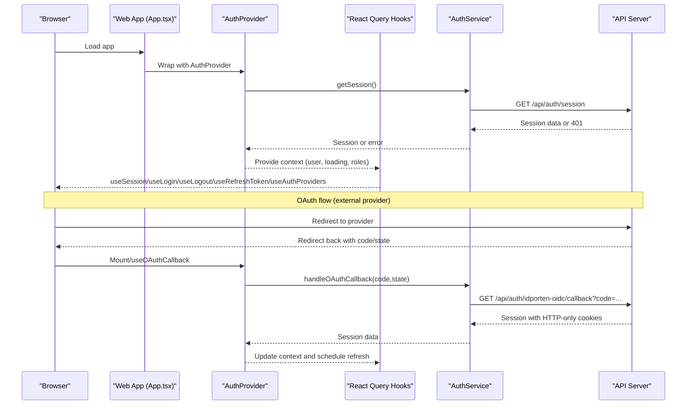

**Diagram sources**
- [apps/web/src/App.tsx](file://apps/web/src/App.tsx#L170-L175)
- [packages/auth/src/providers/AuthProvider.tsx](file://packages/auth/src/providers/AuthProvider.tsx#L240-L437)
- [packages/auth/src/hooks/useOAuthCallback.ts](file://packages/auth/src/hooks/useOAuthCallback.ts#L20-L51)
- [packages/client-sdk/src/services/auth.service.ts](file://packages/client-sdk/src/services/auth.service.ts#L297-L318)
- [packages/client-sdk/src/hooks/use-auth.ts](file://packages/client-sdk/src/hooks/use-auth.ts#L91-L102)

## Detailed Component Analysis

### useSession
- Purpose: Provide current session data via React Query
- Key behaviors:
  - Query key: session-specific
  - Stale time: 5 minutes
  - Retry disabled
- Typical usage:
  - Render user info in header
  - Gate protected routes
  - Drive conditional UI

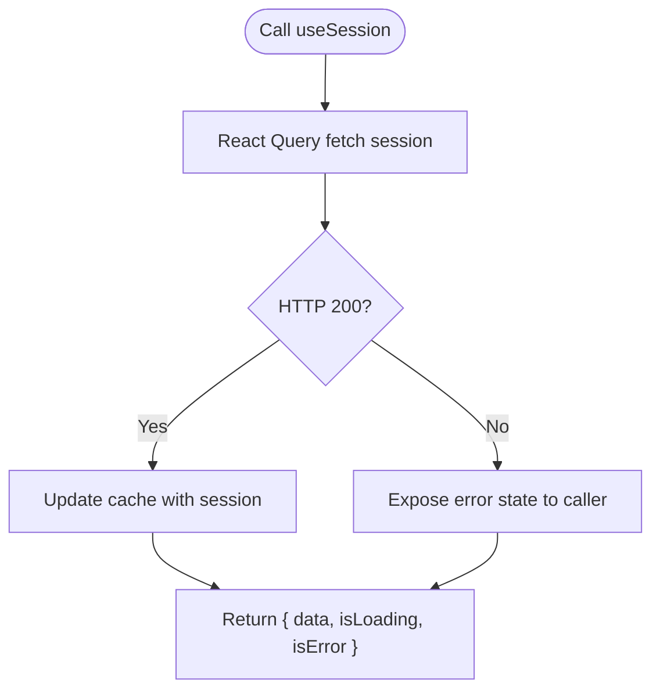

**Diagram sources**
- [packages/client-sdk/src/hooks/use-auth.ts](file://packages/client-sdk/src/hooks/use-auth.ts#L15-L22)
- [packages/client-sdk/src/services/auth.service.ts](file://packages/client-sdk/src/services/auth.service.ts#L102-L104)

**Section sources**
- [packages/client-sdk/src/hooks/use-auth.ts](file://packages/client-sdk/src/hooks/use-auth.ts#L15-L22)
- [packages/client-sdk/src/services/auth.service.ts](file://packages/client-sdk/src/services/auth.service.ts#L87-L104)

### useLogin
- Purpose: Authenticate via email/password
- Key behaviors:
  - Mutation function: posts credentials to login endpoint
  - On success: updates session cache
  - Token handling: HTTP-only cookies set server-side
- Error handling:
  - Surface errors to UI
  - Do not persist tokens client-side

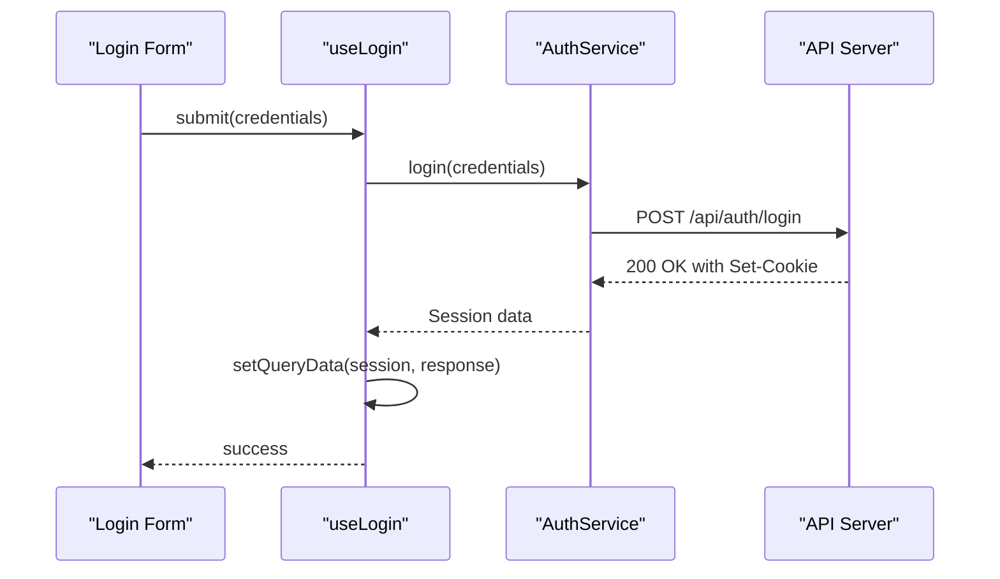

**Diagram sources**
- [packages/client-sdk/src/hooks/use-auth.ts](file://packages/client-sdk/src/hooks/use-auth.ts#L39-L51)
- [packages/client-sdk/src/services/auth.service.ts](file://packages/client-sdk/src/services/auth.service.ts#L62-L64)

**Section sources**
- [packages/client-sdk/src/hooks/use-auth.ts](file://packages/client-sdk/src/hooks/use-auth.ts#L39-L51)
- [packages/client-sdk/src/services/auth.service.ts](file://packages/client-sdk/src/services/auth.service.ts#L62-L85)

### useLogout
- Purpose: End current session
- Key behaviors:
  - Clears auth token from client factory
  - Removes session queries from cache
  - Optionally clears entire cache
  - Navigates to login path

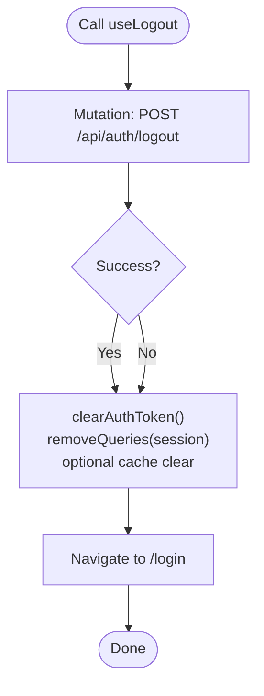

**Diagram sources**
- [packages/client-sdk/src/hooks/use-auth.ts](file://packages/client-sdk/src/hooks/use-auth.ts#L73-L85)
- [packages/client-sdk/src/services/auth.service.ts](file://packages/client-sdk/src/services/auth.service.ts#L121-L123)

**Section sources**
- [packages/client-sdk/src/hooks/use-auth.ts](file://packages/client-sdk/src/hooks/use-auth.ts#L73-L85)
- [packages/client-sdk/src/services/auth.service.ts](file://packages/client-sdk/src/services/auth.service.ts#L121-L123)

### useRefreshToken
- Purpose: Proactively refresh the session before expiry
- Key behaviors:
  - Mutation function: POST /api/auth/refresh
  - On success: updates session cache
  - Relies on server rotation of HTTP-only cookies

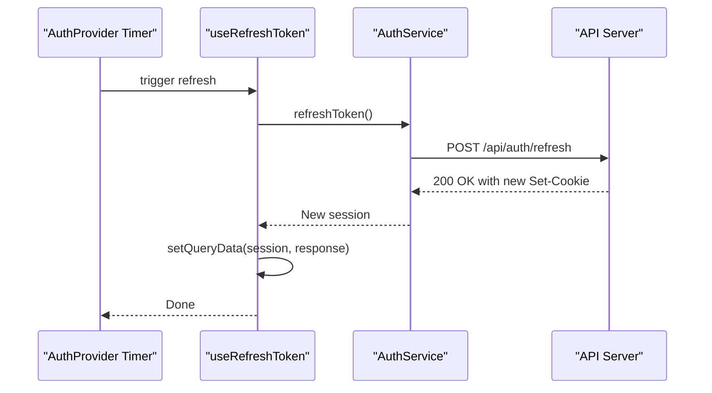

**Diagram sources**
- [packages/client-sdk/src/hooks/use-auth.ts](file://packages/client-sdk/src/hooks/use-auth.ts#L91-L102)
- [packages/client-sdk/src/services/auth.service.ts](file://packages/client-sdk/src/services/auth.service.ts#L145-L147)
- [packages/auth/src/providers/AuthProvider.tsx](file://packages/auth/src/providers/AuthProvider.tsx#L194-L224)

**Section sources**
- [packages/client-sdk/src/hooks/use-auth.ts](file://packages/client-sdk/src/hooks/use-auth.ts#L91-L102)
- [packages/client-sdk/src/services/auth.service.ts](file://packages/client-sdk/src/services/auth.service.ts#L145-L147)
- [packages/auth/src/providers/AuthProvider.tsx](file://packages/auth/src/providers/AuthProvider.tsx#L194-L224)

### useAuthProviders
- Purpose: Retrieve available OAuth providers
- Key behaviors:
  - Query key: providers-specific
  - Stale time: infinite (providers rarely change)
  - Returns provider list for rendering login options

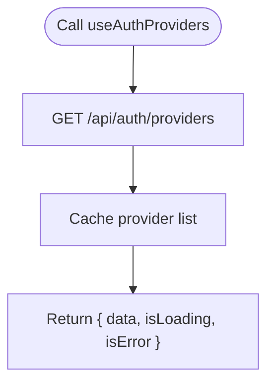

**Diagram sources**
- [packages/client-sdk/src/hooks/use-auth.ts](file://packages/client-sdk/src/hooks/use-auth.ts#L27-L33)
- [packages/client-sdk/src/services/auth.service.ts](file://packages/client-sdk/src/services/auth.service.ts#L163-L165)

**Section sources**
- [packages/client-sdk/src/hooks/use-auth.ts](file://packages/client-sdk/src/hooks/use-auth.ts#L27-L33)
- [packages/client-sdk/src/services/auth.service.ts](file://packages/client-sdk/src/services/auth.service.ts#L163-L165)

### useAuth Hook (Context Access)
- Purpose: Access authentication context from any component
- Key behaviors:
  - Returns AuthContextType with user, loading, roles, and helpers
  - Throws if used outside AuthProvider

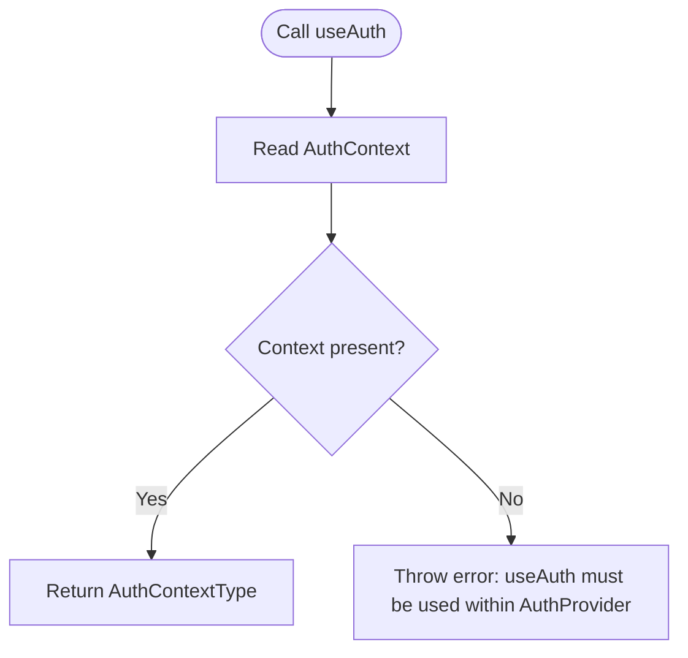

**Diagram sources**
- [packages/auth/src/hooks/useAuth.ts](file://packages/auth/src/hooks/useAuth.ts#L12-L20)

**Section sources**
- [packages/auth/src/hooks/useAuth.ts](file://packages/auth/src/hooks/useAuth.ts#L12-L20)
- [packages/auth/src/types/index.ts](file://packages/auth/src/types/index.ts#L108-L144)

### useOAuthCallback Hook
- Purpose: Handle OAuth callback with token parameter and establish session
- Key behaviors:
  - Reads token from URL parameters
  - Updates SDK client with JWT token
  - Stores token in localStorage for persistence
  - Cleans URL parameters and reloads to pick up auth state

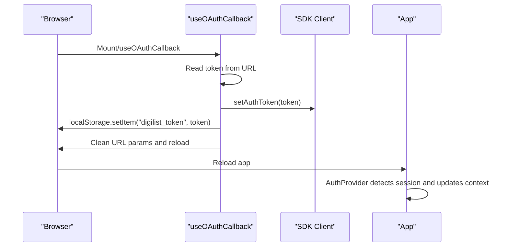

**Diagram sources**
- [packages/auth/src/hooks/useOAuthCallback.ts](file://packages/auth/src/hooks/useOAuthCallback.ts#L20-L51)

**Section sources**
- [packages/auth/src/hooks/useOAuthCallback.ts](file://packages/auth/src/hooks/useOAuthCallback.ts#L20-L51)

### ProtectedRoute Component
- Purpose: Guard routes with authentication and optional role checks
- Key behaviors:
  - Uses useAuth to check isAuthenticated and accessDeniedError
  - Supports requiredRole and custom accessCheck
  - Handles loading states and redirects appropriately
  - Can preserve return URL in navigation state

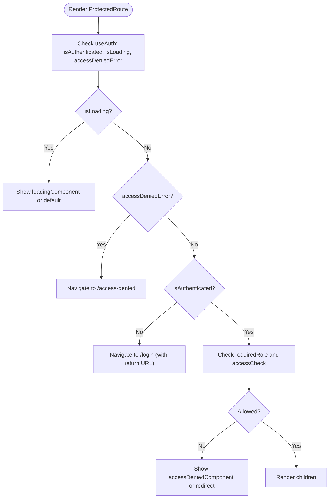

**Diagram sources**
- [packages/auth/src/components/ProtectedRoute.tsx](file://packages/auth/src/components/ProtectedRoute.tsx#L61-L121)
- [packages/auth/src/hooks/useAuth.ts](file://packages/auth/src/hooks/useAuth.ts#L12-L20)

**Section sources**
- [packages/auth/src/components/ProtectedRoute.tsx](file://packages/auth/src/components/ProtectedRoute.tsx#L61-L121)
- [packages/auth/src/hooks/useAuth.ts](file://packages/auth/src/hooks/useAuth.ts#L12-L20)

### AuthProvider (Session Management and Guards)
- Purpose: Centralized authentication state, session validation, and token refresh scheduling
- Key behaviors:
  - Validates session on mount and visibility change
  - Schedules token refresh 2 minutes before expiry
  - Handles OAuth callback and role-based access control
  - Provides helpers: login, logout, checkRole, restoreFlowContext, clearFlowContext
  - Emits auth:expired events for cross-tab synchronization

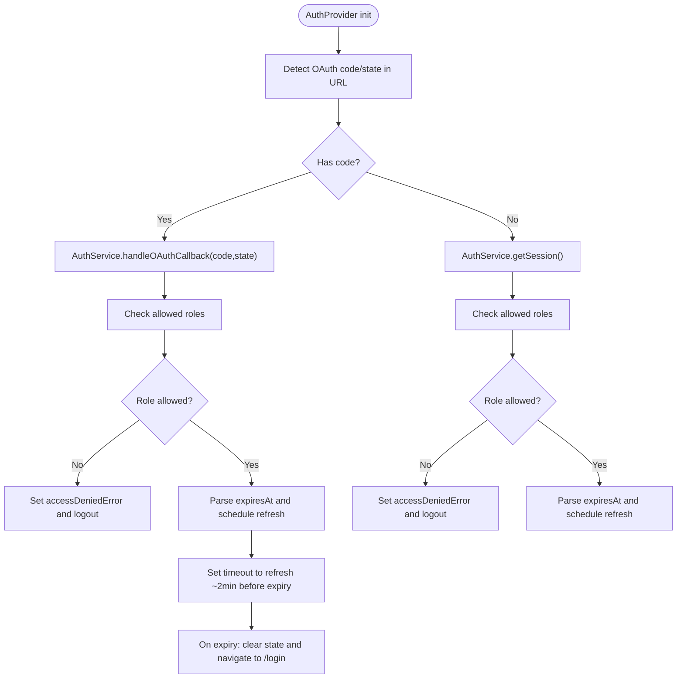

**Diagram sources**
- [packages/auth/src/providers/AuthProvider.tsx](file://packages/auth/src/providers/AuthProvider.tsx#L240-L437)
- [packages/auth/src/providers/AuthProvider.tsx](file://packages/auth/src/providers/AuthProvider.tsx#L194-L224)

**Section sources**
- [packages/auth/src/providers/AuthProvider.tsx](file://packages/auth/src/providers/AuthProvider.tsx#L194-L224)
- [packages/auth/src/providers/AuthProvider.tsx](file://packages/auth/src/providers/AuthProvider.tsx#L240-L437)

### Authentication Guards and Utilities
- useAuthRedirectGuard: Prevents infinite redirect loops during auth flows
- useSessionRestoration: Restores user to intended destination after OAuth callback
- useSessionExpirationCheck: Lightweight session validation helper

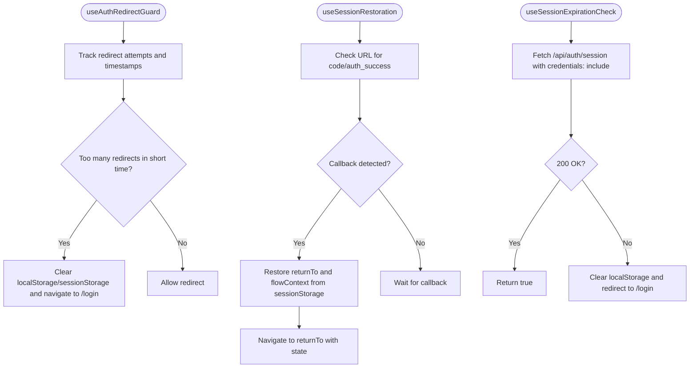

**Diagram sources**
- [packages/client-sdk/src/hooks/use-auth-guards.ts](file://packages/client-sdk/src/hooks/use-auth-guards.ts#L19-L57)
- [packages/client-sdk/src/hooks/use-auth-guards.ts](file://packages/client-sdk/src/hooks/use-auth-guards.ts#L63-L100)
- [packages/client-sdk/src/hooks/use-auth-guards.ts](file://packages/client-sdk/src/hooks/use-auth-guards.ts#L108-L132)

**Section sources**
- [packages/client-sdk/src/hooks/use-auth-guards.ts](file://packages/client-sdk/src/hooks/use-auth-guards.ts#L19-L57)
- [packages/client-sdk/src/hooks/use-auth-guards.ts](file://packages/client-sdk/src/hooks/use-auth-guards.ts#L63-L100)
- [packages/client-sdk/src/hooks/use-auth-guards.ts](file://packages/client-sdk/src/hooks/use-auth-guards.ts#L108-L132)

## Dependency Analysis
The authentication hooks depend on a service layer and are orchestrated by the AuthProvider and UI components.

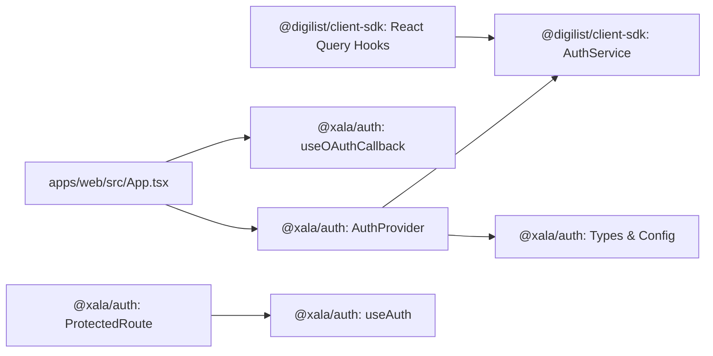

**Diagram sources**
- [apps/web/src/App.tsx](file://apps/web/src/App.tsx#L25-L27)
- [packages/auth/src/providers/AuthProvider.tsx](file://packages/auth/src/providers/AuthProvider.tsx#L1-L50)
- [packages/client-sdk/src/hooks/use-auth.ts](file://packages/client-sdk/src/hooks/use-auth.ts#L1-L11)
- [packages/auth/src/components/ProtectedRoute.tsx](file://packages/auth/src/components/ProtectedRoute.tsx#L32-L36)

**Section sources**
- [apps/web/src/App.tsx](file://apps/web/src/App.tsx#L25-L27)
- [packages/auth/src/providers/AuthProvider.tsx](file://packages/auth/src/providers/AuthProvider.tsx#L1-L50)
- [packages/client-sdk/src/hooks/use-auth.ts](file://packages/client-sdk/src/hooks/use-auth.ts#L1-L11)
- [packages/auth/src/components/ProtectedRoute.tsx](file://packages/auth/src/components/ProtectedRoute.tsx#L32-L36)

## Performance Considerations
- useSession staleTime: 5 minutes balances freshness with reduced network calls
- useAuthProviders staleTime: Infinite since providers rarely change
- useRefreshToken scheduling: 2 minutes before expiry to minimize downtime
- React Query caching: Efficient cache updates on login/logout/refresh
- Cross-tab synchronization: AuthProvider listens for storage events to keep tabs in sync

[No sources needed since this section provides general guidance]

## Troubleshooting Guide
Common issues and resolutions:
- Infinite redirect loops
  - Cause: Redirect guard prevents excessive redirects
  - Resolution: Ensure auth state clears and redirects are intentional
  - Hook: useAuthRedirectGuard

- Session not restored after OAuth
  - Cause: Missing returnTo or flowContext in sessionStorage
  - Resolution: Verify OAuth callback parameters and session restoration hook
  - Hook: useSessionRestoration

- Access denied after login
  - Cause: Role not permitted for app type
  - Resolution: Check allowedRoles and accessDeniedMessage in AuthProvider config
  - Component: ProtectedRoute

- Token refresh failures
  - Cause: Network errors or expired refresh window
  - Resolution: Retry refresh, handle 401, and log out gracefully
  - Hook: useRefreshToken

- 401 Unauthorized during protected route load
  - Cause: Session invalidated or missing
  - Resolution: Redirect to login with return URL preserved
  - Component: ProtectedRoute

**Section sources**
- [packages/client-sdk/src/hooks/use-auth-guards.ts](file://packages/client-sdk/src/hooks/use-auth-guards.ts#L19-L57)
- [packages/client-sdk/src/hooks/use-auth-guards.ts](file://packages/client-sdk/src/hooks/use-auth-guards.ts#L63-L100)
- [packages/auth/src/components/ProtectedRoute.tsx](file://packages/auth/src/components/ProtectedRoute.tsx#L61-L121)
- [packages/auth/src/providers/AuthProvider.tsx](file://packages/auth/src/providers/AuthProvider.tsx#L194-L224)

## Conclusion
The authentication system leverages React Query hooks for declarative session management, a centralized AuthProvider for state orchestration, and robust guards for secure and reliable flows. By combining HTTP-only cookies, OAuth 2.0, and role-based access control, it ensures a consistent, secure, and maintainable authentication experience across applications.