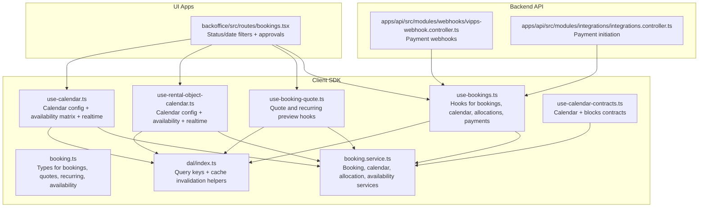
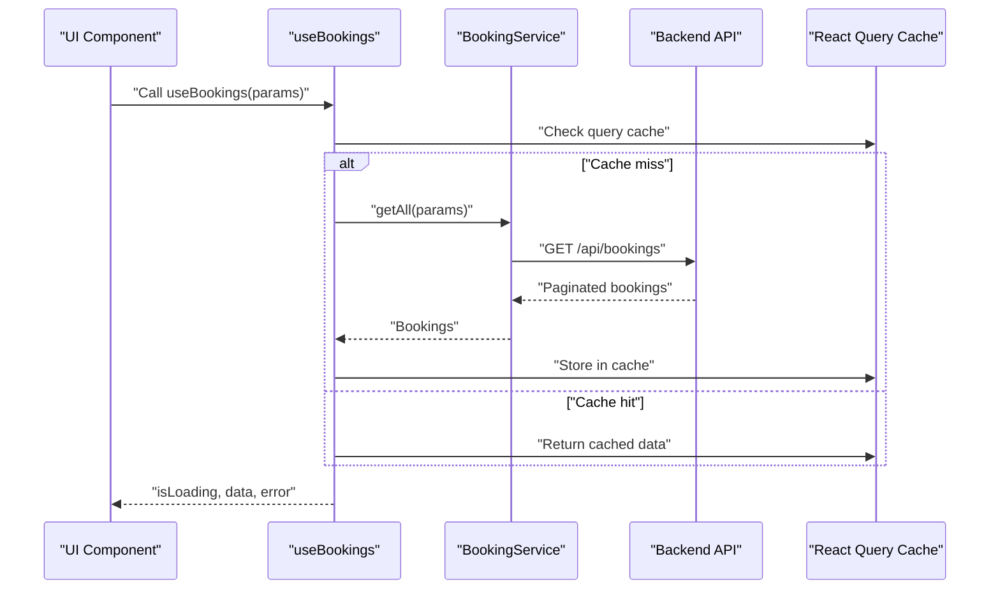
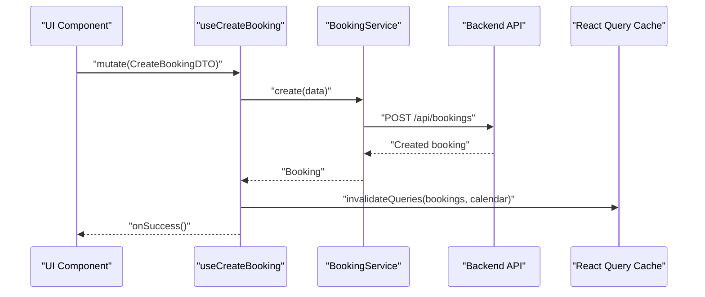
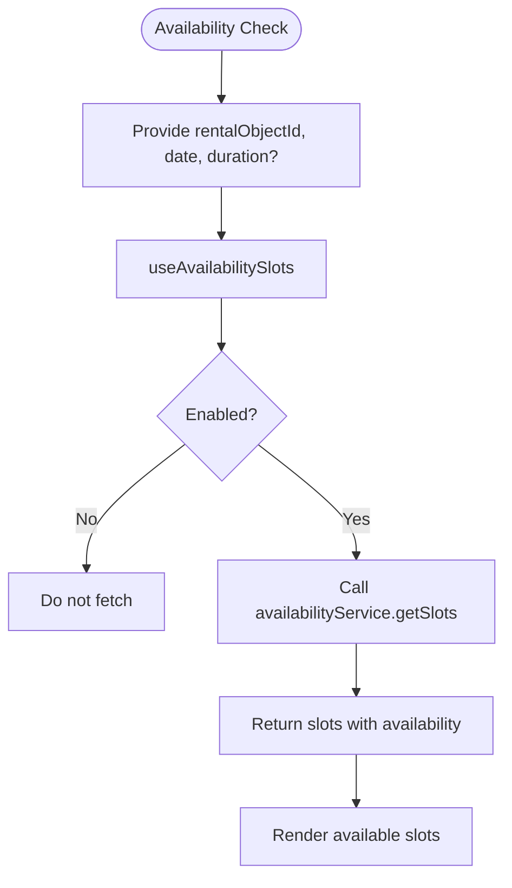
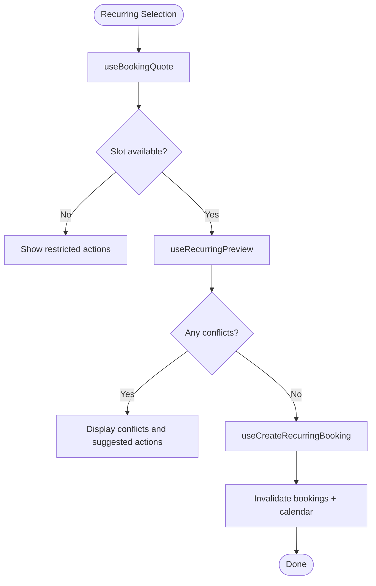
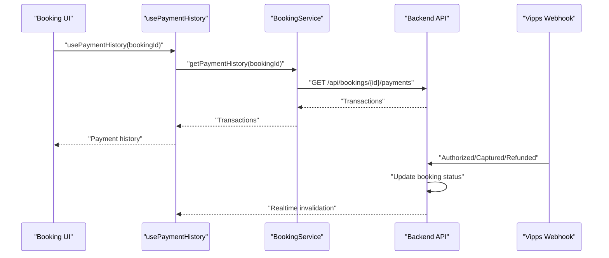
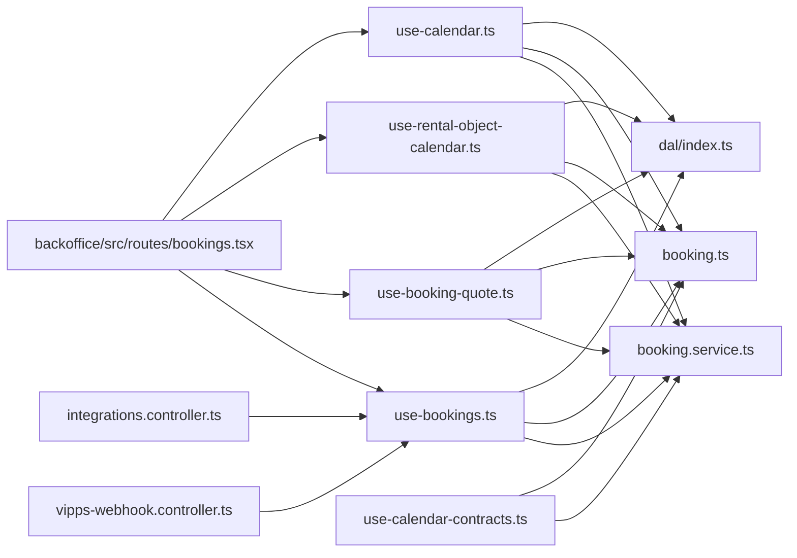

# Bookings Hooks

<cite>
**Referenced Files in This Document**
- [use-bookings.ts](file://packages/client-sdk/src/hooks/use-bookings.ts)
- [booking.service.ts](file://packages/client-sdk/src/services/booking.service.ts)
- [booking.ts](file://packages/client-sdk/src/types/booking.ts)
- [index.ts](file://packages/client-sdk/src/dal/index.ts)
- [use-booking-quote.ts](file://packages/client-sdk/src/hooks/use-booking-quote.ts)
- [use-rental-object-calendar.ts](file://packages/client-sdk/src/hooks/use-rental-object-calendar.ts)
- [use-calendar.ts](file://packages/client-sdk/src/hooks/use-calendar.ts)
- [use-calendar-contracts.ts](file://packages/client-sdk/src/hooks/use-calendar-contracts.ts)
- [bookings.tsx](file://apps/backoffice/src/routes/bookings.tsx)
- [vipps-webhook.controller.ts](file://apps/api/src/modules/webhooks/vipps-webhook.controller.ts)
- [integrations.controller.ts](file://apps/api/src/modules/integrations/integrations.controller.ts)
</cite>

## Table of Contents
1. [Introduction](#introduction)
2. [Project Structure](#project-structure)
3. [Core Components](#core-components)
4. [Architecture Overview](#architecture-overview)
5. [Detailed Component Analysis](#detailed-component-analysis)
6. [Dependency Analysis](#dependency-analysis)
7. [Performance Considerations](#performance-considerations)
8. [Troubleshooting Guide](#troubleshooting-guide)
9. [Conclusion](#conclusion)

## Introduction
This document provides comprehensive documentation for booking-related React Query hooks in the client SDK. It focuses on the primary hooks for retrieving, creating, updating, confirming, completing, and cancelling bookings, along with supporting calendar, availability, recurring booking, quote, and payment reconciliation hooks. It also covers state management, status filtering, temporal queries, real-time updates, conflict detection, availability checking, calendar integration, booking history, approval workflows, notifications, pagination, filtering, and cache invalidation strategies.

## Project Structure
The booking domain is implemented in the client SDK with dedicated hooks, services, and types. The DAL centralizes query keys and cache invalidation helpers. UI applications consume these hooks to build booking experiences.

**Diagram sources**
- [use-bookings.ts](file://packages/client-sdk/src/hooks/use-bookings.ts#L1-L356)
- [booking.service.ts](file://packages/client-sdk/src/services/booking.service.ts#L1-L497)
- [booking.ts](file://packages/client-sdk/src/types/booking.ts#L1-L593)
- [index.ts](file://packages/client-sdk/src/dal/index.ts#L1-L230)
- [use-booking-quote.ts](file://packages/client-sdk/src/hooks/use-booking-quote.ts#L1-L204)
- [use-rental-object-calendar.ts](file://packages/client-sdk/src/hooks/use-rental-object-calendar.ts#L1-L180)
- [use-calendar.ts](file://packages/client-sdk/src/hooks/use-calendar.ts#L1-L183)
- [use-calendar-contracts.ts](file://packages/client-sdk/src/hooks/use-calendar-contracts.ts#L1-L139)
- [bookings.tsx](file://apps/backoffice/src/routes/bookings.tsx#L118-L174)
- [vipps-webhook.controller.ts](file://apps/api/src/modules/webhooks/vipps-webhook.controller.ts#L237-L328)
- [integrations.controller.ts](file://apps/api/src/modules/integrations/integrations.controller.ts#L270-L320)

**Section sources**
- [use-bookings.ts](file://packages/client-sdk/src/hooks/use-bookings.ts#L1-L356)
- [booking.service.ts](file://packages/client-sdk/src/services/booking.service.ts#L1-L497)
- [booking.ts](file://packages/client-sdk/src/types/booking.ts#L1-L593)
- [index.ts](file://packages/client-sdk/src/dal/index.ts#L1-L230)
- [use-booking-quote.ts](file://packages/client-sdk/src/hooks/use-booking-quote.ts#L1-L204)
- [use-rental-object-calendar.ts](file://packages/client-sdk/src/hooks/use-rental-object-calendar.ts#L1-L180)
- [use-calendar.ts](file://packages/client-sdk/src/hooks/use-calendar.ts#L1-L183)
- [use-calendar-contracts.ts](file://packages/client-sdk/src/hooks/use-calendar-contracts.ts#L1-L139)
- [bookings.tsx](file://apps/backoffice/src/routes/bookings.tsx#L118-L174)
- [vipps-webhook.controller.ts](file://apps/api/src/modules/webhooks/vipps-webhook.controller.ts#L237-L328)
- [integrations.controller.ts](file://apps/api/src/modules/integrations/integrations.controller.ts#L270-L320)

## Core Components
This section documents the primary booking hooks and related functionality.

- useBookings(params?)
  - Purpose: Paginated retrieval of bookings with optional filters (status, rentalObjectId, userId, organizationId, date range).
  - Filtering: Supports status, date range, and ownership filters via query params.
  - Pagination: Implemented by the backend; pass page and limit as needed.
  - Query key: Built from query keys for bookings list with params.
  - Service: Delegates to booking service getAll.

- useBooking(id, options?)
  - Purpose: Retrieve a single booking by ID.
  - Enabling: Enabled only when id is present; can be toggled via options.enabled.
  - Query key: Detail key for the booking.
  - Service: Delegates to booking service getById.

- useMyBookings(params?)
  - Purpose: Retrieve current user’s bookings with optional filters.
  - Query key: My bookings list with params.
  - Service: Delegates to booking service getMyBookings.

- useRecurringBookings()
  - Purpose: Retrieve recurring bookings.
  - Query key: Recurring list.
  - Service: Delegates to booking service getRecurring.

- useCreateBooking()
  - Purpose: Create a new booking.
  - Mutation: Calls booking service create.
  - Cache invalidation: Invalidates all bookings and calendar queries to keep UI consistent.

- useUpdateBooking()
  - Purpose: Update an existing booking (e.g., notes, time).
  - Mutation: Calls booking service update.
  - Cache invalidation: Invalidates the updated booking detail, all booking lists, and calendar.

- useConfirmBooking()
  - Purpose: Confirm a pending booking.
  - Mutation: Calls booking service confirm.
  - Cache invalidation: Invalidates the booking detail and all booking lists.

- useCancelBooking()
  - Purpose: Cancel a booking with optional reason.
  - Mutation: Calls booking service cancel.
  - Cache invalidation: Invalidates the booking detail, all booking lists, and calendar.

- useCompleteBooking()
  - Purpose: Mark a booking as completed.
  - Mutation: Calls booking service complete.
  - Cache invalidation: Invalidates the booking detail and all booking lists.

- useDeleteBooking()
  - Purpose: Delete a booking (administrative).
  - Mutation: Calls booking service deleteById.
  - Cache invalidation: Invalidates all bookings and calendar.

- useCalendarEvents(params?)
  - Purpose: Retrieve calendar events for visualization.
  - Query key: Calendar events with rental object and date filters.
  - Service: Delegates to calendar service getEvents.

- useAvailabilitySlots(params)
  - Purpose: Retrieve available time slots for a given date.
  - Query key: Slots for rental object and date.
  - Service: Delegates to availability service getSlots.
  - Enabling: Requires rentalObjectId and date.

- useAllocations(params?)
  - Purpose: List allocations (blocks/time slots) for a rental object.
  - Query key: Allocations list with filters.
  - Service: Delegates to allocation service getAll.

- useCreateAllocation()
  - Purpose: Create an allocation (block time).
  - Mutation: Calls allocation service create.
  - Cache invalidation: Invalidates allocations and calendar.

- useDeleteAllocation()
  - Purpose: Delete an allocation.
  - Mutation: Calls allocation service deleteById.
  - Cache invalidation: Invalidates allocations and calendar.

- usePaymentReconciliation(params?)
  - Purpose: Retrieve payment reconciliation report for admin.
  - Query key: Reconciliation with filters.
  - Service: Delegates to booking service getPaymentReconciliation.

- usePaymentHistory(bookingId)
  - Purpose: Retrieve payment transaction history for a booking.
  - Query key: Payment history for bookingId.
  - Service: Delegates to booking service getPaymentHistory.

- useApproveBooking()
  - Purpose: Caseworker/admin approval of a booking.
  - Mutation: Calls extended booking service approve.
  - Cache invalidation: Invalidates all bookings and the specific booking detail.

- useRejectBooking()
  - Purpose: Caseworker/admin rejection of a booking.
  - Mutation: Calls extended booking service reject.
  - Cache invalidation: Invalidates all bookings and the specific booking detail.

- useRecurringPreview(hash, options?)
  - Purpose: Preview recurring occurrences before creation.
  - Query key: Recurring preview keyed by hash.
  - Service: Delegates to booking service getRecurringPreview.
  - Enabling: Requires hash and optional enabled flag.

- useCreateRecurringBooking()
  - Purpose: Create a series of recurring bookings.
  - Mutation: Calls booking service createRecurring.
  - Cache invalidation: Invalidates all bookings and calendar.

**Section sources**
- [use-bookings.ts](file://packages/client-sdk/src/hooks/use-bookings.ts#L29-L353)
- [booking.service.ts](file://packages/client-sdk/src/services/booking.service.ts#L49-L340)
- [booking.ts](file://packages/client-sdk/src/types/booking.ts#L83-L163)

## Architecture Overview
The booking hooks follow a layered architecture:
- Hooks: Define queries and mutations, manage enabling/disabling, and orchestrate cache invalidation.
- Services: Encapsulate HTTP calls to backend endpoints for bookings, calendar, allocations, availability, and payments.
- Types: Define entities, DTOs, and enums for strong typing across the domain.
- DAL: Centralizes query keys and cache invalidation helpers to ensure consistent cache behavior and real-time synchronization.

**Diagram sources**
- [use-bookings.ts](file://packages/client-sdk/src/hooks/use-bookings.ts#L29-L34)
- [booking.service.ts](file://packages/client-sdk/src/services/booking.service.ts#L49-L51)
- [booking.ts](file://packages/client-sdk/src/types/booking.ts#L156-L163)

## Detailed Component Analysis

### Booking Retrieval Hooks
- useBookings(params?)
  - Supports pagination and filtering by status, rentalObjectId, userId, organizationId, and date range.
  - Query key includes params to differentiate caches per filter combination.
  - Service method getAll handles backend pagination and filtering.

- useBooking(id, options?)
  - Single booking retrieval with optional enabling based on id presence.
  - Ensures minimal network requests when id is missing.

- useMyBookings(params?)
  - Current user’s bookings with optional filters.
  - Useful for personal dashboards and booking history views.

- useRecurringBookings()
  - Lists recurring bookings for administrative oversight.

**Section sources**
- [use-bookings.ts](file://packages/client-sdk/src/hooks/use-bookings.ts#L29-L65)
- [booking.service.ts](file://packages/client-sdk/src/services/booking.service.ts#L49-L216)
- [booking.ts](file://packages/client-sdk/src/types/booking.ts#L156-L163)

### Booking Creation, Updates, Confirmation, Completion, Cancellation, and Deletion
- useCreateBooking()
  - Mutation to create a booking.
  - On success, invalidates bookings and calendar caches to reflect new state.

- useUpdateBooking()
  - Mutation to update booking details.
  - On success, invalidates the specific booking detail, all booking lists, and calendar.

- useConfirmBooking()
  - Confirms a pending booking.
  - On success, invalidates the booking detail and all booking lists.

- useCompleteBooking()
  - Marks a booking as completed.
  - On success, invalidates the booking detail and all booking lists.

- useCancelBooking()
  - Cancels a booking with optional reason.
  - On success, invalidates the booking detail, all booking lists, and calendar.

- useDeleteBooking()
  - Administrative deletion of a booking.
  - On success, invalidates all bookings and calendar.

**Diagram sources**
- [use-bookings.ts](file://packages/client-sdk/src/hooks/use-bookings.ts#L81-L91)
- [booking.service.ts](file://packages/client-sdk/src/services/booking.service.ts#L90-L92)

**Section sources**
- [use-bookings.ts](file://packages/client-sdk/src/hooks/use-bookings.ts#L81-L170)
- [booking.service.ts](file://packages/client-sdk/src/services/booking.service.ts#L90-L160)

### Calendar and Availability Hooks
- useCalendarEvents(params?)
  - Retrieves calendar events for visualization and scheduling.
  - Query key supports rental object and date range filters.

- useAvailabilitySlots(params)
  - Retrieves available time slots for a specific date.
  - Requires rentalObjectId and date; enabling is enforced.

- useAllocations(params?)
  - Lists allocations (blocks/time slots) for a rental object with optional filters.

- useCreateAllocation()
  - Creates an allocation (block time).
  - On success, invalidates allocations and calendar.

- useDeleteAllocation()
  - Deletes an allocation.
  - On success, invalidates allocations and calendar.

**Diagram sources**
- [use-bookings.ts](file://packages/client-sdk/src/hooks/use-bookings.ts#L179-L195)
- [booking.service.ts](file://packages/client-sdk/src/services/booking.service.ts#L432-L439)

**Section sources**
- [use-bookings.ts](file://packages/client-sdk/src/hooks/use-bookings.ts#L179-L239)
- [booking.service.ts](file://packages/client-sdk/src/services/booking.service.ts#L346-L468)

### Recurring Bookings and Conflict Detection
- useRecurringPreview(hash, options?)
  - Previews occurrences for a recurring booking selection.
  - Includes conflict detection and occurrence statuses.

- useCreateRecurringBooking()
  - Creates a series of bookings based on a recurrence pattern.
  - On success, invalidates bookings and calendar.

- useBookingQuote(options)
  - Returns a rental-object-driven quote projection with pricing, availability, and actions.
  - Uses DAL query keys and a selection hash for caching.

- useRecurringPreview(options)
  - Returns server-computed occurrence preview with conflict detection.
  - Uses DAL query keys and a selection hash for caching.

**Diagram sources**
- [use-booking-quote.ts](file://packages/client-sdk/src/hooks/use-booking-quote.ts#L61-L82)
- [use-booking-quote.ts](file://packages/client-sdk/src/hooks/use-booking-quote.ts#L130-L166)
- [use-bookings.ts](file://packages/client-sdk/src/hooks/use-bookings.ts#L327-L353)

**Section sources**
- [use-bookings.ts](file://packages/client-sdk/src/hooks/use-bookings.ts#L327-L353)
- [use-booking-quote.ts](file://packages/client-sdk/src/hooks/use-booking-quote.ts#L61-L166)
- [booking.ts](file://packages/client-sdk/src/types/booking.ts#L319-L443)

### Payment Integration Hooks
- usePaymentReconciliation(params?)
  - Retrieves payment reconciliation report for administrative reporting.
  - Query key includes filters for date range, status, and provider.

- usePaymentHistory(bookingId)
  - Retrieves payment transaction history for a booking.
  - Query key scoped to bookingId.

- Backend payment webhooks and initiation
  - Webhooks update booking status based on payment events (authorized, captured, refunded, failed).
  - Payment initiation controller manages provider sessions (e.g., Vipps).

**Diagram sources**
- [use-bookings.ts](file://packages/client-sdk/src/hooks/use-bookings.ts#L248-L269)
- [booking.service.ts](file://packages/client-sdk/src/services/booking.service.ts#L270-L272)
- [vipps-webhook.controller.ts](file://apps/api/src/modules/webhooks/vipps-webhook.controller.ts#L262-L328)
- [integrations.controller.ts](file://apps/api/src/modules/integrations/integrations.controller.ts#L270-L320)

**Section sources**
- [use-bookings.ts](file://packages/client-sdk/src/hooks/use-bookings.ts#L248-L269)
- [booking.service.ts](file://packages/client-sdk/src/services/booking.service.ts#L270-L295)
- [vipps-webhook.controller.ts](file://apps/api/src/modules/webhooks/vipps-webhook.controller.ts#L237-L328)
- [integrations.controller.ts](file://apps/api/src/modules/integrations/integrations.controller.ts#L270-L320)

### Approval Workflows
- useApproveBooking()
  - Caseworker/admin approval of a booking.
  - On success, invalidates all bookings and the specific booking detail.

- useRejectBooking()
  - Caseworker/admin rejection of a booking with a reason.
  - On success, invalidates all bookings and the specific booking detail.

**Section sources**
- [use-bookings.ts](file://packages/client-sdk/src/hooks/use-bookings.ts#L278-L317)
- [booking.service.ts](file://packages/client-sdk/src/services/booking.service.ts#L477-L486)

### Real-time Booking Updates
- useCalendarRealtime(handler?)
  - Subscribes to availability and booking/block events.
  - Auto-invalidates calendar-related queries on events.

- useRentalObjectCalendar(rentalObjectId, startDate, endDate)
  - Combined hook returning config and availability with loading/error states.
  - Exposes realtime handler via a custom event for calendar components.

- useCalendarRealtime(rentalObjectId, onEvent?)
  - Handles booking WebSocket events and invalidates caches accordingly.

**Section sources**
- [use-calendar.ts](file://packages/client-sdk/src/hooks/use-calendar.ts#L120-L182)
- [use-rental-object-calendar.ts](file://packages/client-sdk/src/hooks/use-rental-object-calendar.ts#L135-L170)
- [index.ts](file://packages/client-sdk/src/dal/index.ts#L157-L179)

### Calendar Integration
- useRentalObjectCalendarConfig(rentalObjectId, params?, options?)
  - Retrieves calendar configuration for a rental object (granularity, slot rules, booking windows, etc.).

- useAvailabilityMatrix(rentalObjectId, params, options?)
  - Retrieves cell-by-cell availability for a date range with statuses and reasons.

- useCalendar(rentalObjectId, view, startDate, endDate, options?)
  - Contracts-based calendar retrieval with availability status.

- useBlocks(rentalObjectId, startDate, endDate, options?)
  - Lists blocks for a rental object.

- useCreateBlock()
  - Creates a block and invalidates related queries.

- useDeleteBlock()
  - Deletes a block and invalidates related queries.

**Section sources**
- [use-calendar.ts](file://packages/client-sdk/src/hooks/use-calendar.ts#L42-L90)
- [use-calendar.ts](file://packages/client-sdk/src/hooks/use-calendar.ts#L96-L182)
- [use-calendar-contracts.ts](file://packages/client-sdk/src/hooks/use-calendar-contracts.ts#L68-L139)

### State Management, Status Filtering, and Temporal Queries
- Status filtering
  - useBookings supports status filter via BookingQueryParams.
  - Back-office UI demonstrates filtering by status and date ranges.

- Temporal queries
  - useBookings supports from/to date filters.
  - useAvailabilitySlots requires date; useAvailabilityMatrix requires from/to.
  - useRecurringPreview supports frequency and end conditions.

- Pagination
  - useBookings delegates to backend pagination via page and limit parameters.

- Enabling conditions
  - Many hooks enforce enabling when required parameters are present (e.g., id, rentalObjectId, date).

**Section sources**
- [booking.ts](file://packages/client-sdk/src/types/booking.ts#L156-L163)
- [bookings.tsx](file://apps/backoffice/src/routes/bookings.tsx#L118-L174)
- [use-bookings.ts](file://packages/client-sdk/src/hooks/use-bookings.ts#L29-L65)

### Cache Invalidation Strategies
- Minimal invalidation
  - useUpdateBooking invalidates the specific booking detail and lists.
  - useCancelBooking invalidates the booking detail, lists, and calendar.

- Global invalidation
  - useCreateBooking invalidates all bookings and calendar.
  - useApproveBooking and useRejectBooking invalidate all bookings and the specific booking detail.

- DAL helpers
  - invalidateAvailability, invalidateBookings, invalidateQuotes, invalidateRecurringPreviews centralize invalidation logic.
  - handleBookingEvent invalidates availability, quotes, recurring previews, specific booking detail, and booking lists.

**Section sources**
- [use-bookings.ts](file://packages/client-sdk/src/hooks/use-bookings.ts#L81-L170)
- [index.ts](file://packages/client-sdk/src/dal/index.ts#L86-L179)

## Dependency Analysis
The booking hooks depend on services and types, while the DAL coordinates cache keys and invalidation. UI components in the back office consume these hooks and apply additional filters and client-side logic.

**Diagram sources**
- [use-bookings.ts](file://packages/client-sdk/src/hooks/use-bookings.ts#L1-L356)
- [booking.service.ts](file://packages/client-sdk/src/services/booking.service.ts#L1-L497)
- [booking.ts](file://packages/client-sdk/src/types/booking.ts#L1-L593)
- [index.ts](file://packages/client-sdk/src/dal/index.ts#L1-L230)
- [use-booking-quote.ts](file://packages/client-sdk/src/hooks/use-booking-quote.ts#L1-L204)
- [use-rental-object-calendar.ts](file://packages/client-sdk/src/hooks/use-rental-object-calendar.ts#L1-L180)
- [use-calendar.ts](file://packages/client-sdk/src/hooks/use-calendar.ts#L1-L183)
- [use-calendar-contracts.ts](file://packages/client-sdk/src/hooks/use-calendar-contracts.ts#L1-L139)
- [bookings.tsx](file://apps/backoffice/src/routes/bookings.tsx#L118-L174)
- [vipps-webhook.controller.ts](file://apps/api/src/modules/webhooks/vipps-webhook.controller.ts#L237-L328)
- [integrations.controller.ts](file://apps/api/src/modules/integrations/integrations.controller.ts#L270-L320)

**Section sources**
- [use-bookings.ts](file://packages/client-sdk/src/hooks/use-bookings.ts#L1-L356)
- [booking.service.ts](file://packages/client-sdk/src/services/booking.service.ts#L1-L497)
- [booking.ts](file://packages/client-sdk/src/types/booking.ts#L1-L593)
- [index.ts](file://packages/client-sdk/src/dal/index.ts#L1-L230)
- [use-booking-quote.ts](file://packages/client-sdk/src/hooks/use-booking-quote.ts#L1-L204)
- [use-rental-object-calendar.ts](file://packages/client-sdk/src/hooks/use-rental-object-calendar.ts#L1-L180)
- [use-calendar.ts](file://packages/client-sdk/src/hooks/use-calendar.ts#L1-L183)
- [use-calendar-contracts.ts](file://packages/client-sdk/src/hooks/use-calendar-contracts.ts#L1-L139)
- [bookings.tsx](file://apps/backoffice/src/routes/bookings.tsx#L118-L174)
- [vipps-webhook.controller.ts](file://apps/api/src/modules/webhooks/vipps-webhook.controller.ts#L237-L328)
- [integrations.controller.ts](file://apps/api/src/modules/integrations/integrations.controller.ts#L270-L320)

## Performance Considerations
- Stale time configuration
  - Quote and recurring preview hooks use short stale times to reflect frequent availability changes.
  - Calendar config uses longer stale times due to infrequent changes.

- Minimal invalidation
  - Mutations invalidate only the necessary query keys to reduce unnecessary refetches.

- Real-time cache sync
  - WebSocket events trigger targeted invalidations to keep UI in sync without refetching inactive queries.

**Section sources**
- [use-booking-quote.ts](file://packages/client-sdk/src/hooks/use-booking-quote.ts#L80-L81)
- [use-booking-quote.ts](file://packages/client-sdk/src/hooks/use-booking-quote.ts#L164-L165)
- [use-rental-object-calendar.ts](file://packages/client-sdk/src/hooks/use-rental-object-calendar.ts#L35-L36)
- [use-calendar.ts](file://packages/client-sdk/src/hooks/use-calendar.ts#L120-L182)
- [index.ts](file://packages/client-sdk/src/dal/index.ts#L157-L179)

## Troubleshooting Guide
- Availability conflicts
  - Use useRecurringPreview to detect conflicts before creation.
  - Use useAvailabilitySlots and useAvailabilityMatrix to check availability for a date range.

- Payment status discrepancies
  - Use usePaymentHistory to inspect transaction history.
  - Verify backend webhooks are functioning to update booking status.

- Real-time updates not reflected
  - Ensure useCalendarRealtime or useCalendarRealtime(rentalObjectId) is mounted.
  - Confirm WebSocket event handlers are registered and invalidations occur.

- Cache inconsistencies
  - Trigger manual invalidations using DAL helpers or rely on built-in invalidations after mutations.

**Section sources**
- [use-bookings.ts](file://packages/client-sdk/src/hooks/use-bookings.ts#L327-L353)
- [booking.service.ts](file://packages/client-sdk/src/services/booking.service.ts#L432-L468)
- [use-calendar.ts](file://packages/client-sdk/src/hooks/use-calendar.ts#L120-L182)
- [index.ts](file://packages/client-sdk/src/dal/index.ts#L157-L179)
- [use-bookings.ts](file://packages/client-sdk/src/hooks/use-bookings.ts#L248-L269)

## Conclusion
The booking hooks provide a robust, cache-aware, and real-time-enabled foundation for building booking experiences. They support comprehensive CRUD operations, calendar integration, recurring booking previews with conflict detection, payment reconciliation, and approval workflows. By leveraging DAL query keys and targeted cache invalidations, the hooks maintain consistency across UI updates and real-time events. The included examples and diagrams illustrate practical usage patterns for common booking scenarios.